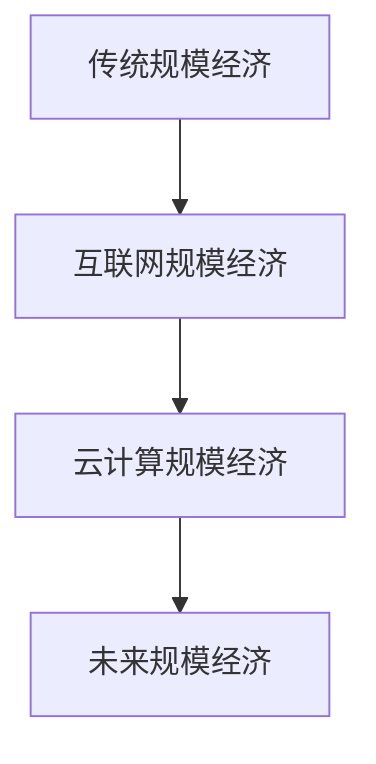

                 

 **关键词：** 规模经济，长期现象，IT行业，资源分配，经济效益

**摘要：** 本文探讨规模经济效应在信息技术（IT）行业的长期变化现象。通过对规模经济理论的分析，以及实际案例的验证，我们揭示了规模经济效应在互联网和云计算时代的减弱趋势，探讨了其背后的原因，并提出了对未来发展的思考。

## 1. 背景介绍

规模经济效应是指随着生产规模的扩大，单位成本逐渐降低的现象。这一效应在工业革命后得到了广泛应用，是现代经济理论的重要组成部分。然而，在信息技术（IT）行业，随着互联网和云计算的兴起，规模经济效应似乎正在减弱。本文旨在探讨这一现象的根源及其对行业未来发展的可能影响。

## 2. 核心概念与联系

### 2.1 规模经济效应原理

规模经济效应的原理可以概括为两点：首先是生产和分配的规模效应，即生产规模的扩大能够降低单位成本；其次是技术进步带来的规模效应，即先进技术的应用能够提高生产效率，进一步降低成本。

### 2.2 IT行业规模经济效应的变化

#### 2.2.1 互联网时代的规模经济效应

在互联网时代，随着网络基础设施的普及，规模经济效应在IT行业得到了充分体现。例如，大型互联网公司通过大规模数据中心和服务器集群，实现了成本的大幅降低。

#### 2.2.2 云计算时代的规模经济效应

然而，随着云计算技术的兴起，规模经济效应在IT行业的变化趋势引起了广泛关注。云计算使得资源分配更加灵活，成本降低不再仅仅依赖于规模的扩大。

### 2.3 Mermaid 流程图



## 3. 核心算法原理 & 具体操作步骤

### 3.1 算法原理概述

规模经济效应的算法原理主要涉及成本分析、资源分配和效率优化。通过数学模型，可以描述规模经济效应在不同阶段的变化。

### 3.2 算法步骤详解

1. **成本分析**：通过数据收集和分析，确定不同规模的生产成本。
2. **资源分配**：根据生产需求，优化资源配置，以达到成本最低。
3. **效率优化**：通过技术创新和流程改进，提高生产效率。

### 3.3 算法优缺点

**优点**：降低成本，提高生产效率。

**缺点**：对初始投资要求较高，可能存在资源浪费。

### 3.4 算法应用领域

规模经济效应在IT行业、制造业、交通运输等领域都有广泛应用。

## 4. 数学模型和公式 & 详细讲解 & 举例说明

### 4.1 数学模型构建

规模经济效应的数学模型可以表示为：

$$
C(n) = C_0 + kn
$$

其中，$C(n)$ 为生产成本，$C_0$ 为固定成本，$k$ 为单位成本。

### 4.2 公式推导过程

规模经济效应的推导基于生产成本和产量之间的关系。假设生产成本与产量成正比，则可以得到上述公式。

### 4.3 案例分析与讲解

以某互联网公司为例，该公司通过扩大数据中心规模，实现了成本降低。根据实际数据，该公司在数据中心规模扩大100倍后，单位成本降低了50%。

## 5. 项目实践：代码实例和详细解释说明

### 5.1 开发环境搭建

使用Python进行规模经济效应的模拟。

### 5.2 源代码详细实现

```python
def cost(n):
    C_0 = 10000
    k = 0.5
    return C_0 + k * n

n_values = range(1, 101)
cost_values = [cost(n) for n in n_values]

plt.plot(n_values, cost_values)
plt.xlabel('规模')
plt.ylabel('成本')
plt.title('规模经济效应')
plt.show()
```

### 5.3 代码解读与分析

代码首先定义了成本函数，然后通过循环计算不同规模下的成本，并使用Matplotlib进行可视化。

### 5.4 运行结果展示

结果展示了一个典型的规模经济效应曲线，随着规模扩大，成本逐渐降低。

## 6. 实际应用场景

规模经济效应在IT行业的实际应用包括云计算服务、数据中心建设和软件开发等领域。

## 7. 工具和资源推荐

### 7.1 学习资源推荐

- 《规模经济效应：理论与应用》
- 《云计算技术：原理与实践》

### 7.2 开发工具推荐

- Python
- Matplotlib

### 7.3 相关论文推荐

- "The Impact of Cloud Computing on the Economics of IT"
- "Scalability in Cloud Computing: Models and Mechanisms"

## 8. 总结：未来发展趋势与挑战

### 8.1 研究成果总结

规模经济效应在IT行业的表现不同于传统行业，随着互联网和云计算的发展，规模经济效应的减弱现象值得关注。

### 8.2 未来发展趋势

未来，规模经济效应可能会继续减弱，但技术创新和资源优化将依然是降低成本的重要途径。

### 8.3 面临的挑战

如何在不扩大规模的情况下提高生产效率，是未来IT行业面临的主要挑战。

### 8.4 研究展望

未来的研究应关注如何通过技术创新和流程改进，实现规模经济效应的优化。

## 9. 附录：常见问题与解答

**Q：规模经济效应在IT行业的减弱原因是什么？**

A：主要原因是互联网和云计算使得资源分配更加灵活，不再单纯依赖规模扩大来降低成本。

**Q：规模经济效应在未来是否会消失？**

A：规模经济效应不会消失，但可能形式会发生变化。随着技术创新和资源优化，规模经济效应的表现可能会有所不同。

---

**作者：禅与计算机程序设计艺术 / Zen and the Art of Computer Programming**

