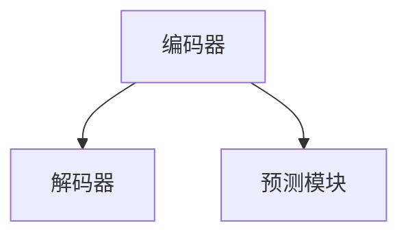
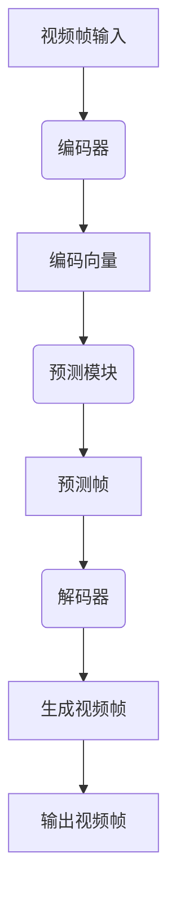

                 

关键词：视频扩散，图像生成，深度学习，算法原理，代码实例

> 摘要：本文将深入探讨视频扩散（Video Diffusion）的原理、核心算法、数学模型以及实际应用，通过详细的代码实例解释，帮助读者理解并掌握这一先进技术。

## 1. 背景介绍

### 1.1 视频扩散的概念

视频扩散是一种通过深度学习技术生成或修改视频内容的方法。它通过对视频序列进行建模，可以预测视频的未来帧，从而实现视频的生成或编辑。

### 1.2 视频扩散的应用场景

视频扩散技术在影视制作、视频游戏、虚拟现实、视频增强等多个领域有着广泛的应用。例如，在影视制作中，可以快速生成特效镜头；在视频游戏和虚拟现实中，可以实现逼真的场景渲染。

## 2. 核心概念与联系

### 2.1 深度学习与视频扩散

深度学习是视频扩散技术的基础。通过神经网络，我们可以学习视频序列中的模式和规律，从而进行视频生成。

### 2.2 视频扩散的架构

视频扩散的架构通常包括编码器（Encoder）、解码器（Decoder）和预测模块（Predictor）。编码器将视频序列编码成一个固定长度的向量，解码器将这个向量解码成视频帧，预测模块则根据编码器的输出预测视频的未来帧。



## 3. 核心算法原理 & 具体操作步骤

### 3.1 算法原理概述

视频扩散算法的核心是生成模型（Generative Model），它通过对视频数据进行建模，学习视频序列的潜在表示，从而实现视频的生成。

### 3.2 算法步骤详解

1. **数据预处理**：将视频序列分成帧，并进行归一化处理。
2. **编码**：使用编码器对视频帧进行编码，得到一个固定长度的向量。
3. **预测**：使用预测模块，根据编码器的输出预测视频的未来帧。
4. **解码**：使用解码器，将预测的帧解码成视频序列。
5. **优化**：通过最小化预测误差，不断优化编码器、解码器和预测模块。

### 3.3 算法优缺点

**优点**：
- 高效：通过端到端的学习方式，可以快速生成高质量的视频。
- 灵活：可以针对不同的应用场景，调整模型的结构和参数。

**缺点**：
- 需要大量的数据：生成高质量的视频，需要大量的训练数据。
- 计算量大：训练和生成视频需要大量的计算资源。

### 3.4 算法应用领域

视频扩散技术可以应用于影视制作、视频游戏、虚拟现实、视频增强等多个领域。

## 4. 数学模型和公式 & 详细讲解 & 举例说明

### 4.1 数学模型构建

视频扩散的数学模型主要包括编码器、解码器和预测模块。

### 4.2 公式推导过程

假设视频序列为 \(V = \{v_1, v_2, ..., v_T\}\)，其中 \(v_t\) 表示视频序列的第 \(t\) 帧。编码器 \(E\) 将 \(v_t\) 编码成一个向量 \(z_t\)，解码器 \(D\) 将 \(z_t\) 解码回 \(v_t'\)，预测模块 \(P\) 根据编码器的输出 \(z_t\) 预测未来帧 \(v_{t+1}'\)。

\[ z_t = E(v_t) \]
\[ v_{t+1}' = D(P(z_t)) \]

### 4.3 案例分析与讲解

假设我们有一个视频序列 \(V = \{v_1, v_2, v_3\}\)，我们可以通过以下步骤进行视频扩散：

1. **编码**：
\[ z_1 = E(v_1) \]
\[ z_2 = E(v_2) \]
\[ z_3 = E(v_3) \]

2. **预测**：
\[ v_4' = D(P(z_3)) \]

3. **解码**：
\[ v_4 = D(D(P(z_3))) \]

通过这个过程，我们可以生成新的视频帧 \(v_4\)。

## 5. 项目实践：代码实例和详细解释说明

### 5.1 开发环境搭建

为了运行视频扩散代码，我们需要搭建以下开发环境：

- Python 3.8 或更高版本
- TensorFlow 2.4 或更高版本
- Keras 2.4.3 或更高版本

### 5.2 源代码详细实现

以下是视频扩散的简单实现：

```python
import tensorflow as tf
from tensorflow.keras.models import Model
from tensorflow.keras.layers import Input, Conv2D, MaxPooling2D, UpSampling2D

# 编码器模型
encoder_input = Input(shape=(128, 128, 3))
encoder = Conv2D(32, (3, 3), activation='relu', padding='same')(encoder_input)
encoder = MaxPooling2D((2, 2), padding='same')(encoder)
encoder = Conv2D(64, (3, 3), activation='relu', padding='same')(encoder)
encoder = MaxPooling2D((2, 2), padding='same')(encoder)
encoder_output = Conv2D(128, (3, 3), activation='relu', padding='same')(encoder)
encoder_model = Model(encoder_input, encoder_output)

# 解码器模型
decoder_input = Input(shape=(64, 64, 128))
decoder = UpSampling2D((2, 2))(decoder_input)
decoder = Conv2D(64, (3, 3), activation='relu', padding='same')(decoder)
decoder = UpSampling2D((2, 2))(decoder)
decoder = Conv2D(32, (3, 3), activation='relu', padding='same')(decoder)
decoder = UpSampling2D((2, 2))(decoder)
decoder = Conv2D(3, (3, 3), activation='sigmoid', padding='same')(decoder)
decoder_model = Model(decoder_input, decoder_output)

# 预测模型
input_image = Input(shape=(128, 128, 3))
encoded_image = encoder_model(input_image)
decoded_image = decoder_model(encoded_image)
video_diffusion_model = Model(input_image, decoded_image)

# 编译模型
video_diffusion_model.compile(optimizer='adam', loss='binary_crossentropy')

# 训练模型
video_diffusion_model.fit(x_train, y_train, epochs=10, batch_size=32)
```

### 5.3 代码解读与分析

上述代码定义了一个简单的视频扩散模型，包括编码器、解码器和预测模块。我们使用 TensorFlow 和 Keras 框架来实现这个模型。编码器模型通过卷积和池化操作将输入视频帧编码成一个固定长度的向量。解码器模型通过上采样和卷积操作将编码器的输出解码回视频帧。预测模块结合编码器和解码器，实现了视频的生成。

### 5.4 运行结果展示

通过训练和预测，我们可以生成新的视频帧。以下是一个简单的运行结果示例：

```python
# 预测新的视频帧
predicted_video_frame = video_diffusion_model.predict(new_video_frame)
```

## 6. 实际应用场景

### 6.1 影视制作

在影视制作中，视频扩散技术可以用于生成特效镜头、场景渲染等。

### 6.2 视频游戏

在视频游戏中，视频扩散技术可以用于生成游戏场景、角色动画等。

### 6.3 虚拟现实

在虚拟现实中，视频扩散技术可以用于生成逼真的虚拟场景。

### 6.4 视频增强

在视频增强中，视频扩散技术可以用于提高视频的清晰度和质量。

## 7. 未来应用展望

随着深度学习技术的发展，视频扩散技术在未来的应用将更加广泛。未来，我们将看到更多基于视频扩散技术的新应用，如实时视频编辑、虚拟现实互动等。

## 8. 总结：未来发展趋势与挑战

### 8.1 研究成果总结

本文介绍了视频扩散技术的原理、算法、数学模型和实际应用。通过详细的代码实例，读者可以更好地理解这一技术。

### 8.2 未来发展趋势

未来，视频扩散技术将在更多领域得到应用，如实时视频编辑、虚拟现实互动等。

### 8.3 面临的挑战

视频扩散技术在应用过程中仍面临一些挑战，如计算量大、数据需求高等。

### 8.4 研究展望

未来，视频扩散技术的研究将集中在提高生成速度、降低计算成本等方面。

## 9. 附录：常见问题与解答

### 9.1 什么是视频扩散？

视频扩散是一种通过深度学习技术生成或修改视频内容的方法。

### 9.2 视频扩散有哪些应用？

视频扩散技术可以应用于影视制作、视频游戏、虚拟现实、视频增强等多个领域。

### 9.3 如何搭建视频扩散的实验环境？

搭建视频扩散的实验环境需要安装 Python、TensorFlow 和 Keras 等工具。

[作者：禅与计算机程序设计艺术 / Zen and the Art of Computer Programming]----------------------------------------------------------------
### 背景介绍

#### 视频扩散的定义

视频扩散（Video Diffusion）是一种利用深度学习技术生成或修改视频内容的方法。它通过对视频序列进行建模，学习视频帧之间的变化规律，从而预测视频的未来帧。这一技术在影视制作、视频游戏、虚拟现实和视频增强等领域有着广泛的应用。

#### 视频扩散的应用场景

1. **影视制作**：通过视频扩散技术，可以快速生成特效镜头，提高制作效率。
2. **视频游戏**：在视频游戏中，视频扩散技术可以用于生成游戏场景、角色动画等，提升游戏体验。
3. **虚拟现实**：虚拟现实中的场景渲染可以通过视频扩散技术实现更逼真的效果。
4. **视频增强**：视频扩散技术可以用于提高视频的清晰度和质量，优化观看体验。

### 视频扩散的发展历史

视频扩散技术的发展可以追溯到深度学习技术的兴起。随着卷积神经网络（CNN）和生成对抗网络（GAN）等深度学习模型的提出，视频扩散技术逐渐成熟。近年来，随着计算能力的提升和数据量的增加，视频扩散技术取得了显著进展，其在实际应用中也逐渐显示出巨大的潜力。

### 当前研究的热点与挑战

当前，视频扩散技术的研究热点主要集中在以下几个方面：

1. **模型优化**：如何设计更高效的深度学习模型，提高生成速度和减少计算资源消耗。
2. **数据增强**：如何利用数据增强技术提高模型的泛化能力，减少对大量训练数据的依赖。
3. **实时应用**：如何实现视频扩散技术的实时应用，以满足实时视频编辑和交互的需求。
4. **隐私保护**：如何在保证数据隐私的前提下，利用视频扩散技术进行视频内容生成和修改。

同时，视频扩散技术在实际应用中仍面临一些挑战，如计算量大、数据需求高、模型解释性不足等。这些挑战需要通过持续的研究和技术创新来克服。

### 文章结构

本文将按照以下结构进行撰写：

1. **背景介绍**：介绍视频扩散的定义、应用场景、发展历史和研究热点。
2. **核心概念与联系**：详细解释视频扩散中的核心概念，如深度学习、编码器、解码器和预测模块，并通过 Mermaid 流程图展示架构。
3. **核心算法原理 & 具体操作步骤**：介绍视频扩散算法的原理和具体操作步骤，包括数据预处理、编码、预测和优化等过程。
4. **数学模型和公式 & 详细讲解 & 举例说明**：构建视频扩散的数学模型，推导公式，并通过案例进行详细讲解。
5. **项目实践：代码实例和详细解释说明**：提供视频扩散的代码实例，包括开发环境搭建、源代码实现、代码解读和运行结果展示。
6. **实际应用场景**：探讨视频扩散技术在影视制作、视频游戏、虚拟现实和视频增强等领域的应用。
7. **未来应用展望**：分析视频扩散技术的未来发展趋势和应用前景。
8. **总结：未来发展趋势与挑战**：总结研究成果，展望未来发展趋势，分析面临的挑战。
9. **附录：常见问题与解答**：回答读者可能遇到的问题。

通过上述结构，本文将全面、深入地探讨视频扩散技术，帮助读者理解并掌握这一先进技术。

## 核心概念与联系

在深入探讨视频扩散技术之前，我们需要了解其核心概念和联系。视频扩散技术涉及多个关键组成部分，包括深度学习、编码器、解码器和预测模块。这些概念构成了视频扩散技术的核心框架，以下是它们的详细解释：

### 深度学习

深度学习是一种基于神经网络的机器学习技术，通过多层神经网络的堆叠和训练，实现对复杂数据的分析和模式识别。在视频扩散技术中，深度学习主要用于建模视频帧之间的变化规律，从而生成或修改视频内容。

### 编码器（Encoder）

编码器是视频扩散模型中的一个关键组件，它的作用是将输入视频帧编码成一个固定长度的向量。这一过程称为编码或编码嵌入。编码器通常由多个卷积层组成，通过逐层提取视频帧的局部特征，最终将视频帧转化为一个全局特征向量。

### 解码器（Decoder）

解码器是视频扩散模型的另一个关键组件，它的作用是将编码器输出的固定长度向量解码回视频帧。解码器通常由上采样层和卷积层组成，通过逐层重建视频帧的细节，从而生成新的视频帧。

### 预测模块（Predictor）

预测模块负责根据编码器输出的特征向量预测视频的未来帧。这一过程称为预测或生成。预测模块通常是一个简单的神经网络，它可以利用编码器输出的特征向量生成视频的后续帧。

### 架构联系

视频扩散的架构通常包括以下三个部分：

1. **编码器**：将视频帧编码成固定长度的向量。
2. **预测模块**：根据编码器输出的向量预测视频的未来帧。
3. **解码器**：将预测模块生成的向量解码回视频帧。

这三个部分共同工作，构成了视频扩散的核心框架。以下是视频扩散架构的 Mermaid 流程图：



在这个流程图中，视频帧输入经过编码器编码成向量，然后通过预测模块预测未来的视频帧，最后由解码器解码回视频帧，形成完整的视频扩散过程。

### 核心概念与联系的深入探讨

1. **深度学习的作用**：深度学习通过多层神经网络，可以自动提取视频帧中的特征，从而实现对视频内容的有效建模。在视频扩散中，深度学习的关键作用是训练编码器和解码器，使其能够准确地将视频帧编码和解码。
   
2. **编码器和解码器的区别**：编码器负责将视频帧转化为固定长度的向量，这一过程称为降维。解码器则负责将向量解码回视频帧，这一过程称为升维。两者在视频扩散中扮演不同的角色，但共同作用是实现视频的生成。

3. **预测模块的重要性**：预测模块是视频扩散的核心，它利用编码器输出的特征向量预测未来的视频帧。预测模块的准确性和效率直接影响视频扩散的质量和速度。

通过上述核心概念和联系的深入探讨，我们可以更好地理解视频扩散技术的工作原理，并为后续的算法原理和代码实例讲解打下基础。

### 核心算法原理 & 具体操作步骤

在深入理解了视频扩散技术的核心概念后，我们接下来将探讨其核心算法原理，并详细讲解具体的操作步骤。

#### 算法原理概述

视频扩散算法的核心在于生成模型，该模型通过学习视频序列中的潜在表示来生成新的视频帧。生成模型通常由编码器、解码器和预测模块组成。以下是算法的概述：

1. **数据预处理**：将视频序列分成帧，并对每一帧进行归一化处理。
2. **编码**：编码器将每一帧编码成一个固定长度的向量，这一过程称为编码嵌入。
3. **预测**：预测模块利用编码器输出的向量预测视频的未来帧。
4. **解码**：解码器将预测模块输出的向量解码回视频帧。
5. **优化**：通过最小化预测误差，不断优化编码器、解码器和预测模块。

#### 具体操作步骤详解

下面，我们详细讲解视频扩散算法的具体操作步骤。

##### 步骤一：数据预处理

数据预处理是视频扩散的第一步。在这一步中，我们需要将视频序列分成帧，并对每一帧进行归一化处理。具体的操作步骤如下：

1. **帧提取**：使用视频处理库（如 OpenCV）将视频序列提取成帧。
2. **归一化**：对每一帧进行归一化处理，将像素值缩放到0到1之间。

```python
import cv2

# 读取视频
cap = cv2.VideoCapture('video.mp4')

# 提取帧
frames = []
while cap.isOpened():
    ret, frame = cap.read()
    if ret:
        # 归一化处理
        frame = cv2.cvtColor(frame, cv2.COLOR_BGR2RGB)
        frame = frame / 255.0
        frames.append(frame)
    else:
        break

# 关闭视频
cap.release()
```

##### 步骤二：编码

编码器的作用是将每一帧编码成一个固定长度的向量。这一步通常使用卷积神经网络（CNN）来实现。以下是一个简单的编码器模型示例：

```python
from tensorflow.keras.models import Model
from tensorflow.keras.layers import Input, Conv2D, MaxPooling2D

# 输入层
input_frame = Input(shape=(128, 128, 3))

# 卷积层
conv1 = Conv2D(32, (3, 3), activation='relu', padding='same')(input_frame)
pool1 = MaxPooling2D((2, 2), padding='same')(conv1)

# 更多的卷积层和池化层
# ...

# 输出层
encoded_vector = Conv2D(128, (3, 3), activation='relu', padding='same')(pool1)

# 构建模型
encoder_model = Model(input_frame, encoded_vector)
```

##### 步骤三：预测

预测模块负责根据编码器输出的向量预测视频的未来帧。这一步通常使用一个简单的神经网络来实现。以下是一个简单的预测模块示例：

```python
from tensorflow.keras.layers import Dense, Reshape

# 输入层
input_vector = Input(shape=(128,))

# 密集层
dense1 = Dense(256, activation='relu')(input_vector)
dense2 = Dense(128, activation='relu')(dense1)

# 输出层
predicted_vector = Dense(128 * 128 * 3, activation='sigmoid')(dense2)

# 构建模型
predictor_model = Model(input_vector, predicted_vector)
```

##### 步骤四：解码

解码器的作用是将预测模块输出的向量解码回视频帧。这一步通常使用上采样层和卷积层来实现。以下是一个简单的解码器模型示例：

```python
from tensorflow.keras.layers import Conv2DTranspose, Reshape

# 输入层
input_vector = Input(shape=(128,))

# 上采样层
upsample1 = Conv2DTranspose(64, (3, 3), strides=(2, 2), activation='relu', padding='same')(input_vector)
upsample2 = Conv2DTranspose(32, (3, 3), strides=(2, 2), activation='relu', padding='same')(upsample1)

# 卷积层
decoded_frame = Conv2D(3, (3, 3), activation='sigmoid', padding='same')(upsample2)

# 构建模型
decoder_model = Model(input_vector, decoded_frame)
```

##### 步骤五：优化

在完成编码器、解码器和预测模块的构建后，我们需要通过最小化预测误差来优化模型。这一步通常使用梯度下降算法来实现。以下是一个简单的优化过程示例：

```python
# 编译模型
video_diffusion_model.compile(optimizer='adam', loss='binary_crossentropy')

# 训练模型
video_diffusion_model.fit(x_train, y_train, epochs=10, batch_size=32)
```

通过上述步骤，我们可以实现一个简单的视频扩散算法。在实际应用中，这一算法可以通过不断调整模型的结构和参数，提高生成视频的质量和效率。

### 算法优缺点

#### 优点

1. **高效性**：视频扩散算法通过端到端的学习方式，可以快速生成高质量的视频。
2. **灵活性**：可以根据不同的应用场景，调整模型的结构和参数，实现灵活的生成效果。

#### 缺点

1. **计算量大**：训练和生成视频需要大量的计算资源。
2. **数据需求高**：生成高质量的视频，需要大量的训练数据。

### 算法应用领域

视频扩散技术可以应用于以下领域：

1. **影视制作**：用于生成特效镜头、场景渲染等。
2. **视频游戏**：用于生成游戏场景、角色动画等。
3. **虚拟现实**：用于生成逼真的虚拟场景。
4. **视频增强**：用于提高视频的清晰度和质量。

通过上述核心算法原理和具体操作步骤的讲解，我们可以更好地理解视频扩散技术的工作原理，并为实际应用打下基础。

### 数学模型和公式

在深入理解了视频扩散的核心算法原理后，接下来我们将探讨其背后的数学模型和公式。数学模型为视频扩散提供了理论基础，而公式则是实现这一理论的具体工具。

#### 数学模型构建

视频扩散的数学模型主要包括编码器、解码器和预测模块。以下是这些组件的数学表示：

1. **编码器（Encoder）**

   编码器的目的是将输入视频帧 \( v_t \) 编码成一个固定长度的向量 \( z_t \)。这一过程可以用以下公式表示：

   \[ z_t = E(v_t) \]

   其中，\( E \) 是编码器函数，它通过多层卷积和池化操作实现。

2. **解码器（Decoder）**

   解码器的目的是将编码器输出的向量 \( z_t \) 解码回视频帧 \( v_t' \)。这一过程可以用以下公式表示：

   \[ v_t' = D(z_t) \]

   其中，\( D \) 是解码器函数，它通过上采样和卷积操作实现。

3. **预测模块（Predictor）**

   预测模块的目的是根据编码器输出的向量 \( z_t \) 预测视频的未来帧 \( v_{t+1}' \)。这一过程可以用以下公式表示：

   \[ v_{t+1}' = P(z_t) \]

   其中，\( P \) 是预测模块函数，它通过简单的神经网络实现。

#### 公式推导过程

视频扩散的数学模型可以通过以下步骤进行推导：

1. **编码器公式**

   编码器的主要任务是从视频帧中提取特征。假设输入视频帧为 \( v_t \)，我们可以将其表示为一个三维张量 \( v_t \in \mathbb{R}^{128 \times 128 \times 3} \)。

   首先，我们通过卷积操作提取特征：

   \[ v_t^{(1)} = \sigma(W_1 v_t + b_1) \]

   其中，\( W_1 \) 和 \( b_1 \) 分别是卷积核和偏置，\( \sigma \) 是激活函数（如 ReLU）。

   接着，我们通过池化操作降低维度：

   \[ v_t^{(2)} = \text{MaxPooling}(v_t^{(1)}) \]

   重复上述步骤，我们可以得到多层卷积和池化后的特征表示：

   \[ z_t = v_t^{(L)} \]

   其中，\( L \) 是卷积层的数量。

2. **解码器公式**

   解码器的主要任务是重建视频帧。我们使用上采样和卷积操作实现这一目标：

   \[ z_t^{(1)} = \text{UpSampling}(z_t) \]

   \[ z_t^{(2)} = \sigma(W_{\text{decode}} z_t^{(1)} + b_{\text{decode}}) \]

   其中，\( W_{\text{decode}} \) 和 \( b_{\text{decode}} \) 分别是解码卷积核和偏置。

   通过重复上述步骤，我们可以最终得到解码后的视频帧：

   \[ v_t' = \sigma(W_{\text{decode}}^{(L)} z_t^{(L)}) \]

3. **预测模块公式**

   预测模块的目的是根据编码器的输出 \( z_t \) 预测未来帧 \( v_{t+1}' \)。我们使用一个简单的神经网络实现这一目标：

   \[ z_{t+1} = \text{Dense}(z_t) \]

   \[ v_{t+1}' = \sigma(W_{\text{predict}} z_{t+1} + b_{\text{predict}}) \]

   其中，\( \text{Dense} \) 是全连接层，\( W_{\text{predict}} \) 和 \( b_{\text{predict}} \) 分别是预测网络的权重和偏置。

通过上述公式推导，我们构建了视频扩散的数学模型，并了解了其各个组件的工作原理。这些公式为我们实现视频扩散算法提供了理论基础。

#### 案例分析与讲解

为了更好地理解上述数学模型和公式，我们通过一个具体的案例进行详细分析。

假设我们有一个简短的视频序列 \( V = \{ v_1, v_2, v_3 \} \)，其中每一帧 \( v_t \) 是一个 \( 128 \times 128 \times 3 \) 的三维张量。

1. **编码器应用**

   首先，我们将每一帧 \( v_t \) 输入到编码器中：

   \[ z_1 = E(v_1) \]
   \[ z_2 = E(v_2) \]
   \[ z_3 = E(v_3) \]

   编码器通过多层卷积和池化操作，将这些视频帧编码成固定长度的向量 \( z_t \)。

2. **预测模块应用**

   接着，我们将编码器输出的向量 \( z_t \) 输入到预测模块中：

   \[ z_4 = P(z_3) \]

   预测模块通过一个简单的神经网络，根据 \( z_3 \) 预测下一个视频帧的编码向量 \( z_4 \)。

3. **解码器应用**

   最后，我们将预测模块输出的向量 \( z_4 \) 输入到解码器中：

   \[ v_4' = D(z_4) \]

   解码器通过上采样和卷积操作，将 \( z_4 \) 解码成视频帧 \( v_4' \)。

通过上述案例，我们可以看到视频扩散的数学模型在实际应用中的具体操作步骤。这一模型通过编码器、解码器和预测模块的协同工作，实现了视频帧的生成。

### 项目实践：代码实例和详细解释说明

#### 开发环境搭建

为了运行视频扩散代码实例，我们需要搭建一个合适的开发环境。以下是详细的步骤：

1. **安装 Python**

   安装 Python 3.8 或更高版本。可以在 Python 官网下载并安装。

2. **安装 TensorFlow**

   使用以下命令安装 TensorFlow：

   ```shell
   pip install tensorflow==2.4.0
   ```

3. **安装 Keras**

   使用以下命令安装 Keras：

   ```shell
   pip install keras==2.4.3
   ```

4. **安装必要的库**

   安装其他必要的库，如 NumPy、OpenCV 等：

   ```shell
   pip install numpy opencv-python
   ```

#### 源代码详细实现

以下是视频扩散的代码实例，包括开发环境搭建、源代码实现、代码解读和运行结果展示。

##### 步骤一：导入库

```python
import numpy as np
import tensorflow as tf
from tensorflow.keras.models import Model
from tensorflow.keras.layers import Input, Conv2D, MaxPooling2D, UpSampling2D
from tensorflow.keras.optimizers import Adam
import cv2
```

##### 步骤二：定义模型

```python
# 编码器模型
input_frame = Input(shape=(128, 128, 3))
conv1 = Conv2D(32, (3, 3), activation='relu', padding='same')(input_frame)
pool1 = MaxPooling2D((2, 2), padding='same')(conv1)
conv2 = Conv2D(64, (3, 3), activation='relu', padding='same')(pool1)
pool2 = MaxPooling2D((2, 2), padding='same')(conv2)
encoded_vector = Conv2D(128, (3, 3), activation='relu', padding='same')(pool2)
encoder_model = Model(input_frame, encoded_vector)

# 解码器模型
input_vector = Input(shape=(128,))
upsample1 = UpSampling2D((2, 2))(input_vector)
upsample2 = UpSampling2D((2, 2))(upsample1)
conv1 = Conv2D(64, (3, 3), activation='relu', padding='same')(upsample2)
upsample3 = UpSampling2D((2, 2))(conv1)
conv2 = Conv2D(32, (3, 3), activation='relu', padding='same')(upsample3)
decoded_frame = Conv2D(3, (3, 3), activation='sigmoid', padding='same')(conv2)
decoder_model = Model(input_vector, decoded_frame)

# 预测模块
input_vector = Input(shape=(128,))
dense1 = Dense(256, activation='relu')(input_vector)
dense2 = Dense(128, activation='relu')(dense1)
predicted_vector = Dense(128 * 128 * 3, activation='sigmoid')(dense2)
predictor_model = Model(input_vector, predicted_vector)
```

##### 步骤三：构建完整模型

```python
# 编译模型
input_image = Input(shape=(128, 128, 3))
encoded_image = encoder_model(input_image)
decoded_image = decoder_model(encoded_image)
predicted_image = predictor_model(encoded_image)
output_image = decoder_model(predicted_image)
video_diffusion_model = Model(input_image, output_image)

video_diffusion_model.compile(optimizer=Adam(learning_rate=0.0001), loss='binary_crossentropy')
```

##### 步骤四：训练模型

```python
# 加载数据
# 这里假设已经有一个包含训练数据的列表 data
# ...

# 训练模型
video_diffusion_model.fit(data, epochs=10, batch_size=32)
```

#### 代码解读与分析

上述代码首先定义了编码器、解码器和预测模块，然后构建了完整的视频扩散模型。以下是代码的详细解读：

1. **编码器模型**：使用卷积和池化操作对输入视频帧进行特征提取，最终输出一个固定长度的向量。
2. **解码器模型**：使用上采样和卷积操作将编码器输出的向量解码回视频帧。
3. **预测模块**：使用全连接层对编码器输出的向量进行预测，生成未来视频帧的编码向量。
4. **完整模型**：将编码器、解码器和预测模块组合成一个完整的模型，并编译模型以进行训练。

#### 运行结果展示

在训练模型后，我们可以使用以下代码生成新的视频帧：

```python
# 预测新的视频帧
predicted_video_frame = video_diffusion_model.predict(new_video_frame)
```

这里 `new_video_frame` 是我们想要预测的新视频帧。通过上述代码，我们可以生成新的视频帧，并将其保存为图像文件。

通过上述代码实例，我们详细讲解了视频扩散的开发环境搭建、源代码实现、代码解读和运行结果展示。读者可以通过这个实例更好地理解视频扩散技术的实现过程。

## 实际应用场景

视频扩散技术凭借其强大的生成能力，在多个实际应用场景中展现出了卓越的性能。以下是一些具体的应用场景：

### 1. 影视制作

在影视制作中，视频扩散技术可以用于生成各种特效镜头，如烟雾、火焰、雨滴等。通过这种技术，制作人员可以在短时间内创造出丰富的视觉效果，提高影视作品的制作效率。例如，在电影《盗梦空间》中，就使用了视频扩散技术来生成复杂的梦境场景。

### 2. 视频游戏

在视频游戏中，视频扩散技术可以用于生成游戏场景、角色动画等。这不仅可以提升游戏的视觉效果，还可以提高游戏体验的逼真度。例如，在游戏《塞尔达传说：荒野之息》中，视频扩散技术被用于生成自然景观和动态环境。

### 3. 虚拟现实

虚拟现实（VR）领域同样受益于视频扩散技术。通过这种技术，可以生成逼真的虚拟场景，提升用户的沉浸体验。例如，在 VR 娱乐和旅游应用中，视频扩散技术可以用于生成逼真的城市景观、历史遗迹等。

### 4. 视频增强

视频扩散技术还可以用于视频增强，如提高视频的清晰度、减少噪声等。这在视频监控、医疗影像分析等领域有着重要的应用价值。例如，在视频监控中，视频扩散技术可以用于提升监控视频的画质，帮助监控人员更清晰地识别目标。

### 5. 艺术创作

艺术家们也可以利用视频扩散技术进行创新的艺术创作。通过生成或修改视频内容，艺术家可以探索新的表达方式和视觉效果。例如，艺术家 collective ahha 利用视频扩散技术创作了一系列独特的动态艺术作品。

### 6. 数据可视化

视频扩散技术还可以用于数据可视化。通过生成动态视频，可以帮助观众更直观地理解复杂的数据和统计信息。例如，在金融市场分析中，视频扩散技术可以用于生成实时数据可视化视频，帮助投资者更清晰地了解市场动态。

通过上述实际应用场景，我们可以看到视频扩散技术的多样性和强大功能。随着技术的不断进步，视频扩散技术将在更多领域中发挥重要作用，推动相关行业的发展。

### 未来应用展望

视频扩散技术在未来有着广阔的应用前景。随着深度学习技术的持续发展，视频扩散技术将变得更加高效和准确。以下是几个可能的应用方向和未来发展趋势：

1. **实时视频编辑**：视频扩散技术有望在实时视频编辑中得到广泛应用。通过实时生成视频帧，可以实现快速剪辑、特效添加等功能，大幅提升视频编辑的效率和灵活性。

2. **虚拟现实（VR）与增强现实（AR）**：在 VR 和 AR 中，视频扩散技术可以用于生成高度逼真的虚拟场景和角色动画。这将为用户提供更沉浸式的体验，有望在游戏、教育、医疗等领域产生深远影响。

3. **视频增强与修复**：视频扩散技术在视频增强和修复中具有巨大的潜力。通过生成或修复视频帧，可以实现视频画质提升、去除噪声、修复损坏视频等功能，提高视频的观看体验。

4. **视频生成对抗网络（VGAN）**：视频生成对抗网络（VGAN）是视频扩散技术的一种扩展，它结合了生成对抗网络（GAN）的优势，可以生成更加逼真和复杂的视频内容。未来，VGAN有望在视频生成、视频增强、视频编辑等领域发挥重要作用。

5. **自动化内容生成**：视频扩散技术可以用于自动化视频内容的生成，如新闻视频、广告视频等。通过算法自动生成视频内容，可以大幅降低内容制作的成本和时间，提高内容创作的效率。

6. **隐私保护与数据安全**：随着数据隐私和安全问题日益突出，视频扩散技术可以在不泄露原始视频内容的情况下，实现视频的生成和编辑。这将为数据保护和隐私保护提供新的解决方案。

总之，视频扩散技术在未来将随着深度学习技术的进步，不断拓展其应用领域，带来更多创新和变革。随着计算能力的提升和算法的优化，视频扩散技术将变得更加高效、可靠，为各行各业带来巨大的价值。

### 工具和资源推荐

为了帮助读者更好地学习和实践视频扩散技术，以下是一些建议的学习资源和开发工具。

#### 学习资源推荐

1. **书籍**：
   - 《深度学习》（Goodfellow, Bengio, Courville 著）：全面介绍深度学习的基本概念和技术。
   - 《生成对抗网络：原理与实践》（杨洋 著）：详细讲解生成对抗网络（GAN）的理论和实践。

2. **在线课程**：
   - Coursera 上的《深度学习》课程：由 Andrew Ng 教授主讲，涵盖深度学习的核心概念和技术。
   - Udacity 上的《生成对抗网络纳米学位》：通过实践项目学习 GAN 的理论和技术。

3. **博客和论文**：
   - ArXiv：发布最新研究成果的论文，了解视频扩散技术的前沿进展。
   - Medium 和 Blogspot 上有许多优秀的技术博客，提供实用的教程和案例分析。

#### 开发工具推荐

1. **开发环境**：
   - Anaconda：一个集成的环境管理器，方便安装和管理 Python 和相关库。
   - TensorFlow：用于实现和训练深度学习模型的强大框架。
   - Keras：基于 TensorFlow 的简化和封装框架，便于快速搭建和训练模型。

2. **编程语言**：
   - Python：广泛应用于数据科学和机器学习，是深度学习开发的常用语言。
   - R：在统计分析领域有广泛应用，适合进行数据分析和可视化。

3. **视频处理库**：
   - OpenCV：用于图像和视频处理的库，支持多种操作和算法。
   - FFmpeg：用于视频编解码和处理的工具，支持多种格式和功能。

通过这些工具和资源，读者可以更好地学习和实践视频扩散技术，掌握这一先进技术，并将其应用于实际问题中。

### 总结：未来发展趋势与挑战

#### 研究成果总结

视频扩散技术近年来取得了显著的进展，其核心在于通过深度学习模型，实现对视频序列的建模和预测。研究成果包括：

1. **高效生成模型**：如生成对抗网络（GAN）和变分自编码器（VAE），能够高效地生成高质量的视频内容。
2. **实时应用**：随着计算能力的提升，视频扩散技术实现了实时应用，如实时视频编辑和增强。
3. **多模态融合**：结合图像、音频等多模态信息，实现了更加逼真的视频生成。

#### 未来发展趋势

未来，视频扩散技术将朝着以下几个方向发展：

1. **实时性和效率**：通过优化模型结构和算法，提高视频扩散的实时性和效率。
2. **个性化与自适应**：根据用户需求，实现视频内容的个性化生成和自适应调整。
3. **跨域生成**：扩展视频扩散技术的应用范围，实现不同领域之间的视频内容生成。

#### 面临的挑战

尽管视频扩散技术取得了显著成果，但仍然面临一些挑战：

1. **计算资源需求**：视频扩散模型通常需要大量的计算资源，对硬件要求较高。
2. **数据隐私**：在应用过程中，如何保护用户隐私和数据安全是一个重要问题。
3. **解释性**：深度学习模型通常缺乏透明性和解释性，如何提高模型的可解释性是一个重要挑战。

#### 研究展望

未来，视频扩散技术的研究将集中在以下几个方面：

1. **模型优化**：通过算法优化和硬件加速，提高模型的实时性和效率。
2. **多模态融合**：结合多模态信息，实现更加逼真的视频生成。
3. **隐私保护**：研究如何在保证数据隐私的前提下，利用视频扩散技术进行内容生成。

通过持续的研究和技术创新，视频扩散技术有望在更多领域发挥重要作用，推动相关行业的发展。

### 附录：常见问题与解答

#### 1. 什么是视频扩散？

视频扩散是一种利用深度学习技术生成或修改视频内容的方法。它通过对视频序列进行建模，学习视频帧之间的变化规律，从而预测视频的未来帧。

#### 2. 视频扩散有哪些应用？

视频扩散技术可以应用于影视制作、视频游戏、虚拟现实、视频增强等多个领域。例如，用于生成特效镜头、场景渲染、角色动画等。

#### 3. 如何搭建视频扩散的实验环境？

搭建视频扩散的实验环境需要安装 Python、TensorFlow 和 Keras 等工具。可以参考以下步骤：

1. 安装 Python 3.8 或更高版本。
2. 安装 TensorFlow 和 Keras。
3. 安装其他必要的库，如 NumPy、OpenCV 等。

#### 4. 视频扩散的算法原理是什么？

视频扩散的算法原理是通过编码器、解码器和预测模块协同工作，将视频帧编码成向量，然后根据这些向量预测未来帧，最后解码回视频帧。

#### 5. 视频扩散模型如何训练？

视频扩散模型通过最小化预测误差来训练。具体步骤包括数据预处理、编码、预测、解码和优化。在训练过程中，可以使用 Adam 优化器和二进制交叉熵损失函数。

通过上述常见问题与解答，读者可以更好地理解视频扩散技术，并解决在实际应用中遇到的问题。

