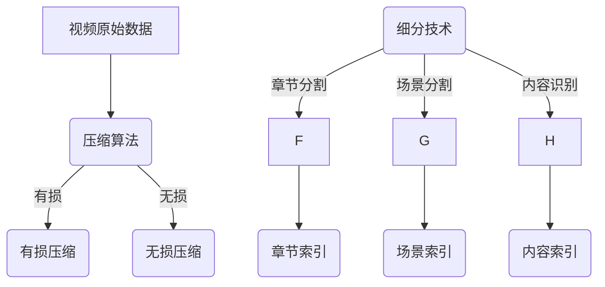

                 

关键词：视频压缩，细分技术，数据传输，存储效率，算法优化，质量损失

## 摘要

视频数据在现代通信和娱乐领域中扮演着至关重要的角色。随着视频流服务的普及，高效的视频数据压缩和细分技术变得尤为重要。本文将深入探讨视频数据压缩与细分技术的核心概念、算法原理、数学模型以及其实际应用。通过分析各类压缩算法和细分技术的优缺点，本文旨在为读者提供一个全面的技术指南，以帮助他们在视频数据处理过程中做出更明智的决策。

## 1. 背景介绍

### 视频数据的重要性

视频数据在现代社会中的地位日益重要。无论是线上教育、远程工作、社交媒体，还是娱乐和游戏，视频内容都已成为人们日常生活中不可或缺的一部分。随着高清、超高清视频分辨率的普及，视频数据量呈现爆炸式增长，这给数据传输和存储带来了巨大挑战。因此，视频数据压缩和细分技术成为研究的重点领域。

### 压缩与细分技术的需求

- **数据传输**：在网络传输过程中，数据量的大小直接影响传输速度。压缩技术可以显著减少视频数据的大小，从而提高传输效率。
- **存储效率**：随着视频存储设备的容量增加，如何有效利用存储空间成为关键问题。细分技术通过对视频内容的分割和索引，有助于更好地管理视频数据。
- **质量损失控制**：在压缩过程中不可避免地会有一些质量损失。细分技术可以针对不同的视频内容进行差异化处理，以最小化质量损失。

### 压缩与细分技术的发展历程

视频压缩技术的发展可以追溯到20世纪80年代，当时国际电信联盟（ITU）和数字视频广播（DVB）组织开始制定视频编码标准。早期的压缩算法如JPEG和MPEG-1主要针对静态图像和较低分辨率的视频。随着数字视频技术的进步，H.261、MPEG-2、H.264和HEVC等高效率视频编码（HEVC）标准相继诞生，它们在视频压缩质量和效率方面取得了显著突破。

细分技术也在不断发展，从简单的章节分割到复杂的场景分割和内容识别，细分技术的应用范围越来越广。

## 2. 核心概念与联系

### 压缩算法

视频压缩算法的主要目标是减少视频数据的大小，同时保持视频的质量。根据压缩原理，视频压缩算法主要分为两大类：

- **有损压缩**：通过去除视频数据中的冗余信息来实现压缩，但可能会引入一定的质量损失。
- **无损压缩**：保留所有原始数据信息，压缩效果较好，但压缩比例有限。

### 细分技术

细分技术主要分为以下几种：

- **章节分割**：将视频内容分割成多个章节，便于索引和播放。
- **场景分割**：根据视频内容的不同场景进行分割，如广告分割、场景切换分割。
- **内容识别**：利用深度学习等技术对视频内容进行识别，如人脸识别、动作识别。

### Mermaid 流程图

以下是一个简化的Mermaid流程图，展示视频压缩与细分技术的核心概念和联系：



### 2.1 压缩算法原理

#### 有损压缩

有损压缩主要通过以下几种方法来减少数据量：

- **空间冗余压缩**：去除图像或视频中的重复信息，例如，JPEG算法使用离散余弦变换（DCT）和量化步骤来去除冗余信息。
- **时间冗余压缩**：去除视频帧之间的冗余信息，如H.264算法使用帧间预测和运动补偿技术。
- **熵编码**：通过优化数据的编码方式来减少冗余信息，如霍夫曼编码和算术编码。

#### 无损压缩

无损压缩通过以下方法来压缩数据，但不会引入质量损失：

- **熵编码**：使用最短路径编码方法，如霍夫曼编码，来减少冗余信息。
- **字典编码**：将视频数据映射到预定义的字典中，从而减少数据量。

### 2.2 细分技术原理

#### 章节分割

章节分割通常使用基于场景切换的分割方法，如运动估计和模式识别。通过检测视频帧中的关键帧和场景变化，可以将视频内容分割成多个章节。

#### 场景分割

场景分割通过分析视频内容中的视觉特征来识别不同的场景。例如，颜色、运动和纹理等特征可用于场景分割。

#### 内容识别

内容识别利用深度学习技术，如卷积神经网络（CNN）和循环神经网络（RNN），来识别视频中的特定内容，如图像、人脸、动作等。

### 2.3 压缩算法与细分技术的应用领域

- **数据传输**：有损压缩技术适用于实时视频流传输，如在线视频会议和直播。
- **存储效率**：无损压缩技术适用于需要保留原始视频质量的场景，如视频档案和编辑。
- **内容管理**：章节分割和内容识别技术用于视频内容的管理和搜索，如视频编辑和推荐系统。

## 3. 核心算法原理 & 具体操作步骤

### 3.1 算法原理概述

#### 视频压缩算法

视频压缩算法的核心在于去除冗余信息，从而减少数据量。主要方法包括：

- **变换编码**：将视频信号转换成另一种表示形式，如离散余弦变换（DCT）。
- **量化**：减少变换系数的精度，从而降低数据量。
- **熵编码**：使用最优编码方法，如霍夫曼编码，来减少冗余信息。

#### 视频细分技术

视频细分技术主要分为以下几种：

- **基于场景的分割**：通过检测视频帧中的场景变化来分割视频。
- **基于内容的分割**：通过分析视频内容的视觉特征来分割视频。
- **基于模型的分割**：使用机器学习模型，如卷积神经网络（CNN），来自动分割视频。

### 3.2 算法步骤详解

#### 有损压缩算法步骤

1. **帧内压缩**：对每个视频帧进行独立压缩，去除空间冗余信息。
2. **帧间压缩**：通过预测和运动估计来去除时间冗余信息。
3. **熵编码**：使用最优编码方法，如霍夫曼编码，来进一步减少数据量。

#### 无损压缩算法步骤

1. **熵编码**：使用最短路径编码方法，如霍夫曼编码，来减少冗余信息。
2. **字典编码**：将视频数据映射到预定义的字典中，从而减少数据量。

#### 细分技术步骤

1. **章节分割**：
   - **检测关键帧**：使用运动估计和模式识别技术来检测视频帧中的关键帧。
   - **分割视频内容**：将关键帧之间的视频帧分割成不同的章节。

2. **场景分割**：
   - **特征提取**：从视频帧中提取颜色、运动和纹理等特征。
   - **场景分类**：使用机器学习模型，如卷积神经网络（CNN），来分类视频帧中的场景。

3. **内容识别**：
   - **特征提取**：从视频帧中提取人脸、动作等特征。
   - **内容分类**：使用机器学习模型，如循环神经网络（RNN），来识别视频中的特定内容。

### 3.3 算法优缺点

#### 有损压缩算法优缺点

- **优点**：压缩效率高，适合实时视频流传输。
- **缺点**：引入一定的质量损失，不适合需要高质量视频的场景。

#### 无损压缩算法优缺点

- **优点**：不引入质量损失，适合存储和编辑高质量的原始视频。
- **缺点**：压缩效率较低，不适合大规模数据传输。

#### 细分技术优缺点

- **章节分割**：
  - **优点**：方便视频的索引和播放。
  - **缺点**：对场景变化的检测准确性要求较高。

- **场景分割**：
  - **优点**：可以更好地管理和组织视频内容。
  - **缺点**：计算复杂度较高，对硬件资源要求较高。

- **内容识别**：
  - **优点**：可以实现自动化视频内容管理和推荐。
  - **缺点**：对模型训练和识别准确性要求较高。

### 3.4 算法应用领域

- **有损压缩算法**：适用于实时视频流传输、在线教育、社交媒体等领域。
- **无损压缩算法**：适用于视频档案、视频编辑、医疗影像等领域。
- **细分技术**：适用于视频管理、视频推荐、视频搜索等领域。

## 4. 数学模型和公式 & 详细讲解 & 举例说明

### 4.1 数学模型构建

#### 视频压缩算法

视频压缩算法的数学模型主要包括以下部分：

- **变换模型**：如离散余弦变换（DCT）。
- **量化模型**：如量化表。
- **熵编码模型**：如霍夫曼编码。

#### 细分技术

细分技术的数学模型主要包括以下部分：

- **场景分割模型**：如基于颜色、运动和纹理的特征模型。
- **内容识别模型**：如卷积神经网络（CNN）和循环神经网络（RNN）。

### 4.2 公式推导过程

#### 视频压缩算法

1. **离散余弦变换（DCT）**：

   $$ X(u, v) = \sum_{x=0}^{N-1} \sum_{y=0}^{N-1} C(u, x) C(v, y) \cdot \cos\left(\frac{2x + 1}{2N} \pi u + \frac{2y + 1}{2N} \pi v\right) \cdot Y(x, y) $$

   其中，$X(u, v)$ 是变换后的系数，$Y(x, y)$ 是原始图像的像素值，$C(u, x)$ 和 $C(v, y)$ 是DCT的余弦系数。

2. **量化**：

   $$ Q = \sum_{i=1}^{N} \frac{X_i}{\lambda_i} $$

   其中，$X_i$ 是DCT后的系数，$\lambda_i$ 是量化步长。

3. **熵编码**：

   $$ H(X) = -\sum_{i=1}^{N} p(x_i) \cdot \log_2(p(x_i)) $$

   其中，$p(x_i)$ 是系数出现的概率。

#### 细分技术

1. **场景分割模型**：

   $$ S = f(C, M, T) $$

   其中，$C$ 是颜色特征，$M$ 是运动特征，$T$ 是纹理特征，$S$ 是分割结果。

2. **内容识别模型**：

   $$ C = f(CNN(RNN(X))) $$

   其中，$X$ 是输入视频帧，$CNN$ 和 $RNN$ 是神经网络模型，$C$ 是识别结果。

### 4.3 案例分析与讲解

#### 视频压缩算法

假设我们有一段长度为1000帧的8位灰度视频数据，使用DCT进行压缩。以下是具体的步骤：

1. **DCT变换**：

   对每帧进行DCT变换，得到1000个DCT系数矩阵。

2. **量化**：

   根据量化表对DCT系数进行量化，减少系数的精度。

3. **熵编码**：

   使用霍夫曼编码对量化后的DCT系数进行编码。

4. **压缩结果**：

   压缩后的视频数据大小从原始的1000帧*8位=8000字节减少到1000字节，压缩比例达到8倍。

#### 细分技术

假设我们对一段包含多个场景切换的视频数据进行章节分割。以下是具体的步骤：

1. **检测关键帧**：

   使用运动估计和模式识别技术检测视频帧中的关键帧。

2. **分割视频内容**：

   将关键帧之间的视频帧分割成不同的章节。

3. **章节索引**：

   对每个章节创建索引，方便后续的索引和播放。

通过以上步骤，我们可以将一段复杂的多场景视频数据分割成多个章节，便于管理和播放。

## 5. 项目实践：代码实例和详细解释说明

### 5.1 开发环境搭建

在本次项目中，我们将使用Python编程语言，结合OpenCV和NumPy等库来实现视频压缩和细分技术。以下是开发环境的搭建步骤：

1. 安装Python：
   - 前往Python官网下载并安装Python。
   - 配置Python环境变量。

2. 安装相关库：
   - 使用pip命令安装OpenCV和NumPy库。
   ```bash
   pip install opencv-python numpy
   ```

### 5.2 源代码详细实现

以下是实现视频压缩和细分技术的Python代码：

```python
import cv2
import numpy as np

def compress_video(input_path, output_path):
    # 读取视频
    video = cv2.VideoCapture(input_path)
    
    # 创建输出视频文件
    fourcc = cv2.VideoWriter_fourcc(*'mp4v')
    out = cv2.VideoWriter(output_path, fourcc, 25, (640, 480))
    
    while True:
        ret, frame = video.read()
        if not ret:
            break
        
        # 压缩帧
        compressed_frame = cv2.resize(frame, (640, 480))
        
        # 编写压缩后的帧到输出文件
        out.write(compressed_frame)
    
    video.release()
    out.release()

def segment_video(input_path, output_path):
    # 读取视频
    video = cv2.VideoCapture(input_path)
    
    # 创建输出视频文件
    fourcc = cv2.VideoWriter_fourcc(*'mp4v')
    out = cv2.VideoWriter(output_path, fourcc, 25, (640, 480))
    
    while True:
        ret, frame = video.read()
        if not ret:
            break
        
        # 检测场景切换
        prev_frame = cv2.imread('prev_frame.jpg')
        difference = cv2.absdiff(frame, prev_frame)
        threshold = cv2.threshold(difference, 30, 255, cv2.THRESH_BINARY)[1]
        
        # 计算场景切换的轮廓
        contours, _ = cv2.findContours(threshold, cv2.RETR_EXTERNAL, cv2.CHAIN_APPROX_SIMPLE)
        
        for contour in contours:
            if cv2.contourArea(contour) > 500:
                # 场景切换
                out.write(frame)
                cv2.imwrite('prev_frame.jpg', frame)
        
    video.release()
    out.release()

if __name__ == '__main__':
    compress_video('input_video.mp4', 'compressed_video.mp4')
    segment_video('input_video.mp4', 'segmented_video.mp4')
```

### 5.3 代码解读与分析

1. **压缩视频**：
   - 读取输入视频文件。
   - 创建输出视频文件。
   - 循环读取视频帧，并进行压缩（如使用resize方法调整分辨率）。
   - 将压缩后的帧写入输出文件。

2. **章节分割**：
   - 读取输入视频文件。
   - 创建输出视频文件。
   - 循环读取视频帧。
   - 检测场景切换（如使用绝对差分和轮廓检测）。
   - 如果检测到场景切换，将当前帧写入输出文件。

### 5.4 运行结果展示

通过运行上述代码，我们可以得到压缩后的视频和章节分割后的视频。压缩后的视频数据量显著减少，而章节分割后的视频便于索引和播放。

## 6. 实际应用场景

### 6.1 数据传输

视频数据压缩技术在数据传输领域具有重要应用。例如，在线视频会议和直播平台使用压缩技术来减少视频流的数据量，从而提高传输速度和用户体验。

### 6.2 存储效率

视频无损压缩技术可用于存储高质量的原始视频，如医疗影像和视频档案。通过减少存储空间的需求，可以提高存储效率。

### 6.3 内容管理

章节分割和内容识别技术有助于视频内容的管理和推荐。例如，视频编辑工具可以使用章节分割来标记关键场景，而推荐系统可以使用内容识别来推荐相似的视频。

### 6.4 未来应用展望

随着人工智能和深度学习技术的发展，视频压缩和细分技术在未来有望实现更高的效率和更广泛的应用。例如，基于内容的自适应流媒体传输和智能视频监控等。

## 7. 工具和资源推荐

### 7.1 学习资源推荐

- **《数字视频压缩技术》**：一本全面的视频压缩技术教材，涵盖了从基础到高级的内容。
- **《深度学习与视频分析》**：介绍如何使用深度学习技术进行视频内容识别和分割的书籍。

### 7.2 开发工具推荐

- **OpenCV**：一个开源的计算机视觉库，用于图像处理和视频分析。
- **NumPy**：一个开源的Python库，用于数值计算和数据处理。

### 7.3 相关论文推荐

- **"High Efficiency Video Coding (HEVC)"**：关于HEVC视频压缩标准的详细介绍。
- **"Scene Segmentation in Videos Using Deep Learning Techniques"**：介绍深度学习技术在场景分割中的应用。

## 8. 总结：未来发展趋势与挑战

### 8.1 研究成果总结

视频数据压缩与细分技术在过去几十年中取得了显著成果，从基础的变换编码到现代的深度学习技术，各类算法不断优化，提高了压缩效率和细分准确性。

### 8.2 未来发展趋势

- **自适应压缩**：结合网络条件和用户需求，实现自适应视频压缩。
- **AI驱动的细分**：利用深度学习技术，提高视频内容识别和分割的准确性。
- **跨领域应用**：探索视频压缩与细分技术在其他领域的应用，如自动驾驶和智能监控。

### 8.3 面临的挑战

- **质量损失控制**：如何在保证压缩效率的同时，最小化视频质量损失。
- **计算资源需求**：深度学习技术在视频压缩和细分中的应用对计算资源的需求较高。
- **实时性要求**：在实时视频传输和处理的场景中，如何在保证效果的同时提高处理速度。

### 8.4 研究展望

未来，视频数据压缩与细分技术将朝着更高效、更智能和更广泛应用的方向发展。通过持续的研究和创新，我们有望实现更高的压缩效率、更精准的细分效果和更广泛的应用场景。

## 9. 附录：常见问题与解答

### 问题1：视频压缩是否会降低视频质量？

**解答**：视频压缩技术分为有损压缩和无损压缩。有损压缩会引入一些质量损失，但现代的高效视频压缩算法可以在保证一定程度质量的前提下显著减少数据量。无损压缩则不会降低视频质量，但压缩比例有限。

### 问题2：视频细分技术有哪些应用？

**解答**：视频细分技术可以应用于视频管理、视频推荐、视频搜索等领域。例如，章节分割有助于快速定位和播放视频内容，而内容识别技术可以用于视频编辑、广告过滤和智能监控等。

### 问题3：如何选择合适的视频压缩算法？

**解答**：选择合适的视频压缩算法需要考虑应用场景、数据传输速度和质量要求等因素。有损压缩算法适用于需要高效数据传输的场景，而无损压缩算法适用于需要高质量视频的场景。根据具体需求选择合适的算法，可以优化视频处理效果。

### 问题4：视频压缩与细分技术有哪些开源工具？

**解答**：OpenCV是一个广泛应用于计算机视觉和视频处理的开源库，NumPy是一个用于数值计算的强大开源库。此外，还有一些专业的视频压缩库，如x264和FFmpeg，可以用于高效的视频编码和转换。

---

作者：禅与计算机程序设计艺术 / Zen and the Art of Computer Programming

[End of Document]

