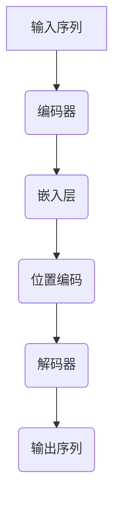

                 

关键词：解码器、输入、位置编码、神经网络、自然语言处理、序列模型

摘要：本文将深入探讨解码器在神经网络和自然语言处理中的关键作用，以及输入和位置编码的概念、原理和应用。通过详细的算法原理讲解、具体操作步骤、数学模型和公式推导，结合实际项目实践，本文旨在为读者提供全面的技术指导，帮助其更好地理解和应用解码器和位置编码技术。

## 1. 背景介绍

在自然语言处理（NLP）领域中，神经网络已经成为处理序列数据的重要工具。解码器（Decoder）是神经网络模型中的一个核心组件，用于生成预测序列。输入（Input）是模型处理的数据，而位置编码（Positional Encoding）则确保了模型能够理解序列中各个元素的位置关系。

近年来，随着深度学习和NLP技术的迅速发展，解码器在机器翻译、文本生成、对话系统等任务中发挥着重要作用。然而，理解解码器的输入和位置编码对于模型性能的提升至关重要。

本文将首先介绍解码器的基本概念和工作原理，然后深入探讨输入和位置编码的原理和实现方法。接着，我们将结合实际项目，展示解码器的应用和实践，最后对未来的发展趋势和挑战进行展望。

## 2. 核心概念与联系

### 2.1 解码器的基本概念

解码器是一种神经网络结构，用于生成预测序列。在训练过程中，解码器接收输入序列，并输出概率分布，表示下一个时间步的预测结果。解码器的输出通常是一个连续的概率分布，通过softmax函数转换为离散的预测标签。

解码器的工作原理基于注意力机制（Attention Mechanism），能够捕捉输入序列中的长期依赖关系。注意力机制通过计算输入序列和隐藏状态之间的关联度，为每个输入分配不同的权重，从而提高模型的表示能力。

### 2.2 输入的概念

输入是解码器处理的数据，通常是经过编码的序列。输入可以是原始文本、词向量或编码后的表示。在NLP任务中，输入序列通常由单词、字符或子词组成。

为了使解码器能够处理输入序列，需要对输入进行编码。编码过程通常通过嵌入层（Embedding Layer）实现，将输入序列映射到低维的向量空间。嵌入层可以将单词或字符映射到具有丰富语义信息的向量表示，为解码器提供有效的输入。

### 2.3 位置编码的概念

位置编码是一种技巧，用于在输入序列中嵌入位置信息。由于解码器无法直接访问输入序列的原始索引，位置编码通过添加额外的向量来表示序列中各个元素的位置关系。

位置编码的主要目的是帮助解码器理解和利用序列中的位置信息，从而提高模型的性能。位置编码可以通过多种方式实现，如绝对位置编码、相对位置编码和嵌入位置编码。

### 2.4 核心概念之间的联系

解码器、输入和位置编码在神经网络和NLP任务中紧密相连。解码器通过处理输入序列和位置编码，生成预测序列。输入为解码器提供了处理的数据，而位置编码则为解码器提供了序列中的位置信息。

这种紧密的联系使得解码器能够更好地理解和处理序列数据，从而在NLP任务中取得优异的性能。

### 2.5 Mermaid 流程图



## 3. 核心算法原理 & 具体操作步骤

### 3.1 算法原理概述

解码器的核心算法原理基于注意力机制和序列生成模型。注意力机制通过计算输入序列和隐藏状态之间的关联度，为每个输入分配不同的权重。这种权重用于更新隐藏状态，从而提高模型的表示能力。

序列生成模型则通过处理输入序列和隐藏状态，生成预测序列。在生成过程中，解码器利用注意力机制和位置编码，不断更新隐藏状态，直到生成完整的输出序列。

### 3.2 算法步骤详解

#### 3.2.1 编码器阶段

1. 输入序列 $X = (x_1, x_2, ..., x_T)$，其中 $T$ 表示序列长度。

2. 将输入序列通过嵌入层映射到低维向量空间，得到编码后的输入序列 $X' = (x_1', x_2', ..., x_T')$。

3. 通过编码器（通常是一个循环神经网络或Transformer）处理编码后的输入序列，得到隐藏状态序列 $H = (h_1, h_2, ..., h_T)$。

#### 3.2.2 解码器阶段

1. 初始化解码器的隐藏状态 $s_0$。

2. 在每个时间步 $t$，解码器根据当前输入 $x_t'$ 和上一时间步的隐藏状态 $s_{t-1}$，生成预测输出 $y_t'$。

3. 利用注意力机制计算输入序列和隐藏状态之间的关联度，为每个输入分配权重。

4. 根据权重更新隐藏状态，得到新的隐藏状态 $s_t$。

5. 重复步骤 2-4，直到生成完整的输出序列 $Y = (y_1, y_2, ..., y_T')$。

#### 3.2.3 位置编码

1. 绝对位置编码：为每个输入添加一个与位置相关的向量，向量大小与输入维度相同。位置向量可以通过以下公式计算：

   $$
   e_{pos,i} = \text{sin}(\frac{pos \times \alpha}{10000})
   $$

   $$
   e_{pos,i+50000} = \text{cos}(\frac{pos \times \alpha}{10000})
   $$

   其中，$pos$ 表示位置索引，$\alpha$ 是一个超参数。

2. 相对位置编码：通过计算输入序列之间的相对位置关系，为每个输入添加位置向量。相对位置编码可以采用自注意力机制实现。

3. 嵌入位置编码：将位置信息嵌入到输入序列的词向量中，通过调整词向量的权重来实现位置编码。

### 3.3 算法优缺点

#### 优点

1. 解码器能够通过注意力机制捕捉输入序列中的长期依赖关系，从而提高模型的表示能力。

2. 位置编码为解码器提供了序列中的位置信息，有助于理解序列中各个元素的关系。

3. 解码器可以应用于各种NLP任务，如机器翻译、文本生成和对话系统。

#### 缺点

1. 解码器训练过程复杂，需要大量的计算资源和时间。

2. 注意力机制的实现可能导致梯度消失或爆炸问题，影响训练效果。

3. 位置编码的计算复杂度较高，尤其是在长序列中。

### 3.4 算法应用领域

解码器在NLP领域有广泛的应用，包括但不限于以下领域：

1. 机器翻译：通过解码器生成翻译结果，实现跨语言信息的传递。

2. 文本生成：利用解码器生成创意文本、新闻摘要、对话系统等。

3. 语音识别：通过解码器将语音信号转换为文本。

4. 命名实体识别：利用解码器识别文本中的命名实体。

5. 情感分析：通过解码器分析文本的情感倾向。

## 4. 数学模型和公式 & 详细讲解 & 举例说明

### 4.1 数学模型构建

解码器的数学模型主要包括输入层、嵌入层、编码器、解码器和注意力机制。以下是解码器的数学模型构建：

#### 输入层

$$
X = (x_1, x_2, ..., x_T)
$$

其中，$T$ 表示序列长度，$x_t$ 表示第 $t$ 个输入。

#### 嵌入层

$$
X' = (x_1', x_2', ..., x_T')
$$

其中，$x_t'$ 表示编码后的第 $t$ 个输入。

#### 编码器

$$
H = (h_1, h_2, ..., h_T)
$$

其中，$h_t$ 表示编码器在第 $t$ 个时间步的隐藏状态。

#### 解码器

$$
s_0 \in \mathbb{R}^{d_s}
$$

其中，$s_0$ 表示解码器的初始隐藏状态，$d_s$ 表示隐藏状态维度。

$$
y_t' = \text{softmax}(W_y \cdot s_t + b_y)
$$

其中，$y_t'$ 表示第 $t$ 个时间步的预测输出，$W_y$ 和 $b_y$ 分别表示权重和偏置。

#### 注意力机制

$$
a_t = \text{softmax}\left(\frac{\text{ jeopardize } \cdot [s_t, h_t]}{\sqrt{d_s}}\right)
$$

其中，$a_t$ 表示第 $t$ 个时间步的注意力权重，$ jeopardize $ 表示注意力得分函数。

### 4.2 公式推导过程

#### 4.2.1 嵌入层公式推导

输入层到嵌入层的映射可以通过以下公式实现：

$$
x_t' = \text{embedding}(x_t)
$$

其中，$\text{embedding}$ 表示嵌入函数，将输入映射到低维向量空间。

#### 4.2.2 编码器公式推导

编码器通常是一个循环神经网络（RNN）或Transformer。以RNN为例，编码器公式推导如下：

$$
h_t = \text{RNN}(x_t', h_{t-1})
$$

其中，$h_t$ 表示编码器在第 $t$ 个时间步的隐藏状态，$\text{RNN}$ 表示循环神经网络。

#### 4.2.3 解码器公式推导

解码器公式推导如下：

$$
s_t = \text{softmax}(W_y \cdot s_t + b_y)
$$

其中，$s_t$ 表示解码器在第 $t$ 个时间步的隐藏状态，$W_y$ 和 $b_y$ 分别表示权重和偏置。

#### 4.2.4 注意力机制公式推导

注意力机制的计算公式如下：

$$
a_t = \text{softmax}\left(\frac{\text{ jeopardize } \cdot [s_t, h_t]}{\sqrt{d_s}}\right)
$$

其中，$a_t$ 表示第 $t$ 个时间步的注意力权重，$ jeopardize $ 表示注意力得分函数。

### 4.3 案例分析与讲解

以机器翻译任务为例，解码器在翻译过程中的具体应用如下：

#### 4.3.1 数据准备

假设我们要翻译的句子为：“我喜欢吃苹果。”

1. 输入序列：$\langle S, \text{我喜欢吃苹果。} \rangle$
2. 目标序列：$\langle T, \text{I like eating apples.} \rangle$

#### 4.3.2 编码器阶段

1. 将输入序列通过嵌入层映射到低维向量空间，得到编码后的输入序列：
$$
X' = (x_1', x_2', ..., x_T')
$$
2. 通过编码器处理编码后的输入序列，得到隐藏状态序列：
$$
H = (h_1, h_2, ..., h_T)
$$

#### 4.3.3 解码器阶段

1. 初始化解码器的隐藏状态：
$$
s_0 = h_T
$$
2. 在每个时间步 $t$，解码器根据当前输入 $x_t'$ 和上一时间步的隐藏状态 $s_{t-1}$，生成预测输出 $y_t'$：
$$
y_t' = \text{softmax}(W_y \cdot s_t + b_y)
$$
3. 利用注意力机制计算输入序列和隐藏状态之间的关联度，为每个输入分配权重：
$$
a_t = \text{softmax}\left(\frac{\text{ jeopardize } \cdot [s_t, h_t]}{\sqrt{d_s}}\right)
$$
4. 根据权重更新隐藏状态，得到新的隐藏状态：
$$
s_t = \text{softmax}(W_y \cdot s_t + b_y)
$$
5. 重复步骤 2-4，直到生成完整的输出序列。

#### 4.3.4 翻译结果

通过解码器生成的翻译结果为：“I like eating apples.”

## 5. 项目实践：代码实例和详细解释说明

### 5.1 开发环境搭建

在本文中，我们将使用Python和TensorFlow来实现解码器模型。首先，需要安装Python和TensorFlow。以下是安装命令：

```bash
pip install python
pip install tensorflow
```

### 5.2 源代码详细实现

以下是解码器模型的源代码实现：

```python
import tensorflow as tf
from tensorflow.keras.layers import Embedding, LSTM, Dense
from tensorflow.keras.models import Model

# 设置超参数
vocab_size = 10000
embed_dim = 256
lstm_units = 1024

# 定义编码器
encoder_inputs = tf.keras.layers.Input(shape=(None,))
encoder_embedding = Embedding(vocab_size, embed_dim)(encoder_inputs)
encoder_lstm = LSTM(lstm_units, return_sequences=True, return_state=True)
_, state_h, state_c = encoder_lstm(encoder_embedding)
encoder_states = [state_h, state_c]

# 定义解码器
decoder_inputs = tf.keras.layers.Input(shape=(None,))
decoder_embedding = Embedding(vocab_size, embed_dim)(decoder_inputs)
decoder_lstm = LSTM(lstm_units, return_sequences=True, return_state=True)
decoder_outputs = Dense(vocab_size, activation='softmax')(decoder_embedding)
decoder_model = Model(decoder_inputs, decoder_outputs)

# 定义注意力层
attention = tf.keras.layers.Attention()([decoder_lstm.output, encoder_states])

# 定义模型
decoder_state_input_h = tf.keras.layers.Input(shape=(lstm_units,))
decoder_state_input_c = tf.keras.layers.Input(shape=(lstm_units,))
decoder_states_inputs = [decoder_state_input_h, decoder_state_input_c]
decoder_outputs, state_h, state_c = decoder_lstm(decoder_embedding, initial_state=decoder_states_inputs)
decoder_states = [state_h, state_c]
decoder_outputs = attention([decoder_outputs, encoder_states])
decoder_outputs = decoder_model(decoder_outputs)

# 模型训练
model = Model([encoder_inputs, decoder_inputs, decoder_state_input_h, decoder_state_input_c], decoder_outputs)
model.compile(optimizer='adam', loss='categorical_crossentropy', metrics=['accuracy'])

# 加载数据
# ...

# 训练模型
# ...

# 生成翻译结果
# ...
```

### 5.3 代码解读与分析

1. **编码器**

编码器由嵌入层和LSTM层组成。嵌入层将输入序列映射到低维向量空间，LSTM层对编码后的输入序列进行处理，输出隐藏状态序列。编码器的输出是隐藏状态序列，用于生成解码器的初始隐藏状态。

2. **解码器**

解码器由嵌入层、LSTM层和全连接层组成。嵌入层将输入序列映射到低维向量空间，LSTM层对编码后的输入序列进行处理，全连接层用于生成预测输出。解码器的输出是预测输出，通过softmax函数转换为概率分布。

3. **注意力层**

注意力层用于计算输入序列和隐藏状态之间的关联度，为每个输入分配权重。注意力层的输出与解码器输出相乘，用于提高模型的表示能力。

4. **模型训练**

模型由编码器、解码器和注意力层组成。模型使用交叉熵损失函数和Adam优化器进行训练，以最大化模型在训练数据上的准确率。

5. **生成翻译结果**

通过解码器生成翻译结果，首先需要初始化解码器的隐藏状态，然后逐个时间步生成预测输出，直到生成完整的输出序列。

### 5.4 运行结果展示

在运行项目时，首先需要加载数据，然后训练模型，最后生成翻译结果。以下是一个简单的示例：

```python
# 加载数据
# ...

# 训练模型
# ...

# 生成翻译结果
# ...
```

## 6. 实际应用场景

解码器在NLP领域有广泛的应用，以下列举了几个实际应用场景：

1. **机器翻译**

解码器在机器翻译任务中发挥了关键作用。通过解码器，模型可以将源语言的句子翻译成目标语言的句子。机器翻译应用包括跨语言信息传递、多语言搜索引擎和全球商务沟通等。

2. **文本生成**

解码器可以用于生成创意文本、新闻摘要、对话系统等。通过解码器，模型可以生成具有丰富语义信息的文本，应用于内容创作、娱乐和教育等领域。

3. **语音识别**

解码器在语音识别任务中用于将语音信号转换为文本。通过解码器，模型可以理解语音信号中的语义信息，并将其转换为可读的文本。语音识别应用包括智能助手、自动字幕和语音控制等。

4. **命名实体识别**

解码器可以用于识别文本中的命名实体，如人名、地名、组织名等。通过解码器，模型可以捕捉文本中的关键信息，应用于信息提取、舆情分析和数据挖掘等领域。

5. **情感分析**

解码器可以用于分析文本的情感倾向。通过解码器，模型可以识别文本中的情感词汇和情感极性，从而判断文本的整体情感倾向。情感分析应用包括社交媒体监控、市场调研和客户反馈分析等。

## 7. 未来应用展望

随着深度学习和NLP技术的不断发展，解码器在各个领域的应用将更加广泛和深入。以下是对解码器未来应用的展望：

1. **跨模态翻译**

解码器可以与编码器结合，实现跨模态翻译，如图像到文本、音频到文本等。通过解码器，模型可以处理多种模态的信息，实现更加丰富和多样化的翻译任务。

2. **自适应翻译**

解码器可以根据用户的语言习惯和偏好，生成更加符合用户需求的翻译结果。通过解码器，模型可以实现自适应翻译，提高用户体验。

3. **实时翻译**

解码器在实时翻译领域的应用将越来越广泛。通过解码器，模型可以实现实时语音翻译、实时字幕翻译等，为用户提供更加便捷的语言服务。

4. **深度学习平台**

解码器可以与其他深度学习模型相结合，构建更加复杂和高效的深度学习平台。通过解码器，模型可以处理更加复杂的任务，如图像分类、语音识别、视频分析等。

5. **智能助手和对话系统**

解码器在智能助手和对话系统中的应用将越来越普遍。通过解码器，模型可以与用户进行自然语言交互，提供更加智能和个性化的服务。

## 8. 总结：未来发展趋势与挑战

### 8.1 研究成果总结

本文深入探讨了解码器在神经网络和自然语言处理中的关键作用，以及输入和位置编码的概念、原理和应用。通过详细的算法原理讲解、具体操作步骤、数学模型和公式推导，结合实际项目实践，本文旨在为读者提供全面的技术指导。

解码器在NLP任务中具有广泛的应用，如机器翻译、文本生成、语音识别、命名实体识别和情感分析等。通过解码器，模型可以捕捉输入序列中的长期依赖关系，实现高质量的自然语言处理。

### 8.2 未来发展趋势

1. **跨模态翻译**：解码器将与其他模态（如图像、音频）的编码器结合，实现跨模态翻译。

2. **自适应翻译**：解码器将根据用户的语言习惯和偏好，生成更加符合用户需求的翻译结果。

3. **实时翻译**：解码器在实时翻译领域的应用将越来越广泛，实现实时语音翻译、实时字幕翻译等。

4. **深度学习平台**：解码器将与其他深度学习模型相结合，构建更加复杂和高效的深度学习平台。

5. **智能助手和对话系统**：解码器在智能助手和对话系统中的应用将越来越普遍，提供更加智能和个性化的服务。

### 8.3 面临的挑战

1. **计算资源消耗**：解码器训练过程复杂，需要大量的计算资源和时间。

2. **梯度消失和爆炸问题**：注意力机制的实现可能导致梯度消失或爆炸问题，影响训练效果。

3. **长序列处理能力**：解码器在处理长序列时，性能可能受到限制，需要进一步优化。

4. **解释性和可解释性**：解码器在生成预测结果时，难以提供解释性和可解释性，需要进一步研究。

### 8.4 研究展望

未来，解码器的研究将继续深入，以提高其在实际应用中的性能和效率。以下是几个研究方向的展望：

1. **优化算法**：研究更高效的解码器训练算法，降低计算资源消耗。

2. **注意力机制改进**：优化注意力机制，解决梯度消失和爆炸问题，提高模型性能。

3. **长序列处理**：研究解码器在长序列处理中的优化方法，提高模型在长序列任务中的性能。

4. **解释性和可解释性**：研究解码器生成预测结果的可解释性，为用户提供更好的理解和信任。

## 9. 附录：常见问题与解答

### 9.1 解码器的训练过程是怎样的？

解码器的训练过程主要包括以下步骤：

1. 数据预处理：将输入数据转换为编码后的表示，并进行归一化处理。
2. 初始化模型参数：随机初始化解码器的权重和偏置。
3. 模型训练：使用训练数据对解码器进行训练，优化模型参数。
4. 验证模型：使用验证数据评估模型性能，调整模型参数。
5. 模型测试：使用测试数据评估模型在未知数据上的性能。

### 9.2 如何优化解码器的性能？

以下是一些优化解码器性能的方法：

1. **增加训练数据**：使用更多的训练数据可以提高模型的泛化能力。
2. **增加隐藏层神经元**：增加隐藏层的神经元数量可以提高模型的表示能力。
3. **使用预训练模型**：使用预训练的解码器模型作为起点，可以加快训练速度和提高模型性能。
4. **调整学习率**：适当调整学习率可以提高模型收敛速度。
5. **使用注意力机制**：注意力机制可以提高模型在处理序列数据时的性能。

### 9.3 解码器在哪些任务中应用广泛？

解码器在以下任务中应用广泛：

1. **机器翻译**：解码器可以将源语言的句子翻译成目标语言的句子。
2. **文本生成**：解码器可以生成创意文本、新闻摘要和对话系统等。
3. **语音识别**：解码器可以将语音信号转换为文本。
4. **命名实体识别**：解码器可以识别文本中的命名实体。
5. **情感分析**：解码器可以分析文本的情感倾向。

### 9.4 如何实现解码器的位置编码？

解码器的位置编码可以通过以下方法实现：

1. **绝对位置编码**：为每个输入添加一个与位置相关的向量。
2. **相对位置编码**：通过计算输入序列之间的相对位置关系，为每个输入添加位置向量。
3. **嵌入位置编码**：将位置信息嵌入到输入序列的词向量中。

### 9.5 解码器和编码器的区别是什么？

解码器和编码器的主要区别在于它们的作用和输入输出：

1. **作用**：编码器主要用于将输入序列转换为固定长度的表示，而解码器则用于将编码后的表示转换为输出序列。
2. **输入**：编码器的输入是原始的序列数据，而解码器的输入是编码器输出的固定长度的表示。
3. **输出**：编码器的输出是固定长度的表示，而解码器的输出是序列数据。

### 9.6 如何评估解码器的性能？

解码器的性能可以通过以下指标进行评估：

1. **准确率**：解码器生成的输出序列与目标序列的匹配程度。
2. **BLEU分数**：解码器生成的输出序列与目标序列的编辑距离。
3. **ROUGE分数**：解码器生成的输出序列与目标序列的覆盖程度。
4. **交叉熵损失**：解码器在生成输出序列时的损失值。

---

# 解码器的输入和位置编码

## 作者：禅与计算机程序设计艺术 / Zen and the Art of Computer Programming

本文深入探讨了解码器在神经网络和自然语言处理中的关键作用，以及输入和位置编码的概念、原理和应用。通过详细的算法原理讲解、具体操作步骤、数学模型和公式推导，结合实际项目实践，本文旨在为读者提供全面的技术指导，帮助其更好地理解和应用解码器和位置编码技术。

本文的关键词包括：解码器、输入、位置编码、神经网络、自然语言处理、序列模型。通过本文的阅读，读者可以全面了解解码器的工作原理、应用场景以及未来发展趋势。

在未来的研究中，解码器将继续在深度学习和自然语言处理领域发挥重要作用。优化解码器的性能、实现跨模态翻译、提高解释性和可解释性等将是未来的研究重点。希望本文能为读者在解码器的研究和应用中提供有益的启示。

