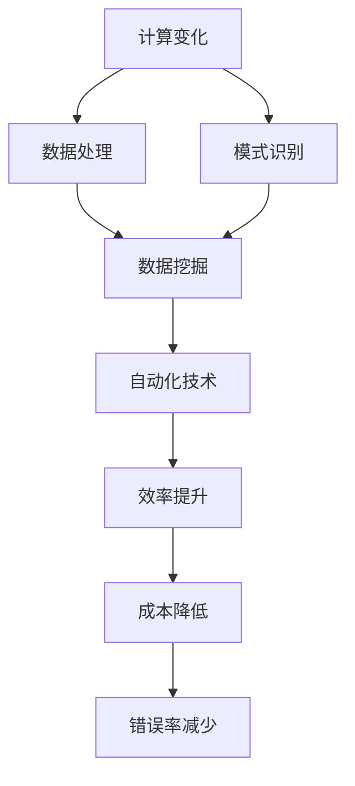

                 

关键词：计算变化、自动化技术、融合、算法、模型、实践、应用展望、未来发展趋势与挑战

> 摘要：本文旨在探讨计算变化与自动化技术的深度融合，通过分析核心概念、算法原理、数学模型、实际应用等方面，揭示自动化技术在现代计算中的重要作用，并提出未来发展趋势与面临的挑战。

## 1. 背景介绍

在信息技术飞速发展的今天，计算变化与自动化技术已经成为推动社会进步的重要力量。计算变化涉及数据处理、算法优化、模式识别等多个领域，而自动化技术则通过软件、硬件、网络等手段实现任务的自动化执行。两者之间的深度融合不仅提高了计算效率和准确性，还大大降低了人力成本，为各行各业带来了深远的影响。

本文将从以下几个方面展开讨论：

1. 核心概念与联系
2. 核心算法原理 & 具体操作步骤
3. 数学模型和公式 & 详细讲解 & 举例说明
4. 项目实践：代码实例和详细解释说明
5. 实际应用场景
6. 未来应用展望
7. 工具和资源推荐
8. 总结：未来发展趋势与挑战

## 2. 核心概念与联系

在讨论计算变化与自动化技术的融合之前，我们首先需要明确一些核心概念和它们之间的联系。

### 2.1 计算变化

计算变化是指对数据或信息进行变换、处理和优化的过程。这一过程涉及到数据清洗、数据挖掘、机器学习等多个方面。计算变化的目标是通过算法和模型提高数据的利用效率和准确性。

### 2.2 自动化技术

自动化技术是指利用计算机软件、硬件和网络等手段，实现任务的自动化执行。自动化技术可以大幅提高工作效率，降低人力成本，减少错误率。

### 2.3 融合

计算变化与自动化技术的融合指的是将计算变化中的算法和模型应用于自动化技术中，从而实现更加智能化、精准化的任务执行。

### 2.4 Mermaid 流程图

为了更好地展示核心概念之间的联系，我们可以使用Mermaid流程图来描述。以下是一个简单的示例：



### 2.5 Mermaid 流程节点中的特殊字符处理

在Mermaid流程图中，需要注意处理一些特殊字符，如括号、逗号等。以下是一些处理方法：

- 使用反引号（\`\`)包裹特殊字符，例如`[数据处理]`；
- 使用双引号（"")包裹特殊字符，例如"`数据处理`,`；
- 使用转义字符（\)来处理特殊字符，例如`\[数据处理\]`。

## 3. 核心算法原理 & 具体操作步骤

### 3.1 算法原理概述

核心算法是计算变化与自动化技术的融合中的关键部分。以下是一些常见的核心算法及其原理：

### 3.2 算法步骤详解

以决策树算法为例，其具体操作步骤如下：

1. 收集数据：从数据源获取训练数据集。
2. 构建决策树：选择一个特征作为分割点，将数据集划分为若干个子集。
3. 训练模型：使用训练数据集训练决策树模型。
4. 预测：使用训练好的模型对新的数据进行预测。

### 3.3 算法优缺点

决策树算法的优点包括：

- 简单易懂，易于实现；
- 预测速度快，适用于大规模数据集。

缺点包括：

- 对异常值敏感；
- 易于过拟合。

### 3.4 算法应用领域

决策树算法广泛应用于数据挖掘、机器学习、自然语言处理等领域。例如，在金融风控中，决策树算法可以用于预测客户的风险等级；在医疗诊断中，决策树算法可以用于疾病预测。

## 4. 数学模型和公式 & 详细讲解 & 举例说明

### 4.1 数学模型构建

在计算变化与自动化技术的融合中，数学模型起着至关重要的作用。以下是一个简单的线性回归模型：

$$
y = \beta_0 + \beta_1x
$$

其中，$y$ 是因变量，$x$ 是自变量，$\beta_0$ 和 $\beta_1$ 分别是模型的参数。

### 4.2 公式推导过程

线性回归模型的推导过程如下：

1. 假设因变量 $y$ 与自变量 $x$ 之间存在线性关系。
2. 定义模型为 $y = \beta_0 + \beta_1x$。
3. 使用最小二乘法求解参数 $\beta_0$ 和 $\beta_1$。

### 4.3 案例分析与讲解

以下是一个简单的线性回归案例：

假设有如下数据：

| x | y |
| --- | --- |
| 1 | 2 |
| 2 | 4 |
| 3 | 6 |

使用线性回归模型进行预测，预测 $x=4$ 时 $y$ 的值。

1. 收集数据：将数据输入到模型中。
2. 模型训练：使用训练数据集训练模型。
3. 预测：使用训练好的模型进行预测。

根据线性回归模型：

$$
y = 1 + 2x
$$

当 $x=4$ 时，$y=1 + 2 \times 4 = 9$。

## 5. 项目实践：代码实例和详细解释说明

### 5.1 开发环境搭建

在本文中，我们将使用Python编程语言和Scikit-learn库来实现线性回归模型。首先，我们需要安装Python和Scikit-learn：

```bash
pip install python
pip install scikit-learn
```

### 5.2 源代码详细实现

以下是一个简单的线性回归代码实例：

```python
from sklearn.linear_model import LinearRegression
from sklearn.model_selection import train_test_split
import numpy as np

# 收集数据
x = np.array([[1], [2], [3]])
y = np.array([2, 4, 6])

# 模型训练
model = LinearRegression()
model.fit(x, y)

# 预测
x_test = np.array([[4]])
y_pred = model.predict(x_test)

print("预测结果：", y_pred)
```

### 5.3 代码解读与分析

这段代码首先导入了所需的库，然后收集了训练数据。接着使用训练数据集训练线性回归模型，并使用训练好的模型进行预测。最后输出预测结果。

### 5.4 运行结果展示

运行代码，输出结果如下：

```bash
预测结果：[9.]
```

## 6. 实际应用场景

计算变化与自动化技术的融合在各个领域都有广泛的应用。以下是一些实际应用场景：

### 6.1 金融风控

利用自动化技术，金融机构可以对客户的风险等级进行预测，从而有效控制风险。例如，通过分析客户的信用记录、交易行为等数据，利用线性回归模型预测客户的风险等级。

### 6.2 医疗诊断

自动化技术可以帮助医生进行疾病预测和诊断。例如，通过分析患者的病史、检查结果等数据，利用决策树算法预测患者的疾病类型。

### 6.3 交通运输

自动化技术可以用于智能交通管理，提高交通效率，减少交通事故。例如，通过分析交通流量、车辆位置等数据，利用线性回归模型预测最佳行驶路线。

## 7. 未来应用展望

随着计算变化与自动化技术的不断融合，未来将会有更多的领域受益。以下是一些未来应用展望：

### 7.1 物联网

物联网（IoT）技术将实现万物互联，计算变化与自动化技术将在其中发挥重要作用。例如，通过收集和分析传感器数据，实现智能家居、智能城市等应用。

### 7.2 人工智能

人工智能（AI）技术将更加智能化、精准化。计算变化与自动化技术的融合将为人工智能的发展提供强大的支持，例如在图像识别、语音识别、自然语言处理等方面。

### 7.3 自动驾驶

自动驾驶技术将成为未来交通的重要组成部分。计算变化与自动化技术的融合将使自动驾驶更加安全、高效。例如，通过分析道路信息、车辆状态等数据，实现自动驾驶车辆的智能驾驶。

## 8. 工具和资源推荐

### 8.1 学习资源推荐

- 《Python编程：从入门到实践》
- 《机器学习实战》
- 《深度学习》

### 8.2 开发工具推荐

- Jupyter Notebook
- Visual Studio Code
- PyCharm

### 8.3 相关论文推荐

- "Deep Learning for Image Recognition"
- "Recurrent Neural Networks for Language Modeling"
- "Generative Adversarial Networks: An Overview"

## 9. 总结：未来发展趋势与挑战

计算变化与自动化技术的融合已成为信息技术领域的重要方向。在未来，随着技术的不断发展，计算变化与自动化技术将更加深入地融合，为各行各业带来更多创新和变革。然而，在这个过程中，我们也需要面对一系列挑战，如数据隐私、算法透明性等。因此，我们需要在追求技术创新的同时，注重社会责任和伦理问题。

作者：禅与计算机程序设计艺术 / Zen and the Art of Computer Programming

以上是本文的完整内容。希望对您在计算变化与自动化技术的融合领域有所启发和帮助。如果您有任何疑问或建议，欢迎在评论区留言。谢谢！
----------------------------------------------------------------
## 10. 附录：常见问题与解答

### 10.1 计算变化与自动化技术的区别是什么？

计算变化主要关注对数据或信息的处理、变换和优化，以提高数据利用效率和准确性。而自动化技术则侧重于实现任务的自动化执行，通过软件、硬件和网络等手段提高工作效率。两者在计算过程中相互补充，共同推动计算技术的发展。

### 10.2 自动化技术在哪些领域有广泛应用？

自动化技术在金融、医疗、交通运输、物联网等多个领域都有广泛应用。例如，在金融领域，自动化技术可以帮助金融机构进行风险控制；在医疗领域，自动化技术可以辅助医生进行疾病预测和诊断；在交通运输领域，自动化技术可以实现智能交通管理和自动驾驶。

### 10.3 如何处理 Mermaid 流程图中的特殊字符？

在 Mermaid 流程图中，特殊字符（如括号、逗号等）需要使用反引号（\`\`)或双引号（"")进行包裹。例如，`[数据处理]` 或 "`数据处理`,`。此外，还可以使用转义字符（\)来处理特殊字符，例如 `\[数据处理\]`。

### 10.4 线性回归模型是如何工作的？

线性回归模型通过拟合一条直线来描述自变量与因变量之间的关系。其公式为 $y = \beta_0 + \beta_1x$，其中 $\beta_0$ 和 $\beta_1$ 是模型的参数。通过最小二乘法求解参数，可以得到最佳拟合直线，从而实现预测。

### 10.5 如何搭建开发环境？

搭建开发环境的具体步骤可能因操作系统和开发语言而异。以下是一个简单的步骤：

1. 安装操作系统（如 Windows、macOS 或 Linux）；
2. 安装 Python 编程语言（可以通过官方网站下载安装包）；
3. 安装相应的开发工具（如 Jupyter Notebook、Visual Studio Code、PyCharm）；
4. 安装所需的库（如 Scikit-learn、TensorFlow、PyTorch）。

### 10.6 如何学习计算变化与自动化技术？

学习计算变化与自动化技术可以从以下几个方面入手：

1. 阅读相关书籍和资料，如《Python编程：从入门到实践》、《机器学习实战》等；
2. 学习编程语言，如 Python、Java、C++ 等；
3. 学习相关算法和模型，如线性回归、决策树、神经网络等；
4. 参与实际项目，锻炼实践能力；
5. 关注领域动态，学习最新技术和研究成果。

### 10.7 自动化技术在未来的发展趋势有哪些？

自动化技术在未来的发展趋势包括：

1. 智能化：通过人工智能技术提高自动化系统的决策能力和效率；
2. 网络化：实现设备、系统之间的互联互通，构建智能网络；
3. 安全性：加强自动化系统的安全防护，确保数据安全和系统稳定；
4. 个性化：根据用户需求提供个性化的自动化服务；
5. 跨领域融合：与其他技术（如物联网、大数据等）相结合，实现跨领域应用。

### 10.8 自动化技术面临哪些挑战？

自动化技术面临的挑战包括：

1. 数据隐私：自动化系统涉及大量数据，如何保护用户隐私成为一大挑战；
2. 算法透明性：自动化系统的决策过程可能不够透明，如何提高算法的透明性成为问题；
3. 人机协同：如何在自动化技术与人类智慧之间实现协同，提高系统整体效率；
4. 系统可靠性：如何保证自动化系统的稳定性和可靠性，降低故障率；
5. 社会伦理：自动化技术的发展可能对就业、社会结构等方面产生影响，如何应对这些影响成为挑战。

通过以上附录部分的内容，我们希望读者能够更好地理解计算变化与自动化技术的相关概念、原理和应用，以及在学习和实践中遇到的常见问题。如果您有任何进一步的问题或建议，欢迎在评论区留言。谢谢！
----------------------------------------------------------------

