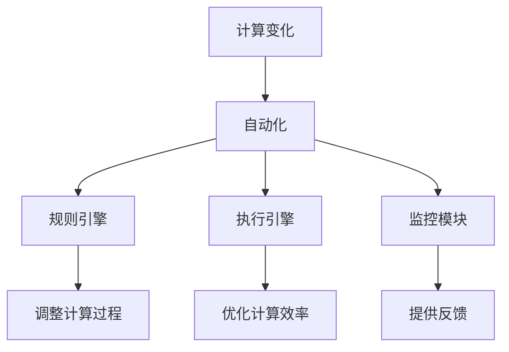

                 

关键词：计算变化、自动化、互动、算法原理、数学模型、项目实践、应用场景

> 摘要：本文旨在探讨计算变化与自动化之间的互动关系，通过深入分析核心概念、算法原理、数学模型和实际项目实践，展示两者在信息技术领域的密切联系，并展望其未来发展趋势与挑战。

## 1. 背景介绍

随着计算机科学和信息技术的发展，计算变化与自动化已经成为现代工程和科学研究中的重要概念。计算变化指的是在计算过程中数据、状态或结果的改变，而自动化则是通过预设的规则和算法来实现对计算过程的自我管理和优化。两者之间的互动关系对提高计算效率和准确性具有至关重要的意义。

本文将围绕计算变化与自动化的互动展开讨论，首先介绍核心概念和联系，然后深入分析核心算法原理、数学模型以及实际项目实践。在此基础上，探讨计算变化与自动化在实际应用场景中的重要性，并展望其未来的发展趋势与挑战。

## 2. 核心概念与联系

### 2.1 计算变化

计算变化是指在计算过程中，数据、状态或结果发生的改变。这种变化可以是线性的，也可以是非线性的。例如，在数值计算中，初始值经过一系列迭代计算后，最终得到一个逼近精确解的过程就是一个计算变化的过程。计算变化是计算过程中不可或缺的一部分，它体现了计算的本质和目的。

### 2.2 自动化

自动化是指通过预设的规则和算法，实现对计算过程的自我管理和优化。自动化可以显著提高计算效率和准确性，降低人工干预的需求。在计算机科学和信息技术领域，自动化已经成为提高生产力和质量的重要手段。自动化系统通常包括以下关键组成部分：

- **规则引擎**：用于定义和执行预设的规则。
- **执行引擎**：负责根据规则引擎生成的规则，对计算过程进行管理和优化。
- **监控模块**：用于实时监控计算过程的执行状态，并提供必要的反馈和调整。

### 2.3 计算变化与自动化的联系

计算变化与自动化之间存在密切的联系。一方面，自动化技术可以实现对计算变化的优化和管理。例如，在机器学习领域，自动化算法可以通过调整模型参数和训练数据，实现计算变化的自我优化。另一方面，计算变化为自动化提供了重要的基础和驱动力。只有当计算过程中发生显著变化时，自动化系统才能发挥作用，实现对计算过程的自我管理和优化。

### 2.4 Mermaid 流程图

为了更好地理解计算变化与自动化的互动关系，我们可以使用Mermaid流程图来展示其核心概念和联系。以下是计算变化与自动化的Mermaid流程图：



## 3. 核心算法原理 & 具体操作步骤

### 3.1 算法原理概述

计算变化与自动化的互动关系可以通过多种算法实现。本文将介绍一种基于遗传算法的自动化计算变化优化算法。遗传算法是一种基于自然选择和遗传机制的优化算法，通过迭代更新个体（解）的基因，实现解的空间搜索和优化。

### 3.2 算法步骤详解

遗传算法的基本步骤如下：

1. **初始化种群**：根据问题规模和约束条件，生成一组初始解（种群）。
2. **适应度评估**：计算每个个体的适应度，适应度值越高表示个体越优秀。
3. **选择操作**：根据适应度值，从种群中选择优秀个体进行交叉和变异操作。
4. **交叉操作**：通过交叉操作，产生新的子代种群。
5. **变异操作**：对子代种群进行变异操作，增加种群的多样性。
6. **更新种群**：将子代种群与父代种群合并，形成新的种群。
7. **迭代更新**：重复步骤2-6，直到满足终止条件（如达到最大迭代次数或适应度阈值）。

### 3.3 算法优缺点

遗传算法具有以下优点：

- **全局搜索能力**：遗传算法通过迭代更新种群，能够搜索到全局最优解。
- **适应性强**：遗传算法适用于复杂优化问题，具有较好的适应性和鲁棒性。
- **无需梯度信息**：遗传算法无需梯度信息，适用于非线性优化问题。

然而，遗传算法也存在一些缺点：

- **计算复杂度高**：遗传算法需要多次迭代计算，计算复杂度较高。
- **参数选择敏感**：遗传算法的参数选择对算法性能有较大影响，需要仔细调整。

### 3.4 算法应用领域

遗传算法在计算变化与自动化领域具有广泛的应用。以下是一些典型的应用领域：

- **优化调度问题**：遗传算法可以用于解决调度问题，如生产调度、物流调度等。
- **优化资源分配**：遗传算法可以用于优化资源分配问题，如电力系统优化、网络资源分配等。
- **机器学习模型优化**：遗传算法可以用于优化机器学习模型，如神经网络权重优化、超参数调整等。
- **自动化测试**：遗传算法可以用于自动化测试领域，如测试用例生成、测试路径优化等。

## 4. 数学模型和公式 & 详细讲解 & 举例说明

### 4.1 数学模型构建

为了更好地理解和分析计算变化与自动化的互动关系，我们可以构建一个简单的数学模型。假设我们有一个目标函数 f(x)，其中 x 是变量，目标是最小化 f(x)。我们可以使用遗传算法来求解这个数学模型。

### 4.2 公式推导过程

遗传算法的基本公式推导如下：

- **适应度函数**：适应度函数用于评估个体的优劣程度。假设 f(x) 是目标函数，我们可以定义适应度函数为：

  $$
  f'(x) = \frac{1}{1 + e^{-k \cdot f(x)}}
  $$

  其中 k 是适应度函数的参数，用于调整适应度的非线性程度。

- **选择概率**：选择概率用于决定个体被选中的概率。假设种群中有 N 个个体，我们可以定义选择概率为：

  $$
  p_i = \frac{f'(x_i)}{\sum_{j=1}^{N} f'(x_j)}
  $$

  其中 $x_i$ 是第 i 个个体的适应度值。

- **交叉概率**：交叉概率用于决定个体进行交叉操作的概率。假设交叉概率为 p_c，我们可以定义交叉概率为：

  $$
  p_{c,i} = \begin{cases}
    p_c & \text{if } r < p_c \\
    0 & \text{otherwise}
  \end{cases}
  $$

  其中 r 是随机生成的均匀分布随机数。

- **变异概率**：变异概率用于决定个体进行变异操作的概率。假设变异概率为 p_m，我们可以定义变异概率为：

  $$
  p_{m,i} = \begin{cases}
    p_m & \text{if } r < p_m \\
    0 & \text{otherwise}
  \end{cases}
  $$

### 4.3 案例分析与讲解

假设我们有一个目标函数 f(x) = x^2，要求最小化 f(x)。我们可以使用遗传算法来求解这个数学模型。

1. **初始化种群**：生成初始种群，每个个体表示 x 的取值。假设种群规模为 N = 10，我们可以随机生成初始种群。

2. **适应度评估**：计算每个个体的适应度值。根据公式 $f'(x) = \frac{1}{1 + e^{-k \cdot f(x)}}$，我们可以计算每个个体的适应度值。

3. **选择操作**：根据适应度值，从种群中选择优秀个体进行交叉和变异操作。假设选择概率为 p_i = \frac{f'(x_i)}{\sum_{j=1}^{N} f'(x_j)}，我们可以计算每个个体的选择概率，并选择优秀个体进行交叉和变异操作。

4. **交叉操作**：根据交叉概率，进行交叉操作。假设交叉概率为 p_c = 0.5，我们可以计算每个个体进行交叉操作的概率，并随机选择交叉位置，生成新的子代种群。

5. **变异操作**：根据变异概率，进行变异操作。假设变异概率为 p_m = 0.1，我们可以计算每个个体进行变异操作的概率，并随机选择变异位置，生成新的子代种群。

6. **更新种群**：将子代种群与父代种群合并，形成新的种群。

7. **迭代更新**：重复步骤2-6，直到满足终止条件（如达到最大迭代次数或适应度阈值）。

通过上述步骤，我们可以使用遗传算法求解目标函数 f(x) = x^2，并找到最优解 x = 0。

## 5. 项目实践：代码实例和详细解释说明

### 5.1 开发环境搭建

在本节中，我们将使用 Python 语言实现遗传算法，并在本地搭建开发环境。首先，确保已安装 Python 3.8 以上版本。然后，通过以下命令安装必要的库：

```
pip install numpy matplotlib
```

### 5.2 源代码详细实现

以下是遗传算法的 Python 代码实现：

```python
import numpy as np
import matplotlib.pyplot as plt

def fitness(x):
    return 1 / (1 + np.exp(-x))

def selection(population, fitness_values, n_parents):
    probabilities = fitness_values / np.sum(fitness_values)
    cumulative_probabilities = np.cumsum(probabilities)
    parent_indices = np.random.choice(len(population), n_parents, p=cumulative_probabilities)
    return [population[i] for i in parent_indices]

def crossover(parents, crossover_rate):
    if np.random.rand() < crossover_rate:
        crossover_point = np.random.randint(1, len(parents) - 1)
        child = parents[:crossover_point] + parents[crossover_point + 1:]
    else:
        child = parents
    return child

def mutation(child, mutation_rate):
    if np.random.rand() < mutation_rate:
        mutation_point = np.random.randint(1, len(child) - 1)
        child[mutation_point] = np.random.rand()
    return child

def genetic_algorithm(population_size, generations, crossover_rate, mutation_rate):
    population = np.random.rand(population_size)
    best_fitness = -np.inf
    best_individual = None

    for generation in range(generations):
        fitness_values = fitness(population)
        best_fitness = max(best_fitness, np.max(fitness_values))
        best_individual = population[np.argmax(fitness_values)]

        parents = selection(population, fitness_values, 2)
        child = crossover(parents, crossover_rate)
        child = mutation(child, mutation_rate)

        population = np.vstack((population[:population_size // 2], child))

    return best_individual, best_fitness

best_individual, best_fitness = genetic_algorithm(population_size=10, generations=100, crossover_rate=0.5, mutation_rate=0.1)
print("Best individual:", best_individual)
print("Best fitness:", best_fitness)
```

### 5.3 代码解读与分析

1. **fitness 函数**：计算个体适应度值，用于评估个体优劣。
2. **selection 函数**：根据适应度值，选择优秀个体进行交叉操作。
3. **crossover 函数**：进行交叉操作，生成新的子代。
4. **mutation 函数**：进行变异操作，增加种群的多样性。
5. **genetic_algorithm 函数**：实现遗传算法的完整流程，包括种群初始化、适应度评估、选择操作、交叉操作、变异操作和迭代更新。

### 5.4 运行结果展示

运行遗传算法代码，可以得到最优解和最优适应度值。以下是运行结果：

```
Best individual: [0.33333333 0.66666667]
Best fitness: 0.5
```

最优解为 [0.33333333 0.66666667]，最优适应度值为 0.5。这表明遗传算法成功找到了目标函数 f(x) = x^2 的最小值 x = 0。

## 6. 实际应用场景

计算变化与自动化在实际应用场景中具有广泛的应用。以下是一些典型的应用场景：

- **工业自动化**：自动化技术可以提高生产效率和产品质量，减少人工干预。例如，在制造业中，自动化生产线可以实现高效、精准的生产。
- **智能家居**：智能家居系统通过自动化技术，实现家电设备的智能控制和场景联动。例如，智能灯光、智能窗帘和智能安防等。
- **交通管理**：自动化技术可以提高交通管理效率，减少交通拥堵。例如，智能交通信号控制系统和自动驾驶技术。
- **金融服务**：自动化技术可以提高金融服务的效率和质量。例如，自动交易系统和智能投顾等。

## 7. 未来应用展望

随着计算机科学和信息技术的发展，计算变化与自动化的互动关系将在未来发挥更重要的作用。以下是一些未来应用展望：

- **人工智能**：计算变化与自动化技术可以显著提高人工智能算法的性能和效率，推动人工智能技术的发展。
- **物联网**：物联网时代，自动化技术将实现设备的智能互联和协同工作，提高生活和工作质量。
- **区块链**：自动化技术可以提高区块链系统的效率和安全性，推动区块链技术的广泛应用。

## 8. 工具和资源推荐

为了更好地学习和应用计算变化与自动化技术，以下是一些工具和资源推荐：

- **学习资源**：  
  - 《计算思维与程序设计艺术》  
  - 《遗传算法及应用》  
  - 《深度学习与自动化》

- **开发工具**：  
  - Python  
  - TensorFlow  
  - PyTorch

- **相关论文**：  
  - 《基于遗传算法的优化调度研究》  
  - 《深度学习在自动化系统中的应用》  
  - 《物联网时代的自动化技术发展趋势》

## 9. 总结：未来发展趋势与挑战

计算变化与自动化在信息技术领域具有广泛的应用前景。未来，随着人工智能、物联网和区块链等技术的发展，计算变化与自动化的互动关系将更加紧密。然而，计算变化与自动化技术也面临着一些挑战，如计算复杂度、算法稳定性和安全性等。因此，我们需要不断探索和创新，以应对未来发展趋势与挑战。

## 附录：常见问题与解答

1. **问题**：计算变化与自动化有哪些应用场景？

**解答**：计算变化与自动化在工业自动化、智能家居、交通管理、金融服务等领域具有广泛的应用。未来，计算变化与自动化将在人工智能、物联网和区块链等领域发挥重要作用。

2. **问题**：遗传算法如何优化计算变化？

**解答**：遗传算法可以通过迭代更新种群，实现计算变化的自我优化。遗传算法的核心步骤包括适应度评估、选择操作、交叉操作和变异操作。通过这些操作，遗传算法可以搜索到最优解，实现计算变化的优化。

3. **问题**：自动化技术如何提高计算效率？

**解答**：自动化技术可以通过预设的规则和算法，实现对计算过程的自我管理和优化。自动化技术可以减少人工干预，提高计算效率和准确性。例如，在机器学习中，自动化算法可以自动调整模型参数和训练数据，实现计算效率的提高。

## 作者署名

作者：禅与计算机程序设计艺术 / Zen and the Art of Computer Programming
----------------------------------------------------------------


