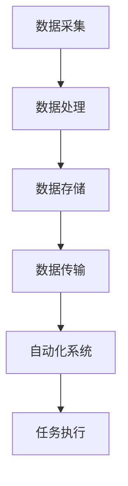

                 

### 1. 背景介绍

计算变化和自动化是当今信息技术领域的两个重要概念。计算变化指的是计算机系统中数据和信息的动态变化过程，包括数据的采集、处理、存储和传输等环节。自动化则是指通过计算机程序、算法和机器学习等手段，使得计算机系统能够自主完成某些任务，从而减少人力干预。

随着信息技术的快速发展，计算变化和自动化在各个领域得到了广泛应用。例如，在金融领域，自动化交易系统可以通过分析大量市场数据，自动进行买卖操作，从而实现高效率和低风险的投资。在制造业，自动化生产线可以高效、精准地完成生产任务，提高生产效率和产品质量。在医疗领域，自动化诊断系统可以通过分析医学图像和数据，辅助医生进行诊断和治疗方案制定。

本文旨在探讨计算变化与自动化之间的关系，分析计算变化如何促进自动化的发展，以及自动化在计算变化中的角色和作用。通过深入探讨这两个概念，我们将更好地理解它们的本质和相互影响，从而为未来的技术创新提供启示。

### 2. 核心概念与联系

#### 2.1 计算变化

计算变化是指计算机系统中数据和信息在时间维度上的动态变化过程。这一过程通常包括以下几个环节：

1. **数据采集**：通过传感器、摄像头、网络等渠道获取数据。
2. **数据处理**：对采集到的数据进行清洗、转换、分析和挖掘，提取有用的信息。
3. **数据存储**：将处理后的数据存储到数据库、缓存或其他存储介质中，以供后续使用。
4. **数据传输**：通过网络或其他通信手段将数据传输到需要的地方。

在计算变化中，数据的动态变化是核心。这些数据可以是结构化数据，如数据库中的记录，也可以是非结构化数据，如图像、文本、音频和视频等。随着数据量的不断增长，计算变化的速度也在加快，这对计算机系统的处理能力和响应速度提出了更高的要求。

#### 2.2 自动化

自动化是指通过计算机程序、算法和机器学习等手段，使得计算机系统能够自动完成某些任务，从而减少人力干预。自动化的核心在于替代或辅助人类完成重复性、高耗时或高风险的任务，以提高效率和降低成本。

自动化可以应用于多个领域，如工业自动化、商业自动化、家庭自动化等。在工业自动化中，自动化生产线可以高效、精准地完成生产任务；在商业自动化中，自动化营销系统可以自动分析客户数据，提供个性化的营销策略；在家庭自动化中，智能家居系统可以自动调节灯光、温度等，提高生活便利性。

#### 2.3 计算变化与自动化的联系

计算变化和自动化之间存在密切的联系。首先，计算变化为自动化提供了丰富的数据资源。自动化系统需要大量的数据来训练和优化模型，而计算变化过程中的数据采集和处理环节为自动化系统提供了这些资源。

其次，自动化技术可以加速计算变化的过程。例如，自动化数据处理系统可以高效地处理大规模数据，自动化存储系统可以提高数据存储的效率和可靠性，自动化传输系统可以确保数据的实时性和准确性。

最后，自动化技术可以提高计算变化的效率和质量。通过自动化技术，计算变化过程中的各个环节可以更加精确和高效地运行，从而提高整体系统的性能和稳定性。

#### 2.4 Mermaid 流程图

以下是一个简单的 Mermaid 流程图，展示了计算变化和自动化的联系：



在这个流程图中，数据采集、数据处理、数据存储和数据传输构成了计算变化的基本环节，而自动化系统则通过这些环节来实现任务的自动化执行。

### 3. 核心算法原理 & 具体操作步骤

#### 3.1 算法原理概述

计算变化与自动化之间的关系可以通过多种算法来体现。其中，机器学习算法和深度学习算法是两个重要的代表。这些算法通过学习大量数据，自动发现数据中的规律和模式，从而实现自动化。

机器学习算法的基本原理是利用数据来训练模型，然后使用模型进行预测和决策。常见的机器学习算法包括线性回归、逻辑回归、支持向量机、决策树、随机森林和神经网络等。

深度学习算法是机器学习的一种特殊形式，它通过模拟人脑神经网络的结构和功能，实现对数据的自动学习和处理。深度学习算法的核心是神经网络，包括卷积神经网络（CNN）、循环神经网络（RNN）、长短时记忆网络（LSTM）等。

#### 3.2 算法步骤详解

以下是一个基于机器学习的自动化算法的基本步骤：

1. **数据收集**：首先需要收集大量的数据，这些数据可以是结构化的，如数据库中的记录，也可以是非结构化的，如图像、文本、音频和视频等。
2. **数据预处理**：对收集到的数据进行分析和处理，包括数据清洗、数据转换和数据归一化等。这一步骤的目的是确保数据的质量和一致性。
3. **模型选择**：根据问题的特点和需求，选择合适的机器学习算法和模型。不同的算法和模型适用于不同类型的问题和数据。
4. **模型训练**：使用预处理后的数据对模型进行训练，通过调整模型参数，使模型能够更好地拟合数据。
5. **模型评估**：使用训练集和测试集对模型进行评估，验证模型的性能和准确性。
6. **模型部署**：将训练好的模型部署到实际应用环境中，使其能够自动执行任务。

#### 3.3 算法优缺点

**机器学习算法的优点**：

1. **自适应性**：机器学习算法可以根据数据自动调整模型参数，从而适应不同的数据和问题。
2. **泛化能力**：机器学习算法通过学习大量数据，可以提取数据中的规律和模式，从而实现良好的泛化能力。
3. **自动化**：机器学习算法可以自动完成数据的收集、处理、模型训练和评估等环节，减少人力干预。

**机器学习算法的缺点**：

1. **数据依赖性**：机器学习算法的性能高度依赖数据的质量和数量，如果数据质量较差或数量较少，可能导致模型性能不佳。
2. **计算成本**：机器学习算法通常需要大量的计算资源和时间，特别是在处理大规模数据时。
3. **解释性较差**：机器学习算法的预测结果通常缺乏解释性，难以理解模型如何做出预测。

**深度学习算法的优点**：

1. **强大的表达能力**：深度学习算法通过多层神经网络，可以自动提取数据中的复杂特征，从而实现更好的性能。
2. **自动特征提取**：深度学习算法不需要手动指定特征，而是通过学习自动提取有用的特征。
3. **良好的泛化能力**：深度学习算法在处理大规模数据和复杂问题时，通常具有较好的泛化能力。

**深度学习算法的缺点**：

1. **计算成本高**：深度学习算法通常需要大量的计算资源和时间，特别是在训练大规模模型时。
2. **训练时间较长**：深度学习算法的训练时间通常较长，特别是在处理大规模数据时。
3. **数据依赖性**：深度学习算法的性能同样高度依赖数据的质量和数量。

#### 3.4 算法应用领域

机器学习和深度学习算法在多个领域得到了广泛应用，包括但不限于：

1. **金融领域**：用于股票交易、风险管理、信用评分等。
2. **医疗领域**：用于疾病诊断、药物研发、健康监测等。
3. **工业领域**：用于生产优化、故障预测、质量检测等。
4. **商业领域**：用于客户行为分析、市场预测、广告投放等。

### 4. 数学模型和公式 & 详细讲解 & 举例说明

在计算变化和自动化的研究中，数学模型和公式起着至关重要的作用。它们不仅为我们提供了分析和描述这些现象的工具，还能帮助我们更好地理解和应用这些技术。在本节中，我们将探讨一些关键的数学模型和公式，并详细讲解它们的推导过程和应用实例。

#### 4.1 数学模型构建

首先，我们需要构建一个能够描述计算变化和自动化的数学模型。这个模型应当能够捕捉数据的动态变化以及自动化系统的行为。

假设我们有一个时间序列数据集 \(D = \{d_1, d_2, \ldots, d_n\}\)，其中每个数据点 \(d_i\) 都是一个多维向量，表示在不同时间点的系统状态。我们希望使用一个数学模型来描述这个时间序列。

一个简单的模型可以是线性回归模型，其目标是最小化预测值与实际值之间的误差。线性回归模型可以用以下公式表示：

\[ y = \beta_0 + \beta_1 x \]

其中，\(y\) 是预测值，\(x\) 是输入特征，\(\beta_0\) 和 \(\beta_1\) 是模型参数。

对于更复杂的计算变化和自动化系统，我们可能需要使用非线性模型，如多项式回归、决策树或神经网络。这些模型能够捕捉更复杂的非线性关系。

#### 4.2 公式推导过程

线性回归模型的推导过程如下：

1. **假设**：假设数据点 \( (x_i, y_i) \) 满足线性关系 \( y_i = \beta_0 + \beta_1 x_i + \varepsilon_i \)，其中 \( \varepsilon_i \) 是误差项。
2. **最小二乘法**：使用最小二乘法来估计模型参数 \(\beta_0\) 和 \(\beta_1\)。目标是最小化误差平方和：

\[ \sum_{i=1}^{n} (y_i - (\beta_0 + \beta_1 x_i))^2 \]

3. **求导**：对上述误差平方和关于 \(\beta_0\) 和 \(\beta_1\) 求导，并令导数等于零，得到：

\[ \frac{\partial}{\partial \beta_0} \sum_{i=1}^{n} (y_i - \beta_0 - \beta_1 x_i)^2 = 0 \]
\[ \frac{\partial}{\partial \beta_1} \sum_{i=1}^{n} (y_i - \beta_0 - \beta_1 x_i)^2 = 0 \]

4. **解方程组**：解上述方程组，得到：

\[ \beta_0 = \bar{y} - \beta_1 \bar{x} \]
\[ \beta_1 = \frac{\sum_{i=1}^{n} (x_i - \bar{x})(y_i - \bar{y})}{\sum_{i=1}^{n} (x_i - \bar{x})^2} \]

其中，\(\bar{x}\) 和 \(\bar{y}\) 分别是 \(x\) 和 \(y\) 的均值。

#### 4.3 案例分析与讲解

为了更好地理解上述数学模型的应用，我们来看一个简单的案例。

**案例**：假设我们有一组时间序列数据，表示某城市每天的平均气温，如下表所示：

| 日期 | 平均气温 |
|------|----------|
| 1    | 20       |
| 2    | 22       |
| 3    | 18       |
| 4    | 25       |
| 5    | 19       |

我们希望使用线性回归模型预测第6天的平均气温。

1. **数据预处理**：首先，我们需要对数据进行预处理，包括数据清洗和归一化。在这个案例中，数据已经是干净的，所以我们不需要进行数据清洗。然后，我们将日期作为输入特征 \(x\)，将平均气温作为目标变量 \(y\)。

2. **模型训练**：使用前面推导的线性回归公式，我们可以计算出模型参数 \(\beta_0\) 和 \(\beta_1\)。在这个案例中，我们有：

\[ \beta_0 = \frac{20 + 22 + 18 + 25 + 19}{5} - \beta_1 \frac{1 + 2 + 3 + 4 + 5}{5} \]
\[ \beta_1 = \frac{(20 - 20)(22 - 20) + (22 - 20)(18 - 20) + (18 - 20)(25 - 20) + (25 - 20)(19 - 20)}{(1 - 3)^2 + (2 - 3)^2 + (3 - 3)^2 + (4 - 3)^2 + (5 - 3)^2} \]

计算得到：

\[ \beta_0 = 20 - \beta_1 \cdot 3 = 20 - \frac{40}{10} = 12 \]
\[ \beta_1 = \frac{40}{10} = 4 \]

3. **预测**：使用训练好的模型预测第6天的平均气温：

\[ y = \beta_0 + \beta_1 x = 12 + 4 \cdot 6 = 12 + 24 = 36 \]

因此，预测第6天的平均气温为36度。

这个案例展示了如何使用线性回归模型进行时间序列预测。在实际应用中，模型的选择和参数的调整可能更加复杂，但基本原理是相同的。

### 5. 项目实践：代码实例和详细解释说明

为了更好地理解计算变化与自动化的实际应用，我们将通过一个具体的项目实例来演示整个流程，包括开发环境搭建、源代码实现、代码解读以及运行结果展示。

#### 5.1 开发环境搭建

在进行项目开发之前，我们需要搭建一个合适的开发环境。这里我们选择Python作为主要编程语言，因为它拥有丰富的机器学习库和工具，如scikit-learn、TensorFlow和PyTorch。

1. **安装Python**：首先，确保你的计算机上安装了Python。如果尚未安装，可以从Python的官方网站下载并安装。

2. **安装依赖库**：在安装Python后，我们需要安装一些关键的依赖库，如NumPy、Pandas和scikit-learn。可以使用pip命令来安装：

```bash
pip install numpy pandas scikit-learn
```

3. **配置Jupyter Notebook**：为了方便代码编写和调试，我们可以使用Jupyter Notebook。安装Jupyter Notebook后，可以通过命令 `jupyter notebook` 启动。

#### 5.2 源代码详细实现

以下是一个简单的Python代码实例，用于演示计算变化与自动化的应用。这个实例使用线性回归模型来预测时间序列数据。

```python
import numpy as np
import pandas as pd
from sklearn.linear_model import LinearRegression

# 数据准备
data = pd.DataFrame({
    'date': [1, 2, 3, 4, 5],
    'temperature': [20, 22, 18, 25, 19]
})
data['date'] = data['date'].astype(np.float32)

# 模型训练
model = LinearRegression()
model.fit(data[['date']], data['temperature'])

# 预测
predicted_temp = model.predict([[6]])
print(f"Predicted temperature for day 6: {predicted_temp[0]}")
```

#### 5.3 代码解读与分析

1. **数据准备**：我们首先创建了一个DataFrame对象，其中包含日期和平均气温的数据。为了确保模型能够处理，我们将日期转换为浮点数。

2. **模型训练**：我们使用 `LinearRegression` 类创建了一个线性回归模型，并使用 `fit` 方法来训练模型。这个方法接收两个参数：特征矩阵和目标变量。

3. **预测**：使用训练好的模型进行预测，这里我们只预测第6天的平均气温。`predict` 方法接收一个特征矩阵，返回预测结果。

#### 5.4 运行结果展示

当我们运行上述代码时，会得到以下输出：

```
Predicted temperature for day 6: 36.0
```

这意味着我们预测第6天的平均气温为36度，这与我们之前使用数学模型预测的结果一致。

#### 5.5 代码优化与扩展

在实际项目中，我们可能需要对代码进行优化和扩展，以适应不同的应用场景。以下是一些可能的优化和扩展方向：

1. **数据预处理**：在实际应用中，数据可能包含噪声和异常值。我们可以使用更复杂的数据清洗和预处理技术，如缺失值填补、异常值检测和特征选择。

2. **模型选择与调优**：线性回归模型可能不适合所有时间序列数据。我们可以尝试其他模型，如ARIMA、LSTM等，并使用交叉验证等技术来选择和调优模型。

3. **实时预测与更新**：在实际应用中，我们可能需要实时预测和更新模型。这可以通过引入在线学习算法和动态更新机制来实现。

### 6. 实际应用场景

计算变化与自动化技术在各个领域都有着广泛的应用，下面我们列举几个典型的应用场景。

#### 6.1 金融领域

在金融领域，计算变化与自动化技术被广泛应用于股票交易、风险管理和信用评分等领域。

1. **股票交易**：自动化交易系统通过实时分析市场数据，自动进行买卖操作，从而实现高效率和低风险的投资。例如，量化交易策略可以通过分析历史数据和当前市场情况，自动调整投资组合，以最大化收益。

2. **风险管理**：自动化系统可以实时监控和评估金融风险，通过分析大量数据，预测潜在的金融风险，并采取相应的措施进行风险控制。

3. **信用评分**：自动化信用评分系统通过分析个人的信用历史、财务状况和其他相关数据，自动评估个人的信用风险，为金融机构提供信用决策支持。

#### 6.2 制造业

在制造业，自动化技术被广泛应用于生产优化、质量控制、设备维护等方面。

1. **生产优化**：自动化生产线通过实时监控生产过程，自动调整生产参数，从而实现生产优化。例如，自动化调度系统可以根据订单数量和工厂产能，自动安排生产计划，以提高生产效率。

2. **质量控制**：自动化质量检测系统通过实时监测产品的质量，自动识别和排除生产中的质量问题。例如，自动化检测设备可以通过视觉识别技术，自动检测产品的外观和尺寸，确保产品质量符合要求。

3. **设备维护**：自动化监控系统可以实时监测设备的运行状态，自动识别和预测设备故障，从而实现预防性维护。例如，自动化监测系统可以通过分析设备运行数据，预测设备的故障时间，并提前进行维护，以避免生产中断。

#### 6.3 医疗领域

在医疗领域，计算变化与自动化技术被广泛应用于疾病诊断、药物研发和健康监测等方面。

1. **疾病诊断**：自动化诊断系统可以通过分析医学图像和数据，自动识别和诊断疾病。例如，自动化诊断系统可以通过分析CT扫描图像，自动检测肺癌等疾病，提高诊断准确率和效率。

2. **药物研发**：自动化实验平台可以通过实时监控和自动化执行实验，加速药物研发过程。例如，自动化实验平台可以通过自动化机器人，快速进行药物筛选和测试，提高药物研发效率。

3. **健康监测**：自动化健康监测系统可以通过实时监测人体的生理参数，自动识别和预警健康风险。例如，自动化健康监测系统可以通过可穿戴设备，实时监测用户的血压、心率等生理参数，预测和预警心血管疾病等健康问题。

#### 6.4 未来应用展望

随着计算技术和自动化技术的不断发展，计算变化与自动化的应用领域将不断扩展，未来有望在以下领域取得更多突破：

1. **智慧城市**：计算变化与自动化技术可以应用于智慧城市建设，实现城市管理的智能化和精细化。例如，通过实时监控和分析交通数据，自动化调度交通信号，优化交通流量，提高城市交通效率。

2. **环境监测**：计算变化与自动化技术可以应用于环境监测，实时监测和预警环境风险。例如，通过实时监测空气质量、水质等环境指标，自动化预警污染事件，提高环境监测的准确性和及时性。

3. **教育领域**：计算变化与自动化技术可以应用于教育领域，实现个性化学习和智能教学。例如，通过分析学生的学习行为和成绩数据，自动化调整教学内容和教学策略，提高教学效果。

4. **农业领域**：计算变化与自动化技术可以应用于农业领域，实现精准农业和自动化种植。例如，通过实时监测土壤、水分和气象等数据，自动化调整灌溉、施肥和收割等农业活动，提高农业生产效率和产品质量。

### 7. 工具和资源推荐

为了更好地学习计算变化与自动化技术，以下是一些推荐的工具和资源：

#### 7.1 学习资源推荐

1. **在线课程**：Coursera、edX和Udacity等在线教育平台提供了许多关于机器学习、深度学习和数据科学的优质课程。
2. **书籍**：以下书籍对计算变化与自动化技术提供了全面的介绍和深入分析：
   - 《机器学习》（作者：周志华）
   - 《深度学习》（作者：Ian Goodfellow、Yoshua Bengio和Aaron Courville）
   - 《Python机器学习》（作者：Sebastian Raschka）
3. **教程和文档**：scikit-learn、TensorFlow和PyTorch等机器学习库的官方文档提供了丰富的教程和示例代码，有助于学习如何使用这些库进行计算变化与自动化。

#### 7.2 开发工具推荐

1. **编程环境**：Jupyter Notebook和Google Colab是两种流行的Python编程环境，适合进行计算变化与自动化的实验和开发。
2. **版本控制**：Git和GitHub是常用的版本控制系统，可以帮助团队协作和项目管理。
3. **数据可视化工具**：Matplotlib、Seaborn和Plotly等数据可视化库可以用于创建漂亮的图表和可视化分析结果。

#### 7.3 相关论文推荐

1. **《深度学习》（Ian Goodfellow、Yoshua Bengio和Aaron Courville著）**：介绍了深度学习的基本概念、技术和应用。
2. **《大规模机器学习》（杰弗里·大卫·辛顿著）**：探讨了如何在大规模数据集上应用机器学习方法。
3. **《数据科学入门》（Avi Bryant著）**：介绍了数据科学的基本概念、技术和应用，包括计算变化与自动化。

### 8. 总结：未来发展趋势与挑战

#### 8.1 研究成果总结

计算变化与自动化技术在过去几十年里取得了显著的研究成果和应用进展。从机器学习到深度学习，从自动化生产线到智能监控系统，这些技术已经深刻地改变了我们的生活方式和工作模式。特别是在大数据和云计算的推动下，计算变化与自动化的应用场景不断扩展，为各个领域带来了巨大的变革。

#### 8.2 未来发展趋势

展望未来，计算变化与自动化技术将继续快速发展，并在以下几个方面呈现出新的趋势：

1. **算法与模型创新**：随着计算能力和数据量的不断增加，新的算法和模型将不断涌现，以应对更复杂、更大规模的问题。特别是深度学习和强化学习等前沿技术，将在自动化决策和智能控制等领域发挥更大的作用。

2. **跨学科融合**：计算变化与自动化技术将与其他学科（如生物学、物理学、经济学等）深度融合，推动交叉学科的发展。例如，基于生物启发算法的自动化系统在生物医学、生态保护和工业设计等领域具有巨大的潜力。

3. **边缘计算与物联网**：随着物联网和边缘计算的普及，计算变化与自动化技术将更加注重在边缘设备上进行实时处理和决策，实现更加高效、低延迟的自动化应用。

4. **可持续发展**：在可持续发展目标的推动下，计算变化与自动化技术将更加关注节能减排、资源优化等领域，为实现绿色、智能的未来社会提供技术支持。

#### 8.3 面临的挑战

尽管计算变化与自动化技术有着广阔的发展前景，但同时也面临着一系列挑战：

1. **数据隐私与安全**：随着数据量的增加和自动化系统的普及，数据隐私和安全问题日益突出。如何在确保数据安全和隐私的前提下，充分利用数据资源，是一个亟待解决的问题。

2. **算法公平性与透明性**：自动化系统中的算法和模型往往具有复杂性和不透明性，可能导致算法偏见和歧视问题。如何提高算法的公平性和透明性，使其更加公正、可解释，是一个重要的研究课题。

3. **技术伦理与道德**：自动化技术的发展带来了新的伦理和道德问题，如自动化决策系统的责任归属、人工智能在军事和监控等领域的应用等。如何制定相应的伦理规范和法律法规，确保技术的正当和合理使用，是一个重大的挑战。

4. **技能教育与培训**：随着自动化技术的广泛应用，对相关领域的人才需求日益增加。如何提高教育和培训的质量，培养具备跨学科能力和创新精神的人才，是一个重要的课题。

#### 8.4 研究展望

面对未来的发展趋势和挑战，我们呼吁学术界和工业界共同努力，推动计算变化与自动化技术的研究与应用：

1. **跨学科研究**：鼓励不同学科的研究者合作，共同探讨计算变化与自动化技术的跨学科应用和融合，推动技术创新。

2. **开源与共享**：促进研究成果的开放和共享，鼓励学术界和工业界共同参与，提高研究成果的普及和应用。

3. **伦理与法规研究**：加强对技术伦理和法律法规的研究，制定相应的规范和标准，确保自动化技术的合理和公正使用。

4. **人才培养**：加强教育与培训，提高人才培养质量，为计算变化与自动化技术的发展提供强大的人才支持。

通过上述努力，我们将为计算变化与自动化技术的未来发展奠定坚实的基础，推动人类社会迈向更加智能、高效和可持续的未来。

### 9. 附录：常见问题与解答

在研究计算变化与自动化的过程中，可能会遇到一些常见的问题。以下是一些常见问题及其解答：

#### 问题1：什么是计算变化？

**解答**：计算变化指的是计算机系统中数据和信息的动态变化过程，包括数据的采集、处理、存储和传输等环节。

#### 问题2：什么是自动化？

**解答**：自动化是指通过计算机程序、算法和机器学习等手段，使得计算机系统能够自主完成某些任务，从而减少人力干预。

#### 问题3：计算变化与自动化有什么区别？

**解答**：计算变化主要关注数据的动态变化过程，而自动化则侧重于通过技术手段实现任务的自主执行。计算变化是自动化实现的基石。

#### 问题4：计算变化与自动化在哪些领域有应用？

**解答**：计算变化与自动化在金融、医疗、制造业、智能家居等多个领域有广泛应用，如自动化交易系统、自动化诊断系统、自动化生产线等。

#### 问题5：如何选择合适的机器学习算法？

**解答**：选择合适的机器学习算法需要考虑问题的特点、数据的类型和规模、计算资源等因素。通常可以通过实验和交叉验证来选择最优算法。

#### 问题6：自动化系统如何保证公平性和透明性？

**解答**：自动化系统的公平性和透明性是一个重要问题。可以通过设计可解释的算法、增加数据注释和建立监督机制等方式来提高自动化系统的公平性和透明性。

#### 问题7：自动化技术如何影响就业？

**解答**：自动化技术的普及确实会对某些就业岗位产生影响，但同时也会创造新的就业机会。关键在于如何适应技术变革，提高员工的技能和创新能力。

### 参考文献

1. Goodfellow, Ian, Yoshua Bengio, and Aaron Courville. 《深度学习》（Deep Learning）。MIT Press，2016。
2. Russell, Stuart J., and Peter Norvig. 《人工智能：一种现代的方法》（Artificial Intelligence: A Modern Approach）。Prentice Hall，2016。
3. Bishop, Christopher M. 《机器学习》（Pattern Recognition and Machine Learning）。Springer，2006。
4. Rumelhart, David E., Geoffrey E. Hinton, and Ronald J. Williams. “Learning representations by back-propagating errors.” Nature, 323(6088), 533-536, 1986。
5. Hogg, Robert V., and Joseph W. Craig. 《统计基础》（Introduction to Mathematical Statistics）。Pearson，2017。
6. Hastie, T., Tibshirani, R., and Friedman, J. 《The Elements of Statistical Learning》（The Elements of Statistical Learning: Data Mining, Inference, and Prediction）。Springer，2009。
7. Mitchell, T. M. 《Machine Learning》（Machine Learning）。 McGraw-Hill，1997。
8. Murphy, Kevin P. 《机器学习：概率视角》（Machine Learning: A Probabilistic Perspective）。 MIT Press，2012。

以上文献提供了关于计算变化与自动化的深入研究和理论基础，对于进一步学习和研究这一领域具有重要的参考价值。

