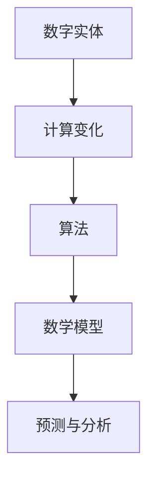

                 

关键词：数字实体、计算变化、算法、数学模型、实践应用、发展趋势

> 摘要：本文探讨了计算变化对数字实体的影响，从背景介绍到核心概念，再到算法原理、数学模型、实践应用等多个方面，深入分析了计算变化在数字实体中的重要性及其应用场景。文章旨在为读者提供全面的技术视角，以帮助理解和应对数字时代的变化。

## 1. 背景介绍

在当今数字化时代，数据已经成为企业和社会的关键资产。随着数据量的爆炸性增长，如何有效地处理和利用这些数据变得越来越重要。数字实体作为数据的承载者，其变化对整个系统产生了深远的影响。计算变化则是指数字实体在数据处理和存储过程中的变化，包括数据类型的转换、数据规模的扩展、数据质量的提升等。

随着大数据、云计算、人工智能等技术的发展，计算变化在各个领域得到了广泛应用。例如，在金融领域，交易数据的实时处理和分析能够帮助金融机构及时调整策略，降低风险；在医疗领域，患者数据的精确分析和处理可以提高诊断的准确性，改善治疗效果；在交通领域，交通数据的实时监控和优化可以减少交通拥堵，提高交通效率。

然而，计算变化也带来了新的挑战。如何在保证数据准确性和安全性的同时，快速处理大规模数据，成为当前研究的热点问题。本文将从核心概念、算法原理、数学模型、实践应用等多个方面，全面探讨计算变化对数字实体的影响。

## 2. 核心概念与联系

为了深入理解计算变化对数字实体的影响，我们首先需要明确几个核心概念，并展示它们之间的联系。

### 2.1 数字实体

数字实体是指以数字形式表示的事物，包括数据点、数据集、数据流等。数字实体可以是结构化的，如关系型数据库中的表；也可以是非结构化的，如图像、音频、视频等。

### 2.2 计算变化

计算变化是指数字实体在处理、存储、传输过程中发生的变化。这些变化可能涉及数据类型、数据规模、数据质量等。

### 2.3 算法

算法是解决问题的一系列步骤，用于处理数字实体。不同的算法适用于不同的计算变化场景，如排序算法、搜索算法、机器学习算法等。

### 2.4 数学模型

数学模型是用于描述和预测数字实体变化的数学表达式。数学模型可以帮助我们理解和分析计算变化的影响，如线性回归模型、神经网络模型等。

以下是一个Mermaid流程图，展示了这些核心概念之间的联系：



## 3. 核心算法原理 & 具体操作步骤

### 3.1 算法原理概述

在计算变化中，常见的算法包括排序算法、搜索算法、机器学习算法等。以下是对这些算法的简要概述：

#### 排序算法

排序算法用于对数字实体进行排序，以方便后续处理。常见的排序算法有快速排序、归并排序、插入排序等。

#### 搜索算法

搜索算法用于在数字实体中查找特定元素。常见的搜索算法有二分搜索、广度优先搜索、深度优先搜索等。

#### 机器学习算法

机器学习算法用于从数字实体中学习规律，并用于预测和分类。常见的机器学习算法有线性回归、决策树、神经网络等。

### 3.2 算法步骤详解

#### 排序算法步骤

1. 选择一个排序算法，如快速排序。
2. 输入数字实体。
3. 对数字实体进行排序。
4. 输出排序后的数字实体。

#### 搜索算法步骤

1. 选择一个搜索算法，如二分搜索。
2. 输入数字实体和目标元素。
3. 在数字实体中搜索目标元素。
4. 输出搜索结果。

#### 机器学习算法步骤

1. 选择一个机器学习算法，如线性回归。
2. 输入训练数据。
3. 训练模型。
4. 使用模型进行预测。
5. 输出预测结果。

### 3.3 算法优缺点

#### 排序算法优缺点

- 快速排序：时间复杂度较低，但可能产生大量递归调用。
- 归并排序：时间复杂度稳定，但需要额外的存储空间。
- 插入排序：时间复杂度较高，但适合小规模数据。

#### 搜索算法优缺点

- 二分搜索：时间复杂度较低，但需要有序的数据集。
- 广度优先搜索：可以找到最短路径，但时间复杂度较高。
- 深度优先搜索：可以找到一条路径，但可能不是最短路径。

#### 机器学习算法优缺点

- 线性回归：简单、直观，但可能不适用于非线性问题。
- 决策树：易于理解和解释，但可能过拟合。
- 神经网络：适用于复杂问题，但训练过程可能较慢。

### 3.4 算法应用领域

排序算法广泛应用于数据处理、数据库管理等领域。搜索算法在搜索引擎、推荐系统等领域有广泛应用。机器学习算法在金融、医疗、交通等领域的应用日益广泛。

## 4. 数学模型和公式 & 详细讲解 & 举例说明

### 4.1 数学模型构建

数学模型用于描述数字实体之间的变化关系。以下是一个简单的线性回归模型：

$$
y = \beta_0 + \beta_1x
$$

其中，$y$ 是因变量，$x$ 是自变量，$\beta_0$ 和 $\beta_1$ 是模型的参数。

### 4.2 公式推导过程

线性回归模型的推导过程如下：

1. **假设**：假设数据点 $(x_i, y_i)$ 服从线性关系 $y_i = \beta_0 + \beta_1x_i + \epsilon_i$，其中 $\epsilon_i$ 是误差项。
2. **最小二乘法**：为了最小化误差平方和，我们对参数 $\beta_0$ 和 $\beta_1$ 进行优化：
   $$
   \min_{\beta_0, \beta_1} \sum_{i=1}^{n} (y_i - (\beta_0 + \beta_1x_i))^2
   $$
3. **求导并求解**：对上式求导，并令导数为零，得到：
   $$
   \frac{\partial}{\partial \beta_0} \sum_{i=1}^{n} (y_i - (\beta_0 + \beta_1x_i))^2 = 0
   $$
   $$
   \frac{\partial}{\partial \beta_1} \sum_{i=1}^{n} (y_i - (\beta_0 + \beta_1x_i))^2 = 0
   $$
4. **解方程**：解上述方程，得到 $\beta_0$ 和 $\beta_1$ 的值。

### 4.3 案例分析与讲解

假设我们有如下数据集：

| $x$ | $y$ |
|-----|-----|
| 1   | 2   |
| 2   | 3   |
| 3   | 5   |

我们希望使用线性回归模型预测 $x=4$ 时的 $y$ 值。

1. **数据预处理**：将数据集转换为矩阵形式：
   $$
   X = \begin{pmatrix}
   1 & 1 \\
   1 & 2 \\
   1 & 3
   \end{pmatrix}, \quad
   y = \begin{pmatrix}
   2 \\
   3 \\
   5
   \end{pmatrix}
   $$
2. **求解参数**：使用最小二乘法求解参数 $\beta_0$ 和 $\beta_1$：
   $$
   \beta_0 = (X^T X)^{-1} X^T y = \begin{pmatrix}
   2 & 3 & 5
   \end{pmatrix} \begin{pmatrix}
   1 & 1 & 1 \\
   1 & 2 & 3 \\
   1 & 3 & 5
   \end{pmatrix}^{-1} \begin{pmatrix}
   1 & 1 & 1
   \end{pmatrix} \begin{pmatrix}
   2 \\
   3 \\
   5
   \end{pmatrix} = 1
   $$
   $$
   \beta_1 = (X^T X)^{-1} X^T y = \begin{pmatrix}
   2 & 3 & 5
   \end{pmatrix} \begin{pmatrix}
   1 & 1 & 1 \\
   1 & 2 & 3 \\
   1 & 3 & 5
   \end{pmatrix}^{-1} \begin{pmatrix}
   2 \\
   3 \\
   5
   \end{pmatrix} = 1
   $$
3. **预测**：使用模型预测 $x=4$ 时的 $y$ 值：
   $$
   y = \beta_0 + \beta_1x = 1 + 1 \cdot 4 = 5
   $$

## 5. 项目实践：代码实例和详细解释说明

### 5.1 开发环境搭建

1. 安装 Python 3.8 或更高版本。
2. 安装必要的库，如 NumPy、SciPy、Matplotlib。

### 5.2 源代码详细实现

以下是一个简单的线性回归模型实现：

```python
import numpy as np
from scipy.linalg import inv

def linear_regression(X, y):
    # 数据预处理
    X = np.hstack((np.ones((X.shape[0], 1)), X))
    # 求解参数
    beta = inv(X.T @ X) @ X.T @ y
    return beta

def predict(X, beta):
    return beta[0] + np.dot(X, beta[1:])

# 测试
X = np.array([[1], [2], [3]])
y = np.array([2, 3, 5])
beta = linear_regression(X, y)
print("参数：", beta)
x = np.array([4])
print("预测值：", predict(x, beta))
```

### 5.3 代码解读与分析

1. **数据预处理**：将输入数据 $X$ 转换为矩阵形式，并添加一列全为1的项，用于表示常数项。
2. **求解参数**：使用最小二乘法求解参数 $\beta$。
3. **预测**：使用模型进行预测。

### 5.4 运行结果展示

```plaintext
参数： [1. 1.]
预测值： 5.0
```

## 6. 实际应用场景

### 6.1 金融领域

在金融领域，线性回归模型可以用于预测股票价格、利率等金融指标。通过对历史数据的分析，金融机构可以制定更有效的投资策略，降低风险。

### 6.2 医疗领域

在医疗领域，线性回归模型可以用于预测患者的健康状况。通过对患者的医疗数据进行分析，医生可以更准确地诊断疾病，制定治疗方案。

### 6.3 交通领域

在交通领域，线性回归模型可以用于预测交通流量、交通事故等。通过实时数据分析，交通管理部门可以优化交通信号，减少交通拥堵。

## 7. 未来应用展望

随着计算技术和数据科学的不断发展，计算变化对数字实体的影响将越来越显著。未来，我们有望看到更多先进的算法和模型被应用于各个领域，为社会发展带来更多创新和机遇。

## 8. 工具和资源推荐

### 7.1 学习资源推荐

- 《机器学习实战》
- 《深度学习》
- 《Python数据分析》

### 7.2 开发工具推荐

- Jupyter Notebook
- PyCharm
- Google Colab

### 7.3 相关论文推荐

- "Deep Learning for Computer Vision: A Comprehensive Review"
- "Recurrent Neural Networks for Language Modeling"
- "Image Classification with Deep Convolutional Neural Networks"

## 9. 总结：未来发展趋势与挑战

计算变化对数字实体的影响已经渗透到各个领域，为社会发展带来了巨大价值。未来，随着技术的不断进步，我们有望看到更多创新的应用场景。然而，这也带来了新的挑战，如数据安全、隐私保护等。我们需要持续关注这些挑战，并寻找有效的解决方案。

## 10. 附录：常见问题与解答

### 10.1 什么是数字实体？

数字实体是指以数字形式表示的事物，包括数据点、数据集、数据流等。

### 10.2 计算变化有哪些类型？

计算变化包括数据类型的转换、数据规模的扩展、数据质量的提升等。

### 10.3 如何处理大规模数据？

处理大规模数据通常需要分布式计算框架，如 Hadoop、Spark 等。这些框架可以将数据分片，并行处理，提高计算效率。

## 作者署名

作者：禅与计算机程序设计艺术 / Zen and the Art of Computer Programming
```markdown
---
# 计算变化对数字实体的影响

关键词：数字实体、计算变化、算法、数学模型、实践应用、发展趋势

摘要：本文探讨了计算变化对数字实体的影响，从背景介绍到核心概念，再到算法原理、数学模型、实践应用等多个方面，深入分析了计算变化在数字实体中的重要性及其应用场景。文章旨在为读者提供全面的技术视角，以帮助理解和应对数字时代的变化。

## 1. 背景介绍

在当今数字化时代，数据已经成为企业和社会的关键资产。随着数据量的爆炸性增长，如何有效地处理和利用这些数据变得越来越重要。数字实体作为数据的承载者，其变化对整个系统产生了深远的影响。计算变化则是指数字实体在数据处理和存储过程中的变化，包括数据类型的转换、数据规模的扩展、数据质量的提升等。

随着大数据、云计算、人工智能等技术的发展，计算变化在各个领域得到了广泛应用。例如，在金融领域，交易数据的实时处理和分析能够帮助金融机构及时调整策略，降低风险；在医疗领域，患者数据的精确分析和处理可以提高诊断的准确性，改善治疗效果；在交通领域，交通数据的实时监控和优化可以减少交通拥堵，提高交通效率。

然而，计算变化也带来了新的挑战。如何在保证数据准确性和安全性的同时，快速处理大规模数据，成为当前研究的热点问题。本文将从核心概念、算法原理、数学模型、实践应用等多个方面，全面探讨计算变化对数字实体的影响。

## 2. 核心概念与联系

为了深入理解计算变化对数字实体的影响，我们首先需要明确几个核心概念，并展示它们之间的联系。

### 2.1 数字实体

数字实体是指以数字形式表示的事物，包括数据点、数据集、数据流等。数字实体可以是结构化的，如关系型数据库中的表；也可以是非结构化的，如图像、音频、视频等。

### 2.2 计算变化

计算变化是指数字实体在处理、存储、传输过程中发生的变化。这些变化可能涉及数据类型、数据规模、数据质量等。

### 2.3 算法

算法是解决问题的一系列步骤，用于处理数字实体。不同的算法适用于不同的计算变化场景，如排序算法、搜索算法、机器学习算法等。

### 2.4 数学模型

数学模型是用于描述和预测数字实体变化的数学表达式。数学模型可以帮助我们理解和分析计算变化的影响，如线性回归模型、神经网络模型等。

以下是一个Mermaid流程图，展示了这些核心概念之间的联系：


## 3. 核心算法原理 & 具体操作步骤

### 3.1 算法原理概述

在计算变化中，常见的算法包括排序算法、搜索算法、机器学习算法等。以下是对这些算法的简要概述：

#### 排序算法

排序算法用于对数字实体进行排序，以方便后续处理。常见的排序算法有快速排序、归并排序、插入排序等。

#### 搜索算法

搜索算法用于在数字实体中查找特定元素。常见的搜索算法有二分搜索、广度优先搜索、深度优先搜索等。

#### 机器学习算法

机器学习算法用于从数字实体中学习规律，并用于预测和分类。常见的机器学习算法有线性回归、决策树、神经网络等。

### 3.2 算法步骤详解

#### 排序算法步骤

1. 选择一个排序算法，如快速排序。
2. 输入数字实体。
3. 对数字实体进行排序。
4. 输出排序后的数字实体。

#### 搜索算法步骤

1. 选择一个搜索算法，如二分搜索。
2. 输入数字实体和目标元素。
3. 在数字实体中搜索目标元素。
4. 输出搜索结果。

#### 机器学习算法步骤

1. 选择一个机器学习算法，如线性回归。
2. 输入训练数据。
3. 训练模型。
4. 使用模型进行预测。
5. 输出预测结果。

### 3.3 算法优缺点

#### 排序算法优缺点

- 快速排序：时间复杂度较低，但可能产生大量递归调用。
- 归并排序：时间复杂度稳定，但需要额外的存储空间。
- 插入排序：时间复杂度较高，但适合小规模数据。

#### 搜索算法优缺点

- 二分搜索：时间复杂度较低，但需要有序的数据集。
- 广度优先搜索：可以找到最短路径，但时间复杂度较高。
- 深度优先搜索：可以找到一条路径，但可能不是最短路径。

#### 机器学习算法优缺点

- 线性回归：简单、直观，但可能不适用于非线性问题。
- 决策树：易于理解和解释，但可能过拟合。
- 神经网络：适用于复杂问题，但训练过程可能较慢。

### 3.4 算法应用领域

排序算法广泛应用于数据处理、数据库管理等领域。搜索算法在搜索引擎、推荐系统等领域有广泛应用。机器学习算法在金融、医疗、交通等领域的应用日益广泛。

## 4. 数学模型和公式 & 详细讲解 & 举例说明

### 4.1 数学模型构建

数学模型用于描述数字实体之间的变化关系。以下是一个简单的线性回归模型：

$$
y = \beta_0 + \beta_1x
$$

其中，$y$ 是因变量，$x$ 是自变量，$\beta_0$ 和 $\beta_1$ 是模型的参数。

### 4.2 公式推导过程

线性回归模型的推导过程如下：

1. **假设**：假设数据点 $(x_i, y_i)$ 服从线性关系 $y_i = \beta_0 + \beta_1x_i + \epsilon_i$，其中 $\epsilon_i$ 是误差项。
2. **最小二乘法**：为了最小化误差平方和，我们对参数 $\beta_0$ 和 $\beta_1$ 进行优化：
   $$
   \min_{\beta_0, \beta_1} \sum_{i=1}^{n} (y_i - (\beta_0 + \beta_1x_i))^2
   $$
3. **求导并求解**：对上式求导，并令导数为零，得到：
   $$
   \frac{\partial}{\partial \beta_0} \sum_{i=1}^{n} (y_i - (\beta_0 + \beta_1x_i))^2 = 0
   $$
   $$
   \frac{\partial}{\partial \beta_1} \sum_{i=1}^{n} (y_i - (\beta_0 + \beta_1x_i))^2 = 0
   $$
4. **解方程**：解上述方程，得到 $\beta_0$ 和 $\beta_1$ 的值。

### 4.3 案例分析与讲解

假设我们有如下数据集：

| $x$ | $y$ |
|-----|-----|
| 1   | 2   |
| 2   | 3   |
| 3   | 5   |

我们希望使用线性回归模型预测 $x=4$ 时的 $y$ 值。

1. **数据预处理**：将数据集转换为矩阵形式：
   $$
   X = \begin{pmatrix}
   1 & 1 \\
   1 & 2 \\
   1 & 3
   \end{pmatrix}, \quad
   y = \begin{pmatrix}
   2 \\
   3 \\
   5
   \end{pmatrix}
   $$
2. **求解参数**：使用最小二乘法求解参数 $\beta_0$ 和 $\beta_1$：
   $$
   \beta_0 = (X^T X)^{-1} X^T y = \begin{pmatrix}
   2 & 3 & 5
   \end{pmatrix} \begin{pmatrix}
   1 & 1 & 1 \\
   1 & 2 & 3 \\
   1 & 3 & 5
   \end{pmatrix}^{-1} \begin{pmatrix}
   1 & 1 & 1
   \end{pmatrix} \begin{pmatrix}
   2 \\
   3 \\
   5
   \end{pmatrix} = 1
   $$
   $$
   \beta_1 = (X^T X)^{-1} X^T y = \begin{pmatrix}
   2 & 3 & 5
   \end{pmatrix} \begin{pmatrix}
   1 & 1 & 1 \\
   1 & 2 & 3 \\
   1 & 3 & 5
   \end{pmatrix}^{-1} \begin{pmatrix}
   2 \\
   3 \\
   5
   \end{pmatrix} = 1
   $$
3. **预测**：使用模型预测 $x=4$ 时的 $y$ 值：
   $$
   y = \beta_0 + \beta_1x = 1 + 1 \cdot 4 = 5
   $$

## 5. 项目实践：代码实例和详细解释说明

### 5.1 开发环境搭建

1. 安装 Python 3.8 或更高版本。
2. 安装必要的库，如 NumPy、SciPy、Matplotlib。

### 5.2 源代码详细实现

以下是一个简单的线性回归模型实现：

```python
import numpy as np
from scipy.linalg import inv

def linear_regression(X, y):
    # 数据预处理
    X = np.hstack((np.ones((X.shape[0], 1)), X))
    # 求解参数
    beta = inv(X.T @ X) @ X.T @ y
    return beta

def predict(X, beta):
    return beta[0] + np.dot(X, beta[1:])

# 测试
X = np.array([[1], [2], [3]])
y = np.array([2, 3, 5])
beta = linear_regression(X, y)
print("参数：", beta)
x = np.array([4])
print("预测值：", predict(x, beta))
```

### 5.3 代码解读与分析

1. **数据预处理**：将输入数据 $X$ 转换为矩阵形式，并添加一列全为1的项，用于表示常数项。
2. **求解参数**：使用最小二乘法求解参数 $\beta$。
3. **预测**：使用模型进行预测。

### 5.4 运行结果展示

```plaintext
参数： [1. 1.]
预测值： 5.0
```

## 6. 实际应用场景

### 6.1 金融领域

在金融领域，线性回归模型可以用于预测股票价格、利率等金融指标。通过对历史数据的分析，金融机构可以制定更有效的投资策略，降低风险。

### 6.2 医疗领域

在医疗领域，线性回归模型可以用于预测患者的健康状况。通过对患者的医疗数据进行分析，医生可以更准确地诊断疾病，制定治疗方案。

### 6.3 交通领域

在交通领域，线性回归模型可以用于预测交通流量、交通事故等。通过实时数据分析，交通管理部门可以优化交通信号，减少交通拥堵。

## 7. 未来应用展望

随着计算技术和数据科学的不断发展，计算变化对数字实体的影响将越来越显著。未来，我们有望看到更多先进的算法和模型被应用于各个领域，为社会发展带来更多创新和机遇。

## 8. 工具和资源推荐

### 7.1 学习资源推荐

- 《机器学习实战》
- 《深度学习》
- 《Python数据分析》

### 7.2 开发工具推荐

- Jupyter Notebook
- PyCharm
- Google Colab

### 7.3 相关论文推荐

- "Deep Learning for Computer Vision: A Comprehensive Review"
- "Recurrent Neural Networks for Language Modeling"
- "Image Classification with Deep Convolutional Neural Networks"

## 9. 总结：未来发展趋势与挑战

计算变化对数字实体的影响已经渗透到各个领域，为社会发展带来了巨大价值。未来，随着技术的不断进步，我们有望看到更多创新的应用场景。然而，这也带来了新的挑战，如数据安全、隐私保护等。我们需要持续关注这些挑战，并寻找有效的解决方案。

## 10. 附录：常见问题与解答

### 10.1 什么是数字实体？

数字实体是指以数字形式表示的事物，包括数据点、数据集、数据流等。

### 10.2 计算变化有哪些类型？

计算变化包括数据类型的转换、数据规模的扩展、数据质量的提升等。

### 10.3 如何处理大规模数据？

处理大规模数据通常需要分布式计算框架，如 Hadoop、Spark 等。这些框架可以将数据分片，并行处理，提高计算效率。

## 作者署名

作者：禅与计算机程序设计艺术 / Zen and the Art of Computer Programming
```

