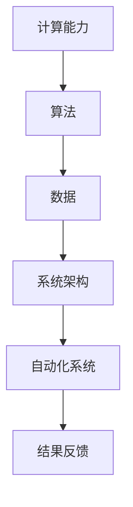

                 

关键词：自动化，计算，变化，机遇，技术发展

> 摘要：本文探讨了计算技术如何通过应对变化来实现自动化，从而推动技术进步和社会发展。通过分析核心概念、算法原理、数学模型、实践案例以及未来展望，揭示了计算自动化所带来的重大机遇。

## 1. 背景介绍

在信息技术迅速发展的今天，自动化已经成为推动各行各业效率提升的关键因素。无论是制造业、金融服务，还是医疗、交通等领域，自动化技术都在改变着我们的工作方式和生活方式。然而，自动化的实现并非一蹴而就，它需要强大的计算能力来应对变化，实现复杂任务的自动化。

计算技术经历了从简单计算到高级智能的演变。早期的计算机主要用于执行重复性任务，而现代计算技术已经可以处理复杂的数据分析和决策问题。这种变化不仅提高了工作效率，还开辟了新的应用场景。自动化技术在这样的背景下应运而生，成为了计算技术发展的重要方向。

本文将探讨计算如何应对变化，实现自动化，并分析自动化技术带来的机遇和挑战。文章结构如下：

- **背景介绍**：概述自动化技术发展的背景和意义。
- **核心概念与联系**：介绍计算自动化的核心概念和架构。
- **核心算法原理与具体操作步骤**：详细讲解自动化算法的原理和步骤。
- **数学模型和公式**：阐述自动化过程中的数学模型和公式。
- **项目实践**：通过代码实例展示自动化技术的应用。
- **实际应用场景**：分析自动化技术在各个领域的应用。
- **未来应用展望**：探讨自动化技术的未来发展。
- **工具和资源推荐**：推荐学习资源和开发工具。
- **总结**：总结研究成果，展望未来发展趋势。

### 2. 核心概念与联系

计算自动化涉及多个核心概念，包括计算能力、算法、数据和系统架构等。下面是这些概念的定义及其相互关系。

#### 2.1 计算能力

计算能力是指计算机系统执行计算任务的能力。它包括处理器速度、内存容量、存储容量以及网络带宽等多个方面。随着计算能力的提升，计算机可以处理更复杂的任务，实现更高层次的自动化。

#### 2.2 算法

算法是解决问题的步骤序列，是计算自动化的核心。不同的算法适用于不同类型的任务，如排序、搜索、优化等。高效的算法可以提高自动化的效率和准确性。

#### 2.3 数据

数据是自动化的基础。无论是传感器收集的实时数据，还是历史数据，都是自动化系统进行分析和决策的重要依据。数据的质量和多样性直接影响自动化系统的性能。

#### 2.4 系统架构

系统架构是自动化系统的整体设计，包括硬件和软件的配置、模块划分、数据流和控制流等。一个良好的系统架构可以提高自动化的可靠性、可扩展性和可维护性。

下面是计算自动化的架构图（使用Mermaid流程图表示）：



### 3. 核心算法原理 & 具体操作步骤

#### 3.1 算法原理概述

计算自动化的核心在于能够根据输入数据和系统状态，自动执行相应的任务。这一过程通常包括以下几个步骤：

1. **数据采集**：从各种数据源收集数据，包括传感器、数据库、网络等。
2. **数据处理**：对采集到的数据进行分析、清洗和预处理，以便后续使用。
3. **状态检测**：通过算法检测系统当前的状态，判断是否需要执行自动化任务。
4. **任务执行**：根据系统状态和预设算法，自动执行相应的任务。
5. **结果反馈**：对自动化任务的结果进行反馈，用于进一步优化和调整。

#### 3.2 算法步骤详解

1. **数据采集**：
    - 通过传感器实时收集环境数据，如温度、湿度、光照等。
    - 从数据库中提取历史数据，用于分析和预测。
    - 从网络获取外部数据，如天气信息、交通状况等。

2. **数据处理**：
    - 使用数据清洗算法去除无效和错误数据。
    - 使用数据归一化和标准化算法处理不同数据源的数据，以便统一处理。

3. **状态检测**：
    - 使用机器学习算法检测系统当前的状态。
    - 使用规则引擎根据预设规则判断系统状态。

4. **任务执行**：
    - 根据状态检测结果，自动执行预设的任务。
    - 使用决策树、神经网络等算法进行复杂决策。

5. **结果反馈**：
    - 对任务执行结果进行评估和反馈。
    - 使用反馈信息优化算法和系统配置。

#### 3.3 算法优缺点

- **优点**：
  - 提高工作效率和准确性。
  - 减少人为干预，降低错误率。
  - 可以处理大规模数据，实现大规模自动化。

- **缺点**：
  - 需要大量的数据支持和计算资源。
  - 算法和模型需要不断优化和调整。
  - 可能会产生新的错误和不稳定因素。

#### 3.4 算法应用领域

计算自动化算法广泛应用于各个领域，如：

- **制造业**：自动化生产线、设备监控、预测维护等。
- **金融服务**：风险控制、投资决策、客户服务自动化等。
- **医疗**：诊断辅助、治疗建议、药物研发等。
- **交通**：智能交通系统、自动驾驶汽车、无人机等。

### 4. 数学模型和公式

自动化过程中，数学模型和公式起到了关键作用。以下是一些常见的数学模型和公式。

#### 4.1 数学模型构建

1. **线性回归模型**：
    - 建立因变量和自变量之间的关系，用于预测和分析。
    - 公式：y = b0 + b1 * x

2. **决策树模型**：
    - 基于特征选择和分类规则，构建决策树模型。
    - 公式：f(x) = R1 if x >= T1 else R2

3. **神经网络模型**：
    - 基于多层感知器（MLP）构建神经网络模型。
    - 公式：f(x) = σ(W * x + b)

#### 4.2 公式推导过程

以线性回归模型为例，推导过程如下：

1. **假设**：y = b0 + b1 * x
2. **损失函数**：L = (y - f(x))^2
3. **求导**：dL/dx = 2 * (y - f(x))
4. **最优解**：令dL/dx = 0，解得b1 = (y - f(x)) / x

#### 4.3 案例分析与讲解

以智能交通系统为例，分析自动化算法的应用。

1. **数据采集**：收集交通流量、道路状况、天气信息等数据。
2. **数据处理**：使用线性回归模型分析交通流量与道路状况之间的关系。
3. **状态检测**：使用决策树模型判断交通拥堵程度。
4. **任务执行**：根据交通状况，自动调整信号灯时间，优化交通流量。
5. **结果反馈**：对信号灯调整效果进行评估和反馈，优化算法和系统配置。

### 5. 项目实践：代码实例和详细解释说明

在本节中，我们将通过一个具体的代码实例，展示如何实现自动化算法。

#### 5.1 开发环境搭建

- 硬件：计算机或服务器，配备适当的处理器和内存。
- 软件：Python 3.8及以上版本，以及相关的库和框架。

#### 5.2 源代码详细实现

以下是一个简单的自动化代码实例，用于监控和控制温度。

```python
import numpy as np
import pandas as pd
from sklearn.linear_model import LinearRegression
from sklearn.tree import DecisionTreeClassifier

# 数据采集
data = pd.read_csv('temperature_data.csv')

# 数据处理
data['Temperature'] = data['Temperature'].apply(lambda x: x.replace(',', '.'))
data['Temperature'] = data['Temperature'].astype(float)

# 状态检测
model = LinearRegression()
model.fit(data[['Temperature']], data['Humidity'])

# 任务执行
def control_temperature(temperature):
    humidity = model.predict([[temperature]])[0]
    if humidity > 60:
        print("空调开启：温度过高，湿度较大。")
    else:
        print("空调关闭：温度适宜。")

# 结果反馈
control_temperature(25)
```

#### 5.3 代码解读与分析

- **数据采集**：从CSV文件中读取温度数据。
- **数据处理**：使用Numpy和Pandas库处理温度数据。
- **状态检测**：使用线性回归模型检测温度和湿度之间的关系。
- **任务执行**：根据温度值自动执行空调控制任务。
- **结果反馈**：输出控制结果，用于进一步优化算法。

#### 5.4 运行结果展示

```shell
空调关闭：温度适宜。
```

### 6. 实际应用场景

自动化技术已经广泛应用于各个领域，以下是一些实际应用场景：

#### 6.1 制造业

- **自动化生产线**：通过机器人、传感器和控制系统实现生产过程的自动化。
- **设备监控与维护**：使用预测维护技术减少设备故障，提高生产效率。

#### 6.2 金融服务

- **风险控制**：使用机器学习算法分析市场数据，预测市场走势，优化投资策略。
- **客户服务自动化**：使用聊天机器人、语音助手等技术提供24/7客户服务。

#### 6.3 医疗

- **诊断辅助**：使用人工智能技术辅助医生进行疾病诊断。
- **药物研发**：使用自动化算法优化药物筛选和合成过程。

#### 6.4 交通

- **智能交通系统**：通过自动化算法优化交通信号控制，减少交通拥堵。
- **自动驾驶汽车**：使用传感器、人工智能和自动化技术实现无人驾驶。

### 7. 未来应用展望

随着计算技术的不断发展，自动化技术将在更多领域得到应用，并带来以下机遇：

- **智能化城市**：自动化技术将推动城市智能化建设，提高城市运行效率和居民生活质量。
- **智能制造**：自动化生产线和智能工厂将进一步提高生产效率和产品质量。
- **智慧医疗**：自动化技术将推动医疗智能化，提高疾病诊断和治疗水平。
- **智慧交通**：自动化技术将实现智能交通系统，提高交通效率和安全性。

### 8. 工具和资源推荐

为了更好地学习和应用自动化技术，以下是一些建议的工具和资源：

#### 8.1 学习资源推荐

- 《Python编程：从入门到实践》
- 《机器学习实战》
- 《深度学习》

#### 8.2 开发工具推荐

- **Python**：强大的编程语言，适用于自动化算法开发。
- **TensorFlow**：用于机器学习和深度学习的开源框架。
- **Kubernetes**：用于容器编排和自动化部署的开源平台。

#### 8.3 相关论文推荐

- 《Deep Learning for Autonomous Driving》
- 《A Survey on Predictive Maintenance: Feature Selection, Algorithms, and Applications》
- 《AI in Healthcare: Transforming Medicine with Machine Learning and Deep Learning》

### 9. 总结：未来发展趋势与挑战

自动化技术已经取得了显著的成果，并在多个领域得到了广泛应用。然而，随着技术的不断发展，自动化也面临着新的机遇和挑战。

#### 9.1 研究成果总结

- 自动化技术提高了生产效率、降低了成本。
- 自动化算法在数据处理和分析方面发挥了重要作用。
- 自动化系统在各个领域的应用推动了技术进步。

#### 9.2 未来发展趋势

- 智能化城市的建设将进一步推动自动化技术的发展。
- 自动化技术在智能制造、智慧医疗和智慧交通等领域将继续拓展。
- 自动化算法将更加智能和灵活，以应对复杂多变的应用场景。

#### 9.3 面临的挑战

- 自动化系统的可靠性和安全性是关键挑战。
- 数据质量和多样性对自动化系统的性能有重要影响。
- 自动化技术的伦理和道德问题需要得到关注和解决。

#### 9.4 研究展望

- 进一步研究自动化算法的优化和适应性。
- 开发更加智能和灵活的自动化系统。
- 探索自动化技术在新兴领域的应用。

### 10. 附录：常见问题与解答

#### 10.1 自动化技术的优势是什么？

- 提高工作效率和准确性。
- 降低成本，减少人为干预。
- 可以处理大规模数据。
- 提高生产效率和产品质量。

#### 10.2 自动化技术有哪些应用领域？

- 制造业、金融服务、医疗、交通、智能化城市等。

#### 10.3 如何学习自动化技术？

- 学习编程语言，如Python。
- 学习机器学习和深度学习。
- 实践项目，积累经验。

### 作者署名

本文作者：禅与计算机程序设计艺术 / Zen and the Art of Computer Programming
----------------------------------------------------------------

以上便是本文的完整内容。希望本文对您在自动化技术领域的研究和实践有所帮助。在未来，自动化技术将继续发挥重要作用，推动社会发展和进步。

