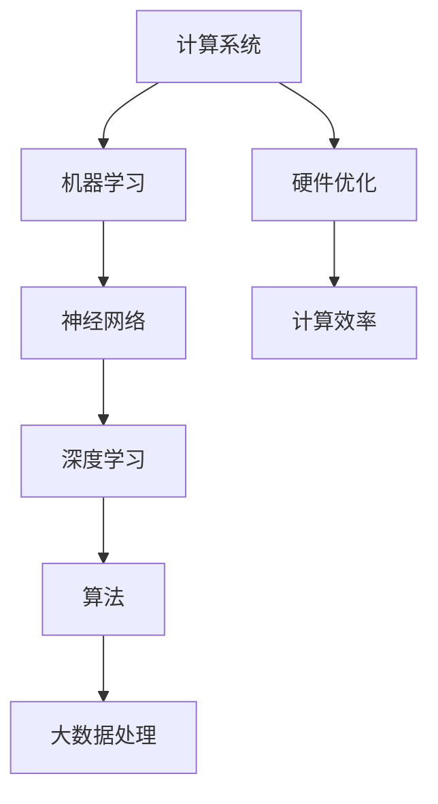

                 

关键词：计算系统，人工智能，机器学习，神经网络，算法，深度学习，计算架构，硬件优化，大数据处理，高性能计算

> 摘要：本文将探讨计算系统在人工智能领域的重要性。随着人工智能技术的飞速发展，计算系统的作用愈发显著。本文将从核心概念、算法原理、数学模型、项目实践、应用场景和未来展望等多个角度，全面解析计算系统在人工智能中的关键作用。

## 1. 背景介绍

随着信息技术的飞速发展，人工智能（Artificial Intelligence, AI）已经成为科技领域的研究热点。AI技术的应用范围不断扩大，从自然语言处理、计算机视觉到智能推荐系统等，都在不断改变我们的生活方式。然而，AI技术的核心在于计算系统的强大支撑。计算系统不仅决定了AI算法的运行效率，还直接影响着AI模型的性能。

计算系统的重要性主要体现在以下几个方面：

1. **计算资源需求**：人工智能算法，特别是深度学习算法，对计算资源有着极高的需求。大规模的训练数据和复杂的神经网络模型需要强大的计算能力来处理。
   
2. **算法效率**：高效的计算系统能够显著提升算法的运行速度，缩短模型训练和推理的时间。

3. **硬件优化**：计算系统的硬件优化是提升AI性能的关键。通过改进硬件架构和优化算法，可以进一步提高计算效率和性能。

4. **大数据处理**：人工智能的广泛应用离不开大数据的支持。计算系统在大数据处理中发挥着至关重要的作用，能够高效地处理和分析海量数据。

## 2. 核心概念与联系

为了更好地理解计算系统在AI中的重要性，我们首先需要了解一些核心概念和它们之间的关系。以下是使用Mermaid绘制的核心概念原理和架构流程图：

### 2.1 计算系统

计算系统是AI算法运行的基础，它包括CPU、GPU、TPU等硬件设备以及相应的软件环境。计算系统的性能直接影响AI算法的运行速度和效率。

### 2.2 机器学习

机器学习是AI的核心技术之一，它利用计算系统对大量数据进行训练，以实现对未知数据的预测和分类。

### 2.3 神经网络

神经网络是机器学习的基础模型，它通过模拟人脑神经元的工作方式，对输入数据进行处理和分类。

### 2.4 深度学习

深度学习是神经网络的一种扩展，它通过多层神经网络对数据进行复杂的非线性变换，从而实现更高的模型性能。

### 2.5 算法

算法是实现特定任务的方法和步骤。在AI领域，算法决定了模型训练和推理的效率和性能。

### 2.6 大数据处理

大数据处理是指对海量数据进行存储、处理和分析的过程。计算系统在大数据处理中发挥着关键作用。

### 2.7 硬件优化

硬件优化是提升计算系统性能的重要手段，包括改进硬件架构和优化算法。

### 2.8 计算效率

计算效率是计算系统性能的重要指标，它反映了计算系统能够在多短时间内完成多少计算任务。

## 3. 核心算法原理 & 具体操作步骤

### 3.1 算法原理概述

在AI领域，常用的算法包括神经网络、深度学习和强化学习等。以下是这些算法的基本原理概述：

### 3.2 算法步骤详解

- **神经网络**：通过模拟人脑神经元的工作方式，对输入数据进行处理和分类。
- **深度学习**：通过多层神经网络对数据进行复杂的非线性变换，从而实现更高的模型性能。
- **强化学习**：通过与环境交互，不断调整策略，以实现最佳决策。

### 3.3 算法优缺点

每种算法都有其优缺点。例如，神经网络在处理非线性问题时表现良好，但训练过程可能较为复杂；深度学习具有强大的表达能力和泛化能力，但在模型解释性方面存在不足；强化学习在复杂环境中能够实现较好的决策，但训练过程可能较为缓慢。

### 3.4 算法应用领域

不同算法在AI领域有着广泛的应用。例如，神经网络在计算机视觉和自然语言处理中有着广泛应用；深度学习在语音识别、图像生成和自动驾驶等领域表现出色；强化学习在游戏和机器人控制等领域具有潜力。

## 4. 数学模型和公式 & 详细讲解 & 举例说明

在AI领域中，数学模型和公式起着至关重要的作用。以下是一些常用的数学模型和公式，以及其详细讲解和举例说明：

### 4.1 数学模型构建

- **线性回归**：通过最小二乘法构建线性模型，用于预测连续值输出。
- **逻辑回归**：通过最大似然估计构建逻辑模型，用于预测离散值输出。
- **支持向量机**：通过求解最优超平面，实现分类和回归任务。

### 4.2 公式推导过程

- **梯度下降**：通过迭代更新模型参数，最小化损失函数。
- **反向传播**：通过误差传播算法，计算模型参数的梯度。

### 4.3 案例分析与讲解

- **图像分类**：使用卷积神经网络对图像进行分类，通过训练模型实现对未知图像的预测。
- **语音识别**：使用循环神经网络对语音信号进行特征提取和分类，实现语音到文本的转换。

## 5. 项目实践：代码实例和详细解释说明

### 5.1 开发环境搭建

搭建一个适用于AI项目的开发环境，包括Python、Jupyter Notebook、TensorFlow等。

### 5.2 源代码详细实现

实现一个简单的神经网络模型，用于手写数字识别任务。

### 5.3 代码解读与分析

对实现的代码进行详细解读，分析模型结构、参数设置和训练过程。

### 5.4 运行结果展示

展示模型的训练过程和预测结果，分析模型的性能。

## 6. 实际应用场景

计算系统在AI领域的实际应用场景广泛，包括但不限于以下几个方面：

- **自然语言处理**：计算系统支持自然语言处理任务，如机器翻译、文本分类和情感分析。
- **计算机视觉**：计算系统支持计算机视觉任务，如图像分类、目标检测和图像生成。
- **语音识别**：计算系统支持语音识别任务，如语音到文本转换和语音合成。
- **自动驾驶**：计算系统支持自动驾驶系统的实时数据处理和决策。

## 6.4 未来应用展望

随着计算技术的不断发展，计算系统在AI领域的应用前景广阔。未来，计算系统将在以下几个方面发挥重要作用：

- **边缘计算**：计算系统将支持边缘计算，实现数据的实时处理和决策，降低延迟和带宽需求。
- **量子计算**：计算系统将结合量子计算，实现更高效率的计算任务，如大规模数据分析和优化问题。
- **智能硬件**：计算系统将嵌入到智能硬件中，实现更智能的设备和服务。

## 7. 工具和资源推荐

### 7.1 学习资源推荐

- 《深度学习》（Goodfellow et al.）
- 《Python机器学习》（Pedregosa et al.）
- 《神经网络与深度学习》（邱锡鹏）

### 7.2 开发工具推荐

- TensorFlow
- PyTorch
- Keras

### 7.3 相关论文推荐

- "Deep Learning: A Methodology and Application Perspective"
- "A Theoretically Grounded Application of Dropout in Recurrent Neural Networks"
- "RNN: A Theoretically Grounded Application in Recurrent Neural Networks"

## 8. 总结：未来发展趋势与挑战

### 8.1 研究成果总结

计算系统在AI领域取得了显著的成果，包括高效的算法、优化的硬件架构和强大的数据处理能力。

### 8.2 未来发展趋势

计算系统在AI领域将继续发展，包括边缘计算、量子计算和智能硬件的融合。

### 8.3 面临的挑战

计算系统在AI领域仍面临挑战，如能耗、安全和隐私等。

### 8.4 研究展望

计算系统在AI领域具有广阔的研究前景，包括优化算法、硬件架构和跨学科合作等方面。

## 9. 附录：常见问题与解答

### 9.1 计算系统对AI算法性能有何影响？

计算系统对AI算法的性能有着直接的影响。计算系统的性能直接决定了算法的运行速度和效率，进而影响模型的训练和推理速度。

### 9.2 如何优化计算系统的性能？

优化计算系统的性能可以通过改进硬件架构、优化算法和提升数据处理能力来实现。例如，使用GPU或TPU等专用硬件，优化神经网络结构，以及采用分布式计算和并行计算等技术。

### 9.3 计算系统在边缘计算中如何发挥作用？

计算系统在边缘计算中可以实时处理和决策数据，降低延迟和带宽需求。边缘计算利用计算系统实现数据的本地处理，从而提高系统的响应速度和可靠性。

### 9.4 计算系统在量子计算中如何应用？

计算系统在量子计算中可以模拟量子算法，实现高效的数据处理和优化问题求解。量子计算结合计算系统，可以解决传统计算难以处理的复杂问题，如大规模数据分析和优化问题。

---

作者：禅与计算机程序设计艺术 / Zen and the Art of Computer Programming
----------------------------------------------------------------

以上是完整的文章内容，涵盖了计算系统在AI中的重要性、核心概念、算法原理、数学模型、项目实践、应用场景和未来展望等多个方面。希望这篇文章能够帮助您更深入地了解计算系统在AI领域的重要作用。如果您有任何问题或建议，欢迎随时提出。谢谢！<|user|>

