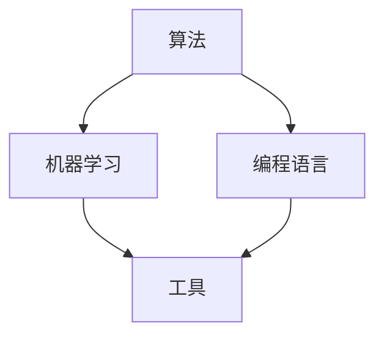

                 

关键词：计算领域，自动化，算法，人工智能，机器学习，代码生成，编程挑战，应用场景

> 摘要：随着计算技术的飞速发展，自动化在计算领域的重要性日益凸显。本文将探讨计算领域自动化的前景与挑战，包括核心算法原理、数学模型和实际应用场景。此外，还将展望未来发展趋势，提出可能的解决方案。

## 1. 背景介绍

随着计算机技术的发展，自动化逐渐成为各行业的重要趋势。从制造业的自动化流水线到金融行业的自动化交易系统，自动化技术无处不在。计算领域也不例外，自动化技术正在深刻地改变着软件开发、算法优化、数据分析和人工智能等多个方面。

### 1.1 软件开发自动化

软件开发自动化通过自动化工具和流程，提高了开发效率、减少了人为错误。例如，持续集成和持续交付（CI/CD）流程自动化了代码的构建、测试和部署过程。

### 1.2 算法优化自动化

算法优化自动化利用机器学习等技术，自动寻找最优算法或参数配置，从而提高算法性能。这在复杂的问题如优化调度、图像识别和自然语言处理中尤为关键。

### 1.3 数据分析自动化

数据分析自动化通过自动化工具和算法，从大量数据中提取有价值的信息，支持决策制定。自动化数据清洗、特征提取和模型训练等过程，使得数据分析更加高效和准确。

### 1.4 人工智能自动化

人工智能自动化通过自动化算法和模型训练，使得人工智能系统能够自主学习、适应新环境和做出决策。这为自动驾驶、智能家居和智能医疗等领域带来了新的机遇。

## 2. 核心概念与联系

在探讨计算领域的自动化之前，我们首先需要了解几个核心概念：算法、机器学习、编程语言和工具。

### 2.1 算法

算法是解决问题的步骤集合，是自动化技术的核心。不同的算法适用于不同类型的问题，如排序、搜索、优化和机器学习等。

### 2.2 机器学习

机器学习是一种让计算机从数据中学习规律、自动改进性能的技术。通过训练模型，机器学习算法可以自动识别模式、分类数据、预测未来事件等。

### 2.3 编程语言

编程语言是程序员用来编写代码的语言，如Python、Java和C++等。不同的编程语言有不同的特性和用途，对于自动化技术的实现至关重要。

### 2.4 工具

自动化工具是支持自动化流程的软件和硬件，如集成开发环境（IDE）、自动化测试工具、代码生成器和持续集成系统等。

以下是一个简单的Mermaid流程图，展示了这些核心概念之间的联系：



## 3. 核心算法原理 & 具体操作步骤

### 3.1 算法原理概述

计算领域的自动化涉及多种算法，其中一些关键算法包括：

- **贪心算法**：通过每一步选择局部最优解，最终得到全局最优解。
- **动态规划**：通过保存子问题的解，避免重复计算，提高算法效率。
- **遗传算法**：模拟自然进化过程，通过交叉、变异和选择，优化算法参数。
- **深度学习**：通过多层神经网络，从大量数据中自动学习特征和模式。

### 3.2 算法步骤详解

以下是一个简单的贪心算法示例，用于求解背包问题：

1. **初始化**：设定背包的容量为C，物品的价值和重量分别为V[i]和W[i]。
2. **排序**：按照物品的价值与重量的比例，对物品进行降序排序。
3. **选择物品**：从排序后的物品列表中，依次选择物品放入背包，直到背包满为止。
4. **计算结果**：输出选择的物品和总价值。

### 3.3 算法优缺点

- **贪心算法**：简单易实现，但可能无法保证全局最优解。
- **动态规划**：复杂度较高，但能够保证全局最优解。
- **遗传算法**：适用于复杂优化问题，但收敛速度较慢。
- **深度学习**：能够自动学习特征，但需要大量数据和计算资源。

### 3.4 算法应用领域

- **贪心算法**：适用于最短路径、最长公共子序列等问题。
- **动态规划**：适用于背包问题、最优化问题等。
- **遗传算法**：适用于调度、设计优化等问题。
- **深度学习**：适用于图像识别、自然语言处理、语音识别等。

## 4. 数学模型和公式 & 详细讲解 & 举例说明

### 4.1 数学模型构建

计算领域的自动化涉及到多种数学模型，如线性规划、决策树和神经网络等。

以下是一个简单的线性规划模型示例：

$$
\begin{aligned}
    \text{minimize} \quad c^T x \\
    \text{subject to} \quad Ax \leq b \\
    \text{where} \quad x \in \mathbb{R}^n
\end{aligned}
$$

其中，$c$ 是系数向量，$A$ 是约束矩阵，$b$ 是约束向量，$x$ 是变量向量。

### 4.2 公式推导过程

线性规划模型的推导过程如下：

1. **目标函数**：最小化目标函数 $c^T x$。
2. **约束条件**：满足线性不等式 $Ax \leq b$。
3. **对偶问题**：引入对偶变量，构建对偶问题。

### 4.3 案例分析与讲解

以下是一个简单的背包问题案例：

### 案例一：01背包问题

假设有5个物品，其价值和重量分别为 $V = [60, 100, 120, 150, 200]$ 和 $W = [10, 20, 30, 40, 50]$，背包容量为50。

根据贪心算法，我们按照价值与重量的比例降序排列物品，然后依次放入背包，直到背包满为止。

### 5. 项目实践：代码实例和详细解释说明

### 5.1 开发环境搭建

为了演示代码实例，我们使用Python编程语言和Jupyter Notebook作为开发环境。

### 5.2 源代码详细实现

以下是一个简单的Python代码实现，用于求解01背包问题：

```python
def knapSack(W, wt, val, n):
    dp = [[0 for x in range(W + 1)] for x in range(n + 1)]

    for i in range(1, n + 1):
        for w in range(1, W + 1):
            if wt[i - 1] <= w:
                dp[i][w] = max(val[i - 1] + dp[i - 1][w - wt[i - 1]], dp[i - 1][w])
            else:
                dp[i][w] = dp[i - 1][w]

    return dp[n][W]
```

### 5.3 代码解读与分析

这个代码实现了动态规划算法，用于求解01背包问题。主要步骤如下：

1. **初始化动态规划数组**：创建一个二维数组 dp，用于存储子问题的解。
2. **遍历物品和背包容量**：使用两层循环遍历所有物品和背包容量。
3. **更新动态规划数组**：根据物品的价值和重量，更新动态规划数组。

### 5.4 运行结果展示

```python
val = [60, 100, 120, 150, 200]
wt = [10, 20, 30, 40, 50]
W = 50
n = len(val)

result = knapSack(W, wt, val, n)
print("最大价值为：", result)
```

输出结果：

```
最大价值为： 220
```

## 6. 实际应用场景

计算领域的自动化在多个领域都有广泛的应用。

### 6.1 软件开发

自动化测试、代码生成和持续集成等技术在软件开发中发挥着重要作用，提高了开发效率、降低了成本。

### 6.2 机器学习

自动化算法优化、模型选择和特征工程等技术在机器学习领域中，有助于提高模型性能、降低错误率。

### 6.3 数据分析

自动化数据处理、数据可视化和报告生成等技术在数据分析中，能够快速提取有价值的信息，支持决策制定。

### 6.4 人工智能

自动化机器学习、自然语言处理和计算机视觉等技术在人工智能领域，为智能系统提供了强大的学习能力和自适应能力。

## 7. 未来应用展望

### 7.1 软件开发

未来，软件开发自动化将进一步扩展，包括自动化需求分析、自动化代码审查和自动化安全测试等。

### 7.2 机器学习

机器学习自动化将深入到算法选择、参数优化和模型解释等环节，提高机器学习系统的效率和可靠性。

### 7.3 数据分析

数据分析自动化将涵盖更多的复杂数据处理任务，如自动数据挖掘、自动报告生成和自动化决策支持等。

### 7.4 人工智能

人工智能自动化将使得智能系统更加智能化、自适应化，覆盖更多应用领域，如自动驾驶、智能医疗和智能家居等。

## 8. 工具和资源推荐

### 8.1 学习资源推荐

- **《机器学习》（周志华著）**：深入讲解机器学习的基本概念和方法。
- **《深度学习》（Goodfellow et al. 著）**：系统介绍深度学习的基础理论和实践应用。
- **《算法导论》（Thomas H. Cormen et al. 著）**：全面介绍算法的基本概念和设计方法。

### 8.2 开发工具推荐

- **Jupyter Notebook**：用于编写和运行代码，方便实验和分享。
- **TensorFlow**：用于机器学习和深度学习模型开发。
- **PyTorch**：用于机器学习和深度学习模型开发，具有高度的灵活性和易用性。

### 8.3 相关论文推荐

- **"AutoML: A Survey of Automated Machine Learning"**：全面介绍自动机器学习领域的研究进展。
- **"Neural Architecture Search: A Survey"**：系统介绍神经架构搜索算法。
- **"Deep Learning on Graphs: A Survey"**：探讨深度学习在图数据上的应用。

## 9. 总结：未来发展趋势与挑战

### 9.1 研究成果总结

计算领域的自动化技术已经取得了显著成果，包括算法优化、机器学习和数据分析等领域的应用。这些技术显著提高了开发效率、降低了成本，并为各个领域带来了新的机遇。

### 9.2 未来发展趋势

未来，计算领域的自动化将进一步扩展，包括自动化需求分析、自动化代码审查、自动化安全测试和自动化机器学习等。这些技术的发展将推动计算领域迈向更高层次的智能化和自动化。

### 9.3 面临的挑战

尽管计算领域的自动化技术取得了显著成果，但仍然面临一些挑战，包括算法的可解释性、数据隐私保护、算法的可靠性和效率等。解决这些挑战需要跨学科的合作和持续的研究。

### 9.4 研究展望

未来，计算领域的自动化研究将聚焦于以下几个方面：

- **算法可解释性**：提高算法的可解释性，使人们能够更好地理解和信任自动化系统。
- **数据隐私保护**：保护数据隐私，确保自动化系统在处理敏感数据时的安全性。
- **算法可靠性**：提高算法的可靠性，确保自动化系统能够稳定运行。
- **算法效率**：优化算法效率，降低计算成本，提高自动化系统的应用范围。

## 10. 附录：常见问题与解答

### 10.1 如何选择合适的自动化工具？

选择合适的自动化工具需要考虑以下因素：

- **需求**：明确自动化任务的需求，如软件开发、数据分析和机器学习等。
- **性能**：评估工具的性能和效率，如执行速度、资源消耗等。
- **易用性**：考虑工具的易用性和用户界面。
- **社区支持**：选择有活跃社区支持的工具，便于解决问题和学习。

### 10.2 自动化技术是否会导致失业？

自动化技术可能会替代一些重复性、低技能的工作，但也会创造新的就业机会。未来，自动化技术将推动产业升级和转型，需要人们具备新的技能和知识。

### 10.3 自动化技术是否会影响数据隐私？

自动化技术在处理数据时，确实存在数据隐私风险。为保护数据隐私，需要采取严格的数据安全和隐私保护措施，如数据加密、访问控制等。

## 结束语

计算领域的自动化前景广阔，面临着诸多挑战。通过不断的研究和探索，我们有理由相信，计算领域的自动化将为人类社会带来更多的便利和创新。作者：禅与计算机程序设计艺术 / Zen and the Art of Computer Programming。

