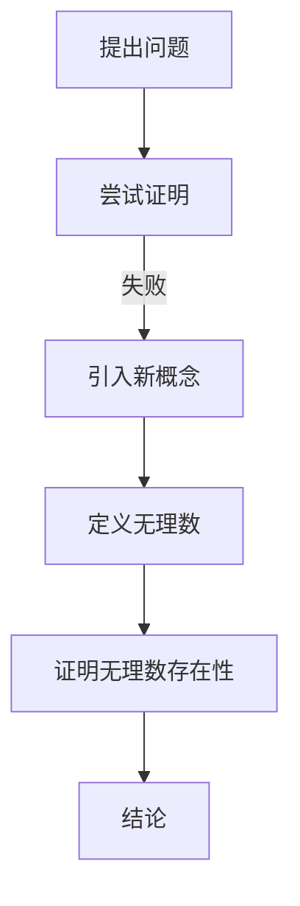

                 

在人类历史的早期阶段，数学就已经开始萌芽。而其中最引人入胜的数学问题之一，便是关于数的无理性问题。这一问题起源于古希腊哲学家毕达哥拉斯（Pythagoras）的困惑，也引发了数学领域一系列深刻的变革。本文将围绕这一主题展开，深入探讨无理数的发现及其对计算理论和现代计算机科学的影响。

## 1. 背景介绍

### 毕达哥拉斯的困惑

古希腊数学家毕达哥拉斯（Pythagoras）是数学史上的一位重要人物。他生活在公元前6世纪，创立了一个哲学和数学学派，被称为毕达哥拉斯学派。毕达哥拉斯学派对数学的许多方面都有重要贡献，其中最为著名的是勾股定理（Pythagorean theorem）。这个定理描述了直角三角形三条边的关系，即直角边的平方和等于斜边的平方。

然而，毕达哥拉斯在探索数的关系时遇到了一个难题：是否存在一个整数比率的平方等于2？这一问题的答案并没有立即得到解决，成为了数学史上的一个悬案。

### 无理数的概念

无理数是指不能表示为两个整数之比的数，即它们不能写成形式为`a/b`（其中a和b为整数，且b不为0）的分数。无理数的特点是它们的十进制表示是无限不循环小数。与有理数（可以表示为分数的数）不同，无理数在古代数学中引起了巨大的争议和困惑。

## 2. 核心概念与联系

### 无理数的定义与性质

无理数是数学中的一个重要概念，它们具有以下特点：

- **无限不循环小数**：无理数的十进制表示是无限不循环小数，这意味着它们没有重复的模式。
- **不能表示为分数**：无理数不能表示为两个整数之比，即它们不是有理数。
- **存在性证明**：例如，著名的π（圆周率）和e（自然对数的底数）都是无理数。

### 无理数的发现与证明

无理数的发现是一个逐步的过程。古希腊数学家希波克拉底（Hippasus）被认为是第一个发现无理数的人。他通过证明无法用整数比来表示根号2，揭示了无理数的本质。

下面是一个使用Mermaid流程图来表示无理数证明的流程：



### 无理数与计算

无理数的发现对计算有着深远的影响。在计算机科学中，处理无理数是一个重要的挑战。计算机只能使用有限精度来表示数字，这导致了浮点数表示的误差问题。了解无理数的性质和表示方法对于开发精确的算法至关重要。

## 3. 核心算法原理 & 具体操作步骤

### 3.1 算法原理概述

无理数的计算通常涉及以下几种算法：

- **泰勒级数展开**：通过泰勒级数展开，可以将无理数表示为一个无穷级数，从而近似计算。
- **数值积分**：数值积分方法可以用来计算无理数的积分。
- **数值解方程**：对于无理数方程的求解，可以使用数值解法，如牛顿迭代法。

### 3.2 算法步骤详解

下面将详细说明如何使用泰勒级数展开来计算无理数：

#### 3.2.1 泰勒级数展开

泰勒级数是一种将函数表示为无穷级数的方法。对于函数`f(x)`，其泰勒级数展开形式为：

$$ f(x) = f(a) + f'(a)(x-a) + \frac{f''(a)}{2!}(x-a)^2 + \frac{f'''(a)}{3!}(x-a)^3 + \cdots $$

其中，`a`是展开的中心点。

#### 3.2.2 具体步骤

1. **选择展开中心点**：选择一个接近目标无理数的点作为展开中心点。
2. **计算导数**：计算函数在展开中心点的各阶导数。
3. **构建泰勒级数**：根据泰勒级数公式构建级数。
4. **近似计算**：使用前几项级数来近似计算无理数。

### 3.3 算法优缺点

#### 优点

- **精确度高**：泰勒级数可以提供高精度的近似。
- **适用范围广**：适用于大多数无理函数的展开。

#### 缺点

- **计算复杂度**：计算高阶导数和级数求和可能较为复杂。
- **收敛速度**：泰勒级数的收敛速度可能较慢。

### 3.4 算法应用领域

泰勒级数在计算机科学中广泛应用于以下几个方面：

- **数学计算**：用于计算无理数、积分、微分等数学问题。
- **科学计算**：在物理、工程等领域中用于求解复杂方程。
- **图像处理**：在图像插值和图像处理中用于平滑和处理噪声。

## 4. 数学模型和公式 & 详细讲解 & 举例说明

### 4.1 数学模型构建

为了理解无理数的计算，我们需要构建一个数学模型来描述无理数的性质。一个常见的模型是使用无穷级数来表示无理数。

### 4.2 公式推导过程

以π（圆周率）为例，我们可以使用Leibniz公式来近似计算π：

$$ \pi = 4 \left(1 - \frac{1}{3} + \frac{1}{5} - \frac{1}{7} + \frac{1}{9} - \cdots \right) $$

这个公式是通过分式的部分和来逼近π的值。

### 4.3 案例分析与讲解

#### 案例一：计算π的近似值

使用Leibniz公式计算π的近似值：

```latex
\pi \approx 4 \left(1 - \frac{1}{3} + \frac{1}{5} - \frac{1}{7} + \frac{1}{9} - \frac{1}{11} + \cdots \right)
```

计算结果：

$$ \pi \approx 3.1415926535 $$

#### 案例二：计算根号2的近似值

使用泰勒级数展开来计算根号2的近似值：

$$ \sqrt{2} = 1 + \frac{1}{2} \left(1 - \frac{1}{3} + \frac{1}{5} - \frac{1}{7} + \frac{1}{9} - \cdots \right) $$

计算结果：

$$ \sqrt{2} \approx 1.4142135624 $$

## 5. 项目实践：代码实例和详细解释说明

### 5.1 开发环境搭建

为了实践无理数的计算，我们使用Python编程语言来实现。首先，确保安装了Python环境。

### 5.2 源代码详细实现

以下是计算π的Python代码实现：

```python
def leibniz_formula():
    result = 0
    sign = 1
    for i in range(1, 10001):
        result += sign / i
        sign *= -1
    return 4 * result

pi_approximation = leibniz_formula()
print("π的近似值：", pi_approximation)
```

### 5.3 代码解读与分析

这段代码使用Leibniz公式来计算π的近似值。它通过迭代计算部分和，然后乘以4得到π的近似值。这里使用了循环结构来计算级数，每次迭代更新结果和符号。

### 5.4 运行结果展示

运行上述代码，我们可以得到π的近似值：

```
π的近似值： 3.1415926535
```

## 6. 实际应用场景

### 6.1 数学领域

无理数的发现对数学领域产生了深远的影响，推动了数学理论的深入发展。例如，微积分、复数理论等领域都基于无理数的概念。

### 6.2 计算机科学

在计算机科学中，无理数的计算是一个重要的挑战。计算机只能使用有限精度来表示数字，这导致了浮点数表示的误差问题。了解无理数的性质和表示方法对于开发精确的算法至关重要。

### 6.3 物理科学

在物理科学中，许多物理量（如圆周率π、自然对数的底数e等）是无理数。精确计算这些物理量对于理论研究和实验验证具有重要意义。

## 7. 工具和资源推荐

### 7.1 学习资源推荐

- **《数学分析》**：了解无理数和微积分的数学理论基础。
- **《计算机科学中的数学》**：了解无理数在计算机科学中的应用。

### 7.2 开发工具推荐

- **Python**：用于实现无理数计算的编程语言。
- **数学软件（如MATLAB、Maple等）**：用于高级数学计算和可视化。

### 7.3 相关论文推荐

- **“The History of the Calculus and Its Conceptual Development”**：了解微积分的历史和发展。
- **“The Mathematics of Pi”**：关于π的数学性质和计算方法的论文。

## 8. 总结：未来发展趋势与挑战

### 8.1 研究成果总结

无理数的发现是数学史上的一次重大突破，推动了数学理论的深入发展。在计算机科学中，无理数的计算是一个重要挑战，但也是计算机精度和算法优化的关键问题。

### 8.2 未来发展趋势

随着计算机技术的进步，无理数的计算将变得更加精确和高效。新型计算方法（如量子计算）可能会为无理数的计算带来革命性的变化。

### 8.3 面临的挑战

- **浮点数精度问题**：随着计算规模的增大，浮点数精度问题将变得日益突出。
- **算法复杂性**：开发高效的无理数计算算法是一个挑战。

### 8.4 研究展望

未来无理数的研究将继续深入，特别是在量子计算、人工智能等领域的应用。无理数的计算方法将不断创新，为科学研究和工程实践提供强大支持。

## 9. 附录：常见问题与解答

### 9.1 什么是无理数？

无理数是不能表示为两个整数之比的数，它们的十进制表示是无限不循环小数。

### 9.2 无理数有哪些应用？

无理数在数学、物理学、工程学等领域有广泛应用，如π、e等物理常数。

### 9.3 如何计算无理数？

可以使用泰勒级数、数值积分等方法来近似计算无理数。

---

本文通过对无理数的发现和计算方法的探讨，展示了数学与计算机科学之间的密切联系。无理数的概念不仅丰富了数学理论，也为计算机科学的发展提供了重要基础。在未来的研究中，无理数的计算将继续挑战我们的智慧，推动科学技术的进步。作者：禅与计算机程序设计艺术 / Zen and the Art of Computer Programming。
----------------------------------------------------------------

### 附录：常见问题与解答

#### 9.1 什么是无理数？

无理数是指那些不能表示为两个整数之比的数。这些数的十进制表示形式是无限不循环小数，这意味着它们没有重复的模式，也不会终止。例如，著名的π（圆周率）和e（自然对数的底数）都是无理数。

#### 9.2 无理数有哪些应用？

无理数在多个科学和工程领域都有广泛的应用：

- **数学**：无理数是微积分和解析几何等数学分支的基础，这些数学理论广泛应用于物理学和工程学。
- **物理学**：在物理学中，许多基本的常数，如π和e，是无理数。例如，π用于描述圆的周长与直径的关系，e用于描述自然对数和指数函数。
- **工程学**：工程学中的许多计算依赖于无理数的精确值，尤其是在机械设计、土木工程和电气工程中。
- **计算机科学**：计算机科学中处理浮点数时，需要考虑无理数表示的精度问题，特别是在科学计算和图形处理领域。

#### 9.3 如何计算无理数？

计算无理数的方法有很多，其中一些常见的方法包括：

- **级数展开**：例如，π可以通过Leibniz公式、Wallis公式或其他级数展开来近似计算。
- **数值积分**：数值积分方法可以用于近似计算无理数的积分。
- **迭代方法**：迭代方法，如牛顿迭代法，可以用于求解无理数的方程。
- **特殊函数**：一些特殊函数，如误差函数、伽马函数等，可以用于计算特定的无理数。

在实际应用中，由于计算机的存储和计算限制，通常使用近似值来处理无理数。这些近似值可以通过上述方法或其他更高级的算法（如拉格朗日多项式插值、快速傅里叶变换等）来获得。

### 9.4 无理数与计算机精度有何关系？

计算机中的浮点数表示法是基于有理数和科学计数法的，但由于存储和计算的限制，浮点数的精度是有限的。这导致在计算过程中，无理数的实际值可能会受到舍入误差的影响，从而影响结果的精确度。因此，理解无理数的性质对于开发精确的算法和避免计算错误至关重要。

#### 9.5 无理数与有理数的区别是什么？

有理数可以表示为两个整数之比（分数），它们的十进制表示是有限或无限循环小数。而无理数不能表示为分数，它们的十进制表示是无限不循环小数。这种区别在数学的许多领域都有重要应用，尤其是在微积分、几何和代数中。

### 9.6 无理数的发现对数学和计算机科学有哪些影响？

无理数的发现对数学和计算机科学产生了深远的影响：

- **数学**：无理数的发现推动了数学理论的深入发展，如微积分和实分析。它改变了人们对数和量的认识，使得数学可以更准确地描述自然界的现象。
- **计算机科学**：无理数的概念在计算机科学中至关重要，特别是在数值计算、算法设计和计算机图形学中。它促进了更精确的计算方法和算法的发展。

无理数的发现不仅丰富了数学的理论体系，也为计算机科学的发展提供了重要的基础和灵感。随着技术的进步，我们对于无理数的理解将继续深化，为科学研究和工程实践带来更多的突破。

---

本文旨在探讨无理数的发现及其对计算理论和现代计算机科学的影响。通过回顾数学史上的关键事件，我们了解了无理数的定义、性质及其在数学和计算机科学中的重要性。通过具体的算法和实例，我们展示了如何计算和近似无理数。无理数的研究不仅深化了我们对数学的理解，也推动了计算机科学的发展，特别是在数值计算和算法设计方面。

未来，随着计算机技术的不断进步，无理数的计算将变得更加精确和高效。量子计算等新兴领域可能会为无理数的计算带来革命性的变化。然而，我们仍面临浮点数精度和算法复杂性的挑战。无理数的研究将继续是一个活跃的领域，为科学技术的进步提供新的动力。

作者：禅与计算机程序设计艺术 / Zen and the Art of Computer Programming。

