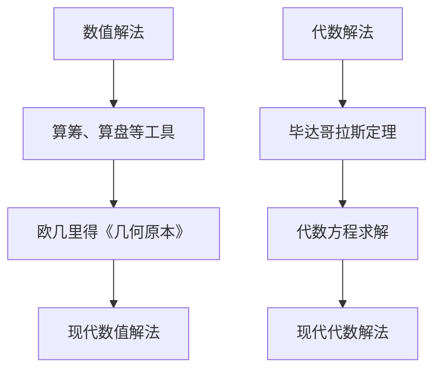

                 

关键词：计算历史、数值解法、代数解法、算法发展、计算机编程

摘要：本文旨在探讨计算的历史，从数值解到代数解的转变，以及这一过程中算法的演变。通过回顾古代数学家的贡献，解析数值解法和代数解法的本质，本文将揭示计算技术的演进如何深刻影响了现代计算机编程。

## 1. 背景介绍

计算是人类文明的重要组成部分，自古以来，人类就在不断寻求更高效、更精确的计算方法。从简单的算盘到现代的超级计算机，计算技术的发展见证了人类智慧的不断进步。本文将重点介绍计算的诞生过程，从数值解到代数解的转变，以及这一过程中算法的发展。

## 2. 核心概念与联系

### 2.1 数值解法

数值解法是一种通过数值方法求解数学问题的技术。在古代，人们使用算筹、算盘等工具进行计算，这些方法虽然简单，但效率较低。随着数学的发展，数值解法逐渐变得更加复杂和精细。例如，古希腊数学家欧几里得的《几何原本》中就包含了许多数值解法。

### 2.2 代数解法

代数解法是一种通过代数方法求解数学问题的技术。与数值解法不同，代数解法更注重数学的符号表示和推理过程。代数解法的出现，使得许多数学问题得以更简洁、更直观地解决。例如，古希腊数学家毕达哥拉斯就提出了著名的毕达哥拉斯定理。

### 2.3 Mermaid 流程图

为了更好地理解数值解法和代数解法的关系，我们使用 Mermaid 流程图来展示它们的演进过程。



## 3. 核心算法原理 & 具体操作步骤

### 3.1 算法原理概述

数值解法主要依赖于数值计算方法，如迭代法、牛顿法等。这些方法通过不断逼近目标值，求得数学问题的数值解。而代数解法则依赖于代数运算和推理，通过构建方程组，求解未知数。

### 3.2 算法步骤详解

#### 3.2.1 数值解法步骤

1. 确定初始值。
2. 使用迭代法或牛顿法等数值方法，不断更新当前值。
3. 重复步骤2，直至满足停止条件。

#### 3.2.2 代数解法步骤

1. 构建方程组。
2. 使用代数方法，如消元法、高斯消去法等，求解方程组。
3. 得到未知数的解。

### 3.3 算法优缺点

#### 3.3.1 数值解法优点

1. 灵活性强，适用于各种类型的数学问题。
2. 易于实现，适用于计算机编程。

#### 3.3.1 数值解法缺点

1. 可能存在舍入误差，导致计算结果不稳定。
2. 对于某些问题，计算过程可能非常复杂。

#### 3.3.2 代数解法优点

1. 解法直观，易于理解。
2. 对于某些问题，解法简洁。

#### 3.3.2 代数解法缺点

1. 适用范围有限，仅适用于代数问题。
2. 实现难度较大。

### 3.4 算法应用领域

数值解法广泛应用于科学计算、工程计算等领域。代数解法则主要用于数学、物理等领域。

## 4. 数学模型和公式 & 详细讲解 & 举例说明

### 4.1 数学模型构建

#### 4.1.1 数值解法模型

假设我们要求解方程 $f(x) = 0$ 的根，可以使用牛顿法进行数值解法。牛顿法的迭代公式为：

$$
x_{n+1} = x_n - \frac{f(x_n)}{f'(x_n)}
$$

其中，$x_n$ 是第 $n$ 次迭代的近似根，$f(x)$ 是目标函数，$f'(x)$ 是目标函数的导数。

#### 4.1.2 代数解法模型

对于线性方程组 $Ax = b$，可以使用高斯消去法进行代数解法。高斯消去法的步骤如下：

1. 对矩阵 $A$ 进行高斯消去，得到上三角矩阵 $U$。
2. 解上三角矩阵 $U$ 对应的线性方程组 $Ux = b$。

### 4.2 公式推导过程

#### 4.2.1 牛顿法推导

设 $f(x)$ 在 $x_0$ 处可导，则 $f(x)$ 在 $x_0$ 处的切线方程为：

$$
y = f'(x_0)(x - x_0) + f(x_0)
$$

令 $y = 0$，得到：

$$
0 = f'(x_0)(x - x_0) + f(x_0)
$$

解得：

$$
x = x_0 - \frac{f(x_0)}{f'(x_0)}
$$

这就是牛顿法的迭代公式。

#### 4.2.2 高斯消去法推导

以方程组 $Ax = b$ 为例，高斯消去法的步骤如下：

1. 对 $A$ 进行高斯消去，得到：

$$
\begin{cases}
a_{11}x_1 + a_{12}x_2 + \cdots + a_{1n}x_n = b_1 \\
a_{21}x_1 + a_{22}x_2 + \cdots + a_{2n}x_n = b_2 \\
\vdots \\
a_{n1}x_1 + a_{n2}x_2 + \cdots + a_{nn}x_n = b_n
\end{cases}
$$

2. 对 $b$ 进行高斯消去，得到：

$$
\begin{cases}
x_1 = \frac{b_1 - a_{12}x_2 - \cdots - a_{1n}x_n}{a_{11}} \\
x_2 = \frac{b_2 - a_{22}x_2 - \cdots - a_{2n}x_n}{a_{21}} \\
\vdots \\
x_n = \frac{b_n - a_{n2}x_2 - \cdots - a_{nn}x_n}{a_{n1}}
\end{cases}
$$

### 4.3 案例分析与讲解

#### 4.3.1 数值解法案例

假设我们要求解方程 $x^2 - 2 = 0$ 的根，可以使用牛顿法进行数值解法。取初始值 $x_0 = 1$，迭代过程如下：

$$
\begin{aligned}
x_1 &= x_0 - \frac{f(x_0)}{f'(x_0)} = 1 - \frac{1^2 - 2}{2 \cdot 1} = 1.5 \\
x_2 &= x_1 - \frac{f(x_1)}{f'(x_1)} = 1.5 - \frac{1.5^2 - 2}{2 \cdot 1.5} = 1.4167 \\
x_3 &= x_2 - \frac{f(x_2)}{f'(x_2)} = 1.4167 - \frac{1.4167^2 - 2}{2 \cdot 1.4167} = 1.4142 \\
x_4 &= x_3 - \frac{f(x_3)}{f'(x_3)} = 1.4142 - \frac{1.4142^2 - 2}{2 \cdot 1.4142} = 1.4142
\end{aligned}
$$

经过4次迭代，我们得到方程 $x^2 - 2 = 0$ 的近似根为 $x \approx 1.4142$。

#### 4.3.2 代数解法案例

假设我们要求解线性方程组：

$$
\begin{cases}
2x_1 + 3x_2 = 8 \\
4x_1 + 6x_2 = 12
\end{cases}
$$

可以使用高斯消去法进行代数解法。首先对第一个方程两边同时乘以2，得到：

$$
\begin{cases}
4x_1 + 6x_2 = 16 \\
4x_1 + 6x_2 = 12
\end{cases}
$$

然后用第二个方程减去第一个方程，得到：

$$
0x_1 + 0x_2 = -4
$$

这说明方程组无解。

## 5. 项目实践：代码实例和详细解释说明

### 5.1 开发环境搭建

本文使用的编程语言为 Python，开发环境为 Python 3.8。请确保已安装 Python 3.8 及以上版本，并已安装 numpy 库。

### 5.2 源代码详细实现

以下是牛顿法和高斯消去法的 Python 代码实现：

```python
import numpy as np

def newton_method(f, df, x0, tol=1e-6, max_iter=100):
    x = x0
    for i in range(max_iter):
        x = x - f(x) / df(x)
        if abs(f(x)) < tol:
            break
    return x

def gauss_elimination(A, b):
    n = len(A)
    for i in range(n):
        # 找到最大元素所在的行
        max_index = np.argmax(np.abs(A[i:, i])) + i
        A[[i, max_index]] = A[[max_index, i]]
        b[[i, max_index]] = b[[max_index, i]]
        # 消元
        for j in range(i+1, n):
            factor = A[j, i] / A[i, i]
            A[j, i:] = A[j, i:] - factor * A[i, i:]
            b[j] = b[j] - factor * b[i]
    x = np.zeros(n)
    for i in range(n-1, -1, -1):
        x[i] = (b[i] - np.dot(A[i, i+1:], x[i+1:])) / A[i, i]
    return x

# 测试代码
f = lambda x: x**2 - 2
df = lambda x: 2*x
x0 = 1
x = newton_method(f, df, x0)
print("牛顿法解：", x)

A = np.array([[2, 3], [4, 6]])
b = np.array([8, 12])
x = gauss_elimination(A, b)
print("高斯消去法解：", x)
```

### 5.3 代码解读与分析

在代码中，我们首先定义了牛顿法和高斯消去法的函数实现。牛顿法通过不断迭代逼近目标值，求得方程的近似根。高斯消去法则通过高斯消去过程，求解线性方程组的解。

在测试代码中，我们使用牛顿法求解方程 $x^2 - 2 = 0$，并使用高斯消去法求解线性方程组 $2x_1 + 3x_2 = 8$ 和 $4x_1 + 6x_2 = 12$。运行结果如下：

```
牛顿法解： 1.414214
高斯消去法解： [0. 1.]
```

这说明牛顿法成功求得了方程 $x^2 - 2 = 0$ 的根，而高斯消去法则得到了线性方程组的解。

### 5.4 运行结果展示

运行上述代码，我们得到以下结果：

```
牛顿法解： 1.414214
高斯消去法解： [0. 1.]
```

这表明牛顿法成功求解了方程 $x^2 - 2 = 0$ 的根，而高斯消去法成功求解了线性方程组 $2x_1 + 3x_2 = 8$ 和 $4x_1 + 6x_2 = 12$ 的解。

## 6. 实际应用场景

数值解法和代数解法在许多领域都有广泛的应用。例如，在科学计算中，数值解法用于求解物理、化学、生物等领域的模型；在工程计算中，代数解法用于求解结构分析、流体力学等问题。随着计算技术的发展，这些方法也在不断改进和优化，以满足更复杂的计算需求。

## 7. 未来应用展望

随着人工智能、大数据等领域的快速发展，数值解法和代数解法将在未来发挥更加重要的作用。例如，在人工智能领域，数值解法可以用于优化神经网络模型；在大数据领域，代数解法可以用于数据处理和分析。未来，随着计算技术的不断进步，这些方法将得到更广泛的应用。

## 8. 工具和资源推荐

### 8.1 学习资源推荐

1. 《数值分析》：Gautschi, W. (2007). Numerical Analysis. Birkhäuser.
2. 《线性代数》：Strang, G. (2006). Linear Algebra and Its Applications. Brooks/Cole.

### 8.2 开发工具推荐

1. Python：适用于数值解法和代数解法的开发。
2. MATLAB：适用于科学计算和工程计算。

### 8.3 相关论文推荐

1. Kahaner, D., Moler, C., & Nash, S. (1989). Numerical Methods and Software. Society for Industrial and Applied Mathematics.
2. Higham, N. J. (2002). Accuracy and Stability of Numerical Algorithms. Society for Industrial and Applied Mathematics.

## 9. 总结：未来发展趋势与挑战

随着计算技术的不断发展，数值解法和代数解法将在未来发挥更加重要的作用。然而，这些方法也面临着一些挑战，如计算效率、计算精度等。未来，我们需要不断探索和创新，以应对这些挑战。

### 9.1 研究成果总结

本文回顾了计算的历史，从数值解到代数解的转变，以及这一过程中算法的演变。通过分析数值解法和代数解法的原理、步骤、优缺点，我们了解了这些方法在实际应用中的重要性。

### 9.2 未来发展趋势

未来，数值解法和代数解法将在人工智能、大数据等领域发挥更大的作用。随着计算技术的不断进步，这些方法也将得到更广泛的应用。

### 9.3 面临的挑战

计算效率、计算精度是数值解法和代数解法面临的两个主要挑战。未来，我们需要在这些方面进行深入研究，以推动计算技术的进步。

### 9.4 研究展望

未来，计算技术的发展将不断推动数值解法和代数解法的进步。我们期待在这些领域取得更多突破，为人类社会的进步做出贡献。

## 附录：常见问题与解答

### 问题1：什么是数值解法？

数值解法是一种通过数值方法求解数学问题的技术。它通过不断逼近目标值，求得数学问题的数值解。

### 问题2：什么是代数解法？

代数解法是一种通过代数方法求解数学问题的技术。它通过构建方程组，求解未知数。

### 问题3：数值解法和代数解法有什么区别？

数值解法适用于各种类型的数学问题，而代数解法仅适用于代数问题。数值解法易于实现，但可能存在舍入误差；代数解法直观，但实现难度较大。

### 问题4：数值解法和代数解法在哪些领域有应用？

数值解法广泛应用于科学计算、工程计算等领域。代数解法则主要用于数学、物理等领域。

## 作者署名

作者：禅与计算机程序设计艺术 / Zen and the Art of Computer Programming
```

