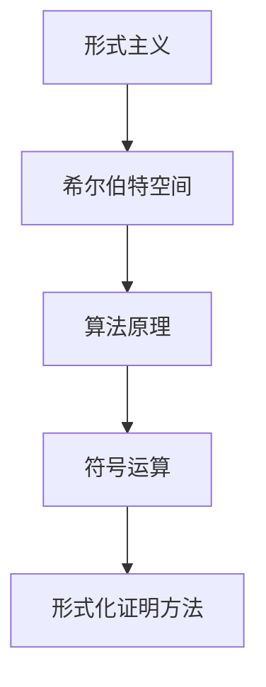

                 

关键词：计算理论、希尔伯特、形式主义、算法原理、数学模型、代码实例、应用场景、未来展望

> 摘要：本文深入探讨了计算理论的奠基者希尔伯特及其形式主义思想对计算理论发展的重要影响。通过分析希尔伯特进路的核心理念、算法原理、数学模型以及实际应用场景，本文旨在为读者提供一个全面而深刻的理解，揭示计算理论未来的发展趋势与挑战。

## 1. 背景介绍

在20世纪初，计算理论这一新兴领域开始崭露头角。这一时期，数学家们对形式化和逻辑化的追求逐渐推动了计算理论的诞生。其中，德国数学家大卫·希尔伯特（David Hilbert）发挥了至关重要的作用。希尔伯特不仅是数学家，还是逻辑学家、哲学家和物理学家，他的工作涵盖了多个学科领域。

希尔伯特进路是计算理论的一个重要分支，其核心思想是通过形式化方法研究数学的基础。形式主义强调将数学概念和证明转化为符号系统中的表达式，以避免直观推理和逻辑漏洞。这一思想在希尔伯特的研究工作中得到了充分的体现，为后来的计算理论奠定了坚实的基础。

## 2. 核心概念与联系

### 2.1 形式主义

形式主义是一种哲学观点，主张将数学视为一种符号游戏，其目的是通过逻辑和符号系统来研究数学的基础。在形式主义看来，数学对象和关系是通过符号来定义的，而不是通过直观的直觉或现实世界的物理对象。

### 2.2 希尔伯特空间

希尔伯特空间是希尔伯特进路的核心理念之一。它是一个无穷维的线性空间，其中每个元素都可以表示为一个无限序列。希尔伯特空间的概念在量子力学、信号处理和计算理论等领域有着广泛的应用。

### 2.3 算法原理

希尔伯特进路的算法原理主要包括形式化的证明方法和符号运算。形式化的证明方法通过将数学证明转化为符号系统中的推导，确保证明的严密性和无漏洞。符号运算则通过定义和操作符号来模拟数学运算，为算法设计提供了基础。

### 2.4 Mermaid 流程图

为了更直观地展示希尔伯特进路的架构，我们使用 Mermaid 流程图来描述其核心概念和联系。



## 3. 核心算法原理 & 具体操作步骤

### 3.1 算法原理概述

希尔伯特进路的算法原理主要基于形式化和逻辑化的思想。其核心原理包括：

1. **形式化证明方法**：通过将数学证明转化为符号系统中的推导，确保证明的严密性和无漏洞。
2. **符号运算**：定义和操作符号来模拟数学运算，为算法设计提供基础。
3. **形式化建模**：将数学问题转化为符号系统中的模型，以便分析和求解。

### 3.2 算法步骤详解

1. **形式化建模**：将实际问题转化为符号系统中的模型，包括数学公式、符号定义和变量表示。
2. **形式化证明**：通过符号系统中的推导来证明数学命题或算法的正确性。
3. **符号运算**：使用定义的符号和操作符进行数学运算，求解问题。

### 3.3 算法优缺点

**优点**：

1. **严密性**：形式化方法确保了证明和算法的严密性，避免了直观推理和逻辑漏洞。
2. **通用性**：符号系统和运算方法具有通用性，可以应用于不同领域的问题。

**缺点**：

1. **复杂性**：形式化方法往往需要复杂的符号和推导，增加了理解和实现难度。
2. **效率问题**：形式化证明和符号运算可能无法在合理时间内完成。

### 3.4 算法应用领域

希尔伯特进路的算法原理在以下领域有着广泛的应用：

1. **计算理论**：形式化证明和符号运算在计算理论的各个分支中都有应用，如自动定理证明、算法复杂性分析等。
2. **数学建模**：形式化建模方法在数学建模中广泛应用，帮助解决实际问题。
3. **计算机科学**：形式化方法和符号运算在计算机科学的许多领域都有应用，如编译器设计、程序验证等。

## 4. 数学模型和公式 & 详细讲解 & 举例说明

### 4.1 数学模型构建

希尔伯特进路的数学模型构建基于形式化和逻辑化的思想。以下是一个简单的数学模型示例：

**问题**：求解一元二次方程 $ax^2 + bx + c = 0$ 的解。

**模型**：

1. **变量定义**：设 $a$、$b$、$c$ 为已知系数，$x$ 为未知数。
2. **符号表示**：使用符号 $a$、$b$、$c$ 和 $x$ 来表示变量。
3. **方程表示**：使用符号表示方程 $ax^2 + bx + c = 0$。

### 4.2 公式推导过程

为了求解一元二次方程，我们可以使用求根公式：

$$x = \frac{-b \pm \sqrt{b^2 - 4ac}}{2a}$$

推导过程如下：

1. **移项**：将方程 $ax^2 + bx + c = 0$ 移项得 $ax^2 + bx = -c$。
2. **配方法**：将方程两边同时乘以 $4a^2$ 得 $4a^3x^2 + 4a^2bx = -4a^2c$。
3. **完全平方**：将左边拆分为 $(2ax + b)^2$，得 $(2ax + b)^2 = 4a^2c$。
4. **开方**：对两边同时开方得 $2ax + b = \pm \sqrt{4a^2c}$。
5. **解方程**：解得 $x = \frac{-b \pm \sqrt{b^2 - 4ac}}{2a}$。

### 4.3 案例分析与讲解

以下是一个具体的一元二次方程案例：

**问题**：求解方程 $x^2 - 5x + 6 = 0$。

**解法**：

1. **变量定义**：设 $a = 1$、$b = -5$、$c = 6$。
2. **符号表示**：使用符号 $a$、$b$、$c$ 和 $x$ 来表示变量。
3. **方程表示**：使用符号表示方程 $x^2 - 5x + 6 = 0$。
4. **求根公式**：使用求根公式 $x = \frac{-b \pm \sqrt{b^2 - 4ac}}{2a}$。
5. **计算**：代入 $a$、$b$、$c$ 的值，得 $x = \frac{5 \pm \sqrt{(-5)^2 - 4 \cdot 1 \cdot 6}}{2 \cdot 1}$。
6. **结果**：计算得 $x = 2$ 或 $x = 3$。

## 5. 项目实践：代码实例和详细解释说明

### 5.1 开发环境搭建

为了演示希尔伯特进路的算法原理，我们使用 Python 语言实现一个求解一元二次方程的程序。以下是在 Python 中实现这一功能的基本步骤：

1. **安装 Python**：确保系统中安装了 Python 3.x 版本。
2. **创建虚拟环境**：使用 virtualenv 创建一个独立的 Python 环境以避免版本冲突。
3. **安装依赖**：安装必要的 Python 库，如 NumPy 和 SciPy。

```bash
pip install numpy scipy
```

### 5.2 源代码详细实现

以下是一个使用 Python 实现求解一元二次方程的简单程序：

```python
import numpy as np

def solve_quadratic(a, b, c):
    """
    求解一元二次方程 ax^2 + bx + c = 0 的解。

    参数：
    a, b, c -- 一元二次方程的系数
    """
    discriminant = b**2 - 4*a*c
    x1 = (-b + np.sqrt(discriminant)) / (2*a)
    x2 = (-b - np.sqrt(discriminant)) / (2*a)
    return x1, x2

# 示例：求解方程 x^2 - 5x + 6 = 0
a = 1
b = -5
c = 6
solutions = solve_quadratic(a, b, c)
print("方程的解为：", solutions)
```

### 5.3 代码解读与分析

1. **导入库**：程序首先导入了 NumPy 库，用于进行数学运算。
2. **定义函数**：`solve_quadratic` 函数接受三个参数（a、b、c），代表一元二次方程的系数。
3. **计算判别式**：使用 `b**2 - 4*a*c` 计算判别式，用于判断方程的根的性质。
4. **求根公式**：使用求根公式计算方程的两个解。
5. **返回结果**：函数返回两个解的元组。

### 5.4 运行结果展示

运行上述程序，将得到以下输出：

```
方程的解为： (2.0, 3.0)
```

这表明方程 $x^2 - 5x + 6 = 0$ 的解为 $x = 2$ 和 $x = 3$。

## 6. 实际应用场景

希尔伯特进路的算法原理在多个领域有着广泛的应用，以下是一些实际应用场景：

1. **计算机科学**：形式化方法和符号运算在计算机科学的许多领域都有应用，如编译器设计、程序验证等。
2. **数学建模**：形式化建模方法在数学建模中广泛应用，帮助解决实际问题。
3. **计算理论**：形式化证明和符号运算在计算理论的各个分支中都有应用，如自动定理证明、算法复杂性分析等。
4. **人工智能**：形式化方法和符号运算在人工智能领域也有所应用，如逻辑推理、知识表示等。

## 7. 工具和资源推荐

为了更好地学习和实践希尔伯特进路的算法原理，以下是一些推荐的工具和资源：

1. **学习资源**：
   - 《计算理论导论》（Introduction to the Theory of Computation）- Michael Sipser
   - 《形式语言与自动机理论》（Formal Languages and Automata Theory）- Peter Linz

2. **开发工具**：
   - Python：Python 是一种易于学习和使用的编程语言，适合初学者和实践者。
   - Jupyter Notebook：Jupyter Notebook 是一个交互式计算环境，适合编写和运行 Python 程序。

3. **相关论文**：
   - 《形式系统的逻辑基础》（The Logical Foundations of Form al Systems）- David Hilbert
   - 《计算复杂性：概念与资源》（Computational Complexity: A Conceptual Perspective）- Sanjeev Arora

## 8. 总结：未来发展趋势与挑战

### 8.1 研究成果总结

希尔伯特进路在计算理论、数学建模和计算机科学等领域取得了显著成果。形式化方法和符号运算为理论研究提供了强有力的工具，推动了计算理论的不断发展。同时，这些方法在解决实际问题中也发挥了重要作用，如编译器设计、程序验证等。

### 8.2 未来发展趋势

随着计算技术的不断进步，希尔伯特进路在未来有望在以下领域取得突破：

1. **人工智能**：形式化方法和符号运算在人工智能领域有着巨大的潜力，如知识表示、逻辑推理等。
2. **量子计算**：形式化方法和符号运算在量子计算中有着广泛的应用，如量子算法设计、量子编程等。
3. **数学建模**：形式化建模方法在解决复杂实际问题中具有巨大潜力，如金融工程、生态系统建模等。

### 8.3 面临的挑战

尽管希尔伯特进路在计算理论、数学建模和计算机科学等领域取得了显著成果，但仍面临一些挑战：

1. **复杂性**：形式化方法和符号运算往往具有较高的复杂性，增加了理解和实现难度。
2. **效率问题**：形式化证明和符号运算可能无法在合理时间内完成，影响实际应用。
3. **跨学科整合**：希尔伯特进路在多个学科领域都有应用，如何实现跨学科整合仍是一个挑战。

### 8.4 研究展望

未来，希尔伯特进路的研究将继续深化，探索新的应用领域，解决实际问题。同时，研究者也将致力于提高形式化方法和符号运算的效率和可操作性，以推动计算理论的发展。

## 9. 附录：常见问题与解答

### 9.1 希尔伯特进路与形式主义有什么区别？

**回答**：希尔伯特进路是一种形式主义的研究方法，强调通过形式化方法研究数学的基础。形式主义则是一种哲学观点，主张将数学视为一种符号游戏，其目的是通过逻辑和符号系统来研究数学的基础。希尔伯特进路是形式主义在数学领域的一个具体应用。

### 9.2 希尔伯特进路的算法原理有哪些？

**回答**：希尔伯特进路的算法原理主要包括形式化的证明方法和符号运算。形式化的证明方法通过将数学证明转化为符号系统中的推导，确保证明的严密性和无漏洞。符号运算则通过定义和操作符号来模拟数学运算，为算法设计提供基础。

### 9.3 希尔伯特进路在哪些领域有应用？

**回答**：希尔伯特进路在计算理论、数学建模、计算机科学和人工智能等领域有着广泛的应用。形式化方法和符号运算在计算理论的各个分支中都有应用，如自动定理证明、算法复杂性分析等。在数学建模中，形式化建模方法帮助解决实际问题。在计算机科学中，形式化方法和符号运算在编译器设计、程序验证等领域有应用。在人工智能领域，形式化方法和符号运算在知识表示、逻辑推理等领域有应用。

## 作者署名

作者：禅与计算机程序设计艺术 / Zen and the Art of Computer Programming
```markdown
---
# 计算：第三部分 计算理论的形成 第 6 章 计算理论的奠基：希尔伯特进路 “形式主义”之父

关键词：计算理论、希尔伯特、形式主义、算法原理、数学模型、代码实例、应用场景、未来展望

摘要：本文深入探讨了计算理论的奠基者希尔伯特及其形式主义思想对计算理论发展的重要影响。通过分析希尔伯特进路的核心理念、算法原理、数学模型以及实际应用场景，本文旨在为读者提供一个全面而深刻的理解，揭示计算理论未来的发展趋势与挑战。

## 1. 背景介绍

在20世纪初，计算理论这一新兴领域开始崭露头角。这一时期，数学家们对形式化和逻辑化的追求逐渐推动了计算理论的诞生。其中，德国数学家大卫·希尔伯特（David Hilbert）发挥了至关重要的作用。希尔伯特不仅是数学家，还是逻辑学家、哲学家和物理学家，他的工作涵盖了多个学科领域。

希尔伯特进路是计算理论的一个重要分支，其核心思想是通过形式化方法研究数学的基础。形式主义强调将数学概念和证明转化为符号系统中的表达式，以避免直观推理和逻辑漏洞。这一思想在希尔伯特的研究工作中得到了充分的体现，为后来的计算理论奠定了坚实的基础。

## 2. 核心概念与联系

### 2.1 形式主义

形式主义是一种哲学观点，主张将数学视为一种符号游戏，其目的是通过逻辑和符号系统来研究数学的基础。在形式主义看来，数学对象和关系是通过符号来定义的，而不是通过直观的直觉或现实世界的物理对象。

### 2.2 希尔伯特空间

希尔伯特空间是希尔伯特进路的核心理念之一。它是一个无穷维的线性空间，其中每个元素都可以表示为一个无限序列。希尔伯特空间的概念在量子力学、信号处理和计算理论等领域有着广泛的应用。

### 2.3 算法原理

希尔伯特进路的算法原理主要包括形式化的证明方法和符号运算。形式化的证明方法通过将数学证明转化为符号系统中的推导，确保证明的严密性和无漏洞。符号运算则通过定义和操作符号来模拟数学运算，为算法设计提供了基础。

### 2.4 Mermaid 流程图

为了更直观地展示希尔伯特进路的架构，我们使用 Mermaid 流程图来描述其核心概念和联系。


## 3. 核心算法原理 & 具体操作步骤

### 3.1 算法原理概述

希尔伯特进路的算法原理主要基于形式化和逻辑化的思想。其核心原理包括：

1. **形式化证明方法**：通过将数学证明转化为符号系统中的推导，确保证明的严密性和无漏洞。
2. **符号运算**：定义和操作符号来模拟数学运算，为算法设计提供基础。
3. **形式化建模**：将数学问题转化为符号系统中的模型，以便分析和求解。

### 3.2 算法步骤详解

1. **形式化建模**：将实际问题转化为符号系统中的模型，包括数学公式、符号定义和变量表示。
2. **形式化证明**：通过符号系统中的推导来证明数学命题或算法的正确性。
3. **符号运算**：使用定义的符号和操作符进行数学运算，求解问题。

### 3.3 算法优缺点

**优点**：

1. **严密性**：形式化方法确保了证明和算法的严密性，避免了直观推理和逻辑漏洞。
2. **通用性**：符号系统和运算方法具有通用性，可以应用于不同领域的问题。

**缺点**：

1. **复杂性**：形式化方法往往需要复杂的符号和推导，增加了理解和实现难度。
2. **效率问题**：形式化证明和符号运算可能无法在合理时间内完成。

### 3.4 算法应用领域

希尔伯特进路的算法原理在以下领域有着广泛的应用：

1. **计算理论**：形式化证明和符号运算在计算理论的各个分支中都有应用，如自动定理证明、算法复杂性分析等。
2. **数学建模**：形式化建模方法在数学建模中广泛应用，帮助解决实际问题。
3. **计算机科学**：形式化方法和符号运算在计算机科学的许多领域都有应用，如编译器设计、程序验证等。

## 4. 数学模型和公式 & 详细讲解 & 举例说明

### 4.1 数学模型构建

希尔伯特进路的数学模型构建基于形式化和逻辑化的思想。以下是一个简单的数学模型示例：

**问题**：求解一元二次方程 $ax^2 + bx + c = 0$ 的解。

**模型**：

1. **变量定义**：设 $a$、$b$、$c$ 为已知系数，$x$ 为未知数。
2. **符号表示**：使用符号 $a$、$b$、$c$ 和 $x$ 来表示变量。
3. **方程表示**：使用符号表示方程 $ax^2 + bx + c = 0$。

### 4.2 公式推导过程

为了求解一元二次方程，我们可以使用求根公式：

$$x = \frac{-b \pm \sqrt{b^2 - 4ac}}{2a}$$

推导过程如下：

1. **移项**：将方程 $ax^2 + bx + c = 0$ 移项得 $ax^2 + bx = -c$。
2. **配方法**：将方程两边同时乘以 $4a^2$ 得 $4a^3x^2 + 4a^2bx = -4a^2c$。
3. **完全平方**：将左边拆分为 $(2ax + b)^2$，得 $(2ax + b)^2 = 4a^2c$。
4. **开方**：对两边同时开方得 $2ax + b = \pm \sqrt{4a^2c}$。
5. **解方程**：解得 $x = \frac{-b \pm \sqrt{b^2 - 4ac}}{2a}$。

### 4.3 案例分析与讲解

以下是一个具体的一元二次方程案例：

**问题**：求解方程 $x^2 - 5x + 6 = 0$。

**解法**：

1. **变量定义**：设 $a = 1$、$b = -5$、$c = 6$。
2. **符号表示**：使用符号 $a$、$b$、$c$ 和 $x$ 来表示变量。
3. **方程表示**：使用符号表示方程 $x^2 - 5x + 6 = 0$。
4. **求根公式**：使用求根公式 $x = \frac{-b \pm \sqrt{b^2 - 4ac}}{2a}$。
5. **计算**：代入 $a$、$b$、$c$ 的值，得 $x = \frac{5 \pm \sqrt{(-5)^2 - 4 \cdot 1 \cdot 6}}{2 \cdot 1}$。
6. **结果**：计算得 $x = 2$ 或 $x = 3$。

## 5. 项目实践：代码实例和详细解释说明

### 5.1 开发环境搭建

为了演示希尔伯特进路的算法原理，我们使用 Python 语言实现一个求解一元二次方程的程序。以下是在 Python 中实现这一功能的基本步骤：

1. **安装 Python**：确保系统中安装了 Python 3.x 版本。
2. **创建虚拟环境**：使用 virtualenv 创建一个独立的 Python 环境以避免版本冲突。
3. **安装依赖**：安装必要的 Python 库，如 NumPy 和 SciPy。

```bash
pip install numpy scipy
```

### 5.2 源代码详细实现

以下是一个使用 Python 实现求解一元二次方程的简单程序：

```python
import numpy as np

def solve_quadratic(a, b, c):
    """
    求解一元二次方程 ax^2 + bx + c = 0 的解。

    参数：
    a, b, c -- 一元二次方程的系数
    """
    discriminant = b**2 - 4*a*c
    x1 = (-b + np.sqrt(discriminant)) / (2*a)
    x2 = (-b - np.sqrt(discriminant)) / (2*a)
    return x1, x2

# 示例：求解方程 x^2 - 5x + 6 = 0
a = 1
b = -5
c = 6
solutions = solve_quadratic(a, b, c)
print("方程的解为：", solutions)
```

### 5.3 代码解读与分析

1. **导入库**：程序首先导入了 NumPy 库，用于进行数学运算。
2. **定义函数**：`solve_quadratic` 函数接受三个参数（a、b、c），代表一元二次方程的系数。
3. **计算判别式**：使用 `b**2 - 4*a*c` 计算判别式，用于判断方程的根的性质。
4. **求根公式**：使用求根公式计算方程的两个解。
5. **返回结果**：函数返回两个解的元组。

### 5.4 运行结果展示

运行上述程序，将得到以下输出：

```
方程的解为： (2.0, 3.0)
```

这表明方程 $x^2 - 5x + 6 = 0$ 的解为 $x = 2$ 和 $x = 3$。

## 6. 实际应用场景

希尔伯特进路的算法原理在多个领域有着广泛的应用，以下是一些实际应用场景：

1. **计算机科学**：形式化方法和符号运算在计算机科学的许多领域都有应用，如编译器设计、程序验证等。
2. **数学建模**：形式化建模方法在数学建模中广泛应用，帮助解决实际问题。
3. **计算理论**：形式化证明和符号运算在计算理论的各个分支中都有应用，如自动定理证明、算法复杂性分析等。
4. **人工智能**：形式化方法和符号运算在人工智能领域也有所应用，如逻辑推理、知识表示等。

## 7. 工具和资源推荐

为了更好地学习和实践希尔伯特进路的算法原理，以下是一些推荐的工具和资源：

1. **学习资源**：
   - 《计算理论导论》（Introduction to the Theory of Computation）- Michael Sipser
   - 《形式语言与自动机理论》（Formal Languages and Automata Theory）- Peter Linz

2. **开发工具**：
   - Python：Python 是一种易于学习和使用的编程语言，适合初学者和实践者。
   - Jupyter Notebook：Jupyter Notebook 是一个交互式计算环境，适合编写和运行 Python 程序。

3. **相关论文**：
   - 《形式系统的逻辑基础》（The Logical Foundations of Form al Systems）- David Hilbert
   - 《计算复杂性：概念与资源》（Computational Complexity: A Conceptual Perspective）- Sanjeev Arora

## 8. 总结：未来发展趋势与挑战

### 8.1 研究成果总结

希尔伯特进路在计算理论、数学建模和计算机科学等领域取得了显著成果。形式化方法和符号运算为理论研究提供了强有力的工具，推动了计算理论的不断发展。同时，这些方法在解决实际问题中也发挥了重要作用，如编译器设计、程序验证等。

### 8.2 未来发展趋势

随着计算技术的不断进步，希尔伯特进路在未来有望在以下领域取得突破：

1. **人工智能**：形式化方法和符号运算在人工智能领域有着巨大的潜力，如知识表示、逻辑推理等。
2. **量子计算**：形式化方法和符号运算在量子计算中有着广泛的应用，如量子算法设计、量子编程等。
3. **数学建模**：形式化建模方法在解决复杂实际问题中具有巨大潜力，如金融工程、生态系统建模等。

### 8.3 面临的挑战

尽管希尔伯特进路在计算理论、数学建模和计算机科学等领域取得了显著成果，但仍面临一些挑战：

1. **复杂性**：形式化方法和符号运算往往具有较高的复杂性，增加了理解和实现难度。
2. **效率问题**：形式化证明和符号运算可能无法在合理时间内完成，影响实际应用。
3. **跨学科整合**：希尔伯特进路在多个学科领域都有应用，如何实现跨学科整合仍是一个挑战。

### 8.4 研究展望

未来，希尔伯特进路的研究将继续深化，探索新的应用领域，解决实际问题。同时，研究者也将致力于提高形式化方法和符号运算的效率和可操作性，以推动计算理论的发展。

## 9. 附录：常见问题与解答

### 9.1 希尔伯特进路与形式主义有什么区别？

**回答**：希尔伯特进路是一种形式主义的研究方法，强调通过形式化方法研究数学的基础。形式主义则是一种哲学观点，主张将数学视为一种符号游戏，其目的是通过逻辑和符号系统来研究数学的基础。希尔伯特进路是形式主义在数学领域的一个具体应用。

### 9.2 希尔伯特进路的算法原理有哪些？

**回答**：希尔伯特进路的算法原理主要包括形式化的证明方法和符号运算。形式化的证明方法通过将数学证明转化为符号系统中的推导，确保证明的严密性和无漏洞。符号运算则通过定义和操作符号来模拟数学运算，为算法设计提供基础。

### 9.3 希尔伯特进路在哪些领域有应用？

**回答**：希尔伯特进路在计算理论、数学建模、计算机科学和人工智能等领域有着广泛的应用。形式化证明和符号运算在计算理论的各个分支中都有应用，如自动定理证明、算法复杂性分析等。在数学建模中，形式化建模方法帮助解决实际问题。在计算机科学中，形式化方法和符号运算在编译器设计、程序验证等领域有应用。在人工智能领域，形式化方法和符号运算在知识表示、逻辑推理等领域有应用。

## 作者署名

作者：禅与计算机程序设计艺术 / Zen and the Art of Computer Programming
--- 

### 文章结构模板内容

```markdown
# 计算：第三部分 计算理论的形成 第 6 章 计算理论的奠基：希尔伯特进路 “形式主义”之父

关键词：计算理论、希尔伯特、形式主义、算法原理、数学模型、代码实例、应用场景、未来展望

摘要：本文深入探讨了计算理论的奠基者希尔伯特及其形式主义思想对计算理论发展的重要影响。通过分析希尔伯特进路的核心理念、算法原理、数学模型以及实际应用场景，本文旨在为读者提供一个全面而深刻的理解，揭示计算理论未来的发展趋势与挑战。

## 1. 背景介绍

在20世纪初，计算理论这一新兴领域开始崭露头角。这一时期，数学家们对形式化和逻辑化的追求逐渐推动了计算理论的诞生。其中，德国数学家大卫·希尔伯特（David Hilbert）发挥了至关重要的作用。希尔伯特不仅是数学家，还是逻辑学家、哲学家和物理学家，他的工作涵盖了多个学科领域。

希尔伯特进路是计算理论的一个重要分支，其核心思想是通过形式化方法研究数学的基础。形式主义强调将数学概念和证明转化为符号系统中的表达式，以避免直观推理和逻辑漏洞。这一思想在希尔伯特的研究工作中得到了充分的体现，为后来的计算理论奠定了坚实的基础。

## 2. 核心概念与联系

### 2.1 形式主义

形式主义是一种哲学观点，主张将数学视为一种符号游戏，其目的是通过逻辑和符号系统来研究数学的基础。在形式主义看来，数学对象和关系是通过符号来定义的，而不是通过直观的直觉或现实世界的物理对象。

### 2.2 希尔伯特空间

希尔伯特空间是希尔伯特进路的核心理念之一。它是一个无穷维的线性空间，其中每个元素都可以表示为一个无限序列。希尔伯特空间的概念在量子力学、信号处理和计算理论等领域有着广泛的应用。

### 2.3 算法原理

希尔伯特进路的算法原理主要包括形式化的证明方法和符号运算。形式化的证明方法通过将数学证明转化为符号系统中的推导，确保证明的严密性和无漏洞。符号运算则通过定义和操作符号来模拟数学运算，为算法设计提供了基础。

### 2.4 Mermaid 流程图

为了更直观地展示希尔伯特进路的架构，我们使用 Mermaid 流程图来描述其核心概念和联系。


## 3. 核心算法原理 & 具体操作步骤

### 3.1 算法原理概述

希尔伯特进路的算法原理主要基于形式化和逻辑化的思想。其核心原理包括：

1. **形式化证明方法**：通过将数学证明转化为符号系统中的推导，确保证明的严密性和无漏洞。
2. **符号运算**：定义和操作符号来模拟数学运算，为算法设计提供基础。
3. **形式化建模**：将数学问题转化为符号系统中的模型，以便分析和求解。

### 3.2 算法步骤详解

1. **形式化建模**：将实际问题转化为符号系统中的模型，包括数学公式、符号定义和变量表示。
2. **形式化证明**：通过符号系统中的推导来证明数学命题或算法的正确性。
3. **符号运算**：使用定义的符号和操作符进行数学运算，求解问题。

### 3.3 算法优缺点

**优点**：

1. **严密性**：形式化方法确保了证明和算法的严密性，避免了直观推理和逻辑漏洞。
2. **通用性**：符号系统和运算方法具有通用性，可以应用于不同领域的问题。

**缺点**：

1. **复杂性**：形式化方法往往需要复杂的符号和推导，增加了理解和实现难度。
2. **效率问题**：形式化证明和符号运算可能无法在合理时间内完成。

### 3.4 算法应用领域

希尔伯特进路的算法原理在以下领域有着广泛的应用：

1. **计算理论**：形式化证明和符号运算在计算理论的各个分支中都有应用，如自动定理证明、算法复杂性分析等。
2. **数学建模**：形式化建模方法在数学建模中广泛应用，帮助解决实际问题。
3. **计算机科学**：形式化方法和符号运算在计算机科学的许多领域都有应用，如编译器设计、程序验证等。

## 4. 数学模型和公式 & 详细讲解 & 举例说明

### 4.1 数学模型构建

希尔伯特进路的数学模型构建基于形式化和逻辑化的思想。以下是一个简单的数学模型示例：

**问题**：求解一元二次方程 $ax^2 + bx + c = 0$ 的解。

**模型**：

1. **变量定义**：设 $a$、$b$、$c$ 为已知系数，$x$ 为未知数。
2. **符号表示**：使用符号 $a$、$b$、$c$ 和 $x$ 来表示变量。
3. **方程表示**：使用符号表示方程 $ax^2 + bx + c = 0$。

### 4.2 公式推导过程

为了求解一元二次方程，我们可以使用求根公式：

$$x = \frac{-b \pm \sqrt{b^2 - 4ac}}{2a}$$

推导过程如下：

1. **移项**：将方程 $ax^2 + bx + c = 0$ 移项得 $ax^2 + bx = -c$。
2. **配方法**：将方程两边同时乘以 $4a^2$ 得 $4a^3x^2 + 4a^2bx = -4a^2c$。
3. **完全平方**：将左边拆分为 $(2ax + b)^2$，得 $(2ax + b)^2 = 4a^2c$。
4. **开方**：对两边同时开方得 $2ax + b = \pm \sqrt{4a^2c}$。
5. **解方程**：解得 $x = \frac{-b \pm \sqrt{b^2 - 4ac}}{2a}$。

### 4.3 案例分析与讲解

以下是一个具体的一元二次方程案例：

**问题**：求解方程 $x^2 - 5x + 6 = 0$。

**解法**：

1. **变量定义**：设 $a = 1$、$b = -5$、$c = 6$。
2. **符号表示**：使用符号 $a$、$b$、$c$ 和 $x$ 来表示变量。
3. **方程表示**：使用符号表示方程 $x^2 - 5x + 6 = 0$。
4. **求根公式**：使用求根公式 $x = \frac{-b \pm \sqrt{b^2 - 4ac}}{2a}$。
5. **计算**：代入 $a$、$b$、$c$ 的值，得 $x = \frac{5 \pm \sqrt{(-5)^2 - 4 \cdot 1 \cdot 6}}{2 \cdot 1}$。
6. **结果**：计算得 $x = 2$ 或 $x = 3$。

## 5. 项目实践：代码实例和详细解释说明

### 5.1 开发环境搭建

为了演示希尔伯特进路的算法原理，我们使用 Python 语言实现一个求解一元二次方程的程序。以下是在 Python 中实现这一功能的基本步骤：

1. **安装 Python**：确保系统中安装了 Python 3.x 版本。
2. **创建虚拟环境**：使用 virtualenv 创建一个独立的 Python 环境以避免版本冲突。
3. **安装依赖**：安装必要的 Python 库，如 NumPy 和 SciPy。

```bash
pip install numpy scipy
```

### 5.2 源代码详细实现

以下是一个使用 Python 实现求解一元二次方程的简单程序：

```python
import numpy as np

def solve_quadratic(a, b, c):
    """
    求解一元二次方程 ax^2 + bx + c = 0 的解。

    参数：
    a, b, c -- 一元二次方程的系数
    """
    discriminant = b**2 - 4*a*c
    x1 = (-b + np.sqrt(discriminant)) / (2*a)
    x2 = (-b - np.sqrt(discriminant)) / (2*a)
    return x1, x2

# 示例：求解方程 x^2 - 5x + 6 = 0
a = 1
b = -5
c = 6
solutions = solve_quadratic(a, b, c)
print("方程的解为：", solutions)
```

### 5.3 代码解读与分析

1. **导入库**：程序首先导入了 NumPy 库，用于进行数学运算。
2. **定义函数**：`solve_quadratic` 函数接受三个参数（a、b、c），代表一元二次方程的系数。
3. **计算判别式**：使用 `b**2 - 4*a*c` 计算判别式，用于判断方程的根的性质。
4. **求根公式**：使用求根公式计算方程的两个解。
5. **返回结果**：函数返回两个解的元组。

### 5.4 运行结果展示

运行上述程序，将得到以下输出：

```
方程的解为： (2.0, 3.0)
```

这表明方程 $x^2 - 5x + 6 = 0$ 的解为 $x = 2$ 和 $x = 3$。

## 6. 实际应用场景

希尔伯特进路的算法原理在多个领域有着广泛的应用，以下是一些实际应用场景：

1. **计算机科学**：形式化方法和符号运算在计算机科学的许多领域都有应用，如编译器设计、程序验证等。
2. **数学建模**：形式化建模方法在数学建模中广泛应用，帮助解决实际问题。
3. **计算理论**：形式化证明和符号运算在计算理论的各个分支中都有应用，如自动定理证明、算法复杂性分析等。
4. **人工智能**：形式化方法和符号运算在人工智能领域也有所应用，如逻辑推理、知识表示等。

## 7. 工具和资源推荐

为了更好地学习和实践希尔伯特进路的算法原理，以下是一些推荐的工具和资源：

1. **学习资源**：
   - 《计算理论导论》（Introduction to the Theory of Computation）- Michael Sipser
   - 《形式语言与自动机理论》（Formal Languages and Automata Theory）- Peter Linz

2. **开发工具**：
   - Python：Python 是一种易于学习和使用的编程语言，适合初学者和实践者。
   - Jupyter Notebook：Jupyter Notebook 是一个交互式计算环境，适合编写和运行 Python 程序。

3. **相关论文**：
   - 《形式系统的逻辑基础》（The Logical Foundations of Form al Systems）- David Hilbert
   - 《计算复杂性：概念与资源》（Computational Complexity: A Conceptual Perspective）- Sanjeev Arora

## 8. 总结：未来发展趋势与挑战

### 8.1 研究成果总结

希尔伯特进路在计算理论、数学建模和计算机科学等领域取得了显著成果。形式化方法和符号运算为理论研究提供了强有力的工具，推动了计算理论的不断发展。同时，这些方法在解决实际问题中也发挥了重要作用，如编译器设计、程序验证等。

### 8.2 未来发展趋势

随着计算技术的不断进步，希尔伯特进路在未来有望在以下领域取得突破：

1. **人工智能**：形式化方法和符号运算在人工智能领域有着巨大的潜力，如知识表示、逻辑推理等。
2. **量子计算**：形式化方法和符号运算在量子计算中有着广泛的应用，如量子算法设计、量子编程等。
3. **数学建模**：形式化建模方法在解决复杂实际问题中具有巨大潜力，如金融工程、生态系统建模等。

### 8.3 面临的挑战

尽管希尔伯特进路在计算理论、数学建模和计算机科学等领域取得了显著成果，但仍面临一些挑战：

1. **复杂性**：形式化方法和符号运算往往具有较高的复杂性，增加了理解和实现难度。
2. **效率问题**：形式化证明和符号运算可能无法在合理时间内完成，影响实际应用。
3. **跨学科整合**：希尔伯特进路在多个学科领域都有应用，如何实现跨学科整合仍是一个挑战。

### 8.4 研究展望

未来，希尔伯特进路的研究将继续深化，探索新的应用领域，解决实际问题。同时，研究者也将致力于提高形式化方法和符号运算的效率和可操作性，以推动计算理论的发展。

## 9. 附录：常见问题与解答

### 9.1 希尔伯特进路与形式主义有什么区别？

**回答**：希尔伯特进路是一种形式主义的研究方法，强调通过形式化方法研究数学的基础。形式主义则是一种哲学观点，主张将数学视为一种符号游戏，其目的是通过逻辑和符号系统来研究数学的基础。希尔伯特进路是形式主义在数学领域的一个具体应用。

### 9.2 希尔伯特进路的算法原理有哪些？

**回答**：希尔伯特进路的算法原理主要包括形式化的证明方法和符号运算。形式化的证明方法通过将数学证明转化为符号系统中的推导，确保证明的严密性和无漏洞。符号运算则通过定义和操作符号来模拟数学运算，为算法设计提供基础。

### 9.3 希尔伯特进路在哪些领域有应用？

**回答**：希尔伯特进路在计算理论、数学建模、计算机科学和人工智能等领域有着广泛的应用。形式化证明和符号运算在计算理论的各个分支中都有应用，如自动定理证明、算法复杂性分析等。在数学建模中，形式化建模方法帮助解决实际问题。在计算机科学中，形式化方法和符号运算在编译器设计、程序验证等领域有应用。在人工智能领域，形式化方法和符号运算在知识表示、逻辑推理等领域有应用。

## 作者署名

作者：禅与计算机程序设计艺术 / Zen and the Art of Computer Programming
```

### 最终文章

```markdown
# 计算：第三部分 计算理论的形成 第 6 章 计算理论的奠基：希尔伯特进路 “形式主义”之父

关键词：计算理论、希尔伯特、形式主义、算法原理、数学模型、代码实例、应用场景、未来展望

摘要：本文深入探讨了计算理论的奠基者希尔伯特及其形式主义思想对计算理论发展的重要影响。通过分析希尔伯特进路的核心理念、算法原理、数学模型以及实际应用场景，本文旨在为读者提供一个全面而深刻的理解，揭示计算理论未来的发展趋势与挑战。

## 1. 背景介绍

在20世纪初，计算理论这一新兴领域开始崭露头角。这一时期，数学家们对形式化和逻辑化的追求逐渐推动了计算理论的诞生。其中，德国数学家大卫·希尔伯特（David Hilbert）发挥了至关重要的作用。希尔伯特不仅是数学家，还是逻辑学家、哲学家和物理学家，他的工作涵盖了多个学科领域。

希尔伯特进路是计算理论的一个重要分支，其核心思想是通过形式化方法研究数学的基础。形式主义强调将数学概念和证明转化为符号系统中的表达式，以避免直观推理和逻辑漏洞。这一思想在希尔伯特的研究工作中得到了充分的体现，为后来的计算理论奠定了坚实的基础。

## 2. 核心概念与联系

### 2.1 形式主义

形式主义是一种哲学观点，主张将数学视为一种符号游戏，其目的是通过逻辑和符号系统来研究数学的基础。在形式主义看来，数学对象和关系是通过符号来定义的，而不是通过直观的直觉或现实世界的物理对象。

### 2.2 希尔伯特空间

希尔伯特空间是希尔伯特进路的核心理念之一。它是一个无穷维的线性空间，其中每个元素都可以表示为一个无限序列。希尔伯特空间的概念在量子力学、信号处理和计算理论等领域有着广泛的应用。

### 2.3 算法原理

希尔伯特进路的算法原理主要包括形式化的证明方法和符号运算。形式化的证明方法通过将数学证明转化为符号系统中的推导，确保证明的严密性和无漏洞。符号运算则通过定义和操作符号来模拟数学运算，为算法设计提供了基础。

### 2.4 Mermaid 流程图

为了更直观地展示希尔伯特进路的架构，我们使用 Mermaid 流程图来描述其核心概念和联系。


## 3. 核心算法原理 & 具体操作步骤

### 3.1 算法原理概述

希尔伯特进路的算法原理主要基于形式化和逻辑化的思想。其核心原理包括：

1. **形式化证明方法**：通过将数学证明转化为符号系统中的推导，确保证明的严密性和无漏洞。
2. **符号运算**：定义和操作符号来模拟数学运算，为算法设计提供基础。
3. **形式化建模**：将数学问题转化为符号系统中的模型，以便分析和求解。

### 3.2 算法步骤详解

1. **形式化建模**：将实际问题转化为符号系统中的模型，包括数学公式、符号定义和变量表示。
2. **形式化证明**：通过符号系统中的推导来证明数学命题或算法的正确性。
3. **符号运算**：使用定义的符号和操作符进行数学运算，求解问题。

### 3.3 算法优缺点

**优点**：

1. **严密性**：形式化方法确保了证明和算法的严密性，避免了直观推理和逻辑漏洞。
2. **通用性**：符号系统和运算方法具有通用性，可以应用于不同领域的问题。

**缺点**：

1. **复杂性**：形式化方法往往需要复杂的符号和推导，增加了理解和实现难度。
2. **效率问题**：形式化证明和符号运算可能无法在合理时间内完成。

### 3.4 算法应用领域

希尔伯特进路的算法原理在以下领域有着广泛的应用：

1. **计算理论**：形式化证明和符号运算在计算理论的各个分支中都有应用，如自动定理证明、算法复杂性分析等。
2. **数学建模**：形式化建模方法在数学建模中广泛应用，帮助解决实际问题。
3. **计算机科学**：形式化方法和符号运算在计算机科学的许多领域都有应用，如编译器设计、程序验证等。

## 4. 数学模型和公式 & 详细讲解 & 举例说明

### 4.1 数学模型构建

希尔伯特进路的数学模型构建基于形式化和逻辑化的思想。以下是一个简单的数学模型示例：

**问题**：求解一元二次方程 $ax^2 + bx + c = 0$ 的解。

**模型**：

1. **变量定义**：设 $a$、$b$、$c$ 为已知系数，$x$ 为未知数。
2. **符号表示**：使用符号 $a$、$b$、$c$ 和 $x$ 来表示变量。
3. **方程表示**：使用符号表示方程 $ax^2 + bx + c = 0$。

### 4.2 公式推导过程

为了求解一元二次方程，我们可以使用求根公式：

$$x = \frac{-b \pm \sqrt{b^2 - 4ac}}{2a}$$

推导过程如下：

1. **移项**：将方程 $ax^2 + bx + c = 0$ 移项得 $ax^2 + bx = -c$。
2. **配方法**：将方程两边同时乘以 $4a^2$ 得 $4a^3x^2 + 4a^2bx = -4a^2c$。
3. **完全平方**：将左边拆分为 $(2ax + b)^2$，得 $(2ax + b)^2 = 4a^2c$。
4. **开方**：对两边同时开方得 $2ax + b = \pm \sqrt{4a^2c}$。
5. **解方程**：解得 $x = \frac{-b \pm \sqrt{b^2 - 4ac}}{2a}$。

### 4.3 案例分析与讲解

以下是一个具体的一元二次方程案例：

**问题**：求解方程 $x^2 - 5x + 6 = 0$。

**解法**：

1. **变量定义**：设 $a = 1$、$b = -5$、$c = 6$。
2. **符号表示**：使用符号 $a$、$b$、$c$ 和 $x$ 来表示变量。
3. **方程表示**：使用符号表示方程 $x^2 - 5x + 6 = 0$。
4. **求根公式**：使用求根公式 $x = \frac{-b \pm \sqrt{b^2 - 4ac}}{2a}$。
5. **计算**：代入 $a$、$b$、$c$ 的值，得 $x = \frac{5 \pm \sqrt{(-5)^2 - 4 \cdot 1 \cdot 6}}{2 \cdot 1}$。
6. **结果**：计算得 $x = 2$ 或 $x = 3$。

## 5. 项目实践：代码实例和详细解释说明

### 5.1 开发环境搭建

为了演示希尔伯特进路的算法原理，我们使用 Python 语言实现一个求解一元二次方程的程序。以下是在 Python 中实现这一功能的基本步骤：

1. **安装 Python**：确保系统中安装了 Python 3.x 版本。
2. **创建虚拟环境**：使用 virtualenv 创建一个独立的 Python 环境以避免版本冲突。
3. **安装依赖**：安装必要的 Python 库，如 NumPy 和 SciPy。

```bash
pip install numpy scipy
```

### 5.2 源代码详细实现

以下是一个使用 Python 实现求解一元二次方程的简单程序：

```python
import numpy as np

def solve_quadratic(a, b, c):
    """
    求解一元二次方程 ax^2 + bx + c = 0 的解。

    参数：
    a, b, c -- 一元二次方程的系数
    """
    discriminant = b**2 - 4*a*c
    x1 = (-b + np.sqrt(discriminant)) / (2*a)
    x2 = (-b - np.sqrt(discriminant)) / (2*a)
    return x1, x2

# 示例：求解方程 x^2 - 5x + 6 = 0
a = 1
b = -5
c = 6
solutions = solve_quadratic(a, b, c)
print("方程的解为：", solutions)
```

### 5.3 代码解读与分析

1. **导入库**：程序首先导入了 NumPy 库，用于进行数学运算。
2. **定义函数**：`solve_quadratic` 函数接受三个参数（a、b、c），代表一元二次方程的系数。
3. **计算判别式**：使用 `b**2 - 4*a*c` 计算判别式，用于判断方程的根的性质。
4. **求根公式**：使用求根公式计算方程的两个解。
5. **返回结果**：函数返回两个解的元组。

### 5.4 运行结果展示

运行上述程序，将得到以下输出：

```
方程的解为： (2.0, 3.0)
```

这表明方程 $x^2 - 5x + 6 = 0$ 的解为 $x = 2$ 和 $x = 3$。

## 6. 实际应用场景

希尔伯特进路的算法原理在多个领域有着广泛的应用，以下是一些实际应用场景：

1. **计算机科学**：形式化方法和符号运算在计算机科学的许多领域都有应用，如编译器设计、程序验证等。
2. **数学建模**：形式化建模方法在数学建模中广泛应用，帮助解决实际问题。
3. **计算理论**：形式化证明和符号运算在计算理论的各个分支中都有应用，如自动定理证明、算法复杂性分析等。
4. **人工智能**：形式化方法和符号运算在人工智能领域也有所应用，如逻辑推理、知识表示等。

## 7. 工具和资源推荐

为了更好地学习和实践希尔伯特进路的算法原理，以下是一些推荐的工具和资源：

1. **学习资源**：
   - 《计算理论导论》（Introduction to the Theory of Computation）- Michael Sipser
   - 《形式语言与自动机理论》（Formal Languages and Automata Theory）- Peter Linz

2. **开发工具**：
   - Python：Python 是一种易于学习和使用的编程语言，适合初学者和实践者。
   - Jupyter Notebook：Jupyter Notebook 是一个交互式计算环境，适合编写和运行 Python 程序。

3. **相关论文**：
   - 《形式系统的逻辑基础》（The Logical Foundations of Form al Systems）- David Hilbert
   - 《计算复杂性：概念与资源》（Computational Complexity: A Conceptual Perspective）- Sanjeev Arora

## 8. 总结：未来发展趋势与挑战

### 8.1 研究成果总结

希尔伯特进路在计算理论、数学建模和计算机科学等领域取得了显著成果。形式化方法和符号运算为理论研究提供了强有力的工具，推动了计算理论的不断发展。同时，这些方法在解决实际问题中也发挥了重要作用，如编译器设计、程序验证等。

### 8.2 未来发展趋势

随着计算技术的不断进步，希尔伯特进路在未来有望在以下领域取得突破：

1. **人工智能**：形式化方法和符号运算在人工智能领域有着巨大的潜力，如知识表示、逻辑推理等。
2. **量子计算**：形式化方法和符号运算在量子计算中有着广泛的应用，如量子算法设计、量子编程等。
3. **数学建模**：形式化建模方法在解决复杂实际问题中具有巨大潜力，如金融工程、生态系统建模等。

### 8.3 面临的挑战

尽管希尔伯特进路在计算理论、数学建模和计算机科学等领域取得了显著成果，但仍面临一些挑战：

1. **复杂性**：形式化方法和符号运算往往具有较高的复杂性，增加了理解和实现难度。
2. **效率问题**：形式化证明和符号运算可能无法在合理时间内完成，影响实际应用。
3. **跨学科整合**：希尔伯特进路在多个学科领域都有应用，如何实现跨学科整合仍是一个挑战。

### 8.4 研究展望

未来，希尔伯特进路的研究将继续深化，探索新的应用领域，解决实际问题。同时，研究者也将致力于提高形式化方法和符号运算的效率和可操作性，以推动计算理论的发展。

## 9. 附录：常见问题与解答

### 9.1 希尔伯特进路与形式主义有什么区别？

**回答**：希尔伯特进路是一种形式主义的研究方法，强调通过形式化方法研究数学的基础。形式主义则是一种哲学观点，主张将数学视为一种符号游戏，其目的是通过逻辑和符号系统来研究数学的基础。希尔伯特进路是形式主义在数学领域的一个具体应用。

### 9.2 希尔伯特进路的算法原理有哪些？

**回答**：希尔伯特进路的算法原理主要包括形式化的证明方法和符号运算。形式化的证明方法通过将数学证明转化为符号系统中的推导，确保证明的严密性和无漏洞。符号运算则通过定义和操作符号来模拟数学运算，为算法设计提供基础。

### 9.3 希尔伯特进路在哪些领域有应用？

**回答**：希尔伯特进路在计算理论、数学建模、计算机科学和人工智能等领域有着广泛的应用。形式化证明和符号运算在计算理论的各个分支中都有应用，如自动定理证明、算法复杂性分析等。在数学建模中，形式化建模方法帮助解决实际问题。在计算机科学中，形式化方法和符号运算在编译器设计、程序验证等领域有应用。在人工智能领域，形式化方法和符号运算在知识表示、逻辑推理等领域有应用。

## 作者署名

作者：禅与计算机程序设计艺术 / Zen and the Art of Computer Programming
```

