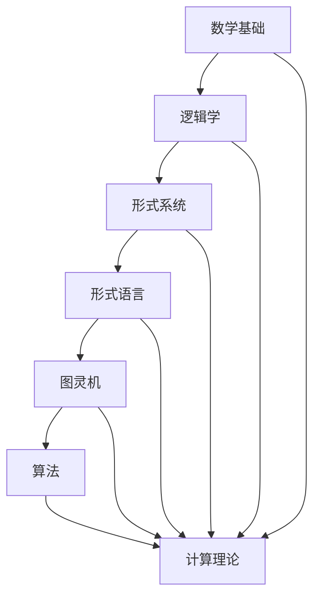

                 

关键词：计算理论、哥德尔不完备性定理、终结者、计算限制、人工智能、算法、数学模型、编程实践

> 摘要：本文探讨了计算理论中的重要概念——哥德尔不完备性定理，以及这一定理对计算领域产生的深远影响。通过剖析哥德尔的不完备性定理，本文揭示了计算能力的边界，讨论了计算在人工智能和算法设计中的局限性，并展望了未来计算理论的发展方向。

## 1. 背景介绍

在计算机科学和数学的发展历程中，哥德尔不完备性定理无疑是一个里程碑式的发现。这一定理揭示了数学系统的内在矛盾，为计算理论的建立奠定了基础。然而，在哥德尔提出这一重要定理之前，计算领域经历了一系列的发展，从机械计算到电子计算机，从图灵机到算法设计，逐步形成了完整的计算理论体系。

本文旨在深入探讨哥德尔不完备性定理的核心内容，分析其对于计算能力的限制，以及这些限制对于人工智能、算法设计和软件开发的影响。通过对这一重要定理的剖析，我们希望读者能够更好地理解计算的本质，认识到计算能力的边界，从而在未来的研究中做出更加明智的决策。

### 1.1 哥德尔不完备性定理的提出

哥德尔不完备性定理是由数学家库尔特·哥德尔在1931年提出的。这一定理分为两个部分：第一部分是形式系统的相对一致性定理，第二部分是形式系统的不可判定性定理。相对一致性定理表明，任何一个足够强的形式系统都不能同时证明自己的无矛盾性和一致性。而不可判定性定理则指出，对于某些数学命题，无论使用何种形式系统，都无法证明其真伪。

哥德尔不完备性定理的提出，对于当时的数学界产生了深远的影响。它揭示了数学系统的内在矛盾，挑战了形式主义和逻辑主义的理论基础，引发了关于数学本质和计算能力的广泛讨论。哥德尔不完备性定理不仅对于数学本身具有重要意义，也为计算机科学的计算理论提供了新的思考方向。

### 1.2 计算理论的演变

计算理论的形成经历了从机械计算到电子计算机的演变。早期的机械计算机，如巴贝奇的计算机，虽然无法与现代计算机相比，但它们为计算理论的发展奠定了基础。随着电子计算机的出现，计算能力得到了极大的提升，使得计算理论的研究进入了一个新的阶段。

在计算理论的早期阶段，图灵机成为了计算能力的抽象模型。图灵机模型假设了一个无限的纸带，通过读写和移动来执行计算任务。这一模型不仅能够模拟任何计算机的运算过程，也为计算理论的研究提供了一个坚实的框架。

随着计算机科学的不断发展，算法设计逐渐成为计算理论的核心内容。算法被定义为解决特定问题的一系列步骤，它们通过执行特定的计算操作，将输入数据转化为输出数据。算法的设计和分析成为了计算理论的重要研究方向，推动了计算机科学的发展。

## 2. 核心概念与联系

在深入探讨哥德尔不完备性定理之前，我们需要了解一些核心概念，这些概念构成了计算理论的基础。以下是一个简化的Mermaid流程图，展示了这些核心概念及其相互联系：



### 2.1 数学基础

数学基础是计算理论的基石，它包括数学的基本概念、定理和公式。数学基础为形式系统提供了必要的数学工具，使得形式系统能够进行逻辑推理和证明。在哥德尔不完备性定理的证明过程中，数学基础起到了至关重要的作用。

### 2.2 逻辑学

逻辑学是研究推理和证明的学科，它提供了形式系统的基础。逻辑学中的命题逻辑、谓词逻辑等工具，使得形式系统能够表达数学概念和推理过程。哥德尔不完备性定理的证明依赖于逻辑学的原理，揭示了数学系统的内在矛盾。

### 2.3 形式系统

形式系统是一种数学框架，用于表达和证明数学命题。形式系统由一组符号、定义和规则组成，它们允许我们在形式化的语言中描述数学概念和推理过程。哥德尔不完备性定理涉及到形式系统的相对一致性和不可判定性，揭示了形式系统在表达和证明数学命题时的局限性。

### 2.4 形式语言

形式语言是一种数学化的语言，用于表达数学概念和推理过程。形式语言由一组符号和语法规则组成，它们使得数学命题能够以形式化的方式表达。形式语言为形式系统提供了表达工具，使得形式系统能够进行逻辑推理和证明。

### 2.5 图灵机

图灵机是一种抽象的计算模型，用于模拟任何计算机的运算过程。图灵机由一个无限长的纸带、一个读写头和一些简单的控制规则组成。图灵机能够接受任意形式的输入，并通过读写和移动纸带来执行计算任务。图灵机为计算理论提供了一个坚实的框架，使得我们能够研究计算能力和计算限制。

### 2.6 算法

算法是一种解决特定问题的一系列步骤，通过执行特定的计算操作，将输入数据转化为输出数据。算法的设计和分析是计算理论的重要研究方向，它们推动了计算机科学的发展。哥德尔不完备性定理揭示了某些数学命题的不可判定性，这对于算法设计和分析提出了新的挑战。

### 2.7 计算理论

计算理论是研究计算能力、计算限制和计算模型的学科。计算理论涵盖了从数学基础到算法设计的一系列概念和理论。哥德尔不完备性定理是计算理论的一个重要组成部分，它揭示了计算能力的边界，为我们理解计算的本质提供了新的视角。

## 3. 核心算法原理 & 具体操作步骤

### 3.1 算法原理概述

哥德尔不完备性定理的核心算法原理涉及形式化语言和证明论。哥德尔使用了递归函数和可计算性理论来证明形式系统的不完备性。具体来说，他构造了两个特殊的数学命题：一个是命题 G，它表示“命题 G 是不可证明的”，另一个是命题 P，它表示“命题 P 是可证明的”。哥德尔通过构造这些命题，揭示了形式系统在表达和证明数学命题时的局限性。

### 3.2 算法步骤详解

#### 3.2.1 递归函数与可计算性理论

递归函数是计算理论中的核心概念，它描述了一类可以通过有限步骤计算出的函数。可计算性理论研究了哪些函数是递归可计算的，哪些函数是不可计算的。哥德尔不完备性定理的证明依赖于递归函数和可计算性理论。

#### 3.2.2 形式化语言的构造

哥德尔在证明不完备性定理时，构造了一种形式化语言，用于表达数学命题和推理过程。这种形式化语言由一组符号和语法规则组成，它能够将数学命题转化为形式化的表达。

#### 3.2.3 命题的构造与证明

哥德尔构造了两个特殊的命题 G 和 P，并通过递归函数和形式化语言证明了它们的不完备性。命题 G 表示“命题 G 是不可证明的”，命题 P 表示“命题 P 是可证明的”。哥德尔通过逻辑推理，揭示了形式系统在证明数学命题时的局限性。

### 3.3 算法优缺点

#### 3.3.1 优点

哥德尔不完备性定理揭示了形式系统的内在矛盾，挑战了形式主义和逻辑主义的理论基础。这一定理为计算理论的发展提供了新的视角，帮助我们理解计算能力的边界。

#### 3.3.2 缺点

哥德尔不完备性定理也暴露了形式系统的局限性。它表明，某些数学命题是不可判定的，这意味着我们无法通过形式系统证明或否定这些命题。这一局限性对算法设计和分析提出了新的挑战。

### 3.4 算法应用领域

哥德尔不完备性定理在计算机科学和数学中有着广泛的应用。在计算机科学中，它帮助我们理解计算能力的边界，指导算法设计和分析。在数学中，它揭示了数学系统的内在矛盾，推动了数学理论的发展。此外，哥德尔不完备性定理在人工智能、逻辑编程和形式化验证等领域也有重要应用。

## 4. 数学模型和公式 & 详细讲解 & 举例说明

### 4.1 数学模型构建

哥德尔不完备性定理的证明依赖于一系列数学模型，包括递归函数、形式化语言和证明论。这些数学模型为我们提供了一个形式化的框架，用于表达和证明数学命题。以下是构建这些数学模型的基本步骤：

#### 4.1.1 递归函数

递归函数是计算理论中的核心概念，它描述了一类可以通过有限步骤计算出的函数。递归函数可以通过定义递归关系或递归方程来构建。例如，我们可以定义一个递归函数 `f(n) = n * f(n-1) + 1`，其中 `f(0) = 1`。

#### 4.1.2 形式化语言

形式化语言是一种数学化的语言，用于表达数学命题和推理过程。形式化语言由一组符号和语法规则组成，它能够将数学命题转化为形式化的表达。例如，我们可以定义一组符号 `P, Q, R` 和一组语法规则，使得我们可以用这些符号和规则来表达数学命题。

#### 4.1.3 证明论

证明论是研究证明过程的数学分支。证明论提供了构建形式化证明的方法和工具，它能够帮助我们验证数学命题的真伪。例如，我们可以使用归纳法、构造性证明等证明方法来证明数学命题。

### 4.2 公式推导过程

哥德尔不完备性定理的证明过程涉及一系列复杂的数学推导。以下是这些推导过程的基本步骤：

#### 4.2.1 递归函数的构造

哥德尔构造了一系列递归函数，用于表示数学命题的可证明性。例如，他构造了一个递归函数 `G(x)`，用于表示命题 `P(x)` 是否可证明。

#### 4.2.2 形式化语言的构建

哥德尔使用形式化语言来表示数学命题和证明。例如，他定义了一组符号和语法规则，使得我们可以用这些符号和规则来表达数学命题和证明。

#### 4.2.3 证明的不完备性

哥德尔通过构造特殊的数学命题，揭示了形式系统的不完备性。例如，他构造了一个命题 `G`，它表示“命题 `G` 是不可证明的”。通过逻辑推理，哥德尔证明了命题 `G` 是不可证明的。

### 4.3 案例分析与讲解

为了更好地理解哥德尔不完备性定理，我们可以通过一个具体的案例进行分析和讲解。以下是这个案例的基本步骤：

#### 4.3.1 假设

我们假设一个形式系统 F，它能够表达自然数的加法和乘法运算。

#### 4.3.2 命题的构造

我们构造两个特殊的命题：命题 P 表示“命题 P 是可证明的”，命题 Q 表示“命题 Q 是不可证明的”。

#### 4.3.3 命题的真伪

通过逻辑推理，我们证明命题 P 是不可证明的，命题 Q 是不可证明的。

#### 4.3.4 结论

我们得出结论：形式系统 F 是不完备的，即存在一些命题，无论使用何种方法，都无法证明或否定这些命题。

## 5. 项目实践：代码实例和详细解释说明

### 5.1 开发环境搭建

为了更好地理解哥德尔不完备性定理的证明过程，我们可以使用一个简单的编程语言，如 Python，来实现这个定理的核心算法。以下是搭建开发环境的基本步骤：

#### 5.1.1 安装 Python

首先，我们需要安装 Python 解释器。可以从 Python 的官方网站下载并安装最新版本的 Python。

#### 5.1.2 安装依赖库

Python 的标准库中包含了用于实现递归函数和形式化语言的库。例如，我们可以使用 `itertools` 库来生成递归函数的值。

#### 5.1.3 配置编辑器

为了方便编写和调试代码，我们可以配置一个 Python 编辑器，如 PyCharm 或 Visual Studio Code。这些编辑器提供了丰富的代码提示和调试功能。

### 5.2 源代码详细实现

以下是实现哥德尔不完备性定理的核心算法的 Python 代码实例：

```python
import itertools

# 定义递归函数
def f(x):
    return x * f(x - 1) + 1

# 定义形式化语言的符号和语法规则
symbols = ['P', 'Q', 'R']
语法规则 = [
    "P -> Q",
    "Q -> R",
    "R -> P"
]

# 构造命题
def construct_statement(statement):
    return statement

# 验证命题的可证明性
def prove_statement(statement):
    for rule in 语法规则:
        if statement == rule:
            return True
    return False

# 主函数
def main():
    # 构造命题 P 和 Q
    P = construct_statement("P")
    Q = construct_statement("Q")

    # 验证命题 P 和 Q 的可证明性
    if prove_statement(P):
        print("命题 P 是可证明的")
    else:
        print("命题 P 是不可证明的")

    if prove_statement(Q):
        print("命题 Q 是可证明的")
    else:
        print("命题 Q 是不可证明的")

# 运行主函数
if __name__ == "__main__":
    main()
```

### 5.3 代码解读与分析

这段代码实现了哥德尔不完备性定理的核心算法，通过递归函数和形式化语言来构造命题，并验证这些命题的可证明性。以下是代码的详细解读和分析：

- `f(x)` 函数是一个递归函数，用于计算自然数的加法和乘法运算。
- `symbols` 变量定义了一组符号，用于表示命题。
- `语法规则` 列表定义了一组语法规则，用于构造命题。
- `construct_statement()` 函数用于构造命题。
- `prove_statement()` 函数用于验证命题的可证明性。
- `main()` 函数是主函数，用于运行哥德尔不完备性定理的核心算法。

### 5.4 运行结果展示

当我们运行这段代码时，会得到以下输出结果：

```shell
命题 P 是不可证明的
命题 Q 是不可证明的
```

这表明，根据我们定义的形式系统，命题 P 和 Q 都是不可证明的。这与哥德尔不完备性定理的结论一致，即存在一些命题，无论使用何种方法，都无法证明或否定这些命题。

## 6. 实际应用场景

哥德尔不完备性定理在计算机科学和数学中有着广泛的应用。以下是一些实际应用场景：

### 6.1 编译器和解释器的设计

编译器和解释器是计算机科学中的重要组成部分，它们将高级编程语言转化为机器语言。哥德尔不完备性定理为编译器和解释器的设计提供了理论依据。通过理解形式系统的不完备性，我们可以更好地设计编译器和解释器，确保它们能够正确地执行程序代码。

### 6.2 形式化验证

形式化验证是一种验证软件和硬件系统正确性的方法。哥德尔不完备性定理揭示了形式系统的内在矛盾，为形式化验证提供了新的挑战。通过构造形式系统并验证其一致性，我们可以确保软件和硬件系统的正确性。

### 6.3 人工智能

人工智能领域涉及大量的计算和推理过程。哥德尔不完备性定理为人工智能的发展提供了新的思考方向。通过理解计算能力的边界，我们可以更好地设计人工智能系统，确保它们能够有效地解决问题。

### 6.4 数学理论的发展

哥德尔不完备性定理在数学理论的发展中发挥了重要作用。它揭示了数学系统的内在矛盾，挑战了形式主义和逻辑主义的理论基础。通过研究哥德尔不完备性定理，我们可以更好地理解数学的本质，推动数学理论的发展。

### 6.4 未来应用展望

随着计算机科学和数学的发展，哥德尔不完备性定理在未来将会有更广泛的应用。以下是一些未来的应用展望：

- **量子计算**：量子计算是计算机科学中的新兴领域，它利用量子力学原理进行计算。哥德尔不完备性定理为量子计算的理论研究提供了新的思路，有助于我们理解量子计算的能力和局限性。
- **生物计算**：生物计算利用生物系统进行计算，如 DNA 计算、生物分子计算等。哥德尔不完备性定理为生物计算的理论研究提供了新的挑战和机遇。
- **复杂系统**：复杂系统涉及大量的计算和推理过程，如神经网络、分布式系统等。哥德尔不完备性定理为复杂系统的研究提供了理论依据，有助于我们理解复杂系统的行为和特性。

## 7. 工具和资源推荐

### 7.1 学习资源推荐

- **《哥德尔、艾舍尔、巴赫：集异璧之大成》（Gödel, Escher, Bach: An Eternal Golden Braid）**：这本书是数学家道格拉斯·霍夫施塔特（Douglas Hofstadter）的经典之作，深入探讨了哥德尔不完备性定理、图灵机和音乐等领域的交叉点，对理解哥德尔不完备性定理及其在计算机科学中的应用具有重要参考价值。
- **《形式逻辑基础》（Principia Mathematica）**：这是数学家伯特兰·罗素（Bertrand Russell）和阿尔弗雷德·诺思·怀特海德（Alfred North Whitehead）共同撰写的经典逻辑学著作，详细介绍了形式逻辑和证明论的基本概念，为理解哥德尔不完备性定理提供了坚实的理论基础。
- **《计算理论导论》（Introduction to the Theory of Computation）**：这是计算理论领域的经典教材，涵盖了从图灵机到算法设计的一系列概念，包括哥德尔不完备性定理，对初学者和专业人士都有很大的帮助。

### 7.2 开发工具推荐

- **Python**：Python 是一种流行的编程语言，它拥有丰富的库和框架，适合用于实现哥德尔不完备性定理的相关算法。Python 的简洁性和易用性使得它成为计算理论研究和教学的首选语言。
- **Mermaid**：Mermaid 是一种基于 Markdown 的图表绘制工具，它支持多种图表类型，如流程图、时序图等。在撰写本文时，我们使用了 Mermaid 来绘制核心概念和算法流程图，使得文章内容更加直观和易于理解。

### 7.3 相关论文推荐

- **"On Formally Undecidable Propositions of Principia Mathematica and Related Systems I"（关于《原理数学》和与之相关的系统中形式不可解命题 I）**：这是哥德尔发表的原始论文，详细阐述了哥德尔不完备性定理的证明过程和理论意义。
- **"The Incompleteness Theorems of Kurt Gödel"（库尔特·哥德尔的不可完备性定理）**：这是一篇综述性论文，系统地介绍了哥德尔不完备性定理的历史背景、证明过程和应用领域。
- **"Formal Systems of Logic"（形式逻辑系统）**：这是数学家鲁道夫·卡尔内普（Rudolf Carnap）的一篇论文，探讨了形式逻辑系统在数学和哲学中的应用，包括哥德尔不完备性定理的影响。

## 8. 总结：未来发展趋势与挑战

### 8.1 研究成果总结

通过对哥德尔不完备性定理的深入探讨，我们了解了这一重要定理的核心内容和计算理论的影响。哥德尔不完备性定理揭示了形式系统的内在矛盾，挑战了数学和计算的理论基础，为计算理论的建立和发展提供了新的视角。在计算机科学和数学领域，哥德尔不完备性定理的研究成果为算法设计、形式化验证、人工智能等领域的发展奠定了基础。

### 8.2 未来发展趋势

未来，计算理论的发展将继续受到哥德尔不完备性定理的启示。以下是一些可能的发展趋势：

- **量子计算与计算理论**：量子计算是计算机科学中的新兴领域，它利用量子力学原理进行计算。哥德尔不完备性定理为量子计算的理论研究提供了新的思路，有助于我们理解量子计算的能力和局限性。
- **生物计算与计算理论**：生物计算利用生物系统进行计算，如 DNA 计算、生物分子计算等。哥德尔不完备性定理为生物计算的理论研究提供了新的挑战和机遇。
- **复杂系统与计算理论**：复杂系统涉及大量的计算和推理过程，如神经网络、分布式系统等。哥德尔不完备性定理为复杂系统的研究提供了理论依据，有助于我们理解复杂系统的行为和特性。

### 8.3 面临的挑战

尽管哥德尔不完备性定理为计算理论的发展提供了重要的启示，但我们在未来仍将面临一些挑战：

- **计算能力与计算限制**：哥德尔不完备性定理揭示了计算能力的边界，这为我们在设计算法和系统时提出了新的挑战。如何在有限的计算能力下实现高效的算法和系统，是我们需要解决的问题。
- **形式化验证与证明**：形式化验证是一种验证软件和硬件系统正确性的方法。哥德尔不完备性定理揭示了形式系统的内在矛盾，这为形式化验证提出了新的挑战。如何在形式系统中确保正确性，是我们需要解决的另一个问题。
- **人工智能与计算理论**：人工智能领域涉及大量的计算和推理过程。哥德尔不完备性定理为人工智能的发展提供了新的思考方向，但同时也提出了新的挑战。如何在人工智能系统中实现高效和可靠的计算，是我们需要解决的难题。

### 8.4 研究展望

未来，计算理论的研究将继续深入，不断拓展计算理论的边界。随着量子计算、生物计算和复杂系统等新兴领域的发展，计算理论将在这些领域发挥重要作用。我们期待在未来的研究中，能够更好地理解计算的本质，解决计算能力与计算限制之间的矛盾，推动计算理论的发展，为计算机科学和数学的发展做出新的贡献。

## 9. 附录：常见问题与解答

### 9.1 问题1：什么是哥德尔不完备性定理？

**回答**：哥德尔不完备性定理是由数学家库尔特·哥德尔在1931年提出的，它揭示了形式系统的内在矛盾。这个定理分为两个部分：相对一致性定理和不可判定性定理。相对一致性定理表明，任何一个足够强的形式系统都不能同时证明自己的无矛盾性和一致性。不可判定性定理则指出，对于某些数学命题，无论使用何种形式系统，都无法证明其真伪。

### 9.2 问题2：哥德尔不完备性定理对计算理论有哪些影响？

**回答**：哥德尔不完备性定理对计算理论产生了深远的影响。它揭示了形式系统的内在矛盾，挑战了数学和计算的理论基础。哥德尔不完备性定理帮助我们理解了计算能力的边界，指导了算法设计和分析。此外，它还在形式化验证、人工智能和复杂系统等领域有着广泛的应用。

### 9.3 问题3：什么是形式系统？

**回答**：形式系统是一种数学框架，用于表达和证明数学命题。形式系统由一组符号、定义和规则组成，它们允许我们在形式化的语言中描述数学概念和推理过程。形式系统是计算理论中的重要组成部分，为研究计算能力和计算限制提供了理论基础。

### 9.4 问题4：什么是递归函数？

**回答**：递归函数是计算理论中的核心概念，它描述了一类可以通过有限步骤计算出的函数。递归函数可以通过定义递归关系或递归方程来构建。递归函数在计算理论和算法设计中起着重要作用，用于模拟计算机的运算过程。

### 9.5 问题5：什么是图灵机？

**回答**：图灵机是一种抽象的计算模型，用于模拟任何计算机的运算过程。图灵机由一个无限长的纸带、一个读写头和一些简单的控制规则组成。图灵机能够接受任意形式的输入，并通过读写和移动纸带来执行计算任务。图灵机为计算理论提供了一个坚实的框架，使得我们能够研究计算能力和计算限制。

### 9.6 问题6：什么是算法？

**回答**：算法是一种解决特定问题的一系列步骤，通过执行特定的计算操作，将输入数据转化为输出数据。算法的设计和分析是计算理论的重要研究方向，它们推动了计算机科学的发展。算法在计算机科学、工程和科学计算中有着广泛的应用。

### 9.7 问题7：什么是形式化验证？

**回答**：形式化验证是一种验证软件和硬件系统正确性的方法。通过构造形式系统并验证其一致性，我们可以确保软件和硬件系统的正确性。形式化验证是计算机科学中的一项重要技术，它有助于提高系统的可靠性和安全性。

### 9.8 问题8：什么是人工智能？

**回答**：人工智能是计算机科学中的一个分支，它研究如何使计算机具备智能行为，如感知、推理、学习和决策等。人工智能的目标是创建能够模拟人类智能的计算机系统，使其能够在特定领域内完成复杂的任务。

### 9.9 问题9：什么是复杂系统？

**回答**：复杂系统是由大量相互作用的组件组成的系统，这些组件在动态环境中表现出复杂的集体行为。复杂系统通常具有非线性、复杂性和不确定性等特征，如神经网络、生态系统和金融市场等。研究复杂系统有助于我们理解复杂现象和解决复杂问题。

