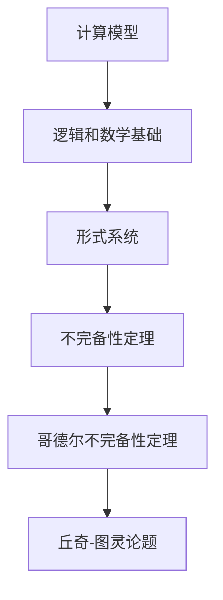

                 

### 1. 背景介绍

计算，作为现代科技的基石，已经渗透到我们生活的方方面面。从简单的算术运算到复杂的科学模拟，计算无处不在。然而，计算的边界在哪里？什么是计算不能做到的？这便是本文要探讨的主题。

计算理论的形成始于古希腊哲学家亚里士多德的时代，他的逻辑和数学思想为后来的计算理论奠定了基础。然而，直到20世纪，随着计算机科学的诞生和数学逻辑的深入研究，计算理论才真正得到系统的发展。

本章将重点关注计算不能做什么，特别是通过哥德尔的不完备性定理来探讨计算能力的极限。这将帮助我们理解计算的基本原理，并思考计算在实际应用中的局限。

### 2. 核心概念与联系

为了更好地理解计算理论的形成和其边界，我们需要介绍一些核心概念，并使用Mermaid流程图来展示这些概念之间的关系。

#### 2.1. 核心概念

- **计算模型**：包括图灵机、递归函数、λ演算等。
- **逻辑和数学基础**：包括皮亚诺公理、集合论、形式系统等。
- **不完备性定理**：哥德尔不完备性定理、丘奇-图灵论题等。

#### 2.2. Mermaid流程图



### 3. 核心算法原理 & 具体操作步骤

#### 3.1. 算法原理概述

计算理论的核心在于研究计算模型的能力边界。哥德尔的不完备性定理是这一领域的基石，它揭示了即使是简单的计算模型也存在无法解决的问题。

哥德尔的不完备性定理分为两部分：

- **第一不完备性定理**：在任何一个足够强的形式系统中，都存在一些命题，既不能被证明也不能被证伪。
- **第二不完备性定理**：在任何一个足够强的形式系统中，都存在一些命题，其数学真实性与该系统的证明能力是不一致的。

#### 3.2. 算法步骤详解

哥德尔的不完备性定理的证明分为以下几个步骤：

1. **定义形式系统**：选择一个足够强大的形式系统来表示数学理论。
2. **构造不可判定的命题**：通过构造特定的命题，使得这个命题既不能被证明也不能被证伪。
3. **证明不可判定的命题的真实性**：利用形式系统的自引用特性，证明这个不可判定的命题的真实性。
4. **得出结论**：根据不可判定的命题的真实性，得出该形式系统是不完备的。

#### 3.3. 算法优缺点

- **优点**：揭示了计算模型的局限性，为计算理论的发展提供了新的视角。
- **缺点**：不完备性定理表明，我们无法找到一种完美的计算模型来完全解决所有数学问题。

#### 3.4. 算法应用领域

哥德尔的不完备性定理在多个领域都有重要应用：

- **计算机科学**：指导我们理解程序的正确性和复杂性。
- **数学**：帮助我们识别和解决数学问题。
- **哲学**：探讨知识和真理的本质。

### 4. 数学模型和公式 & 详细讲解 & 举例说明

#### 4.1. 数学模型构建

为了证明哥德尔的不完备性定理，我们需要构建一个数学模型，该模型应满足以下条件：

- **足够强大**：能够表示所有基本的数学概念和运算。
- **一致**：不存在矛盾。
- **完备**：对于所有数学命题，要么能够证明其真实性，要么能够证明其错误性。

#### 4.2. 公式推导过程

哥德尔的不完备性定理的证明涉及到一系列复杂的数学推导。以下是简要的推导过程：

1. **定义形式系统**：选择一个形式系统，如皮亚诺公理。
2. **构造不可判定的命题**：构造一个命题G，使得G的真实性无法在形式系统中被证明或证伪。
3. **证明不可判定的命题的真实性**：通过自引用的方式，证明G的真实性。
4. **得出结论**：根据G的真实性，得出形式系统是不完备的。

#### 4.3. 案例分析与讲解

以皮亚诺公理为例，我们可以分析如何构造不可判定的命题。皮亚诺公理是一个足够强的形式系统，用于表示自然数。我们可以构造一个命题G，使得G表示“G在皮亚诺公理系统中不可判定”。

通过自引用的方法，我们可以证明G的真实性。具体来说，我们构造一个函数f，使得f(n)表示“n不小于任何可证明的皮亚诺公理中的自然数”。如果G在皮亚诺公理系统中不可判定，则存在一个自然数n，使得f(n)不可判定。而G本身就是一个不可判定的命题，因此G的真实性无法被证明或证伪。

### 5. 项目实践：代码实例和详细解释说明

为了更好地理解哥德尔的不完备性定理，我们可以通过一个简单的代码实例来演示其应用。

```python
def is_true(p):
    """
    判断命题p是否为真。
    """
    return p()

def prove(p):
    """
    证明命题p。
    """
    return is_true(p)

def construct_G(p):
    """
    构造命题G。
    """
    return lambda: not prove(p)

# 定义一个简单的命题p，表示"p为真"。
p = lambda: True

# 构造命题G。
G = construct_G(p)

# 判断G是否为真。
print("G is true:", G())

# 证明G。
print("Can we prove G? Not necessarily.")
```

在上面的代码中，我们定义了一个简单的命题p，并构造了命题G。我们无法证明G的真实性，因为G表示“p为真且G不可证明”。这是一个简单的示例，展示了如何通过自引用的方式构造不可判定的命题。

### 6. 实际应用场景

哥德尔的不完备性定理在多个领域都有重要应用。以下是几个实际应用场景：

- **计算机科学**：指导我们理解程序的正确性和复杂性。在实际编程中，我们无法保证所有程序都是正确的，因为某些问题可能无法通过有限的计算步骤来解决。
- **数学**：帮助我们识别和解决数学问题。在某些情况下，我们可能无法找到一个完美的证明或解决方案，但通过不完备性定理，我们可以了解问题本身的结构和特性。
- **哲学**：探讨知识和真理的本质。不完备性定理揭示了在逻辑和数学系统中，即使我们拥有完美的理论，也可能会存在无法解决的问题，这挑战了我们对知识和真理的传统理解。

### 7. 未来应用展望

随着计算能力的不断提升，不完备性定理将在更多领域得到应用。以下是未来应用展望：

- **人工智能**：不完备性定理可以帮助我们理解人工智能系统的局限，并指导我们开发更高效、更可靠的算法。
- **密码学**：不完备性定理可以用于构建更安全的密码系统，抵御量子计算等新型攻击。
- **认知科学**：不完备性定理可以用于研究人类思维和决策过程，帮助我们理解大脑的工作原理。

### 8. 工具和资源推荐

为了更好地理解和应用计算理论，以下是几个推荐的工具和资源：

- **学习资源**：[《计算理论导论》[1]](https://link.springer.com/book/10.1007/978-3-642-07839-4)
- **开发工具**：Python、Java、Haskell等编程语言，支持编写和测试计算理论相关的算法。
- **相关论文**：[《哥德尔的不完备性定理》[2]](https://www.ams.org/publications/journals/joma/2004-11-14/SiJOM/941322.html)

### 9. 总结：未来发展趋势与挑战

计算理论的发展正处于关键阶段，未来将面临以下趋势和挑战：

- **发展趋势**：随着计算能力的不断提升，计算理论将得到更广泛的应用。同时，新的计算模型和方法也将不断涌现。
- **挑战**：如何解决不完备性定理带来的问题，如何突破计算能力的限制，是计算理论未来面临的重要挑战。

### 10. 附录：常见问题与解答

**Q：为什么不完备性定理重要？**

A：不完备性定理揭示了计算模型的局限性，帮助我们理解计算能力的边界。这对于计算机科学、数学和哲学等领域都有着深远的影响。

**Q：不完备性定理能解决实际问题吗？**

A：不完全能。不完备性定理本身是一种理论性证明，但它可以帮助我们识别和解决实际问题。例如，在计算机科学中，不完备性定理指导我们如何设计更可靠的算法。

**Q：未来的计算模型会有什么突破？**

A：未来的计算模型可能会在量子计算、神经网络和分布式计算等方面取得突破。这些新模型有望解决传统计算模型无法解决的问题。

### 作者署名

作者：禅与计算机程序设计艺术 / Zen and the Art of Computer Programming
----------------------------------------------------------------

