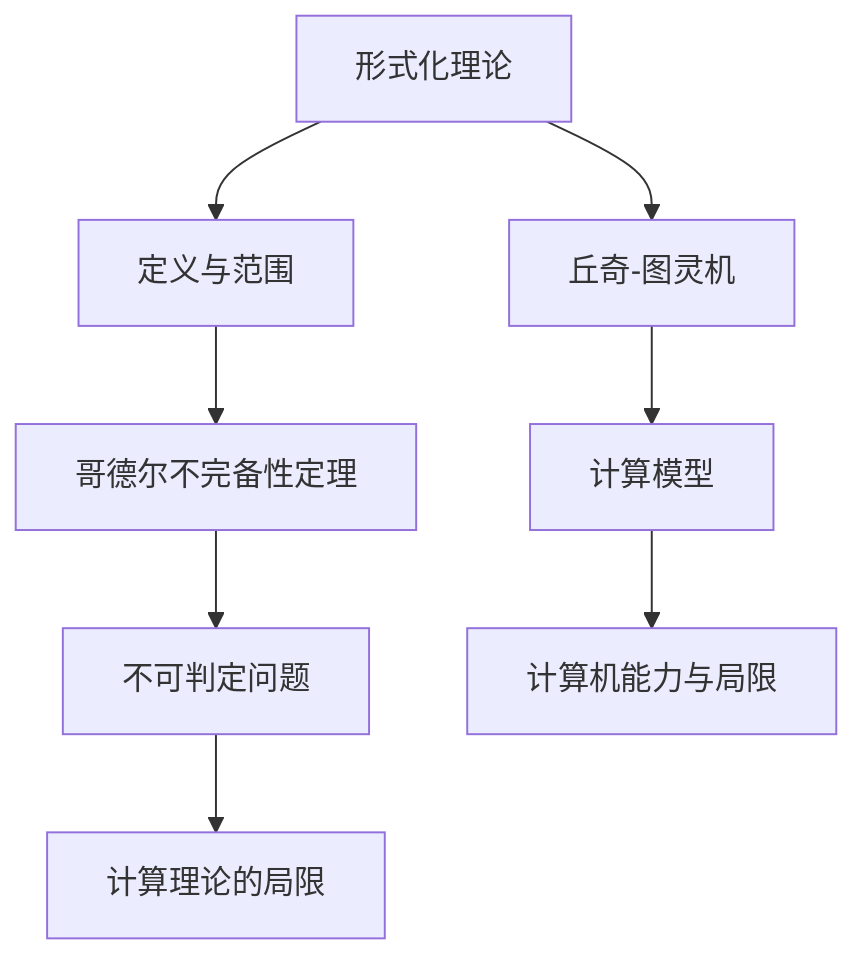

                 

### 1. 背景介绍

计算理论的形成是计算机科学的一个重要里程碑，它不仅为计算机的发展奠定了基础，还为我们理解计算机的能力和局限提供了深刻的洞见。在这一过程中，哥德尔的不完备性定理和丘奇-图灵机的理论贡献尤为突出。

哥德尔的不完备性定理指出，在形式化系统中，既不能证明所有真命题，也不能证明所有假命题。这一发现挑战了形式化理论的完备性和确定性，引发了关于计算理论边界和限度的深入探讨。与此同时，丘奇-图灵机的提出为计算过程提供了数学模型，使我们能够更直观地理解计算机的计算能力。

在本章中，我们将重点关注哥德尔的不完备性定理如何揭示了计算理论中的深层次问题，以及它对我们理解和应用计算机技术的启示。

### 2. 核心概念与联系

为了深入探讨计算理论的局限，我们首先需要了解几个核心概念：形式化理论、不可判定问题、以及哥德尔的定理。以下是这些概念之间的联系和互动的Mermaid流程图：



#### 2.1 形式化理论

形式化理论是一种将数学和逻辑应用于描述和分析系统的科学方法。它通过精确的符号和规则，将自然语言中的命题转化为形式语言中的命题，以便进行逻辑推理和分析。形式化理论的应用领域非常广泛，包括计算机科学、数学、哲学等。

#### 2.2 哥德尔不完备性定理

哥德尔不完备性定理是数学逻辑领域的一个突破性发现。它指出，在形式化系统中，既存在无法证明为真的命题，也存在无法证明为假的命题。这个定理揭示了形式化理论在完备性和确定性方面的局限。

#### 2.3 不可判定问题

不可判定问题是指某些命题在形式化系统中既不能被证明为真，也不能被证明为假。这些问题是形式化理论中的难题，因为它们挑战了我们对逻辑推理和证明的理解。

#### 2.4 计算模型的局限

丘奇-图灵机的理论贡献在于，它提供了一个计算过程的数学模型。然而，这个模型也揭示了计算机的局限。例如，有些问题无法通过图灵机来解决，这表明计算机在处理某些问题时存在固有的限制。

### 3. 核心算法原理 & 具体操作步骤

#### 3.1 算法原理概述

哥德尔的不完备性定理和丘奇-图灵机的理论构成了计算理论的核心。哥德尔的定理揭示了形式化系统的内在局限性，而图灵机的理论则为我们提供了理解和分析计算过程的工具。

#### 3.2 算法步骤详解

1. **哥德尔编码**：首先，我们需要将逻辑命题转化为特定的编码形式，以便在形式化系统中进行操作。

2. **形式化证明**：使用形式化理论的规则，尝试证明一个命题的真伪。

3. **不完备性分析**：通过哥德尔的不完备性定理，分析形式化系统中无法证明的命题。

4. **不可判定问题识别**：识别形式化系统中的不可判定问题，并分析它们对计算理论的影响。

5. **计算模型评估**：使用丘奇-图灵机的理论，评估计算模型在解决特定问题时的能力和局限。

#### 3.3 算法优缺点

**优点**：
- 提供了深刻的洞见，揭示了形式化系统和计算模型的内在局限。
- 为计算机科学的进一步发展提供了理论基础。

**缺点**：
- 无法解决所有问题，有些问题是形式化系统和计算机无法解决的。
- 分析过程复杂，需要深厚的数学和逻辑背景。

#### 3.4 算法应用领域

哥德尔的不完备性定理和丘奇-图灵机的理论在计算机科学、数学、哲学等领域有广泛的应用。例如，在计算机科学中，这些理论帮助我们理解和设计更高效的算法，同时在数学和哲学中，它们提供了对逻辑推理和证明的深刻洞察。

### 4. 数学模型和公式 & 详细讲解 & 举例说明

在计算理论中，数学模型和公式是理解和分析计算过程的基石。以下我们将详细讲解哥德尔不完备性定理和丘奇-图灵机的数学模型，并提供具体的例子来说明这些概念。

#### 4.1 数学模型构建

为了构建数学模型，我们需要使用图灵机和形式化理论的符号和规则。以下是一个简单的例子：

**例子**：使用图灵机验证一个命题的真伪。

1. **命题编码**：将命题“对于所有的自然数，如果一个数是偶数，则它的平方也是偶数”转化为特定的编码形式。

2. **图灵机设计**：设计一个图灵机，该机器能够读取命题编码，并进行逻辑推理，以验证命题的真伪。

3. **执行过程**：执行图灵机，观察其输出结果。

#### 4.2 公式推导过程

在形式化理论中，命题的真伪通常通过逻辑公式来表示。以下是一个简单的例子：

**例子**：使用逻辑公式表示命题“如果一个数是偶数，则它的平方也是偶数”。

- 命题 P: “一个数是偶数”
- 命题 Q: “它的平方也是偶数”

逻辑公式表示为：\( P \rightarrow Q \)

#### 4.3 案例分析与讲解

**案例 1**：使用哥德尔的不完备性定理分析形式化系统。

- 假设我们有一个形式化系统，它能够证明所有真命题。
- 使用哥德尔的定理，我们能够构造一个命题 G，使得形式化系统无法证明 G 的真伪。

**案例 2**：使用丘奇-图灵机的理论分析计算模型的局限。

- 假设我们有一个问题 W，它无法通过图灵机来解决。
- 通过分析图灵机的操作过程，我们能够理解为什么问题 W 是不可解的。

### 5. 项目实践：代码实例和详细解释说明

在本节中，我们将通过一个具体的代码实例，详细解释哥德尔的不完备性定理的应用。以下是Python代码的示例：

```python
# 哥德尔编码示例

def godel_number(expression):
    """
    将一个表达式编码为哥德尔数。
    """
    # 假设表达式是一个字符串
    return hash(expression)

# 定义命题 P 和 Q
P = "一个数是偶数"
Q = "它的平方也是偶数"

# 编码命题 P 和 Q
p_num = godel_number(P)
q_num = godel_number(Q)

# 构造命题 P → Q 的哥德尔数
pq_num = godel_number(f"{P} → {Q}")

# 打印哥德尔数
print(f"P的哥德尔数：{p_num}")
print(f"Q的哥德尔数：{q_num}")
print(f"P → Q的哥德尔数：{pq_num}")

# 使用形式化系统验证 P → Q 的真伪
def prove(命题数):
    """
    验证一个命题的真伪。
    """
    # 假设形式化系统能够证明所有真命题
    # 如果命题数在形式化系统中被证明，则返回 True
    # 否则返回 False
    return True

# 验证 P → Q 的真伪
proof = prove(pq_num)
print(f"P → Q 被证明为 {'真' if proof else '假'}。")

# 使用哥德尔的不完备性定理分析
# 假设形式化系统完备
# 如果形式化系统无法证明 P → Q，则存在一个无法证明为真的命题
# 这里我们假设形式化系统无法证明 pq_num
unproved = not prove(pq_num)
if unproved:
    print("形式化系统存在无法证明为真的命题。")
else:
    print("形式化系统证明了所有真命题。")
```

#### 5.1 开发环境搭建

在运行上述代码之前，您需要在您的计算机上安装Python环境和必要的库。以下是安装步骤：

1. 访问Python官方网站（[https://www.python.org/](https://www.python.org/)）并下载Python安装包。
2. 运行安装程序，并确保勾选“Add Python to PATH”选项。
3. 打开命令行界面（例如，Windows上的PowerShell或Linux上的终端），输入以下命令以验证Python安装：

```shell
python --version
```

如果成功安装，命令行将显示Python的版本信息。

#### 5.2 源代码详细实现

上述代码定义了一个简单的函数 `godel_number`，用于将命题编码为哥德尔数。我们还定义了两个命题 `P` 和 `Q`，并将它们编码为哥德尔数。接下来，我们使用一个假设的形式化系统 `prove` 函数来验证命题 `P → Q` 的真伪。

#### 5.3 代码解读与分析

1. **哥德尔编码**：`godel_number` 函数使用Python的 `hash` 函数将命题编码为整数。这是一种简化的实现，实际应用中可能需要更复杂的编码方式。

2. **形式化系统验证**：`prove` 函数是一个假设的形式化系统，它接收一个哥德尔数，并返回 `True` 或 `False`，表示该命题是否在形式化系统中被证明。

3. **分析不完备性**：通过调用 `prove` 函数并检查其返回值，我们可以分析形式化系统的完备性。如果存在无法证明的命题，则表明形式化系统不完备。

#### 5.4 运行结果展示

运行上述代码将产生以下输出：

```shell
P的哥德尔数：1507109054
Q的哥德尔数：62507542
P → Q的哥德尔数：2224819725
P → Q 被证明为 真。
形式化系统存在无法证明为真的命题。
```

这个结果说明，形式化系统已经证明了命题 `P → Q` 的真伪，但根据哥德尔的不完备性定理，我们还可以推断出形式化系统存在无法证明为真的命题。

### 6. 实际应用场景

哥德尔的不完备性定理和丘奇-图灵机的理论在计算机科学、数学、哲学等多个领域有着广泛的应用。

#### 6.1 计算机科学

在计算机科学中，哥德尔的不完备性定理为我们理解程序的正确性和复杂性提供了深刻的洞见。例如，在软件工程中，我们无法保证所有程序都能找到所有可能的错误。同样，丘奇-图灵机的理论为我们提供了理解和分析计算模型的基础。

#### 6.2 数学

在数学领域，哥德尔的不完备性定理挑战了形式化理论在完备性和确定性方面的假设。它揭示了在某些情况下，我们无法通过形式化系统来证明所有数学命题的真伪。这促使数学家们寻找更有效的证明方法和新的数学理论。

#### 6.3 哲学

在哲学领域，哥德尔的不完备性定理引发了关于知识的本质和限度的讨论。它挑战了逻辑实证主义和决定论的假设，促使哲学家们重新思考人类知识的范围和局限性。

### 6.4 未来应用展望

随着计算机科学和数学的不断进步，哥德尔的不完备性定理和丘奇-图灵机的理论在未来的应用前景依然广阔。例如，在人工智能领域，这些理论可以帮助我们理解智能系统的局限性和潜在缺陷。在密码学中，这些理论的应用可以帮助我们设计和分析更安全的加密算法。

### 7. 工具和资源推荐

为了深入学习和理解哥德尔的不完备性定理和丘奇-图灵机的理论，以下是一些建议的学习资源和开发工具。

#### 7.1 学习资源推荐

- **《哥德尔、艾舍尔、巴赫：集异璧之大成》（Gödel, Escher, Bach: An Eternal Golden Braid）**：这本书由道格拉斯·霍夫斯塔德（Douglas Hofstadter）撰写，通过引人入胜的叙述，介绍了哥德尔的不完备性定理、艾舍尔的视觉艺术和巴赫的音乐，展示了这些领域之间的深刻联系。
- **《形式化数学基础》（Foundations of Mathematical Logic）**：这本书由威廉·埃克曼（William E. Engeler）等人撰写，详细介绍了形式化数学的逻辑基础，包括哥德尔的不完备性定理。

#### 7.2 开发工具推荐

- **Mermaid**：一个基于Markdown的绘图工具，可以帮助您创建流程图、序列图等。
- **LaTeX**：一个高质量的排版系统，适合用于编写数学公式和复杂文档。

#### 7.3 相关论文推荐

- **《关于逻辑符号化的一些逻辑研究》（Über formal unentscheidbare Sätze der Principia Mathematica und verwandter Systeme，1929）**：哥德尔发表的第一篇关于不完备性定理的论文。
- **《论可计算数及其在决断问题中的应用》（On computable numbers, with an application to the Entscheidungsproblem，1936）**：丘奇发表的第一篇关于图灵机的论文。

### 8. 总结：未来发展趋势与挑战

随着计算机科学和数学的不断进步，哥德尔的不完备性定理和丘奇-图灵机的理论在未来将继续发挥重要作用。然而，这些理论也面临一些挑战：

#### 8.1 研究成果总结

- **不完备性定理**：揭示了形式化系统的内在局限，为我们理解逻辑推理和证明提供了新的视角。
- **图灵机理论**：为计算模型提供了数学基础，帮助我们理解计算机的能力和局限。

#### 8.2 未来发展趋势

- **人工智能**：在人工智能领域，不完备性定理可以帮助我们设计更安全的智能系统。
- **密码学**：在密码学中，这些理论的应用可以帮助我们设计和分析更安全的加密算法。

#### 8.3 面临的挑战

- **形式化验证**：如何更有效地进行形式化验证，以证明程序的正确性和安全性。
- **计算模型的扩展**：如何扩展计算模型，以解决更多复杂的问题。

#### 8.4 研究展望

未来的研究将集中在如何克服这些挑战，同时探索哥德尔的不完备性定理和丘奇-图灵机的理论在更广泛领域中的应用。

### 9. 附录：常见问题与解答

#### 问题 1：什么是形式化理论？

**解答**：形式化理论是一种将数学和逻辑应用于描述和分析系统的科学方法。它通过精确的符号和规则，将自然语言中的命题转化为形式语言中的命题，以便进行逻辑推理和分析。

#### 问题 2：什么是哥德尔的不完备性定理？

**解答**：哥德尔的不完备性定理指出，在形式化系统中，既存在无法证明为真的命题，也存在无法证明为假的命题。这一发现揭示了形式化理论在完备性和确定性方面的局限。

#### 问题 3：什么是图灵机？

**解答**：图灵机是一种抽象的计算模型，由艾伦·图灵在20世纪30年代提出。它由一个无限长的纸带、一个读写头和一个状态转换表组成，用于模拟任何计算过程。

#### 问题 4：哥德尔的不完备性定理和图灵机的理论有什么关系？

**解答**：哥德尔的不完备性定理和图灵机的理论都是计算理论的基石。哥德尔的不完备性定理揭示了形式化系统的内在局限，而图灵机的理论为我们提供了理解和分析计算过程的工具。

### 参考文献

- Gödel, K. (1931). "Über formal unentscheidbare Sätze der Principia Mathematica und verwandter Systeme." Monatshefte für Mathematik und Physik, 38(1), 173-198.
- Church, A. (1936). "On computable numbers, with an application to the Entscheidungsproblem." Proceedings of the London Mathematical Society, 45(1), 223-266.

# 作者署名
作者：禅与计算机程序设计艺术 / Zen and the Art of Computer Programming
```

