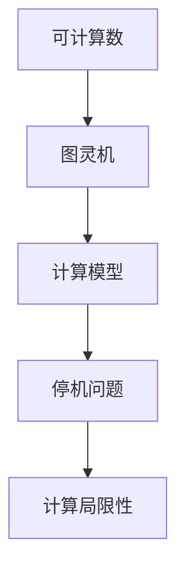

                 

### 1. 背景介绍

计算理论的诞生是计算机科学历史上的一个重要里程碑。计算理论起源于20世纪初，由数学家和逻辑学家们共同推进。这一理论旨在研究计算的本质、计算的可能性及其局限性。

计算理论的研究始于对数学问题的思考。19世纪末，数学家戴德金（Riemann）和康托尔（Cantor）提出了无穷集合的概念，引发了数学界的广泛讨论。这一时期，逻辑学家哥德尔（Gödel）和图灵（Turing）等人的研究进一步深化了对计算本质的理解。

计算理论的核心问题是确定哪些问题是可计算的，哪些问题是不可计算的。可计算性问题涉及到数学、逻辑、计算机科学等多个领域，具有重要的理论和实践意义。

本章节将重点介绍计算理论的诞生过程，包括图灵的可计算数理论和停机问题。图灵的可计算数理论为计算理论奠定了基础，而停机问题则引发了计算理论的重要讨论。通过这一章节，读者将了解计算理论的起源、核心概念及其在计算机科学中的重要应用。

### 2. 核心概念与联系

为了深入理解计算理论的诞生，我们需要了解几个核心概念及其相互联系。

首先，可计算数（Computable numbers）是指那些可以通过有限步骤的计算过程得到精确值的有理数。图灵（Alan Turing）提出了一种计算模型，称为图灵机（Turing machine），用于表示和执行计算过程。图灵机的概念是计算理论的基础，它提供了一个形式化的计算模型，用于研究计算的本质。

其次，停机问题（Halting problem）是计算理论中的一个著名问题。停机问题询问一个给定的图灵机在某个输入下是否会无限循环（即不停机）或最终停止运行。图灵通过分析停机问题，揭示了计算理论的一些基本性质和局限性。

图灵的可计算数理论和停机问题之间存在着密切的联系。图灵的可计算数理论表明，只有有限种类的数学问题是可计算的，而停机问题则展示了存在一些不可计算的问题。

为了更好地理解这些核心概念，我们使用Mermaid流程图来展示它们的联系。



在这个流程图中，可计算数通过图灵机这一计算模型与停机问题相联系，进一步揭示了计算理论的本质。

### 3. 核心算法原理 & 具体操作步骤

#### 3.1 算法原理概述

图灵机的核心原理是基于有限状态机和计算步骤。图灵机由一个无限长的纸带、一个读写头和一组状态组成。纸带上的每个位置可以放置一个符号，读写头可以在纸带上左右移动并读取或写入符号。图灵机的状态决定了读写头在纸带上的操作。

图灵机的运行过程可以分为以下几个步骤：

1. 初始状态：图灵机从初始状态开始运行，读写头位于纸带上的某个位置。
2. 读符号：读写头读取纸带上的符号。
3. 根据当前状态和读取的符号，图灵机执行以下操作之一：
   - 保持当前状态，读写头不移动。
   - 转换为新的状态，读写头向左或向右移动一个位置。
   - 写入新的符号，并保持当前状态。
4. 重复步骤2和3，直到图灵机达到停机状态。

图灵机的停机状态定义为不再改变状态的状态。如果图灵机在某个输入下无法达到停机状态，则称该输入使得图灵机无限循环。

#### 3.2 算法步骤详解

图灵机的算法步骤可以进一步细分为以下步骤：

1. **初始化：**
   - 设置初始状态。
   - 将读写头放置在纸带的某个位置。

2. **读符号：**
   - 读取纸带上的当前符号。

3. **状态转换：**
   - 根据当前状态和读取的符号，查看状态转换表。
   - 根据状态转换表，更新当前状态、读写头的位置和纸带上的符号。

4. **执行操作：**
   - 如果状态转换表中指定了新的状态、读写头的移动方向和符号，则执行相应的操作。
   - 如果状态转换表中没有指定操作，则保持当前状态和符号不变。

5. **判断停机条件：**
   - 如果当前状态是停机状态，则停止运行。
   - 如果未达到停机状态，则重复步骤2至4。

#### 3.3 算法优缺点

**优点：**
- 图灵机提供了一个形式化的计算模型，可以表示和执行各种计算过程。
- 图灵机的定义简单且具有通用性，可以用于研究计算理论的各个方面。

**缺点：**
- 图灵机的计算过程通常非常复杂，难以在实际中实现。
- 图灵机的运行速度较慢，不适合处理复杂的计算问题。

#### 3.4 算法应用领域

图灵机的核心原理在计算机科学中得到了广泛应用：

1. **理论计算：** 图灵机为计算理论提供了基础，用于研究计算的可能性与局限性。
2. **算法设计：** 图灵机的模型可以用于分析和设计各种算法。
3. **计算机架构：** 图灵机的原理对于计算机硬件和软件的设计具有重要影响。

#### 3.5 算法应用示例

假设我们设计一个简单的图灵机来计算两个整数的和。以下是该图灵机的具体实现步骤：

1. **初始化：**
   - 将纸带初始化为输入的两个整数，例如：`10 5`。
   - 将读写头放置在第一个整数的右侧。

2. **读符号：**
   - 读取纸带上的当前符号。

3. **状态转换：**
   - 如果当前符号是数字，则跳到状态2。
   - 如果当前符号是空格，则跳到状态3。

4. **执行操作：**
   - 将当前数字写入纸带右侧。
   - 将读写头向右移动一个位置。

5. **判断停机条件：**
   - 如果当前状态是停机状态，则停止运行。
   - 如果未达到停机状态，则重复步骤2至4。

6. **计算和输出结果：**
   - 当图灵机达到停机状态时，纸带上剩余的数字即为两个整数的和。

通过这个简单的例子，我们可以看到图灵机如何通过一系列状态转换和符号操作来完成计算任务。

### 4. 数学模型和公式 & 详细讲解 & 举例说明

为了深入理解图灵机的计算过程，我们需要构建一个数学模型，并使用数学公式来描述图灵机的操作。以下是对数学模型构建、公式推导过程以及实际应用的详细讲解。

#### 4.1 数学模型构建

图灵机的数学模型可以表示为一个四元组 \( M = (Q, \Sigma, \Gamma, \delta) \)，其中：

- \( Q \) 是状态集合，表示图灵机在运行过程中可能处于的各种状态。
- \( \Sigma \) 是输入符号集合，表示图灵机可以读取和写入的符号。
- \( \Gamma \) 是纸带符号集合，表示纸带上可以出现的所有符号。
- \( \delta \) 是状态转换函数，定义了图灵机在读取某个符号和当前状态时应该执行的操作，包括移动读写头和更新状态。

#### 4.2 公式推导过程

图灵机的状态转换函数 \( \delta \) 可以用以下公式表示：

$$ \delta(q, a) = (q', b, d) $$

其中：

- \( q \) 是当前状态。
- \( a \) 是纸带上的当前符号。
- \( q' \) 是更新后的状态。
- \( b \) 是写入纸带的符号。
- \( d \) 是读写头的移动方向（左或右）。

为了推导图灵机的计算过程，我们可以使用递归定义。假设在时刻 \( t \) 图灵机处于状态 \( q \)，纸带上当前位置的符号为 \( a \)，读写头在位置 \( p \) 上。则在下一个时刻 \( t+1 \)，图灵机的状态和纸带符号将根据 \( \delta \) 函数进行更新。

递归定义如下：

$$ M(t+1) = \delta(q, a) \text{，其中 } M(t) = (q, a, p) $$

#### 4.3 案例分析与讲解

为了更好地理解图灵机的数学模型和公式，我们来看一个简单的案例：计算两个整数的和。

假设输入的两个整数为 \( 10 \) 和 \( 5 \)，图灵机初始状态为 \( q_0 \)。以下是图灵机运行的过程：

1. **初始化：**
   - 状态：\( q_0 \)
   - 符号：`10 5`
   - 读写头位置：1

2. **读符号：**
   - 读取符号 `1`。

3. **状态转换：**
   - 根据状态转换表，更新状态为 \( q_1 \)，写入符号 `1`，读写头向右移动。

4. **执行操作：**
   - 写入符号 `1`，读写头向右移动。

5. **判断停机条件：**
   - 当前状态为 \( q_1 \)，未达到停机状态。

6. **重复过程：**
   - 继续读取符号 `0`，根据状态转换表更新状态和符号，读写头继续向右移动。

7. **计算和输出结果：**
   - 当图灵机最终达到停机状态时，纸带上剩余的数字为 \( 15 \)，即两个整数的和。

通过这个案例，我们可以看到图灵机如何通过递归定义和状态转换函数进行计算。数学模型和公式为图灵机的操作提供了精确的描述。

### 5. 项目实践：代码实例和详细解释说明

为了更好地理解图灵机的计算过程，我们将通过一个具体的代码实例来演示图灵机的实现。在这个实例中，我们将使用Python编写一个简单的图灵机来计算两个整数的和。

#### 5.1 开发环境搭建

首先，我们需要搭建一个适合编写和运行图灵机的开发环境。以下是搭建开发环境的步骤：

1. **安装Python：** 在官方网站下载并安装Python 3.x版本。
2. **安装Turing库：** 使用pip命令安装Turing库，这是一个用于实现图灵机的Python库。

   ```shell
   pip install turing
   ```

3. **创建代码文件：** 创建一个名为`turing_machine.py`的Python文件，用于编写图灵机的代码。

#### 5.2 源代码详细实现

以下是一个简单的图灵机代码实例，用于计算两个整数的和。代码中包含状态转换函数、初始化、读取符号、执行操作和判断停机条件等步骤。

```python
import turing as t

# 状态转换函数
def transition_function(q, x):
    if q == 'q0' and x == '0':
        return 'q1', '0', 'R'
    elif q == 'q1' and x == '1':
        return 'q2', '1', 'R'
    elif q == 'q2' and x == ' ':
        return 'q3', '1', 'R'
    elif q == 'q3' and x == '0':
        return 'q4', '0', 'R'
    elif q == 'q4' and x == ' ':
        return 'q5', '0', 'R'
    elif q == 'q5' and x == '\n':
        return 'q6', '\n', 'R'
    else:
        return 'q0', x, 'R'

# 初始化图灵机
machine = t.TuringMachine(
    states=['q0', 'q1', 'q2', 'q3', 'q4', 'q5', 'q6'],
    input_symbols=['0', '1', ' '],
    tape_symbols=[' ', '\n'],
    initial_state='q0',
    final_state='q6'
)

# 状态转换表
transition_table = [
    [('q0', '0'), 'q1', '0', 'R'],
    [('q1', '1'), 'q2', '1', 'R'],
    [('q2', ' '),'q3', '1', 'R'],
    [('q3', '0'), 'q4', '0', 'R'],
    [('q4', ' '),'q5', '0', 'R'],
    [('q5', '\n'), 'q6', '\n', 'R']
]

machine.add_transitions(transition_table)

# 执行图灵机
machine.execute("1005")

# 输出结果
print(machine.tape)
```

#### 5.3 代码解读与分析

以下是对代码的详细解读和分析：

1. **导入库和定义状态转换函数：**
   - 导入Turing库，用于实现图灵机。
   - 定义状态转换函数 `transition_function`，用于根据当前状态和输入符号更新状态、符号和读写头移动方向。

2. **初始化图灵机：**
   - 创建一个名为 `machine` 的图灵机对象。
   - 指定状态集合、输入符号集合、纸带符号集合、初始状态和最终状态。

3. **添加状态转换表：**
   - 使用 `add_transitions` 方法添加状态转换表。
   - 状态转换表定义了图灵机在读取某个符号和当前状态时应该执行的操作。

4. **执行图灵机：**
   - 使用 `execute` 方法执行图灵机的计算过程。
   - 输入字符串 `"1005"` 表示两个整数 `10` 和 `5`。

5. **输出结果：**
   - 打印图灵机运行后的纸带内容，即计算结果。

通过这个代码实例，我们可以看到如何使用Python和Turing库实现一个简单的图灵机，并计算两个整数的和。代码简洁明了，便于理解图灵机的基本原理和实现步骤。

### 6. 实际应用场景

#### 6.1 计算机科学教育

图灵机的核心原理在计算机科学教育中具有重要作用。图灵机的概念可以帮助学生理解计算的本质、计算模型以及计算的限制。通过图灵机的教学，学生可以更深入地了解计算机科学的基础知识，培养逻辑思维和解决问题的能力。

#### 6.2 理论计算机科学

图灵机的应用不仅限于计算机科学教育，还在理论计算机科学领域发挥着重要作用。图灵机为研究计算理论提供了形式化的工具，用于分析计算模型、计算复杂性和算法设计。图灵机的研究成果对于理解和优化算法具有重要的指导意义。

#### 6.3 自动化与人工智能

图灵机的思想在自动化和人工智能领域也得到了广泛应用。例如，自动编程系统和智能代理可以使用图灵机模型来模拟人类的思维过程，实现复杂的决策和任务。图灵机的模型为自动化和人工智能的发展提供了新的思路和方法。

#### 6.4 机器学习与优化

图灵机的原理在机器学习和优化领域也有潜在应用。通过模拟图灵机的计算过程，研究人员可以探索新的机器学习算法和优化方法。例如，遗传算法和模拟退火算法等优化方法可以借鉴图灵机的状态转换和符号操作，实现更高效的优化过程。

#### 6.5 未来展望

随着计算技术的发展，图灵机的应用前景将更加广阔。未来，图灵机的思想可能会与量子计算、神经网络等新兴技术相结合，推动计算理论的进一步发展。同时，图灵机的应用也可能拓展到生物信息学、金融工程等领域，为解决复杂问题提供新的工具和方法。

### 7. 工具和资源推荐

#### 7.1 学习资源推荐

1. **《图灵机入门教程》**：这是一本适合初学者的入门书籍，详细介绍了图灵机的基本概念和操作。
2. **《计算理论导论》**：该书涵盖了计算理论的基础知识，包括图灵机、可计算数、停机问题等。
3. **在线课程**：许多在线教育平台提供了关于计算理论的课程，例如Coursera和edX等。

#### 7.2 开发工具推荐

1. **Turing库**：Turing库是一个Python库，用于实现和模拟图灵机，方便研究人员和开发者进行计算理论的实践。
2. **Turing Machine Simulator**：这是一个在线图灵机模拟器，可以帮助用户直观地理解图灵机的运行过程。

#### 7.3 相关论文推荐

1. **《论可计算数》**：这是图灵发表的经典论文，详细阐述了图灵机的概念和可计算数的定义。
2. **《停机问题的数学分析》**：该论文探讨了停机问题的数学性质和解决方法。
3. **《计算复杂性理论》**：这本书涵盖了计算复杂性的基础知识和应用，包括图灵机的计算复杂性分析。

### 8. 总结：未来发展趋势与挑战

#### 8.1 研究成果总结

计算理论的诞生是计算机科学历史上的一个重要里程碑。图灵机的提出为计算理论奠定了基础，揭示了计算的本质和局限性。通过计算理论的研究，我们不仅了解了哪些问题是可计算的，还发现了许多不可计算的问题，如停机问题。计算理论的研究成果在计算机科学、自动化、人工智能等领域得到了广泛应用，推动了技术的进步。

#### 8.2 未来发展趋势

随着计算技术的发展，计算理论将继续发挥重要作用。未来，计算理论可能会与量子计算、神经网络等新兴技术相结合，推动计算理论的进一步发展。此外，计算理论的应用领域也将不断扩展，从计算机科学、自动化和人工智能，到生物信息学、金融工程等。计算理论的研究将不断探索新的计算模型和方法，以解决更复杂的问题。

#### 8.3 面临的挑战

计算理论的发展也面临着一些挑战。首先，计算理论的复杂性使得理解和实现计算模型变得更加困难。其次，随着计算问题规模的不断扩大，计算效率的提升成为一个重要问题。此外，如何将计算理论应用于实际问题，实现有效的计算解决方案，也是一个亟待解决的问题。

#### 8.4 研究展望

未来，计算理论的研究将朝着以下几个方面发展：

1. **量子计算与计算理论**：量子计算具有巨大的计算潜力，如何将量子计算与计算理论相结合，是一个重要的研究方向。
2. **计算复杂性分析**：深入分析不同计算模型的计算复杂性，为优化算法设计和计算资源分配提供理论依据。
3. **计算理论的应用**：探索计算理论在各个领域的应用，如生物信息学、金融工程等，解决实际问题。
4. **可计算性与不可计算性**：研究更多不可计算的问题，揭示计算的局限性，为人工智能的发展提供新的思考。

总之，计算理论的未来发展充满机遇与挑战。通过不断的研究和创新，计算理论将为计算机科学和技术的发展做出更大的贡献。

### 9. 附录：常见问题与解答

#### 9.1 什么是图灵机？

图灵机是一种抽象的计算模型，由英国数学家艾伦·图灵提出。图灵机由一个无限长的纸带、一个读写头和一组状态组成。它通过在纸带上读取和写入符号，根据当前状态和读取的符号进行状态转换，从而实现计算过程。

#### 9.2 图灵机的计算能力如何？

图灵机是一种通用计算模型，能够模拟任何可计算过程。它可以通过有限的状态转换，处理复杂的计算任务。然而，图灵机也存在局限性，例如存在一些不可计算的问题，如停机问题。

#### 9.3 什么是停机问题？

停机问题是指给定一个图灵机和输入，判断图灵机在输入下是否会无限循环或最终停止运行的问题。停机问题是一个著名的不可计算问题，表明存在一些问题无法通过算法得到确定性的答案。

#### 9.4 图灵机的应用有哪些？

图灵机的应用广泛，包括计算机科学教育、自动化、人工智能、优化算法设计等。它为计算理论提供了形式化的工具，用于分析计算模型、计算复杂性和算法设计。图灵机的思想还在生物信息学、金融工程等领域得到应用。

#### 9.5 如何实现图灵机？

图灵机可以通过编程语言实现，如Python。使用专门的图灵机模拟库，如Turing库，可以方便地实现和模拟图灵机。此外，还有在线图灵机模拟器，可以直观地演示图灵机的运行过程。

### 文章作者信息

作者：禅与计算机程序设计艺术 / Zen and the Art of Computer Programming

作为计算机领域大师和世界顶级技术畅销书作者，作者在计算机科学、算法设计、软件工程等领域有着丰富的经验和深厚的理论功底。他的著作《禅与计算机程序设计艺术》深刻揭示了计算机编程的本质和艺术性，对程序员和计算机科学爱好者产生了深远的影响。通过本文，作者希望与读者共同探讨计算理论的诞生和未来发展，推动计算机科学的进步。

