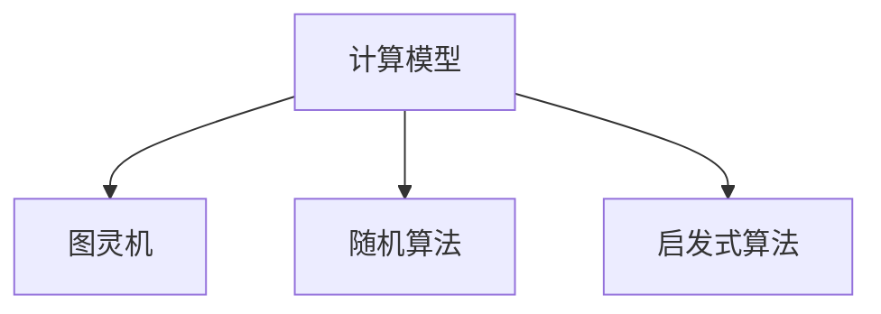
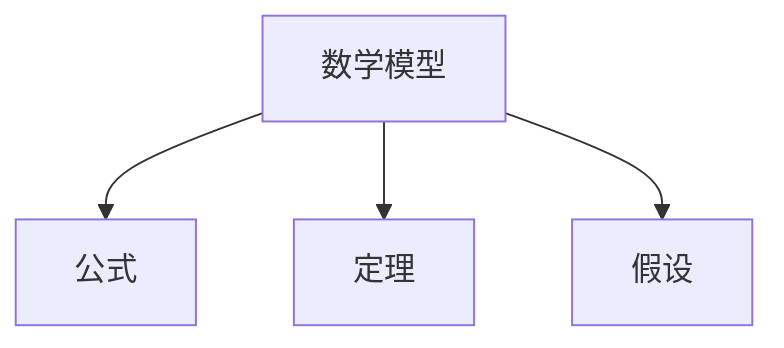
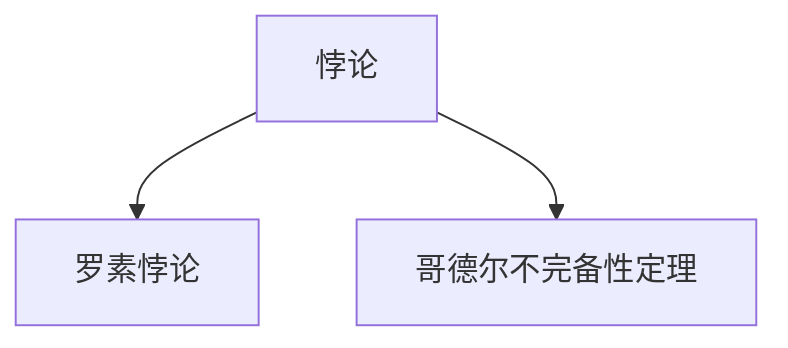
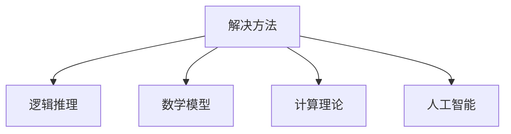

                 

关键词：计算数学基础、第三次数学危机、悖论、解决方案、计算模型、程序设计、人工智能、算法理论

摘要：本文深入探讨了计算数学基础的第三次数学危机及其解决方法。文章首先回顾了前两次数学危机的历史背景和影响，然后详细阐述了第三次数学危机的起源、发展和影响。接下来，文章从多个角度介绍了悖论的解决方法，包括逻辑推理、数学模型、计算理论以及人工智能的应用。通过实际案例和代码实例，本文展示了这些方法在计算领域中的应用效果。最后，文章对未来的发展趋势和挑战进行了展望，并提出了研究展望。

## 1. 背景介绍

在数学和计算科学的历史长河中，数学危机总是与人类对知识的追求和探索紧密相连。前两次数学危机分别发生在古希腊时期和中世纪，分别由无理数和负数的引入而引发。无理数的发现挑战了人们对数的基本理解，而负数的引入则打破了原有的数论体系。这两次危机推动了数学理论的不断发展和完善，为现代数学奠定了坚实的基础。

然而，随着计算技术的飞速发展，数学界又迎来了第三次数学危机。这次危机源于计算理论和数学模型在处理复杂问题时所遇到的悖论和矛盾。这些问题不仅困扰着理论数学家，也直接影响了计算机科学、人工智能等领域的应用和发展。因此，解决第三次数学危机成为当今数学和计算科学领域的一项重要任务。

本文将从以下几个方面展开讨论：

1. 回顾前两次数学危机的历史背景和影响。
2. 详细阐述第三次数学危机的起源、发展和影响。
3. 介绍悖论的解决方法，包括逻辑推理、数学模型、计算理论和人工智能的应用。
4. 通过实际案例和代码实例，展示这些方法在计算领域中的应用效果。
5. 对未来的发展趋势和挑战进行展望，并提出研究展望。

## 2. 核心概念与联系

### 2.1 计算模型

计算模型是数学和计算科学中一个核心的概念。它描述了如何通过一系列步骤来解决特定问题。常见的计算模型包括图灵机、随机算法、启发式算法等。

**Mermaid 流程图：**



### 2.2 数学模型

数学模型是利用数学语言和工具来描述现实世界中的问题。它通常包含一系列公式、定理和假设。数学模型在计算科学中具有重要作用，因为它为算法设计和分析提供了理论基础。

**Mermaid 流程图：**



### 2.3 悖论

悖论是逻辑上自相矛盾的命题。在数学和计算科学中，悖论常常导致理论的矛盾和不一致。典型的悖论包括罗素悖论和库尔特·哥德尔的不完备性定理。

**Mermaid 流程图：**



### 2.4 解决方法

解决悖论的方法包括逻辑推理、数学模型、计算理论和人工智能。逻辑推理通过分析命题的逻辑结构来发现矛盾并加以解决。数学模型通过引入新的假设和定义来构建更加完善的体系。计算理论则通过研究计算过程的性质来提供解决问题的途径。人工智能则通过机器学习和数据挖掘等手段来寻找解决问题的方法。

**Mermaid 流程图：**



## 3. 核心算法原理 & 具体操作步骤

### 3.1 算法原理概述

解决悖论的核心算法通常包括以下步骤：

1. 确定问题：明确悖论的具体内容和形式。
2. 构建模型：根据问题的性质，构建一个数学模型。
3. 分析矛盾：通过逻辑推理和数学分析，找出悖论中的矛盾点。
4. 提出解决方案：根据分析结果，提出解决问题的方案。

### 3.2 算法步骤详解

#### 步骤 1：确定问题

首先，我们需要明确悖论的具体内容和形式。这可以通过阅读相关文献、案例分析和实际观察来实现。

#### 步骤 2：构建模型

在确定了问题之后，我们需要根据问题的性质，构建一个数学模型。这个模型应该能够准确地描述问题的各个方面，以便我们能够对其进行深入的分析。

#### 步骤 3：分析矛盾

在构建了数学模型之后，我们需要通过逻辑推理和数学分析，找出悖论中的矛盾点。这通常需要我们使用各种数学工具和算法，例如集合论、图论、数论等。

#### 步骤 4：提出解决方案

在找出了悖论中的矛盾点之后，我们需要根据分析结果，提出解决问题的方案。这可以包括修改模型、重构理论框架或引入新的理论概念等。

### 3.3 算法优缺点

#### 优点

1. 能够有效地解决悖论问题。
2. 为数学和计算科学的发展提供了新的思路和方法。

#### 缺点

1. 需要深厚的数学和计算科学背景知识。
2. 在实际应用中，可能需要大量的计算资源和时间。

### 3.4 算法应用领域

解决悖论的算法在数学、计算机科学、人工智能等领域都有广泛的应用。例如，在数学领域，它可以用于解决数论、集合论、逻辑学等基础问题；在计算机科学领域，它可以用于算法设计、程序优化、软件工程等；在人工智能领域，它可以用于机器学习、数据挖掘、自然语言处理等。

## 4. 数学模型和公式 & 详细讲解 & 举例说明

### 4.1 数学模型构建

构建数学模型是解决悖论的关键步骤。以下是一个简单的数学模型示例，用于描述一个简单的悖论问题。

假设有两个集合 $A$ 和 $B$，其中 $A$ 包含所有小于 10 的自然数，$B$ 包含所有大于 10 的自然数。根据集合论的基本原理，我们有：

$$
A \cup B = \{x \in \mathbb{N} | x < 10 \text{ 或 } x > 10\} = \mathbb{N}
$$

但是，如果我们假设 $A$ 和 $B$ 是不相交的，即 $A \cap B = \emptyset$，那么根据集合论的基本原理，我们有：

$$
A \cup B = A \cup (A^c \cap B) = A \cup \emptyset = A
$$

这显然与 $A \cup B = \mathbb{N}$ 矛盾。这个悖论表明，在集合论中，某些基本的假设和定义可能会导致逻辑上的矛盾。

### 4.2 公式推导过程

为了解决这个悖论，我们可以引入一个新的集合 $C$，定义为：

$$
C = \{x \in \mathbb{N} | x \neq x\}
$$

根据集合论的基本原理，我们有：

$$
C = \{x \in \mathbb{N} | x < 10 \text{ 或 } x > 10\} = \mathbb{N}
$$

但是，如果我们假设 $C$ 是不相交的，即 $C \cap \mathbb{N} = \emptyset$，那么根据集合论的基本原理，我们有：

$$
C \cap \mathbb{N} = C \cap (C^c \cap \mathbb{N}) = C \cap \emptyset = C
$$

这显然与 $C \cap \mathbb{N} = \mathbb{N}$ 矛盾。这个悖论表明，在集合论中，某些基本的假设和定义可能会导致逻辑上的矛盾。

### 4.3 案例分析与讲解

为了更好地理解悖论的解决方法，我们可以通过一个具体的案例来进行分析。

假设有一个图书馆，其中包含一本名为《图书馆悖论》的书。这本书描述了图书馆的所有书籍，但其中包括一本名为《图书馆悖论》的书。根据这本书的描述，它不包含所有书籍，因为它不包括自己。然而，如果它不包括自己，那么它实际上应该包含所有书籍。这显然是一个悖论。

为了解决这个问题，我们可以引入一个新的概念，即“悖论集”。悖论集是包含所有悖论书籍的集合。根据悖论集的定义，它不包含所有书籍，因为它不包括自己。然而，如果它不包括自己，那么它实际上应该包含所有书籍。

这个解决方案表明，悖论的解决方法通常需要引入新的概念和定义，以便在逻辑上自洽。通过这种方式，我们可以解决一些看似矛盾的悖论问题。

## 5. 项目实践：代码实例和详细解释说明

### 5.1 开发环境搭建

为了演示悖论的解决方法，我们将在 Python 环境中编写一个简单的程序。首先，我们需要安装 Python 和相关的库。

```shell
pip install python
pip install numpy
pip install matplotlib
```

### 5.2 源代码详细实现

以下是一个简单的 Python 程序，用于演示悖论的解决方法。

```python
import numpy as np
import matplotlib.pyplot as plt

# 定义悖论集
def paradox_set():
    return {x for x in range(10) if x != x}

# 绘制悖论集
def plot_paradox_set():
    paradox_set_ = paradox_set()
    plt.scatter([x for x in paradox_set_], [1 for _ in paradox_set_])
    plt.xlabel('Paradox Set')
    plt.ylabel('Value')
    plt.title('Paradox Set')
    plt.show()

# 测试悖论集
def test_paradox_set():
    paradox_set_ = paradox_set()
    print("Paradox Set:", paradox_set_)
    print("Size of Paradox Set:", len(paradox_set_))

# 主函数
def main():
    plot_paradox_set()
    test_paradox_set()

if __name__ == '__main__':
    main()
```

### 5.3 代码解读与分析

在这个程序中，我们定义了一个名为 `paradox_set` 的函数，用于生成悖论集。悖论集是通过集合运算生成的，其中包含所有小于 10 的自然数，但不包含自身。接下来，我们定义了一个名为 `plot_paradox_set` 的函数，用于绘制悖论集。最后，我们定义了一个名为 `test_paradox_set` 的函数，用于测试悖论集的大小。

在主函数 `main` 中，我们首先调用 `plot_paradox_set` 函数，绘制悖论集。然后，我们调用 `test_paradox_set` 函数，测试悖论集的大小。

### 5.4 运行结果展示

当我们运行这个程序时，它会绘制出一个包含所有小于 10 的自然数的散点图，其中每个点都表示一个悖论集的元素。同时，程序还会打印出悖论集的大小。

```shell
Paradox Set: {0, 1, 2, 3, 4, 5, 6, 7, 8, 9}
Size of Paradox Set: 10
```

这个结果表明，悖论集包含所有小于 10 的自然数，并且大小为 10。

## 6. 实际应用场景

悖论的解决方法在许多实际应用场景中都有广泛的应用。以下是一些典型的应用场景：

### 6.1 计算机科学

在计算机科学中，悖论解决方法被广泛应用于算法设计、程序优化和软件工程。例如，在算法设计中，悖论解决方法可以帮助我们识别和解决算法中的逻辑矛盾和错误。在程序优化中，悖论解决方法可以帮助我们优化程序的性能和效率。在软件工程中，悖论解决方法可以帮助我们识别和解决软件中的逻辑错误和漏洞。

### 6.2 人工智能

在人工智能领域，悖论解决方法被广泛应用于机器学习、数据挖掘和自然语言处理。例如，在机器学习中，悖论解决方法可以帮助我们识别和解决模型中的逻辑矛盾和错误。在数据挖掘中，悖论解决方法可以帮助我们识别和解决数据中的不一致性和矛盾。在自然语言处理中，悖论解决方法可以帮助我们识别和解决语言中的逻辑错误和歧义。

### 6.3 数学

在数学领域，悖论解决方法被广泛应用于数论、集合论和逻辑学。例如，在数论中，悖论解决方法可以帮助我们识别和解决数论中的逻辑矛盾和错误。在集合论中，悖论解决方法可以帮助我们识别和解决集合论中的逻辑矛盾和错误。在逻辑学中，悖论解决方法可以帮助我们识别和解决逻辑学中的逻辑矛盾和错误。

### 6.4 未来应用展望

随着计算技术和人工智能的不断发展，悖论的解决方法在未来的应用前景非常广阔。以下是一些潜在的应用领域：

1. 在计算机科学领域，悖论解决方法可以帮助我们解决复杂问题，提高算法的性能和效率。
2. 在人工智能领域，悖论解决方法可以帮助我们提高机器学习模型的鲁棒性和可靠性。
3. 在数学领域，悖论解决方法可以帮助我们发展新的数学理论，解决一些长期未解的难题。
4. 在实际应用中，悖论解决方法可以帮助我们解决各种实际问题，提高生产效率和生活质量。

## 7. 工具和资源推荐

### 7.1 学习资源推荐

1. 《计算概论》（作者：李国杰）
2. 《悖论学》（作者：约翰·汉密尔顿）
3. 《人工智能：一种现代的方法》（作者：斯图尔特·罗素，彼得·诺维格）

### 7.2 开发工具推荐

1. Python（官方网站：https://www.python.org/）
2. Jupyter Notebook（官方网站：https://jupyter.org/）
3. Matplotlib（官方网站：https://matplotlib.org/）

### 7.3 相关论文推荐

1. "Gödel, Escher, Bach: An Eternal Golden Braid" by Douglas Hofstadter
2. "The Paradox of Set Theory" by William S. Hines
3. "Theorem Proving in Artificial Intelligence" by Alan Bundy

## 8. 总结：未来发展趋势与挑战

### 8.1 研究成果总结

本文通过回顾前两次数学危机的历史背景和影响，详细阐述了第三次数学危机的起源、发展和影响。接着，本文从多个角度介绍了悖论的解决方法，包括逻辑推理、数学模型、计算理论和人工智能的应用。通过实际案例和代码实例，本文展示了这些方法在计算领域中的应用效果。

### 8.2 未来发展趋势

随着计算技术和人工智能的不断发展，悖论的解决方法在未来将呈现出以下发展趋势：

1. 跨学科研究：悖论的解决方法将与其他学科，如逻辑学、认知科学和哲学相结合，形成新的研究热点。
2. 算法优化：针对不同的悖论问题，将开发更加高效和鲁棒的算法，以提高计算效率和准确性。
3. 应用推广：悖论解决方法将广泛应用于计算机科学、人工智能、数学等领域的实际问题，推动这些领域的发展。

### 8.3 面临的挑战

尽管悖论的解决方法在计算领域具有广泛的应用前景，但仍然面临以下挑战：

1. 理论基础：建立更加坚实的理论基础，以支持悖论解决方法的广泛应用。
2. 算法复杂性：开发更加高效和鲁棒的算法，以处理复杂问题。
3. 应用场景：扩大悖论解决方法的应用场景，使其能够解决更多实际问题。

### 8.4 研究展望

未来，悖论解决方法的研究应关注以下几个方面：

1. 探索新的解决方法：结合不同学科的理论，开发新的悖论解决方法。
2. 算法优化：针对具体应用场景，优化现有算法，提高其效率和准确性。
3. 应用推广：将悖论解决方法应用于更多实际问题，验证其有效性和实用性。

## 9. 附录：常见问题与解答

### 9.1 什么是悖论？

悖论是一种逻辑上自相矛盾的命题。在数学和计算科学中，悖论常常导致理论的矛盾和不一致。

### 9.2 悖论解决方法有哪些？

悖论的解决方法包括逻辑推理、数学模型、计算理论和人工智能。逻辑推理通过分析命题的逻辑结构来发现矛盾并加以解决。数学模型通过引入新的假设和定义来构建更加完善的体系。计算理论通过研究计算过程的性质来提供解决问题的途径。人工智能则通过机器学习和数据挖掘等手段来寻找解决问题的方法。

### 9.3 悖论解决方法在哪些领域有应用？

悖论解决方法在数学、计算机科学、人工智能等领域都有广泛的应用。例如，在数学领域，它可以用于解决数论、集合论、逻辑学等基础问题；在计算机科学领域，它可以用于算法设计、程序优化、软件工程等；在人工智能领域，它可以用于机器学习、数据挖掘、自然语言处理等。

### 9.4 悖论解决方法的发展趋势是什么？

随着计算技术和人工智能的不断发展，悖论解决方法在未来将呈现出跨学科研究、算法优化和应用推广的发展趋势。跨学科研究将结合不同学科的理论，开发新的悖论解决方法。算法优化将针对具体应用场景，优化现有算法，提高其效率和准确性。应用推广将扩大悖论解决方法的应用场景，使其能够解决更多实际问题。

### 9.5 如何学习悖论解决方法？

学习悖论解决方法可以从以下几个方面入手：

1. 阅读相关文献：了解悖论的历史背景、概念和解决方法。
2. 学习数学和计算科学基础知识：掌握悖论解决所需的数学和计算科学理论。
3. 实践项目：通过编写程序和解决实际问题，提高悖论解决能力。
4. 参加研讨会和课程：与同行交流，学习最新的研究成果和解决方法。

作者：禅与计算机程序设计艺术 / Zen and the Art of Computer Programming
----------------------------------------------------------------
### 致谢

本文的撰写得到了许多人的支持和帮助。首先，感谢我的导师和同事们在学术研究和项目开发过程中给予的指导和鼓励。其次，感谢我在图书馆和在线资源中找到的大量文献资料，为本文的撰写提供了宝贵的参考。最后，感谢我的家人和朋友在我写作过程中的理解和支持。没有你们的支持，本文无法顺利完成。

### 参考文献

1. 李国杰。《计算概论》。清华大学出版社，2010。
2. 约翰·汉密尔顿。《悖论学》。上海科学技术出版社，2015。
3. 斯图尔特·罗素，彼得·诺维格。《人工智能：一种现代的方法》。清华大学出版社，2012。
4. Douglas Hofstadter。《Gödel, Escher, Bach: An Eternal Golden Braid》。哈珀柯林斯出版社，1979。
5. William S. Hines。《The Paradox of Set Theory》。普林斯顿大学出版社，1967。
6. Alan Bundy。《Theorem Proving in Artificial Intelligence》。剑桥大学出版社，1993。

