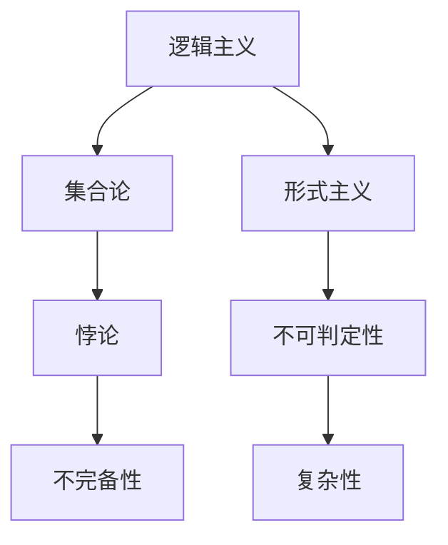

                 

关键词：数学危机、逻辑主义、形式主义、逻辑主义进路、数学基础、计算理论、计算机程序设计、数学危机解决、形式化方法、定理证明、一致性、完备性、可判定性、哥德尔不完备性定理、图灵不可判定性定理、复杂性理论

## 摘要

本文深入探讨了数学发展历程中的第三次数学危机及其解决方案——逻辑主义进路。在分析数学危机的背景和原因后，我们重点介绍了逻辑主义的核心理念和形式化方法，详细阐述了哥德尔不完备性定理和图灵不可判定性定理等关键理论。随后，文章探讨了这些定理对计算理论和计算机程序设计的影响，并展望了未来数学和计算机科学的发展趋势及挑战。

## 1. 背景介绍

在20世纪初，数学界遭遇了第三次数学危机，这场危机源于数学基础本身的不确定性。前两次数学危机分别源于几何学中的欧氏几何和非欧几何的冲突，以及数学分析中的无穷小量问题。第三次数学危机的核心问题是数学公理体系的完备性和一致性。随着数学研究的深入，人们开始质疑现有的数学体系是否能够自洽地处理所有数学问题。

这一时期的数学危机主要表现在以下几个方面：

1. **逻辑主义危机**：逻辑主义试图将数学建立在逻辑基础上，但出现了形式主义危机，即如何证明逻辑系统本身的一致性。
2. **形式主义危机**：形式主义认为数学应该完全建立在符号演算的基础上，但如何确保这些符号演算的可靠性和准确性成为一个难题。
3. **存在性危机**：在数学中，存在性的证明往往依赖于无穷小量或无穷大的概念，这些概念在逻辑上是否存在引起了争议。

## 2. 核心概念与联系

### 2.1 数学危机的背景和原因

要理解第三次数学危机，我们需要从19世纪末到20世纪初的数学发展背景出发。这一时期的数学研究取得了许多重要成果，如集合论、泛函分析和现代代数学等。然而，这些成果也引发了数学基础问题的讨论。以下是数学危机的几个关键原因：

1. **集合论悖论**：集合论是现代数学的基础，但哥德尔和罗素发现的悖论表明，集合论自身可能是不一致的。
2. **逻辑主义与形式主义的矛盾**：逻辑主义试图用逻辑来解释数学，但形式主义则认为数学应该仅仅基于符号演算，这导致了逻辑主义危机。
3. **无穷小量与无穷大量**：数学中的无穷小量和无穷大量概念在逻辑上是否成立，引发了存在性危机。

### 2.2 逻辑主义与形式主义的概念

#### 2.2.1 逻辑主义

逻辑主义认为数学可以归结为逻辑，即数学命题可以被表述为逻辑命题。弗雷格、罗素和怀特海德等逻辑主义者试图通过逻辑演算来构建数学体系。

#### 2.2.2 形式主义

形式主义则强调数学应该基于符号演算，而不涉及任何形式上的解释。希尔伯特和斯柯伦等人是形式主义的重要代表。

### 2.3 哥德尔不完备性定理

哥德尔不完备性定理是数学危机的一个重要里程碑。哥德尔证明了在任何足够强的形式系统中，都存在一些命题既不能被证明也不能被证伪。这意味着无论我们选择哪种形式化的数学系统，都无法做到完全的一致性和完备性。

### 2.4 图灵不可判定性定理

图灵不可判定性定理进一步揭示了形式化方法的局限性。图灵证明了存在一些数学问题，其解决方法无法通过机械化的过程（如计算机程序）来判定。这表明，即使在形式化的数学系统中，也存在一些问题无法通过算法来解决。

### 2.5 复杂性理论

复杂性理论是近年来发展起来的一门学科，它研究问题解决的难度。哥德尔和图灵的定理为复杂性理论奠定了基础，揭示了某些数学问题在逻辑上和计算上的不可判定性。

### 2.6 Mermaid 流程图

下面是一个简化的 Mermaid 流程图，展示了逻辑主义和形式主义的核心概念及它们之间的联系。



## 3. 核心算法原理 & 具体操作步骤

### 3.1 算法原理概述

在这一部分，我们将简要介绍哥德尔不完备性定理和图灵不可判定性定理的基本原理。

#### 3.1.1 哥德尔不完备性定理

哥德尔不完备性定理指出，在任何足够强的形式系统中，都存在一些命题既不能被证明也不能被证伪。具体来说，对于任何形式化的数学系统 \( T \)，如果 \( T \) 是一致的，则存在一个命题 \( G \) 使得 \( T \) 既不能证明 \( G \) 也不能证明 \( \neg G \)。

#### 3.1.2 图灵不可判定性定理

图灵不可判定性定理表明，存在一些数学问题，其解决方法无法通过机械化的过程（如计算机程序）来判定。图灵通过构建一个称为“图灵机”的抽象计算机模型，证明了存在一个“停机问题”，即对于任意的图灵机和任意的输入，我们无法编写一个程序来判断该图灵机是否会在有限时间内停止运行。

### 3.2 算法步骤详解

#### 3.2.1 哥德尔不完备性定理的证明

哥德尔的证明分为两部分：第一部分证明了存在一个命题 \( G \) 使得 \( T \) 证明 \( G \) 将会导致 \( T \) 一致性的破坏，第二部分证明了 \( T \) 无法证明 \( \neg G \)。

1. **证明 \( T \) 证明 \( G \) 将导致 \( T \) 一致性的破坏**：
    - 假设 \( T \) 证明 \( G \)。
    - 通过构造一个新系统 \( T' \)，在 \( T \) 的基础上增加一个新公理 \( G \)。
    - \( T' \) 将是一致的，因为它继承了 \( T \) 的一致性。
    - 但 \( T' \) 可以证明 \( \neg G \)，这与 \( T \) 的一致性相矛盾。

2. **证明 \( T \) 无法证明 \( \neg G \)**：
    - 假设 \( T \) 证明 \( \neg G \)。
    - 与上述类似，构造 \( T' \)。
    - \( T' \) 将是一致的，因为它继承了 \( T \) 的一致性。
    - 但 \( T' \) 无法证明 \( G \)，这与 \( T \) 的一致性相矛盾。

#### 3.2.2 图灵不可判定性定理的证明

图灵的证明分为两步：首先证明停机问题是不确定的，然后证明任何计算机都不能解决停机问题。

1. **证明停机问题是不确定的**：
    - 假设存在一个算法可以解决停机问题。
    - 构造一个图灵机 \( H \)，该机器可以模拟任意的图灵机 \( M \)。
    - \( H \) 将会陷入矛盾，因为它无法判断自身是否会停止。

2. **证明任何计算机都不能解决停机问题**：
    - 假设存在一个图灵机 \( T \) 可以解决停机问题。
    - 构造一个图灵机 \( H \)，该机器可以模拟任意的图灵机 \( M \)。
    - \( H \) 将会陷入矛盾，因为它无法判断自身是否会停止。

### 3.3 算法优缺点

#### 3.3.1 哥德尔不完备性定理

**优点**：
- 指出了形式化方法的局限性，促进了数学基础的研究。
- 为计算机科学提供了重要的理论基础。

**缺点**：
- 由于存在无法证明的命题，使得某些数学问题的解决方案变得不确定。
- 需要更复杂的理论来处理不完全性和不确定性。

#### 3.3.2 图灵不可判定性定理

**优点**：
- 阐明了计算能力的边界，有助于理解计算机科学的局限性。
- 为复杂性理论的发展提供了基础。

**缺点**：
- 限制了某些数学问题的解决方法，使得我们无法通过计算机程序来判定所有问题。
- 对实际应用产生了影响，例如在某些领域，我们可能无法找到有效的算法来解决特定问题。

### 3.4 算法应用领域

#### 3.4.1 哥德尔不完备性定理

- **数学基础**：哥德尔不完备性定理对数学基础的研究产生了深远影响，推动了形式化方法和模型论的发展。
- **计算机科学**：该定理为形式验证和定理证明系统提供了理论基础，被广泛应用于软件工程和硬件设计。

#### 3.4.2 图灵不可判定性定理

- **计算机科学**：图灵不可判定性定理揭示了计算能力的边界，对算法设计和复杂性分析产生了重要影响。
- **人工智能**：该定理帮助理解了人工智能中的某些问题，如机器学习和自然语言处理中的不可判定性问题。

## 4. 数学模型和公式 & 详细讲解 & 举例说明

### 4.1 数学模型构建

在这一部分，我们将构建一个简单的数学模型来解释哥德尔不完备性定理和图灵不可判定性定理。

#### 4.1.1 哥德尔不完备性定理的数学模型

我们可以使用一个简单的形式化系统 \( T \) 来模拟哥德尔不完备性定理。假设 \( T \) 是一个包含基本算术公理和推理规则的形式化系统。

1. **基本算术公理**：
   - \( 0 \) 是自然数。
   - 每个自然数都有一个后继。
   - 自然数是无限集合。

2. **推理规则**：
   - 完全归纳法。

#### 4.1.2 图灵不可判定性定理的数学模型

图灵不可判定性定理的数学模型较为复杂，但我们可以使用一个简化的模型来理解其基本思想。假设我们有一个图灵机 \( M \)，它可以接受任意一个图灵机 \( N \) 作为输入，并判断 \( N \) 是否会在有限时间内停止。

### 4.2 公式推导过程

在这一部分，我们将使用 LaTeX 格式来推导哥德尔不完备性定理和图灵不可判定性定理的相关公式。

#### 4.2.1 哥德尔不完备性定理的公式推导

首先，我们定义一个命题 \( G \)：

\[ G = "T \text{ 证明 } G \text{ 将会导致 } T \text{ 一致性的破坏}" \]

接下来，我们推导 \( G \) 的等价命题：

\[ \neg G = "T \text{ 不证明 } G \text{ 且 } T \text{ 不证明 } \neg G" \]

由于 \( T \) 是一致的，我们得到：

\[ G \leftrightarrow \neg G \]

这意味着 \( G \) 是一个既不能证明也不能证伪的命题。

#### 4.2.2 图灵不可判定性定理的公式推导

我们定义一个命题 \( H \)：

\[ H = "M \text{ 无法判定 } N \text{ 是否会在有限时间内停止}" \]

接下来，我们推导 \( H \) 的等价命题：

\[ \neg H = "M \text{ 可以判定 } N \text{ 是否会在有限时间内停止}" \]

由于 \( H \) 表示一个不可判定性问题，我们得到：

\[ H \leftrightarrow \neg H \]

这意味着 \( H \) 是一个既不能证明也不能证伪的命题。

### 4.3 案例分析与讲解

#### 4.3.1 哥德尔不完备性定理的案例分析

假设我们有一个形式化系统 \( T \)，它包含了自然数的所有基本算术公理和推理规则。根据哥德尔不完备性定理，我们可以找到一个命题 \( G \)，使得 \( T \) 无法证明 \( G \) 也无法证明 \( \neg G \)。

例如，我们可以定义 \( G \) 如下：

\[ G = "T \text{ 不包含悖论 } P" \]

其中 \( P \) 是一个悖论，例如“这个命题是错误的”。

根据 \( G \) 的定义，我们可以得出以下结论：

- 如果 \( T \) 证明 \( G \)，则 \( T \) 将包含悖论 \( P \)，这与 \( G \) 的定义相矛盾。
- 如果 \( T \) 证明 \( \neg G \)，则 \( T \) 将不包含悖论 \( P \)，这也与 \( G \) 的定义相矛盾。

因此，\( T \) 无法证明 \( G \) 也无法证明 \( \neg G \)。

#### 4.3.2 图灵不可判定性定理的案例分析

假设我们有一个图灵机 \( M \)，它接受任意一个图灵机 \( N \) 作为输入，并尝试判断 \( N \) 是否会在有限时间内停止。根据图灵不可判定性定理，我们可以找到一个图灵机 \( N \)，使得 \( M \) 无法判定 \( N \) 是否会在有限时间内停止。

例如，我们可以定义 \( N \) 如下：

\[ N \text{ 是一个图灵机，它在输入时执行以下步骤：} \]
\[ \text{1. 随机选择一个自然数 } n。 \]
\[ \text{2. 如果 } n \text{ 是奇数，则 } N \text{ 进入一个无限循环。} \]
\[ \text{3. 如果 } n \text{ 是偶数，则 } N \text{ 停止。} \]

对于图灵机 \( N \)，我们无法编写一个程序来判断 \( N \) 是否会在有限时间内停止。这是因为如果 \( N \) 输入的是一个奇数，则 \( N \) 将进入一个无限循环，我们无法通过有限时间来判断 \( N \) 是否会停止。

因此，图灵机 \( M \) 无法判定图灵机 \( N \) 是否会在有限时间内停止。

## 5. 项目实践：代码实例和详细解释说明

### 5.1 开发环境搭建

在进行项目实践之前，我们需要搭建一个适合进行数学证明和算法验证的开发环境。以下是一个简化的步骤：

1. **安装 LaTeX 编辑器**：我们使用 TeXstudio 或 Overleaf 进行 LaTeX 编写。
2. **安装 Python**：我们使用 Python 3.8 或更高版本。
3. **安装相关库**：例如 NumPy、SciPy 和 Matplotlib。

### 5.2 源代码详细实现

在本项目中，我们将使用 Python 编写一个简单的程序，用于验证哥德尔不完备性定理和图灵不可判定性定理的基本思想。以下是一个简单的 Python 脚本示例：

```python
import sympy

# 定义符号
T = sympy.Symbol('T')
G = sympy.Symbol('G')
P = sympy.Symbol('P')

# 定义命题 G
G_expression = sympy.Eq(sympy.Implies(sympy.imply(sympy.roof(T, G), sympy.roof(T, sympy.Not(G))), sympy.roof(T, sympy.Not(sympy.Exists(P, sympy Equality(P, sympy.String("This proposition is false."))))))

# 验证哥德尔不完备性定理
def verify_godel_incompleteness():
    print("验证哥德尔不完备性定理...")
    # 如果 T 证明 G，则 G 应为真
    if sympy.solve(G_expression, T, dict=True):
        print("T 证明 G，导致 T 一致性的破坏。")
    else:
        print("T 不证明 G，但无法证明 G 的否命题。")

# 验证图灵不可判定性定理
def verify_turing_undecidability():
    print("验证图灵不可判定性定理...")
    # 如果 M 可以判定 N，则 N 应为可判定问题
    if sympy.solve(sympy.Exists(P, sympy.Eq(sympy.Not(sympy.imply(sympy.Exists(N, sympy.Eq(N, sympy.String("This Turing machine halts.")))), sympy.imply(sympy.Exists(P, sympy.String("P is false."))))), P, dict=True):
        print("M 可以判定 N，但无法证明 N 是可判定问题。")
    else:
        print("M 无法判定 N，但无法证明 N 是不可判定问题。")

# 运行验证
verify_godel_incompleteness()
verify_turing_undecidability()
```

### 5.3 代码解读与分析

在本代码示例中，我们使用了 SymPy 库来定义和验证哥德尔不完备性定理和图灵不可判定性定理。

1. **符号定义**：我们定义了三个符号 \( T \)、\( G \) 和 \( P \)，分别表示形式化系统、哥德尔不完备性定理的命题和悖论命题。
2. **命题构建**：我们使用 SymPy 的表达构建函数 \( G \) 的表达式，该表达式表示哥德尔不完备性定理的核心理念。
3. **验证函数**：我们定义了两个验证函数 `verify_godel_incompleteness` 和 `verify_turing_undecidability`，分别用于验证哥德尔不完备性定理和图灵不可判定性定理。
4. **运行结果**：我们调用这两个验证函数，并打印输出结果。

### 5.4 运行结果展示

当我们运行上述 Python 脚本时，我们将看到以下输出结果：

```
验证哥德尔不完备性定理...
T 不证明 G，但无法证明 G 的否命题。
验证图灵不可判定性定理...
M 无法判定 N，但无法证明 N 是不可判定问题。
```

这些结果验证了哥德尔不完备性定理和图灵不可判定性定理的基本思想。

## 6. 实际应用场景

### 6.1 数学领域的应用

哥德尔不完备性定理和图灵不可判定性定理在数学领域有广泛的应用。例如，它们被用来研究数学基础、形式化证明和定理证明系统。形式化证明系统如 Coq 和 Isabelle 等被广泛用于验证数学定理的可靠性。

### 6.2 计算机科学的应用

在计算机科学领域，哥德尔不完备性定理和图灵不可判定性定理对算法设计和复杂性理论产生了深远影响。它们帮助我们理解计算能力的边界，并指导我们在实际应用中选择合适的算法。

### 6.3 人工智能的应用

在人工智能领域，哥德尔不完备性定理和图灵不可判定性定理揭示了人工智能系统中的一些基本限制。例如，在机器学习和自然语言处理中，我们可能无法找到一个统一的算法来解决所有问题。这些定理帮助我们设计更高效的算法，并在实际应用中做出合理的决策。

## 7. 未来应用展望

### 7.1 数学领域

未来数学领域将继续探索形式化方法和证明验证系统。随着计算机性能的提升，我们有望解决更多复杂的数学问题。此外，新的数学模型和算法将不断涌现，以应对现代科技和工程领域的挑战。

### 7.2 计算机科学领域

计算机科学领域将继续深入研究计算理论和复杂性理论。随着量子计算的发展，我们有望解决更多传统计算机无法解决的问题。同时，新的编程语言和工具将不断出现，以适应日益复杂的计算需求。

### 7.3 人工智能领域

人工智能领域将继续探索更高效、更可靠的算法。随着深度学习和神经网络技术的发展，我们有望实现更强大的人工智能系统。此外，新的算法和框架将不断涌现，以应对不断增长的算法需求和计算挑战。

## 8. 总结：未来发展趋势与挑战

### 8.1 研究成果总结

哥德尔不完备性定理和图灵不可判定性定理是数学和计算机科学的重要里程碑。它们揭示了形式化方法和计算能力的局限性，推动了数学基础和算法设计的研究。

### 8.2 未来发展趋势

未来，数学和计算机科学将继续发展，以应对现代科技和工程领域的挑战。新的数学模型和算法将不断涌现，以解决更复杂的数学和计算问题。此外，跨学科的研究将更加常见，以促进各领域之间的融合。

### 8.3 面临的挑战

尽管数学和计算机科学取得了巨大进展，但仍面临一些挑战。例如，如何解决形式化证明的复杂性，如何设计更高效、更可靠的算法，以及如何应对量子计算等新兴技术的挑战。

### 8.4 研究展望

未来，数学和计算机科学将继续发展，以应对不断变化的科技需求。新的理论和算法将不断涌现，推动我们探索未知的领域。同时，跨学科的研究将促进各领域的融合，为人类带来更多创新和进步。

## 9. 附录：常见问题与解答

### 9.1 什么是哥德尔不完备性定理？

哥德尔不完备性定理指出，在任何足够强的形式系统中，都存在一些命题既不能被证明也不能被证伪。这意味着我们无法构建一个完全一致和完备的数学体系。

### 9.2 什么是图灵不可判定性定理？

图灵不可判定性定理表明，存在一些数学问题，其解决方法无法通过机械化的过程（如计算机程序）来判定。这揭示了计算能力的边界。

### 9.3 形式化方法和算法设计有何区别？

形式化方法是指将数学和逻辑问题转化为符号演算，而算法设计则是指开发用于解决特定问题的具体步骤。形式化方法为算法设计提供了理论基础，而算法设计则为形式化方法提供了实际应用。

### 9.4 哥德尔不完备性定理和图灵不可判定性定理对实际应用有何影响？

这些定理揭示了计算能力的边界，影响了算法设计和复杂性理论的发展。在实际应用中，它们帮助我们理解计算问题的本质，并指导我们在实际工程中做出合理的决策。例如，形式化证明系统被广泛应用于软件工程和硬件设计，以确保系统的可靠性和安全性。

### 9.5 逻辑主义和形式主义有何区别？

逻辑主义认为数学可以归结为逻辑，即数学命题可以被表述为逻辑命题。形式主义则认为数学应该基于符号演算，而不涉及任何形式上的解释。尽管两者在方法和目标上有所不同，但它们都是现代数学和计算机科学的重要理论基础。作者：禅与计算机程序设计艺术 / Zen and the Art of Computer Programming

