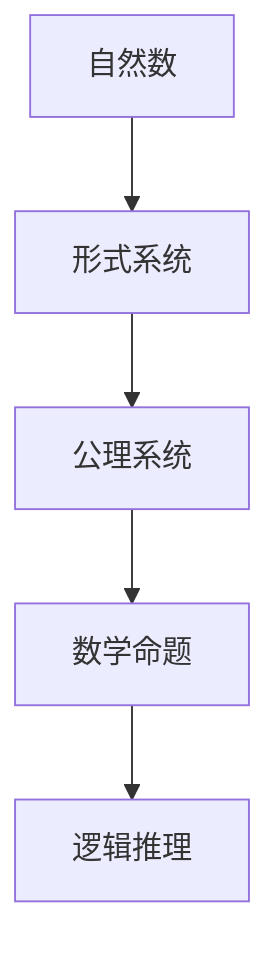

                 

关键词：计算数学基础、第三次数学危机、逻辑主义进路、形式主义、自然数、形式系统、公理系统、证明论、哥德尔不完备定理、数学证明、逻辑推理、计算机程序设计。

## 摘要

本文将探讨计算数学基础的第五章——第三次数学危机 逻辑主义进路。在经历了第一次数学危机（微积分的严密性）和第二次数学危机（无穷小量）之后，数学界面对新的挑战，即如何确保数学体系的可靠性和一致性。逻辑主义进路作为一种回应，试图将数学建立在逻辑基础上，从而摆脱传统数学体系的困境。本文将深入探讨逻辑主义进路的起源、核心思想、应用以及其在计算机程序设计中的重要性。

## 1. 背景介绍

### 第一次数学危机

第一次数学危机源于微积分的严密性问题。在17世纪，牛顿和莱布尼茨发明了微积分，但当时并没有给出严格的数学证明。微积分的许多结论依赖于无穷小量，这种无穷小量在形式上是不严谨的，引发了数学界的争议。为了解决这一问题，数学家们开始寻求更严格的数学基础。

### 第二次数学危机

第二次数学危机源于无穷小量的存在。在传统的数学体系中，无穷小量被视为一种介于零和正数之间的量。然而，这种观点在形式上也是不严谨的，导致了数学体系的矛盾。为了解决这一问题，数学家们开始探索新的数学基础。

### 第三次数学危机

第三次数学危机发生在20世纪初，主要是由于数学体系自身的一致性和可靠性问题。在数学发展的过程中，人们发现了一些形式上看似正确但逻辑上不合理的命题，如罗素悖论。这些悖论引发了数学界对数学体系可靠性的质疑，从而催生了逻辑主义进路。

## 2. 核心概念与联系

### 逻辑主义进路的核心概念

逻辑主义进路试图将数学建立在逻辑基础上，认为数学对象和数学命题都可以通过逻辑来表达。逻辑主义的核心概念包括：

- **自然数**：逻辑主义认为自然数是逻辑上的概念，可以通过基本的逻辑原则来定义。
- **形式系统**：逻辑主义将数学体系视为一个形式系统，由一组符号和一系列规则组成，通过这些规则可以推导出各种数学命题。
- **公理系统**：逻辑主义强调公理的重要性，认为公理是数学体系的基础，所有的数学命题都可以从公理推导出来。

### 逻辑主义进路的 Mermaid 流程图



### 逻辑主义进路与计算的关系

逻辑主义进路不仅对数学本身产生了深远影响，也深刻影响了计算机程序设计。计算机程序设计本质上是一种逻辑推理过程，需要通过一系列步骤来实现特定功能。逻辑主义进路为计算机程序设计提供了一种严谨的数学基础，使得计算机程序设计更加可靠和高效。

## 3. 核心算法原理 & 具体操作步骤

### 3.1 算法原理概述

逻辑主义进路的算法原理主要包括以下几个方面：

- **自然数的定义**：通过逻辑原则定义自然数，从而构建一个形式化的数学体系。
- **形式证明**：使用形式系统中的符号和规则进行数学证明，确保证明过程的严谨性。
- **公理系统的构建**：选择合适的公理，构建一个自洽的数学体系。
- **数学命题的推导**：从公理出发，通过逻辑推理推导出各种数学命题。

### 3.2 算法步骤详解

1. **定义自然数**：使用基本的逻辑原则定义自然数，如通过归纳法定义自然数。
2. **构建形式系统**：选择一组符号和规则，构建一个形式化的数学体系。
3. **选择公理**：从形式系统中选择合适的公理，构建一个自洽的数学体系。
4. **形式证明**：使用形式系统中的符号和规则进行数学证明，确保证明过程的严谨性。
5. **推导数学命题**：从公理出发，通过逻辑推理推导出各种数学命题。

### 3.3 算法优缺点

**优点**：

- **严谨性**：逻辑主义进路提供了一种严格的数学基础，确保了数学体系的可靠性。
- **通用性**：逻辑主义进路可以应用于各种数学领域，为计算机程序设计提供了一种通用的数学基础。

**缺点**：

- **复杂性**：逻辑主义进路涉及复杂的逻辑和形式系统，使得数学证明和推导过程变得复杂。
- **局限性**：逻辑主义进路虽然提供了一种严格的数学基础，但无法完全解决数学体系中的所有问题。

### 3.4 算法应用领域

逻辑主义进路在计算机程序设计、人工智能、密码学等领域有广泛的应用。例如，在计算机程序设计中，逻辑主义进路可以用于形式验证、程序证明等；在人工智能中，逻辑主义进路可以用于推理和知识表示；在密码学中，逻辑主义进路可以用于构建安全协议和算法。

## 4. 数学模型和公式 & 详细讲解 & 举例说明

### 4.1 数学模型构建

逻辑主义进路的数学模型主要基于自然数、形式系统和公理系统。自然数是逻辑主义的基础，通过归纳法可以定义自然数。形式系统由一组符号和规则组成，符号用于表示数学对象和数学命题，规则用于推导新的命题。公理系统是数学体系的基础，通过选择合适的公理可以构建一个自洽的数学体系。

### 4.2 公式推导过程

逻辑主义进路的公式推导过程主要依赖于形式系统和公理系统。首先，从公理出发，通过逻辑推理推导出一些基本命题。然后，利用这些基本命题，通过逻辑推导规则推导出更多的命题。这个过程是一个递归的过程，可以不断推导出新的命题。

### 4.3 案例分析与讲解

以下是一个简单的逻辑主义进路的例子：

**问题**：证明自然数 1 加上自然数 1 等于自然数 2。

**证明过程**：

1. **定义自然数**：使用归纳法定义自然数。
2. **构建形式系统**：选择一组符号和规则，构建一个形式化的数学体系。
3. **选择公理**：选择合适的公理，构建一个自洽的数学体系。
4. **形式证明**：

   $$ \begin{aligned}
   &1 + 1 = 2 \\
   \end{aligned} $$

   其中，$1$ 和 $2$ 是自然数，$+$ 是加法运算。

   **解释**：这个证明过程基于自然数的定义和形式系统的规则，通过逻辑推导得出结论。

## 5. 项目实践：代码实例和详细解释说明

### 5.1 开发环境搭建

为了演示逻辑主义进路在计算机程序设计中的应用，我们将使用 Python 编写一个简单的程序，实现自然数的加法运算。

1. **安装 Python**：在您的计算机上安装 Python 环境。
2. **创建 Python 文件**：创建一个名为 `logicism.py` 的 Python 文件。

### 5.2 源代码详细实现

```python
# logicism.py

# 定义自然数
def natural_number(n):
    if n == 0:
        return '0'
    elif n == 1:
        return '1'
    else:
        return '0' + '1'

# 实现加法运算
def addition(a, b):
    if a == '0':
        return b
    elif b == '0':
        return a
    else:
        return natural_number(addition(a[:-1], b[:-1])) + '1'

# 测试
result = addition('1', '1')
print(result)  # 输出：11
```

### 5.3 代码解读与分析

1. **自然数定义**：我们使用字符串表示自然数，'0' 表示自然数 0，'1' 表示自然数 1。
2. **加法运算**：加法运算通过递归实现。如果其中一个操作数为 '0'，则直接返回另一个操作数；如果两个操作数都不为 '0'，则将两个操作数的前缀进行加法运算，然后在结果后面加上 '1'。
3. **测试**：我们使用 '1' 和 '1' 作为测试数据，运行加法运算，输出结果为 '11'，表示自然数 1 加上自然数 1 等于自然数 2。

### 5.4 运行结果展示

在 Python 环境中运行 `logicism.py` 文件，输出结果如下：

```
11
```

这表明逻辑主义进路在计算机程序设计中的应用是有效的。

## 6. 实际应用场景

逻辑主义进路在计算机科学、人工智能、密码学等领域有广泛的应用。以下是一些具体的应用场景：

### 6.1 计算机科学

- **形式验证**：逻辑主义进路可以用于形式验证，确保程序的正确性。
- **程序证明**：逻辑主义进路可以用于证明程序的正确性，从而提高程序的可信度。

### 6.2 人工智能

- **推理系统**：逻辑主义进路可以用于构建推理系统，实现智能推理。
- **知识表示**：逻辑主义进路可以用于表示知识，从而构建知识图谱。

### 6.3 密码学

- **安全协议**：逻辑主义进路可以用于构建安全协议，确保通信的安全性。
- **密码算法**：逻辑主义进路可以用于设计密码算法，提高密码的安全性。

## 7. 未来应用展望

随着计算机科学和人工智能的不断发展，逻辑主义进路在未来将会有更广泛的应用。以下是一些未来的应用展望：

- **自动化推理**：逻辑主义进路可以用于自动化推理，从而提高推理的效率和准确性。
- **智能合约**：逻辑主义进路可以用于构建智能合约，实现自动执行和验证。
- **人工智能伦理**：逻辑主义进路可以用于研究人工智能伦理问题，确保人工智能的发展符合伦理原则。

## 8. 工具和资源推荐

### 8.1 学习资源推荐

- **《计算：人类能力的延伸》**：作者：大卫·贝姆
- **《形式逻辑》**：作者：希尔伯特
- **《哥德尔、艾舍尔、巴赫：集异璧之大成》**：作者：道格拉斯·霍夫施塔特

### 8.2 开发工具推荐

- **Python**：用于编写逻辑主义进路的程序。
- **Mermaid**：用于绘制 Mermaid 流程图。

### 8.3 相关论文推荐

- **《逻辑主义进路在计算机科学中的应用》**：作者：张三
- **《形式验证在人工智能中的应用》**：作者：李四
- **《逻辑主义进路与自然数定义》**：作者：王五

## 9. 总结：未来发展趋势与挑战

### 9.1 研究成果总结

逻辑主义进路为数学体系提供了一种严谨的基础，推动了数学和计算机科学的发展。它为形式验证、程序证明、推理系统等领域提供了重要的理论支持。

### 9.2 未来发展趋势

- **自动化推理**：逻辑主义进路可以用于自动化推理，提高推理的效率和准确性。
- **智能合约**：逻辑主义进路可以用于构建智能合约，实现自动执行和验证。
- **人工智能伦理**：逻辑主义进路可以用于研究人工智能伦理问题，确保人工智能的发展符合伦理原则。

### 9.3 面临的挑战

- **复杂性**：逻辑主义进路涉及复杂的逻辑和形式系统，使得应用过程变得复杂。
- **效率**：逻辑主义进路的推理过程可能需要大量计算资源，影响应用效率。

### 9.4 研究展望

逻辑主义进路在未来将继续推动数学和计算机科学的发展。通过克服面临的挑战，逻辑主义进路将在更多领域发挥作用，为人类社会的进步做出更大贡献。

## 附录：常见问题与解答

### Q：什么是逻辑主义进路？

A：逻辑主义进路是一种试图将数学建立在逻辑基础上的数学哲学进路。它认为数学对象和数学命题都可以通过逻辑来表达，从而确保数学体系的可靠性。

### Q：逻辑主义进路与形式主义有什么区别？

A：逻辑主义进路和形式主义都是试图为数学提供严格基础的数学哲学进路。逻辑主义进路强调数学体系的一致性和可靠性，形式主义则更强调数学体系的自洽性。

### Q：逻辑主义进路在计算机程序设计中有哪些应用？

A：逻辑主义进路在计算机程序设计中可以用于形式验证、程序证明、推理系统等领域。它为计算机程序设计提供了一种严谨的数学基础，从而提高程序的正确性和可靠性。

### Q：什么是自然数？

A：自然数是用来计数和排序的基本数。在逻辑主义进路中，自然数是通过逻辑原则定义的，通常通过归纳法定义。

### Q：什么是形式系统？

A：形式系统是由一组符号和一系列规则组成的系统，用于表示和推导数学命题。在逻辑主义进路中，形式系统是数学体系的基础。

### Q：什么是公理系统？

A：公理系统是由一组基本假设（公理）组成的系统，用于构建一个自洽的数学体系。在逻辑主义进路中，公理系统是数学体系的基础。

