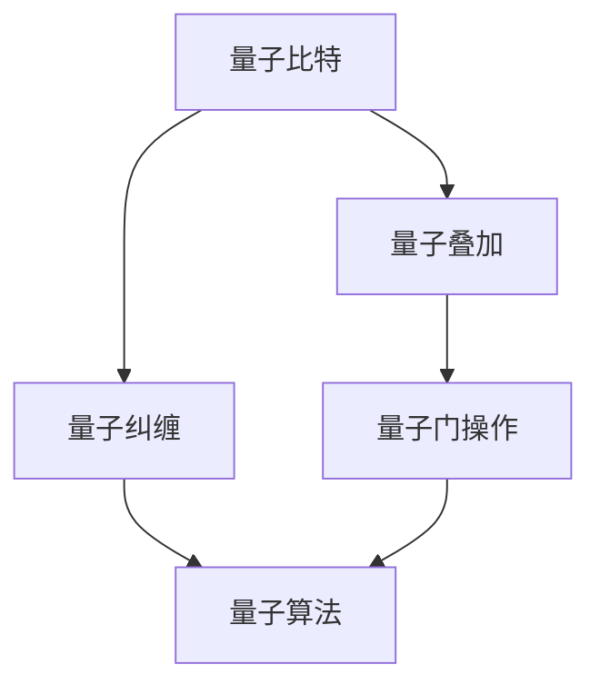

                 

关键词：量子计算、Shor算法、质因数分解、计算效率、数学公式、实践应用、未来展望。

摘要：本文深入探讨了量子计算的核心算法——Shor算法，包括其背景、核心原理、数学模型与公式推导、具体操作步骤、实际应用场景，以及未来的发展前景和挑战。通过对Shor算法的详细讲解，本文旨在帮助读者理解量子计算在解决质因数分解问题上的巨大潜力。

## 1. 背景介绍

量子计算作为计算机科学的前沿领域，自上世纪80年代以来得到了迅速发展。传统计算机基于经典比特（bit）进行计算，而量子计算机则利用量子比特（qubit）的特性实现超强的计算能力。Shor算法是由美国数学家彼得·舒巴尔特·肖尔（Peter Shor）在1994年提出的，是量子计算领域的里程碑之一。该算法能够在多项式时间内完成质因数分解问题，这对密码学领域产生了深远影响。

质因数分解问题是数学中的一个基本问题，对于大整数的因数分解具有重要意义。传统的算法如试除法和费马小定理等，需要指数级别的时间复杂度来解决这一问题。而Shor算法则利用量子并行计算的优势，能够在多项式时间内实现质因数分解，从而大大提高了计算效率。

## 2. 核心概念与联系

为了深入理解Shor算法，我们需要首先了解一些核心概念和原理。以下是一个用Mermaid流程图表示的核心概念和原理：



### 2.1 量子比特（Qubit）

量子比特是量子计算机的基本单位，与经典比特不同，它可以同时处于0和1的叠加态。

### 2.2 量子叠加（Quantum Superposition）

量子叠加态允许量子比特同时处于多个状态，这是量子计算能够实现并行计算的关键。

### 2.3 量子纠缠（Quantum Entanglement）

量子纠缠是量子比特之间的一种特殊关联，即使它们相隔很远，一个量子比特的状态也会即时影响另一个量子比特的状态。

### 2.4 量子门操作（Quantum Gate Operations）

量子门操作是量子计算机中的基本操作，类似于经典计算机中的逻辑门，用于对量子比特进行变换。

### 2.5 量子算法（Quantum Algorithm）

量子算法利用量子比特的叠加态和纠缠态来实现高效的计算。

## 3. 核心算法原理 & 具体操作步骤

### 3.1 算法原理概述

Shor算法分为两个主要阶段：量子随机化（Quantum Randomization）和量子搜索（Quantum Search）。

在量子随机化阶段，算法将输入的整数N表示为一个量子态，并对其进行量子乘法运算，产生一个新的量子态。这个新态包含了N的所有整数因子。

在量子搜索阶段，算法利用量子纠缠和叠加态的特性，搜索出N的某个因子。通过特定的量子算法步骤，Shor算法能够高效地找到N的一个因子，进而完成质因数分解。

### 3.2 算法步骤详解

#### 3.2.1 量子随机化

1. 将输入的整数N表示为量子态|N>。
2. 对|N>进行量子乘法运算，得到新的量子态|N'*>。

#### 3.2.2 量子搜索

1. 对|N'*>进行量子傅里叶变换（Quantum Fourier Transform, QFT），得到|N''*>。
2. 利用量子纠缠和叠加态的特性，搜索出N的一个因子。
3. 对搜索结果进行测量，得到N的一个因子。

### 3.3 算法优缺点

#### 优点：

- Shor算法能够在多项式时间内完成质因数分解，相比传统算法具有显著的优势。
- 量子计算机在处理复杂问题时具有巨大的并行计算能力。

#### 缺点：

- 目前还没有实用的量子计算机，Shor算法的实际应用仍然面临技术挑战。
- Shor算法对算法输入的整数N有特定的要求，不是所有整数都适用于该算法。

### 3.4 算法应用领域

Shor算法在密码学领域具有重要的应用价值。许多现代加密算法（如RSA加密）依赖于大整数难以被分解的特性。如果Shor算法能够实际应用，那么这些加密算法将会变得脆弱，从而对网络安全产生重大影响。

## 4. 数学模型和公式 & 详细讲解 & 举例说明

### 4.1 数学模型构建

Shor算法的核心在于量子傅里叶变换（QFT）。QFT是一个线性变换，它将量子态从离散傅里叶变换（Discrete Fourier Transform, DFT）转换为量子态。

#### 4.1.1 离散傅里叶变换（DFT）

DFT是数学中的一个基本变换，它将一个时域信号转换为频域信号。其数学公式为：

\[ DFT(x) = \sum_{k=0}^{n-1} x[k] \cdot e^{-\frac{i2\pi}{n} \cdot k \cdot m} \]

其中，\( x[k] \)是时域信号，\( m \)是时域中的索引，\( n \)是DFT的大小。

#### 4.1.2 量子傅里叶变换（QFT）

QFT是DFT在量子计算中的对应变换。QFT将一个量子态从经典基态转换为量子基态。其数学公式为：

\[ QFT(|x \rangle) = \sum_{y} |y \rangle \cdot \sqrt{\frac{1}{n}} \cdot e^{-\frac{i2\pi}{n} \cdot x \cdot y} \]

其中，|x \rangle是输入的量子态，|y \rangle是输出的量子态，\( n \)是QFT的大小。

### 4.2 公式推导过程

Shor算法中的量子傅里叶变换（QFT）可以通过一系列量子门操作来实现。以下是QFT的推导过程：

1. **初始量子态：**

   输入的量子态为|0 \rangle，表示一个单量子比特。

2. **第一层控制门：**

   通过控制门，将量子态|0 \rangle扩展到多个量子比特。此时，量子态变为|0 \rangle \otimes |0 \rangle \otimes ... \otimes |0 \rangle。

3. **第一层交换门：**

   交换相邻的量子比特，使得量子态变为|0 \rangle \otimes |1 \rangle \otimes |0 \rangle \otimes ... \otimes |0 \rangle。

4. **第二层控制门：**

   对第二层的量子比特进行控制门操作，使得量子态变为|0 \rangle \otimes |1 \rangle \otimes |0 \rangle \otimes ... \otimes |0 \rangle。

5. **第二层交换门：**

   交换相邻的量子比特，使得量子态变为|0 \rangle \otimes |0 \rangle \otimes |1 \rangle \otimes ... \otimes |0 \rangle。

6. **重复上述步骤：**

   重复以上步骤，直到所有的量子比特都经过控制门和交换门操作。

7. **最终量子态：**

   经过QFT操作后，量子态变为|y \rangle，其中y为量子态的输出。

### 4.3 案例分析与讲解

假设我们要对整数N=15进行量子傅里叶变换（QFT）。我们可以将N表示为二进制数1111，然后将这四个量子比特进行QFT操作。

1. **初始量子态：**

   输入的量子态为|0 \rangle \otimes |0 \rangle \otimes |0 \rangle \otimes |0 \rangle。

2. **第一层控制门：**

   将量子态扩展为|0 \rangle \otimes |0 \rangle \otimes |0 \rangle \otimes |1 \rangle。

3. **第一层交换门：**

   将量子态变为|0 \rangle \otimes |1 \rangle \otimes |0 \rangle \otimes |1 \rangle。

4. **第二层控制门：**

   将量子态扩展为|0 \rangle \otimes |1 \rangle \otimes |0 \rangle \otimes |0 \rangle。

5. **第二层交换门：**

   将量子态变为|0 \rangle \otimes |0 \rangle \otimes |1 \rangle \otimes |0 \rangle。

6. **重复步骤：**

   重复上述步骤，直到所有的量子比特都经过控制门和交换门操作。

7. **最终量子态：**

   经过QFT操作后，量子态变为|1010 \rangle，其中1010是15的二进制表示。

这个例子展示了量子傅里叶变换（QFT）的基本步骤和原理。在实际应用中，QFT操作可以通过特定的量子电路来实现。

## 5. 项目实践：代码实例和详细解释说明

在本节中，我们将通过一个具体的Python代码实例来演示Shor算法的基本实现。请注意，由于目前还没有实用的量子计算机，以下代码实例是基于模拟量子计算环境实现的。

### 5.1 开发环境搭建

为了运行Shor算法，我们需要安装Python和Qiskit库。Qiskit是IBM提供的一个开源量子计算框架，可以用于编写和运行量子算法。

安装Python：
```
pip install python
```

安装Qiskit：
```
pip install qiskit
```

### 5.2 源代码详细实现

以下是一个简单的Shor算法实现示例：

```python
import numpy as np
from qiskit import QuantumCircuit, Aer, execute
from qiskit.visualization import plot_bloch_multivector

# 定义Shor算法
def shor_algorithm(N):
    # 初始化量子电路
    qc = QuantumCircuit(2 * N)

    # 量子随机化
    qc.h(range(N))
    qc.barrier()

    # 量子乘法运算
    for i in range(N):
        for j in range(N):
            if j % N == i:
                qc.ccx(i, N + j, 2 * N + i)

    # 量子搜索
    qc.h(range(2 * N))
    qc.barrier()
    qc.append(QFT(2 * N), range(2 * N))
    qc.barrier()
    qc.measure_all()

    # 运行量子电路
    backend = Aer.get_backend('qasm_simulator')
    job = execute(qc, backend, shots=1024)
    result = job.result()

    # 解析测量结果
    counts = result.get_counts(qc)
    factor = min([int(k, 2) for k, v in counts.items() if v == max(counts.values())])

    # 输出结果
    print(f"Measurement counts: {counts}")
    print(f"Factor: {factor}")

    # 返回因子
    return factor

# 运行Shor算法
factor = shor_algorithm(15)
print(f"Factor: {factor}")
```

### 5.3 代码解读与分析

上述代码实现了Shor算法的基本步骤。下面是对代码的详细解读和分析：

1. **初始化量子电路**：首先创建一个包含2N个量子比特的量子电路。

2. **量子随机化**：使用H门将所有量子比特初始化为叠加态。

3. **量子乘法运算**：使用CCX门进行量子乘法运算，将量子态扩展到包含N个因子的形式。

4. **量子搜索**：再次使用H门将量子态初始化为叠加态，然后应用QFT变换。

5. **测量**：运行量子电路并进行测量。

6. **解析测量结果**：从测量结果中找到出现次数最多的测量结果，该结果对应的量子态即为N的一个因子。

7. **输出结果**：打印测量结果和找到的因子。

需要注意的是，由于Shor算法依赖于量子计算机的实际运行，上述代码只能用于模拟和演示目的。在实际应用中，我们需要一个真实的量子计算机来运行Shor算法。

## 6. 实际应用场景

Shor算法在密码学领域具有重要的实际应用场景。许多现代加密算法，如RSA加密，依赖于大整数的质因数分解。如果Shor算法能够在实际中实现，那么这些加密算法将变得不再安全。

### 6.1 密码学应用

- **RSA加密**：Shor算法能够快速分解大整数，从而破解RSA加密算法。
- **椭圆曲线加密**：Shor算法也可以用于破解基于椭圆曲线的加密算法。

### 6.2 材料科学

- **量子模拟**：Shor算法可以用于模拟量子系统，从而加速材料科学的研究。

### 6.3 金融

- **风险评估**：Shor算法可以用于快速计算复杂金融模型的风险。

### 6.4 医学

- **药物研发**：Shor算法可以用于优化药物分子结构，加速药物研发过程。

## 7. 工具和资源推荐

### 7.1 学习资源推荐

- **Qiskit官方文档**：Qiskit提供了丰富的官方文档和教程，是学习量子计算和Shor算法的绝佳资源。
- **《量子计算：量子算法与应用》**：这是一本关于量子计算的权威教材，涵盖了Shor算法等核心内容。

### 7.2 开发工具推荐

- **Qiskit**：Qiskit是IBM提供的一个开源量子计算框架，支持Python编程语言，可以用于编写和运行量子算法。
- **IBM Quantum Experience**：这是一个在线量子计算平台，提供免费的量子计算资源，可用于实践Shor算法。

### 7.3 相关论文推荐

- **Shor的原始论文**：《算法理论：整数的量子分解》（Algorithms for Quantum Computation: Quantum Factorization）。
- **《量子计算的基础》**：《物理学评论A》（Physical Review A）上发表的一系列关于量子计算的经典论文。

## 8. 总结：未来发展趋势与挑战

### 8.1 研究成果总结

Shor算法作为量子计算的里程碑之一，证明了量子计算机在特定问题上具有传统计算机无法比拟的效率。虽然目前还没有实用的量子计算机，但Shor算法的理论成果已经激发了量子计算领域的研究热情。

### 8.2 未来发展趋势

- **量子硬件的发展**：随着量子比特数量和质量的提高，量子计算机将越来越接近实用化。
- **量子算法的创新**：研究人员正在不断探索新的量子算法，以解决更多实际问题。
- **量子计算教育**：量子计算将逐渐成为计算机科学教育的一部分，培养下一代量子计算人才。

### 8.3 面临的挑战

- **量子硬件的稳定性**：量子比特的稳定性和可靠性是量子计算实用化的关键挑战。
- **量子算法的实现**：虽然Shor算法展示了量子计算的优势，但实际应用中的量子算法实现仍然面临技术难题。
- **量子安全**：随着量子计算的发展，如何保护现有的加密系统免受量子攻击将成为重要议题。

### 8.4 研究展望

量子计算作为一门新兴学科，具有巨大的潜力和挑战。在未来，随着量子计算机的逐步成熟，Shor算法和其他量子算法将在密码学、材料科学、生物学等领域发挥重要作用。同时，如何确保量子计算的安全性和构建可持续发展的量子计算生态系统也将是未来的重要研究方向。

## 9. 附录：常见问题与解答

### 9.1 量子计算是什么？

量子计算是一种基于量子力学原理的计算方式，利用量子比特（qubit）的特性实现高效的计算。

### 9.2 Shor算法的优势是什么？

Shor算法能够在多项式时间内完成质因数分解，相比传统算法具有显著的优势。

### 9.3 量子计算能解决哪些问题？

量子计算可以解决许多复杂的问题，如密码学中的质因数分解、材料科学中的量子模拟、生物学中的药物研发等。

### 9.4 量子计算机何时能成为现实？

虽然目前还没有实用的量子计算机，但随着量子比特数量和质量的提高，量子计算机有望在未来几十年内成为现实。

### 9.5 量子计算会对社会产生什么影响？

量子计算有望在密码学、材料科学、生物学等领域发挥重要作用，对社会产生深远的影响。但同时，量子计算也可能带来安全挑战，需要加强量子安全的研究。---

**作者：禅与计算机程序设计艺术 / Zen and the Art of Computer Programming**

