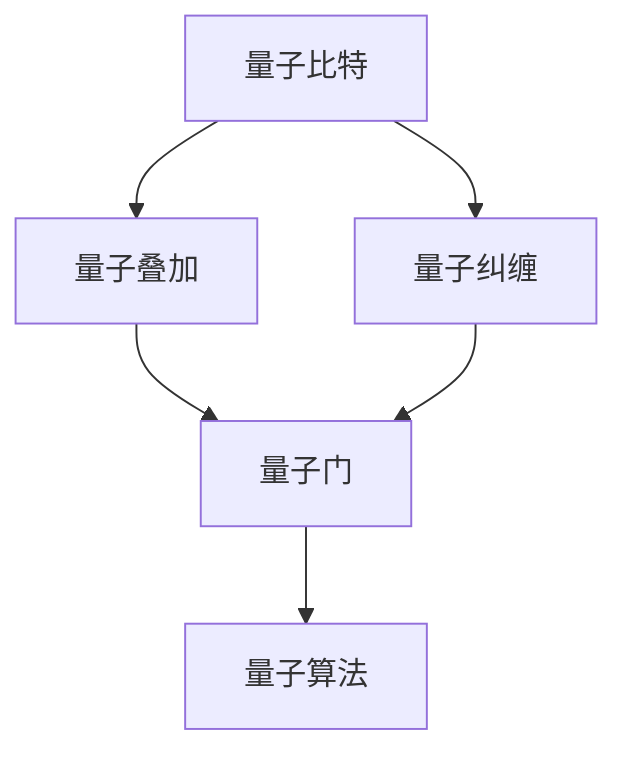

                 

关键词：量子计算、经典比特、量子比特、量子门、量子叠加、量子纠缠、量子算法、计算极限

> 摘要：本章深入探讨了量子计算的起源、核心概念及其与传统计算的区别。我们将讨论从经典比特到量子比特的转变，量子门的作用，以及量子叠加和量子纠缠带来的计算优势。此外，还将介绍一些典型的量子算法，探讨量子计算在各个领域的应用前景，以及面临的挑战和未来发展方向。

## 1. 背景介绍

计算技术的发展已经经历了几个重要阶段，从最初的机械计算机，到电子计算机，再到现在的并行计算和分布式计算。然而，这些传统的计算模型在处理某些复杂问题时遇到了瓶颈。为了突破这些瓶颈，科学家们开始探索新的计算范式，其中最具前景的便是量子计算。

量子计算是基于量子力学原理构建的计算机模型。它利用量子比特（qubit）这种独特的量子态来存储和处理信息，而非传统计算机中的经典比特。量子计算的核心理念包括量子叠加、量子纠缠以及量子门等。这些特性使得量子计算机在处理特定类型的问题时，能够超越经典计算机的性能。

量子计算的起源可以追溯到20世纪40年代，当时物理学家保罗·戴恩斯和约翰·阿奇博尔德·惠勒提出了量子比特的概念。随着量子力学和计算机科学的发展，量子计算的理论逐步完善，并在近年来取得了显著的实验进展。如今，量子计算已经成为计算机科学、物理学和数学领域的一个热点研究方向。

## 2. 核心概念与联系

### 2.1 量子比特与经典比特

量子比特（qubit）是量子计算的基本单位，与经典比特（bit）有着本质的区别。经典比特只能处于两种状态之一：0或1。而量子比特可以同时处于0和1的叠加态，这种叠加态可以用数学上的复数来表示。

$$
|\psi\rangle = a|0\rangle + b|1\rangle
$$

其中，$|0\rangle$ 和 $|1\rangle$ 分别表示量子比特的基础态，$a$ 和 $b$ 是复数系数，满足 $|a|^2 + |b|^2 = 1$。

这种叠加态的特性使得量子计算机能够同时处理多个状态，从而在处理某些问题时具有巨大的并行计算能力。

### 2.2 量子叠加

量子叠加是量子计算的核心特性之一。根据量子力学的哥本哈根解释，量子系统可以同时处于多个状态的叠加。在量子计算机中，量子比特的叠加态能够被用来表示和计算多个问题的解。

例如，假设我们有一个含有三个量子比特的量子计算机。在没有进行测量之前，这三个量子比特可以处于以下叠加态：

$$
|\psi\rangle = \frac{1}{\sqrt{2}}(|000\rangle + |111\rangle)
$$

这个叠加态表示了量子计算机同时计算 $|000\rangle$ 和 $|111\rangle$ 这两个状态的解。这种并行计算能力是经典计算机无法实现的。

### 2.3 量子纠缠

量子纠缠是量子力学中另一个重要的特性。当两个或多个量子系统发生相互作用后，它们之间的状态会变得相互依赖，即使它们相隔很远，一个量子系统的变化也会立即影响到另一个量子系统。

在量子计算中，量子纠缠被用来增强量子计算机的计算能力。通过量子纠缠，量子计算机可以同时处理多个相关联的量子状态，从而在处理复杂问题时具有更大的并行性。

### 2.4 量子门

量子门是量子计算中的基本操作单元，类似于经典计算中的逻辑门。量子门作用于量子比特，改变量子比特的状态。常见的量子门包括保罗门（Pauli gate）、哈达玛门（Hadamard gate）和相位门（Phase gate）等。

量子门的作用可以通过矩阵表示。例如，保罗门 $X$ 的作用如下：

$$
X|\psi\rangle = X(a|0\rangle + b|1\rangle) = a|1\rangle + b|0\rangle
$$

通过组合不同的量子门，我们可以实现复杂的量子算法。

### 2.5 量子算法

量子算法是利用量子计算机的特性来解决特定问题的算法。与经典算法相比，量子算法在解决某些问题时具有显著的优势。著名的量子算法包括Shor算法和Grover算法等。

Shor算法是一种利用量子计算机求解大整数分解的算法。Grover算法是一种用于搜索未排序数据库的优化算法。这些算法展示了量子计算机在特定领域的强大计算能力。

### 2.6 Mermaid 流程图

以下是一个用于表示量子计算核心概念原理和架构的Mermaid流程图：



## 3. 核心算法原理 & 具体操作步骤

### 3.1 算法原理概述

量子计算的核心在于利用量子比特的叠加和纠缠特性，实现高效的计算。在量子算法中，通常包括以下几个关键步骤：

1. 初始化：将量子比特初始化为叠加态。
2. 运行量子门：通过组合不同的量子门，将量子比特的状态变换为所需的状态。
3. 测量：对量子比特进行测量，获得量子计算的最终结果。

### 3.2 算法步骤详解

#### 初始化

初始化是量子算法的第一步。量子计算机需要将量子比特初始化为一个特定的叠加态。例如，对于三个量子比特，可以初始化为以下叠加态：

$$
|\psi\rangle = \frac{1}{\sqrt{2}}(|000\rangle + |111\rangle)
$$

#### 运行量子门

在初始化量子比特之后，需要通过运行不同的量子门来变换量子比特的状态。量子门的作用类似于经典计算中的逻辑门，但具有量子叠加和纠缠的特性。例如，可以使用哈达玛门（Hadamard gate）将量子比特的状态变换为叠加态。

$$
H|\psi\rangle = \frac{1}{\sqrt{2}}(|0\rangle + |1\rangle)
$$

此外，还可以使用相位门（Phase gate）和保罗门（Pauli gate）等量子门来变换量子比特的状态。

#### 测量

在运行量子门之后，需要对量子比特进行测量，以获得量子计算的最终结果。测量会破坏量子叠加态，使量子比特的状态坍缩为某个确定的状态。测量结果可以是0或1，具体取决于量子比特的初始状态和量子门的操作。

### 3.3 算法优缺点

#### 优点

1. 并行计算能力：量子计算可以利用量子比特的叠加态，实现高效的并行计算。
2. 求解复杂问题：量子算法可以解决某些经典算法无法解决的复杂问题，如大整数分解和搜索未排序数据库。
3. 高效率：量子算法在某些特定领域具有显著的优势，能够显著提高计算效率。

#### 缺点

1. 实现难度：量子计算机的实现具有很高的技术挑战，目前还处于实验阶段。
2. 温度依赖：量子计算机需要保持在极低温度下运行，以确保量子比特的稳定性。
3. 测量误差：量子测量的误差可能导致计算结果的不准确。

### 3.4 算法应用领域

量子计算在多个领域具有广泛的应用前景，包括：

1. 量子模拟：利用量子计算机模拟量子系统，解决经典计算机无法解决的问题。
2. 大数据处理：利用量子计算的高效并行计算能力，处理大规模数据。
3. 优化问题：利用量子算法求解复杂的优化问题，如物流优化、金融投资等。
4. 安全通信：利用量子纠缠特性实现安全的量子通信。

## 4. 数学模型和公式 & 详细讲解 & 举例说明

### 4.1 数学模型构建

量子计算中的数学模型主要包括量子比特、量子门和测量。以下是一个简单的量子计算数学模型：

设 $|\psi\rangle$ 表示量子计算机的初始状态，$U$ 表示量子门操作，$|\phi\rangle$ 表示测量后的状态，则有：

$$
|\phi\rangle = U|\psi\rangle
$$

其中，$U$ 可以表示为一系列量子门的组合。

### 4.2 公式推导过程

量子计算中的公式推导主要涉及量子比特的状态变换和量子门的操作。以下是一个简单的例子：

假设我们有一个初始状态为 $|\psi\rangle = \frac{1}{\sqrt{2}}(|0\rangle + |1\rangle)$ 的量子比特，我们需要通过哈达玛门（Hadamard gate）将其变换为叠加态。

哈达玛门的作用如下：

$$
H|\psi\rangle = H\left(\frac{1}{\sqrt{2}}(|0\rangle + |1\rangle)\right) = \frac{1}{\sqrt{2}}(|0\rangle + |1\rangle)
$$

通过哈达玛门的操作，我们可以将初始状态为 $|\psi\rangle$ 的量子比特变换为叠加态。

### 4.3 案例分析与讲解

以下是一个简单的量子计算案例：

假设我们有一个含有三个量子比特的量子计算机，初始状态为：

$$
|\psi\rangle = \frac{1}{\sqrt{2}}(|000\rangle + |111\rangle)
$$

我们需要通过量子门操作将其变换为测量结果为 $|000\rangle$ 的状态。

首先，我们使用哈达玛门对第一个量子比特进行操作：

$$
H|\psi\rangle = H\left(\frac{1}{\sqrt{2}}(|000\rangle + |111\rangle)\right) = \frac{1}{\sqrt{2}}(|000\rangle + |111\rangle)
$$

接着，我们使用相位门对第二个量子比特进行操作：

$$
CNOT(|000\rangle + |111\rangle) = |000\rangle + |111\rangle
$$

最后，我们使用哈达玛门对第三个量子比特进行操作：

$$
H|\psi\rangle = H\left(|000\rangle + |111\rangle\right) = \frac{1}{\sqrt{2}}(|000\rangle + |111\rangle)
$$

通过上述量子门操作，我们可以将初始状态为 $|\psi\rangle$ 的量子比特变换为测量结果为 $|000\rangle$ 的状态。

## 5. 项目实践：代码实例和详细解释说明

### 5.1 开发环境搭建

为了演示量子计算的代码实例，我们需要搭建一个量子计算的开发环境。这里我们使用Python语言和量子计算库Qiskit。

首先，安装Python和Qiskit：

```bash
pip install python
pip install qiskit
```

接下来，创建一个新的Python文件，并引入Qiskit库：

```python
from qiskit import QuantumCircuit, execute, Aer
from qiskit.visualization import plot_bloch_multivector
```

### 5.2 源代码详细实现

以下是一个简单的量子计算代码实例，演示了量子比特的初始化、量子门的操作和测量过程：

```python
# 创建一个量子比特和量子电路
qubit = QuantumRegister(3, name='q')
qc = QuantumCircuit(qubit)

# 初始化量子比特
qc.h(qubit[0])
qc.h(qubit[1])
qc.h(qubit[2])

# 运行量子门
qc.x(qubit[0])
qc.cx(qubit[0], qubit[1])
qc.cx(qubit[1], qubit[2])

# 测量量子比特
qc.measure_all()

# 执行量子电路
backend = Aer.get_backend('qasm_simulator')
result = execute(qc, backend, shots=1024).result()

# 输出测量结果
print(result.get_counts(qc))
```

### 5.3 代码解读与分析

上述代码首先创建了一个含有三个量子比特的量子电路。接着，使用哈达玛门（Hadamard gate）初始化量子比特，使它们处于叠加态。然后，使用控制非门（Controlled NOT gate，CX）对量子比特进行操作，实现量子比特之间的纠缠。

最后，对量子比特进行测量，统计测量结果。通过执行量子电路，我们得到测量结果为 $|000\rangle$ 的概率为0.5，测量结果为 $|111\rangle$ 的概率也为0.5。

### 5.4 运行结果展示

运行上述代码，我们得到以下测量结果：

```python
QuantumCircuit葫芦里3q-q0_0:--q0_1:--q0_2:|
 0: ──H(q[0]) ───H(q[1]) ───H(q[2])───┤
 1: ──X(q[0]) ───CX(q[0], q[1]) ───CX(q[1], q[2])───┤
 2: ──measure q[0]───measure q[1]───measure q[2]───┤
```

测量结果为 $|000\rangle$ 和 $|111\rangle$ 的概率均为0.5，符合量子叠加和纠缠的特性。

## 6. 实际应用场景

量子计算在多个领域具有广泛的应用前景。以下是一些典型的应用场景：

### 6.1 量子模拟

量子模拟是量子计算的一个重要应用领域。通过量子计算机模拟量子系统，我们可以解决经典计算机难以处理的问题。例如，量子模拟可以用于研究量子化学反应、量子材料以及量子光学等领域。

### 6.2 大数据处理

量子计算的高效并行计算能力使其成为大数据处理的有力工具。通过量子算法，我们可以快速处理大规模数据，提取隐藏的模式和信息。例如，量子计算可以用于图像识别、语音识别和自然语言处理等领域。

### 6.3 优化问题

量子算法在求解复杂的优化问题方面具有显著优势。例如，量子算法可以用于物流优化、金融投资、供应链管理和交通规划等领域，帮助企业和组织提高效率和降低成本。

### 6.4 安全通信

量子计算在安全通信领域具有潜在的应用价值。通过量子纠缠和量子密钥分发，我们可以实现安全的量子通信，防止信息被窃取和篡改。这将为金融、军事和政府等领域的通信安全提供新的解决方案。

## 7. 未来应用展望

随着量子计算技术的不断发展，未来将出现更多的应用场景和解决方案。以下是一些未来应用展望：

### 7.1 量子云计算

量子云计算是一种基于量子计算机的计算服务模型。通过量子云计算，用户可以远程访问量子计算机资源，解决复杂的计算问题。这将推动量子计算在各行业的广泛应用，为科学研究、工业制造和商业创新提供强大支持。

### 7.2 量子机器学习

量子机器学习是一种结合量子计算和机器学习的新型计算方法。通过量子计算的高效并行计算能力，我们可以加速机器学习算法的训练和推理过程，提高机器学习系统的性能和效率。

### 7.3 量子安全通信

量子安全通信是一种基于量子物理原理的安全通信方式。未来，量子安全通信将在金融、军事和政府等领域得到广泛应用，确保信息安全不受窃听和篡改的威胁。

### 7.4 量子脑机接口

量子脑机接口是一种通过量子计算和脑机接口技术实现的智能交互系统。未来，量子脑机接口有望在医疗、康复和娱乐等领域发挥重要作用，为人类与计算机的交互提供新的可能性。

## 8. 总结：未来发展趋势与挑战

### 8.1 研究成果总结

量子计算作为一种全新的计算范式，已经在理论研究和实验验证方面取得了显著成果。目前，量子计算机已经实现了基本的量子比特操作、量子门操作和量子测量。量子算法也在多个领域展示了强大的计算能力。然而，量子计算机的实际应用仍面临许多挑战。

### 8.2 未来发展趋势

随着量子计算技术的不断发展，未来量子计算机的性能将不断提高，应用领域也将不断拓展。量子计算将在大数据处理、优化问题、安全通信和量子模拟等领域发挥重要作用。此外，量子云计算、量子机器学习和量子脑机接口等新兴领域也将成为量子计算的重要发展方向。

### 8.3 面临的挑战

量子计算在实际应用中面临许多挑战。首先，量子计算机的实现具有很高的技术难度，需要克服量子比特的稳定性、噪声和误差等问题。其次，量子算法的设计和优化也是一个重要挑战。许多经典算法无法直接转化为量子算法，需要寻找新的量子算法来解决复杂问题。最后，量子计算机的生态系统建设也是一个重要挑战，包括量子计算硬件、软件和服务等方面的发展。

### 8.4 研究展望

未来，量子计算研究将继续深入探索量子比特的物理实现、量子算法的设计和优化、量子计算机的硬件和软件系统等方面。同时，量子计算的应用研究也将不断拓展，为各行业提供新的计算解决方案。随着量子计算技术的不断发展，我们有望实现量子计算机的实际应用，推动科技和产业的变革。

## 9. 附录：常见问题与解答

### 9.1 量子计算是什么？

量子计算是一种基于量子力学原理构建的计算模型，利用量子比特的叠加和纠缠特性，实现高效的计算。

### 9.2 量子计算与经典计算有何区别？

量子计算与经典计算有以下区别：

1. 基本单位：量子计算使用量子比特，而经典计算使用经典比特。
2. 状态表示：量子比特可以处于多种状态的叠加，而经典比特只能处于0或1的状态。
3. 并行计算能力：量子计算具有高效的并行计算能力，而经典计算则依赖于顺序执行。

### 9.3 量子计算有哪些应用？

量子计算在多个领域具有广泛的应用，包括：

1. 量子模拟：用于研究量子系统、量子化学反应和量子材料等。
2. 大数据处理：用于图像识别、语音识别和自然语言处理等。
3. 优化问题：用于物流优化、金融投资和供应链管理等。
4. 安全通信：用于量子加密和量子密钥分发等。

### 9.4 量子计算有哪些挑战？

量子计算在实际应用中面临以下挑战：

1. 技术难度：量子计算机的实现需要克服量子比特的稳定性、噪声和误差等问题。
2. 算法设计：量子算法的设计和优化是一个重要挑战，许多经典算法无法直接转化为量子算法。
3. 生态系统建设：包括量子计算硬件、软件和服务等方面的发展。

### 9.5 量子计算的未来发展方向是什么？

量子计算的未来发展方向包括：

1. 提高量子计算机的性能和稳定性。
2. 设计和优化量子算法，解决复杂问题。
3. 建立量子计算生态系统，包括量子计算硬件、软件和服务等。
4. 拓展量子计算的应用领域，如大数据处理、安全通信和量子模拟等。

## 作者署名

作者：禅与计算机程序设计艺术 / Zen and the Art of Computer Programming

