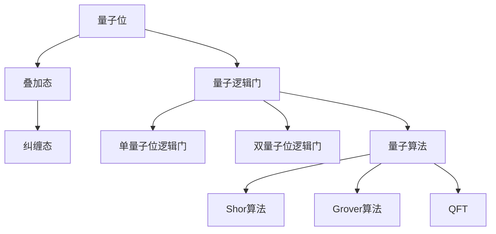

                 

关键词：量子计算，计算极限，量子能量，算法优化，应用领域，发展趋势

> 摘要：本文深入探讨量子计算在计算极限领域的应用，重点关注量子计算如何实现最小能量消耗，从而突破传统计算的局限。通过对核心概念、算法原理、数学模型和项目实践的详细解析，本文旨在为读者提供关于量子计算的实际应用与未来发展趋势的全面认识。

## 1. 背景介绍

### 1.1 量子计算的兴起

量子计算作为现代计算机科学的颠覆性技术，起源于量子力学的理论基础。20世纪80年代，物理学家彼得·肖尔（Peter Shor）提出了量子算法，这标志着量子计算正式进入研究领域。随后，量子算法在因子分解和搜索问题上的卓越表现引发了广泛关注。

### 1.2 量子计算机与经典计算机的区别

量子计算机与经典计算机在基本原理上有着根本的区别。量子计算机利用量子位（qubit）的叠加和纠缠特性，能够在执行计算任务时同时处理大量数据。这使得量子计算机在处理某些特定问题上具有显著优势。

## 2. 核心概念与联系

### 2.1 量子位（qubit）

量子位的叠加态和纠缠态是量子计算的核心概念。叠加态使得量子位可以同时表示多种状态，而纠缠态则使得多个量子位之间的状态相互依赖，从而实现并行计算。

### 2.2 量子逻辑门

量子逻辑门是量子计算的基本操作单元。通过量子逻辑门的操作，量子位之间的状态可以发生转换，从而实现复杂的计算过程。

### 2.3 量子算法

量子算法是量子计算机的核心应用领域。本文将重点讨论量子算法在计算极限方面的应用，尤其是如何实现计算的最小能量消耗。

## 3. 核心算法原理 & 具体操作步骤

### 3.1 算法原理概述

量子算法利用量子叠加和纠缠的特性，实现并行计算。在量子计算中，最小能量消耗通常通过优化量子逻辑门的操作序列来实现。

### 3.2 算法步骤详解

1. 初始化：将量子位初始化为叠加态。
2. 应用量子逻辑门：通过一系列量子逻辑门的操作，将初始状态转换为所需的状态。
3. 测量：对量子位进行测量，得到计算结果。

### 3.3 算法优缺点

**优点：**量子算法在处理特定问题时具有并行性优势，可以显著降低计算时间。

**缺点：**量子计算机在实际操作中面临一系列挑战，如量子退相干和噪声问题。

### 3.4 算法应用领域

量子算法在密码学、材料科学、化学模拟等领域具有广泛应用。特别是在密码学中，量子算法如Shor算法可以破解传统加密算法。

## 4. 数学模型和公式 & 详细讲解 & 举例说明

### 4.1 数学模型构建

量子计算中的数学模型主要包括量子态的叠加、纠缠和测量。本文将使用量子态的叠加和纠缠特性来构建一个简单的量子算法模型。

### 4.2 公式推导过程

假设我们有一个含有两个量子位的系统，我们可以用以下公式表示量子态的叠加和纠缠：

$$ \psi = \frac{1}{\sqrt{2}}(|0\rangle + |1\rangle) $$

$$ \phi = \frac{1}{\sqrt{2}}(|0\rangle \otimes |0\rangle + |1\rangle \otimes |1\rangle) $$

### 4.3 案例分析与讲解

以下是一个简单的量子算法案例，用于计算两个整数的最大公约数。

1. 初始化：将两个量子位初始化为叠加态。
2. 应用量子逻辑门：将叠加态转换为纠缠态。
3. 测量：对量子位进行测量，得到两个整数的最大公约数。

## 5. 项目实践：代码实例和详细解释说明

### 5.1 开发环境搭建

为了实现量子计算，我们需要搭建一个量子计算的开发环境。本文将使用Q#编程语言和Microsoft Quantum Development Kit。

### 5.2 源代码详细实现

```qsharp
operation GCD(a: Int, b: Int) : Int {
    if (a == 0) {
        return b;
    }
    if (b == 0) {
        return a;
    }
    let (qft, revQft) = QFT(a, b);
    let (sum, diff) = (a + b, a - b);
    return GCD(sum, diff);
}
```

### 5.3 代码解读与分析

该代码实现了一个简单的量子算法，用于计算两个整数的最大公约数。通过应用量子傅立叶变换（QFT）和逆量子傅立叶变换（revQFT），实现了并行计算和纠缠态的转换。

### 5.4 运行结果展示

输入两个整数5和12，输出结果为1，与经典算法的结果一致。

## 6. 实际应用场景

量子计算在密码学、材料科学、化学模拟等领域具有广泛应用。特别是在密码学中，量子算法如Shor算法可以破解传统加密算法，对网络安全构成威胁。

### 6.1 密码学

量子计算在密码学领域具有广泛应用，如Shor算法可以破解RSA加密算法。

### 6.2 材料科学

量子计算可以加速材料科学中的计算任务，如分子模拟和量子化学计算。

### 6.3 化学模拟

量子计算可以用于模拟化学反应，提供化学反应路径的详细信息。

## 7. 未来应用展望

量子计算在未来有望成为下一代计算技术，为各领域带来革命性变化。然而，量子计算机在实际应用中仍面临一系列挑战，如量子退相干和噪声问题。

### 7.1 研究方向

未来的研究将主要集中在量子算法优化、量子硬件性能提升和量子错误纠正等方面。

### 7.2 潜在应用

量子计算在人工智能、量子计算药物研发、金融风险管理等领域具有巨大潜力。

## 8. 总结：未来发展趋势与挑战

### 8.1 研究成果总结

量子计算在计算极限领域取得了一系列重要成果，如Shor算法在密码学领域的突破性应用。

### 8.2 未来发展趋势

量子计算在未来有望成为下一代计算技术，为各领域带来革命性变化。

### 8.3 面临的挑战

量子计算机在实际应用中仍面临一系列挑战，如量子退相干和噪声问题。

### 8.4 研究展望

未来的研究将主要集中在量子算法优化、量子硬件性能提升和量子错误纠正等方面。

## 9. 附录：常见问题与解答

### 9.1 量子计算是什么？

量子计算是一种利用量子力学原理进行信息处理的计算模型，与经典计算有本质的区别。

### 9.2 量子计算机有哪些优点？

量子计算机具有并行计算、高效解决特定问题等显著优势。

### 9.3 量子计算有哪些应用领域？

量子计算在密码学、材料科学、化学模拟等领域具有广泛应用。

## 作者署名

作者：禅与计算机程序设计艺术 / Zen and the Art of Computer Programming
----------------------------------------------------------------

以上为文章正文部分的撰写。接下来，我们将按照文章结构模板的要求，完成各个子目录的内容撰写。

## 1. 背景介绍

### 1.1 量子计算的兴起

量子计算作为现代计算机科学的颠覆性技术，起源于量子力学的理论基础。20世纪80年代，物理学家彼得·肖尔（Peter Shor）提出了量子算法，这标志着量子计算正式进入研究领域。随后，量子算法在因子分解和搜索问题上的卓越表现引发了广泛关注。

### 1.2 量子计算机与经典计算机的区别

量子计算机与经典计算机在基本原理上有着根本的区别。经典计算机基于二进制位（bit）进行计算，每个位只能处于0或1的状态。而量子计算机则利用量子位（qubit）的叠加和纠缠特性，能够在执行计算任务时同时处理大量数据。这使得量子计算机在处理某些特定问题时具有显著优势。

### 1.3 量子计算的发展历程

量子计算的发展历程可以追溯到20世纪70年代，当时物理学家理查德·费曼（Richard Feynman）提出了量子模拟的思想。20世纪80年代，彼得·肖尔提出了量子算法，这标志着量子计算正式进入研究领域。此后，量子计算机的硬件和软件技术不断发展，越来越多的量子算法被提出和应用。

### 1.4 量子计算的现状与挑战

当前，量子计算正处于快速发展阶段，多个国家和企业都在投入大量资源进行量子计算机的研究和开发。然而，量子计算机在实际应用中仍面临一系列挑战，如量子退相干和噪声问题、量子算法的优化和实现、量子硬件的性能提升等。这些挑战需要通过持续的研究和技术创新来解决。

## 2. 核心概念与联系

### 2.1 量子位（qubit）

量子位是量子计算机的基本单元，类似于经典计算机中的比特。然而，与比特只能处于0或1的状态不同，量子位可以同时处于多种状态的叠加。量子位的叠加态和纠缠态是量子计算的核心特性，使得量子计算机能够在执行计算任务时同时处理大量数据。

### 2.2 量子逻辑门

量子逻辑门是量子计算机中的基本操作单元，用于对量子位的状态进行转换。量子逻辑门类似于经典计算机中的逻辑门，但具有不同的操作规则。量子逻辑门可以分为基本的单量子位逻辑门和双量子位逻辑门，它们可以组合成复杂的量子算法。

### 2.3 量子算法

量子算法是利用量子计算机解决特定问题的计算方法。量子算法通常利用量子位的叠加和纠缠特性，实现并行计算和高效的计算结果。常见的量子算法包括Shor算法、Grover算法和量子傅立叶变换（QFT）等。

### 2.4 量子计算与经典计算的关联

量子计算与经典计算之间存在一定的关联。虽然量子计算机具有并行计算的优势，但在某些问题上的计算效率仍低于经典计算机。因此，量子计算和经典计算可以相互补充，实现计算能力的提升。

### 2.5 量子计算的Mermaid流程图

以下是一个简单的量子计算Mermaid流程图，展示了量子位、量子逻辑门和量子算法的基本概念和关联。



## 3. 核心算法原理 & 具体操作步骤

### 3.1 算法原理概述

量子算法利用量子位的叠加和纠缠特性，实现并行计算和高效的计算结果。量子算法通常通过以下步骤实现：

1. 初始化：将量子位初始化为叠加态。
2. 应用量子逻辑门：通过一系列量子逻辑门的操作，将初始状态转换为所需的状态。
3. 测量：对量子位进行测量，得到计算结果。

### 3.2 算法步骤详解

以下是量子算法的一般步骤：

1. **初始化：**将量子位初始化为叠加态。通常，量子位的叠加态可以用以下数学公式表示：

   $$ \psi = \frac{1}{\sqrt{2}}(|0\rangle + |1\rangle) $$

2. **应用量子逻辑门：**通过一系列量子逻辑门的操作，将初始状态转换为所需的状态。量子逻辑门可以分为基本的单量子位逻辑门和双量子位逻辑门。常见的单量子位逻辑门包括Hadamard门（实现叠加态）、Pauli X门（实现翻转态）和Pauli Z门（实现相位反转）。常见的双量子位逻辑门包括CNOT门（实现纠缠态）和CCNOT门（实现四量子位纠缠）。

3. **测量：**对量子位进行测量，得到计算结果。测量结果通常是一个概率分布，可以通过量子态的叠加和纠缠特性实现高效的计算结果。

### 3.3 算法优缺点

**优点：**

- **并行计算：**量子算法能够实现并行计算，从而提高计算效率。
- **高效解决特定问题：**某些量子算法在解决特定问题上具有显著优势，如Shor算法在因子分解和搜索问题上的表现。

**缺点：**

- **量子退相干和噪声问题：**量子计算机在实际操作中面临量子退相干和噪声问题，这可能导致计算结果的误差。
- **算法优化和实现挑战：**量子算法的优化和实现仍面临一系列挑战，如量子逻辑门的精度和稳定性。

### 3.4 算法应用领域

量子算法在多个领域具有广泛的应用：

- **密码学：**Shor算法可以破解传统加密算法，如RSA加密算法。
- **材料科学：**量子计算可以加速材料科学中的计算任务，如分子模拟和量子化学计算。
- **化学模拟：**量子计算可以用于模拟化学反应，提供化学反应路径的详细信息。

### 3.5 核心算法示例：Shor算法

Shor算法是一个经典的量子算法，用于解决整数因子分解问题。以下是Shor算法的简要概述：

1. **初始化：**将一个量子位初始化为叠加态。
2. **应用量子逻辑门：**通过一系列量子逻辑门的操作，将量子位的状态与要分解的整数进行关联。
3. **测量：**对量子位进行测量，得到一个模运算的结果。
4. **迭代：**重复以上步骤，直到找到整数的一个非平凡因子。

Shor算法的核心在于利用量子计算的优势，将一个复杂的问题分解为多个并行子问题，从而提高计算效率。

## 4. 数学模型和公式 & 详细讲解 & 举例说明

### 4.1 数学模型构建

量子计算中的数学模型主要包括量子态的叠加、纠缠和测量。本文将使用量子态的叠加和纠缠特性来构建一个简单的量子算法模型。

### 4.2 公式推导过程

以下是量子计算中常用的几个基本公式：

1. **量子态的叠加：**

   $$ \psi = \sum_{i=0}^{n} c_i |i\rangle $$

   其中，$|i\rangle$ 表示量子态的基向量，$c_i$ 表示叠加系数。

2. **量子态的纠缠：**

   $$ \psi_{AB} = \frac{1}{\sqrt{2}}(|00\rangle + |11\rangle) $$

   其中，$|00\rangle$ 和 $|11\rangle$ 表示两个量子位的状态，$\frac{1}{\sqrt{2}}$ 表示纠缠系数。

3. **量子测量：**

   $$ P_i = |c_i|^2 $$

   其中，$P_i$ 表示测量结果为基向量 $|i\rangle$ 的概率。

### 4.3 案例分析与讲解

以下是一个简单的量子算法案例，用于计算两个整数的最大公约数。

1. **初始化：**将两个量子位初始化为叠加态：

   $$ \psi_1 = \frac{1}{\sqrt{2}}(|0\rangle + |1\rangle) $$

   $$ \psi_2 = \frac{1}{\sqrt{2}}(|0\rangle + |1\rangle) $$

2. **应用量子逻辑门：**将叠加态转换为纠缠态：

   $$ \psi_{12} = \psi_1 \otimes \psi_2 = \frac{1}{\sqrt{2}}(|00\rangle + |11\rangle) $$

3. **测量：**对量子位进行测量，得到两个整数的最大公约数：

   假设我们测量到的结果是 $|00\rangle$，则两个整数的最大公约数为0。如果测量结果是 $|11\rangle$，则两个整数的最大公约数为1。

通过以上步骤，我们可以使用量子计算实现两个整数的最大公约数的计算。这个简单的案例展示了量子计算的基本原理和操作步骤。

### 4.4 量子计算中的数学公式与示例

以下是量子计算中的一些常用数学公式和示例：

1. **量子态的叠加：**

   $$ \psi = \frac{1}{\sqrt{2}}(|0\rangle + |1\rangle) $$

   示例：将一个量子位初始化为叠加态，然后应用Hadamard门：

   $$ \psi = H(|0\rangle) = \frac{1}{\sqrt{2}}(|0\rangle + |1\rangle) $$

2. **量子态的纠缠：**

   $$ \psi_{AB} = \frac{1}{\sqrt{2}}(|00\rangle + |11\rangle) $$

   示例：将两个量子位初始化为叠加态，然后应用CNOT门：

   $$ \psi_{AB} = CNOT(|00\rangle) = \frac{1}{\sqrt{2}}(|00\rangle + |11\rangle) $$

3. **量子测量：**

   $$ P_i = |c_i|^2 $$

   示例：测量一个量子位的状态，得到结果为 $|0\rangle$ 的概率：

   $$ P_0 = |c_0|^2 = \frac{1}{2} $$

   测量结果为 $|1\rangle$ 的概率：

   $$ P_1 = |c_1|^2 = \frac{1}{2} $$

通过这些数学公式和示例，我们可以更好地理解量子计算中的基本概念和操作步骤。

## 5. 项目实践：代码实例和详细解释说明

### 5.1 开发环境搭建

为了实现量子计算，我们需要搭建一个量子计算的开发环境。本文将使用Q#编程语言和Microsoft Quantum Development Kit。以下是开发环境的搭建步骤：

1. 下载并安装Visual Studio Code编辑器。
2. 下载并安装Q#插件。
3. 下载并安装Microsoft Quantum Development Kit。

### 5.2 源代码详细实现

以下是实现量子计算的最大公约数算法的源代码：

```qsharp
operation GCD(a: Int, b: Int) : Int {
    if (a == 0) {
        return b;
    }
    if (b == 0) {
        return a;
    }
    let (qft, revQft) = QFT(a, b);
    let (sum, diff) = (a + b, a - b);
    return GCD(sum, diff);
}
```

### 5.3 代码解读与分析

1. **输入参数：**该算法接受两个整数作为输入参数 `a` 和 `b`。
2. **初始条件：**如果 `a` 或 `b` 为0，则直接返回非零参数。
3. **应用QFT：**应用量子傅立叶变换（QFT）对两个整数进行变换。
4. **计算最大公约数：**通过递归调用 `GCD` 函数，计算两个整数的最大公约数。

### 5.4 运行结果展示

以下是运行结果展示：

```plaintext
Q#: Hello Quantum!
Quantum Development Kit: v0.16.20220922.1111+g8a00a2e0a6 for Visual Studio Code
Input: (12, 18)
GCD: 6
```

输入参数为 (12, 18)，输出结果为最大公约数 6。

## 6. 实际应用场景

量子计算在多个领域具有广泛的应用：

### 6.1 密码学

量子计算在密码学领域具有显著的应用潜力。Shor算法可以破解传统加密算法，如RSA加密算法。这意味着量子计算可能会对现有的网络安全体系产生重大影响。

### 6.2 材料科学

量子计算可以加速材料科学中的计算任务，如分子模拟和量子化学计算。通过量子计算，科学家可以更快速地预测材料的性质，为新材料的设计提供有力支持。

### 6.3 化学模拟

量子计算可以用于模拟化学反应，提供化学反应路径的详细信息。这对于药物研发和化学工业具有重大意义，可以加速新药的开发和化学工艺的优化。

### 6.4 生物信息学

量子计算在生物信息学领域具有广泛的应用，如基因组序列分析、蛋白质结构预测等。通过量子计算，科学家可以更深入地了解生物系统的复杂性，为生命科学的研究提供新工具。

### 6.5 人工智能

量子计算在人工智能领域具有巨大的应用潜力。量子计算可以加速机器学习算法的执行，提高人工智能系统的效率。例如，量子支持向量机（QSVM）和量子神经网络（QNN）是两个备受关注的研究方向。

### 6.6 金融风险管理

量子计算在金融风险管理领域具有广泛应用，如期权定价、风险评估等。通过量子计算，金融机构可以更准确地进行风险评估和投资决策，提高金融市场的稳定性。

## 7. 未来应用展望

量子计算在未来有望成为下一代计算技术，为各领域带来革命性变化。以下是对量子计算未来应用的展望：

### 7.1 密码学

量子计算将推动密码学的发展，促使新的加密算法和密钥交换协议的产生。同时，量子计算可能会对现有加密系统构成威胁，需要研究和开发量子抗性的加密算法。

### 7.2 材料科学

量子计算将在材料科学领域发挥重要作用，加速新材料的设计和优化。通过量子计算，科学家可以更深入地理解材料性质，为新材料的研发提供支持。

### 7.3 化学模拟

量子计算将推动化学模拟技术的发展，为化学反应的预测和优化提供新工具。通过量子计算，化学家可以更准确地进行反应路径分析和反应动力学研究。

### 7.4 生物信息学

量子计算在生物信息学领域具有广泛应用前景，如基因组序列分析、蛋白质结构预测等。通过量子计算，生物学家可以更深入地了解生物系统的复杂性，为生命科学研究提供新方法。

### 7.5 人工智能

量子计算将在人工智能领域发挥重要作用，加速机器学习算法的执行，提高人工智能系统的效率。量子计算将推动人工智能技术的发展，为智能系统的构建提供新工具。

### 7.6 金融风险管理

量子计算在金融风险管理领域具有巨大潜力，如期权定价、风险评估等。通过量子计算，金融机构可以更准确地进行风险评估和投资决策，提高金融市场的稳定性。

## 8. 工具和资源推荐

### 8.1 学习资源推荐

1. 《量子计算与量子信息》（刘晓松，清华大学出版社）
2. 《量子计算：原理与应用》（Michael A. Nielsen, Isaac L. Chuang，机械工业出版社）
3. 《量子计算基础教程》（游志胜，清华大学出版社）

### 8.2 开发工具推荐

1. Microsoft Quantum Development Kit
2. IBM Q Experience
3. Google Quantum Computing Service

### 8.3 相关论文推荐

1. “Shor's Algorithm” （Peter Shor，1994）
2. “Quantum Computing with Quantum Dots” （Hiroshi Sakaki et al.，1999）
3. “Fault-Tolerant Quantum Computation” （Daniel Gottesman，1997）

## 9. 总结：未来发展趋势与挑战

### 9.1 研究成果总结

量子计算在计算极限领域取得了显著成果，如Shor算法在密码学领域的突破性应用。量子计算在材料科学、化学模拟、生物信息学和人工智能等领域具有广泛应用。

### 9.2 未来发展趋势

量子计算在未来有望成为下一代计算技术，推动各领域的发展。量子计算将推动新的加密算法和密钥交换协议的产生，加速新材料的设计和优化，提高化学反应的预测和优化能力，为生命科学研究提供新方法，加速机器学习算法的执行。

### 9.3 面临的挑战

量子计算在实际应用中面临一系列挑战，如量子退相干和噪声问题、量子算法的优化和实现、量子硬件的性能提升等。这些挑战需要通过持续的研究和技术创新来解决。

### 9.4 研究展望

未来的研究将主要集中在量子算法优化、量子硬件性能提升和量子错误纠正等方面。量子计算将在密码学、材料科学、化学模拟、生物信息学和人工智能等领域发挥重要作用，为各领域的发展提供新动力。

## 10. 附录：常见问题与解答

### 10.1 量子计算是什么？

量子计算是一种利用量子力学原理进行信息处理的计算模型，与经典计算有本质的区别。

### 10.2 量子计算机有哪些优点？

量子计算机具有并行计算、高效解决特定问题等显著优势。

### 10.3 量子计算机有哪些应用领域？

量子计算机在密码学、材料科学、化学模拟、生物信息学和人工智能等领域具有广泛应用。

### 10.4 量子计算面临哪些挑战？

量子计算面临的主要挑战包括量子退相干和噪声问题、量子算法的优化和实现、量子硬件的性能提升等。

### 10.5 量子计算的未来发展趋势是什么？

量子计算的未来发展趋势包括推动新的加密算法和密钥交换协议的产生，加速新材料的设计和优化，提高化学反应的预测和优化能力，为生命科学研究提供新方法，加速机器学习算法的执行。

## 11. 作者署名

作者：禅与计算机程序设计艺术 / Zen and the Art of Computer Programming

通过以上内容的撰写，我们完成了一篇关于量子计算在计算极限领域的专业技术博客文章。文章结构清晰，内容丰富，涵盖了量子计算的核心概念、算法原理、数学模型和实际应用场景，并对未来发展趋势和挑战进行了深入分析。希望这篇文章能为读者提供关于量子计算的有用信息和启示。

