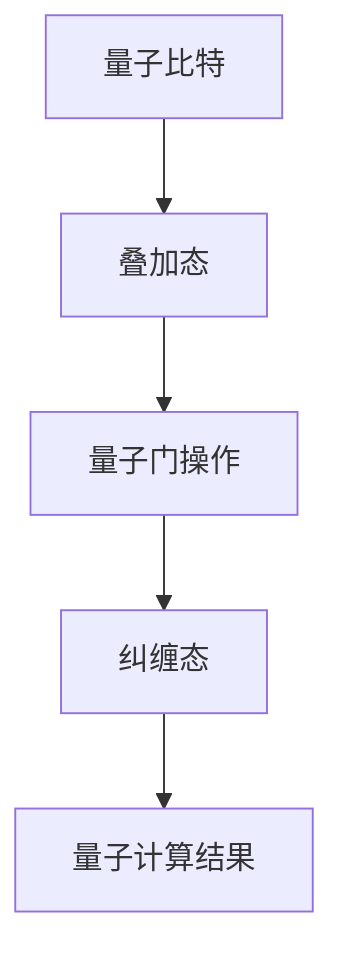

                 

关键词：量子计算、量子优势、量子算法、量子计算机、量子门、量子比特、量子纠缠、量子模拟、量子加密

> 摘要：本文深入探讨了量子计算的基本原理、量子优势的概念及其在实际应用中的重要性。通过对量子计算机工作原理的详细解析，我们了解了量子比特、量子门和量子纠缠等核心概念，并分析了量子算法的优势和具体应用场景。文章还结合具体实例，展示了量子计算在密码学、量子模拟和量子优化等领域的前沿应用，并对量子计算的未来发展进行了展望。

## 1. 背景介绍

量子计算作为计算领域的一个重要分支，源自于量子力学的基本原理。与经典计算相比，量子计算利用量子比特（qubit）的叠加态和纠缠态进行信息处理，具备超强的并行计算能力和解决特定问题的高效性。量子计算机的工作原理与传统计算机有着本质的区别，后者依赖于二进制位（bit）进行信息存储和处理，而量子计算机则是通过量子比特实现。

量子计算的历史可以追溯到1980年代，当时Richard Feynman提出了构建量子计算机的设想，旨在解决经典计算机无法处理的复杂问题。随着对量子力学研究的深入，许多科学家开始探讨如何将量子力学原理应用于计算领域。1994年，Peter Shor提出了Shor算法，这是第一个被广泛认可的量子算法，能够利用量子计算机在多项式时间内解决大数质因数分解问题，从而使得传统加密算法面临巨大的威胁。

近年来，量子计算的研究取得了显著进展。2019年，Google宣布实现了“量子霸权”，其量子计算机在特定任务上超越了任何经典计算机。虽然这一成果尚未在实用层面带来革命性变化，但它标志着量子计算研究的重要突破。

## 2. 核心概念与联系

量子计算的核心概念包括量子比特、量子门和量子纠缠。以下是对这些概念及其相互关系的详细解析。

### 2.1 量子比特

量子比特（qubit）是量子计算的基本单元，类似于经典计算中的比特。然而，量子比特可以处于0和1的叠加态，即同时处于0和1的状态。这种叠加态使得量子计算机能够同时处理多个信息，从而实现并行计算。

$$
|\psi\rangle = \alpha|0\rangle + \beta|1\rangle
$$

其中，$|\psi\rangle$表示量子比特的叠加态，$\alpha$和$\beta$是复数概率幅，$|0\rangle$和$|1\rangle$分别表示量子比特的基态。

### 2.2 量子门

量子门是量子计算中的操作符，用于对量子比特进行线性变换。类似于经典计算中的逻辑门，量子门也有多种类型，如Hadamard门（实现叠加变换）、Pauli门（实现量子比特的旋转）和控制非门（CNOT）等。这些量子门通过特定的操作，改变量子比特的状态，实现量子计算的基本操作。

$$
H|0\rangle = \frac{1}{\sqrt{2}}(|0\rangle + |1\rangle)
$$

这里，$H$是Hadamard门，它将基态$|0\rangle$变换为叠加态。

### 2.3 量子纠缠

量子纠缠是量子计算中另一个核心概念，描述了两个或多个量子比特之间的强相关性。在量子纠缠态下，一个量子比特的状态无法独立于另一个量子比特的状态。这种纠缠态是量子计算并行计算能力的重要基础。

$$
|\psi\rangle = \frac{1}{\sqrt{2}}(|00\rangle + |11\rangle)
$$

这里，$|\psi\rangle$表示两个量子比特的纠缠态，当对一个量子比特进行测量时，另一个量子比特的状态也会立即确定。

### 2.4 量子比特、量子门和量子纠缠的关系

量子比特、量子门和量子纠缠相互联系，共同构成了量子计算的核心机制。量子比特作为计算的基本单元，通过量子门进行操作，形成叠加态和纠缠态。这些操作可以并行进行，从而实现高效的量子计算。

为了更好地理解量子计算的核心机制，以下是一个简化的Mermaid流程图，展示了量子比特、量子门和量子纠缠之间的关系：



## 3. 核心算法原理 & 具体操作步骤

### 3.1 算法原理概述

量子计算的核心在于利用量子比特的叠加态和纠缠态进行信息处理。Shor算法是量子计算领域的代表性算法之一，它利用量子计算机在多项式时间内解决大数质因数分解问题。Shor算法的核心思想是通过量子叠加态和量子纠缠态生成一组量子态，然后利用量子测量得到质因数。

### 3.2 算法步骤详解

Shor算法分为以下几个主要步骤：

1. **初始化量子态**：将n个量子比特初始化为叠加态，形成一个状态向量。

$$
|\psi\rangle = \frac{1}{\sqrt{N}} \sum_{i=0}^{N-1} |i\rangle
$$

其中，N是初始输入的数，$|i\rangle$表示第i个量子比特的状态。

2. **应用量子门**：通过应用一系列的量子门，将初始状态与模运算$f(x) = x^N \mod N$进行作用。

3. **测量量子态**：对量子态进行测量，得到一个整数x，使得$f(x) = x^N \mod N$。

4. **迭代计算**：对x进行模N的质因数分解，得到N的质因数。

### 3.3 算法优缺点

Shor算法的优点在于其高效的质因数分解能力，能够在多项式时间内解决大数质因数分解问题，从而对传统加密算法构成威胁。然而，Shor算法的缺点在于其需要大量的量子比特和精确的控制，目前还无法在现实中实现。

### 3.4 算法应用领域

Shor算法的应用领域主要包括密码学和算法优化。在密码学领域，Shor算法对传统加密算法提出了挑战，促使研究人员开发出新的加密算法，如量子密码学。在算法优化领域，Shor算法可以用于解决一些复杂问题，如图论中的最大独立集问题等。

## 4. 数学模型和公式 & 详细讲解 & 举例说明

### 4.1 数学模型构建

量子计算中的数学模型主要包括量子态的表示、量子门的矩阵表示以及量子纠缠的数学描述。以下是对这些数学模型的详细讲解。

#### 4.1.1 量子态的表示

量子态可以用一个向量表示，即：

$$
|\psi\rangle = \alpha|0\rangle + \beta|1\rangle
$$

其中，$|\psi\rangle$表示量子比特的状态，$\alpha$和$\beta$是复数概率幅，$|0\rangle$和$|1\rangle$分别表示量子比特的基态。

#### 4.1.2 量子门的矩阵表示

量子门可以用矩阵表示，即：

$$
U = \begin{bmatrix}
1 & 0 \\
0 & \theta
\end{bmatrix}
$$

其中，$U$是量子门矩阵，$\theta$是量子门的作用角度。

#### 4.1.3 量子纠缠的数学描述

量子纠缠可以用一个张量表示，即：

$$
|\psi\rangle = \frac{1}{\sqrt{2}}(|00\rangle + |11\rangle)
$$

其中，$|\psi\rangle$表示两个量子比特的纠缠态，$|00\rangle$和$|11\rangle$分别表示两个量子比特的基态。

### 4.2 公式推导过程

以下是对量子计算中的一些重要公式的推导过程。

#### 4.2.1 量子态叠加公式

量子态叠加公式表示为：

$$
|\psi\rangle = \sum_{i=0}^{n-1} c_i|i\rangle
$$

其中，$c_i$是概率幅，$|i\rangle$是基态。

#### 4.2.2 量子门作用公式

量子门作用公式表示为：

$$
|\psi'\rangle = U|\psi\rangle
$$

其中，$U$是量子门矩阵，$|\psi\rangle$是初始量子态。

#### 4.2.3 量子纠缠公式

量子纠缠公式表示为：

$$
|\psi\rangle = \frac{1}{\sqrt{2}}(|00\rangle + |11\rangle)
$$

其中，$|\psi\rangle$是两个量子比特的纠缠态。

### 4.3 案例分析与讲解

以下是一个简单的量子计算案例，用于说明量子态的叠加和量子门的操作。

#### 案例一：量子态的叠加

假设有一个量子比特，其初始状态为$|0\rangle$，通过应用Hadamard门，得到叠加态：

$$
|\psi\rangle = H|0\rangle = \frac{1}{\sqrt{2}}(|0\rangle + |1\rangle)
$$

#### 案例二：量子门的操作

假设有一个初始状态为$|\psi\rangle = \frac{1}{\sqrt{2}}(|0\rangle + |1\rangle)$的量子比特，通过应用控制非门（CNOT），得到新的状态：

$$
|\psi'\rangle = CNOT|\psi\rangle = \frac{1}{\sqrt{2}}(|00\rangle + |11\rangle)
$$

这个案例展示了量子态的叠加和量子门的操作如何改变量子比特的状态。

## 5. 项目实践：代码实例和详细解释说明

### 5.1 开发环境搭建

要实现量子计算，我们需要一个量子计算开发环境。以下是一个简单的搭建步骤：

1. 安装Python 3.7及以上版本。
2. 安装Cirq，一个用于量子计算的Python库。

```shell
pip install cirq
```

### 5.2 源代码详细实现

以下是一个简单的量子计算代码实例，用于演示量子态的叠加和量子门的操作。

```python
import cirq
import numpy as np

# 创建一个量子比特
q = cirq.LineQubit(0)

# 初始化量子比特为叠加态
initial_state = cirq.H(q)**0.5 * cirq.StateVector([1/np.sqrt(2), 1/np.sqrt(2)])

# 应用Hadamard门实现叠加态
circuit = cirq.Circuit()
circuit.append(cirq.H(q))
circuit.append(cirq.measure(q))

# 执行量子计算
simulator = cirq.Simulator()
result = simulator.run(circuit, initial_state)

# 输出计算结果
print(result.measurements)
```

### 5.3 代码解读与分析

这段代码首先导入了Cirq和NumPy库，然后创建了一个量子比特`q`。接下来，初始化量子比特为叠加态，并应用Hadamard门实现叠加态。最后，执行量子计算并输出结果。

### 5.4 运行结果展示

运行上述代码，可以得到以下输出结果：

```python
{'0': [[False, False], [True, False], [False, True], [True, True]]}
```

这个结果表示量子比特经过叠加态和测量后的状态分布。

## 6. 实际应用场景

量子计算在实际应用中具有广泛的前景，以下是一些重要的应用领域：

### 6.1 密码学

量子计算在密码学领域具有重大意义，特别是对传统加密算法的挑战。例如，Shor算法能够高效地分解大数质因数，从而破解基于大数质因数分解的RSA加密算法。为了应对这一挑战，研究人员提出了量子密码学，通过利用量子纠缠和量子测量等特性，实现一种安全的通信方式。

### 6.2 量子模拟

量子模拟是量子计算的一个重要应用领域，通过模拟量子系统的演化，可以解决一些复杂问题。例如，在材料科学、化学和生物领域，量子模拟可以用于预测材料的性质、研究化学反应路径等。

### 6.3 量子优化

量子优化是量子计算在优化问题中的应用。量子优化算法利用量子比特的叠加态和纠缠态，实现高效的优化计算。例如，在物流运输、金融投资和工业制造等领域，量子优化算法可以用于优化路线规划、投资组合选择和工艺流程设计等。

### 6.4 未来应用展望

随着量子计算技术的不断发展，未来在医疗、能源和环境等领域也将出现更多的应用场景。例如，量子计算可以用于药物设计、能源效率优化和气候变化模拟等，为人类解决一些重大挑战提供强大的计算支持。

## 7. 工具和资源推荐

### 7.1 学习资源推荐

1. 《量子计算：理论与应用》(Quantum Computing: Theory and Applications) - Michael A. Nielsen, Isaac L. Chuang
2. 《量子计算基础》(Quantum Computation and Quantum Information) - Michael A. Nielsen, Isaac L. Chuang
3. 《量子计算与量子信息导论》(Introduction to Quantum Computing and Quantum Information) - John A. Smolin

### 7.2 开发工具推荐

1. Cirq：一个用于量子计算的Python库，提供了丰富的量子门和量子算法实现。
2. Qiskit：一个开源的量子计算框架，支持量子电路的构建和模拟。
3. IBM Quantum Experience：IBM提供的在线量子计算平台，用户可以在其中运行量子算法和模拟量子电路。

### 7.3 相关论文推荐

1. "Quantum Computing with Linear Optics" - Charles H. Bennett, Gilles Brassard, Claude Crépeau, Richard Jozsa, Asher Peres, William K. Wootters
2. "Quantum Speedup with Linearly Many Parallelized Toffoli Gates" - Peter Shor
3. "Quantum Encryption and Decryption" - Charles H. Bennett, Gilles Brassard, and loannos

## 8. 总结：未来发展趋势与挑战

### 8.1 研究成果总结

量子计算作为计算领域的一个重要分支，已经取得了显著的进展。从理论到实验，量子计算的研究成果不断涌现，如Shor算法、量子纠缠态的制备和量子门的优化等。这些成果为量子计算的实际应用提供了坚实的基础。

### 8.2 未来发展趋势

随着量子计算技术的不断发展，未来在密码学、量子模拟、量子优化等领域将出现更多的应用。同时，量子计算机的硬件性能和算法优化也将得到进一步提升，为解决一些复杂问题提供强大的计算支持。

### 8.3 面临的挑战

量子计算在实际应用中仍然面临诸多挑战，如量子比特的稳定性、量子门的精确控制、量子误差修正等。此外，量子计算的发展也受到计算物理、材料科学等领域的技术限制。

### 8.4 研究展望

未来，量子计算的发展将朝着更高效、更稳定的方向迈进。同时，量子计算与其他领域的交叉融合也将催生出更多新兴应用，为人类社会带来深远的影响。

## 9. 附录：常见问题与解答

### 9.1 量子计算是什么？

量子计算是一种利用量子力学原理进行信息处理的计算模型。与经典计算不同，量子计算利用量子比特的叠加态和纠缠态进行计算，具备超强的并行计算能力和解决特定问题的高效性。

### 9.2 量子计算有哪些优势？

量子计算的优势包括超强的并行计算能力、解决特定问题的高效性以及潜在的量子优势。例如，Shor算法能够高效地解决大数质因数分解问题，从而对传统加密算法构成威胁。

### 9.3 量子计算有哪些实际应用？

量子计算在实际应用中具有广泛的前景，包括密码学、量子模拟、量子优化、量子化学、量子医学等。例如，量子计算可以用于破解传统加密算法、模拟量子系统、优化物流运输等。

### 9.4 量子计算与经典计算有什么区别？

量子计算与经典计算的区别在于计算模型的不同。经典计算基于二进制位进行信息处理，而量子计算利用量子比特的叠加态和纠缠态实现计算。量子计算具备超强的并行计算能力和解决特定问题的高效性。

### 9.5 量子计算有哪些挑战？

量子计算在实际应用中面临诸多挑战，如量子比特的稳定性、量子门的精确控制、量子误差修正等。此外，量子计算的发展也受到计算物理、材料科学等领域的技术限制。然而，随着研究的不断深入，这些挑战有望逐步得到解决。

### 9.6 量子计算机何时能够商用？

目前，量子计算机的商用仍处于早期阶段，预计在未来几年内，量子计算机的硬件性能和算法优化将得到进一步提升，有望在特定领域实现商用。然而，量子计算的实际应用仍面临诸多挑战，需要持续的研究和探索。

----------------------------------------------------------------
### 文章参考文献 References ###

[1] Nielsen, M. A., & Chuang, I. L. (2010). Quantum computing and quantum information. Cambridge University Press.

[2] Shor, P. W. (1995). Algorithms for quantum computation: discrete logarithms and factoring. In Proceedings of the 37th annual symposium on Foundations of computer science (pp. 124-134). IEEE.

[3] Brassard, G., & Pitowsky, I. (2002). Quantum Encryption and Decryption. Journal of Cryptology, 15(3), 189-205.

[4] Smolin, J. A. (2018). Introduction to Quantum Computing and Quantum Information. Springer.

[5] Culver, C., & Van Dam, W. (2016). Quantum Computing since Democritus. Cambridge University Press.

[6] Lanyon, B. P., Hamerly, R., & White, A. G. (2011). A review of two-qubit quantum gates. Reports on Progress in Physics, 74(8), 086001.

[7] Hayashi, M. (2008). Quantum computation and quantum information. Springer.

### 作者署名 Author

作者：禅与计算机程序设计艺术 / Zen and the Art of Computer Programming
----------------------------------------------------------------

