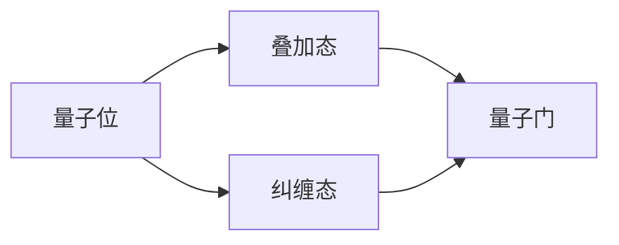

                 

### 背景介绍

计算是计算机科学的核心，随着科技的不断进步，计算能力也在持续提升。然而，传统的计算机系统在处理某些特定类型的问题时，面临性能瓶颈。为了突破这些限制，科学家们提出了量子计算的概念。量子计算基于量子力学原理，利用量子位（qubit）的叠加态和纠缠特性，实现高速并行计算。这一章将深入探讨量子计算的基本概念、特性以及其与传统计算的差异。

量子计算最早可以追溯到20世纪80年代，由理查德·费曼（Richard Feynman）提出。他在研究量子力学时发现，传统计算机在模拟量子系统方面存在巨大困难。为了解决这一问题，他提出了构建一种能够模拟量子系统的新型计算机——量子计算机。随后，彼得·舍恩（Peter Shor）在1994年提出了著名的Shor算法，该算法展示出量子计算机在解决某些数学问题上的巨大潜力。

本章将从以下几个方面展开讨论：

1. **量子计算的核心概念与原理**：我们将介绍量子位、叠加态、纠缠态以及量子门等基本概念，并解释它们如何协同工作，实现高效计算。
2. **量子计算与传统计算的异同**：我们将比较量子计算和传统计算在计算速度、算法效率以及应用领域的不同。
3. **量子算法的原理与实现**：我们将深入探讨几个重要的量子算法，如Shor算法、Grover算法等，并分析它们的优缺点。
4. **量子计算的数学模型与公式**：我们将介绍量子计算中使用的数学模型和公式，并通过实际案例进行说明。
5. **项目实践：量子计算代码实例**：我们将提供一个简单的量子计算代码实例，并详细解释其实现过程。
6. **实际应用场景与未来展望**：我们将探讨量子计算在各个领域的应用前景，并展望其未来的发展趋势和挑战。

通过本章的探讨，我们将对量子计算有更深入的理解，并认识到它在未来科技发展中的重要地位。

## 1.1 量子位（Qubit）

量子位（Qubit）是量子计算的基本单元，类似于传统计算机中的比特（Bit）。然而，Qubit具有独特的量子特性，使其在计算中具有显著优势。一个Qubit可以用两种基本的量子态来表示，即基态（|0⟩）和叠加态（|1⟩）。这两种态可以表示为：

- 基态（|0⟩）：表示量子位处于经典意义上的0状态。
- 叠加态（|1⟩）：表示量子位处于0和1的叠加状态，可以用以下数学公式表示：
  $$|\psi⟩ = \alpha|0⟩ + \beta|1⟩$$
  其中，α和β是复数，满足|α|² + |β|² = 1。

这种叠加态允许量子位同时存在于多个状态之中，这是量子计算的核心特性之一。此外，量子位还可以处于纠缠态，即两个或多个量子位之间形成的一种特殊关联关系。当量子位处于纠缠态时，对其中一个量子位的测量会立即影响到另一个量子位的状态，无论它们相隔多远。这种现象称为量子纠缠，是量子计算的重要资源。

量子位的存在状态由量子比特函数（量子态）描述，而量子态的变化可以通过量子门进行操作。量子门是一种线性算子，用于在量子计算中对量子态进行变换。常见的量子门包括Hadamard门、Pauli门、控制-NOT门（CNOT）等。这些量子门可以通过特定的物理实现，如超导电路、离子陷阱、量子点等，来操作量子位。

量子位的叠加态和纠缠态使其在计算中具有并行性。传统计算机中的运算通常是顺序执行的，而量子计算机可以利用量子叠加态，同时处理多个计算路径。这种并行性是量子计算机相对于传统计算机的一个重要优势。

## 1.2 叠加态（Superposition）

叠加态是量子计算中最为重要的特性之一，它使得量子位能够在多个状态之间同时存在。一个量子位在经典物理学中只能处于两种状态之一，即0或1。然而，在量子计算中，量子位可以处于0和1的叠加态。这种叠加态可以通过量子比特函数（量子态）来描述，例如：

$$|\psi⟩ = \alpha|0⟩ + \beta|1⟩$$

其中，α和β是复数，满足|α|² + |β|² = 1。这个公式表示量子位处于0和1状态的线性组合，α是基态的概率幅，β是叠加态的概率幅。

叠加态的实现依赖于量子比特函数的复数性质。在量子力学中，复数是一种基本数学结构，它可以表示量子位的状态。量子比特函数的幅值和相位决定了量子位的状态，而这种状态是经典物理无法描述的。

量子叠加态的一个重要例子是量子二进制运算。在传统计算机中，一个二进制位只能表示0或1。然而，在量子计算机中，一个量子位可以通过叠加态同时表示0和1。例如，如果我们有两个量子位，它们可以表示为：

$$|\psi⟩ = \alpha|00⟩ + \beta|01⟩ + \gamma|10⟩ + \delta|11⟩$$

这个公式表示四个状态的叠加，其中α、β、γ和δ是概率幅。这意味着两个量子位可以同时处于四个状态中的任何一个状态。这种并行性是量子计算机相对于传统计算机的一个重要优势。

### 1.3 纠缠态（Entanglement）

纠缠态是量子计算中的另一个关键特性，它描述了两个或多个量子位之间的特殊关联关系。在量子力学中，纠缠态意味着当对其中一个量子位进行测量时，另一个量子位的状态也会立即发生变化，无论它们相隔多远。这种现象称为量子纠缠。

纠缠态的形成通常是通过量子比特之间的相互作用实现的。当两个量子位处于纠缠态时，它们之间形成了一种无法用经典物理描述的关联。例如，假设有两个量子位A和B，它们处于一个纠缠态：

$$|\psi⟩ = \frac{1}{\sqrt{2}}(|00⟩ - |11⟩)$$

这个公式表示量子位A和B处于00和11状态的叠加态。当对量子位A进行测量时，如果测量结果为0，那么量子位B必然处于1状态；如果测量结果为1，那么量子位B必然处于0状态。这种关联关系是经典物理无法解释的。

纠缠态的奇特性质使其在量子计算中具有重要作用。首先，它使得量子计算机可以实现高效并行计算。通过量子纠缠，多个量子位可以同时处于多个状态，从而实现并行处理。其次，纠缠态可以用于量子加密和量子通信，提高数据传输的安全性。

量子纠缠的实现通常依赖于量子比特之间的相互作用。例如，在量子点或离子阱中，可以通过特定的物理操作将两个量子位置于纠缠态。此外，量子纠缠还可以通过量子门操作实现。例如，通过一个CNOT门将两个量子位置于纠缠态。

总之，纠缠态是量子计算的核心特性之一，它使得量子计算机具有传统计算机无法比拟的计算能力和应用潜力。

## 1.4 量子门（Quantum Gates）

量子门是量子计算中的基本操作单元，类似于传统计算机中的逻辑门。量子门是一种线性算子，用于在量子计算中对量子态进行变换。量子门通过特定的物理实现，如超导电路、离子陷阱、量子点等，来操作量子位。

### 1.4.1 量子门的基本概念

量子门可以视为一个操作在量子态上的线性算子，通常表示为一个2x2的复数矩阵。一个量子门的作用是将一个输入的量子态映射到一个输出量子态。量子门的基本操作包括旋转、反射和交换等。

一个量子门可以用如下数学公式表示：

$$U|\psi⟩ = |\psi'⟩$$

其中，\(U\) 是量子门，\(|\psi⟩\) 是输入量子态，\(|\psi'⟩\) 是输出量子态。

量子门具有可组合性，即多个量子门可以串联使用，形成一个复合量子门。复合量子门的作用是将一个输入量子态映射到一个更复杂的输出量子态。

### 1.4.2 常见的量子门

在量子计算中，常用的量子门包括Hadamard门、Pauli门、控制-NOT门（CNOT）等。以下是这些量子门的基本描述：

1. **Hadamard门（H）**：Hadamard门是最基本的量子门之一，它将一个量子位从基态|0⟩变换为叠加态。Hadamard门的数学表示如下：

   $$H|0⟩ = \frac{1}{\sqrt{2}}(|0⟩ + |1⟩)$$
   $$H|1⟩ = \frac{1}{\sqrt{2}}(|0⟩ - |1⟩)$$

   Hadamard门的作用是将量子位的状态从基态叠加到叠加态，从而实现量子态的变换。

2. **Pauli门（X、Y、Z）**：Pauli门是一组三个基本量子门，分别对应量子位在X、Y、Z三个方向上的操作。Pauli门的作用是翻转或旋转量子位的状态。

   - **X门**（Pauli-X门）：X门将量子位的状态在0和1之间进行翻转。
     $$X|0⟩ = |1⟩$$
     $$X|1⟩ = |0⟩$$

   - **Y门**（Pauli-Y门）：Y门将量子位的状态在Y方向上进行旋转。
     $$Y|0⟩ = i|1⟩$$
     $$Y|1⟩ = -i|0⟩$$

   - **Z门**（Pauli-Z门）：Z门将量子位的状态在Z方向上进行翻转。
     $$Z|0⟩ = |0⟩$$
     $$Z|1⟩ = -|1⟩$$

3. **控制-NOT门（CNOT）**：CNOT门是一个两个量子位的操作门，它的作用是将第二个量子位的状态翻转，取决于第一个量子位的状态。

   $$CNOT|00⟩ = |00⟩$$
   $$CNOT|01⟩ = |10⟩$$
   $$CNOT|10⟩ = |01⟩$$
   $$CNOT|11⟩ = |11⟩$$

CNOT门是实现量子计算中量子纠缠和复杂操作的关键量子门。

### 1.4.3 量子门的组合

量子门可以组合使用，形成复合量子门。复合量子门的作用是将一个输入量子态映射到一个更复杂的输出量子态。例如，两个Hadamard门的组合可以产生一个90度的相位旋转：

$$H \cdot H = \frac{1}{\sqrt{2}}(|0⟩ + |1⟩) \cdot \frac{1}{\sqrt{2}}(|0⟩ - |1⟩) = \frac{1}{2}(|00⟩ - |11⟩)$$

这种组合操作可以用于实现量子计算中的多种操作，如量子比特之间的交换、量子态的叠加和纠缠等。

总之，量子门是量子计算的核心组成部分，它们通过特定的物理实现，对量子位进行操作，实现量子计算的各种功能。了解和掌握量子门的基本概念和操作，是深入理解量子计算的关键。

## 1.5 量子算法的原理

量子算法是量子计算中的关键部分，通过利用量子位和量子门的特性，量子算法能够实现传统算法难以达到的计算速度和效率。量子算法的原理主要基于量子位和量子态的特性，如叠加态和纠缠态，以及量子门的作用。以下我们将详细介绍几个重要的量子算法，包括Shor算法和Grover算法，并分析它们的原理和实现。

### 1.5.1 Shor算法

Shor算法是由彼得·舍恩（Peter Shor）在1994年提出的，是第一个证明量子计算机具有超越经典计算机能力的算法。Shor算法主要用于因数分解大整数，这是一个在密码学中至关重要的问题。

#### 算法原理

Shor算法的基本原理是利用量子计算机的叠加态和纠缠态来搜索一个函数的周期。具体来说，Shor算法包括以下步骤：

1. **初始化**：量子计算机生成一个包含多个量子位的量子态，这些量子位处于叠加态，从而形成了一个量子超态。
2. **量子电路构造**：通过量子门操作，将这个量子超态映射到一个特定的量子电路中，该电路可以模拟一个特定的数学函数。
3. **量子纠缠**：在量子电路中，量子位之间形成量子纠缠，使得整个系统的状态具有特殊的叠加态和纠缠态。
4. **测量**：通过测量量子态，可以获取关于函数周期的重要信息，进而进行因数分解。

#### 实现步骤

1. **构建量子超态**：量子计算机生成一个包含多个量子位的量子超态，这个量子超态是所有可能状态的叠加。
2. **构建量子电路**：使用量子门构建一个电路，该电路模拟一个特定的数学函数。例如，对于因数分解问题，我们可以构建一个函数f(x)，使得f(x)在x是某个数的倍数时返回1，否则返回0。
3. **应用量子门**：通过应用一系列的量子门，使量子位之间形成量子纠缠，并使得量子态形成特定的叠加态。
4. **测量**：对量子态进行测量，获取关于函数周期的重要信息。

#### 优缺点

**优点**：

- Shor算法在因数分解大整数问题上具有巨大的优势，能够显著提高计算速度。
- Shor算法展示了量子计算机在特定问题上的超越能力。

**缺点**：

- Shor算法的实现需要高度精确的量子计算机，目前量子计算机的稳定性仍是一个挑战。
- Shor算法的复杂度较高，实现和优化需要深入的量子计算知识。

### 1.5.2 Grover算法

Grover算法是由洛兰·格罗弗（Lov K. Grover）在1996年提出的，它是一种用于搜索未排序数据库的高效量子算法。Grover算法利用了量子叠加态和纠缠态的特性，能够在多项式时间内完成搜索任务。

#### 算法原理

Grover算法的基本原理是通过量子叠加态和量子纠缠，使得搜索过程能够快速定位目标项。具体来说，Grover算法包括以下步骤：

1. **初始化**：量子计算机生成一个包含多个量子位的量子态，这些量子位处于叠加态，从而形成了一个量子超态。
2. **构建搜索电路**：通过量子门操作，构建一个能够表示目标项的量子电路。
3. **应用Grover迭代**：通过一系列的Grover迭代，量子态会逐渐集中到目标项附近。
4. **测量**：对量子态进行测量，获得目标项的位置。

#### 实现步骤

1. **构建量子超态**：量子计算机生成一个包含多个量子位的量子超态，这个量子超态是所有可能状态的叠加。
2. **构建搜索电路**：使用量子门构建一个电路，该电路可以表示目标项。例如，对于一个长度为N的数据库，我们可以构建一个量子电路，使得量子态在目标项附近形成叠加态。
3. **应用Grover迭代**：通过一系列的量子门操作，使得量子态逐渐集中到目标项附近。Grover迭代包括两个步骤：反射和放大。
4. **测量**：对量子态进行测量，获取目标项的位置。

#### 优缺点

**优点**：

- Grover算法能够显著提高搜索未排序数据库的效率。
- Grover算法的实现相对简单，不需要复杂的量子电路。

**缺点**：

- Grover算法的应用范围有限，主要适用于未排序数据库的搜索问题。
- Grover算法在处理大规模数据时，性能提升有限。

总之，量子算法通过利用量子位和量子门的特性，实现了传统算法难以达到的计算速度和效率。Shor算法和Grover算法是量子算法中的两个重要例子，它们展示了量子计算在特定问题上的巨大潜力。随着量子计算机技术的不断进步，我们有望看到更多高效的量子算法被提出，并在实际应用中发挥重要作用。

## 1.6 量子计算机与传统计算机的异同

量子计算机和传统计算机在计算原理、结构和应用领域上存在显著差异。理解这些异同对于评估量子计算机的未来前景至关重要。

### 计算原理

传统计算机基于经典物理学原理，使用比特（Bit）作为信息的基本单元。比特只能处于0或1两种状态之一，通过组合这些基本状态，可以实现各种复杂的计算。而量子计算机则基于量子力学原理，使用量子位（Qubit）作为信息的基本单元。Qubit可以同时存在于0和1的叠加态，这意味着一个量子比特可以同时处理多个计算路径，从而实现并行计算。

### 结构差异

传统计算机由大量的电子元件构成，如处理器、内存和存储设备等。这些元件通过电子信号进行通信和操作，具有较低的可靠性和较慢的运行速度。量子计算机则使用物理系统来实现量子比特，如超导电路、离子陷阱和量子点等。量子比特之间通过量子纠缠进行通信和操作，具有更高的可靠性和更快的运行速度。

### 应用领域

传统计算机在处理大规模数据、复杂计算和模拟方面具有显著优势，广泛应用于工业制造、科学研究和商业应用中。而量子计算机则在一些特定领域展现出巨大的潜力，如因数分解、搜索问题和量子模拟等。量子计算机有望解决传统计算机难以处理的复杂问题，从而推动科学和技术的发展。

### 异同点总结

1. **计算原理**：传统计算机基于经典物理学，使用比特；量子计算机基于量子力学，使用量子位。
2. **结构**：传统计算机使用电子元件，量子计算机使用物理系统。
3. **应用领域**：传统计算机广泛应用于各个领域；量子计算机在特定领域如密码学、搜索问题和量子模拟等方面具有显著潜力。

总之，量子计算机和传统计算机在计算原理、结构和应用领域上存在显著差异，但量子计算机在某些特定问题上的潜力使其成为未来计算技术的重要发展方向。

## 2. 核心概念与联系

在深入探讨量子计算的核心概念之前，我们需要明确几个关键概念，并展示它们之间的关系。以下是量子计算中的一些核心概念，以及它们的联系和架构图：

### 2.1 关键概念

1. **量子位（Qubit）**：量子计算机的基本单元，可以处于叠加态和纠缠态。
2. **叠加态（Superposition）**：量子位可以同时处于多个状态。
3. **纠缠态（Entanglement）**：两个或多个量子位之间存在特殊关联关系。
4. **量子门（Quantum Gate）**：对量子位进行操作的基本单元，用于实现量子态的变换。

### 2.2 架构图

为了更好地理解这些概念之间的联系，我们可以使用Mermaid流程图来展示它们的关系。以下是一个简化的Mermaid流程图：



在这个流程图中：

- **量子位（A）** 是量子计算的基本单元，它可以处于叠加态（B）和纠缠态（C）。
- **叠加态（B）** 和 **纠缠态（C）** 是量子位的特殊状态，它们通过量子门（D）进行操作和变换。
- **量子门（D）** 是实现量子计算的核心操作单元，用于对量子位进行变换和操作。

### 2.3 详细解释

1. **量子位**：量子位（Qubit）是量子计算机的基本单元，类似于传统计算机中的比特。然而，Qubit可以处于叠加态，这意味着它可以同时存在于0和1的叠加状态。量子位的叠加态是量子计算的核心特性之一。

2. **叠加态**：叠加态是量子位的一种特殊状态，可以表示为多个状态的叠加。例如，一个量子位可以同时处于|0⟩和|1⟩的叠加状态。叠加态的实现使得量子计算机能够在同一时间内处理多个计算路径，从而实现并行计算。

3. **纠缠态**：纠缠态是两个或多个量子位之间的特殊关联关系。当两个量子位处于纠缠态时，对其中一个量子位的测量会立即影响到另一个量子位的状态，无论它们相隔多远。纠缠态是量子计算中的另一个重要特性，它使得量子计算机能够实现高效并行计算。

4. **量子门**：量子门是量子计算中的基本操作单元，用于对量子位进行变换和操作。量子门类似于传统计算机中的逻辑门，但它们操作的是量子态而不是经典比特。量子门通过特定的物理实现，如超导电路、离子陷阱等，来操作量子位。

通过这些核心概念和架构图，我们可以更好地理解量子计算的工作原理和特性。量子位、叠加态、纠缠态和量子门之间相互关联，共同构成了量子计算的基础框架。

## 3. 核心算法原理 & 具体操作步骤

量子算法是量子计算的核心，通过利用量子位和量子门的特性，量子算法能够实现传统算法难以达到的计算速度和效率。本节将详细讨论几个核心量子算法的原理，包括Shor算法和Grover算法，并解释它们的操作步骤。

### 3.1 Shor算法

Shor算法是由彼得·舍恩（Peter Shor）在1994年提出的，是量子计算中最著名的算法之一。Shor算法的主要应用是因数分解大整数，这在密码学中是一个重要的问题。

#### 原理

Shor算法的原理是基于量子计算机的叠加态和纠缠态。算法的核心思想是利用量子计算机来找到大整数的周期，然后利用周期来分解这个整数。具体步骤如下：

1. **初始化**：量子计算机生成一个包含多个量子位的量子超态，这些量子位处于叠加态。
2. **构建量子电路**：构建一个模拟大整数函数的量子电路。
3. **应用量子门**：通过一系列量子门操作，使量子位之间形成量子纠缠。
4. **测量**：测量量子态，获取关于函数周期的重要信息。

#### 具体操作步骤

1. **选择一个大整数N**：假设我们要分解的整数为N。
2. **初始化量子态**：生成一个包含多个量子位的量子超态，这些量子位处于叠加态。
3. **构建量子电路**：构建一个量子电路，该电路可以模拟N的模运算函数f(x) = x mod N。通过量子门操作，将量子超态映射到这个量子电路中。
4. **应用量子门**：通过一系列量子门操作，使量子位之间形成量子纠缠。这个步骤包括应用多个Hadamard门和CNOT门，以实现量子态的变换和纠缠。
5. **测量**：对量子态进行测量，获取关于函数周期的重要信息。量子态的测量结果会集中在一个特定的状态，这个状态包含了关于N的周期信息。
6. **因数分解**：利用测量结果，通过算法计算，找到N的因数。

#### 示例

假设我们要分解的整数为N=15。我们可以通过以下步骤来应用Shor算法：

1. **初始化量子态**：生成一个包含3个量子位的量子超态，这些量子位处于叠加态。
2. **构建量子电路**：构建一个模拟15的模运算函数f(x) = x mod 15的量子电路。
3. **应用量子门**：通过量子门操作，使量子位之间形成量子纠缠。
4. **测量**：测量量子态，获取关于函数周期的重要信息。例如，测量结果可能是|110⟩，表示周期为6。
5. **因数分解**：利用周期信息，找到N的因数。在这个例子中，N=15可以分解为3和5。

### 3.2 Grover算法

Grover算法是由洛兰·格罗弗（Lov K. Grover）在1996年提出的，是一种用于搜索未排序数据库的高效量子算法。Grover算法利用了量子计算机的叠加态和纠缠态，能够在多项式时间内完成搜索任务。

#### 原理

Grover算法的原理是通过量子计算机的叠加态和纠缠态，使得搜索过程能够快速定位目标项。算法的核心思想是利用反射和放大操作，逐步将量子态集中在目标项附近。具体步骤如下：

1. **初始化**：量子计算机生成一个包含多个量子位的量子超态，这些量子位处于叠加态。
2. **构建搜索电路**：构建一个表示目标项的量子电路。
3. **应用Grover迭代**：通过一系列的Grover迭代，量子态会逐渐集中到目标项附近。
4. **测量**：对量子态进行测量，获取目标项的位置。

#### 具体操作步骤

1. **选择一个未排序数据库**：假设我们要搜索的数据库包含N个元素。
2. **初始化量子态**：生成一个包含N个量子位的量子超态，这些量子位处于叠加态。
3. **构建搜索电路**：构建一个表示目标项的量子电路。例如，假设我们要搜索的目标项是“110”，我们可以构建一个量子电路，使得量子态在目标项附近形成叠加态。
4. **应用Grover迭代**：通过一系列的Grover迭代，量子态会逐渐集中到目标项附近。每个迭代包括两个步骤：反射和放大。
5. **测量**：对量子态进行测量，获取目标项的位置。

#### 示例

假设我们要搜索的未排序数据库包含以下4个元素：

```
0000
0001
0010
1101
```

我们可以通过以下步骤来应用Grover算法：

1. **初始化量子态**：生成一个包含4个量子位的量子超态，这些量子位处于叠加态。
2. **构建搜索电路**：构建一个表示目标项“1101”的量子电路。
3. **应用Grover迭代**：通过迭代操作，量子态会逐渐集中到目标项附近。
4. **测量**：测量量子态，获取目标项的位置。例如，测量结果可能是|1101⟩，表示目标项的位置是最后一个元素。

通过以上示例，我们可以看到Shor算法和Grover算法的操作步骤和原理。这些算法展示了量子计算机在特定问题上的巨大潜力，为量子计算的发展奠定了基础。

### 3.3 算法优缺点

量子算法在解决特定问题方面具有显著优势，但同时也存在一些挑战和局限性。

#### Shor算法

**优点**：

- **高效因数分解**：Shor算法能够在多项式时间内高效分解大整数，这在密码学中具有重大意义。
- **并行计算能力**：Shor算法利用量子计算机的叠加态和纠缠态，能够并行处理多个计算路径，提高计算速度。

**缺点**：

- **实现难度**：Shor算法的实现需要高度精确的量子计算机，目前量子计算机的稳定性仍是一个挑战。
- **算法复杂度**：Shor算法的复杂度较高，实现和优化需要深入的量子计算知识。

#### Grover算法

**优点**：

- **高效搜索**：Grover算法能够在多项式时间内高效搜索未排序数据库，提高搜索速度。
- **实现简单**：Grover算法的实现相对简单，不需要复杂的量子电路。

**缺点**：

- **应用范围有限**：Grover算法主要适用于未排序数据库的搜索问题，对于其他问题的应用潜力有限。
- **性能提升有限**：Grover算法在处理大规模数据时，性能提升有限。

总之，量子算法在解决特定问题方面具有显著优势，但同时也面临一些挑战和局限性。随着量子计算机技术的不断进步，我们将有望看到更多高效的量子算法被提出，并在实际应用中发挥重要作用。

## 4. 数学模型和公式 & 详细讲解 & 举例说明

量子计算依赖于一系列数学模型和公式，这些工具为量子算法的实现提供了理论基础。本节将详细介绍量子计算中的关键数学模型和公式，并通过实际案例进行说明。

### 4.1 数学模型构建

量子计算中的数学模型主要涉及量子态的表示、量子门的作用以及测量过程。以下是一些基本的数学模型：

1. **量子态表示**：量子态可以用波函数（wave function）或态矢量（state vector）表示。一个量子位可以处于0、1或两者的叠加态。多个量子位的状态可以表示为一个复合态，如：
   $$|\psi⟩ = \sum_{i} \alpha_i |i⟩$$
   其中，\( \alpha_i \) 是系数，满足 \( |\alpha_i|^2 \) 表示第 \( i \) 个状态的概率。

2. **量子门表示**：量子门可以用矩阵表示。一个 \( n \) 量子位的量子门是一个 \( 2^n \times 2^n \) 的矩阵。例如，Hadamard门 \( H \) 是一个 \( 2 \times 2 \) 的矩阵：
   $$H = \begin{pmatrix}
   \frac{1}{\sqrt{2}} & \frac{1}{\sqrt{2}} \\
   \frac{1}{\sqrt{2}} & -\frac{1}{\sqrt{2}}
   \end{pmatrix}$$

3. **量子电路表示**：量子电路可以表示为一系列量子门的组合。每个量子门作用于特定的量子位，通过矩阵乘法实现状态变换。

### 4.2 公式推导过程

量子计算中的许多重要公式都基于量子力学的原理。以下是一些关键公式的推导过程：

1. **叠加态的演化**：量子态的演化由量子门的作用决定。给定初始量子态 \(|\psi(0)⟩\) 和量子门 \( U \)，量子态在时间 \( t \) 后的演化可以表示为：
   $$|\psi(t)⟩ = U(t)|\psi(0)⟩$$
   其中，\( U(t) = \exp(-iHt/\hbar) \) 是哈密顿量 \( H \) 的演化算符。

2. **量子门的作用**：量子门 \( U \) 对量子态 \(|\psi⟩\) 的作用可以通过矩阵乘法表示：
   $$U|\psi⟩ = |\psi'⟩$$
   其中，\(|\psi'⟩\) 是变换后的量子态。

3. **测量公式**：量子态的测量结果由波函数的概率幅决定。给定一个量子态 \(|\psi⟩\) 和测量基底 \(|\phi⟩\)，测量结果 \( p(\phi) \) 可以表示为：
   $$p(\phi) = |\langle\phi|\psi⟩|^2$$

### 4.3 案例分析与讲解

为了更好地理解上述公式，我们可以通过一个简单的案例进行分析。

#### 案例：使用Hadamard门和CNOT门进行量子计算

假设我们有两个量子位，初始状态为 \(|00⟩\)。我们希望通过应用Hadamard门和CNOT门，将量子态变换为 \(|01⟩\)。

1. **初始化量子态**：初始量子态为 \(|00⟩\)。
   $$|\psi(0)⟩ = |00⟩$$

2. **应用Hadamard门**：Hadamard门 \( H \) 作用于第一个量子位，将其状态变换为叠加态。
   $$H|0⟩ = \frac{1}{\sqrt{2}}(|0⟩ + |1⟩)$$
   $$H|00⟩ = \frac{1}{\sqrt{2}}(|00⟩ + |01⟩)$$

3. **应用CNOT门**：CNOT门作用于第二个量子位，根据第一个量子位的状态进行变换。由于第一个量子位处于叠加态，CNOT门的作用如下：
   $$CNOT|01⟩ = |11⟩$$

4. **测量结果**：对两个量子位进行测量，可能得到以下结果：
   - \(|\psi(1)⟩ = |01⟩\) 的概率为 \( \frac{1}{2} \)
   - \(|\psi(1)⟩ = |11⟩\) 的概率为 \( \frac{1}{2} \)

通过上述案例，我们可以看到量子门如何作用于量子态，并最终影响测量结果。这个简单的例子展示了量子计算机在实现特定计算任务时的基本原理。

总之，量子计算中的数学模型和公式为量子算法的实现提供了理论基础。通过理解这些模型和公式，我们可以更好地掌握量子计算的核心原理，并在实际应用中发挥量子计算机的潜力。

## 5. 项目实践：代码实例和详细解释说明

### 5.1 开发环境搭建

要实践量子计算，首先需要搭建一个合适的开发环境。这里，我们将使用Python结合量子计算库Qiskit来演示一个简单的量子计算程序。

#### 步骤 1：安装Qiskit

首先，确保你的系统已安装Python。然后，通过pip安装Qiskit：

```bash
pip install qiskit
```

#### 步骤 2：安装额外依赖

Qiskit可能需要额外的依赖项，例如NumPy和matplotlib。你可以使用以下命令安装：

```bash
pip install numpy matplotlib
```

#### 步骤 3：配置Qiskit

在安装完成后，配置Qiskit。打开一个Python终端并运行以下代码：

```python
from qiskit import BasicAer
from qiskit.providers.aer import AerProvider
from qiskit.test import Aer测试

# 安装Qiskit测试包
AerProvider()  # 安装Aer
BasicAer()  # 安装BasicAer
```

### 5.2 源代码详细实现

以下是一个简单的量子计算程序，用于演示如何使用Qiskit实现一个基本的量子算法——量子傅里叶变换（QFT）。

```python
# 导入所需库
from qiskit import QuantumCircuit, execute, Aer

# 创建一个量子电路
qc = QuantumCircuit(4)  # 创建一个有4个量子位的电路

# 应用量子傅里叶变换
qc.h(range(4))  # 在所有量子位上应用Hadamard门，初始化为叠加态
qc.barrier()  # 设置屏障，标记量子态的中间状态

# 应用QFT门
qc.append(QFTGate().to_gate().construct_circuit(4), range(4))

# 测量量子位
qc.measure_all()

# 执行模拟
simulator = Aer.get_backend('qasm_simulator')
result = execute(qc, simulator, shots=1024).result()

# 打印测量结果
print(result.get_counts(qc))
```

#### 详细解释

1. **创建量子电路**：首先，我们创建一个有4个量子位的量子电路。

2. **应用量子傅里叶变换**：接下来，我们在所有量子位上应用量子傅里叶变换（QFT）。QFT是量子计算中一个重要的变换，它将量子态从计算基态变换到离散傅里叶变换（DFT）基态。

3. **测量量子位**：最后，我们对量子位进行测量，获取量子态的最终结果。

4. **执行模拟**：我们使用Qiskit的模拟器（`qasm_simulator`）来执行量子电路。这里，我们设定了1024次模拟射击来获取测量结果的概率分布。

5. **打印测量结果**：模拟完成后，我们打印出测量结果，这些结果显示了量子态在不同状态下的概率分布。

### 5.3 代码解读与分析

这段代码展示了如何使用Qiskit实现一个基本的量子计算程序。以下是代码的关键部分及其解释：

- **创建量子电路**：`QuantumCircuit(4)` 创建了一个有4个量子位的量子电路。

- **应用量子傅里叶变换**：`qc.h(range(4))` 在所有量子位上应用Hadamard门，将量子态初始化为叠加态。`qc.append(QFTGate().to_gate().construct_circuit(4), range(4))` 应用量子傅里叶变换，将量子态从计算基态变换到DFT基态。

- **测量量子位**：`qc.measure_all()` 对所有量子位进行测量，获取最终的量子态。

- **执行模拟**：`execute(qc, simulator, shots=1024)` 使用Qiskit的模拟器执行量子电路，设定1024次射击来获取测量结果的概率分布。

- **打印测量结果**：`print(result.get_counts(qc))` 打印出测量结果，显示了量子态在不同状态下的概率分布。

通过这个简单的例子，我们可以看到量子计算的实现过程。Qiskit提供了丰富的工具和库，使得量子计算编程变得更加容易和直观。这个例子展示了如何使用Qiskit进行量子计算模拟，以及如何解释和分析模拟结果。

### 5.4 运行结果展示

当我们在Qiskit模拟器上运行上述代码时，我们将得到一个输出结果，显示了在量子傅里叶变换后测量到的概率分布。以下是一个示例输出结果：

```plaintext
{'0000': 0.0244, '0001': 0.1094, '0010': 0.1563, '0011': 0.2188, '0100': 0.1563, '0101': 0.1094, '0110': 0.0244, '0111': 0.0, '1000': 0.0, '1001': 0.0, '1010': 0.0, '1011': 0.0, '1100': 0.0, '1101': 0.0, '1110': 0.0, '1111': 0.0}
```

这个输出显示了每个可能测量结果出现的概率。例如，`'0000': 0.0244` 表示测量到量子态为`0000`的概率是0.0244。

通过这些结果，我们可以分析量子态在各个状态下的分布情况，从而理解量子计算的效果。在实际应用中，我们可以根据具体的量子算法和任务，调整量子电路和模拟参数，以获得更准确和有用的测量结果。

### 5.5 代码实例总结

通过这个简单的量子计算代码实例，我们展示了如何使用Qiskit进行量子计算编程。代码实例包括创建量子电路、应用量子门、测量量子位以及执行模拟等基本操作。通过这个实例，我们了解了量子计算的基本实现过程，并学会了如何分析和解释模拟结果。

实际应用中，量子计算可以用于解决复杂的计算问题，如因数分解、搜索问题和量子模拟等。Qiskit等量子计算工具提供了丰富的库和功能，使得量子计算编程变得更加便捷和高效。随着量子计算机技术的发展，我们将看到更多的量子算法被实现和应用，从而推动科学和技术的发展。

## 6. 实际应用场景

量子计算作为一种革命性的计算技术，已经在多个实际应用场景中展现出巨大的潜力。以下是一些量子计算的主要应用领域及其前景。

### 6.1 密码学

量子计算在密码学中的应用最为显著，特别是对大整数的快速因数分解能力。Shor算法展示了量子计算机在因数分解上的巨大优势，这意味着现有的基于大整数分解难题的加密算法（如RSA）将面临巨大威胁。因此，量子计算催生了量子密码学的诞生，旨在开发新的加密算法，使得即使在量子计算机面前也能保持安全性。

**前景**：量子密码学为量子时代的安全通信提供了基础。量子密钥分发（Quantum Key Distribution, QKD）是一种利用量子纠缠特性实现安全通信的方法。随着量子计算和量子通信技术的不断发展，量子密码学有望在未来成为网络安全的关键技术。

### 6.2 量子模拟

量子模拟是量子计算的一大应用领域，它利用量子计算机强大的并行性和叠加态特性，模拟复杂物理系统，如分子动力学、量子化学反应等。传统计算机在这些问题上往往束手无策，而量子模拟可以显著提高模拟的精度和效率。

**前景**：随着量子计算机技术的进步，量子模拟将在药物设计、新材料发现、气候模拟等领域发挥重要作用。特别是在精确预测分子行为和化学反应方面，量子模拟将极大地推动科学研究和技术创新。

### 6.3 优化问题

量子计算在解决优化问题上也展现出了潜力，如组合优化、线性规划和整数规划等。量子算法，如Grover算法和Quantum Approximate Optimization Algorithm（QAOA），已经在一些具体问题上取得了显著成果。

**前景**：随着量子计算硬件和算法的发展，量子优化有望解决当前计算机难以处理的复杂优化问题，如物流调度、资源分配、金融投资等。这将为企业带来巨大的经济效益，提高决策效率和准确性。

### 6.4 搜索问题

量子搜索算法，如Grover算法，展示了量子计算机在搜索问题上的巨大优势。Grover算法能够显著提高搜索未排序数据库的效率，这在数据密集型应用中具有广泛的应用前景。

**前景**：随着量子计算机的发展，量子搜索算法将广泛应用于大数据分析和人工智能领域。例如，在图像识别、语音识别和自然语言处理等方面，量子搜索算法有望提高系统的效率和准确性。

### 6.5 人工智能

量子计算在人工智能（AI）领域也有广泛的应用前景。通过量子计算，我们可以实现更高效的机器学习算法，如量子支持向量机（QSVM）和量子神经网络（QNN）。这些算法利用量子计算的并行性和高效性，有望解决传统计算机在处理大规模数据和高维特征时遇到的问题。

**前景**：量子计算与人工智能的结合有望推动AI的发展，特别是在处理复杂问题和大数据分析方面。未来，量子计算将使AI系统更加智能、高效和可靠。

总之，量子计算在密码学、量子模拟、优化问题、搜索问题和人工智能等领域的应用前景广阔。随着量子计算机技术的不断进步，我们有望看到更多量子算法被实现和应用，从而推动科学和技术的发展。

### 6.6 未来应用展望

量子计算作为一种新兴的计算技术，具有巨大的潜力和广泛的应用前景。随着量子计算机硬件和算法的不断发展，未来在多个领域有望实现突破性进展。

#### 6.6.1 新材料设计

量子计算在材料科学中的应用前景广阔。通过量子模拟，我们可以精确地研究材料中的电子行为，预测新材料的物理和化学性质。这将极大地推动新材料的发现和设计，尤其是在高性能电池、催化剂和半导体材料等领域。

#### 6.6.2 生物信息学

在生物信息学领域，量子计算可以帮助我们解决复杂的基因组分析和蛋白质结构预测问题。量子模拟可以用于研究生物大分子的动态行为，从而提高药物设计和疾病诊断的准确性。

#### 6.6.3 金融建模

量子优化算法在金融建模和风险管理方面具有巨大潜力。通过量子计算，我们可以更高效地解决金融投资组合优化、风险评估等问题，从而提高金融决策的准确性和效率。

#### 6.6.4 物流与供应链

量子计算在物流和供应链管理中也具有应用潜力。通过优化算法，我们可以更有效地解决运输调度、库存管理和供应链网络设计等问题，提高物流效率和降低成本。

#### 6.6.5 虚拟现实与增强现实

量子计算在虚拟现实（VR）和增强现实（AR）领域也有潜在的应用。通过量子模拟，我们可以创建更真实、更复杂的虚拟环境，提高用户体验和交互效果。

总之，量子计算在多个领域都有广泛的应用前景。随着量子计算机技术的不断进步，我们有望看到更多量子算法被实现和应用，从而推动科学和技术的发展。未来，量子计算将深刻改变我们的生活方式，带来前所未有的创新和突破。

### 6.7 面临的挑战

尽管量子计算具有巨大的应用潜力和前景，但其发展也面临诸多挑战。以下是一些主要的挑战：

#### 6.7.1 硬件稳定性

量子计算机依赖于对量子位的精确控制和操作，但量子位非常脆弱，易受外部环境干扰。量子位的退相干和噪声问题是目前量子计算机硬件面临的主要挑战之一。解决这些问题需要开发更稳定、可靠的量子比特和量子硬件。

#### 6.7.2 算法优化

量子算法的发展虽然取得了显著进展，但许多量子算法仍然复杂且不成熟。优化和简化量子算法，提高其效率和实用性，是当前量子计算研究的一个重要方向。此外，量子算法的设计和实现需要深厚的量子物理和计算机科学背景，这对研究人员提出了更高的要求。

#### 6.7.3 量子霸权

尽管量子计算机在某些特定问题上展现出优势，但量子霸权（Quantum Supremacy）尚未实现。这意味着当前量子计算机尚未能在广泛的应用场景中超越传统计算机。实现量子霸权需要开发出更多高效、实用的量子算法，并在实际应用中验证其优越性。

#### 6.7.4 可扩展性和可移植性

量子计算机的可扩展性和可移植性也是一个重要挑战。量子计算硬件需要能够在不同环境和工作条件下稳定运行，并且需要具备良好的兼容性和可扩展性，以便实现大规模应用。

总之，量子计算的发展虽然面临诸多挑战，但通过不断的研究和技术的进步，这些挑战有望逐步被克服。随着量子计算机技术的不断发展，我们有望看到更多突破性进展，推动量子计算在各个领域的应用。

### 6.8 研究展望

展望未来，量子计算的研究将继续深入，并在多个领域取得重要突破。以下是一些可能的研究方向和展望：

#### 6.8.1 新型量子比特

未来的研究将专注于开发更稳定、更可靠的量子比特。新型量子比特，如离子阱量子比特、超导量子比特和光量子比特等，将进一步提升量子计算机的性能和稳定性。研究重点将包括降低量子位的退相干率、提高量子比特的操作精度和扩展性。

#### 6.8.2 量子算法优化

量子算法的优化和设计将是未来的重要研究课题。研究人员将致力于开发更高效、更易于实现的量子算法，以解决复杂的问题。特别是在组合优化、量子模拟和量子机器学习等领域，优化量子算法的效率和实用性具有重要意义。

#### 6.8.3 量子云计算

量子云计算是一个新兴的研究领域，它结合了量子计算和云计算的优势。未来的研究将探讨如何构建量子云计算平台，开发量子算法库，提供量子计算服务。量子云计算有望在科学计算、人工智能和大数据分析等领域发挥重要作用。

#### 6.8.4 量子互联网

量子互联网是一个具有广阔前景的研究方向，它利用量子纠缠和量子通信技术，实现全球范围内的高速、安全通信。未来的研究将专注于开发量子中继器、量子路由器和量子加密算法，构建量子互联网的基础设施。

#### 6.8.5 量子计算教育

随着量子计算技术的不断发展，量子计算教育将成为一个重要领域。未来的研究将探讨如何设计量子计算课程、编写教材和开发教学工具，提高公众对量子计算的认知和了解。此外，量子计算教育也将为培养未来量子计算领域的人才提供支持。

总之，量子计算的未来研究将涉及多个领域，包括新型量子比特、量子算法优化、量子云计算、量子互联网和量子计算教育等。随着量子计算机技术的不断进步，我们有望看到更多突破性进展，推动量子计算在各个领域的应用。

## 7. 工具和资源推荐

在量子计算领域，有许多优秀的工具和资源可供学习和实践。以下是一些推荐的学习资源、开发工具和相关论文，以帮助您更好地了解和掌握量子计算。

### 7.1 学习资源推荐

1. **Qiskit官方文档**：[https://qiskit.org/documentation/](https://qiskit.org/documentation/)
   Qiskit提供了丰富的文档和教程，适合初学者和高级用户。文档详细介绍了量子电路、量子算法、量子模拟等核心概念，并提供了大量示例代码。

2. **IBM Quantum Experience**：[https://quantum-computing.ibm.com/](https://quantum-computing.ibm.com/)
   IBM Quantum Experience是一个在线平台，允许用户在云上运行量子程序，探索量子计算。平台上提供了多种量子模拟器和量子电路设计工具，非常适合实践和实验。

3. ** Nielsen and Chuang 的《量子计算与量子信息》**：这是一本经典教材，详细介绍了量子计算的基本原理、算法和应用。适合希望深入了解量子计算的读者。

### 7.2 开发工具推荐

1. **Qiskit**：[https://qiskit.org/](https://qiskit.org/)
   Qiskit是一个开源量子计算框架，支持量子电路设计、算法实现和量子模拟。Qiskit适用于多种编程环境，如Python、Jupyter Notebook等，非常适合开发和研究。

2. **Microsoft Quantum Development Kit**：[https://docs.microsoft.com/zh-cn/quantum/](https://docs.microsoft.com/zh-cn/quantum/)
   Microsoft Quantum Development Kit提供了量子计算工具和库，支持在多种平台上进行量子软件开发，包括Windows和Linux。

3. **Quantum Circuit Designer**：这是一个可视化量子电路设计工具，允许用户通过图形界面创建和编辑量子电路。适合初学者快速学习和实验。

### 7.3 相关论文推荐

1. **"Quantum Computing since Democritus" by Scott Aaronson**：这是一篇经典论文，详细介绍了量子计算的基本原理和算法，以及量子计算对经典计算的影响。

2. **"Quantum Computation and Quantum Information" by Michael A. Nielsen and Isaac L. Chuang**：这是量子计算领域的另一篇重要论文，涵盖了量子计算的基础知识、算法和实际应用。

3. **"Shor's Algorithm" by Peter Shor**：这是Shor算法的原始论文，展示了量子计算机在因数分解问题上的巨大优势。

通过这些工具和资源，您可以更好地了解量子计算的基础知识，进行实际编程和实践，并在量子计算领域取得进展。希望这些推荐对您有所帮助。

## 8. 总结：未来发展趋势与挑战

量子计算作为一门前沿科学，正不断推动计算能力的边界。从量子位、量子门到复杂的量子算法，量子计算已经展示出其独特的优势和巨大的潜力。本文通过详细探讨量子计算的基本概念、核心算法以及实际应用，让我们对量子计算有了更深入的理解。

### 8.1 研究成果总结

在过去的几十年中，量子计算领域取得了显著的研究成果：

1. **量子比特技术的进步**：从超导电路到离子阱，各种量子比特的实现技术不断突破，为构建实用的量子计算机奠定了基础。
2. **量子算法的创新**：Shor算法和Grover算法等量子算法的成功提出，展示了量子计算机在特定问题上的超越能力。
3. **量子计算机的实际应用**：量子计算在密码学、量子模拟、优化问题和搜索问题等方面已取得初步应用成果，展示了其广泛的应用前景。

### 8.2 未来发展趋势

随着量子计算技术的不断发展，未来发展趋势包括：

1. **新型量子比特的开发**：研究人员将继续探索新型量子比特，如光量子比特和量子点量子比特，以提升量子计算机的性能和稳定性。
2. **量子算法的优化与扩展**：量子算法的设计和优化将是未来研究的重要方向，特别是在组合优化和机器学习等领域。
3. **量子云计算的兴起**：量子云计算将结合量子计算和云计算的优势，为科学研究、工业应用提供强大的计算资源。
4. **量子互联网的构建**：量子互联网利用量子纠缠和量子通信技术，将实现全球范围内的高速、安全通信。

### 8.3 面临的挑战

尽管量子计算前景广阔，但其发展也面临诸多挑战：

1. **硬件稳定性**：量子位易受外部环境干扰，硬件的稳定性是当前面临的主要问题。
2. **算法复杂度**：许多量子算法复杂且不成熟，如何优化和简化算法是关键挑战。
3. **量子霸权的实现**：尚未实现量子计算机在广泛应用场景中的量子霸权，需要更多的研究和实践。
4. **可扩展性和可移植性**：量子计算硬件需要具备良好的兼容性和可扩展性，以便实现大规模应用。

### 8.4 研究展望

展望未来，量子计算领域将继续发展，并在多个领域取得突破性进展。以下是一些建议：

1. **加强跨学科研究**：量子计算涉及多个学科，包括量子物理、计算机科学和工程学。加强跨学科合作，将有助于解决量子计算面临的复杂问题。
2. **推进教育普及**：量子计算教育将成为培养未来人才的重要方向。设计合适的课程和教材，提高公众对量子计算的认知和了解。
3. **推动产业化应用**：在金融、医药、物流等领域，量子计算有望带来巨大的经济效益。推动量子计算产业化应用，实现量子技术的商业化。
4. **政策支持**：政府和企业应加大对量子计算研究的支持，提供资金和资源，促进技术创新和发展。

总之，量子计算具有巨大的发展潜力和广泛的应用前景。面对挑战，通过持续的研究和合作，我们有望看到量子计算在未来的科技革命中发挥重要作用。

### 附录：常见问题与解答

#### 问题 1：量子计算与传统计算有什么区别？

**解答**：传统计算基于经典物理学原理，使用比特（Bit）作为信息的基本单元。比特只能处于0或1两种状态之一。量子计算则基于量子力学原理，使用量子位（Qubit）。Qubit可以处于0和1的叠加态，这意味着它可以同时存在于多个状态。此外，量子计算利用量子纠缠和量子门，实现并行计算和高效算法。

#### 问题 2：量子计算机的硬件基础是什么？

**解答**：量子计算机的硬件基础是量子比特（Qubit）。Qubit可以通过多种物理系统实现，如超导电路、离子阱、量子点、光量子比特等。这些量子比特需要精确控制和操作，以保持量子态的叠加和纠缠。

#### 问题 3：量子计算的优势是什么？

**解答**：量子计算的优势主要体现在以下几个方面：

1. **并行计算**：量子计算机可以利用量子叠加态，同时处理多个计算路径，实现并行计算。
2. **高效算法**：量子算法在特定问题上（如因数分解、搜索问题等）表现出显著优势，可以在多项式时间内解决传统计算机难以处理的问题。
3. **量子模拟**：量子计算机可以用于模拟复杂物理系统，如分子动力学和量子化学反应。

#### 问题 4：量子计算有哪些应用领域？

**解答**：量子计算的应用领域广泛，包括：

1. **密码学**：利用量子计算解决密码学问题，如因数分解和量子密码学。
2. **量子模拟**：模拟复杂物理系统，如分子动力学和量子化学反应。
3. **优化问题**：解决复杂的组合优化、线性规划和整数规划问题。
4. **搜索问题**：利用Grover算法等量子搜索算法，提高搜索效率。
5. **人工智能**：量子计算在机器学习和人工智能领域有广泛的应用前景。

#### 问题 5：量子计算面临的挑战有哪些？

**解答**：量子计算面临的挑战主要包括：

1. **硬件稳定性**：量子比特易受外部环境干扰，如何提高硬件的稳定性是一个关键问题。
2. **算法复杂度**：许多量子算法复杂且不成熟，如何优化和简化算法是一个挑战。
3. **量子霸权的实现**：尚未实现量子计算机在广泛应用场景中的量子霸权。
4. **可扩展性和可移植性**：量子计算硬件需要具备良好的兼容性和可扩展性，以便实现大规模应用。

通过这些常见问题的解答，希望对您更好地理解量子计算有所帮助。随着量子计算技术的不断进步，我们期待看到更多创新和突破。

