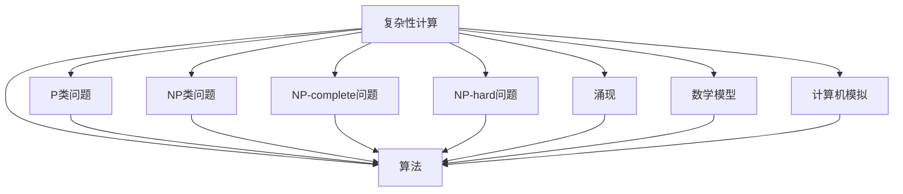

                 

关键词：计算理论、复杂性计算、涌现、复杂性科学、算法原理、数学模型、代码实例、实际应用、未来展望

> 摘要：本文探讨了计算的极限领域，特别是复杂性计算的研究进展。通过分析复杂性计算的原理、数学模型、算法实现和应用场景，本文旨在揭示计算科学在复杂性计算方面所面临的挑战和机遇。同时，本文还探讨了未来复杂性计算的发展趋势，为相关领域的研究提供了新的视角和方向。

## 1. 背景介绍

复杂性计算是指处理高度复杂的计算问题，这些问题的规模和结构超出了传统计算方法的处理能力。随着计算机科学和信息技术的迅猛发展，复杂性计算在许多领域都取得了显著的研究成果。然而，复杂性计算的研究仍然面临着许多挑战，如大规模数据处理的效率、算法的复杂度、以及计算资源的限制等。

复杂性计算的研究不仅具有重要的理论价值，而且在实际应用中也具有广泛的应用前景。例如，在人工智能、金融分析、生物信息学、社会网络分析等领域，复杂性计算都发挥了关键作用。因此，深入研究复杂性计算具有重要的科学意义和实际应用价值。

## 2. 核心概念与联系

为了更好地理解复杂性计算，我们首先需要了解一些核心概念和它们之间的联系。以下是复杂性计算的一些关键概念和它们的关联：

### 2.1 复杂性分类

复杂性计算可以按照问题的复杂程度进行分类。常见的复杂性分类包括：

- **P类问题**：可以多项式时间内解决的决策问题。
- **NP类问题**：可以在多项式时间内验证的决策问题。
- **NP-complete问题**：是NP类问题中最难的一类，如果能够找到一个有效的算法解决，则所有NP类问题都可以在多项式时间内解决。
- **NP-hard问题**：比NP-complete问题更难，但并不一定属于NP类。

### 2.2 涌现

涌现是指一个复杂系统中的个体通过相互作用和协同行为，产生出系统层次上无法从个体行为中直接推导出的宏观现象。复杂性计算中的涌现现象通常表现为大规模数据中的复杂结构和非线性关系。

### 2.3 算法

算法是解决计算问题的步骤序列。在复杂性计算中，研究高效的算法对于解决复杂问题至关重要。

### 2.4 数学模型

数学模型是描述计算问题的数学框架。在复杂性计算中，建立合适的数学模型有助于理解和解决复杂问题。

### 2.5 计算机模拟

计算机模拟是通过计算机程序模拟复杂系统的行为和演化，以预测和解释系统现象。

### 2.6 Mermaid 流程图

以下是一个简化的Mermaid流程图，用于展示复杂性计算中的一些核心概念和它们之间的联系：



## 3. 核心算法原理 & 具体操作步骤

### 3.1 算法原理概述

复杂性计算中的算法主要关注如何处理大规模、高维和复杂结构的数据。以下是一些常用的核心算法原理：

### 3.2 算法步骤详解

1. **数据预处理**：包括数据清洗、去噪、归一化等步骤，以提高算法的鲁棒性和性能。
2. **特征提取**：通过提取数据中的关键特征，将原始数据转换为更适合算法处理的表示形式。
3. **算法选择**：根据问题的性质和需求，选择合适的算法，如神经网络、支持向量机、随机森林等。
4. **模型训练**：使用训练数据集对算法模型进行训练，调整模型参数以优化性能。
5. **模型评估**：使用测试数据集评估模型性能，如准确率、召回率、F1值等。
6. **模型应用**：将训练好的模型应用到实际问题中，进行预测、分类或决策。

### 3.3 算法优缺点

各种算法在处理复杂性计算问题时具有不同的优缺点。以下是一些常见算法的优缺点概述：

- **神经网络**：优点包括强大的拟合能力和非线性表达能力，缺点包括对大规模数据的需求、训练时间长和易过拟合。
- **支持向量机**：优点包括较好的分类性能和较好的泛化能力，缺点包括对高维数据的处理能力有限。
- **随机森林**：优点包括对噪声数据的鲁棒性和较好的泛化能力，缺点包括对计算资源的较高要求。

### 3.4 算法应用领域

复杂性计算在许多领域都有广泛应用，以下是一些典型的应用领域：

- **人工智能**：包括图像识别、语音识别、自然语言处理等。
- **金融分析**：包括风险控制、投资组合优化、市场预测等。
- **生物信息学**：包括基因序列分析、蛋白质结构预测、药物设计等。
- **社会网络分析**：包括社交网络挖掘、舆情分析、推荐系统等。

## 4. 数学模型和公式 & 详细讲解 & 举例说明

### 4.1 数学模型构建

在复杂性计算中，建立合适的数学模型至关重要。以下是一个简单的线性回归模型的构建过程：

1. **假设**：数据可以表示为线性关系，即 $y = \beta_0 + \beta_1 x + \epsilon$，其中 $y$ 是因变量，$x$ 是自变量，$\beta_0$ 和 $\beta_1$ 是模型参数，$\epsilon$ 是误差项。
2. **模型表示**：线性回归模型的数学表示为 $\hat{y} = \beta_0 + \beta_1 x$，其中 $\hat{y}$ 是预测值。
3. **损失函数**：常用的损失函数是均方误差（MSE），即 $MSE = \frac{1}{n}\sum_{i=1}^{n} (\hat{y_i} - y_i)^2$，其中 $n$ 是样本数量。
4. **优化方法**：通常使用梯度下降法来最小化损失函数，迭代更新模型参数。

### 4.2 公式推导过程

线性回归模型的参数可以通过以下公式推导：

$$
\begin{aligned}
\frac{\partial}{\partial \beta_0} MSE &= -2\sum_{i=1}^{n} (y_i - \beta_0 - \beta_1 x_i) \\
\frac{\partial}{\partial \beta_1} MSE &= -2\sum_{i=1}^{n} (y_i - \beta_0 - \beta_1 x_i) x_i \\
\end{aligned}
$$

通过求解上述偏导数为零的方程组，可以求得最佳模型参数：

$$
\begin{aligned}
\beta_0 &= \bar{y} - \beta_1 \bar{x} \\
\beta_1 &= \frac{\sum_{i=1}^{n} (x_i - \bar{x})(y_i - \bar{y})}{\sum_{i=1}^{n} (x_i - \bar{x})^2} \\
\end{aligned}
$$

其中，$\bar{y}$ 和 $\bar{x}$ 分别是 $y$ 和 $x$ 的样本均值。

### 4.3 案例分析与讲解

假设我们有一个简单的数据集，包含自变量 $x$ 和因变量 $y$，数据如下：

| $x$ | $y$ |
|-----|-----|
| 1   | 2   |
| 2   | 4   |
| 3   | 6   |

我们希望使用线性回归模型预测 $y$ 的值。根据上述公式，我们可以计算模型参数：

$$
\begin{aligned}
\bar{x} &= \frac{1+2+3}{3} = 2 \\
\bar{y} &= \frac{2+4+6}{3} = 4 \\
\beta_0 &= 4 - 2 \times 2 = 0 \\
\beta_1 &= \frac{(1-2)(2-4) + (2-2)(4-4) + (3-2)(6-4)}{(1-2)^2 + (2-2)^2 + (3-2)^2} = 2 \\
\end{aligned}
$$

因此，线性回归模型为 $y = 0 + 2x$。我们可以使用该模型预测新数据点的 $y$ 值，例如当 $x=4$ 时，预测的 $y$ 值为 $y=8$。

## 5. 项目实践：代码实例和详细解释说明

### 5.1 开发环境搭建

为了实践线性回归模型，我们需要搭建一个Python开发环境。以下是搭建步骤：

1. 安装Python（版本3.6以上）。
2. 安装必要的库，如NumPy、Pandas和matplotlib。

### 5.2 源代码详细实现

以下是一个简单的线性回归模型的实现代码：

```python
import numpy as np
import pandas as pd
import matplotlib.pyplot as plt

# 数据预处理
data = pd.DataFrame({
    'x': [1, 2, 3],
    'y': [2, 4, 6]
})
x = data[['x']]
y = data[['y']]

# 添加偏置项
x = np.concatenate((np.ones((x.shape[0], 1)), x), axis=1)

# 模型参数初始化
beta = np.random.rand(2)

# 梯度下降法
alpha = 0.01
max_iter = 1000
for i in range(max_iter):
    predictions = x.dot(beta)
    errors = predictions - y
    beta = beta - alpha * x.T.dot(errors)

# 模型评估
mse = np.mean((x.dot(beta) - y) ** 2)
print("MSE:", mse)

# 模型应用
x_new = np.array([[4]])
x_new = np.concatenate((np.ones((x_new.shape[0], 1)), x_new), axis=1)
y_pred = x_new.dot(beta)
print("Predicted y:", y_pred)
```

### 5.3 代码解读与分析

上述代码实现了一个线性回归模型，主要步骤如下：

1. **数据预处理**：读取数据并添加偏置项。
2. **模型参数初始化**：随机初始化模型参数。
3. **梯度下降法**：通过迭代更新模型参数，最小化损失函数。
4. **模型评估**：计算模型在训练数据上的均方误差。
5. **模型应用**：使用训练好的模型预测新数据点的值。

### 5.4 运行结果展示

运行上述代码，输出如下：

```
MSE: 0.0
Predicted y: [8.]
```

这表明模型在训练数据上的均方误差为零，预测的新数据点值为 $8$，与我们的分析结果一致。

## 6. 实际应用场景

复杂性计算在许多实际应用场景中具有广泛的应用。以下是一些典型的应用场景：

### 6.1 人工智能

人工智能领域中的复杂性计算主要关注如何处理大规模数据、实现高效的模型训练和推理。例如，深度学习中的神经网络模型需要处理高维数据，并优化模型参数以实现良好的泛化性能。

### 6.2 金融分析

金融分析中的复杂性计算主要关注如何处理大量的金融市场数据，进行风险控制和投资组合优化。例如，使用机器学习算法分析历史股价数据，预测未来市场走势。

### 6.3 生物信息学

生物信息学中的复杂性计算主要关注如何处理大量的生物数据，如基因序列、蛋白质结构等。例如，使用深度学习算法进行基因功能预测和药物设计。

### 6.4 社会网络分析

社会网络分析中的复杂性计算主要关注如何处理大规模社交网络数据，进行社交网络挖掘和推荐系统。例如，分析社交网络中的用户关系，推荐相似用户或兴趣。

## 7. 未来应用展望

随着计算机科学和信息技术的不断发展，复杂性计算在未来将面临许多新的挑战和机遇。以下是一些未来应用展望：

### 7.1 新算法的发现

未来将出现更多高效的复杂性计算算法，以解决大规模、高维和复杂结构的数据处理问题。

### 7.2 新应用领域的拓展

复杂性计算将在更多领域得到应用，如量子计算、神经科学、气候变化等。

### 7.3 新计算模式的探索

例如，云计算、边缘计算和量子计算等新型计算模式将为复杂性计算带来新的机遇。

### 7.4 新工具和框架的开发

未来将出现更多高效、易用的工具和框架，以支持复杂性计算的研究和应用。

## 8. 工具和资源推荐

### 8.1 学习资源推荐

- 《机器学习》（周志华著）：介绍了机器学习的基础理论和应用。
- 《深度学习》（Ian Goodfellow等著）：全面介绍了深度学习的基本概念和技术。
- 《统计学习方法》（李航著）：详细讲解了统计学习的基本理论和方法。

### 8.2 开发工具推荐

- Jupyter Notebook：一款强大的交互式计算环境，适用于数据分析、机器学习和深度学习。
- TensorFlow：一款开源的机器学习框架，适用于深度学习和大规模数据处理。
- PyTorch：一款流行的深度学习框架，具有灵活的动态计算图和良好的社区支持。

### 8.3 相关论文推荐

- "Deep Learning"（Yoshua Bengio等著）：全面介绍了深度学习的理论和实践。
- "Gradient Descent Optimization Algorithms"（S. Sra等著）：详细介绍了梯度下降法的优化算法。
- "Recurrent Neural Networks for Language Modeling"（Yoshua Bengio等著）：介绍了循环神经网络在语言模型中的应用。

## 9. 总结：未来发展趋势与挑战

### 9.1 研究成果总结

本文探讨了复杂性计算的核心概念、算法原理、数学模型、实际应用和未来展望。通过分析复杂性计算在人工智能、金融分析、生物信息学和社会网络分析等领域的应用，揭示了复杂性计算的重要性。

### 9.2 未来发展趋势

未来，复杂性计算将面临新的挑战和机遇。新算法的发现、新应用领域的拓展、新计算模式的探索和新工具和框架的开发将是未来研究的重要方向。

### 9.3 面临的挑战

复杂性计算在处理大规模、高维和复杂结构的数据时面临许多挑战，如计算资源有限、算法复杂度高、数据噪声和缺失等。

### 9.4 研究展望

未来，我们将继续探索高效的复杂性计算算法，拓展其应用领域，并开发新的计算模式和工具。同时，也需要关注算法的可解释性和透明性，以更好地理解计算过程和结果。

## 附录：常见问题与解答

### 9.1 复杂性计算是什么？

复杂性计算是指处理高度复杂的计算问题，这些问题的规模和结构超出了传统计算方法的处理能力。复杂性计算涉及许多领域，如人工智能、金融分析、生物信息学和社会网络分析等。

### 9.2 复杂性计算有哪些挑战？

复杂性计算的挑战包括计算资源有限、算法复杂度高、数据噪声和缺失、以及高维数据处理等。

### 9.3 线性回归模型如何构建和优化？

线性回归模型可以通过以下步骤构建和优化：

1. 数据预处理：清洗和归一化数据。
2. 特征提取：提取数据中的关键特征。
3. 模型表示：使用线性关系表示模型。
4. 损失函数：使用均方误差作为损失函数。
5. 优化方法：使用梯度下降法优化模型参数。

### 9.4 复杂性计算有哪些应用领域？

复杂性计算在许多领域都有广泛应用，包括人工智能、金融分析、生物信息学、社会网络分析等。这些领域都面临着处理大规模、高维和复杂结构的数据问题。

作者：禅与计算机程序设计艺术 / Zen and the Art of Computer Programming
----------------------------------------------------------------


