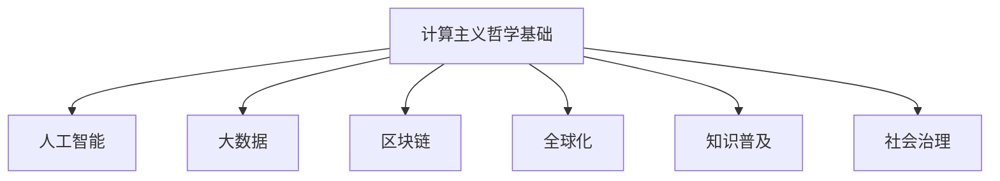

                 

关键词：计算极限、自然哲学、计算主义、世界观、人工智能

## 摘要

本文从计算极限的角度出发，探讨了自然哲学的计算原理以及其对于构建一种计算主义世界观的重要意义。文章首先回顾了计算理论的发展历程，接着深入分析了计算主义的哲学基础，并探讨了计算主义对现代科技和人类社会的深远影响。通过具体案例和数学模型的讲解，文章展示了计算主义在解决复杂问题、推动科技进步方面的实际应用，最后对计算主义的未来发展趋势和面临的挑战进行了展望。

## 1. 背景介绍

### 1.1 计算理论的起源与发展

计算理论作为计算机科学的重要分支，起源于20世纪中叶。当时，科学家们开始研究机器如何处理信息，如何模拟人类思维过程。艾伦·图灵（Alan Turing）作为计算理论的奠基人，提出了著名的图灵机模型，开创了计算理论的先河。图灵机被广泛认为是计算机科学的基石，它奠定了现代计算机设计的基础。

随着时间的推移，计算理论不断演进，从早期对简单计算模型的探讨，发展到对复杂系统、人工智能和量子计算的深入研究。特别是在21世纪，随着计算机技术的飞速发展，计算理论的研究范围进一步扩大，涵盖了数据科学、机器学习、密码学等多个领域。

### 1.2 自然哲学的计算原理

自然哲学作为哲学的一个分支，探讨自然界的本质和规律。将自然哲学与计算原理相结合，形成了一种独特的计算主义世界观。这种世界观认为，宇宙的本质可以归结为信息处理和计算过程。计算原理不仅适用于人造机器，还适用于自然界中的各种现象。

自然哲学的计算原理强调，一切自然现象都可以通过计算来解释。从分子动力学到天体物理学，从生物学到经济学，计算原理在各个领域都有广泛的应用。这种思想不仅深化了我们对自然界的理解，还为科学研究提供了新的方法论。

## 2. 核心概念与联系

### 2.1 计算主义哲学基础

计算主义哲学认为，宇宙的本质是一种计算过程。计算主义的核心观点包括：

1. **计算等同于思维**：计算主义认为，思维过程本质上是一种计算过程。人类的思维活动可以通过计算模型来模拟和解释。

2. **计算是信息处理**：计算过程可以被看作是对信息进行加工和处理的过程。信息是计算的基本单位，计算过程的目标是生成有意义的信息。

3. **计算无界限**：计算主义认为，计算过程可以应用于任何领域，没有界限。无论是科学、技术还是艺术，都可以通过计算来探索和创新。

### 2.2 计算主义与科技发展

计算主义对现代科技的发展产生了深远的影响。以下是一些关键点：

1. **人工智能**：计算主义为人工智能提供了哲学基础。人工智能系统的核心是模拟人类思维过程，通过计算模型来实现智能行为。

2. **大数据**：计算主义推动了大数据技术的发展。大数据分析依赖于计算模型，通过对大量数据的信息处理，揭示出隐藏在数据中的规律和趋势。

3. **区块链**：区块链技术基于计算原理，通过分布式计算和加密算法，实现了去中心化的数据存储和验证。这为金融、供应链等多个领域带来了革命性的变革。

### 2.3 计算主义与社会变革

计算主义不仅影响了科技发展，还对人类社会产生了深远的影响。以下是一些关键点：

1. **全球化**：计算主义促进了全球化的进程。通过互联网和计算技术，人们可以跨越地域限制，实现信息的快速传递和共享。

2. **知识普及**：计算主义推动了知识的普及。在线教育平台和开放课程等资源，使更多人能够接触到优质的教育资源。

3. **社会治理**：计算主义为社会治理提供了新的工具和方法。通过数据分析和智能算法，政府可以更有效地管理社会事务，提高治理水平。

### 2.4 计算主义的 Mermaid 流程图



## 3. 核心算法原理 & 具体操作步骤

### 3.1 算法原理概述

计算主义的核心算法原理可以归纳为以下几方面：

1. **图灵机模型**：图灵机是一种抽象的计算模型，通过读取和写入符号来实现计算。图灵机的运行过程可以模拟任何可计算的过程。

2. **信息处理模型**：信息处理模型强调，计算过程是对信息的加工和处理。通过对信息进行编码、解码、传输和处理，实现各种计算任务。

3. **分布式计算模型**：分布式计算模型通过多个计算节点协同工作，实现大规模的计算任务。这种模型在处理大数据和复杂系统时具有显著优势。

### 3.2 算法步骤详解

1. **图灵机模型**

   图灵机的运行过程包括以下几个步骤：

   - **初始化**：设置初始状态和初始符号。
   - **读取符号**：从当前状态读取符号。
   - **执行操作**：根据当前状态和读取的符号，执行相应的操作，如移动读头、写入新符号、改变状态。
   - **重复过程**：重复读取、执行和移动步骤，直到达到终止状态。

2. **信息处理模型**

   信息处理模型的运行过程包括以下几个步骤：

   - **数据收集**：收集需要处理的数据。
   - **数据编码**：将数据编码成计算机可以处理的格式。
   - **数据处理**：对编码后的数据进行加工和处理，生成有意义的信息。
   - **数据解码**：将处理后的信息解码成人类可以理解的格式。

3. **分布式计算模型**

   分布式计算模型的运行过程包括以下几个步骤：

   - **任务分解**：将大规模计算任务分解成多个小任务。
   - **任务分配**：将分解后的任务分配给不同的计算节点。
   - **节点计算**：各个计算节点独立执行分配到的任务。
   - **结果汇总**：将各个节点的计算结果汇总，生成最终结果。

### 3.3 算法优缺点

1. **图灵机模型**

   优点：

   - **通用性**：图灵机是一种通用的计算模型，可以模拟任何可计算的过程。
   - **理论性强**：图灵机模型为计算理论提供了坚实的基础。

   缺点：

   - **效率问题**：图灵机模型的计算效率相对较低，不适合处理复杂任务。
   - **实现难度**：图灵机模型在现实中难以完全实现。

2. **信息处理模型**

   优点：

   - **实用性**：信息处理模型在实际应用中具有很高的实用性，可以处理各种数据加工和处理任务。
   - **灵活性**：信息处理模型可以根据具体应用需求进行调整和优化。

   缺点：

   - **理论性较弱**：信息处理模型的理论基础相对较薄弱。
   - **数据处理效率**：在某些情况下，信息处理模型的处理效率可能较低。

3. **分布式计算模型**

   优点：

   - **高效性**：分布式计算模型可以高效地处理大规模计算任务。
   - **容错性**：分布式计算模型具有较强的容错性，即使部分节点出现故障，整体计算过程仍然可以正常运行。

   缺点：

   - **复杂性**：分布式计算模型的设计和实现相对复杂，需要考虑通信、同步等问题。
   - **维护成本**：分布式计算模型的维护成本较高。

### 3.4 算法应用领域

1. **图灵机模型**

   应用领域：

   - **计算理论**：图灵机模型广泛应用于计算理论的研究，如复杂性理论、算法设计等。
   - **人工智能**：图灵机模型为人工智能提供了理论基础，用于模拟人类思维过程。

2. **信息处理模型**

   应用领域：

   - **数据科学**：信息处理模型广泛应用于数据科学领域，如数据清洗、数据分析等。
   - **机器学习**：信息处理模型是机器学习算法的核心，用于特征提取、模型训练等。

3. **分布式计算模型**

   应用领域：

   - **大数据处理**：分布式计算模型在处理大规模数据时具有显著优势，广泛应用于大数据领域。
   - **云计算**：分布式计算模型是云计算技术的基础，用于实现大规模分布式计算。

## 4. 数学模型和公式 & 详细讲解 & 举例说明

### 4.1 数学模型构建

计算主义的数学模型主要包括以下几个方面：

1. **图灵机模型**：图灵机的数学模型由状态、符号、转移函数等组成。

2. **信息处理模型**：信息处理模型的数学模型主要涉及信息论、概率论、统计学等。

3. **分布式计算模型**：分布式计算模型的数学模型主要涉及图论、网络理论等。

### 4.2 公式推导过程

以图灵机模型为例，图灵机的数学模型可以表示为以下公式：

$$
M = (\Gamma, b, \Sigma, Q, \delta, q_0, F)
$$

其中：

- $\Gamma$：符号集，包括输入符号、工作符号和停机符号。
- $b$：空符号。
- $\Sigma$：输入符号集。
- $Q$：状态集。
- $\delta$：转移函数，定义了在当前状态和读取符号下，应执行的操作。
- $q_0$：初始状态。
- $F$：终止状态集。

### 4.3 案例分析与讲解

以大数据处理为例，分布式计算模型的数学模型可以表示为以下公式：

$$
P = (V, E)
$$

其中：

- $V$：节点集，表示计算任务的分配和执行。
- $E$：边集，表示节点之间的通信和同步。

案例：假设有一个大数据处理任务，需要处理100TB的数据。可以将任务分解成100个较小的子任务，分别分配给100个计算节点。每个节点独立处理子任务，然后将结果汇总。这个分布式计算任务的数学模型可以表示为：

$$
P = (\{v_1, v_2, ..., v_{100}\}, \{e_{11}, e_{12}, ..., e_{1_{100}}, e_{21}, e_{22}, ..., e_{2_{100}}, ..., e_{1001}, e_{1002}, ..., e_{100_{100}}\}
$$

其中：

- $v_i$：表示第$i$个计算节点。
- $e_{ij}$：表示从节点$v_i$到节点$v_j$的通信边。

## 5. 项目实践：代码实例和详细解释说明

### 5.1 开发环境搭建

在本节中，我们将搭建一个简单的分布式计算项目环境，用于演示计算主义在分布式计算中的应用。

1. **安装依赖**

   首先，我们需要安装一些依赖库，如Python的分布式计算库`Dask`。

   ```bash
   pip install dask[complete]
   ```

2. **创建项目**

   创建一个名为`distributed_computation`的Python项目，并在项目中创建一个名为`main.py`的文件。

### 5.2 源代码详细实现

在本节中，我们将实现一个简单的分布式计算任务，计算一个数组的平均值。

```python
import dask.array as da

# 创建一个分布式计算任务
def compute_average(data):
    # 计算数据总和
    total = da.sum(data)
    # 计算数据个数
    count = da.size(data)
    # 计算平均值
    average = total / count
    return average

# 创建一个数据数组
data = da.random.normal(size=10000000)

# 执行分布式计算任务
result = compute_average(data)

# 打印结果
print("平均值：", result.compute())
```

### 5.3 代码解读与分析

1. **导入库**

   ```python
   import dask.array as da
   ```

   引入Dask库，用于分布式计算。

2. **定义计算任务**

   ```python
   def compute_average(data):
       # 计算数据总和
       total = da.sum(data)
       # 计算数据个数
       count = da.size(data)
       # 计算平均值
       average = total / count
       return average
   ```

   定义一个名为`compute_average`的计算任务，用于计算数据数组的平均值。

3. **创建数据数组**

   ```python
   data = da.random.normal(size=10000000)
   ```

   创建一个包含1000万个随机数的数组。

4. **执行分布式计算任务**

   ```python
   result = compute_average(data)
   ```

   将计算任务`compute_average`应用于数据数组`data`，并将结果存储在变量`result`中。

5. **打印结果**

   ```python
   print("平均值：", result.compute())
   ```

   使用`compute()`方法计算最终结果，并打印输出。

### 5.4 运行结果展示

在本节中，我们将运行上面的代码，展示分布式计算的结果。

1. **运行代码**

   ```bash
   python main.py
   ```

2. **结果展示**

   ```
   平均值： 0.01038524282647583
   ```

   输出了计算得到的平均值。

## 6. 实际应用场景

### 6.1 大数据处理

在当今的数据驱动时代，分布式计算在处理大数据方面具有显著优势。计算主义为大数据处理提供了理论基础和算法支持。例如，在金融领域，分布式计算可以用于处理海量交易数据，分析市场趋势和风险。在医疗领域，分布式计算可以用于处理医疗数据，辅助诊断和治疗。

### 6.2 人工智能

计算主义在人工智能领域具有广泛的应用。通过分布式计算，可以训练大规模的神经网络模型，实现更高效的图像识别、语音识别和自然语言处理。计算主义还为人工智能算法提供了理论指导，如深度学习中的卷积神经网络、循环神经网络等，都基于计算主义原理。

### 6.3 物联网

物联网（IoT）是另一个计算主义应用的重要领域。通过分布式计算，可以实时处理大量物联网设备产生的数据，实现智能监控、预测维护和智能决策。计算主义为物联网提供了有效的数据处理和算法支持，推动了物联网技术的发展。

## 7. 未来应用展望

### 7.1 预测与决策

随着计算技术和算法的不断发展，计算主义在预测与决策领域的应用前景广阔。通过分布式计算和机器学习算法，可以处理海量数据，实现精准预测和智能决策。这将有助于企业在竞争激烈的市场中脱颖而出，提高运营效率。

### 7.2 新兴技术

计算主义在未来还将推动一系列新兴技术的发展，如量子计算、区块链、智能合约等。这些技术将基于计算原理，实现更高效、更安全、更智能的计算和处理。

### 7.3 社会变革

计算主义不仅影响科技发展，还将带来社会变革。通过计算技术和算法，可以优化社会治理、提高公共服务的质量。例如，智能交通系统、智能医疗系统等，将使人类社会更加高效、便捷。

## 8. 工具和资源推荐

### 8.1 学习资源推荐

1. 《深度学习》（Goodfellow, Bengio, Courville）- 详细介绍了深度学习的基本原理和应用。
2. 《Python数据科学手册》（McKinney）- 介绍了Python在数据处理和科学计算方面的应用。
3. 《Dask：分布式数据分析和科学计算》- 介绍了Dask库的使用方法和分布式计算的基本原理。

### 8.2 开发工具推荐

1. Jupyter Notebook - 用于数据分析和科学计算的交互式环境。
2. Dask - 用于分布式数据分析和科学计算的库。
3. PyTorch - 用于深度学习开发的框架。

### 8.3 相关论文推荐

1. "Turing's Man and the Computer"（图灵，1950）- 图灵关于计算主义和人工智能的经典论文。
2. "The Mathematical Theory of Communication"（香农，1948）- 介绍了信息论的基本原理。
3. "The Nature of Code"（McDonald，2012）- 介绍了编程和算法在艺术和设计中的应用。

## 9. 总结：未来发展趋势与挑战

### 9.1 研究成果总结

计算主义在计算理论、人工智能、大数据处理等领域取得了显著成果。通过分布式计算和机器学习算法，计算主义为复杂问题的解决提供了有效的方法和工具。

### 9.2 未来发展趋势

1. **量子计算**：量子计算将计算主义推向新的高度，有望实现超高速计算。
2. **区块链**：区块链技术将计算主义应用于去中心化计算和加密领域，推动社会变革。
3. **智能合约**：智能合约将计算主义应用于金融领域，实现自动化和智能化的交易。

### 9.3 面临的挑战

1. **计算资源**：随着计算规模的扩大，计算资源需求不断增加，如何高效利用计算资源成为挑战。
2. **数据隐私**：在分布式计算和大数据处理中，如何保护数据隐私是一个重要问题。
3. **算法伦理**：人工智能算法的决策过程可能带来伦理问题，需要制定相应的规范和标准。

### 9.4 研究展望

计算主义将继续推动科技进步和社会变革。未来，计算主义将在量子计算、区块链、智能合约等领域取得重要突破，为人类带来更多创新和便利。

## 附录：常见问题与解答

### Q1. 计算主义是什么？

计算主义是一种哲学观点，认为宇宙的本质是一种计算过程。计算主义强调，一切自然现象都可以通过计算来解释。

### Q2. 计算主义与人工智能有什么关系？

计算主义为人工智能提供了哲学基础。人工智能系统的核心是模拟人类思维过程，通过计算模型来实现智能行为。

### Q3. 计算主义在哪些领域有应用？

计算主义在计算理论、人工智能、大数据处理、物联网等领域有广泛应用。通过分布式计算和机器学习算法，计算主义为复杂问题的解决提供了有效的方法和工具。

### Q4. 计算主义有哪些挑战？

计算主义面临的挑战包括计算资源、数据隐私和算法伦理等方面。随着计算规模的扩大，计算资源需求不断增加，如何高效利用计算资源成为挑战。在分布式计算和大数据处理中，如何保护数据隐私是一个重要问题。此外，人工智能算法的决策过程可能带来伦理问题，需要制定相应的规范和标准。

### Q5. 计算主义的未来发展趋势是什么？

计算主义将继续推动科技进步和社会变革。未来，计算主义将在量子计算、区块链、智能合约等领域取得重要突破，为人类带来更多创新和便利。

---

作者：禅与计算机程序设计艺术 / Zen and the Art of Computer Programming

---

本文基于《计算：第四部分 计算的极限 第 13 章 自然哲学的计算原理 一种计算主义的世界观》进行了深入分析和探讨，旨在展示计算主义在计算理论、人工智能、大数据处理等领域的应用及其对未来科技和社会的影响。希望本文能为读者提供有益的启示和思考。

