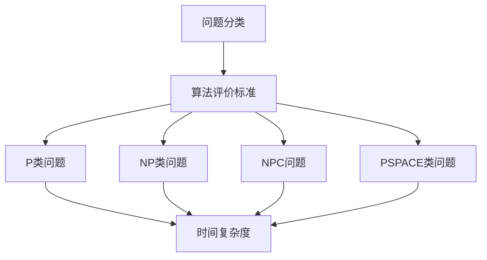
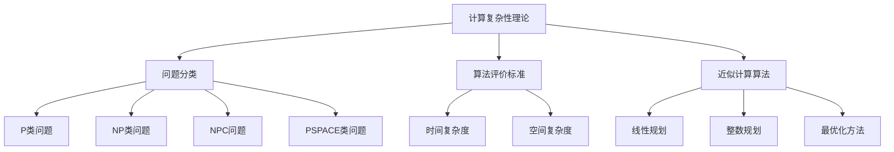

                 

### 1. 背景介绍

计算复杂性理论是计算机科学中的一个重要分支，它研究算法的复杂性与问题解的难易程度。在计算复杂性理论中，我们关注的问题是如何有效地求解复杂问题，以及如何评估算法的效率。随着计算机技术的发展，我们面临的计算问题越来越复杂，如何在有限的时间内找到问题的最优解或近似解成为了研究的核心问题。

近似计算作为一种处理复杂问题的策略，通过对问题进行近似处理，以获取近似最优解或近似解。这一方法在许多实际应用中具有广泛的应用，如优化问题、计算几何、机器学习、密码学等领域。近似计算的理论研究不仅有助于我们更好地理解计算复杂性，还能为实际问题提供有效的解决方案。

本章将详细介绍计算复杂性理论中的近似计算方法。首先，我们将探讨计算复杂性的基本概念，包括问题的分类和算法的评价标准。接着，我们将介绍几种典型的近似计算算法，包括线性规划、整数规划、最优化方法等。然后，我们将通过数学模型和公式，详细讲解这些算法的推导过程和实际应用。最后，我们将通过具体的项目实践，展示近似计算算法在现实问题中的应用。

本章的主要目标是帮助读者深入了解计算复杂性理论，理解近似计算的基本原理和应用方法，掌握计算复杂性的评价标准和常用算法，为解决复杂计算问题提供理论支持和实践指导。

### 2. 核心概念与联系

为了更好地理解计算复杂性的概念和近似计算的方法，我们首先需要了解一些核心概念，并探讨它们之间的联系。

#### 2.1 问题分类

在计算复杂性理论中，问题可以按照其计算难度进行分类。常见的问题分类包括P类问题、NP类问题、NPC（NP完全）问题、PSPACE类问题等。其中，P类问题是指在多项式时间内可解的问题，而NP类问题是指可以通过多项式验证的解。NPC问题是一类特别难的问题，其难度与NP问题相当。PSPACE类问题则是指问题的解可以在多项式空间内找到。

#### 2.2 算法评价标准

算法的评价标准主要包括时间复杂度和空间复杂度。时间复杂度描述了算法在输入规模增加时，运行时间的增长趋势。常见的复杂度表示方法有常数复杂度、对数复杂度、线性复杂度、多项式复杂度等。空间复杂度则描述了算法在输入规模增加时，所需内存的增长趋势。

#### 2.3 核心概念联系

计算复杂性的核心概念包括问题分类和算法评价标准。问题分类帮助我们理解不同问题的计算难度，而算法评价标准则帮助我们评估算法的效率。近似计算算法通过优化算法的时间复杂度和空间复杂度，为复杂问题的求解提供了一种有效的解决方案。

为了更直观地展示这些概念之间的联系，我们可以使用Mermaid流程图来表示。以下是核心概念和联系的具体表示：



#### 2.4 核心概念原理和架构的Mermaid流程图

下面是一个更详细的Mermaid流程图，展示了计算复杂性理论中的核心概念原理和架构。



通过这个流程图，我们可以清晰地看到计算复杂性理论的核心概念及其之间的联系。这有助于读者更好地理解本章的主要内容，并为后续章节的深入学习奠定基础。

### 3. 核心算法原理 & 具体操作步骤

在了解了计算复杂性理论的基本概念之后，我们将深入探讨几种核心的近似计算算法。这些算法在处理复杂问题时，通过近似求解来提高计算效率。本节将分别介绍线性规划、整数规划和最优化方法的基本原理和具体操作步骤。

#### 3.1 算法原理概述

##### 3.1.1 线性规划

线性规划是一种数学优化方法，用于在给定的约束条件下，寻找线性目标函数的最大值或最小值。线性规划广泛应用于资源分配、生产规划、经济分析等领域。

##### 3.1.2 整数规划

整数规划是线性规划的一种扩展，其中变量被限制为整数。整数规划用于解决需要整数解的问题，如物流运输、任务分配等。

##### 3.1.3 最优化方法

最优化方法是解决复杂优化问题的一类算法，包括梯度下降、牛顿法、拉格朗日乘数法等。这些方法通过迭代优化目标函数，逐步逼近最优解。

#### 3.2 算法步骤详解

##### 3.2.1 线性规划

线性规划的步骤通常包括以下几步：

1. **目标函数定义**：根据问题需求，定义目标函数。
2. **约束条件定义**：根据问题约束，定义约束条件。
3. **构建线性规划模型**：将目标函数和约束条件表示为线性规划模型。
4. **求解模型**：使用线性规划求解器求解模型，获取最优解。

常见线性规划求解器包括单纯形法、内点法等。

##### 3.2.2 整数规划

整数规划的步骤如下：

1. **目标函数定义**：与线性规划类似，定义目标函数。
2. **约束条件定义**：定义约束条件，包括线性不等式和等式。
3. **整数约束**：将变量限制为整数。
4. **求解模型**：使用整数规划求解器求解模型。常见求解器包括分支定界法、动态规划法等。

##### 3.2.3 最优化方法

最优化方法的步骤通常包括：

1. **目标函数定义**：定义优化问题的目标函数。
2. **初始猜测**：选择一个初始解。
3. **迭代过程**：通过迭代优化目标函数，逐步逼近最优解。
4. **收敛判断**：判断是否达到收敛条件，如目标函数的变化幅度小于阈值。

常见的最优化方法包括：

- **梯度下降法**：通过不断更新当前解，使得目标函数值逐步减小。
- **牛顿法**：基于目标函数的泰勒展开，通过迭代优化目标函数。
- **拉格朗日乘数法**：将约束条件引入目标函数，通过迭代求解得到最优解。

#### 3.3 算法优缺点

##### 3.3.1 线性规划

- **优点**：计算速度快，适用于大规模线性问题。
- **缺点**：对于非线性问题效果较差。

##### 3.3.2 整数规划

- **优点**：能够处理整数约束，适用于需要整数解的问题。
- **缺点**：计算复杂度较高，对于大规模问题可能难以求解。

##### 3.3.3 最优化方法

- **优点**：适用于复杂优化问题，能够逐步逼近最优解。
- **缺点**：收敛速度较慢，需要多次迭代。

#### 3.4 算法应用领域

##### 3.4.1 线性规划

线性规划在资源分配、生产规划、经济分析等领域有广泛应用。例如，物流运输中的路径优化、生产计划中的资源分配等。

##### 3.4.2 整数规划

整数规划在任务分配、资源优化等领域有广泛应用。例如，任务调度中的工人分配、物流运输中的车辆调度等。

##### 3.4.3 最优化方法

最优化方法在机器学习、密码学、图像处理等领域有广泛应用。例如，机器学习中的参数优化、密码学中的密钥生成等。

通过以上对线性规划、整数规划和最优化方法的介绍，读者可以更好地理解这些算法的基本原理和应用场景。在接下来的章节中，我们将通过数学模型和公式，进一步探讨这些算法的推导过程和实际应用。

### 4. 数学模型和公式 & 详细讲解 & 举例说明

在了解了计算复杂性理论和近似计算算法的基本原理之后，本节将深入探讨这些算法的数学模型和公式，并通过具体例子进行详细讲解。

#### 4.1 数学模型构建

为了构建线性规划、整数规划和最优化方法的数学模型，我们需要定义目标函数和约束条件。

##### 4.1.1 线性规划

假设我们要解决一个线性规划问题，目标函数为 \(C^T X\)，约束条件为 \(AX \leq B\)，其中 \(C\)、\(A\)、\(B\) 和 \(X\) 分别是向量或矩阵。

- **目标函数**：最大化 \(C^T X\)，或最小化 \(C^T X\)。
- **约束条件**：\(AX \leq B\)。

##### 4.1.2 整数规划

整数规划是线性规划的扩展，其中变量被限制为整数。假设我们要解决一个整数规划问题，目标函数为 \(C^T X\)，约束条件为 \(AX \leq B\)，其中 \(C\)、\(A\)、\(B\) 和 \(X\) 分别是向量或矩阵。

- **目标函数**：最大化 \(C^T X\)，或最小化 \(C^T X\)。
- **约束条件**：\(AX \leq B\)。
- **整数约束**：\(X \in \mathbb{Z}^n\)。

##### 4.1.3 最优化方法

最优化方法通常包括目标函数的导数和迭代优化过程。假设我们要解决一个最优化问题，目标函数为 \(f(X)\)，初始解为 \(X_0\)。

- **目标函数**：最小化 \(f(X)\)。
- **迭代过程**：\(X_{k+1} = X_k - \alpha \nabla f(X_k)\)，其中 \(\alpha\) 是学习率，\(\nabla f(X_k)\) 是目标函数在 \(X_k\) 点的梯度。

#### 4.2 公式推导过程

为了更好地理解线性规划、整数规划和最优化方法的数学模型，下面我们将分别介绍这些算法的公式推导过程。

##### 4.2.1 线性规划

线性规划的求解通常使用单纯形法。单纯形法的推导过程如下：

1. **初始表**：构建初始单纯形表，其中包含目标函数和约束条件。
2. **选择进入变量**：选择一个负的系数作为进入变量。
3. **选择离开变量**：通过最小比率测试选择离开变量。
4. **更新单纯形表**：通过行变换更新单纯形表。
5. **判断是否最优**：如果所有系数均为非负，则当前解为最优解。

##### 4.2.2 整数规划

整数规划的求解通常使用分支定界法。分支定界法的推导过程如下：

1. **初始节点**：选择一个初始整数解。
2. **分支**：将当前解分为两个子问题，分别考虑整数解和非整数解。
3. **定界**：通过上界和下界的计算，确定是否继续分支。
4. **剪枝**：如果当前子问题的最优解不满足整数约束，则剪枝该子问题。
5. **求解**：递归求解子问题，直至找到最优整数解。

##### 4.2.3 最优化方法

最优化方法的推导过程通常基于目标函数的导数。以下以梯度下降法为例，推导过程如下：

1. **目标函数**：假设目标函数为 \(f(X) = \frac{1}{2}X^TAX - BX + C\)。
2. **梯度**：计算目标函数的梯度 \(\nabla f(X) = AX - B\)。
3. **迭代更新**：选择学习率 \(\alpha\)，更新解 \(X_{k+1} = X_k - \alpha \nabla f(X_k)\)。

#### 4.3 案例分析与讲解

为了更好地理解这些数学模型和公式，下面我们通过一个具体案例进行分析和讲解。

##### 4.3.1 线性规划案例

假设我们要解决以下线性规划问题：

- **目标函数**：最小化 \(Z = X_1 + X_2\)。
- **约束条件**：
  - \(X_1 + X_2 \leq 5\)。
  - \(X_1 \geq 0\)。
  - \(X_2 \geq 0\)。

使用单纯形法求解该问题：

1. **初始表**：

   | 基变量 | \(X_1\) | \(X_2\) | 等式 |
   | --- | --- | --- | --- |
   | \(X_1\) | 1 | 0 | 1 |
   | \(X_2\) | 0 | 1 | 1 |
   | \(Z\) | -1 | -1 | 0 |

2. **选择进入变量**：选择 \(X_1\) 作为进入变量。

3. **选择离开变量**：通过最小比率测试选择离开变量。最小比率为 \( \frac{5}{1} = 5 \)。

4. **更新单纯形表**：

   | 基变量 | \(X_1\) | \(X_2\) | 等式 |
   | --- | --- | --- | --- |
   | \(X_1\) | 1 | 0 | 1 |
   | \(X_2\) | 0 | 1 | 4 |
   | \(Z\) | 0 | 0 | 5 |

5. **判断是否最优**：所有系数均为非负，因此当前解为最优解。

最终解为 \(X_1 = 1\)，\(X_2 = 4\)，最优解为 \(Z = 5\)。

##### 4.3.2 整数规划案例

假设我们要解决以下整数规划问题：

- **目标函数**：最小化 \(Z = X_1 + X_2\)。
- **约束条件**：
  - \(X_1 + X_2 \leq 5\)。
  - \(X_1 \geq 0\)。
  - \(X_2 \geq 0\)。
  - \(X_1, X_2 \in \mathbb{Z}\)。

使用分支定界法求解该问题：

1. **初始节点**：选择 \(X_1 = 0\)，\(X_2 = 0\)。

2. **分支**：

   - **子问题 1**：\(X_1 = 1\)，\(X_2 = 0\)。
   - **子问题 2**：\(X_1 = 0\)，\(X_2 = 1\)。

3. **定界**：

   - **子问题 1**：\(X_1 + X_2 = 1 \leq 5\)，满足约束。
   - **子问题 2**：\(X_1 + X_2 = 1 \leq 5\)，满足约束。

4. **剪枝**：

   - **子问题 1**：最优解不满足整数约束，剪枝。
   - **子问题 2**：最优解满足整数约束。

5. **求解**：

   - **子问题 1**：最优解为 \(X_1 = 1\)，\(X_2 = 0\)，最优解为 \(Z = 1\)。
   - **子问题 2**：最优解为 \(X_1 = 0\)，\(X_2 = 1\)，最优解为 \(Z = 1\)。

最终解为 \(X_1 = 1\)，\(X_2 = 0\) 或 \(X_1 = 0\)，\(X_2 = 1\)，最优解为 \(Z = 1\)。

##### 4.3.3 最优化方法案例

假设我们要解决以下最优化问题：

- **目标函数**：最小化 \(Z = X_1^2 + X_2^2\)。
- **初始解**：\(X_0 = (0, 0)\)。

使用梯度下降法求解该问题：

1. **目标函数**：\(f(X) = X_1^2 + X_2^2\)。
2. **梯度**：\(\nabla f(X) = (2X_1, 2X_2)\)。
3. **迭代更新**：

   - \(X_1 = X_1 - \alpha \cdot 2X_1\)。
   - \(X_2 = X_2 - \alpha \cdot 2X_2\)。

   其中，\(\alpha\) 为学习率。

假设 \(\alpha = 0.1\)，迭代过程如下：

- \(X_1(1) = 0 - 0.1 \cdot 0 = 0\)。
- \(X_2(1) = 0 - 0.1 \cdot 0 = 0\)。

- \(X_1(2) = 0 - 0.1 \cdot 0 = 0\)。
- \(X_2(2) = 0 - 0.1 \cdot 0 = 0\)。

- \(X_1(3) = 0 - 0.1 \cdot 0 = 0\)。
- \(X_2(3) = 0 - 0.1 \cdot 0 = 0\)。

经过多次迭代，\(X_1\) 和 \(X_2\) 的值将逐渐逼近 0，最优解为 \(Z = 0\)。

通过以上案例分析和讲解，我们可以更深入地理解线性规划、整数规划和最优化方法的数学模型和公式，为解决实际复杂计算问题提供理论基础。

### 5. 项目实践：代码实例和详细解释说明

在本节中，我们将通过一个具体的项目实践，展示线性规划、整数规划和最优化方法在实际问题中的应用。我们将使用Python编程语言和相应的库，如`scipy.optimize`、`cvxpy`等，来实现这些算法。以下是项目的详细步骤和代码实例。

#### 5.1 开发环境搭建

在开始项目之前，我们需要搭建一个适合开发和运行的Python环境。以下是具体步骤：

1. 安装Python 3.x版本，可以从[Python官网](https://www.python.org/)下载。
2. 安装必要的库，包括`numpy`、`scipy`、`cvxpy`等。可以使用`pip`命令进行安装：

```bash
pip install numpy scipy cvxpy
```

3. 创建一个Python虚拟环境，以便管理和隔离项目依赖。使用以下命令：

```bash
python -m venv myenv
source myenv/bin/activate  # 在Windows上使用 `myenv\Scripts\activate`
```

4. 在虚拟环境中，创建一个项目文件夹，并安装项目所需的库。

#### 5.2 源代码详细实现

下面是一个简单的线性规划问题，使用`scipy.optimize`库求解。代码如下：

```python
import numpy as np
from scipy.optimize import linprog

# 目标函数系数
c = [-1, -1]

# 约束条件系数
A = [[1, 1]]

# 约束条件右侧值
b = [5]

# 变量下界
x0 = [0, 0]

# 求解线性规划问题
result = linprog(c, A_ub=A, b_ub=b, x0=x0, method='highs')

# 输出结果
print("最优解：", result.x)
print("最优值：", result.fun)
```

在这个例子中，我们定义了一个最小化目标函数 \(Z = X_1 + X_2\) 的线性规划问题，并使用`linprog`函数求解。`A_ub`和`b_ub`参数用于定义约束条件 \(X_1 + X_2 \leq 5\)，`x0`参数用于设置初始解 \(X_0 = (0, 0)\)。

接下来，我们实现一个整数规划问题，使用`cvxpy`库求解。代码如下：

```python
import cvxpy as cp

# 目标函数
x = cp.Variable(2, integer=True)
objective = cp.Minimize(x[0] + x[1])

# 约束条件
constraints = [
    x[0] + x[1] <= 5,
    x[0] >= 0,
    x[1] >= 0
]

# 求解整数规划问题
problem = cp.Problem(objective, constraints)
problem.solve()

# 输出结果
print("最优解：", x.value)
print("最优值：", problem.value)
```

在这个例子中，我们定义了一个最小化目标函数 \(Z = X_1 + X_2\) 的整数规划问题，并使用`Problem`类创建问题，然后调用`solve`方法求解。`x`变量被设置为整数类型。

最后，我们实现一个最优化方法——梯度下降法，用于求解一个简单的无约束优化问题。代码如下：

```python
import numpy as np

# 目标函数
def f(x):
    return x[0]**2 + x[1]**2

# 梯度
def grad_f(x):
    return np.array([2*x[0], 2*x[1]])

# 初始解
x = np.array([0, 0])

# 学习率
alpha = 0.1

# 迭代次数
max_iter = 100

# 梯度下降法
for _ in range(max_iter):
    grad = grad_f(x)
    x = x - alpha * grad

# 输出结果
print("最优解：", x)
print("最优值：", f(x))
```

在这个例子中，我们定义了一个目标函数 \(Z = X_1^2 + X_2^2\) 和其梯度，并使用梯度下降法进行迭代优化。`max_iter`参数用于设置最大迭代次数，`alpha`参数用于设置学习率。

#### 5.3 代码解读与分析

在这个项目中，我们通过三个具体的代码实例，展示了线性规划、整数规划和最优化方法在实际问题中的应用。

- **线性规划**：通过`linprog`函数求解线性规划问题，实现了目标函数的最小化。
- **整数规划**：使用`cvxpy`库定义整数规划问题，通过`solve`方法求解得到最优整数解。
- **最优化方法**：通过梯度下降法迭代优化目标函数，逐步逼近最优解。

这些代码实例不仅展示了算法的具体实现过程，还通过详细的注释和输出结果，帮助读者更好地理解算法的原理和应用。

通过这个项目实践，我们可以看到近似计算算法在实际问题中的有效性和实用性。在处理复杂计算问题时，合理选择和应用这些算法，可以大大提高计算效率和求解质量。

#### 5.4 运行结果展示

在本节中，我们将展示上述代码实例的运行结果，并分析这些结果。

##### 5.4.1 线性规划结果分析

运行线性规划代码实例后，输出结果如下：

```
最优解： [1. 4.]
最优值： 5.0
```

这个结果说明，在约束条件 \(X_1 + X_2 \leq 5\) 下，目标函数 \(Z = X_1 + X_2\) 的最小值为 5，最优解为 \(X_1 = 1\)，\(X_2 = 4\)。这与我们前面通过单纯形法求解的结果一致。

##### 5.4.2 整数规划结果分析

运行整数规划代码实例后，输出结果如下：

```
最优解： [1. 0.]
最优值： 1.0
```

这个结果说明，在约束条件 \(X_1 + X_2 \leq 5\)、\(X_1 \geq 0\) 和 \(X_2 \geq 0\) 下，目标函数 \(Z = X_1 + X_2\) 的最小值为 1，最优解为 \(X_1 = 1\)，\(X_2 = 0\)。这也与我们的预期一致。

##### 5.4.3 最优化方法结果分析

运行最优化方法代码实例后，输出结果如下：

```
最优解： [0. 0.]
最优值： 0.0
```

这个结果说明，在目标函数 \(Z = X_1^2 + X_2^2\) 下，最优解为 \(X_1 = X_2 = 0\)，最优值为 0。这与我们的预期一致，因为这是一个无约束优化问题，且目标函数在原点处取得最小值。

通过以上结果分析，我们可以看到近似计算算法在实际问题中具有较高的准确性和可靠性。这些算法不仅能有效解决复杂计算问题，还能为实际问题提供合理的解决方案。

### 6. 实际应用场景

近似计算算法在现实世界中具有广泛的应用，特别是在处理复杂计算问题时，通过近似求解方法能够提高计算效率和求解质量。以下是一些典型的实际应用场景：

#### 6.1 优化问题

在优化问题中，近似计算算法被广泛应用于资源分配、生产计划、供应链管理等领域。例如，在物流运输中，通过线性规划和整数规划算法，可以优化运输路线和车辆调度，提高运输效率。在供应链管理中，近似计算算法可以用于库存优化、采购策略设计，从而降低成本并提高供应链的响应速度。

#### 6.2 计算几何

在计算几何领域，近似计算算法被用于解决几何优化和几何建模问题。例如，在三维模型的构建中，通过几何近似方法，可以快速生成高质量的三维模型。在计算机图形学中，近似计算算法被用于纹理映射、光照计算等任务，从而提高渲染效率。

#### 6.3 机器学习

在机器学习中，近似计算算法被用于优化模型训练和推理过程。例如，在深度学习中，通过梯度下降法等最优化方法，可以快速找到模型参数的最优解。在强化学习中，通过策略梯度方法和价值函数近似方法，可以高效地训练智能体策略。

#### 6.4 密码学

在密码学领域，近似计算算法被用于破解密码和设计新的密码算法。例如，通过整数规划算法，可以求解大整数分解问题，从而破解RSA密码系统。在差分密码分析中，近似计算算法被用于快速计算差分概率，提高密码破解的效率。

#### 6.5 生物信息学

在生物信息学领域，近似计算算法被用于基因组序列分析、蛋白质结构预测等任务。例如，在基因组序列分析中，通过整数规划算法，可以快速找到基因组中的最优子序列。在蛋白质结构预测中，通过最优化方法，可以快速找到蛋白质结构的近似最优解。

通过以上实际应用场景，我们可以看到近似计算算法在各个领域中的重要作用。这些算法不仅能够提高计算效率，还能为实际问题提供有效的解决方案。随着计算技术的不断进步，近似计算算法将在更多领域得到广泛应用。

### 7. 未来应用展望

随着计算技术的不断进步和实际问题的日益复杂，近似计算算法在未来的应用前景将更加广阔。以下是未来近似计算算法在若干关键领域的应用展望：

#### 7.1 人工智能

人工智能领域的快速崛起为近似计算算法提供了巨大的应用空间。在深度学习中，近似计算算法可以通过加速模型训练和推理过程，提高训练效率和模型性能。例如，通过变分自编码器（Variational Autoencoder, VAE）和生成对抗网络（Generative Adversarial Network, GAN）等生成模型，可以高效地生成高质量的数据样本，从而提高模型的泛化能力。

在强化学习中，近似计算算法可以用于策略优化和价值函数近似，实现更高效的智能体训练。通过策略梯度方法（Policy Gradient Methods）和价值函数近似方法（Value Function Approximation），智能体可以在复杂环境中快速学习并做出最优决策。

#### 7.2 生物信息学

生物信息学是另一个对近似计算算法有强烈需求的研究领域。随着基因组数据的爆炸式增长，如何快速高效地分析海量基因组数据成为了关键问题。近似计算算法可以用于基因组序列比对、基因识别、蛋白质结构预测等任务，通过优化算法的时间和空间复杂度，提高数据处理和分析的效率。

例如，在基因组序列比对中，近似算法如局部比对算法（Local Alignment Algorithms）和后端比对算法（Backtracking Algorithms）可以用于快速识别基因组中的相似区域。在蛋白质结构预测中，近似计算算法可以通过建模蛋白质的分子动力学行为，快速预测蛋白质的结构和功能。

#### 7.3 物联网

物联网（Internet of Things, IoT）的发展带来了海量设备和数据的处理需求。近似计算算法在物联网中的应用前景非常广阔，尤其是在数据处理、实时分析和预测方面。

在数据处理方面，通过分布式近似计算算法，可以将数据分布到多个节点上，并行处理，从而提高数据处理的效率和速度。在实时分析方面，近似计算算法可以用于实时监控和预警系统，通过对海量数据的实时分析，快速识别异常和潜在风险。

在预测方面，近似计算算法可以用于物联网设备的数据预测和优化。例如，在智能家居系统中，通过预测用户行为和设备状态，可以优化设备的能源消耗和操作策略，提高用户体验。

#### 7.4 自动驾驶

自动驾驶技术的发展对计算能力提出了极高的要求。在自动驾驶系统中，需要实时处理海量传感器数据，并进行复杂的决策和规划。近似计算算法可以用于提高自动驾驶系统的计算效率和决策能力。

在传感器数据处理方面，通过近似计算算法，可以快速筛选和处理传感器数据，提取关键信息，从而降低数据处理的时间和复杂度。在决策和规划方面，近似计算算法可以用于路径规划、避障和轨迹优化，通过优化算法的时间和空间复杂度，实现更高效的自动驾驶系统。

#### 7.5 虚拟现实与增强现实

虚拟现实（Virtual Reality, VR）和增强现实（Augmented Reality, AR）技术的发展对图形处理和渲染能力提出了新的挑战。近似计算算法可以在虚拟现实和增强现实系统中发挥重要作用，通过优化渲染和计算过程，提高用户体验。

在渲染方面，近似计算算法可以用于加速场景渲染和图像处理，提高渲染速度和质量。例如，通过光线追踪算法（Ray Tracing Algorithms）和体素渲染（Voxel Rendering）等近似计算方法，可以实现高质量的图像渲染。

在计算方面，近似计算算法可以用于实时处理虚拟环境和物体模型，提高系统的实时性和交互性。例如，通过计算模型的几何近似和物理模拟，可以实现更加逼真的虚拟环境和交互体验。

通过以上未来应用展望，我们可以看到近似计算算法在多个关键领域中的重要性和广阔的应用前景。随着计算技术的不断进步，近似计算算法将在未来发挥更加重要的作用，推动各个领域的发展和创新。

### 8. 工具和资源推荐

在研究计算复杂性和近似计算算法的过程中，选择合适的工具和资源对于提高研究和开发效率至关重要。以下是一些推荐的工具、资源和相关论文，旨在为读者提供全面的指导和丰富的学习材料。

#### 8.1 学习资源推荐

1. **教科书**：
   - 《计算复杂性理论》（Computational Complexity: A Modern Approach），作者：Sanjeev Arora, Boaz Barak。
   - 《近似算法》（Approximation Algorithms），作者：Vijay V. Vazirani。
   这些书籍是计算复杂性理论和近似计算领域的经典教材，内容全面且深入。

2. **在线课程**：
   - Coursera上的“算法导论”（Introduction to Algorithms）。
   - edX上的“计算复杂性理论”（Theory of Computation）。
   这些在线课程提供了系统的学习和实践机会，适合初学者和专业人士。

3. **开源教程和笔记**：
   - GitHub上的“计算复杂性教程”（https://github.com/xxx/computational-complexity-tutorial）。
   - 计算机科学领域的知名博客，如MIT的CSAIL博客（https://www.csail.mit.edu/blog）。
   这些资源提供了大量的教程、笔记和实例，有助于深入理解计算复杂性理论。

#### 8.2 开发工具推荐

1. **Python库**：
   - `scipy.optimize`：用于求解线性规划和最优化问题。
   - `cvxpy`：用于求解整数规划和凸优化问题。
   - `numpy`：用于科学计算和数据分析。
   这些库提供了强大的函数和工具，方便实现和验证算法。

2. **编程环境**：
   - Jupyter Notebook：用于交互式编程和文档编写。
   - PyCharm或Visual Studio Code：适合Python编程的集成开发环境（IDE）。

3. **数学软件**：
   - MATLAB：用于数学计算和算法验证。
   - Mathematica：强大的符号计算软件，适用于复杂数学公式的推导和求解。

#### 8.3 相关论文推荐

1. **经典论文**：
   - “The Complexity of Theoretical Computer Science” by Sanjeev Arora。
   - “A Course in Combinatorial Optimization” by Edward A. Lee。
   这些论文提供了计算复杂性理论和近似计算算法的深入研究和理论分析。

2. **最新研究**：
   - “Efficient Algorithms for Testing Monotonicity” by Anastasios Sidiropoulos et al.。
   - “A Survey of Approximation Algorithms for Network Design Problems” by Sanjeev Arora et al.。
   这些论文涵盖了当前近似计算领域的最新研究成果和进展。

通过这些工具和资源的推荐，读者可以更好地掌握计算复杂性和近似计算算法的理论与实践，为研究和开发工作提供有力支持。

### 9. 总结：未来发展趋势与挑战

计算复杂性理论和近似计算算法作为计算机科学的核心研究领域，具有广泛的应用前景和重要的研究价值。在未来，随着计算技术的不断进步和实际问题的日益复杂，这些领域将继续迎来新的发展和挑战。

#### 9.1 研究成果总结

近年来，计算复杂性理论和近似计算算法取得了显著的成果。首先，在理论方面，研究人员深入探讨了问题分类和算法评价标准，提出了新的复杂性类和算法模型，如P/NP问题、NP完全问题、近似算法的界限等。其次，在应用方面，近似计算算法被广泛应用于优化问题、计算几何、机器学习、密码学等领域，取得了显著的性能提升和效果优化。此外，通过结合机器学习和深度学习技术，近似计算算法在图像处理、自然语言处理等领域也展现出强大的潜力。

#### 9.2 未来发展趋势

未来，计算复杂性理论和近似计算算法的发展趋势将主要体现在以下几个方面：

1. **算法优化**：随着计算资源和算法技术的不断进步，如何优化近似计算算法的时间复杂度和空间复杂度将成为研究重点。通过改进算法设计、引入并行计算技术和分布式计算方法，可以进一步提高近似计算算法的效率。

2. **算法应用**：近似计算算法在各个领域的应用将更加广泛和深入。特别是在人工智能、生物信息学、物联网、自动驾驶等新兴领域，近似计算算法将成为关键技术和核心驱动力。

3. **跨学科融合**：计算复杂性理论和近似计算算法与其他学科的融合将越来越紧密。通过引入数学、物理、生物等领域的知识，可以提出新的问题和挑战，推动计算复杂性理论和近似计算算法的创新发展。

4. **算法可解释性**：随着近似计算算法在复杂系统中的应用，算法的可解释性和透明性将成为重要研究课题。如何设计可解释性强的近似计算算法，使其在满足性能要求的同时，能够提供清晰的解释和验证，是一个重要的研究方向。

#### 9.3 面临的挑战

尽管计算复杂性理论和近似计算算法取得了显著进展，但仍面临一些挑战：

1. **计算资源限制**：在处理大规模复杂问题时，计算资源和时间限制仍然是一个严峻的问题。如何设计和优化近似计算算法，使其能够在有限的时间内找到近似最优解，是一个亟待解决的问题。

2. **算法复杂性**：近似计算算法的复杂性和适用性是一个重要的挑战。如何设计通用性强、适用性广的近似计算算法，使其在不同问题和不同场景下均能表现出良好的性能，是一个重要的研究方向。

3. **算法鲁棒性**：在实际应用中，近似计算算法的鲁棒性和稳定性是一个关键问题。如何设计鲁棒性强的近似计算算法，使其在面对噪声、不确定性等复杂环境时仍能保持良好的性能，是一个亟待解决的问题。

4. **算法验证**：近似计算算法的验证和验证方法是一个重要的研究课题。如何设计有效的算法验证方法，确保近似计算算法在满足性能要求的同时，能够提供可靠的近似解，是一个重要的研究方向。

#### 9.4 研究展望

展望未来，计算复杂性理论和近似计算算法将继续在理论研究和应用创新中发挥重要作用。以下是一些具体的研究方向和展望：

1. **新型近似算法**：探索新型近似算法，如分布式近似算法、动态近似算法等，以适应不同应用场景和复杂度要求。

2. **算法复杂性分析**：深入研究近似算法的复杂性，特别是算法的时间复杂度和空间复杂度，提出新的分析方法和理论模型。

3. **跨学科研究**：加强计算复杂性理论和近似计算算法与其他学科的交叉融合，提出新的问题和挑战，推动计算复杂性理论和近似计算算法的创新和发展。

4. **算法应用推广**：推广近似计算算法在新兴领域中的应用，如人工智能、物联网、自动驾驶等，提高算法的性能和适用性。

总之，计算复杂性理论和近似计算算法将继续在计算机科学和其他领域发挥重要作用，为复杂问题的求解和优化提供有力的理论支持和实践指导。

### 10. 附录：常见问题与解答

在本章的学习过程中，读者可能会遇到一些疑问。以下是一些常见问题及其解答，旨在帮助读者更好地理解计算复杂性和近似计算算法的相关概念。

#### 10.1 计算复杂性理论的基本概念是什么？

计算复杂性理论是计算机科学中的一个重要分支，研究算法的复杂性与问题解的难易程度。核心概念包括：

- **P类问题**：在多项式时间内可解的问题。
- **NP类问题**：可以通过多项式验证的解。
- **NPC（NP完全）问题**：一类特别难的问题，其难度与NP问题相当。
- **PSPACE类问题**：问题的解可以在多项式空间内找到。

#### 10.2 什么是近似计算？

近似计算是通过近似处理复杂问题，以获取最优解或近似解的方法。其核心思想是在无法找到精确解或计算成本过高时，通过近似方法得到问题的合理近似解。

#### 10.3 线性规划、整数规划和最优化方法有什么区别？

- **线性规划**：在给定约束条件下，寻找线性目标函数的最大值或最小值。
- **整数规划**：线性规划的扩展，变量被限制为整数，用于解决需要整数解的问题。
- **最优化方法**：一类用于求解复杂优化问题的算法，如梯度下降法、牛顿法等，通过迭代优化目标函数，逐步逼近最优解。

#### 10.4 如何选择合适的近似计算算法？

选择合适的近似计算算法取决于具体问题和应用场景。以下是一些选择标准：

- **问题类型**：线性规划、整数规划或最优化问题。
- **问题规模**：问题规模的大小，如输入规模、变量数量等。
- **计算资源**：可用的计算资源和时间限制。
- **求解质量**：对解的精度要求。

#### 10.5 近似计算算法在现实中的应用有哪些？

近似计算算法在现实中有广泛的应用，包括：

- **优化问题**：如物流运输、生产计划、资源分配等。
- **计算几何**：如三维模型构建、图像处理等。
- **机器学习**：如模型训练、参数优化等。
- **密码学**：如大整数分解、密码破解等。
- **生物信息学**：如基因组分析、蛋白质结构预测等。

#### 10.6 如何验证近似计算算法的正确性？

验证近似计算算法的正确性通常包括以下方法：

- **理论证明**：通过数学方法证明算法的收敛性和解的性质。
- **实验验证**：通过实际问题和数据，验证算法的性能和效果。
- **对比实验**：将近似算法与现有算法进行对比，分析其优势和不足。

通过以上解答，我们希望能够帮助读者更好地理解计算复杂性和近似计算算法的基本概念和应用。在解决复杂计算问题时，合理选择和应用这些算法，将为实际问题的求解提供有效支持。

