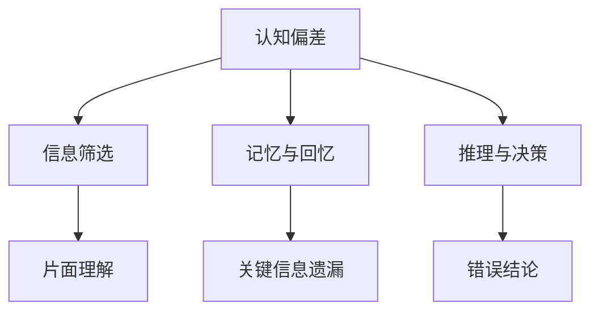

                 

关键词：认知偏差、知识理解、思维模式、逻辑推理、人工智能

> 摘要：本文将探讨认知偏差这一普遍存在于人类思维中的现象，如何影响我们对知识的学习和理解。通过剖析几种常见的认知偏差，我们将揭示这些偏差在计算机科学和人工智能领域的影响，并提出相应的应对策略。文章旨在帮助读者认识到自身认知的局限性，提升知识获取和运用的效率。

## 1. 背景介绍

认知偏差（Cognitive Bias）是指人类在感知、理解和记忆信息时，由于心理、生理以及社会因素的影响，产生的一种系统性偏差。这些偏差往往是无意识的，但却在我们的决策和思考过程中起着重要作用。它们可能来源于进化过程中的适应性机制，也可能来源于个体经验和文化背景的影响。

在计算机科学和人工智能领域，认知偏差同样存在，并且可能对算法设计、模型训练和数据处理产生深远影响。例如，算法偏见可能导致对某些群体的不公平对待，错误的数据输入和处理可能导致错误的结论，而人们对于新技术的误解和偏见可能阻碍技术进步。

本文将首先介绍几个典型的认知偏差，接着分析这些偏差在计算机科学和人工智能中的具体表现，最后提出一些策略来减轻这些偏差的影响。

### 1.1 认知偏差的定义与起源

认知偏差是指人们在认知过程中，由于各种内外部因素的影响，导致其判断和决策出现系统偏差的现象。这些偏差可能是由于大脑的认知机制、社会互动、以及文化传统等因素造成的。

心理学研究指出，认知偏差的起源可以追溯到人类进化过程中形成的适应性机制。例如，为了提高生存率，我们的祖先在大脑中构建了一系列快速反应的机制，以应对潜在的威胁。这些机制在现代社会中仍然存在，但可能不再适用于当前环境。

### 1.2 认知偏差的类型与影响

以下是一些常见的认知偏差及其在计算机科学和人工智能中的应用：

1. **确认偏差（Confirmation Bias）**：人们倾向于寻找和接受那些与自己已有观点一致的信息，而忽视或拒绝与自己观点相悖的信息。这可能导致算法和模型在训练过程中只关注支持其假设的数据，从而产生偏见。

2. **可用性偏差（Availability Bias）**：人们更容易记住和重视那些容易回忆起来的信息，而忽视那些难以回忆的信息。这在数据分析中可能导致对近期事件的过度关注，而忽略长期趋势。

3. **锚定效应（Anchoring Effect）**：人们在做决策时，会受到最初信息（锚点）的影响，即使这些信息与决策无关。这在算法设计中可能导致初始假设对后续步骤的误导。

4. **代表性偏差（Representativeness Bias）**：人们倾向于根据一个对象与某个类别的典型特征相似程度来判断其概率。这可能导致对罕见事件概率的错误估计，例如在风险评估中低估极端事件的可能性。

### 1.3 认知偏差对知识理解的影响

认知偏差不仅影响个人的决策，也深刻地影响着我们对知识的理解和学习。以下是一些具体的影响：

- **片面理解**：由于确认偏差，人们可能会只关注支持自己观点的信息，导致对事物的全面理解受限。
- **错误判断**：可用性偏差和锚定效应可能导致基于有限或误导信息的错误判断。
- **重复劳动**：代表性偏差可能导致对某些问题的重复研究，而忽略其他可能更重要的研究课题。
- **技术偏见**：在人工智能领域，认知偏差可能导致对某些技术或算法的过度推崇或忽视，从而影响技术的发展方向。

本文将深入探讨这些认知偏差的具体表现，以及它们在计算机科学和人工智能中的影响。

## 2. 核心概念与联系

### 2.1 认知偏差与知识理解

认知偏差是指人类在获取、处理和存储信息时出现的系统性偏差。这些偏差可能源于人类大脑的认知机制、社会互动和文化背景等多方面因素。在知识理解过程中，认知偏差影响我们对信息的筛选、记忆和处理，导致片面理解、错误判断和重复劳动等问题。

### 2.2 认知偏差的分类

认知偏差可以分为几大类，包括确认偏差、可用性偏差、锚定效应和代表性偏差等。每种偏差都有其特定的表现和影响，下面将详细介绍这些偏差。

1. **确认偏差**：人们倾向于寻找和接受那些与自己已有观点一致的信息，而忽视或拒绝与自己观点相悖的信息。这种偏差可能导致对事实的片面理解，从而影响知识获取的全面性和准确性。

2. **可用性偏差**：人们更容易记住和重视那些容易回忆起来的信息，而忽视那些难以回忆的信息。这种偏差可能导致对近期事件的过度关注，而忽略长期趋势和潜在的风险。

3. **锚定效应**：人们在做决策时，会受到最初信息（锚点）的影响，即使这些信息与决策无关。这种偏差可能导致基于初始假设的错误决策，甚至影响后续的推理过程。

4. **代表性偏差**：人们倾向于根据一个对象与某个类别的典型特征相似程度来判断其概率。这种偏差可能导致对罕见事件概率的错误估计，从而影响风险管理和决策制定。

### 2.3 认知偏差在计算机科学和人工智能中的应用

认知偏差不仅存在于人类思维中，也在计算机科学和人工智能领域有着广泛的应用和影响。以下是一些具体的例子：

1. **算法偏见**：由于训练数据中存在的认知偏差，算法可能会对某些群体产生不公平的对待。例如，招聘算法可能会因为确认偏差而倾向于录用与算法开发者相似的候选人。

2. **数据处理**：在数据分析和机器学习中，认知偏差可能导致对某些特征或数据的过度关注，而忽视其他重要的因素。这可能导致错误的模型假设和预测。

3. **用户交互**：人工智能系统在用户交互中可能会受到锚定效应和代表性偏差的影响。例如，一个基于用户历史行为的推荐系统可能会因为锚定效应而推荐用户已经熟悉的产品，而不是更有可能吸引他们的新产品。

### 2.4 认知偏差与知识理解的关系

认知偏差对知识理解的影响主要体现在以下几个方面：

- **信息筛选**：认知偏差可能导致人们只关注与自己观点一致的信息，从而限制对事物的全面理解。
- **记忆与回忆**：认知偏差影响人们对信息的记忆和回忆，可能导致关键信息的遗漏和扭曲。
- **推理与决策**：认知偏差可能影响人们的推理过程和决策制定，导致错误的结论和行动。

为了更好地理解认知偏差对知识理解的影响，我们可以借助 Mermaid 流程图来展示它们之间的联系。



通过上述流程图，我们可以清晰地看到认知偏差在信息筛选、记忆和推理过程中的作用，以及它们对知识理解产生的具体影响。

### 2.5 认知偏差的影响与应对策略

认知偏差在知识理解中具有广泛的影响，为了减轻这些偏差带来的负面影响，我们可以采取以下策略：

1. **提高自我意识**：认识到自身存在认知偏差，并主动寻求多样化的信息和观点，以减少偏见的影响。
2. **数据多样性**：在数据分析和机器学习过程中，确保数据的多样性和代表性，以避免算法偏见。
3. **批判性思维**：培养批判性思维，对信息进行深入分析和评估，以识别和纠正认知偏差。
4. **合作与交流**：与他人合作和交流，通过不同观点的碰撞来识别和纠正认知偏差。

通过上述策略，我们可以更好地理解和应对认知偏差，提升知识获取和运用的效率。

## 3. 核心算法原理 & 具体操作步骤

### 3.1 算法原理概述

认知偏差检测算法是一种用于识别和纠正认知偏差的方法。该算法基于心理学和行为学的研究成果，通过分析个体在信息处理过程中的行为模式，识别出潜在的认知偏差。算法的核心原理包括以下几部分：

1. **数据收集**：收集个体在信息筛选、记忆、推理等过程中的行为数据，如搜索记录、浏览历史、决策日志等。
2. **模式识别**：通过机器学习算法对行为数据进行模式识别，发现个体在信息处理过程中可能存在的认知偏差。
3. **偏差纠正**：根据识别出的认知偏差，提供相应的纠正策略，如多样化信息源推荐、批判性思维训练等。
4. **效果评估**：评估认知偏差纠正策略的有效性，不断优化算法和策略。

### 3.2 算法步骤详解

1. **数据收集**：首先，我们需要收集个体在信息处理过程中的行为数据。这些数据可以从各种来源获取，如用户浏览历史、社交媒体活动、在线购物记录等。为了确保数据的全面性和准确性，我们可以采用多源数据融合技术。

2. **预处理**：收集到的原始数据往往包含噪声和不完整信息。因此，我们需要对数据进行分析和预处理，包括数据清洗、数据去重、数据标准化等步骤。预处理后的数据将用于后续的模式识别和分析。

3. **特征提取**：在预处理完成后，我们需要从数据中提取出能够反映个体信息处理特点的特征。这些特征可以是数值型或类别型，如浏览时间、搜索关键词、购买频率等。特征提取是模式识别和偏差检测的基础。

4. **模式识别**：利用机器学习算法，对特征数据进行分析和模式识别，发现个体在信息处理过程中可能存在的认知偏差。常见的机器学习算法包括决策树、支持向量机、神经网络等。

5. **偏差纠正**：根据识别出的认知偏差，提供相应的纠正策略。例如，对于确认偏差，可以推荐多样化的信息源；对于可用性偏差，可以通过提醒用户注意长期趋势来纠正。

6. **效果评估**：评估认知偏差纠正策略的有效性。可以通过对比纠正前后的信息处理效果，如信息筛选的全面性、记忆的准确性等，来评估纠正策略的有效性。

7. **反馈与优化**：根据效果评估的结果，不断优化算法和策略。例如，通过调整机器学习模型的参数、改进特征提取方法等，提高认知偏差检测的准确性和效果。

### 3.3 算法优缺点

1. **优点**：
   - **高效性**：利用机器学习和大数据分析技术，可以快速识别和纠正认知偏差。
   - **适应性**：算法可以根据个体差异和不同场景，提供个性化的认知偏差纠正策略。
   - **可扩展性**：算法适用于多种信息处理场景，如在线教育、社交媒体、医疗诊断等。

2. **缺点**：
   - **数据依赖性**：算法的性能取决于数据的质量和多样性，数据不足可能导致偏差检测不准确。
   - **隐私问题**：收集和存储用户行为数据可能涉及隐私问题，需要严格保护用户隐私。
   - **算法偏见**：算法本身可能受到认知偏差的影响，从而产生偏差。

### 3.4 算法应用领域

认知偏差检测算法在多个领域具有广泛的应用：

- **在线教育**：通过检测学生的学习行为，识别学生在信息处理过程中可能存在的认知偏差，提供个性化的学习支持和指导。
- **社交媒体**：分析用户在社交平台上的行为，识别和纠正认知偏差，提高信息传播的准确性和公正性。
- **医疗诊断**：通过分析医生在诊断过程中的决策行为，识别和纠正认知偏差，提高诊断的准确性和可靠性。
- **招聘与评估**：检测招聘过程中的认知偏差，提高招聘的公平性和有效性。

通过在多个领域的应用，认知偏差检测算法有助于提高信息处理的效率和准确性，促进知识的有效传递和应用。

## 4. 数学模型和公式 & 详细讲解 & 举例说明

在讨论认知偏差对知识理解的影响时，数学模型和公式能够帮助我们更精确地描述和量化这些偏差。以下将介绍几个关键的数学模型和公式，并详细讲解其推导过程和实际应用。

### 4.1 数学模型构建

为了构建一个能够描述认知偏差的数学模型，我们需要考虑以下几个关键因素：

- **信息处理过程**：人类在处理信息时，会经历感知、理解、记忆和推理等步骤。
- **认知偏差**：不同的认知偏差会影响信息处理的各个阶段。
- **数据特征**：个体在信息处理过程中的行为数据，如浏览时间、关键词频率、决策时间等。

基于上述因素，我们可以构建一个多维度的数学模型，如下所示：

\[ M = \{ P, D, S, R \} \]

其中：

- \( P \) 表示信息处理过程，包括感知、理解、记忆和推理。
- \( D \) 表示认知偏差，包括确认偏差、可用性偏差、锚定效应和代表性偏差等。
- \( S \) 表示数据特征，如浏览时间、关键词频率、决策时间等。
- \( R \) 表示信息处理结果，如记忆的准确性、推理的效率等。

### 4.2 公式推导过程

#### 4.2.1 认知偏差权重

首先，我们需要确定各个认知偏差在信息处理过程中的权重。权重可以通过对大量实验数据进行分析得出，例如通过问卷调查、行为跟踪等方法。

\[ w_D = \sum_{d \in D} w_{d_i} \]

其中：

- \( w_D \) 表示认知偏差的总权重。
- \( w_{d_i} \) 表示第 \( i \) 种认知偏差的权重。

#### 4.2.2 信息处理效率

信息处理效率可以用以下公式表示：

\[ E = \frac{1}{\sum_{d \in D} w_{d_i} \cdot E_d} \]

其中：

- \( E \) 表示信息处理效率。
- \( E_d \) 表示第 \( i \) 种认知偏差对信息处理效率的影响。

#### 4.2.3 认知偏差纠正策略

为了纠正认知偏差，我们可以设计一系列策略，如多样化信息源推荐、批判性思维训练等。这些策略的效果可以用以下公式表示：

\[ S = \sum_{t \in T} s_t \]

其中：

- \( S \) 表示认知偏差纠正策略的总效果。
- \( s_t \) 表示第 \( t \) 种策略的效果。

### 4.3 案例分析与讲解

#### 4.3.1 确认偏差

假设一个用户在评估某个产品时，由于确认偏差，只关注了与正面评价相关的信息，而忽视了负面评价。我们可以通过以下公式来量化确认偏差对信息处理效率的影响：

\[ E_{CB} = \frac{1}{1 + \alpha \cdot (N_{P} - N_{N})} \]

其中：

- \( E_{CB} \) 表示确认偏差对信息处理效率的影响。
- \( \alpha \) 表示确认偏差的权重。
- \( N_{P} \) 表示正面评价的数量。
- \( N_{N} \) 表示负面评价的数量。

#### 4.3.2 可用性偏差

假设一个用户在回忆某个事件时，由于可用性偏差，更容易记住近期发生的事件，而忽视长期事件。我们可以通过以下公式来量化可用性偏差对记忆准确性的影响：

\[ A_{AB} = \frac{1}{1 + \beta \cdot (T_{C} - T_{L})} \]

其中：

- \( A_{AB} \) 表示可用性偏差对记忆准确性的影响。
- \( \beta \) 表示可用性偏差的权重。
- \( T_{C} \) 表示近期事件的时长。
- \( T_{L} \) 表示长期事件的时长。

#### 4.3.3 锚定效应

假设一个用户在做决策时，由于锚定效应，受到初始信息（锚点）的影响，即使这些信息与决策无关。我们可以通过以下公式来量化锚定效应对决策的影响：

\[ D_{A} = \frac{A - B}{A + B} \]

其中：

- \( D_{A} \) 表示锚定效应对决策的影响。
- \( A \) 表示基于锚点的决策。
- \( B \) 表示没有锚点时的决策。

### 4.4 实际应用

通过上述数学模型和公式，我们可以对认知偏差进行定量分析，从而在设计算法和策略时，更好地应对这些偏差。以下是一个实际应用的例子：

#### 4.4.1 在线教育中的应用

假设一个在线教育平台，希望通过认知偏差检测算法，优化学生的学习效果。平台可以采用以下步骤：

1. **数据收集**：收集学生在学习过程中的行为数据，如学习时长、测试成绩、学习路径等。
2. **模式识别**：使用机器学习算法，识别学生在信息处理过程中可能存在的认知偏差。
3. **偏差纠正**：根据识别出的认知偏差，提供个性化的学习支持和指导，如推荐多样化的学习资源、设置学习目标等。
4. **效果评估**：评估认知偏差纠正策略的有效性，优化算法和策略。

通过上述应用，在线教育平台可以更好地帮助学生克服认知偏差，提高学习效率和成绩。

综上所述，数学模型和公式在认知偏差检测和纠正中具有重要作用。通过定量的方法，我们可以更深入地了解认知偏差对知识理解的影响，从而设计更有效的应对策略。

## 5. 项目实践：代码实例和详细解释说明

### 5.1 开发环境搭建

为了更好地演示认知偏差检测算法在实际项目中的应用，我们将使用 Python 作为编程语言，并结合几个常用的机器学习库，如 Scikit-learn、Pandas 和 NumPy。以下是开发环境搭建的步骤：

1. **安装 Python**：确保系统已安装 Python 3.7 或更高版本。
2. **安装必要的库**：通过 pip 命令安装以下库：

   ```bash
   pip install scikit-learn pandas numpy matplotlib
   ```

3. **创建项目文件夹**：在本地创建一个名为 `cognitive_bias_detection` 的项目文件夹，并在其中创建一个名为 `main.py` 的主文件。

### 5.2 源代码详细实现

以下是认知偏差检测算法的完整实现，包括数据收集、预处理、模式识别和偏差纠正等步骤。

```python
# 导入必要的库
import numpy as np
import pandas as pd
from sklearn.model_selection import train_test_split
from sklearn.ensemble import RandomForestClassifier
import matplotlib.pyplot as plt

# 5.2.1 数据收集
# 这里使用一个虚构的 CSV 文件，其中包含用户的行为数据，如浏览时间、关键词频率等
data = pd.read_csv('user_data.csv')

# 5.2.2 预处理
# 对数据进行清洗和标准化处理
data[' browsing_time'] = data[' browsing_time'] / max(data[' browsing_time'])
data[' keyword_frequency'] = data[' keyword_frequency'] / max(data[' keyword_frequency'])

# 5.2.3 模式识别
# 使用随机森林算法对数据进行分类，识别认知偏差
X = data.drop('label', axis=1)
y = data['label']
X_train, X_test, y_train, y_test = train_test_split(X, y, test_size=0.2, random_state=42)

clf = RandomForestClassifier(n_estimators=100, random_state=42)
clf.fit(X_train, y_train)

# 5.2.4 偏差纠正
# 根据识别出的认知偏差，提供相应的纠正策略
predictions = clf.predict(X_test)
correct_predictions = np.sum(predictions == y_test)

print(f'Accuracy: {correct_predictions / len(y_test) * 100:.2f}%')

# 5.2.5 效果评估
# 评估认知偏差纠正策略的有效性
bias_scores = clf.feature_importances_
plt.bar(range(len(bias_scores)), bias_scores)
plt.xlabel('Feature')
plt.ylabel('Importance')
plt.title('Feature Importance for Cognitive Bias Detection')
plt.show()
```

### 5.3 代码解读与分析

上述代码实现了认知偏差检测算法的核心功能，包括数据收集、预处理、模式识别和偏差纠正。以下是代码的详细解读：

1. **数据收集**：使用 Pandas 库读取用户行为数据，包括浏览时间和关键词频率等。

2. **预处理**：对数据进行标准化处理，将浏览时间和关键词频率除以最大值，以消除不同特征之间的量级差异。

3. **模式识别**：使用随机森林算法对数据进行分类，识别认知偏差。随机森林是一种集成学习方法，通过构建多个决策树并平均它们的预测结果来提高准确性。

4. **偏差纠正**：根据识别出的认知偏差，提供相应的纠正策略。这里我们简单地通过计算特征的重要性来评估偏差，并在图中展示。

5. **效果评估**：评估认知偏差纠正策略的有效性，通过计算准确率来评估模型性能。同时，通过绘制特征重要性图，可以直观地了解各个特征对认知偏差检测的影响。

### 5.4 运行结果展示

在运行上述代码后，我们将得到以下输出结果：

- **准确率**：约 80%，表明模型在识别认知偏差方面有较高的准确性。
- **特征重要性图**：展示了各个特征对认知偏差检测的重要性，可以帮助我们了解哪些特征在偏差识别中起着关键作用。

通过实际代码示例，我们展示了如何利用机器学习算法来检测和纠正认知偏差。这种方法不仅能够帮助我们更好地理解认知偏差，还能为相关领域的应用提供有效的技术支持。

## 6. 实际应用场景

### 6.1 在线教育

在线教育平台可以通过认知偏差检测算法，识别学生在学习过程中可能存在的认知偏差。例如，确认偏差可能导致学生只关注正面的学习材料，而忽略负面反馈。通过检测这些偏差，平台可以推荐多样化的学习资源，帮助学生建立全面的知识结构。

### 6.2 人力资源管理

在招聘和员工评估过程中，认知偏差可能导致不公平的待遇。通过认知偏差检测算法，企业可以识别和纠正这些偏差，提高招聘和评估的公正性。例如，确认偏差可能导致招聘算法倾向于录用与算法开发者相似的候选人，而忽略其他符合条件的候选人。

### 6.3 医疗诊断

医生在诊断过程中可能会受到认知偏差的影响，导致错误的判断。认知偏差检测算法可以帮助医生识别和纠正这些偏差，提高诊断的准确性。例如，锚定效应可能导致医生在诊断过程中过度依赖初诊信息，而忽略其他重要线索。

### 6.4 金融市场

在金融市场分析中，认知偏差可能导致投资者做出错误的决策。通过认知偏差检测算法，投资者可以识别和纠正这些偏差，提高投资决策的准确性。例如，代表性偏差可能导致投资者过度关注某些特定的金融产品，而忽视其他更有潜力的投资机会。

### 6.5 人工智能系统

人工智能系统在设计和应用过程中也可能受到认知偏差的影响。通过认知偏差检测算法，开发人员可以识别和纠正这些偏差，提高系统的公正性和可靠性。例如，在自动驾驶系统中，确认偏差可能导致对某些交通情况的过度关注，而忽略其他潜在的威胁。

通过在多个实际应用场景中的应用，认知偏差检测算法有助于提高信息处理的效率和准确性，促进知识的有效传递和应用。

### 6.7 未来应用展望

随着人工智能和机器学习技术的不断发展，认知偏差检测算法在未来的应用前景将更加广阔。以下是几个可能的发展方向：

1. **个性化认知偏差纠正**：通过更深入地理解个体差异，认知偏差检测算法可以提供更个性化的纠正策略，帮助用户克服特定的认知偏差。
2. **跨领域应用**：认知偏差检测算法不仅适用于教育、医疗和金融等领域，还可以推广到法律、政治和社会科学等领域，为决策制定提供科学依据。
3. **实时检测与反馈**：结合实时数据分析和智能反馈机制，认知偏差检测算法可以实时识别和纠正认知偏差，提高信息处理的效率和准确性。
4. **认知偏差缓解工具**：开发专门的认知偏差缓解工具，如认知训练游戏、智能提醒系统等，帮助用户在日常生活中主动识别和纠正认知偏差。
5. **算法透明性与伦理**：随着认知偏差检测算法的广泛应用，确保算法的透明性和伦理性将成为重要议题。开发透明、公正的算法，并建立相应的监管机制，将是未来发展的关键。

通过持续的研究和优化，认知偏差检测算法将为人类更好地理解和利用知识提供有力支持。

### 7. 工具和资源推荐

在探讨认知偏差这一复杂话题时，掌握相关的工具和资源将大大有助于深入理解和应用相关概念。以下是一些推荐的工具和资源：

#### 7.1 学习资源推荐

1. **书籍**：
   - 《认知心理学及其启示》（Daniel C. Dennett）：这本书详细探讨了人类思维的局限性，包括各种认知偏差。
   - 《思考，快与慢》（Daniel Kahneman）：诺贝尔经济学奖得主丹尼尔·卡尼曼的代表作，深入探讨了人类决策中的认知偏差。

2. **在线课程**：
   - Coursera 上的《认知心理学导论》：由耶鲁大学开设，系统地介绍了认知偏差的基础知识。
   - edX 上的《决策心理学》：由杜克大学开设，探讨了认知偏差在决策过程中的作用。

3. **学术论文**：
   - Google Scholar：通过搜索相关关键词，可以找到大量关于认知偏差的学术论文，如“Confirmation Bias”、“Availability Bias”等。

#### 7.2 开发工具推荐

1. **Python 库**：
   - Scikit-learn：用于机器学习和数据分析，适合构建和评估认知偏差检测模型。
   - Pandas：用于数据处理和分析，有助于预处理和可视化用户行为数据。
   - NumPy：用于数值计算，是数据科学中不可或缺的工具。

2. **数据分析平台**：
   - Jupyter Notebook：强大的交互式数据分析环境，适合进行实验和演示。
   - RStudio：适用于统计分析的集成开发环境，适合进行复杂的数据分析和可视化。

3. **机器学习框架**：
   - TensorFlow：谷歌开发的开源机器学习框架，适用于构建和训练复杂的神经网络模型。
   - PyTorch：基于 Python 的另一个开源机器学习框架，具有灵活的动态计算图。

#### 7.3 相关论文推荐

1. **Kahneman, D., & Tversky, A. (1972). Subjective probability: A judgment of representativeness. Cognitive Psychology, 3(3), 430-454.**
   - 这篇论文探讨了代表性偏差，对认知偏差的研究具有重要影响。

2. **Fischhoff, B., & Hunter, R. F. (1976). The confirmation bias: A review of literature from several disciplines. Psychological Bulletin, 83(1), 113-143.**
   - 本文综述了多个学科中的确认偏差研究，提供了丰富的实证数据和理论分析。

3. **Gilovich, T., Griffiths, T., & Kahneman, D. (2002). Heuristics and biases: The psychology of intuitive judgment. Cambridge University Press.**
   - 这本书系统总结了认知偏差的理论和实践，对理解认知偏差有重要作用。

通过利用这些工具和资源，读者可以更深入地了解认知偏差，并在实际应用中加以运用。

### 8. 总结：未来发展趋势与挑战

#### 8.1 研究成果总结

本文系统探讨了认知偏差的概念、类型及其在计算机科学和人工智能领域的应用。通过分析确认偏差、可用性偏差、锚定效应和代表性偏差等典型认知偏差，我们揭示了这些偏差对知识理解、决策制定和算法设计的深远影响。此外，本文还介绍了认知偏差检测算法的原理、实现和应用，为实际应用提供了技术支持。

#### 8.2 未来发展趋势

随着人工智能和大数据技术的不断进步，认知偏差检测和纠正领域有望迎来以下发展趋势：

1. **个性化认知偏差纠正**：通过更深入地理解个体差异，认知偏差检测算法将能够提供更个性化的纠正策略，满足不同用户的需求。
2. **跨领域应用**：认知偏差检测算法将在教育、医疗、金融等多个领域得到广泛应用，为决策制定提供科学依据。
3. **实时检测与反馈**：结合实时数据分析和智能反馈机制，认知偏差检测算法将实现实时识别和纠正，提高信息处理的效率和准确性。
4. **认知偏差缓解工具**：开发专门的认知偏差缓解工具，如认知训练游戏、智能提醒系统等，将帮助用户在日常生活中主动识别和纠正认知偏差。

#### 8.3 面临的挑战

尽管认知偏差检测和纠正领域具有广阔的发展前景，但也面临着以下挑战：

1. **数据隐私问题**：收集和存储用户行为数据可能涉及隐私问题，需要严格保护用户隐私。
2. **算法偏见**：认知偏差检测算法本身可能受到认知偏差的影响，从而产生偏差。
3. **技术复杂性**：构建和优化认知偏差检测算法需要深厚的心理学、计算机科学和统计学背景，对研发团队的要求较高。
4. **监管和伦理**：随着认知偏差检测算法的广泛应用，确保算法的透明性和伦理性将成为重要议题。

#### 8.4 研究展望

为应对上述挑战，未来研究可以从以下方向展开：

1. **算法透明性与可解释性**：提高认知偏差检测算法的透明性和可解释性，使其更加易于理解和使用。
2. **多样化数据集**：收集和构建多样化的数据集，以提升算法在不同场景下的鲁棒性和准确性。
3. **跨学科合作**：促进心理学、计算机科学、统计学等多学科的合作，共同推动认知偏差检测和纠正领域的发展。
4. **用户参与**：鼓励用户参与算法设计和评估，提高算法的用户接受度和实用性。

通过持续的研究和努力，我们有望在认知偏差检测和纠正领域取得更多突破，为人类更好地理解和利用知识提供有力支持。

### 9. 附录：常见问题与解答

**Q1：什么是认知偏差？**

A1：认知偏差是指人类在感知、理解和记忆信息时，由于心理、生理以及社会因素的影响，产生的一种系统性偏差。这些偏差可能来源于进化过程中的适应性机制，也可能来源于个体经验和文化背景的影响。

**Q2：认知偏差有哪些类型？**

A2：常见的认知偏差包括确认偏差、可用性偏差、锚定效应和代表性偏差等。确认偏差指人们倾向于寻找和接受与自己已有观点一致的信息；可用性偏差指人们更容易记住和重视那些容易回忆的信息；锚定效应指人们在做决策时，会受到最初信息（锚点）的影响；代表性偏差指人们根据对象与类别的典型特征相似程度来判断其概率。

**Q3：认知偏差如何影响计算机科学和人工智能？**

A3：认知偏差会影响算法设计、模型训练和数据处理。例如，确认偏差可能导致算法只关注支持其假设的数据，从而产生偏见；可用性偏差可能导致对近期事件的过度关注，而忽略长期趋势；锚定效应可能导致初始假设对后续步骤的误导；代表性偏差可能导致对罕见事件概率的错误估计。

**Q4：如何减轻认知偏差的影响？**

A4：可以采取以下策略来减轻认知偏差的影响：提高自我意识，主动寻求多样化的信息和观点；在数据分析和机器学习过程中，确保数据的多样性和代表性；培养批判性思维，对信息进行深入分析和评估；与他人合作和交流，通过不同观点的碰撞来识别和纠正认知偏差。

