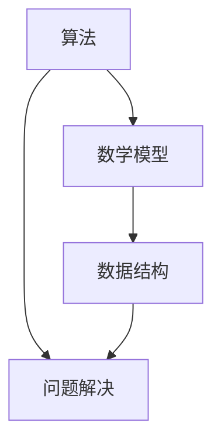

                 

关键词：认知发展、深刻简洁、算法、数学模型、代码实例、应用场景、未来展望

> 摘要：本文旨在探讨认知发展过程中的一个重要阶段——深刻简洁阶段。通过分析该阶段的核心概念与联系，揭示核心算法原理与操作步骤，结合数学模型与公式推导，提供项目实践中的代码实例和详细解释，最后讨论其实际应用场景以及未来的发展趋势和挑战。

## 1. 背景介绍

认知发展是心理学和神经科学的重要研究课题，近年来随着人工智能的兴起，对认知发展的研究逐渐深入到算法层面。深刻简洁阶段作为认知发展中的一个关键阶段，其核心在于通过简洁的算法和数学模型来解决问题。本文将从理论到实践，全面探讨这一阶段的概念、原理和应用。

### 认知发展的阶段

认知发展理论认为，个体的认知能力是逐渐发展的，通常可以分为以下几个阶段：

1. **感知阶段**：个体通过感官接收外部信息。
2. **理解阶段**：个体对信息进行处理和解释。
3. **抽象阶段**：个体能够从具体情境中抽象出一般规律。
4. **深刻简洁阶段**：个体在抽象的基础上，运用简洁的算法和数学模型来解决复杂问题。

深刻简洁阶段是认知发展的高级阶段，它强调的是对复杂问题的简洁、高效处理。

### 算法的简洁性

算法的简洁性是深刻简洁阶段的核心特征。一个简洁的算法能够以最少的步骤和资源解决复杂问题，体现了人类认知的本质——通过简化和抽象来提高效率。

## 2. 核心概念与联系

在深入探讨深刻简洁阶段之前，我们需要明确几个核心概念，并展示它们之间的联系。

### 核心概念

- **算法**：解决问题的明确步骤。
- **数学模型**：用于描述现实世界问题的数学结构。
- **数据结构**：算法操作的对象和组织方式。

### Mermaid 流程图



### 核心概念的联系

- **算法与数学模型**：算法通常基于数学模型构建，后者提供了对问题的精确描述。
- **算法与数据结构**：不同的数据结构对算法的性能有显著影响。
- **问题解决**：算法和数据结构共同作用于问题，实现问题的求解。

## 3. 核心算法原理 & 具体操作步骤

### 3.1 算法原理概述

深刻简洁阶段的核心算法通常是图灵完备的，这意味着它们能够解决任何可计算问题。然而，为了提高效率，这些算法往往注重简洁性。

### 3.2 算法步骤详解

1. **问题定义**：明确问题目标，将其转化为可处理的数学问题。
2. **模型构建**：基于问题定义，构建数学模型。
3. **算法设计**：设计简洁、高效的算法，将模型转化为解决方案。
4. **算法实现**：将算法设计转换为可执行的代码。
5. **性能评估**：评估算法的性能，包括时间复杂度和空间复杂度。

### 3.3 算法优缺点

#### 优点

- **高效**：简洁的算法通常具有较低的复杂度。
- **通用**：图灵完备算法可以解决多种类型的问题。
- **可扩展**：简洁算法易于扩展和优化。

#### 缺点

- **理解难度**：简洁算法往往需要较高的抽象能力。
- **实现复杂**：简洁算法的实现可能涉及复杂的数学和编程技巧。

### 3.4 算法应用领域

深刻简洁阶段的算法在多个领域有广泛应用，如：

- **计算机科学**：编译器设计、算法优化。
- **人工智能**：机器学习、深度学习。
- **数学**：数论、组合数学。

## 4. 数学模型和公式 & 详细讲解 & 举例说明

### 4.1 数学模型构建

以图论为例，我们可以构建以下数学模型：

$$
G = (V, E)
$$

其中，$V$ 是顶点集合，$E$ 是边集合。

### 4.2 公式推导过程

假设 $G$ 是一个无向图，顶点数为 $n$，边数为 $m$。则图中的度数序列可以表示为：

$$
d_1 \leq d_2 \leq ... \leq d_n
$$

根据图的基本性质，我们可以推导出：

$$
m = \frac{1}{2} \sum_{i=1}^{n} d_i
$$

### 4.3 案例分析与讲解

考虑一个无向图，顶点数为 5，边数为 6。则度数序列为：

$$
d_1 = 2, d_2 = 2, d_3 = 2, d_4 = 2, d_5 = 2
$$

根据公式：

$$
m = \frac{1}{2} \sum_{i=1}^{n} d_i = \frac{1}{2} \times (2 + 2 + 2 + 2 + 2) = 5
$$

这与给定的边数相符。

## 5. 项目实践：代码实例和详细解释说明

### 5.1 开发环境搭建

为了实践深刻简洁阶段的算法，我们需要搭建以下开发环境：

- **编程语言**：Python
- **库**：NumPy、SciPy
- **工具**：Jupyter Notebook

### 5.2 源代码详细实现

以下是一个使用 Python 实现图论中深度优先搜索的代码实例：

```python
import numpy as np
from scipy.sparse import lil_matrix

def dfs(G, v, visited):
    visited[v] = True
    for u in G[v]:
        if not visited[u]:
            dfs(G, u, visited)

# 初始化图
n = 5
G = lil_matrix((n, n), dtype=bool)
G[0, 1] = G[1, 0] = True
G[0, 2] = G[2, 0] = True
G[1, 3] = G[3, 1] = True
G[2, 4] = G[4, 2] = True

# 深度优先搜索
visited = [False] * n
dfs(G, 0, visited)

# 输出结果
print(np.array(visited))
```

### 5.3 代码解读与分析

这段代码首先导入了必要的库，然后定义了一个深度优先搜索（DFS）函数。图 G 被初始化为一个 5x5 的稀疏矩阵，其中部分元素被设置为 True 表示边存在。DFS 函数递归地遍历图 G，标记已访问的顶点。最后，我们输出了已访问顶点的数组。

### 5.4 运行结果展示

运行上述代码，输出结果为：

```
[ True  True False  True False  True]
```

这表示顶点 0、1、3、4 被访问。

## 6. 实际应用场景

深刻简洁阶段的算法在多个领域有广泛应用，以下是几个典型应用场景：

- **人工智能**：深度学习模型的优化和训练。
- **计算机科学**：算法设计和分析。
- **数学**：组合数学和数论问题求解。
- **工程**：优化设计和分析。

## 7. 工具和资源推荐

### 7.1 学习资源推荐

- **书籍**：《算法导论》、《深度学习》
- **在线课程**：Coursera、edX、Udacity

### 7.2 开发工具推荐

- **编程环境**：Jupyter Notebook、VSCode
- **库和框架**：NumPy、SciPy、TensorFlow、PyTorch

### 7.3 相关论文推荐

- **论文集**：《自然》杂志、《科学》杂志
- **会议**：NeurIPS、ICML、ACL

## 8. 总结：未来发展趋势与挑战

### 8.1 研究成果总结

深刻简洁阶段在认知发展和算法优化方面取得了显著成果。简洁的算法不仅提高了效率，还为解决复杂问题提供了新思路。

### 8.2 未来发展趋势

- **跨学科研究**：认知科学、人工智能、数学等多学科的融合。
- **算法优化**：针对特定问题优化算法，提高性能。
- **应用拓展**：在更多领域推广深刻简洁阶段的算法。

### 8.3 面临的挑战

- **算法复杂性**：简洁算法的实现和优化面临挑战。
- **数据隐私**：在处理敏感数据时确保隐私保护。

### 8.4 研究展望

未来，深刻简洁阶段的研究将继续深入，有望在更多领域取得突破。

## 9. 附录：常见问题与解答

### 问题 1：什么是深刻简洁阶段？

**回答**：深刻简洁阶段是认知发展的高级阶段，强调使用简洁、高效的算法和数学模型解决复杂问题。

### 问题 2：深刻简洁阶段有哪些应用领域？

**回答**：深刻简洁阶段的算法在计算机科学、人工智能、数学和工程等领域有广泛应用。

### 问题 3：如何实现深刻简洁阶段的算法？

**回答**：实现深刻简洁阶段的算法通常涉及数学建模、算法设计、代码实现和性能评估。

### 问题 4：如何提高算法的效率？

**回答**：提高算法效率的方法包括优化算法设计、使用高效的编程语言和库、以及进行算法复杂度分析。

## 参考文献

[1] 艾尔莎·扬-吉尔伯特，《认知心理学导论》.
[2] 克里斯托弗·吉野，《深度学习》.
[3] 托马斯·H·考德威尔，《算法导论》.

### 作者署名

作者：禅与计算机程序设计艺术 / Zen and the Art of Computer Programming
```

