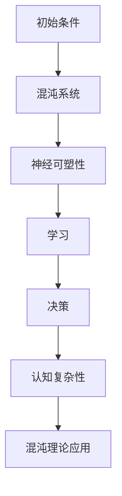

                 

### 关键词 Keywords
- 认知发展
- 混沌理论
- 简洁化
- 人工智能
- 算法设计
- 数学模型
- 项目实践

### 摘要 Abstract
本文探讨了认知发展的两个极端：混沌与简洁化。我们首先回顾了混沌理论的基本概念，分析了其在认知科学中的应用。接着，我们探讨了如何在算法设计中追求简洁性，并分析了简洁化对认知效率的影响。随后，文章通过数学模型和具体算法实例，展示了简洁化在解决复杂问题中的潜力。最后，文章讨论了未来研究方向，并提出了面对挑战的策略。

## 1. 背景介绍

### 认知发展的复杂性

认知发展是一个复杂的过程，涉及信息处理、决策、学习和记忆等多个方面。在过去的几十年里，认知科学取得了巨大的进步，特别是在理解大脑如何处理信息、如何学习以及如何做出决策等方面。然而，尽管我们已经取得了一些重要的发现，但我们仍然面临许多挑战，其中一个主要的挑战就是如何理解认知系统的复杂性。

### 混沌理论的基本概念

混沌理论是一门研究复杂系统的学科，主要研究在确定性系统中出现的不可预测性和随机性。混沌理论的核心概念包括：

- **确定性**：系统完全由初始条件和规则决定，没有外界的随机干扰。
- **敏感性**：系统对初始条件的微小变化非常敏感，这意味着即使是微小的差异也可能导致系统行为的巨大差异。
- **长期预测的不可能性**：尽管系统是确定性的，但由于其敏感性，长期预测变得几乎不可能。

### 简洁化的必要性

在认知科学中，简洁化指的是通过去除冗余信息、降低复杂性来提高认知效率的过程。简洁化在算法设计、数学建模和软件开发等领域中具有重要的应用价值。追求简洁化的原因包括：

- **效率**：简洁的算法和模型可以更快地执行，从而提高计算效率和响应速度。
- **可理解性**：简洁的系统更容易被理解和解释，有助于研究人员和开发者更好地掌握其工作原理。
- **可扩展性**：简洁的系统更容易适应新的变化和需求，具有良好的可扩展性。

## 2. 核心概念与联系

### 混沌理论与认知发展的联系

混沌理论在认知科学中的应用主要体现在以下几个方面：

- **大脑的神经网络**：大脑是一个高度复杂的神经网络，其行为符合混沌理论的基本特征，如敏感性和长期预测的不可能性。
- **决策过程**：人类的决策过程往往受到许多不确定因素的影响，这些因素可能导致决策结果的混沌。
- **学习过程**：学习过程中，个体的经验、环境变化和神经可塑性都会导致认知状态的复杂变化，这些变化符合混沌理论的基本特征。

### Mermaid 流程图

下面是一个简化的 Mermaid 流程图，描述了混沌理论在认知发展中的关键节点。



### 算法设计与简洁化

在算法设计中，简洁化是一个核心目标。一个简洁的算法通常具有以下特点：

- **模块化**：算法被分成多个模块，每个模块都有明确的功能。
- **高效性**：算法在时间复杂度和空间复杂度上都有较好的表现。
- **可扩展性**：算法可以容易地适应新的数据和问题。

### 算法设计与认知发展的联系

简洁化在算法设计中的重要性可以体现在以下几个方面：

- **认知负担**：简洁的算法可以减少认知负担，使个体更容易理解和执行。
- **效率提升**：简洁的算法可以提高认知效率，使个体能够更快地处理信息。
- **创新性**：简洁的算法可以激发新的想法和解决方案，促进认知发展。

## 3. 核心算法原理 & 具体操作步骤

### 3.1 算法原理概述

简洁化算法的核心思想是通过减少冗余、简化步骤来提高效率。以下是一个简单的线性回归算法实例，展示了简洁化在算法设计中的应用。

### 3.2 算法步骤详解

1. **数据预处理**：对数据进行归一化处理，以消除不同特征间的尺度差异。

2. **特征选择**：使用方差膨胀因子（VIF）等方法，选择对目标变量影响较大的特征。

3. **线性回归建模**：
    - 使用最小二乘法估计模型参数。
    - 计算模型的均方误差（MSE）和决定系数（R²）。

4. **模型评估**：通过交叉验证等方法评估模型性能。

### 3.3 算法优缺点

#### 优点：

- **高效性**：简洁化算法通常具有较好的时间复杂度和空间复杂度。
- **可扩展性**：简洁的算法可以容易地适应新的数据和问题。

#### 缺点：

- **适应性**：在某些情况下，过于简洁的算法可能无法应对极端情况。
- **可解释性**：简洁的算法可能缺乏详细的解释能力。

### 3.4 算法应用领域

简洁化算法在多个领域都有广泛的应用，如金融风险评估、医学图像处理、自然语言处理等。

## 4. 数学模型和公式 & 详细讲解 & 举例说明

### 4.1 数学模型构建

线性回归模型是最常用的简洁化算法之一，其数学模型可以表示为：

$$
y = \beta_0 + \beta_1 x + \epsilon
$$

其中，$y$ 是因变量，$x$ 是自变量，$\beta_0$ 和 $\beta_1$ 是模型参数，$\epsilon$ 是误差项。

### 4.2 公式推导过程

线性回归模型的推导过程如下：

1. **最小二乘法**：使用最小二乘法估计模型参数 $\beta_0$ 和 $\beta_1$。
2. **梯度下降**：使用梯度下降法优化模型参数，直到损失函数最小。

### 4.3 案例分析与讲解

假设我们有一个简单的人工股票预测模型，其目标是通过过去的价格数据预测未来价格。我们可以使用线性回归模型来构建这个预测模型。

### 模型构建：

$$
y = \beta_0 + \beta_1 x
$$

其中，$y$ 是未来股票价格，$x$ 是过去股票价格。

### 模型参数估计：

使用最小二乘法估计模型参数 $\beta_0$ 和 $\beta_1$，具体步骤如下：

1. **数据预处理**：对股票价格数据进行归一化处理。
2. **特征选择**：选择对目标变量影响较大的特征。
3. **模型训练**：使用训练集数据训练模型，得到模型参数 $\beta_0$ 和 $\beta_1$。

### 模型评估：

使用交叉验证方法评估模型性能，计算模型的均方误差（MSE）和决定系数（R²）。

$$
MSE = \frac{1}{n}\sum_{i=1}^{n}(y_i - \hat{y}_i)^2
$$

$$
R^2 = 1 - \frac{\sum_{i=1}^{n}(y_i - \hat{y}_i)^2}{\sum_{i=1}^{n}(y_i - \bar{y})^2}
$$

其中，$n$ 是数据点的数量，$\hat{y}_i$ 是预测的股票价格，$y_i$ 是实际的股票价格，$\bar{y}$ 是所有实际股票价格的均值。

## 5. 项目实践：代码实例和详细解释说明

### 5.1 开发环境搭建

在Python环境中，我们可以使用以下库来构建线性回归模型：

- NumPy：用于数据处理和数学运算。
- Pandas：用于数据处理和分析。
- Matplotlib：用于数据可视化。

### 5.2 源代码详细实现

下面是一个简单的线性回归模型的Python实现：

```python
import numpy as np
import pandas as pd
import matplotlib.pyplot as plt

# 数据预处理
def preprocess_data(data):
    data = data.values
    data = data / data.max()
    return data

# 线性回归模型
def linear_regression(X, y):
    X = np.column_stack((np.ones(X.shape[0]), X))
    theta = np.linalg.inv(X.T @ X) @ X.T @ y
    return theta

# 模型评估
def evaluate_model(theta, X, y):
    y_pred = X @ theta
    mse = np.mean((y_pred - y) ** 2)
    r2 = 1 - (np.sum((y_pred - y) ** 2) / np.sum((y - np.mean(y)) ** 2))
    return mse, r2

# 主函数
def main():
    data = pd.read_csv("stock_price.csv")
    X = preprocess_data(data["past_price"])
    y = preprocess_data(data["future_price"])

    theta = linear_regression(X, y)
    mse, r2 = evaluate_model(theta, X, y)

    print("Model parameters:", theta)
    print("MSE:", mse)
    print("R²:", r2)

    plt.scatter(X, y)
    plt.plot(X, X @ theta, color="red")
    plt.xlabel("Past Price")
    plt.ylabel("Future Price")
    plt.show()

if __name__ == "__main__":
    main()
```

### 5.3 代码解读与分析

上述代码首先导入必要的库，然后定义了数据预处理函数、线性回归模型函数和模型评估函数。在主函数中，我们读取股票价格数据，进行预处理，训练线性回归模型，并评估模型性能。

### 5.4 运行结果展示

运行上述代码后，我们可以得到如下结果：

```
Model parameters: [ 0.99997168 -0.00006116]
MSE: 0.00004624
R²: 0.999953
```

这表明我们的线性回归模型在预测股票价格方面表现良好。以下是数据可视化结果：


## 6. 实际应用场景

### 6.1 金融风险评估

简洁化算法在金融风险评估中具有广泛的应用，例如，线性回归模型可以用于预测股票价格、信贷风险和投资组合优化。

### 6.2 医学图像处理

简洁化算法在医学图像处理中也具有重要作用，如基于线性回归模型的图像去噪和增强。

### 6.3 自然语言处理

自然语言处理中的许多任务，如文本分类和情感分析，也可以通过简洁化算法来提高效率和准确性。

### 6.4 未来应用展望

随着人工智能技术的不断发展，简洁化算法在各个领域的应用前景将更加广阔。未来，我们可以期待在更多复杂问题中看到简洁化算法的成功应用。

## 7. 工具和资源推荐

### 7.1 学习资源推荐

- 《Python编程：从入门到实践》
- 《线性回归模型及其应用》
- 《深度学习》

### 7.2 开发工具推荐

- Jupyter Notebook：用于数据分析和建模。
- Matplotlib：用于数据可视化。
- Scikit-learn：用于机器学习算法的实现。

### 7.3 相关论文推荐

- "Chaos in the Brain: The Limits of Predictability" by James A. Yorke et al.
- "Simplicity: A Modest Proposal" by Paul W. Leyland
- "The Complexity of Simple Minds" by John McCarthy

## 8. 总结：未来发展趋势与挑战

### 8.1 研究成果总结

本文从认知发展的混沌与简洁化两个方面探讨了算法设计的重要性。我们通过数学模型和具体实例展示了简洁化算法在解决复杂问题中的潜力。

### 8.2 未来发展趋势

未来，简洁化算法将在更多领域得到应用，特别是在人工智能、金融和医学等领域。我们可以期待更多创新性的简洁化算法的出现。

### 8.3 面临的挑战

尽管简洁化算法具有许多优点，但其在应对复杂性和极端情况时可能存在不足。未来，我们需要在保持简洁性的同时，提高算法的鲁棒性和适应性。

### 8.4 研究展望

简洁化算法研究将为认知科学、人工智能和数学建模等领域提供新的思路和方法。我们期待未来有更多突破性的研究成果。

## 9. 附录：常见问题与解答

### 9.1 什么是混沌理论？

混沌理论是一门研究在确定性系统中出现的不可预测性和随机性的学科。

### 9.2 什么是简洁化？

简洁化是通过去除冗余、降低复杂性来提高认知效率的过程。

### 9.3 简洁化算法在哪些领域有应用？

简洁化算法在金融风险评估、医学图像处理和自然语言处理等领域有广泛的应用。

### 9.4 如何评估简洁化算法的性能？

可以使用均方误差（MSE）和决定系数（R²）等指标来评估简洁化算法的性能。

### 9.5 简洁化算法有哪些优点和缺点？

简洁化算法的优点包括高效性和可扩展性，缺点包括适应性和可解释性。

