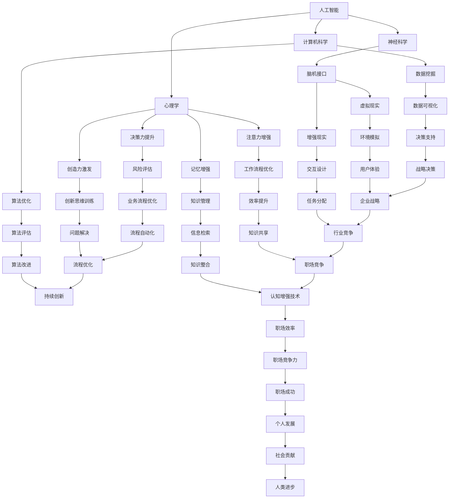

                 

关键词：认知增强、职场竞争、知识工作者、人工智能、进化、算法、数学模型、实践、工具、未来展望

> 摘要：在当今高度数字化和信息化的社会中，知识工作者面临着前所未有的职场竞争压力。本文将探讨认知增强技术在职场中的重要作用，分析其核心概念、算法原理、数学模型以及实践应用，并展望未来的发展趋势与挑战。

## 1. 背景介绍

随着信息技术的飞速发展，知识工作者在职场中扮演着越来越重要的角色。然而，面对海量的信息和复杂的工作任务，传统的认知能力已经难以满足高效工作的需求。认知增强技术的出现，为知识工作者提供了一种提升自身认知能力的新途径。

认知增强技术是指通过技术手段提升人类的认知能力，包括注意力、记忆力、决策力、创造力等。这些技术包括但不限于：人工智能、虚拟现实、增强现实、脑机接口等。在职场中，认知增强技术有助于提高工作效率、优化决策过程、增强创新能力，从而提升知识工作者的竞争力。

## 2. 核心概念与联系

### 2.1 认知增强技术的核心概念

认知增强技术的核心概念主要包括以下几个方面：

- **注意力增强**：通过技术手段提升个体对特定信息的注意力，减少干扰，提高工作效率。
- **记忆增强**：通过技术手段增强个体的记忆能力，提高信息的存储和提取效率。
- **决策力提升**：通过技术手段优化决策过程，提供决策支持，降低决策风险。
- **创造力激发**：通过技术手段激发个体的创造力，提供新颖的思路和解决方案。

### 2.2 认知增强技术的联系

认知增强技术涉及多个领域，包括人工智能、神经科学、心理学、计算机科学等。以下是一个简化的 Mermaid 流程图，展示了这些领域之间的联系：



通过这个流程图，我们可以看到认知增强技术如何跨越多个领域，为知识工作者提供全面的认知支持。

## 3. 核心算法原理 & 具体操作步骤

### 3.1 算法原理概述

认知增强技术的核心算法主要包括以下几个方面：

- **深度学习算法**：通过模拟人脑神经元之间的连接，实现数据的自动学习和特征提取。
- **强化学习算法**：通过试错和奖励机制，优化决策过程，提升个体在不同环境下的适应能力。
- **优化算法**：通过数学优化方法，求解复杂问题，提高决策质量和效率。
- **神经网络算法**：通过构建复杂的神经网络结构，实现高效的认知处理。

### 3.2 算法步骤详解

以深度学习算法为例，其具体操作步骤如下：

1. **数据预处理**：对原始数据进行清洗、归一化等处理，确保数据质量。
2. **模型构建**：选择合适的神经网络架构，如卷积神经网络（CNN）、循环神经网络（RNN）等。
3. **训练模型**：使用训练数据对模型进行训练，调整模型参数，使其达到预期性能。
4. **模型评估**：使用测试数据对模型进行评估，确保模型在未知数据上的表现良好。
5. **模型应用**：将训练好的模型应用到实际场景中，如图像识别、自然语言处理等。

### 3.3 算法优缺点

深度学习算法的优点包括：

- **强大的特征提取能力**：能够自动提取复杂的数据特征，减少人工干预。
- **良好的泛化能力**：通过大规模数据训练，模型在未知数据上的表现较好。

但深度学习算法也存在一些缺点：

- **训练过程耗时长**：需要大量数据和计算资源进行训练。
- **模型解释性差**：深度学习模型的黑盒特性使得其内部决策过程难以解释。

### 3.4 算法应用领域

深度学习算法在认知增强技术中具有广泛的应用，如：

- **图像识别**：通过深度学习算法实现人脸识别、物体识别等功能。
- **自然语言处理**：通过深度学习算法实现文本分类、情感分析等任务。
- **语音识别**：通过深度学习算法实现语音信号的识别和转换。

## 4. 数学模型和公式 & 详细讲解 & 举例说明

### 4.1 数学模型构建

在认知增强技术中，常见的数学模型包括：

- **线性回归模型**：用于预测数值型变量。
- **逻辑回归模型**：用于预测二分类变量。
- **神经网络模型**：用于复杂函数的映射和特征提取。

以下是一个简单的线性回归模型的构建过程：

1. **假设函数**：定义一个假设函数，如 \( f(x) = w_0 + w_1x \)，其中 \( x \) 是输入特征，\( w_0 \) 和 \( w_1 \) 是模型参数。
2. **损失函数**：选择一个损失函数，如均方误差（MSE），用于衡量模型预测值与实际值之间的差距。
3. **优化算法**：选择一个优化算法，如梯度下降（GD），用于调整模型参数，最小化损失函数。

### 4.2 公式推导过程

以线性回归模型为例，其公式推导过程如下：

1. **损失函数**：假设 \( y \) 是实际值，\( \hat{y} \) 是预测值，则损失函数可以表示为：

   $$ L(\theta) = \frac{1}{2m} \sum_{i=1}^{m} (y_i - \hat{y_i})^2 $$

   其中，\( m \) 是样本数量。

2. **梯度计算**：对损失函数关于模型参数 \( \theta \) 求导，得到梯度：

   $$ \nabla_{\theta} L(\theta) = \frac{1}{m} \sum_{i=1}^{m} (y_i - \hat{y_i}) \cdot x_i $$

3. **梯度下降**：根据梯度下降算法，更新模型参数：

   $$ \theta = \theta - \alpha \nabla_{\theta} L(\theta) $$

   其中，\( \alpha \) 是学习率。

### 4.3 案例分析与讲解

假设我们要预测一个人的年收入，给定以下数据：

| 年龄 | 年收入（万元） |
| ---- | ------------ |
| 25   | 30           |
| 30   | 40           |
| 35   | 50           |
| 40   | 60           |

1. **数据预处理**：将年龄作为输入特征 \( x \)，年收入作为输出特征 \( y \)。

2. **模型构建**：选择线性回归模型，假设函数为 \( f(x) = w_0 + w_1x \)。

3. **模型训练**：使用训练数据，通过梯度下降算法更新模型参数 \( w_0 \) 和 \( w_1 \)。

4. **模型评估**：使用测试数据，计算模型的预测准确率。

5. **模型应用**：将模型应用到实际场景，预测一个 35 岁人的年收入。

通过以上步骤，我们可以得到一个简单的线性回归模型，并对其进行评估和应用。

## 5. 项目实践：代码实例和详细解释说明

### 5.1 开发环境搭建

在本项目中，我们将使用 Python 编写代码，具体开发环境如下：

- Python 版本：3.8
- 环境搭建工具：Anaconda
- 数据处理库：Pandas、NumPy
- 机器学习库：Scikit-learn

### 5.2 源代码详细实现

以下是一个简单的线性回归模型的 Python 代码实现：

```python
import numpy as np
import pandas as pd
from sklearn.linear_model import LinearRegression

# 数据预处理
def preprocess_data(data):
    data['Age'] = data['Age'].values.reshape(-1, 1)
    return data

# 模型训练
def train_model(data):
    model = LinearRegression()
    model.fit(data[['Age']], data['Income'])
    return model

# 模型评估
def evaluate_model(model, data):
    predictions = model.predict(data[['Age']])
    mse = np.mean((predictions - data['Income']) ** 2)
    print(f'Mean Squared Error: {mse}')

# 模型应用
def apply_model(model, age):
    prediction = model.predict([[age]])
    print(f'Predicted Income: {prediction[0][0]}')

# 主函数
def main():
    data = pd.DataFrame({
        'Age': [25, 30, 35, 40],
        'Income': [30, 40, 50, 60]
    })

    data = preprocess_data(data)
    model = train_model(data)
    evaluate_model(model, data)
    apply_model(model, 35)

if __name__ == '__main__':
    main()
```

### 5.3 代码解读与分析

- `preprocess_data` 函数：对数据进行预处理，将年龄作为输入特征，年收入作为输出特征。
- `train_model` 函数：使用线性回归模型训练数据，返回训练好的模型。
- `evaluate_model` 函数：评估模型性能，计算均方误差（MSE）。
- `apply_model` 函数：将训练好的模型应用到新数据，预测年收入。
- `main` 函数：主函数，执行数据预处理、模型训练、模型评估和模型应用。

通过以上代码，我们可以实现一个简单的线性回归模型，并对其进行评估和应用。

## 6. 实际应用场景

认知增强技术在职场中具有广泛的应用场景，以下是一些具体的应用案例：

- **企业战略规划**：通过大数据分析和机器学习算法，为企业提供决策支持，优化战略规划。
- **产品研发**：利用虚拟现实和增强现实技术，提高产品研发效率，降低研发成本。
- **市场营销**：通过自然语言处理和图像识别技术，精准定位目标客户，提高营销效果。
- **人力资源**：利用认知增强技术，提升招聘效率，优化员工培训和发展。

### 6.4 未来应用展望

随着技术的不断进步，认知增强技术在职场中的应用前景将更加广阔。以下是一些未来应用展望：

- **智能助理**：通过人工智能和自然语言处理技术，为企业提供全天候的智能助理服务。
- **智能诊断**：通过大数据分析和深度学习技术，实现智能医疗诊断和个性化治疗。
- **智能交通**：通过物联网和人工智能技术，优化交通管理，提高出行效率。
- **智能教育**：利用虚拟现实和增强现实技术，提供个性化、互动式的学习体验。

## 7. 工具和资源推荐

### 7.1 学习资源推荐

- **《深度学习》**：由 Ian Goodfellow 等人撰写的深度学习经典教材。
- **《机器学习实战》**：由 Peter Harrington 撰写的机器学习实战指南。
- **《Python 数据科学手册》**：由 Jake VanderPlas 撰写的 Python 数据科学入门教程。

### 7.2 开发工具推荐

- **Jupyter Notebook**：一款强大的交互式数据分析工具。
- **TensorFlow**：一款开源的深度学习框架。
- **Scikit-learn**：一款开源的机器学习库。

### 7.3 相关论文推荐

- **“Deep Learning”**：由 Ian Goodfellow 等人撰写的深度学习综述。
- **“The Unreasonable Effectiveness of Data”**：由 Pedro Domingos 撰写的关于大数据的论文。
- **“Reinforcement Learning: An Introduction”**：由 Richard S. Sutton 和 Andrew G. Barto 撰写的强化学习入门教程。

## 8. 总结：未来发展趋势与挑战

### 8.1 研究成果总结

本文从认知增强技术的核心概念、算法原理、数学模型、实践应用等方面进行了全面探讨，总结了其研究成果和实际应用价值。

### 8.2 未来发展趋势

随着人工智能和认知科学的发展，认知增强技术将朝着更加智能化、个性化、高效化的方向不断演进。未来，认知增强技术将在更多领域得到广泛应用，为知识工作者带来更高的竞争力。

### 8.3 面临的挑战

尽管认知增强技术具有巨大的发展潜力，但仍面临一些挑战，如算法透明性、数据隐私、伦理问题等。如何克服这些挑战，实现技术的可持续发展，将是未来研究的重要方向。

### 8.4 研究展望

未来，认知增强技术将在以下几个方面取得重要突破：

- **算法创新**：开发更加高效、可解释的算法，提高认知增强技术的性能和可靠性。
- **跨学科融合**：整合认知科学、心理学、计算机科学等领域的知识，构建更加完善的认知增强体系。
- **应用推广**：推动认知增强技术在各个领域的实际应用，提高知识工作者的工作效率和创新能力。

## 9. 附录：常见问题与解答

### 9.1 认知增强技术是什么？

认知增强技术是指通过技术手段提升人类的认知能力，包括注意力、记忆力、决策力、创造力等。

### 9.2 认知增强技术在职场中有哪些应用？

认知增强技术在职场中的应用包括企业战略规划、产品研发、市场营销、人力资源等方面。

### 9.3 如何实现认知增强？

实现认知增强的主要方法包括深度学习、虚拟现实、增强现实、脑机接口等技术。

### 9.4 认知增强技术有哪些优点和缺点？

认知增强技术的优点包括提高工作效率、优化决策过程、增强创新能力等；缺点包括训练过程耗时长、模型解释性差等。

### 9.5 认知增强技术未来的发展趋势是什么？

未来，认知增强技术将朝着更加智能化、个性化、高效化的方向不断演进，将在更多领域得到广泛应用。

---

### 结语

认知增强技术是知识工作者提升职场竞争力的重要工具。本文从多个角度对认知增强技术进行了深入探讨，希望对读者有所启发。随着技术的不断发展，认知增强技术将在职场中发挥更大的作用，助力知识工作者实现更高的成就。

