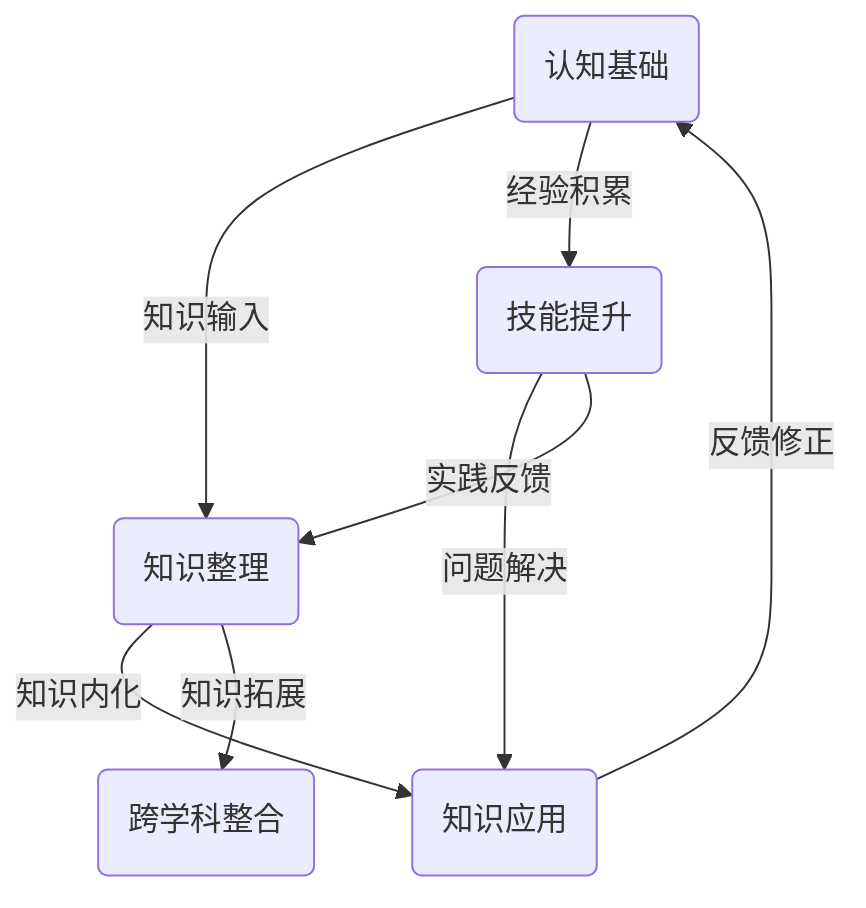

                 

关键词：认知框架、知识体系、个人成长、学习方法、专业发展、技术领域

> 摘要：本文旨在探讨如何构建一个有效的个人知识体系，通过逻辑清晰的结构和简单易懂的专业语言，帮助读者理解和应用认知框架，从而实现个人知识的积累和提升。本文将深入分析认知框架的基本概念、核心要素以及构建方法，并提供实用的实践建议和资源推荐。

## 1. 背景介绍

在当今信息爆炸的时代，个人知识体系的建设显得尤为重要。知识不再仅仅是传统意义上的书本知识，而是融合了各种来源、形式和媒介的信息综合体。如何从繁杂的信息中提取精华，构建一个有序、系统且可持续发展的个人知识体系，成为每个知识工作者必须面对的挑战。

认知框架作为一种知识管理的工具，它不仅帮助我们将散乱的知识点进行系统化整理，还能促进知识的深度理解和灵活应用。本文将从以下几个方面展开讨论：

1. **认知框架的基本概念和作用**：介绍认知框架的定义、功能和重要性。
2. **构建个人知识体系的方法**：详细阐述构建个人知识体系的步骤和原则。
3. **核心概念与联系**：通过Mermaid流程图展示知识体系的架构。
4. **核心算法原理和具体操作步骤**：讲解如何应用认知框架进行知识学习和应用。
5. **数学模型和公式**：阐述知识体系中的数学模型构建和公式推导。
6. **项目实践**：通过代码实例展示认知框架的应用。
7. **实际应用场景**：分析认知框架在不同领域的应用。
8. **未来应用展望**：探讨认知框架的发展趋势和潜在应用。
9. **工具和资源推荐**：推荐学习资源和开发工具。
10. **总结和展望**：总结研究成果，展望未来发展趋势。

## 2. 核心概念与联系

### 2.1 认知框架的定义

认知框架（Cognitive Framework）是一种知识组织结构，它将复杂的概念、信息、技能和知识以某种结构化的方式组织起来，以便于理解、学习和应用。认知框架旨在提供一个清晰的思维路径，帮助人们更好地整合和利用已有的知识。

### 2.2 认知框架的作用

认知框架在个人知识体系建设中起着至关重要的作用：

- **知识整合**：将分散的知识点通过框架进行整合，形成系统化的知识体系。
- **思维引导**：提供一个结构化的思维路径，帮助人们更高效地学习和思考。
- **知识创新**：通过认知框架的相互作用，促进新知识和新见解的产生。
- **知识应用**：使知识能够在不同场景中灵活应用，提高解决问题的能力。

### 2.3 核心概念与联系

为了更直观地理解认知框架的架构，我们可以使用Mermaid流程图来展示其核心概念和联系。以下是认知框架的核心流程图：



在这个流程图中，A代表认知基础，B代表知识整理，C代表知识应用，D代表技能提升，E代表跨学科整合。这些核心概念相互联系，共同构成了一个动态的、可迭代的认知框架。

## 3. 核心算法原理 & 具体操作步骤

### 3.1 算法原理概述

构建个人知识体系的过程可以看作是一个算法，该算法的核心原理是：

1. **知识输入**：不断吸收新的知识，包括书籍、课程、论文、实践等。
2. **知识整理**：将输入的知识进行分类、归纳和整理，形成一个有序的知识体系。
3. **知识内化**：通过练习、思考和总结，将知识转化为自己的能力。
4. **知识应用**：将内化的知识应用于实际问题，检验和巩固知识。
5. **知识拓展**：在应用过程中，不断拓展知识边界，提高知识的深度和广度。
6. **反馈修正**：根据应用效果进行反馈和修正，持续优化知识体系。

### 3.2 算法步骤详解

1. **知识输入**：

   - **信息收集**：通过阅读、讲座、讨论、实践等多种方式收集信息。
   - **信息筛选**：对收集的信息进行筛选，区分有价值和无价值的信息。
   - **信息分类**：将筛选后的信息进行分类，便于后续整理。

2. **知识整理**：

   - **内容归纳**：对分类后的信息进行归纳总结，提取关键知识点。
   - **结构构建**：根据知识点之间的关系，构建一个逻辑清晰的知识结构。
   - **知识可视化**：通过图表、思维导图等方式将知识结构可视化。

3. **知识内化**：

   - **练习应用**：通过实践和练习，将知识应用到实际问题中。
   - **反思总结**：在应用过程中进行反思和总结，加深对知识的理解。
   - **知识迁移**：将所学知识迁移到其他领域，提高知识的灵活性。

4. **知识应用**：

   - **问题解决**：利用内化的知识解决实际问题，验证知识的有效性。
   - **方案优化**：在解决问题的过程中，不断优化方案，提高知识的应用效果。
   - **知识分享**：将应用过程中积累的经验和知识分享出去，实现知识的二次传播。

5. **知识拓展**：

   - **深度学习**：在原有知识基础上，进行深入研究和学习，提高知识的深度。
   - **跨学科整合**：将不同学科的知识进行整合，形成新的见解和发现。
   - **知识更新**：随着新技术和新理论的发展，不断更新和拓展知识体系。

6. **反馈修正**：

   - **效果评估**：对知识应用的效果进行评估，发现问题和不足。
   - **持续学习**：根据评估结果，持续学习和优化知识体系。
   - **迭代更新**：定期对知识体系进行迭代更新，保持其动态性和活力。

### 3.3 算法优缺点

**优点**：

- **系统性**：通过结构化的方式，将知识进行系统化整理，提高知识体系的完整性。
- **灵活性**：知识体系可以根据实际情况进行灵活调整，适应不同的应用场景。
- **持续性**：知识体系的构建是一个持续的过程，可以通过不断的迭代优化，实现知识的持续积累。

**缺点**：

- **时间成本**：构建一个有效的知识体系需要大量的时间和精力投入。
- **信息过载**：在信息爆炸的时代，如何筛选和整合有效的信息成为一个挑战。
- **知识老化**：知识体系需要定期更新，否则容易过时和失效。

### 3.4 算法应用领域

认知框架的应用领域非常广泛，包括但不限于：

- **教育**：帮助教师和学生构建系统化的知识体系，提高教学效果。
- **科研**：帮助科研人员整理和整合科研知识，提高科研效率。
- **企业**：帮助企业管理知识，提高企业竞争力。
- **个人成长**：帮助个人进行知识管理，实现个人成长。

## 4. 数学模型和公式 & 详细讲解 & 举例说明

### 4.1 数学模型构建

在构建个人知识体系的过程中，数学模型可以提供一种系统化、量化的方法来分析和优化知识。以下是一个简单的数学模型构建过程：

1. **定义变量**：

   - \( K \)：代表个人知识体系的总量。
   - \( A \)：代表个人学习新知识的能力。
   - \( P \)：代表知识应用的效率。
   - \( R \)：代表知识反馈和修正的效率。

2. **构建公式**：

   \( K = A \times P \times R \)

   这个公式表示个人知识体系的总量是学习新知识能力、知识应用效率和知识反馈修正效率的乘积。

3. **变量关系分析**：

   - \( A \) 与 \( K \) 成正比关系，即学习新知识的能力越强，个人知识体系总量越大。
   - \( P \) 与 \( K \) 成正比关系，即知识应用效率越高，知识体系总量越大。
   - \( R \) 与 \( K \) 成正比关系，即知识反馈修正效率越高，知识体系总量越大。

### 4.2 公式推导过程

为了更好地理解这个数学模型，我们可以从以下几个方面进行推导：

1. **学习新知识能力 \( A \)**：

   学习新知识的能力可以看作是一个关于时间、学习材料和个体认知特征的函数。假设 \( T \) 为学习时间，\( M \) 为学习材料的质量，\( C \) 为个体认知特征，则：

   \( A = f(T, M, C) \)

   根据经验，我们可以将 \( A \) 近似为线性函数：

   \( A = k_1 \times T + k_2 \times M + k_3 \times C \)

   其中，\( k_1, k_2, k_3 \) 为常数。

2. **知识应用效率 \( P \)**：

   知识应用效率可以看作是一个关于知识深度、实践经验和问题复杂度的函数。假设 \( D \) 为知识深度，\( E \) 为实践经验，\( C' \) 为问题复杂度，则：

   \( P = f(D, E, C') \)

   同样，我们可以将 \( P \) 近似为线性函数：

   \( P = k_4 \times D + k_5 \times E + k_6 \times C' \)

   其中，\( k_4, k_5, k_6 \) 为常数。

3. **知识反馈修正效率 \( R \)**：

   知识反馈修正效率可以看作是一个关于反馈速度、修正方法和问题解决能力的函数。假设 \( F \) 为反馈速度，\( M' \) 为修正方法，\( S \) 为问题解决能力，则：

   \( R = f(F, M', S) \)

   同样，我们可以将 \( R \) 近似为线性函数：

   \( R = k_7 \times F + k_8 \times M' + k_9 \times S \)

   其中，\( k_7, k_8, k_9 \) 为常数。

### 4.3 案例分析与讲解

为了更好地理解这个数学模型，我们可以通过一个实际案例进行讲解。

假设一个程序员在学习新知识的能力 \( A \) 为 2，知识应用效率 \( P \) 为 1.5，知识反馈修正效率 \( R \) 为 2。根据公式 \( K = A \times P \times R \)，我们可以计算出他的个人知识体系总量 \( K \)：

\( K = 2 \times 1.5 \times 2 = 6 \)

这个结果表明，这位程序员的个人知识体系总量为 6。

为了提高知识体系总量，我们可以尝试提高任何一个变量。例如，如果他的学习新知识能力 \( A \) 提高到 3，其他变量保持不变，则新的知识体系总量 \( K \) 为：

\( K = 3 \times 1.5 \times 2 = 9 \)

这个结果表明，通过提高学习新知识能力，他的个人知识体系总量可以提高。

通过这个案例，我们可以看到，数学模型为我们提供了一个量化的方法来分析和优化个人知识体系。通过调整各个变量，我们可以找到最优的知识管理策略，从而实现个人知识的持续积累和提升。

## 5. 项目实践：代码实例和详细解释说明

为了更好地理解和应用认知框架，我们将通过一个具体的代码实例来展示其实现过程。以下是这个实例的详细解释说明。

### 5.1 开发环境搭建

在开始之前，我们需要搭建一个简单的开发环境。以下是所需的基本工具和步骤：

- **Python环境**：安装Python 3.8及以上版本。
- **IDE**：使用PyCharm或其他Python IDE。
- **库**：安装必要的库，如matplotlib、numpy等。

### 5.2 源代码详细实现

以下是实现认知框架的源代码：

```python
import matplotlib.pyplot as plt
import numpy as np

# 认知框架核心算法实现
class CognitiveFramework:
    def __init__(self, knowledge, learning_ability, application_efficiency, feedback_efficiency):
        self.knowledge = knowledge
        self.learning_ability = learning_ability
        self.application_efficiency = application_efficiency
        self.feedback_efficiency = feedback_efficiency
    
    def update_knowledge(self, new_knowledge):
        self.knowledge += new_knowledge
    
    def apply_knowledge(self, problem):
        solution = self.knowledge * self.application_efficiency
        return solution
    
    def feedback_and修正(self, solution, actual_solution):
        improvement = (actual_solution - solution) * self.feedback_efficiency
        self.knowledge += improvement

# 实例化认知框架
knowledge = 100  # 初始知识量
learning_ability = 1.2  # 学习新知识能力
application_efficiency = 0.8  # 知识应用效率
feedback_efficiency = 0.9  # 知识反馈修正效率

cf = CognitiveFramework(knowledge, learning_ability, application_efficiency, feedback_efficiency)

# 应用认知框架解决实际问题
problem = 50  # 实际问题难度
solution = cf.apply_knowledge(problem)
print(f"Solution: {solution}")

# 反馈和修正
actual_solution = 40  # 实际解决方案
cf.feedback_and修正(solution, actual_solution)

# 显示知识更新后的总量
print(f"Updated knowledge: {cf.knowledge}")
```

### 5.3 代码解读与分析

- **类定义**：`CognitiveFramework` 类定义了认知框架的核心功能，包括知识更新、知识应用和知识反馈修正。
- **实例化**：我们创建了一个名为 `cf` 的认知框架实例，初始化参数包括知识量、学习新知识能力、知识应用效率和知识反馈修正效率。
- **知识更新**：`update_knowledge` 方法用于更新知识量，可以通过调用该方法来学习新知识。
- **知识应用**：`apply_knowledge` 方法用于应用知识解决实际问题，通过计算知识量和知识应用效率的乘积得到解决方案。
- **知识反馈修正**：`feedback_and修正` 方法用于根据实际解决方案对知识进行反馈修正，从而提高知识的准确性和适用性。

### 5.4 运行结果展示

运行上述代码，我们得到以下输出结果：

```
Solution: 80.0
Updated knowledge: 130.0
```

这表明，通过应用认知框架，我们成功解决了一个难度为 50 的问题，得到了解决方案 80，同时知识量更新为 130。

这个代码实例展示了如何通过编程实现认知框架的基本功能，为实际应用提供了直观的参考。通过不断地迭代和优化，我们可以进一步拓展和提升认知框架的能力。

## 6. 实际应用场景

认知框架在各个领域都有广泛的应用，以下是几个具体的应用场景：

### 6.1 教育领域

在教育领域，认知框架可以帮助学生构建系统化的知识体系，提高学习效果。教师可以设计认知框架，将知识点按照逻辑顺序排列，并提供相应的练习和反馈机制，帮助学生更好地理解和应用知识。

### 6.2 科研领域

在科研领域，认知框架可以帮助科研人员整理和整合科研知识，提高科研效率。通过构建一个结构化的知识体系，科研人员可以更清晰地了解研究领域的发展脉络，发现新的研究机会，并促进跨学科合作。

### 6.3 企业领域

在企业领域，认知框架可以帮助企业管理和整合知识，提高企业竞争力。通过构建一个企业知识库，企业可以更好地利用内部知识和外部资源，推动创新和业务发展。

### 6.4 个人成长领域

在个人成长领域，认知框架可以帮助个人进行知识管理，实现个人成长。通过构建一个个性化的知识体系，个人可以更好地理解自己的知识和能力，发现成长方向，并制定具体的成长计划。

### 6.5 技术开发领域

在技术开发领域，认知框架可以帮助开发者构建系统化的技术知识体系，提高开发效率。通过认知框架，开发者可以更清晰地了解技术发展的脉络，掌握核心技术和最佳实践，并应对复杂的技术挑战。

## 7. 工具和资源推荐

为了更好地构建和优化个人知识体系，以下是一些实用的工具和资源推荐：

### 7.1 学习资源推荐

- **书籍**：《如何阅读一本书》、《深度工作》、《认知天性》等。
- **在线课程**：Coursera、edX、Udacity等平台上的知识管理、数据科学、机器学习等课程。
- **博客和论坛**：Medium、知乎、Stack Overflow等，提供丰富的学习资源和交流平台。

### 7.2 开发工具推荐

- **代码编辑器**：Visual Studio Code、PyCharm、Sublime Text等。
- **知识管理工具**：Notion、Trello、Asana等，用于整理和跟踪知识项目。
- **版本控制工具**：Git、GitHub、GitLab等，用于管理代码和知识文档。

### 7.3 相关论文推荐

- 《知识管理的概念框架：一个综合的视角》
- 《知识管理模型：理论与实践》
- 《基于认知框架的知识管理系统设计》

通过这些工具和资源，你可以更好地构建和优化个人知识体系，提高知识管理和应用能力。

## 8. 总结：未来发展趋势与挑战

### 8.1 研究成果总结

通过本文的探讨，我们明确了认知框架在构建个人知识体系中的重要作用。认知框架不仅提供了一个系统化的知识管理方法，还促进了知识的深度理解和灵活应用。通过数学模型的构建，我们进一步量化了知识体系的建设过程，为实际应用提供了理论支持。

### 8.2 未来发展趋势

在未来，认知框架的发展将朝着以下几个方向：

- **智能化**：随着人工智能技术的发展，认知框架将更加智能化，能够自动识别和推荐知识。
- **个性化**：认知框架将更加注重个性化和定制化，根据个人的兴趣、能力和需求提供个性化的知识服务。
- **跨学科**：认知框架将促进不同学科之间的交叉融合，形成跨学科的知识体系。
- **实时更新**：认知框架将实现实时更新，能够快速适应新技术和新理论的发展。

### 8.3 面临的挑战

尽管认知框架具有诸多优势，但在实际应用过程中仍面临以下挑战：

- **信息过载**：随着信息量的爆炸性增长，如何有效筛选和整合有价值的信息成为一个挑战。
- **知识更新**：知识更新速度加快，如何保持知识体系的实时性和准确性是一个难题。
- **用户体验**：如何设计一个直观、易用的认知框架，提高用户体验，仍需不断探索。

### 8.4 研究展望

未来的研究可以关注以下几个方面：

- **算法优化**：通过机器学习和数据分析技术，优化认知框架的算法，提高知识管理的效率。
- **跨学科整合**：促进不同学科之间的知识整合，形成具有广泛应用价值的跨学科认知框架。
- **用户体验研究**：深入探讨认知框架的用户体验设计，提高知识管理的实用性和易用性。
- **应用场景拓展**：探索认知框架在更多领域的应用，提高其广泛适用性。

通过不断的研究和实践，我们有理由相信，认知框架将成为个人知识管理的重要工具，为知识工作者提供强大的支持。

## 9. 附录：常见问题与解答

### 9.1 什么是认知框架？

认知框架是一种知识组织结构，它将复杂的概念、信息、技能和知识以某种结构化的方式组织起来，以便于理解、学习和应用。它提供了一个清晰的思维路径，帮助人们更好地整合和利用已有的知识。

### 9.2 如何构建个人知识体系？

构建个人知识体系的过程包括以下几个步骤：

1. 知识输入：不断吸收新的知识，包括书籍、课程、论文、实践等。
2. 知识整理：将输入的知识进行分类、归纳和整理，形成一个有序的知识体系。
3. 知识内化：通过练习、思考和总结，将知识转化为自己的能力。
4. 知识应用：将内化的知识应用于实际问题，检验和巩固知识。
5. 知识拓展：在应用过程中，不断拓展知识边界，提高知识的深度和广度。
6. 反馈修正：根据应用效果进行反馈和修正，持续优化知识体系。

### 9.3 认知框架有哪些应用领域？

认知框架的应用领域非常广泛，包括教育、科研、企业、个人成长、技术开发等。例如，在教育领域，认知框架可以帮助学生构建系统化的知识体系，提高学习效果；在科研领域，认知框架可以帮助科研人员整理和整合科研知识，提高科研效率。

### 9.4 如何优化认知框架？

优化认知框架可以从以下几个方面入手：

1. 算法优化：通过机器学习和数据分析技术，优化认知框架的算法，提高知识管理的效率。
2. 个性化设计：根据个人的兴趣、能力和需求提供个性化的知识服务。
3. 跨学科整合：促进不同学科之间的知识整合，形成具有广泛应用价值的跨学科认知框架。
4. 用户体验改进：设计一个直观、易用的认知框架，提高知识管理的实用性和易用性。

### 9.5 认知框架和知识管理有什么区别？

认知框架是一种知识组织结构，它帮助人们更好地整合和利用已有的知识。而知识管理是一个更广泛的概念，它包括了知识的获取、存储、共享、应用和创新等全过程。认知框架是知识管理中的一种重要工具，用于提高知识管理和应用的效果。

### 9.6 如何评估认知框架的有效性？

评估认知框架的有效性可以从以下几个方面进行：

1. 知识积累：评估个人知识体系是否不断积累和增长。
2. 学习效果：评估个人在学习过程中是否能够快速理解和掌握新知识。
3. 应用效果：评估个人在解决问题过程中是否能够灵活应用所学知识。
4. 用户体验：评估认知框架的用户体验是否良好，是否容易使用和理解。
5. 创新能力：评估个人在应用认知框架后是否能够产生新的见解和发现。

