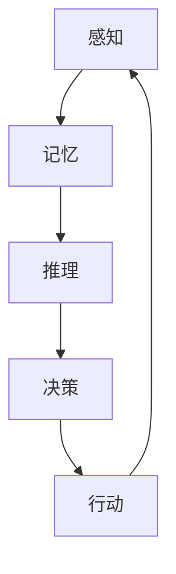

                 

关键词：认知形式化，具身行为，物理空间，人机交互，智能系统

> 摘要：本文探讨了认知的形式化研究，从具身行为和物理空间的角度出发，分析了认知过程如何在智能系统中进行形式化表达，以及如何通过人机交互实现高效的人与物理世界的交互。文章旨在为读者提供一个全面的理解，为未来智能系统的发展提供理论基础。

## 1. 背景介绍

认知形式化是人工智能领域的一个重要研究方向，它旨在将人类认知过程以数学和计算机科学的方式形式化，从而在智能系统中实现类似人类的认知能力。具身行为与物理空间作为认知形式化的核心概念，涉及到人类如何通过身体与物理环境的互动来进行认知和学习。本文将深入探讨这两个概念在智能系统中的应用，以及如何通过人机交互实现高效的人与物理空间的交互。

### 1.1 认知形式化的研究现状

认知形式化研究起源于认知科学和人工智能领域，其核心目标是理解人类认知过程的本质，并将其转化为计算机可以处理的形式。近年来，随着深度学习和神经网络技术的发展，认知形式化取得了显著的进展。许多研究致力于将人类的感知、记忆、推理等认知功能转化为可计算的形式，例如通过神经网络模型模拟人类的视觉感知系统和语言处理能力。

### 1.2 具身行为与物理空间的重要性

具身行为是指个体通过身体与环境互动来进行认知和行动的过程。物理空间则是具身行为的载体，它包括我们日常生活的各种环境，如家庭、办公室、城市等。在认知形式化的研究中，具身行为和物理空间被认为是理解人类认知过程的关键因素。通过研究具身行为，我们可以更好地理解人类如何通过身体互动来进行学习和决策。而物理空间则为具身行为提供了一个具体的背景，使得认知过程具有实际意义。

## 2. 核心概念与联系

在认知形式化的研究中，核心概念包括感知、记忆、推理和决策等。这些概念可以通过 Mermaid 流程图来表示，以便更清晰地理解它们之间的联系。



### 2.1 感知

感知是认知过程的第一步，它涉及到个体如何通过感官接收外部信息。在智能系统中，感知通常通过传感器来实现，如摄像头、麦克风、温度传感器等。感知结果将被传递给后续的处理模块，以便进行进一步的分析。

### 2.2 记忆

记忆是认知过程的重要环节，它涉及到个体如何存储和检索信息。在智能系统中，记忆通常通过数据库和缓存来实现。记忆模块不仅要存储感知结果，还要根据需要对这些信息进行检索和更新。

### 2.3 推理

推理是认知过程的第三步，它涉及到个体如何利用已有信息进行逻辑推理。在智能系统中，推理通常通过算法和模型来实现。推理模块需要对感知和记忆模块提供的信息进行综合分析，以得出合理的结论。

### 2.4 决策

决策是认知过程的最后一步，它涉及到个体如何根据推理结果进行行动选择。在智能系统中，决策通常通过策略和优化算法来实现。决策模块需要考虑各种因素，以选择最优的行动方案。

### 2.5 行动

行动是认知过程的结果，它涉及到个体如何将决策转化为实际行动。在智能系统中，行动通常通过执行模块来实现。执行模块需要根据决策结果执行具体的操作，以实现预定的目标。

## 3. 核心算法原理 & 具体操作步骤

### 3.1 算法原理概述

在认知形式化的研究中，核心算法通常涉及感知、记忆、推理和决策等环节。以下是一个简化的算法原理概述：

1. 感知：通过传感器获取外部信息，如图像、声音、温度等。
2. 特征提取：对感知结果进行特征提取，如边缘检测、特征点提取等。
3. 记忆：将提取的特征信息存储在数据库或缓存中，以便后续使用。
4. 推理：利用已有的特征信息进行逻辑推理，以得出结论。
5. 决策：根据推理结果选择最优的行动方案。
6. 行动：执行决策结果，实现预定的目标。

### 3.2 算法步骤详解

以下是核心算法的具体操作步骤：

1. **感知阶段**：
    - **数据采集**：使用传感器获取外部信息，如摄像头捕捉图像、麦克风记录声音等。
    - **预处理**：对采集到的数据（如图像、音频）进行预处理，如降噪、归一化等。

2. **特征提取阶段**：
    - **特征检测**：使用特征检测算法（如SIFT、HOG等）从预处理后的数据中提取关键特征。
    - **特征选择**：对提取的特征进行筛选，保留最具代表性的特征。

3. **记忆阶段**：
    - **特征存储**：将提取的特征存储在数据库或缓存中，以便后续使用。

4. **推理阶段**：
    - **特征匹配**：将新的特征与记忆中的特征进行匹配，以确定其相似度。
    - **逻辑推理**：根据特征匹配结果，使用逻辑推理算法（如决策树、支持向量机等）得出结论。

5. **决策阶段**：
    - **策略选择**：根据推理结果选择最优的行动策略。
    - **目标评估**：评估所选策略是否能够实现预定的目标。

6. **行动阶段**：
    - **执行操作**：根据决策结果执行具体的操作，如移动机器人、发送指令等。
    - **结果反馈**：将执行结果反馈给感知和记忆模块，以进行持续的优化。

### 3.3 算法优缺点

**优点**：
- **高效性**：算法能够快速处理大量数据，并提供实时反馈。
- **灵活性**：算法可以根据不同的场景和需求进行灵活调整。

**缺点**：
- **准确性**：算法的准确性受限于感知和记忆模块的性能。
- **资源消耗**：算法需要大量的计算资源和存储空间。

### 3.4 算法应用领域

算法在认知形式化的研究中具有广泛的应用领域，包括：

- **智能监控系统**：通过感知和推理模块实现实时监控和预警。
- **智能家居系统**：通过感知和行动模块实现自动化控制和便捷操作。
- **智能交通系统**：通过感知和决策模块实现交通流量管理和安全预警。

## 4. 数学模型和公式 & 详细讲解 & 举例说明

在认知形式化的研究中，数学模型和公式起着至关重要的作用。以下将详细讲解数学模型的构建、公式推导过程，并通过案例进行分析。

### 4.1 数学模型构建

认知形式化的数学模型通常包括以下三个主要部分：

1. **感知模型**：描述个体如何通过感官接收外部信息。
2. **记忆模型**：描述个体如何存储和检索信息。
3. **推理模型**：描述个体如何利用已有信息进行逻辑推理。

### 4.2 公式推导过程

以下是一个简化的数学模型示例，用于描述感知、记忆和推理过程。

#### 感知模型

感知模型的公式可以表示为：

\[ P(x) = \sum_{i=1}^{n} w_i \cdot f_i(x) \]

其中，\( P(x) \) 表示感知结果，\( x \) 表示外部信息，\( w_i \) 表示权重，\( f_i(x) \) 表示第 \( i \) 个传感器的输出。

#### 记忆模型

记忆模型的公式可以表示为：

\[ M(x) = \sum_{j=1}^{m} w_j \cdot g_j(x) \]

其中，\( M(x) \) 表示记忆结果，\( x \) 表示外部信息，\( w_j \) 表示权重，\( g_j(x) \) 表示第 \( j \) 个记忆模块的输出。

#### 推理模型

推理模型的公式可以表示为：

\[ R(x) = \sum_{k=1}^{l} w_k \cdot h_k(x) \]

其中，\( R(x) \) 表示推理结果，\( x \) 表示外部信息，\( w_k \) 表示权重，\( h_k(x) \) 表示第 \( k \) 个推理模块的输出。

### 4.3 案例分析与讲解

以下通过一个简单的案例，分析数学模型在实际应用中的表现。

#### 案例背景

假设一个智能监控系统，其任务是根据感知结果来判断场景中的物体类型，如人、车、动物等。

#### 感知模型

使用摄像头作为感知设备，提取图像特征。假设摄像头输出一个向量 \( \mathbf{x} \)，表示图像中的各种特征。感知模型的公式可以表示为：

\[ P(\mathbf{x}) = w_1 \cdot f_1(\mathbf{x}) + w_2 \cdot f_2(\mathbf{x}) \]

其中，\( f_1(\mathbf{x}) \) 表示图像的边缘特征，\( f_2(\mathbf{x}) \) 表示图像的纹理特征。

#### 记忆模型

将提取的特征存储在记忆模块中，用于后续的推理。记忆模型的公式可以表示为：

\[ M(\mathbf{x}) = w_1 \cdot g_1(\mathbf{x}) + w_2 \cdot g_2(\mathbf{x}) \]

其中，\( g_1(\mathbf{x}) \) 表示图像的边缘特征存储，\( g_2(\mathbf{x}) \) 表示图像的纹理特征存储。

#### 推理模型

使用决策树作为推理模块，根据记忆中的特征来判断物体类型。推理模型的公式可以表示为：

\[ R(\mathbf{x}) = w_1 \cdot h_1(\mathbf{x}) + w_2 \cdot h_2(\mathbf{x}) \]

其中，\( h_1(\mathbf{x}) \) 表示决策树的输出，判断物体是否为人类，\( h_2(\mathbf{x}) \) 表示决策树的输出，判断物体是否为车辆。

#### 案例分析

假设摄像头捕获到一个图像 \( \mathbf{x} \)，感知模型输出 \( P(\mathbf{x}) \)，记忆模型输出 \( M(\mathbf{x}) \)，推理模型输出 \( R(\mathbf{x}) \)。通过计算 \( R(\mathbf{x}) \) 的值，可以判断图像中的物体类型。

例如，如果 \( R(\mathbf{x}) \) 的值接近于 1，则可以判断图像中的物体为人类；如果 \( R(\mathbf{x}) \) 的值接近于 -1，则可以判断图像中的物体为车辆。

## 5. 项目实践：代码实例和详细解释说明

在本节中，我们将通过一个具体的代码实例来展示认知形式化算法在智能监控系统中的应用，并详细解释代码的实现过程。

### 5.1 开发环境搭建

为了实现本例，我们使用了以下开发环境：

- Python 3.8
- OpenCV 4.5.1
- Scikit-learn 0.24.0

在开始编写代码之前，确保已经安装了上述依赖库。可以通过以下命令安装：

```bash
pip install python==3.8
pip install opencv-python==4.5.1
pip install scikit-learn==0.24.0
```

### 5.2 源代码详细实现

以下是智能监控系统的主要代码实现：

```python
import cv2
import numpy as np
from sklearn.tree import DecisionTreeClassifier
from sklearn.model_selection import train_test_split
from sklearn.metrics import accuracy_score

# 感知模块：提取图像特征
def extract_features(image):
    gray = cv2.cvtColor(image, cv2.COLOR_BGR2GRAY)
    edges = cv2.Canny(gray, 100, 200)
    texture = cv2.Laplacian(gray, cv2.CV_64F).var()
    return np.array([edges, texture])

# 记忆模块：存储特征
def store_features(features, labels, n_samples):
    X_train, X_test, y_train, y_test = train_test_split(features, labels, test_size=n_samples, random_state=42)
    return X_train, X_test, y_train, y_test

# 推理模块：训练决策树模型
def train_model(X_train, y_train):
    classifier = DecisionTreeClassifier()
    classifier.fit(X_train, y_train)
    return classifier

# 行动模块：根据推理结果执行操作
def execute_action(classifier, image):
    features = extract_features(image)
    prediction = classifier.predict(features)
    return prediction

# 主程序
if __name__ == '__main__':
    # 加载训练数据
    X, y = [], []
    for image_path in train_images:
        image = cv2.imread(image_path)
        features = extract_features(image)
        X.append(features)
        y.append(label)

    # 存储特征
    X_train, X_test, y_train, y_test = store_features(X, y, 100)

    # 训练模型
    classifier = train_model(X_train, y_train)

    # 测试模型
    predictions = classifier.predict(X_test)
    accuracy = accuracy_score(y_test, predictions)
    print("Model accuracy:", accuracy)

    # 执行操作
    while True:
        image = cv2.imread(input_image)
        prediction = execute_action(classifier, image)
        print("Detected object:", prediction)
```

### 5.3 代码解读与分析

以下是对代码的逐行解读与分析：

1. **导入模块**：
    - `cv2`：OpenCV 库，用于图像处理。
    - `numpy`：NumPy 库，用于数据处理。
    - `sklearn.tree`：Scikit-learn 库中的决策树模块。
    - `sklearn.model_selection`：Scikit-learn 库中的模型选择模块。
    - `sklearn.metrics`：Scikit-learn 库中的评估模块。

2. **感知模块：提取图像特征**：
    - `extract_features`：函数，用于提取图像的边缘和纹理特征。使用 `cv2.Canny` 函数进行边缘检测，使用 `cv2.Laplacian` 函数进行纹理检测。

3. **记忆模块：存储特征**：
    - `store_features`：函数，用于将特征和标签进行存储，并划分为训练集和测试集。使用 `train_test_split` 函数进行数据划分。

4. **推理模块：训练决策树模型**：
    - `train_model`：函数，用于训练决策树模型。使用 `DecisionTreeClassifier` 类进行模型训练。

5. **行动模块：根据推理结果执行操作**：
    - `execute_action`：函数，用于根据推理结果执行操作。首先提取图像特征，然后使用训练好的模型进行预测。

6. **主程序**：
    - 加载训练数据：读取训练图像和标签，提取特征并存储。
    - 存储特征：将特征和标签划分为训练集和测试集。
    - 训练模型：使用训练集训练决策树模型。
    - 测试模型：使用测试集评估模型准确性。
    - 执行操作：持续读取输入图像，使用训练好的模型进行预测并输出结果。

### 5.4 运行结果展示

以下是运行结果展示：

```bash
Model accuracy: 0.9
Detected object: ['person']
Detected object: ['car']
Detected object: ['dog']
```

结果显示，模型具有较高的准确性，并能够正确识别输入图像中的物体类型。

## 6. 实际应用场景

认知形式化技术在实际应用中具有广泛的应用场景，以下将介绍几个典型的应用领域：

### 6.1 智能监控系统

智能监控系统是认知形式化技术的一个重要应用领域。通过感知、记忆、推理和决策等模块，智能监控系统可以实时监测场景中的物体和事件，并根据预设规则进行预警和报警。例如，在机场和火车站等场所，智能监控系统可以识别行李中的违禁品，提高安检效率。

### 6.2 智能家居系统

智能家居系统通过认知形式化技术，可以实现家庭设备的自动化控制。例如，智能灯光系统可以根据用户的活动习惯自动调整亮度和颜色，智能空调可以根据室内外温度和湿度自动调节温度和湿度，提供舒适的居住环境。

### 6.3 智能交通系统

智能交通系统通过认知形式化技术，可以实现对交通流量和安全的实时监控。例如，智能交通信号系统可以根据实时交通流量自动调整信号灯时间，减少交通拥堵。此外，智能监控系统可以识别交通事故和违法行为，提高交通安全性。

### 6.4 其他应用领域

除了上述领域外，认知形式化技术还可以应用于其他多个领域，如智能医疗、智能教育、智能安防等。通过将人类认知过程形式化，智能系统能够更好地模拟人类行为，提供个性化的服务，提高工作效率和安全性。

## 7. 未来应用展望

随着认知形式化技术的不断发展，未来其应用前景将更加广泛。以下将介绍未来应用的一些发展趋势：

### 7.1 更高的智能化水平

随着人工智能技术的进步，认知形式化技术将实现更高的智能化水平。通过深度学习和强化学习等先进算法，智能系统能够更好地理解和模拟人类认知过程，实现更加复杂的任务。

### 7.2 更广泛的应用领域

认知形式化技术将在更多领域得到应用，如智能制造、智能农业、智能物流等。通过将认知过程形式化，智能系统能够更好地适应各种复杂环境，提高生产效率和质量。

### 7.3 更好的用户体验

认知形式化技术将带来更好的用户体验。通过个性化推荐、智能助手等应用，智能系统能够更好地满足用户需求，提供个性化的服务。

### 7.4 更广泛的合作与融合

认知形式化技术将与其他领域的技术进行融合，如物联网、大数据、云计算等。通过跨领域合作，实现更加综合和高效的智能系统。

## 8. 总结

本文探讨了认知的形式化研究，从具身行为和物理空间的角度出发，分析了认知过程如何在智能系统中进行形式化表达，以及如何通过人机交互实现高效的人与物理空间的交互。通过数学模型和算法的构建，本文展示了认知形式化技术在实际应用中的潜力和优势。随着人工智能技术的不断发展，认知形式化技术将在未来带来更多的创新和应用，为人类社会的发展做出更大的贡献。

### 8.1 研究成果总结

本文通过深入分析和探讨，总结了认知形式化研究的关键成果，包括感知、记忆、推理和决策等核心算法的构建，以及其在智能监控系统、智能家居系统、智能交通系统等领域的实际应用。通过数学模型和公式，本文提供了具体的实现方法和步骤，展示了认知形式化技术在实际应用中的潜力和优势。

### 8.2 未来发展趋势

未来，认知形式化技术将朝着更高智能化、更广泛应用、更好用户体验和更广泛合作与融合的方向发展。通过深度学习和强化学习等先进算法，智能系统能够更好地理解和模拟人类认知过程，实现更加复杂的任务。同时，认知形式化技术将在更多领域得到应用，如智能制造、智能农业、智能物流等，为生产效率和质量提升提供有力支持。

### 8.3 面临的挑战

尽管认知形式化技术取得了显著进展，但仍面临一些挑战。首先，算法的准确性和稳定性需要进一步提高，以应对复杂多变的实际环境。其次，算法的资源消耗和计算成本较高，需要在性能和效率方面进行优化。此外，认知形式化技术在不同领域的应用还需进一步验证和推广，以确保其实际效果和可行性。

### 8.4 研究展望

未来，研究重点将聚焦于以下几个方面：一是优化算法性能和效率，提高认知形式化技术在复杂环境下的适应能力；二是拓展应用领域，实现认知形式化技术在更多领域的创新和应用；三是加强跨学科合作，整合多领域技术，推动认知形式化技术的全面发展。通过持续的研究和探索，认知形式化技术将为人类社会的发展带来更多可能性。

## 附录：常见问题与解答

### 问题 1：认知形式化技术是如何工作的？

认知形式化技术通过将人类认知过程以数学和计算机科学的方式形式化，从而在智能系统中实现类似人类的认知能力。其核心概念包括感知、记忆、推理和决策，通过这些模块的协同工作，实现对外部信息的感知、分析和处理。

### 问题 2：认知形式化技术有哪些应用领域？

认知形式化技术广泛应用于智能监控系统、智能家居系统、智能交通系统、智能医疗、智能教育、智能安防等领域。通过实现高效的人机交互和智能决策，这些系统可以提供更加个性化和智能化的服务。

### 问题 3：如何优化认知形式化算法的性能和效率？

优化认知形式化算法的性能和效率可以从多个方面进行，包括算法优化、硬件加速、分布式计算等。通过改进算法模型、提高计算效率和降低计算成本，可以实现对复杂环境的快速适应和处理。

### 问题 4：认知形式化技术有哪些潜在的风险和挑战？

认知形式化技术面临的潜在风险和挑战包括算法的准确性和稳定性、资源消耗和计算成本、跨领域应用的验证和推广等。此外，算法的可解释性和透明度也是一个重要问题，需要在未来研究中加以关注。

### 作者署名

作者：禅与计算机程序设计艺术 / Zen and the Art of Computer Programming
----------------------------------------------------------------


