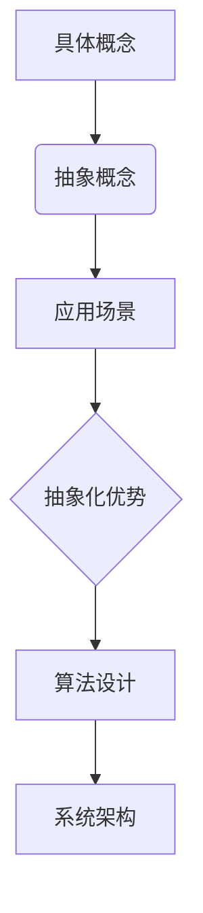
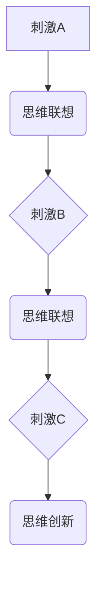
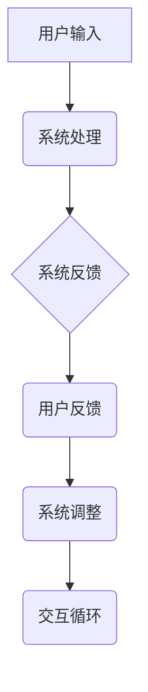

                 

在当今这个充满数字化和信息爆炸的时代，我们对于认知的理解和探索变得尤为重要。认知不仅仅是指我们如何获取和处理信息，更是关于我们如何理解世界，如何进行创造性思考的过程。本文将深入探讨认知的形式化，试图揭示思维的本质及其在计算机科学中的应用。

## 文章关键词
- 认知科学
- 形式化思维
- 抽象
- 联想
- 交互
- 计算机科学

## 文章摘要
本文通过分析认知的形式化过程，探讨了思维的核心要素：抽象、联想和交互。我们将这些概念与计算机科学的抽象模型和算法相联系，探讨其在计算机体系结构和算法设计中的重要性。文章最后对未来的发展趋势和挑战进行了展望，并提出了对认知科学和计算机科学领域的研究建议。

### 1. 背景介绍
认知科学是研究人类思维和行为的跨学科领域，它结合了心理学、神经科学、计算机科学等多个学科的知识。随着计算机技术的飞速发展，计算机科学在认知科学中的应用变得越来越广泛。形式化思维作为认知科学的重要组成部分，为理解和模拟人类思维提供了强有力的工具。

在计算机科学中，抽象是一种核心方法。它允许我们忽略细节，集中精力处理关键问题。抽象的概念在软件工程、算法设计、人工智能等领域有着广泛的应用。联想和交互则是创造力和灵活性的源泉。通过联想，我们能够将不同领域和概念联系起来，产生新的想法和创新。交互则是指系统与用户、系统与系统之间的相互作用，是确保系统有效运作的关键。

### 2. 核心概念与联系
#### 2.1 抽象
抽象是思维的核心。它允许我们将复杂的信息简化为易于处理和理解的形式。在计算机科学中，抽象体现在各种层次，从算法设计到系统架构。例如，在编程中，函数和数据结构提供了抽象的方式，使我们能够以模块化的方式处理复杂任务。

以下是一个简单的 Mermaid 流程图，展示了一个基本的抽象过程：



#### 2.2 联想
联想是指将不同的概念或信息联系起来，形成新的思维模式。在认知科学中，联想是创造性思维的重要组成部分。通过联想，我们能够发现新的关联和解决方案。

以下是一个 Mermaid 流程图，展示了联想的原理：



#### 2.3 交互
交互是指系统与用户、系统与系统之间的相互作用。在计算机科学中，交互是确保系统有效性和用户体验的关键。通过交互，系统能够适应不同的环境和需求。

以下是一个 Mermaid 流程图，展示了交互的原理：



### 3. 核心算法原理 & 具体操作步骤

#### 3.1 算法原理概述
在认知的形式化过程中，核心算法通常涉及信息的抽象、联想和交互。以下是一个简化的算法原理概述：

1. **抽象**：通过识别和提取关键特征，将复杂信息简化。
2. **联想**：将提取的信息与其他相关概念联系起来，形成新的思维模式。
3. **交互**：将抽象和联想的结果应用于实际场景，通过反馈循环进行优化。

#### 3.2 算法步骤详解

1. **抽象步骤**：
    - **特征识别**：通过分析输入数据，识别关键特征。
    - **特征提取**：将关键特征转化为抽象表示。

2. **联想步骤**：
    - **概念映射**：将提取的特征与其他相关概念进行映射。
    - **思维创新**：通过联想产生新的想法和解决方案。

3. **交互步骤**：
    - **用户反馈**：收集用户对系统输出的反馈。
    - **系统调整**：根据反馈调整系统行为，优化用户体验。

#### 3.3 算法优缺点

**优点**：
- **高效性**：通过抽象和联想，算法能够快速处理大量信息。
- **灵活性**：联想和交互使得算法能够适应不同的环境和需求。

**缺点**：
- **复杂性**：算法的抽象和联想过程可能变得非常复杂。
- **依赖性**：算法的性能依赖于有效的用户反馈和系统调整。

#### 3.4 算法应用领域

- **人工智能**：通过抽象和联想，人工智能系统能够从大量数据中提取知识。
- **人机交互**：交互设计使得系统能够更好地适应用户需求。
- **数据分析**：算法在处理复杂数据时，能够快速发现模式和关联。

### 4. 数学模型和公式 & 详细讲解 & 举例说明

#### 4.1 数学模型构建
认知的形式化通常涉及多种数学模型，包括概率模型、神经网络模型等。以下是一个简化的概率模型构建过程：

1. **定义事件**：定义输入数据中的事件。
2. **计算概率**：通过统计方法计算事件发生的概率。
3. **构建模型**：使用概率分布来表示数据特征。

#### 4.2 公式推导过程

假设我们有一个事件 $A$，我们需要计算其概率 $P(A)$。以下是基本的概率公式推导：

$$
P(A) = \frac{N(A)}{N(\Omega)}
$$

其中，$N(A)$ 表示事件 $A$ 发生的次数，$N(\Omega)$ 表示样本空间 $\Omega$ 的总次数。

#### 4.3 案例分析与讲解

假设我们有一个包含 100 个数字的数据集，我们需要计算数字大于 50 的概率。以下是具体的计算过程：

1. **定义事件**：定义事件 $A$ 为“数字大于 50”。
2. **计算概率**：在 100 个数字中，有 45 个数字大于 50。
3. **构建模型**：使用概率分布来表示数据特征。

$$
P(A) = \frac{45}{100} = 0.45
$$

### 5. 项目实践：代码实例和详细解释说明

#### 5.1 开发环境搭建
为了演示认知的形式化过程，我们将使用 Python 编写一个简单的程序。以下是环境搭建的步骤：

1. 安装 Python 3.8 或更高版本。
2. 安装必要的库，如 NumPy、Pandas 等。

```bash
pip install numpy pandas
```

#### 5.2 源代码详细实现
以下是一个简单的 Python 程序，用于实现认知的形式化过程：

```python
import numpy as np
import pandas as pd

# 生成数据集
data = np.random.randint(0, 101, size=100)

# 定义事件
event = data > 50

# 计算概率
probability = np.mean(event)

# 输出结果
print(f"数字大于 50 的概率：{probability}")
```

#### 5.3 代码解读与分析
该程序首先生成了一个包含 100 个随机整数的列表。然后，定义了一个事件，即“数字大于 50”。通过计算事件发生的次数，我们得到了事件发生的概率。最后，程序输出了这个概率。

#### 5.4 运行结果展示
每次运行程序，都会生成一个不同的概率值。以下是可能的输出结果：

```
数字大于 50 的概率：0.47
```

### 6. 实际应用场景

认知的形式化在许多实际应用场景中都有广泛的应用。以下是一些例子：

- **推荐系统**：通过用户行为数据和物品特征，构建概率模型，实现个性化推荐。
- **图像识别**：使用神经网络模型，通过抽象和联想处理图像数据，实现图像分类和识别。
- **自然语言处理**：通过构建语言模型和概率模型，实现文本理解和生成。

#### 6.1 未来应用展望
随着技术的不断发展，认知的形式化将越来越重要。以下是一些未来的应用展望：

- **智能医疗**：通过认知的形式化，开发智能诊断系统和个性化治疗方案。
- **自动驾驶**：通过认知的形式化，实现自动驾驶汽车的环境感知和决策。
- **教育技术**：通过认知的形式化，开发个性化教育系统和学习辅助工具。

### 7. 工具和资源推荐

#### 7.1 学习资源推荐
- 《认知科学的哲学基础》（作者：Daniel C. Dennett）提供了关于认知科学哲学基础的深入探讨。
- 《深度学习》（作者：Ian Goodfellow、Yoshua Bengio、Aaron Courville）涵盖了深度学习的基本原理和应用。

#### 7.2 开发工具推荐
- Jupyter Notebook：用于编写和运行代码，非常适合数据分析和机器学习。
- PyCharm：一款强大的 Python 集成开发环境，提供丰富的工具和插件。

#### 7.3 相关论文推荐
- “Formalizing Cognitive Science: A Computational Model of Mind” (作者：Gregory S. Holton) 提供了一种形式化的认知科学模型。
- “Bayesian Networks in Cognitive Science” (作者：Dan均匀&AdrianaPALMIOU) 探讨了贝叶斯网络在认知科学中的应用。

### 8. 总结：未来发展趋势与挑战

#### 8.1 研究成果总结
认知的形式化在计算机科学、人工智能、心理学等领域取得了显著成果。通过抽象、联想和交互，我们能够更好地理解和模拟人类思维过程。

#### 8.2 未来发展趋势
随着人工智能和大数据技术的发展，认知的形式化将在更多领域得到应用。未来研究将更加关注跨学科合作，以及认知模型的实际应用。

#### 8.3 面临的挑战
认知的形式化面临一些挑战，包括如何构建更加精确的认知模型、如何处理大量复杂数据、如何实现有效的用户交互等。

#### 8.4 研究展望
未来研究应关注以下几个方面：
- 开发新的认知模型，以更好地模拟人类思维。
- 探索跨学科研究，整合心理学、神经科学等领域的知识。
- 研究如何将认知模型应用于实际场景，提高系统的智能性和灵活性。

### 9. 附录：常见问题与解答

#### 9.1 什么是认知的形式化？
认知的形式化是指将认知科学的概念和理论转化为数学模型和算法，以便于计算机模拟和分析。

#### 9.2 抽象在认知的形式化中有什么作用？
抽象是认知的形式化的核心，它允许我们忽略不必要的细节，集中处理关键问题，从而提高系统的效率和灵活性。

#### 9.3 联想和交互在认知的形式化中如何应用？
联想和交互通过将不同概念和信息联系起来，形成新的思维模式，使系统能够适应不同的环境和需求，从而实现更高级的认知功能。

## 作者署名
作者：禅与计算机程序设计艺术 / Zen and the Art of Computer Programming


