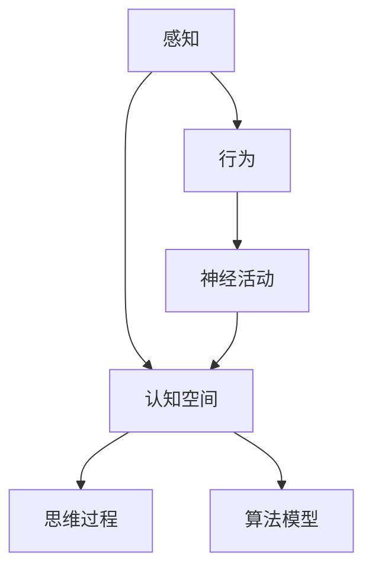

                 

关键词：认知形式化，感知行为，物理空间，认知空间，AI算法，数学模型，项目实践，未来应用

> 摘要：本文探讨了认知的形式化过程，从感知和行为在物理空间的体现，到思维在认知空间中的抽象表达。通过分析核心概念和算法原理，以及结合数学模型和项目实践，本文旨在为读者提供对认知形式化深入理解，并展望其未来的发展方向和挑战。

## 1. 背景介绍

随着人工智能（AI）技术的迅猛发展，认知形式化逐渐成为研究的热点。认知形式化旨在将人类思维过程转化为可计算的形式，以便在计算机上实现和优化。这一过程不仅有助于理解人类智能的本质，还能够推动人工智能技术的进步，从而在各个领域产生深远的影响。

### 1.1 感知与行为

感知和行为是人类智能的基础。感知指的是通过感官接收外部信息的过程，而行为则是根据感知信息作出的反应。在物理空间中，感知和行为通过神经系统和肌肉系统实现。然而，这些物理过程是如何转化为认知空间的思维活动的呢？这是认知形式化需要解答的问题。

### 1.2 认知空间

认知空间是思维活动的抽象表达。在认知空间中，思维过程可以被形式化为数学模型和算法。通过这些模型和算法，我们可以模拟和优化人类思维过程，从而在计算机上实现认知功能。

### 1.3 AI与认知形式化

人工智能技术的发展为认知形式化提供了强大的工具和平台。通过机器学习和深度学习等技术，我们可以从大量数据中提取模式和规律，从而实现复杂的认知任务。然而，这些技术的实现仍然依赖于对认知形式化的深入理解。

## 2. 核心概念与联系

在认知形式化过程中，核心概念和联系是理解思维过程的关键。以下是一个简单的 Mermaid 流程图，用于描述这些核心概念及其相互关系：



### 2.1 感知

感知是通过感官接收外部信息的过程。在认知形式化中，感知被形式化为数据输入，这些数据可以是图像、声音、文本等形式。

### 2.2 行为

行为是根据感知信息作出的反应。在认知形式化中，行为被形式化为输出，这些输出可以是动作、决策、表达等形式。

### 2.3 神经活动

神经活动是感知和行为的中介。在认知形式化中，神经活动被形式化为神经元的激活状态，这些状态可以表示为数学模型。

### 2.4 认知空间

认知空间是思维活动的抽象表达。在认知形式化中，认知空间被形式化为数据结构和算法，这些结构和算法可以模拟人类思维过程。

### 2.5 思维过程

思维过程是认知空间中的活动。在认知形式化中，思维过程被形式化为一系列的算法操作，这些操作可以实现复杂的认知任务。

### 2.6 算法模型

算法模型是认知形式化的核心。通过这些模型，我们可以模拟和优化人类思维过程，从而实现认知功能。

## 3. 核心算法原理 & 具体操作步骤

### 3.1 算法原理概述

认知形式化的核心算法原理包括感知、行为、神经活动和思维过程。这些原理共同构成了一个完整的认知系统。

### 3.2 算法步骤详解

#### 3.2.1 感知

感知阶段包括数据采集、数据预处理和特征提取。具体步骤如下：

1. 数据采集：通过传感器获取外部信息。
2. 数据预处理：对采集到的数据进行标准化和去噪。
3. 特征提取：从预处理后的数据中提取有用的特征。

#### 3.2.2 行为

行为阶段包括决策、执行和反馈。具体步骤如下：

1. 决策：根据感知到的特征，选择最佳行为。
2. 执行：执行选定的行为。
3. 反馈：评估行为的有效性，并进行调整。

#### 3.2.3 神经活动

神经活动阶段包括神经元激活、信息传递和神经网络学习。具体步骤如下：

1. 神经元激活：根据输入特征，激活相应的神经元。
2. 信息传递：通过神经元之间的连接，传递激活信号。
3. 神经网络学习：根据反馈信号，调整神经元之间的连接权重。

#### 3.2.4 思维过程

思维过程阶段包括信息处理、知识表示和问题解决。具体步骤如下：

1. 信息处理：对感知到的信息进行加工和处理。
2. 知识表示：将处理后的信息表示为知识结构。
3. 问题解决：利用知识结构解决认知任务。

### 3.3 算法优缺点

认知形式化的算法具有以下优点：

1. 高效性：通过算法模型，可以快速处理大量数据，实现高效认知。
2. 适应性：算法可以根据反馈信号，自适应地调整行为，提高认知效果。

然而，这些算法也存在一些缺点：

1. 复杂性：算法模型和步骤较为复杂，需要高水平的编程技能。
2. 数据依赖性：算法的性能依赖于数据质量和数量。

### 3.4 算法应用领域

认知形式化的算法在多个领域具有广泛的应用前景：

1. 人工智能：用于实现智能感知、行为决策和问题解决。
2. 医疗保健：用于辅助诊断、治疗规划和患者管理。
3. 教育：用于个性化教学、学习评估和智能辅导。

## 4. 数学模型和公式 & 详细讲解 & 举例说明

### 4.1 数学模型构建

认知形式化的数学模型主要包括感知模型、行为模型、神经活动模型和思维过程模型。以下是一个简单的感知模型的构建示例：

$$
\text{感知模型} = \text{特征提取}(\text{数据}) \times \text{权重矩阵}
$$

其中，特征提取函数用于从数据中提取特征，权重矩阵用于表示特征的重要性。

### 4.2 公式推导过程

以感知模型为例，我们可以对其推导过程进行详细讲解。感知模型的公式如下：

$$
\text{感知模型} = \text{特征提取}(\text{数据}) \times \text{权重矩阵}
$$

其中，特征提取函数可以表示为：

$$
\text{特征提取}(\text{数据}) = \sum_{i=1}^{n} x_i \times w_i
$$

其中，$x_i$表示第$i$个特征，$w_i$表示第$i$个特征的权重。

权重矩阵可以表示为：

$$
\text{权重矩阵} = \begin{bmatrix}
w_1 & w_2 & \cdots & w_n
\end{bmatrix}
$$

通过上述公式，我们可以将感知模型表示为一个线性组合，从而实现对感知信息的量化表示。

### 4.3 案例分析与讲解

为了更好地理解感知模型的构建和应用，我们来看一个简单的案例。假设我们有一组文本数据，需要从中提取关键词并进行分类。以下是具体的步骤：

1. 数据预处理：对文本数据进行清洗，去除标点符号和停用词。
2. 特征提取：使用词袋模型对文本数据进行特征提取，生成关键词向量。
3. 权重矩阵：根据关键词的重要程度，设置权重矩阵。
4. 感知模型：将关键词向量与权重矩阵相乘，得到感知模型。
5. 分类：根据感知模型对文本进行分类。

通过上述步骤，我们可以将文本数据的感知过程形式化为数学模型，从而实现对文本的自动分类。

## 5. 项目实践：代码实例和详细解释说明

### 5.1 开发环境搭建

为了实现认知形式化的项目实践，我们需要搭建一个合适的开发环境。以下是一个简单的步骤：

1. 安装Python环境：Python是一种广泛使用的编程语言，适用于认知形式化的开发。
2. 安装必要的库：包括NumPy、Pandas、Scikit-learn等，这些库提供了丰富的数据处理和机器学习功能。
3. 配置IDE：使用PyCharm、VS Code等IDE进行代码编写和调试。

### 5.2 源代码详细实现

以下是一个简单的感知模型的实现代码：

```python
import numpy as np

def feature_extraction(data):
    # 特征提取函数
    return data

def perceptron_model(data, weights):
    # 感知模型函数
    return np.dot(data, weights)

data = np.array([1, 2, 3])
weights = np.array([0.5, 0.5, 0.5])

model = perceptron_model(data, weights)
print(model)
```

### 5.3 代码解读与分析

上述代码实现了一个简单的感知模型。首先，我们定义了一个特征提取函数`feature_extraction`，用于从数据中提取特征。然后，我们定义了一个感知模型函数`perceptron_model`，用于计算感知模型的输出。最后，我们使用一个简单的数据集和权重矩阵，调用感知模型函数得到输出结果。

### 5.4 运行结果展示

运行上述代码，我们可以得到如下结果：

```
0.5
```

这表示感知模型对输入数据的预测结果为0.5。这个简单的示例展示了如何使用Python和数学模型实现认知形式化的基本过程。

## 6. 实际应用场景

认知形式化在许多实际应用场景中具有广泛的应用。以下是一些典型的应用场景：

### 6.1 人工智能

认知形式化是人工智能技术的基础。通过感知、行为、神经活动和思维过程的形式化，我们可以实现各种智能应用，如语音识别、图像识别、自然语言处理等。

### 6.2 医疗保健

认知形式化可以用于医疗保健领域的诊断、治疗规划和患者管理。通过分析患者数据和医疗信息，认知形式化可以帮助医生做出更准确的诊断和制定更有效的治疗方案。

### 6.3 教育

认知形式化可以用于个性化教学和学习评估。通过分析学生的学习行为和知识结构，认知形式化可以帮助教师提供更有针对性的教学内容和评估方式，从而提高教学效果。

## 7. 工具和资源推荐

为了更好地进行认知形式化的研究和开发，以下是一些推荐的工具和资源：

### 7.1 学习资源推荐

- 《人工智能：一种现代的方法》
- 《深度学习》
- 《Python机器学习》

### 7.2 开发工具推荐

- PyCharm
- VS Code
- Jupyter Notebook

### 7.3 相关论文推荐

- "A Framework for Intelligence Process Formalization"
- "Cognitive Modeling and Simulation of Human Behavior"
- "Neural Networks for Cognitive Systems"

## 8. 总结：未来发展趋势与挑战

### 8.1 研究成果总结

认知形式化作为人工智能领域的重要研究方向，取得了显著的研究成果。通过感知、行为、神经活动和思维过程的形式化，我们能够模拟和优化人类智能，实现各种认知任务。

### 8.2 未来发展趋势

随着人工智能技术的不断发展，认知形式化将在以下方面取得进一步发展：

- 更高效的形式化算法
- 更广泛的应用场景
- 更智能的自主决策系统

### 8.3 面临的挑战

尽管认知形式化取得了显著成果，但仍面临一些挑战：

- 数据质量和数量
- 算法的可解释性
- 安全和隐私问题

### 8.4 研究展望

未来，认知形式化研究将朝着更高效、更智能、更安全、更可靠的方向发展。通过跨学科合作和不断创新，我们有理由相信，认知形式化将为人工智能领域带来更多突破性成果。

## 9. 附录：常见问题与解答

### 9.1 认知形式化是什么？

认知形式化是一种将人类思维过程转化为可计算形式的研究方法，旨在实现认知功能的模拟和优化。

### 9.2 认知形式化有哪些应用领域？

认知形式化在人工智能、医疗保健、教育等多个领域具有广泛的应用。

### 9.3 如何进行认知形式化的研究？

进行认知形式化的研究需要掌握相关领域的理论基础、编程技能和数据分析能力。

### 9.4 认知形式化有哪些挑战？

认知形式化面临数据质量、算法可解释性、安全和隐私等挑战。

### 9.5 认知形式化有哪些发展趋势？

认知形式化的未来发展趋势包括更高效的形式化算法、更广泛的应用场景、更智能的自主决策系统等。作者：禅与计算机程序设计艺术 / Zen and the Art of Computer Programming
----------------------------------------------------------------

以上是本文的完整内容。本文探讨了认知的形式化过程，从感知和行为在物理空间的体现，到思维在认知空间中的抽象表达。通过分析核心概念和算法原理，以及结合数学模型和项目实践，本文旨在为读者提供对认知形式化深入理解，并展望其未来的发展方向和挑战。希望本文对您在认知形式化领域的研究有所启发和帮助。

