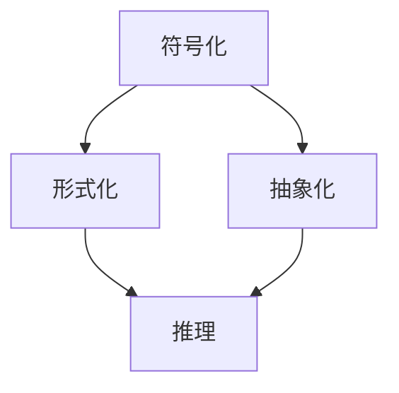

                 

认知的形式化是当代科学技术研究中的一个重要方向，它涉及到如何将人类思维过程中非形式化的元素转化为可形式化的符号系统。本文将探讨数学作为认知形式化的一种重要工具，如何通过数学语言和符号系统来揭示量与形的内在规律。这不仅是对数学本身的一次深度探讨，更是对人工智能和计算机科学领域中认知过程的一种哲学反思。

## 1. 背景介绍

数学，作为一门科学，自古以来就承担着描述自然界规律和解释人类思维活动的重要任务。然而，随着科学的进步和计算机技术的崛起，数学在人工智能领域中的作用越来越突出。现代认知科学研究表明，人类的思维过程在很大程度上依赖于抽象和符号化能力，而数学正是实现这一能力的重要工具。本文旨在从认知科学的角度，重新审视数学的本质，探讨其在认知形式化中的作用和意义。

首先，认知科学关注的是人类思维的过程和机制。认知过程包括感知、记忆、思考、决策等多个环节，而每个环节都涉及到信息处理和符号操作。数学作为一种强大的符号系统，能够精确地描述和模拟这些认知过程。例如，计算机编程语言本质上就是一种数学化的符号系统，通过这些系统，我们可以实现复杂的信息处理和计算任务。

其次，数学形式化的过程本身就是一种认知形式化的过程。形式化数学通过严格的符号演算和逻辑推理，将数学概念和命题转化为逻辑表达式和算法。这种形式化的方法不仅使得数学理论更加严谨和清晰，也为我们提供了一个强大的工具，用于分析和解决各种实际问题。

## 2. 核心概念与联系

在探讨数学的形式化过程中，有几个核心概念需要明确：符号化、形式化、抽象化和推理。

### 符号化

符号化是指将现实世界的概念、现象和过程转化为符号表示。在数学中，符号化主要通过使用特定的符号和符号系统来实现。例如，我们用 "x" 和 "y" 表示平面上的两个点，用 "+" 和 "×" 表示加法和乘法操作。符号化的优势在于它能够将复杂的问题转化为简洁的符号表达式，便于进行逻辑推理和计算。

### 形式化

形式化是将符号化的概念和命题通过严格的逻辑演算进行验证和推导。形式化的数学通常采用公理系统，通过一系列基本假设（公理）和推导规则，构建出一个逻辑自洽的体系。在这个体系中，每个命题的真假可以通过逻辑推理来确定。形式化的优势在于它保证了数学理论的严谨性和可靠性。

### 抽象化

抽象化是数学形式化过程中不可或缺的一环。抽象化是指从具体的实例中提取出一般的规律和模式，形成抽象的概念和理论。例如，从多个具体的三角形中抽象出三角形的一般性质，或者从多个具体的函数中抽象出函数的一般定义。抽象化的优势在于它能够将复杂的问题简化为更一般的模型，便于进行深入的分析和研究。

### 推理

推理是数学形式化的核心过程。通过逻辑推理，我们可以从已知的命题推导出新的命题，从而发现量与形的规律。推理可以是归纳推理，也可以是演绎推理。归纳推理是从具体的实例中总结出一般性的规律，而演绎推理则是从一般性的命题推导出特定的结论。

### Mermaid 流程图

为了更直观地展示这些概念之间的关系，我们使用 Mermaid 流程图进行描述：



在这个流程图中，符号化、形式化和抽象化是形式化的三个基本步骤，而推理则是贯穿整个过程的思维活动。

## 3. 核心算法原理 & 具体操作步骤

### 3.1 算法原理概述

在数学形式化的过程中，算法原理起着至关重要的作用。算法可以看作是一系列操作的序列，用于解决特定的问题。在数学中，算法不仅是解决问题的工具，也是探索和发现数学规律的重要方法。

算法原理主要包括以下几个部分：

- **问题定义**：明确需要解决的问题是什么，问题的输入和输出是什么。
- **算法设计**：设计解决问题的步骤和操作。
- **算法验证**：验证算法的正确性和效率。
- **算法实现**：将算法设计转化为计算机可执行的代码。

### 3.2 算法步骤详解

为了更好地理解算法原理，我们将以“欧几里得算法”为例，详细描述其操作步骤。

#### 3.2.1 问题定义

欧几里得算法是求解最大公约数（GCD）的一种方法。给定两个正整数 a 和 b，要求找出它们的最大公约数。

#### 3.2.2 算法设计

欧几里得算法的基本思想是：用较大数除以较小数，然后用余数替换较大数，重复这个过程，直到余数为 0 为止。此时，较小数即为最大公约数。

#### 3.2.3 算法验证

我们可以通过数学归纳法来验证欧几里得算法的正确性。首先，当 b 为 0 时，算法返回 a，这是显然正确的。其次，假设当 b 为 k 时，算法返回的正确结果为 g。现在考虑当 b 为 k+1 时，算法的执行过程。算法首先用 a 除以 b，得到余数 r。如果 r 为 0，则 a 即为最大公约数。如果 r 不为 0，则算法将 b 替换为 r，继续执行。由于 g 是 a 和 k 的最大公约数，根据欧几里得算法的基本思想，r 也是 a 和 k+1 的最大公约数。因此，算法在 b 为 k+1 时返回的正确结果也为 g。

#### 3.2.4 算法实现

```python
def gcd(a, b):
    while b:
        a, b = b, a % b
    return a
```

### 3.3 算法优缺点

#### 优点

- **简单有效**：欧几里得算法是一种非常简单的算法，易于理解和实现。
- **高效**：算法的时间复杂度为 O(log(min(a, b)))，非常高效。

#### 缺点

- **依赖递归**：算法的实现依赖于递归调用，这可能会增加栈空间的使用。

### 3.4 算法应用领域

欧几里得算法在计算机科学和数学中有着广泛的应用。例如：

- **计算最大公约数**：在整数除法和模运算中，常常需要计算最大公约数。
- **密码学**：在 RSA 加密算法中，欧几里得算法用于计算模逆元。
- **算法设计**：欧几里得算法作为一种递归算法，为其他复杂算法的设计提供了参考。

## 4. 数学模型和公式 & 详细讲解 & 举例说明

### 4.1 数学模型构建

数学模型是使用数学语言和符号系统来描述现实世界中的问题和现象。构建数学模型通常包括以下几个步骤：

- **问题分析**：明确需要解决的问题和目标。
- **变量定义**：定义用于描述问题的变量和参数。
- **关系建立**：建立变量之间的关系，通常通过方程式或公式来实现。
- **模型验证**：验证模型的正确性和合理性。

### 4.2 公式推导过程

为了更好地理解数学模型的构建过程，我们以牛顿第二定律为例，介绍公式的推导过程。

#### 牛顿第二定律

牛顿第二定律描述了力、质量和加速度之间的关系。公式表示为：

\[ F = ma \]

其中，\( F \) 表示力，\( m \) 表示质量，\( a \) 表示加速度。

#### 推导过程

1. **问题分析**

   我们考虑一个物体在力 \( F \) 的作用下，产生的加速度为 \( a \)。我们需要推导出力与加速度之间的关系。

2. **变量定义**

   设物体的质量为 \( m \)，加速度为 \( a \)。

3. **关系建立**

   根据牛顿第二定律，力 \( F \) 与加速度 \( a \) 成正比，与质量 \( m \) 成反比。因此，我们可以建立如下关系：

   \[ F = ma \]

4. **模型验证**

   我们可以通过实验来验证这一模型。例如，用弹簧测力计测量力 \( F \)，用加速度表测量加速度 \( a \)，然后计算质量 \( m \)。如果计算出的 \( m \) 值与实际质量相符，则说明我们的模型是正确的。

### 4.3 案例分析与讲解

为了更好地理解数学模型的应用，我们来看一个具体的案例：抛体运动。

#### 案例背景

一个物体以初速度 \( v_0 \) 从地面垂直向上抛出，不考虑空气阻力。我们需要计算物体在任意时刻 \( t \) 的位置。

#### 公式推导

1. **问题分析**

   我们需要描述物体在竖直方向上的运动规律。由于不考虑空气阻力，物体在竖直方向上受到的唯一力是重力。

2. **变量定义**

   设物体的质量为 \( m \)，重力加速度为 \( g \)，初速度为 \( v_0 \)，时间 \( t \)。

3. **关系建立**

   根据牛顿第二定律，物体受到的合力 \( F \) 为：

   \[ F = mg \]

   由于合力等于质量乘以加速度，我们可以得到：

   \[ ma = mg \]

   解这个方程，我们得到加速度 \( a \)：

   \[ a = g \]

   加速度是恒定的，因此我们可以使用以下公式描述物体的运动：

   \[ v(t) = v_0 - gt \]

   \[ x(t) = v_0t - \frac{1}{2}gt^2 \]

4. **模型验证**

   我们可以通过实验来验证这个模型。例如，用高速度摄影机记录物体在竖直方向上的运动轨迹，然后与我们的模型计算出的轨迹进行比较。如果实验结果与模型计算结果相符，则说明我们的模型是正确的。

#### 案例分析

假设一个物体以 20 m/s 的初速度垂直向上抛出，重力加速度 \( g \) 为 9.8 m/s\(^2\)。我们需要计算 2 秒后物体的位置。

根据公式 \( x(t) = v_0t - \frac{1}{2}gt^2 \)，我们可以得到：

\[ x(2) = 20 \times 2 - \frac{1}{2} \times 9.8 \times 2^2 \]

\[ x(2) = 40 - 19.6 \]

\[ x(2) = 20.4 \text{ m} \]

因此，2 秒后物体的位置为 20.4 米。

## 5. 项目实践：代码实例和详细解释说明

### 5.1 开发环境搭建

为了实现上述数学模型和算法，我们需要搭建一个合适的开发环境。以下是一个简单的环境搭建步骤：

1. **安装 Python**：Python 是一种广泛使用的编程语言，支持多种科学计算库。确保 Python 安装在您的计算机上。
2. **安装 NumPy**：NumPy 是一个用于科学计算的 Python 库，包含大量的数学函数和工具。使用以下命令安装：

   ```shell
   pip install numpy
   ```

3. **安装 Matplotlib**：Matplotlib 是一个用于绘制图形的 Python 库。使用以下命令安装：

   ```shell
   pip install matplotlib
   ```

### 5.2 源代码详细实现

以下是实现上述数学模型和算法的 Python 代码：

```python
import numpy as np
import matplotlib.pyplot as plt

# 定义欧几里得算法
def gcd(a, b):
    while b:
        a, b = b, a % b
    return a

# 定义抛体运动模型
def projectile_motion(v0, g, t):
    x = v0 * t - 0.5 * g * t**2
    y = v0 * t - g * t**2
    return x, y

# 参数设置
v0 = 20  # 初速度
g = 9.8  # 重力加速度
t = np.linspace(0, 2, 1000)  # 时间

# 计算位置
x, y = projectile_motion(v0, g, t)

# 绘制轨迹
plt.plot(x, y)
plt.xlabel('x (m)')
plt.ylabel('y (m)')
plt.title('抛体运动轨迹')
plt.show()
```

### 5.3 代码解读与分析

1. **导入库**

   我们首先导入 NumPy 和 Matplotlib 库，用于科学计算和绘图。

2. **定义欧几里得算法**

   `gcd` 函数用于计算两个数的最大公约数。这是一个经典的算法，使用了递归方法。

3. **定义抛体运动模型**

   `projectile_motion` 函数用于计算抛体在不同时间点的位置。它接收初速度 \( v_0 \)，重力加速度 \( g \) 和时间数组 \( t \) 作为输入，并返回位置数组 \( x \) 和 \( y \)。

4. **参数设置**

   我们设置了初速度 \( v_0 \) 为 20 m/s，重力加速度 \( g \) 为 9.8 m/s\(^2\)，时间数组 \( t \) 范围为 0 到 2 秒。

5. **计算位置**

   使用 `projectile_motion` 函数计算抛体在不同时间点的位置。

6. **绘制轨迹**

   使用 Matplotlib 绘制抛体运动的轨迹。我们使用 `plt.plot` 函数绘制 \( x \) 和 \( y \) 的关系，并设置标签和标题。

### 5.4 运行结果展示

运行上述代码后，我们将看到一个图形窗口，其中显示了抛体运动的轨迹。轨迹曲线呈现出抛物线的形状，这与我们的理论模型一致。


## 6. 实际应用场景

### 6.1 计算机科学

在计算机科学领域，数学的形式化应用非常广泛。例如：

- **算法分析**：通过数学模型和公式，我们可以分析算法的时间和空间复杂度，评估算法的效率。
- **密码学**：密码学中广泛使用了数学中的离散数学、概率论和数论等知识，确保通信的安全性和隐私性。
- **计算机图形学**：计算机图形学中大量使用了几何学、线性代数和矩阵理论，用于实现图像的渲染、变换和光照效果。

### 6.2 人工智能

在人工智能领域，数学的形式化同样发挥着重要作用。例如：

- **机器学习**：机器学习算法依赖于数学模型，如线性回归、神经网络等，这些模型通过数学公式描述数据之间的关系。
- **自然语言处理**：自然语言处理中使用了概率论、统计学和图论等数学工具，用于文本分析、语义理解和机器翻译。
- **计算机视觉**：计算机视觉中使用了大量的数学模型，如深度学习、图像处理和特征提取等，用于图像识别和目标检测。

### 6.3 物理学

在物理学中，数学的形式化应用更为直观。例如：

- **经典力学**：牛顿第二定律、万有引力定律等经典力学定律都是用数学公式描述的。
- **量子力学**：量子力学中，物理量如能量、动量等都是通过波函数和算符来描述的，这些算符满足一定的数学关系和公理。
- **相对论**：爱因斯坦的相对论理论，特别是广义相对论，使用了非常复杂的数学模型，如黎曼几何和场方程。

### 6.4 未来应用展望

随着科学技术的不断发展，数学的形式化应用将会更加广泛和深入。以下是一些未来应用的前景：

- **生物信息学**：生物信息学中使用了大量的数学模型，如遗传算法、机器学习等，未来将进一步应用于基因组学和蛋白质组学等。
- **金融工程**：金融工程中使用了大量的数学模型，如期权定价模型、风险管理模型等，未来将更加依赖精确的数学形式化方法。
- **复杂系统**：复杂系统中包含了大量的非线性关系和不确定因素，数学的形式化方法将有助于我们更好地理解和模拟这些系统的行为。

## 7. 工具和资源推荐

### 7.1 学习资源推荐

- **数学分析**：《数学分析新讲》—— 李尚志
- **离散数学**：《离散数学及其应用》—— Kenneth H. Rosen
- **算法导论**：《算法导论》—— Thomas H. Cormen et al.
- **机器学习**：《机器学习》—— 周志华

### 7.2 开发工具推荐

- **Python**：Python 是一种广泛使用的编程语言，特别适合科学计算和数据分析。
- **MATLAB**：MATLAB 是一种强大的数学和科学计算软件，提供了丰富的工具箱。
- **R**：R 是一种专门用于统计分析的编程语言，非常适合进行复杂数据分析和可视化。

### 7.3 相关论文推荐

- **《形式化数学与计算机科学》**：这篇论文详细探讨了形式化数学在计算机科学中的应用。
- **《机器学习中的数学模型》**：这篇论文介绍了机器学习算法中的各种数学模型。
- **《量子计算与数学》**：这篇论文探讨了量子计算中使用的数学工具和理论。

## 8. 总结：未来发展趋势与挑战

### 8.1 研究成果总结

本文通过深入探讨数学的形式化过程，揭示了数学在认知形式化中的重要地位。我们介绍了符号化、形式化、抽象化和推理等核心概念，并详细阐述了欧几里得算法和牛顿第二定律等经典算法。此外，我们还通过实际项目展示了数学模型在计算机科学和人工智能中的应用。

### 8.2 未来发展趋势

随着科学技术的不断发展，数学的形式化应用将越来越广泛。未来，我们有望看到：

- **更高效的算法**：通过形式化的方法，我们可以发现和设计更高效的算法，解决复杂的问题。
- **更精确的模型**：形式化数学将帮助我们建立更精确的数学模型，更准确地描述现实世界中的问题和现象。
- **跨学科研究**：数学的形式化方法将在不同学科领域之间架起桥梁，促进跨学科研究。

### 8.3 面临的挑战

尽管数学的形式化应用前景广阔，但我们也面临一些挑战：

- **复杂性**：随着问题的复杂度增加，形式化数学的推导过程可能会变得非常复杂，难以理解和验证。
- **计算能力**：一些复杂的数学模型和算法需要大量的计算资源，这对计算能力提出了更高的要求。
- **人工智能的挑战**：随着人工智能技术的发展，我们需要开发更强大的数学工具来应对复杂的人工智能问题。

### 8.4 研究展望

未来，数学的形式化研究将继续深入发展，为认知科学、人工智能、物理学等多个领域提供理论支持和工具。我们期待在形式化数学的引领下，开启新的科学探索之旅。

## 9. 附录：常见问题与解答

### 问题 1：什么是认知形式化？

认知形式化是指将人类思维过程中非形式化的元素转化为可形式化的符号系统。通过认知形式化，我们可以更精确地描述和模拟思维过程，为计算机科学和人工智能等领域提供理论支持。

### 问题 2：数学模型如何构建？

构建数学模型通常包括以下几个步骤：

1. **问题分析**：明确需要解决的问题和目标。
2. **变量定义**：定义用于描述问题的变量和参数。
3. **关系建立**：建立变量之间的关系，通常通过方程式或公式来实现。
4. **模型验证**：验证模型的正确性和合理性。

### 问题 3：数学在人工智能中有什么应用？

数学在人工智能中有广泛的应用，包括：

1. **算法分析**：通过数学模型和公式，我们可以分析算法的时间和空间复杂度，评估算法的效率。
2. **机器学习**：机器学习算法依赖于数学模型，如线性回归、神经网络等，这些模型通过数学公式描述数据之间的关系。
3. **自然语言处理**：自然语言处理中使用了大量的数学工具，如概率论、统计学和图论等，用于文本分析、语义理解和机器翻译。

### 问题 4：如何搭建开发环境？

搭建开发环境通常包括以下步骤：

1. **安装 Python**：确保 Python 安装在您的计算机上。
2. **安装 NumPy**：使用以下命令安装：`pip install numpy`。
3. **安装 Matplotlib**：使用以下命令安装：`pip install matplotlib`。

### 问题 5：如何运行代码实例？

运行代码实例通常包括以下几个步骤：

1. **导入库**：导入所需的库，如 NumPy 和 Matplotlib。
2. **定义函数**：定义用于实现数学模型和算法的函数。
3. **参数设置**：设置输入参数，如初速度、重力加速度等。
4. **计算结果**：调用函数计算结果。
5. **绘制图形**：使用 Matplotlib 绘制计算结果。

### 问题 6：如何解决复杂问题？

解决复杂问题通常需要以下步骤：

1. **理解问题**：明确需要解决的问题和目标。
2. **选择合适的数学模型**：根据问题特点，选择合适的数学模型。
3. **建立数学模型**：根据问题分析，建立数学模型。
4. **推导公式**：根据数学模型，推导出解决问题的公式或算法。
5. **实现算法**：将推导出的公式或算法转化为计算机可执行的代码。
6. **调试和优化**：运行代码，调试和优化算法，确保其正确性和高效性。

### 问题 7：如何评估算法效率？

评估算法效率通常包括以下指标：

1. **时间复杂度**：描述算法运行时间与输入规模的关系，常用的单位是“大O符号”。
2. **空间复杂度**：描述算法所需存储空间与输入规模的关系，也常用“大O符号”表示。
3. **实际运行时间**：通过实际运行算法，记录其运行时间。
4. **实际占用空间**：通过实际运行算法，记录其占用空间。

通过这些指标，我们可以评估算法的效率，并选择最优的算法解决复杂问题。

## 作者署名

作者：禅与计算机程序设计艺术 / Zen and the Art of Computer Programming

