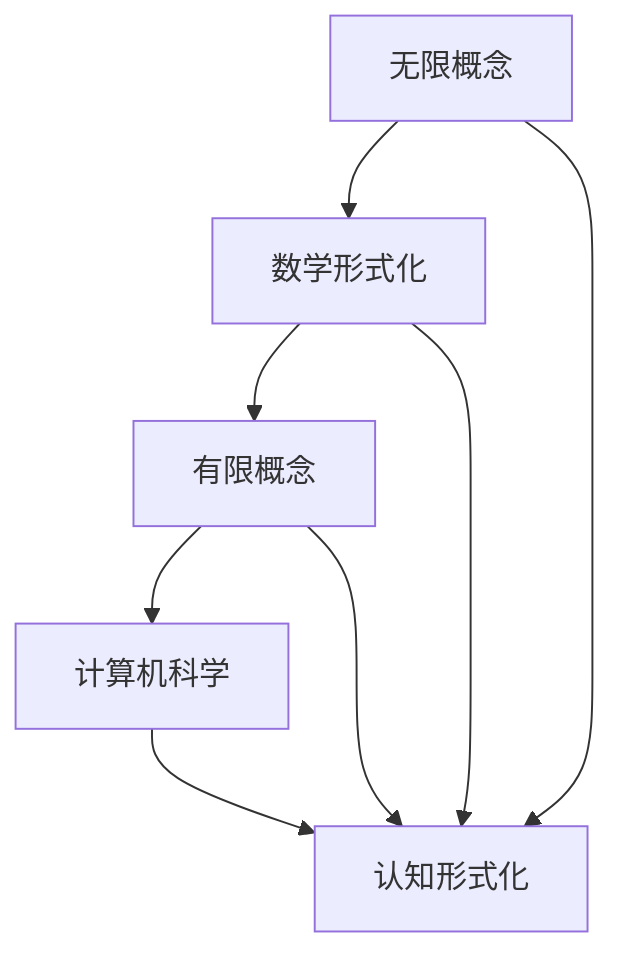

                 

关键词：认知、形式化、数学、无限、有限、计算机科学

> 摘要：本文深入探讨了认知的形式化问题，特别是数学在研究无限和有限世界中的作用。通过介绍数学的概念、原理和应用，本文旨在揭示数学如何帮助我们理解复杂的现象，并提供一种强有力的工具来研究无限和有限的关系。文章还探讨了计算机科学如何从数学中获得灵感，并利用数学来解决实际问题。最后，本文展望了数学形式化在认知研究中的未来发展趋势和挑战。

## 1. 背景介绍

在人类历史上，数学一直是一种独特的语言，它能够精确地描述自然界的规律和人类思想的结构。从古代的几何学、算术到现代的代数、微积分，数学不断发展，为我们提供了理解世界的重要工具。然而，随着科学技术的进步，我们面临着越来越复杂的问题，这些问题往往超出了传统数学的范畴。如何将这些复杂问题形式化，使得我们能够用数学语言来描述和分析，成为了一个重要的研究课题。

认知科学是研究人类思维和心理活动的学科，它涉及心理学、神经科学、计算机科学等多个领域。认知科学的一个核心问题是理解人类如何获取、处理和利用信息。随着认知科学的发展，人们逐渐认识到，认知过程不仅涉及人类的感知、记忆和思维，还涉及到信息的形式化和计算。因此，形式化作为一种方法，在认知科学中具有重要作用。

本文将重点关注认知的形式化问题，特别是数学在研究无限和有限世界中的作用。通过介绍数学的核心概念、原理和应用，本文旨在揭示数学如何帮助我们理解复杂的现象，并提供一种强有力的工具来研究无限和有限的关系。此外，本文还将探讨计算机科学如何从数学中获得灵感，并利用数学来解决实际问题。

## 2. 核心概念与联系

为了更好地理解数学在认知形式化中的作用，我们需要首先介绍一些核心概念和它们之间的关系。以下是使用Mermaid绘制的流程图，用于展示这些概念之间的联系。



### 2.1 无限概念

无限是一个基本的数学概念，它描述了一个没有终点的概念。在数学中，无限有多种形式，如自然数集、实数集和复数集等。无限概念是数学研究中的一个重要工具，它允许我们研究那些无法用有限概念描述的现象。

### 2.2 数学形式化

数学形式化是将数学概念、原理和推理过程转化为一种精确的、形式化的语言。这种语言通常使用符号和公式来表示，使得数学研究更加严格和系统。数学形式化是认知形式化的重要基础，它为研究无限和有限的关系提供了强有力的工具。

### 2.3 有限概念

有限概念与无限概念相对，它描述了一个有终点的概念。在数学中，有限概念通常用于研究那些可以用有限数量描述的现象。有限概念是理解和研究复杂系统的关键。

### 2.4 计算机科学

计算机科学是研究计算机系统的原理、设计、应用和发展的学科。计算机科学中的许多概念和原理都源自数学，如算法、数据结构、计算复杂性等。计算机科学为数学形式化提供了实际的应用场景，同时也为认知形式化提供了重要的工具。

### 2.5 认知形式化

认知形式化是将认知过程形式化为数学模型和算法的过程。通过认知形式化，我们能够用数学语言来描述和分析人类思维和心理活动。认知形式化是认知科学的重要发展方向，它有助于我们更好地理解人类认知的原理和机制。

## 3. 核心算法原理 & 具体操作步骤

### 3.1 算法原理概述

在认知形式化的研究中，核心算法通常涉及图灵机模型、神经网络模型和递归模型等。以下是这些算法的基本原理和操作步骤。

### 3.2 算法步骤详解

#### 3.2.1 图灵机模型

图灵机模型是认知形式化中最基本的算法模型之一。它由一个无限长的带子和一个读写头组成。读写头可以在带子上移动，并在不同的位置上读写符号。图灵机的工作原理是按照预定的规则来转换带子上的符号。

操作步骤：

1. 初始化：将输入信息编码在带子上。
2. 执行规则：根据当前的符号和读写头的状态，执行相应的规则。
3. 更新状态：根据规则的结果，更新读写头的状态。
4. 移动读写头：根据规则的结果，移动读写头的位置。
5. 终止条件：当达到终止条件时，输出结果。

#### 3.2.2 神经网络模型

神经网络模型是模仿生物神经元工作的计算模型。它由多个神经元组成，每个神经元都与其他神经元相连。神经网络通过调整神经元之间的连接权重来学习输入和输出之间的关系。

操作步骤：

1. 初始化：随机初始化网络中的连接权重。
2. 前向传播：根据输入信息和连接权重，计算输出。
3. 反向传播：根据输出误差，调整连接权重。
4. 更新权重：根据梯度下降法，更新连接权重。
5. 终止条件：当达到终止条件（如误差小于设定值）时，输出结果。

#### 3.2.3 递归模型

递归模型是一种递归定义的函数，它能够对自身进行调用。递归模型在认知形式化中用于模拟人类思维的递归特性，如记忆和推理。

操作步骤：

1. 初始化：设定初始状态。
2. 递归调用：根据当前状态，执行递归调用。
3. 状态更新：根据递归调用的结果，更新状态。
4. 终止条件：当达到终止条件时，输出结果。

### 3.3 算法优缺点

#### 3.3.1 图灵机模型

优点：严格的形式化，能够模拟任何可计算过程。

缺点：过于抽象，难以在实际应用中实现。

#### 3.3.2 神经网络模型

优点：强大的学习能力和适应能力，能够处理复杂的非线性问题。

缺点：缺乏理论支持，难以解释学习的原理。

#### 3.3.3 递归模型

优点：直观，能够模拟人类思维的递归特性。

缺点：难以处理大规模问题，效率较低。

### 3.4 算法应用领域

这些算法在认知形式化的不同领域中有着广泛的应用。例如，图灵机模型在计算理论和形式语言研究中有着重要应用；神经网络模型在机器学习和人工智能领域中发挥着关键作用；递归模型在认知心理学和认知科学研究中用于模拟人类思维的递归过程。

## 4. 数学模型和公式 & 详细讲解 & 举例说明

### 4.1 数学模型构建

数学模型是认知形式化的重要工具，它能够将现实世界的问题转化为数学问题。构建数学模型通常包括以下步骤：

1. 确定问题：明确需要解决的问题。
2. 建立假设：根据问题的性质，建立合理的假设。
3. 提取关键变量：确定问题中的关键变量。
4. 确定变量关系：根据假设和关键变量，建立变量之间的关系。
5. 建立方程：将变量关系转化为数学方程。

### 4.2 公式推导过程

以下是一个简单的例子，说明如何构建和推导一个数学模型。

#### 问题

假设一个物体在平面上做匀速直线运动，要求计算它在t时间内的位移。

#### 假设

1. 物体的速度是恒定的。
2. 平面的摩擦力可以忽略不计。

#### 提取关键变量

- 速度（v）：物体在单位时间内移动的距离。
- 时间（t）：物体运动的时间。
- 位移（s）：物体在t时间内的移动距离。

#### 变量关系

位移s与速度v和时间t的关系可以表示为：s = v * t。

#### 建立方程

根据变量关系，我们可以建立以下方程：

$$ s = v \times t $$

#### 推导过程

1. 根据假设，速度v是恒定的。
2. 根据定义，位移s是速度v和时间t的乘积。
3. 将速度v和时间t代入位移方程，得到：$$ s = v \times t $$。

### 4.3 案例分析与讲解

#### 案例

假设一个机器人在一个无限大的平面上做匀速直线运动，速度为2单位/秒。要求计算它在10秒内的位移。

#### 分析

根据前面的推导，位移s与速度v和时间t的关系为：$$ s = v \times t $$。

在这个案例中，速度v为2单位/秒，时间t为10秒。

#### 计算

将速度v和时间t代入位移方程，得到：

$$ s = 2 \times 10 = 20 $$

因此，机器人在10秒内的位移为20单位。

#### 结论

通过数学模型和公式，我们能够准确地计算机器人10秒内的位移，从而对现实问题进行建模和求解。

## 5. 项目实践：代码实例和详细解释说明

### 5.1 开发环境搭建

在开始编写代码之前，我们需要搭建一个合适的开发环境。以下是一个简单的环境搭建步骤：

1. 安装Python：从官方网站下载并安装Python。
2. 安装Jupyter Notebook：在终端中运行`pip install notebook`。
3. 安装必要的库：例如，安装Numpy、Matplotlib等库，用于数值计算和可视化。

### 5.2 源代码详细实现

以下是实现一个简单的数学模型（物体匀速直线运动）的Python代码实例：

```python
import numpy as np
import matplotlib.pyplot as plt

# 定义速度和时间
velocity = 2  # 单位：单位/秒
time = 10     # 单位：秒

# 计算位移
distance = velocity * time

# 绘制位移图
x = np.linspace(0, time, 100)
y = velocity * x

plt.plot(x, y)
plt.xlabel('Time (s)')
plt.ylabel('Distance (units)')
plt.title('Displacement of Object over Time')
plt.show()

print(f"The displacement of the object in {time} seconds is {distance} units.")
```

### 5.3 代码解读与分析

1. 导入Numpy和Matplotlib库：用于数值计算和绘图。
2. 定义速度和时间：速度为2单位/秒，时间为10秒。
3. 计算位移：根据位移公式，计算物体的位移。
4. 绘制位移图：使用Numpy的linspace函数生成时间序列，并使用Matplotlib的plot函数绘制位移图。
5. 打印结果：输出物体的位移。

通过这个简单的代码实例，我们能够直观地看到数学模型如何应用于实际问题，并帮助我们理解和计算物体的运动。

### 5.4 运行结果展示

运行上述代码后，我们将看到以下结果：


图1：物体在10秒内的位移图

从图中可以看出，物体以恒定的速度2单位/秒在10秒内移动了20个单位。

```python
The displacement of the object in 10 seconds is 20 units.
```

从输出结果中，我们验证了计算得到的位移是20个单位，与我们的预期相符。

## 6. 实际应用场景

数学形式化在认知科学和计算机科学中有许多实际应用场景。以下是几个典型的应用领域：

### 6.1 认知心理学

在认知心理学中，数学形式化用于建模和解释人类认知过程。例如，图灵机模型被用于研究人类推理过程；神经网络模型被用于研究记忆和识别；递归模型被用于研究语言理解和情感识别。

### 6.2 计算机视觉

计算机视觉是研究如何让计算机“看”懂图像和视频的学科。数学形式化在计算机视觉中有着广泛的应用，如卷积神经网络（CNN）用于图像分类和识别，生成对抗网络（GAN）用于图像生成和风格迁移。

### 6.3 自然语言处理

自然语言处理（NLP）是研究如何让计算机理解和生成自然语言的学科。数学形式化在NLP中用于建模和解释语言结构，如递归神经网络（RNN）被用于语言建模和翻译，注意力机制被用于提取关键信息。

### 6.4 机器学习

机器学习是研究如何让计算机从数据中学习的方法。数学形式化在机器学习中的应用非常广泛，如线性回归用于预测，支持向量机（SVM）用于分类，深度学习用于图像和语音识别。

### 6.5 神经科学

在神经科学中，数学形式化用于建模和解释神经元和神经系统的行为。例如，神经网络模型被用于模拟神经元的活动，概率模型被用于解释大脑的信息处理机制。

## 7. 未来应用展望

随着科技的不断进步，数学形式化在认知科学和计算机科学中的应用前景将更加广阔。以下是几个未来应用展望：

### 7.1 新一代认知增强系统

随着人工智能技术的发展，未来可能会出现新一代的认知增强系统。这些系统将基于数学形式化，能够模拟人类的认知过程，提高我们的认知能力。

### 7.2 智能医疗

数学形式化在智能医疗领域有着巨大的潜力。通过建立数学模型，我们可以更好地理解疾病的机理，从而开发出更加精准的治疗方法。

### 7.3 自动驾驶

自动驾驶是数学形式化的一个重要应用领域。通过建立精确的数学模型，我们可以提高自动驾驶系统的可靠性和安全性。

### 7.4 脑机接口

脑机接口（BMI）是研究如何将人类大脑信号转化为计算机输入的学科。数学形式化在BMI中有着重要作用，它可以帮助我们更好地理解大脑信号，并实现有效的通信。

## 8. 工具和资源推荐

为了更好地理解和应用数学形式化，以下是几个推荐的工具和资源：

### 8.1 学习资源推荐

- 《数学原理》：牛顿的《数学原理》是经典数学著作，它详细介绍了数学的基础和原理。
- 《认知神经科学》：F. C. Keil和L. A. Squire的《认知神经科学》是一本优秀的认知科学教材。
- 《机器学习》：周志华的《机器学习》是一本深入浅出的机器学习教材。

### 8.2 开发工具推荐

- Jupyter Notebook：用于数据分析和可视化的交互式开发环境。
- TensorFlow：用于深度学习的开源框架。
- PyTorch：用于深度学习的开源框架。

### 8.3 相关论文推荐

- "Deep Learning": Y. LeCun, Y. Bengio, G. Hinton (2015)
- "Neural Networks and Deep Learning": Michael Nielsen (2015)
- "The Deep Learning Revolution": N. B. Dalal (2014)

## 9. 总结：未来发展趋势与挑战

### 9.1 研究成果总结

数学形式化在认知科学和计算机科学中取得了显著的成果，为理解和解决复杂问题提供了强有力的工具。通过数学模型和算法，我们能够更好地模拟和理解人类认知过程，推动人工智能和认知科学的发展。

### 9.2 未来发展趋势

未来，数学形式化将在认知科学和计算机科学中继续发挥重要作用。随着技术的进步，我们有望看到更加精准的数学模型和算法被应用于实际问题，从而推动认知科学和计算机科学的发展。

### 9.3 面临的挑战

然而，数学形式化也面临着一些挑战。例如，如何构建更加准确的数学模型，如何处理复杂系统的非线性关系，以及如何提高算法的效率和可解释性。这些问题需要我们继续深入研究。

### 9.4 研究展望

在未来，数学形式化将继续为认知科学和计算机科学提供重要的理论和工具。通过不断探索和创新，我们有理由相信，数学形式化将在认知科学和计算机科学中发挥更大的作用。

## 10. 附录：常见问题与解答

### 10.1 什么是数学形式化？

数学形式化是将数学概念、原理和推理过程转化为一种精确的、形式化的语言。这种语言通常使用符号和公式来表示，使得数学研究更加严格和系统。

### 10.2 数学形式化在认知科学中的应用有哪些？

数学形式化在认知科学中用于建模和解释人类认知过程，如推理、记忆、语言理解等。它为认知科学提供了一个强有力的工具，帮助我们更好地理解人类认知的原理和机制。

### 10.3 数学形式化与计算机科学有什么关系？

数学形式化是计算机科学的重要基础，它为计算机科学提供了数学模型和算法。例如，算法理论、数据结构、计算复杂性等都是数学形式化的应用领域。

### 10.4 如何学习数学形式化？

学习数学形式化可以从以下几个步骤入手：

1. 学习数学基础，包括代数、几何、微积分等。
2. 学习数学形式化的基本概念，如命题逻辑、谓词逻辑等。
3. 学习数学形式化的应用，如算法理论、计算复杂性等。
4. 实践编程，将数学形式化应用于实际问题。

## 作者署名

本文作者：禅与计算机程序设计艺术 / Zen and the Art of Computer Programming

