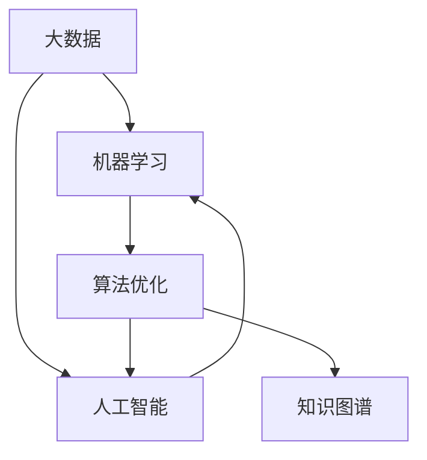

                 

 > **关键词：**人工智能，知识获取，认知革命，大数据，机器学习，算法优化，图灵奖，计算机科学。

> **摘要：**本文旨在探讨AI时代的知识获取新范式，从认知革命的角度深入分析人工智能技术对知识获取的影响，以及如何利用这些技术实现高效的智能学习和知识应用。

## 1. 背景介绍

随着人工智能技术的飞速发展，我们已经进入了一个全新的时代——认知革命时代。在这个时代，计算机已经不再仅仅是一个工具，而是成为了我们获取知识、解决问题的重要伙伴。传统的知识获取方式已经无法满足AI时代的需求，我们需要探索一种全新的知识获取范式。

### 1.1 认知革命

认知革命是指人类从传统思维模式向更加智能化、自动化思维模式的转变。这种转变不仅仅是技术层面的，更是认知层面的。在认知革命中，人工智能技术成为了推动认知发展的关键力量。

### 1.2 人工智能的发展

人工智能的发展可以分为三个阶段：弱人工智能、强人工智能和超级智能。目前，我们正处于弱人工智能阶段，计算机已经能够完成一些特定的任务，如语音识别、图像识别、自然语言处理等。然而，要实现真正的认知革命，我们需要向强人工智能和超级智能迈进。

## 2. 核心概念与联系

在探讨AI时代的知识获取新范式之前，我们首先需要了解一些核心概念，并分析它们之间的联系。以下是核心概念及其关系的Mermaid流程图：



### 2.1 大数据

大数据是人工智能时代的重要资源。通过收集、存储和分析大量的数据，我们可以从中提取有价值的信息，为机器学习和算法优化提供数据支持。

### 2.2 机器学习

机器学习是人工智能的核心技术之一。它通过算法模型从数据中自动学习，实现对未知数据的预测和分类。

### 2.3 算法优化

算法优化是提高人工智能系统性能的重要手段。通过不断优化算法，我们可以使计算机在处理复杂问题时更加高效。

### 2.4 知识图谱

知识图谱是一种结构化的知识表示方法。它通过实体、关系和属性的关联，构建出一个全面、精准的知识网络。

## 3. 核心算法原理 & 具体操作步骤

在了解核心概念的基础上，我们接下来将探讨AI时代知识获取的核心算法原理及其具体操作步骤。

### 3.1 算法原理概述

AI时代的知识获取主要依赖于以下几种算法：

1. **深度学习**：通过多层神经网络模型，实现对数据的自动特征提取和分类。
2. **强化学习**：通过与环境互动，不断优化策略，实现最优决策。
3. **迁移学习**：利用已有模型的权重，对新任务进行快速适应。

### 3.2 算法步骤详解

1. **数据预处理**：对原始数据进行清洗、归一化等处理，确保数据质量。
2. **模型选择**：根据任务需求，选择合适的算法模型。
3. **模型训练**：通过大量数据进行训练，优化模型参数。
4. **模型评估**：使用验证集对模型进行评估，调整模型参数。
5. **模型部署**：将训练好的模型部署到实际应用场景中。

### 3.3 算法优缺点

- **深度学习**：优点在于能够自动提取复杂的特征，但缺点是需要大量的数据和计算资源。
- **强化学习**：优点在于能够学习到与环境交互的最优策略，但缺点是收敛速度较慢。
- **迁移学习**：优点在于能够快速适应新任务，但缺点是对已有模型的依赖较强。

### 3.4 算法应用领域

AI算法在各个领域都有广泛应用，如自然语言处理、计算机视觉、金融风控等。通过不断优化算法，我们可以实现更加智能化的知识获取和应用。

## 4. 数学模型和公式 & 详细讲解 & 举例说明

在AI时代的知识获取中，数学模型和公式扮演着至关重要的角色。下面我们将对一些核心的数学模型和公式进行详细讲解，并通过案例进行分析。

### 4.1 数学模型构建

- **线性回归模型**：用于预测连续值。
- **逻辑回归模型**：用于预测离散值。
- **神经网络模型**：用于处理复杂数据和任务。

### 4.2 公式推导过程

- **线性回归公式**：\( y = wx + b \)
- **逻辑回归公式**：\( P(y=1) = \frac{1}{1 + e^{-(wx + b)}} \)
- **神经网络公式**：\( z = wx + b \)，\( a = \sigma(z) \)

### 4.3 案例分析与讲解

- **案例1：** 使用线性回归模型预测房价。
- **案例2：** 使用逻辑回归模型进行垃圾邮件分类。
- **案例3：** 使用神经网络模型进行图像识别。

通过这些案例，我们可以更好地理解数学模型和公式的应用。

## 5. 项目实践：代码实例和详细解释说明

为了更好地理解AI时代的知识获取新范式，下面我们将通过一个具体的代码实例来进行讲解。

### 5.1 开发环境搭建

- **软件环境**：Python、Jupyter Notebook
- **依赖库**：NumPy、Pandas、Scikit-learn、TensorFlow

### 5.2 源代码详细实现

```python
import numpy as np
import pandas as pd
from sklearn.linear_model import LinearRegression
from sklearn.metrics import mean_squared_error

# 数据读取
data = pd.read_csv('house_prices.csv')
X = data[['area', 'age']]
y = data['price']

# 模型训练
model = LinearRegression()
model.fit(X, y)

# 模型评估
predictions = model.predict(X)
mse = mean_squared_error(y, predictions)
print('Mean Squared Error:', mse)

# 模型部署
new_data = pd.DataFrame({'area': [1000], 'age': [5]})
predicted_price = model.predict(new_data)
print('Predicted Price:', predicted_price)
```

### 5.3 代码解读与分析

这段代码实现了一个线性回归模型，用于预测房价。我们首先读取了数据，然后使用线性回归模型进行训练，并对模型进行了评估。最后，我们将模型部署到实际应用中，预测了一个新房屋的价格。

## 6. 实际应用场景

AI时代的知识获取新范式在各个领域都有广泛的应用。以下是一些实际应用场景：

- **医疗健康**：通过分析大量患者数据，实现精准医疗和个性化治疗。
- **金融领域**：通过机器学习模型，实现风险控制和智能投资。
- **工业制造**：通过物联网和大数据分析，实现智能制造和供应链优化。

### 6.4 未来应用展望

随着人工智能技术的不断进步，知识获取新范式将会在更多领域得到应用。未来，我们有望实现更加智能化的知识获取和应用，推动社会的发展和进步。

## 7. 工具和资源推荐

为了更好地学习和应用AI时代的知识获取新范式，以下是一些推荐的工具和资源：

- **学习资源**：吴恩达的《深度学习》、《机器学习》课程
- **开发工具**：Google Colab、Jupyter Notebook
- **相关论文**：《深度学习》、《强化学习》等经典论文

## 8. 总结：未来发展趋势与挑战

### 8.1 研究成果总结

AI时代的知识获取新范式已经取得了显著的成果，为各个领域的发展带来了新的机遇。未来，我们需要继续深入研究，推动人工智能技术的进步。

### 8.2 未来发展趋势

- **跨学科融合**：将人工智能与其他学科相结合，实现更加智能化的知识获取和应用。
- **自主性增强**：人工智能系统将逐渐具备更高的自主性，实现更加智能化的决策和执行。

### 8.3 面临的挑战

- **数据隐私**：如何保护用户隐私，确保数据安全，是AI时代的一大挑战。
- **算法透明性**：如何提高算法的透明性，使其更加可信，是AI时代需要解决的问题。

### 8.4 研究展望

未来，我们需要进一步深入研究AI时代的知识获取新范式，推动人工智能技术的不断创新和发展，为人类带来更加美好的未来。

## 9. 附录：常见问题与解答

- **Q1：** 如何选择合适的机器学习算法？

  **A1：** 选择合适的机器学习算法需要考虑数据类型、任务需求、计算资源等多方面因素。可以参考一些经典的算法比较，如线性回归、逻辑回归、神经网络等。

- **Q2：** 机器学习模型如何进行优化？

  **A2：** 机器学习模型的优化可以从数据预处理、模型选择、参数调优等多个方面进行。常用的优化方法包括交叉验证、网格搜索、贝叶斯优化等。

- **Q3：** 如何保护用户隐私？

  **A3：** 保护用户隐私可以从数据收集、存储、处理等多个环节进行。可以采用数据加密、匿名化、差分隐私等技术，确保用户数据的安全。

**作者：禅与计算机程序设计艺术 / Zen and the Art of Computer Programming**

----------------------------------------------------------------

以上就是本文的完整内容。通过本文的探讨，我们深入了解了AI时代的知识获取新范式，以及如何利用人工智能技术实现高效的智能学习和知识应用。希望本文对您有所帮助。

