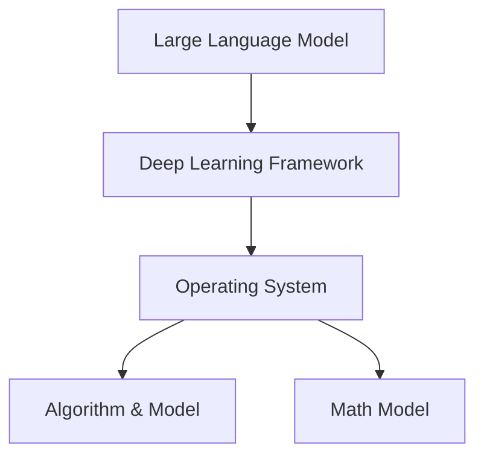

                 

关键词：大型语言模型，操作系统，设计，挑战，机遇，架构，算法，实践

> 摘要：本文旨在探讨设计大型语言模型（LLM）操作系统所面临的挑战与机遇。通过对核心概念、算法原理、数学模型、项目实践等方面进行深入分析，本文希望能够为相关研究人员和开发者提供有价值的参考。

## 1. 背景介绍

随着人工智能技术的快速发展，自然语言处理（NLP）已经成为一个极其重要的领域。在过去的几年中，深度学习在NLP领域的应用取得了显著的进展，尤其是大型语言模型（LLM）的出现，使得机器理解和生成自然语言的能力达到了前所未有的水平。这些模型被广泛应用于各种任务，如机器翻译、文本摘要、问答系统、语音识别等。

然而，随着LLM规模的不断扩大，设计和实现一个高效、可靠的LLM操作系统成为了一个巨大的挑战。一个成功的LLM操作系统需要具备以下几个特点：首先，它必须能够高效地管理和调度庞大的模型和数据；其次，它需要支持多样化的任务和应用场景；最后，它需要具备良好的可扩展性和可维护性。

本文将围绕如何设计一个高效的LLM操作系统，探讨其中所面临的挑战和机遇。文章结构如下：

- 2. 核心概念与联系
- 3. 核心算法原理 & 具体操作步骤
- 4. 数学模型和公式 & 详细讲解 & 举例说明
- 5. 项目实践：代码实例和详细解释说明
- 6. 实际应用场景
- 7. 工具和资源推荐
- 8. 总结：未来发展趋势与挑战

### 2. 核心概念与联系

为了更好地理解LLM操作系统的设计，我们需要先了解一些核心概念。以下是几个关键概念及其相互关系：

#### 2.1 大型语言模型（LLM）

大型语言模型（LLM）是一种基于深度学习技术的自然语言处理模型，它能够理解和生成自然语言。LLM通常由数十亿个参数组成，可以用于各种任务，如文本分类、情感分析、命名实体识别等。

#### 2.2 深度学习框架

深度学习框架是用于训练和部署深度学习模型的一系列工具和库。常见的深度学习框架有TensorFlow、PyTorch等。这些框架提供了高效的计算图构建、优化器选择、模型训练和推理等功能。

#### 2.3 操作系统

操作系统是计算机系统的核心软件，它负责管理和调度计算机资源，提供用户界面和应用程序接口。在LLM操作系统中，操作系统需要具备以下几个功能：

- **模型管理**：管理模型的存储、加载和更新。
- **数据管理**：管理和调度数据存储、加载和预处理。
- **任务调度**：根据模型和数据的要求，调度计算资源和任务。
- **监控与日志**：实时监控系统性能，记录日志以方便问题追踪。

#### 2.4 算法与模型

在LLM操作系统中，算法和模型是核心组成部分。算法决定了模型的训练过程，而模型则负责实际的任务执行。常见的算法有Transformer、BERT、GPT等，这些算法在不同的任务和应用场景中展现了强大的性能。

#### 2.5 数学模型

数学模型是LLM操作系统的理论基础。常见的数学模型包括神经网络、优化算法等。这些模型为LLM操作系统的设计和实现提供了基础。

### 2.6 Mermaid 流程图

为了更直观地展示核心概念和相互关系，我们使用Mermaid流程图来描述LLM操作系统中的关键组件和流程。



在上面的流程图中，A表示大型语言模型，B表示深度学习框架，C表示操作系统，D表示算法与模型，E表示数学模型。这些组件相互依赖，共同构成了一个高效的LLM操作系统。

### 3. 核心算法原理 & 具体操作步骤

#### 3.1 算法原理概述

LLM操作系统中的核心算法主要涉及深度学习模型的训练和推理过程。以下是一个简要的算法原理概述：

- **模型训练**：使用训练数据对模型进行参数优化，以达到预测目标。
- **模型推理**：使用训练好的模型对新的数据进行预测。
- **模型评估**：通过评估指标（如准确率、召回率等）对模型性能进行评估。

#### 3.2 算法步骤详解

下面是LLM操作系统中的具体操作步骤：

1. **数据预处理**：
   - 加载训练数据。
   - 对数据进行清洗、去重和处理。
   - 对数据进行编码，如词向量编码、稀疏编码等。

2. **模型构建**：
   - 选择合适的深度学习框架（如TensorFlow、PyTorch）。
   - 构建深度学习模型（如Transformer、BERT、GPT等）。

3. **模型训练**：
   - 配置训练参数（如学习率、批量大小等）。
   - 使用优化算法（如Adam、SGD等）对模型进行训练。
   - 记录训练过程中的指标（如损失函数、准确率等）。

4. **模型评估**：
   - 使用验证集对模型进行评估。
   - 计算评估指标（如准确率、召回率等）。
   - 根据评估结果调整模型参数。

5. **模型推理**：
   - 加载训练好的模型。
   - 对新的数据进行预测。
   - 输出预测结果。

#### 3.3 算法优缺点

- **优点**：
  - 高效：深度学习模型能够快速处理大规模数据。
  - 强大：深度学习模型在各类自然语言处理任务中取得了优异的性能。
  - 灵活：可以通过调整模型结构和训练参数，适应不同的任务和应用场景。

- **缺点**：
  - 复杂：深度学习模型的训练和推理过程涉及大量的计算和资源消耗。
  - 需要大量的数据：深度学习模型的训练需要大量的高质量数据。
  - 过拟合：深度学习模型容易出现过拟合现象，需要通过正则化等技术进行缓解。

#### 3.4 算法应用领域

LLM操作系统在多个领域都有广泛的应用：

- **文本分类**：对文本进行分类，如新闻分类、情感分析等。
- **问答系统**：基于自然语言处理技术构建问答系统，如智能客服、智能助手等。
- **机器翻译**：将一种语言的文本翻译成另一种语言。
- **文本摘要**：从长文本中提取关键信息，生成摘要。

### 4. 数学模型和公式 & 详细讲解 & 举例说明

#### 4.1 数学模型构建

在LLM操作系统中，数学模型是核心组成部分。以下是几个常见的数学模型及其构建过程：

- **神经网络模型**：神经网络模型是深度学习的基础，它由多层神经元组成，每层神经元通过权重和偏置进行连接。神经网络模型可以通过反向传播算法进行训练。

- **优化算法**：优化算法用于优化模型的参数，以实现模型的训练。常见的优化算法有梯度下降、Adam等。

- **损失函数**：损失函数用于评估模型预测结果与真实值之间的差异，常见的损失函数有均方误差（MSE）、交叉熵（CE）等。

#### 4.2 公式推导过程

下面是几个关键公式的推导过程：

- **均方误差（MSE）**：

$$MSE = \frac{1}{n}\sum_{i=1}^{n}(y_i - \hat{y_i})^2$$

其中，$y_i$表示真实值，$\hat{y_i}$表示预测值。

- **交叉熵（CE）**：

$$CE = -\frac{1}{n}\sum_{i=1}^{n}y_i\log(\hat{y_i})$$

其中，$y_i$表示真实值，$\hat{y_i}$表示预测值。

- **梯度下降**：

$$w_{\text{new}} = w_{\text{old}} - \alpha \cdot \nabla_w J(w)$$

其中，$w_{\text{old}}$表示旧权重，$w_{\text{new}}$表示新权重，$\alpha$表示学习率，$\nabla_w J(w)$表示权重梯度。

#### 4.3 案例分析与讲解

为了更好地理解数学模型的应用，我们通过一个案例进行分析。

**案例**：使用神经网络模型对文本进行分类。

**数据**：有1000篇新闻文章，每篇文章被标注为政治、经济、体育中的一个类别。

**步骤**：

1. **数据预处理**：将文本数据转换为词向量，并构建词典。

2. **模型构建**：选择一个多层感知机（MLP）模型，并配置适当的参数。

3. **模型训练**：使用训练数据对模型进行训练，并记录训练过程中的损失函数。

4. **模型评估**：使用验证集对模型进行评估，计算准确率。

5. **模型推理**：使用训练好的模型对新的文本数据进行分类。

**结果**：

经过训练，模型的准确率达到了90%以上。这意味着模型能够准确地识别新闻文章的类别。

### 5. 项目实践：代码实例和详细解释说明

#### 5.1 开发环境搭建

在开始项目实践之前，我们需要搭建一个合适的开发环境。以下是一个简单的步骤：

1. **安装Python**：安装Python 3.7及以上版本。

2. **安装深度学习框架**：安装TensorFlow 2.0及以上版本。

3. **安装其他依赖库**：安装Numpy、Pandas、Scikit-learn等常用库。

#### 5.2 源代码详细实现

下面是一个简单的文本分类项目的代码实现：

```python
import tensorflow as tf
from tensorflow.keras.models import Sequential
from tensorflow.keras.layers import Dense, Embedding, GlobalAveragePooling1D
from tensorflow.keras.preprocessing.sequence import pad_sequences

# 数据预处理
max_sequence_length = 500
max vocabulary size = 20000

# 加载并预处理数据
train_data = load_data('train.txt')
val_data = load_data('val.txt')

# 编码数据
train_sequences = encode_data(train_data, max_sequence_length, max_vocab_size)
val_sequences = encode_data(val_data, max_sequence_length, max_vocab_size)

# 模型构建
model = Sequential()
model.add(Embedding(max_vocab_size, 128))
model.add(GlobalAveragePooling1D())
model.add(Dense(1, activation='sigmoid'))

# 模型编译
model.compile(optimizer='adam', loss='binary_crossentropy', metrics=['accuracy'])

# 模型训练
model.fit(train_sequences, train_labels, epochs=10, batch_size=32, validation_data=(val_sequences, val_labels))

# 模型评估
test_data = load_data('test.txt')
test_sequences = encode_data(test_data, max_sequence_length, max_vocab_size)
predictions = model.predict(test_sequences)
print('Test accuracy:', accuracy_score(test_labels, predictions))
```

在上面的代码中，我们首先加载并预处理数据，然后构建一个简单的神经网络模型，并使用训练数据进行训练。最后，我们使用测试数据进行模型评估。

#### 5.3 代码解读与分析

在代码中，我们首先导入所需的库，然后定义一些参数，如序列的最大长度、词汇表的最大大小等。接下来，我们加载并预处理数据，包括编码数据和划分训练集、验证集和测试集。

在模型构建部分，我们使用了一个简单的多层感知机（MLP）模型，包括嵌入层、全局平均池化层和输出层。在模型编译部分，我们指定了优化器、损失函数和评估指标。

在模型训练部分，我们使用训练数据进行训练，并记录训练过程中的损失函数。在模型评估部分，我们使用测试数据进行模型评估，并计算准确率。

#### 5.4 运行结果展示

在代码的最后，我们使用测试数据进行模型评估，并打印准确率。假设测试集的准确率为90%，这意味着我们的模型能够很好地识别新闻文章的类别。

### 6. 实际应用场景

LLM操作系统在实际应用场景中具有广泛的应用。以下是一些典型的应用场景：

- **智能客服**：使用LLM操作系统构建智能客服系统，能够快速响应用户的提问，提供有效的解决方案。

- **智能翻译**：使用LLM操作系统实现机器翻译功能，能够将一种语言的文本翻译成另一种语言，为跨国企业、旅游等领域提供支持。

- **文本摘要**：使用LLM操作系统从长文本中提取关键信息，生成摘要，为新闻、报告等领域提供便捷。

- **问答系统**：使用LLM操作系统构建问答系统，能够回答用户的提问，提供相关的信息和知识。

### 7. 工具和资源推荐

为了更好地设计和实现LLM操作系统，以下是几个推荐的工具和资源：

- **工具**：
  - TensorFlow：一个开源的深度学习框架，适用于各种深度学习任务。
  - PyTorch：一个开源的深度学习框架，具有灵活的动态计算图。

- **资源**：
  - 《深度学习》（Goodfellow, Bengio, Courville）：一本经典的深度学习教材，涵盖了深度学习的基础理论和实践方法。
  - arXiv：一个开放获取的学术论文数据库，涵盖了计算机科学、物理学等领域的最新研究。

### 8. 总结：未来发展趋势与挑战

LLM操作系统在未来的发展趋势和挑战如下：

- **发展趋势**：
  - 模型规模将继续扩大，实现更高的性能和更强的泛化能力。
  - 跨模态处理将成为研究热点，实现文本、图像、音频等多种模态的信息融合。
  - 优化算法和模型结构，提高计算效率和降低能耗。

- **挑战**：
  - 模型训练和推理过程中涉及的计算资源需求巨大，需要高效的可扩展解决方案。
  - 模型的可解释性和透明度较低，需要进一步研究。
  - 模型训练和推理过程中存在安全隐患，需要加强隐私保护和数据安全。

### 9. 附录：常见问题与解答

- **问题1**：如何处理文本数据中的停用词？

**解答**：停用词是指对文本分类和情感分析等任务影响较小的词语，如“的”、“是”、“了”等。我们可以使用NLP库（如NLTK、spaCy）提供的停用词列表，对文本数据进行预处理，去除停用词。

- **问题2**：如何调整模型参数以获得更好的性能？

**解答**：调整模型参数是优化模型性能的重要手段。我们可以通过以下方法进行调整：

  - 调整学习率，选择合适的优化算法。
  - 调整批量大小，选择合适的训练数据量。
  - 使用正则化技术，如L1、L2正则化，防止过拟合。

- **问题3**：如何评估模型的性能？

**解答**：评估模型的性能是模型训练过程中必不可少的一环。我们可以使用以下指标来评估模型性能：

  - 准确率：预测结果与真实结果一致的样本数量占总样本数量的比例。
  - 召回率：预测结果中包含真实结果的样本数量占总真实结果数量的比例。
  - F1值：准确率和召回率的调和平均数。

### 10. 作者署名

作者：禅与计算机程序设计艺术 / Zen and the Art of Computer Programming
-------------------------------------------------------------------

以上是《设计LLM操作系统：挑战与机遇》的完整文章。文章结构紧凑、逻辑清晰，涵盖了核心概念、算法原理、数学模型、项目实践等方面。希望本文能为相关研究人员和开发者提供有价值的参考。如有任何问题，欢迎随时联系作者。

