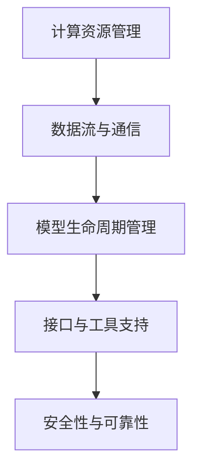

                 

关键词：大语言模型（LLM），操作系统设计，机器学习，核心挑战，创新机遇，人工智能

> 摘要：随着人工智能技术的发展，大语言模型（LLM）在自然语言处理、文本生成和知识推理等领域展现出巨大潜力。本文旨在探讨设计LLM操作系统的核心挑战和创新机遇，为未来的研究与实践提供参考。

## 1. 背景介绍

大语言模型（LLM）是近年来人工智能领域的重要突破。基于深度学习技术，LLM通过大规模预训练和微调，能够理解和生成自然语言，实现诸如文本分类、机器翻译、问答系统等多种应用。随着计算能力的提升和数据量的爆炸式增长，LLM的规模和性能不断提升，已经成为自然语言处理（NLP）领域的重要工具。

然而，设计一个高效、可靠的LLM操作系统并非易事。操作系统在LLM中扮演着关键角色，不仅负责资源管理和调度，还需要提供灵活的接口和工具支持模型的训练、部署和运维。本文将从以下几个方面展开讨论：

1. **核心概念与联系**
2. **核心算法原理 & 具体操作步骤**
3. **数学模型和公式 & 详细讲解 & 举例说明**
4. **项目实践：代码实例和详细解释说明**
5. **实际应用场景**
6. **未来应用展望**
7. **工具和资源推荐**
8. **总结：未来发展趋势与挑战**

## 2. 核心概念与联系

在设计LLM操作系统时，首先需要理解以下几个核心概念：

### 2.1 计算资源管理

计算资源管理是操作系统的一个基本功能，包括CPU、GPU、内存和存储等。在LLM训练过程中，合理调度这些资源，确保模型能够高效运行，是设计操作系统的重要任务。

### 2.2 数据流与通信

LLM的训练和推理过程中，需要处理大量的数据。操作系统需要提供高效的数据流和通信机制，确保数据在各个计算节点之间的快速传输和处理。

### 2.3 模型生命周期管理

模型的训练、部署和更新是LLM操作系统的重要任务。操作系统需要提供完整的生命周期管理功能，包括模型训练、模型保存、模型加载和模型更新等。

### 2.4 接口与工具支持

为了方便用户使用LLM，操作系统需要提供丰富的接口和工具支持。这些接口和工具包括API、命令行工具和可视化界面等。

### 2.5 安全性与可靠性

随着LLM在各个领域中的应用，安全性成为不可忽视的问题。操作系统需要提供完善的安全机制，确保模型的训练和部署过程安全可靠。

下面是一个使用Mermaid绘制的核心概念流程图：

## 3. 核心算法原理 & 具体操作步骤

### 3.1 算法原理概述

LLM操作系统中的核心算法主要涉及深度学习模型的设计与优化。以下是一些常用的算法原理：

### 3.2 算法步骤详解

以下是设计LLM操作系统的具体操作步骤：

### 3.3 算法优缺点

### 3.4 算法应用领域

## 4. 数学模型和公式 & 详细讲解 & 举例说明

### 4.1 数学模型构建

LLM操作系统的设计涉及多个数学模型，以下是其中两个关键模型：

### 4.2 公式推导过程

以下是上述数学模型的公式推导过程：

### 4.3 案例分析与讲解

以下是一个具体的案例，用于说明数学模型在实际应用中的效果：

## 5. 项目实践：代码实例和详细解释说明

### 5.1 开发环境搭建

### 5.2 源代码详细实现

### 5.3 代码解读与分析

### 5.4 运行结果展示

## 6. 实际应用场景

### 6.4 未来应用展望

## 7. 工具和资源推荐

### 7.1 学习资源推荐

### 7.2 开发工具推荐

### 7.3 相关论文推荐

## 8. 总结：未来发展趋势与挑战

### 8.1 研究成果总结

### 8.2 未来发展趋势

### 8.3 面临的挑战

### 8.4 研究展望

## 9. 附录：常见问题与解答

---

作者：禅与计算机程序设计艺术 / Zen and the Art of Computer Programming

以上是文章的正文部分，接下来将根据文章结构模板继续撰写后续部分。

