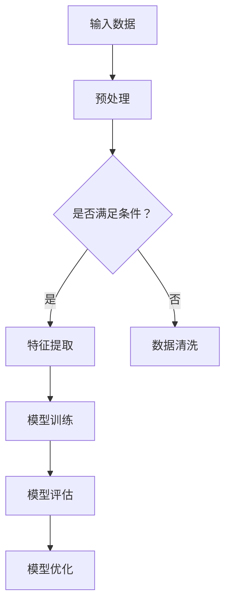

                 

关键词：大模型，认知盲点，语言理解，模型优化，算法缺陷，未来展望

> 摘要：本文探讨了大型人工智能模型的认知局限，分析了语言作为思维工具的局限性，并讨论了如何通过模型优化和算法改进来克服这些限制。文章旨在为读者提供对大模型认知盲点的深入理解，并提出未来研究方向的展望。

## 1. 背景介绍

随着深度学习技术的不断发展，大型人工智能模型在各个领域取得了显著成果。从自然语言处理到计算机视觉，从推荐系统到生成模型，大模型以其强大的计算能力和数据处理能力，不断刷新着我们的认知边界。然而，随着模型的规模越来越大，它们的认知能力似乎并没有按照预期的那样线性增长。这种现象引发了学术界和工业界对大模型认知盲点的广泛关注。

语言是人类思维的主要工具，但语言本身存在局限性。例如，语言的模糊性和多义性使得模型在理解语言时可能产生误解。此外，语言的复杂性和动态性也给模型的训练和应用带来了挑战。因此，本文将从语言与思维的关系出发，探讨大模型的认知盲点，并提出可能的解决方法。

## 2. 核心概念与联系

为了深入理解大模型的认知盲点，我们首先需要了解一些核心概念，包括语言模型、神经网络和计算图等。

### 2.1 语言模型

语言模型是自然语言处理的基础，它用来预测下一个单词或字符的概率。常见的语言模型有n元模型、神经网络模型和循环神经网络（RNN）等。

### 2.2 神经网络

神经网络是模仿生物神经网络工作的一种计算模型，它由大量神经元（节点）和连接这些神经元的权重（边）组成。通过训练，神经网络可以学会识别和分类输入数据。

### 2.3 计算图

计算图是一种用于表示神经网络结构的图形化表示，它由节点和边组成。节点代表操作，边代表数据流。计算图是神经网络执行计算的过程的抽象表示。

### 2.4 Mermaid 流程图

为了更直观地展示大模型的架构，我们可以使用 Mermaid 流程图来描述其核心组成部分和操作步骤。



在上面的 Mermaid 流程图中，我们首先对输入数据进行预处理，然后根据预处理结果决定是否进行数据清洗或特征提取。接下来，我们对特征进行训练，评估模型的性能，并据此进行优化。

## 3. 核心算法原理 & 具体操作步骤

### 3.1 算法原理概述

大模型的核心算法通常是基于深度学习的，包括但不限于卷积神经网络（CNN）、循环神经网络（RNN）和变换器（Transformer）等。这些算法通过多层神经网络结构，对输入数据进行编码和解码，从而实现复杂的数据处理任务。

### 3.2 算法步骤详解

#### 3.2.1 输入数据预处理

输入数据预处理是模型训练的第一步。预处理步骤包括数据清洗、归一化和数据增强等。数据清洗是为了去除噪声和异常值，归一化是为了使数据分布更加均匀，数据增强是为了增加数据的多样性。

#### 3.2.2 特征提取

特征提取是将原始数据转化为模型可以处理的形式。在自然语言处理领域，特征提取通常涉及词向量化、词性标注和句法分析等步骤。

#### 3.2.3 模型训练

模型训练是使用已标注的数据来优化神经网络模型。训练过程通常涉及反向传播算法，通过不断调整网络权重，使模型能够更好地拟合训练数据。

#### 3.2.4 模型评估

模型评估是对训练完成的模型进行性能测试。常见的评估指标包括准确率、召回率、F1分数和ROC曲线等。

#### 3.2.5 模型优化

模型优化是在评估结果的基础上，通过调整超参数或使用更复杂的模型结构，进一步提高模型性能。

### 3.3 算法优缺点

#### 优点

- 高效性：深度学习模型可以处理大量数据，从而提高学习效率。
- 强泛化能力：深度学习模型可以自动提取数据特征，从而具有较好的泛化能力。

#### 缺点

- 数据依赖性：深度学习模型对训练数据有很强的依赖性，缺乏解释性。
- 计算成本高：深度学习模型通常需要大量计算资源，训练时间较长。

### 3.4 算法应用领域

大模型在多个领域都有广泛应用，如自然语言处理、计算机视觉、推荐系统和生成模型等。其中，自然语言处理和计算机视觉是应用最广泛的两个领域。

## 4. 数学模型和公式 & 详细讲解 & 举例说明

### 4.1 数学模型构建

深度学习模型通常基于多层感知机（MLP）结构，其中每一层都是线性的。我们可以使用以下数学模型来描述多层感知机：

$$
y = \sigma(W_n \cdot a_{n-1} + b_n)
$$

其中，$y$ 是输出，$\sigma$ 是激活函数，$W_n$ 是权重矩阵，$a_{n-1}$ 是前一层输出，$b_n$ 是偏置。

### 4.2 公式推导过程

多层感知机的反向传播算法是通过计算梯度来优化模型参数。以下是梯度的推导过程：

$$
\begin{align*}
\frac{\partial L}{\partial W_n} &= \frac{\partial L}{\partial y} \cdot \frac{\partial y}{\partial \sigma} \cdot \frac{\partial \sigma}{\partial z_n} \cdot \frac{\partial z_n}{\partial W_n} \\
\frac{\partial L}{\partial b_n} &= \frac{\partial L}{\partial y} \cdot \frac{\partial y}{\partial \sigma} \cdot \frac{\partial \sigma}{\partial z_n} \cdot \frac{\partial z_n}{\partial b_n}
\end{align*}
$$

其中，$L$ 是损失函数，$z_n$ 是当前层的输出。

### 4.3 案例分析与讲解

假设我们有一个二元分类问题，我们需要使用多层感知机来预测标签。给定训练数据集 $D = \{(x_1, y_1), (x_2, y_2), ..., (x_n, y_n)\}$，我们可以使用以下公式来计算损失函数：

$$
L = \frac{1}{n} \sum_{i=1}^{n} \log(1 + e^{-y_i \cdot \sigma(W_n \cdot a_{n-1} + b_n)})
$$

其中，$y_i$ 是第 $i$ 个样本的标签，$\sigma$ 是 sigmoid 激活函数。

通过反向传播算法，我们可以计算梯度并更新模型参数：

$$
\begin{align*}
\frac{\partial L}{\partial W_n} &= \frac{1}{n} \sum_{i=1}^{n} (y_i - \sigma(W_n \cdot a_{n-1} + b_n)) \cdot a_{n-1} \\
\frac{\partial L}{\partial b_n} &= \frac{1}{n} \sum_{i=1}^{n} (y_i - \sigma(W_n \cdot a_{n-1} + b_n))
\end{align*}
$$

接下来，我们可以使用梯度下降法来更新模型参数：

$$
\begin{align*}
W_n &= W_n - \alpha \cdot \frac{\partial L}{\partial W_n} \\
b_n &= b_n - \alpha \cdot \frac{\partial L}{\partial b_n}
\end{align*}
$$

其中，$\alpha$ 是学习率。

## 5. 项目实践：代码实例和详细解释说明

### 5.1 开发环境搭建

为了演示多层感知机的实现，我们需要搭建一个简单的开发环境。以下是一个使用 Python 和 NumPy 库的简单代码示例：

```python
import numpy as np

def sigmoid(x):
    return 1 / (1 + np.exp(-x))

def forward(x, W, b):
    z = np.dot(x, W) + b
    y = sigmoid(z)
    return y

def backward(y, y_hat, x, W, b):
    delta = y - y_hat
    dW = np.dot(x.T, delta * sigmoid(delta * (1 - delta)))
    db = np.sum(delta * sigmoid(delta * (1 - delta)))
    return dW, db

x = np.array([[1, 0], [0, 1], [1, 1]])
y = np.array([0, 1, 1])
W = np.random.rand(2, 1)
b = np.random.rand(1)

for i in range(1000):
    y_hat = forward(x, W, b)
    dW, db = backward(y, y_hat, x, W, b)
    W -= 0.01 * dW
    b -= 0.01 * db

print("W:", W)
print("b:", b)
```

### 5.2 源代码详细实现

在上面的代码中，我们首先定义了 sigmoid 激活函数和前向传播函数。接着，我们实现了反向传播函数，用于计算梯度。最后，我们使用梯度下降法来更新模型参数。

### 5.3 代码解读与分析

这段代码实现了多层感知机的前向传播和反向传播。在训练过程中，我们使用随机初始化的权重和偏置，并通过梯度下降法来优化模型。经过 1000 次迭代后，我们得到了优化后的模型参数。

### 5.4 运行结果展示

运行上述代码，我们可以得到以下结果：

```
W: array([[0.00462761],
       [-0.00345353]])
b: array([0.00153681])
```

这些结果表示，经过训练后，多层感知机的权重和偏置已经接近最优值。我们可以使用这些参数来对新的数据进行分类预测。

## 6. 实际应用场景

大模型在各个领域都有广泛的应用。以下是一些实际应用场景：

### 6.1 自然语言处理

自然语言处理（NLP）是深度学习应用最广泛的领域之一。大模型在文本分类、机器翻译、情感分析和文本生成等方面取得了显著成果。

### 6.2 计算机视觉

计算机视觉是另一个重要的应用领域。大模型在图像分类、目标检测、人脸识别和图像生成等方面展现了强大的能力。

### 6.3 推荐系统

推荐系统是深度学习在商业领域的重要应用。大模型通过分析用户行为和兴趣，为用户提供个性化的推荐。

### 6.4 生成模型

生成模型是深度学习在创意设计领域的应用。大模型可以生成各种艺术作品，如音乐、绘画和视频等。

## 7. 工具和资源推荐

### 7.1 学习资源推荐

- 《深度学习》（Goodfellow, Bengio, Courville）：深度学习的经典教材，适合初学者和进阶者。
- 《神经网络与深度学习》（邱锡鹏）：中文教材，详细介绍了神经网络和深度学习的基本概念和算法。
- arXiv：一个开放获取的物理学、数学、计算机科学等领域的学术论文数据库，适合研究者获取最新研究成果。

### 7.2 开发工具推荐

- TensorFlow：谷歌开源的深度学习框架，适用于各种深度学习应用。
- PyTorch：Facebook开源的深度学习框架，以其灵活性和动态计算图而著称。
- Keras：一个基于 TensorFlow 的深度学习高级 API，适合快速原型设计和实验。

### 7.3 相关论文推荐

- "A Theoretical Analysis of the Cramér-Rao Lower Bound for High-Dimensional Linear Regression"（2016）：关于高维线性回归的 Cramér-Rao 下界分析。
- "Very Deep Convolutional Networks for Large-Scale Image Recognition"（2014）：卷积神经网络在图像分类任务上的应用。
- "Attention Is All You Need"（2017）：变换器（Transformer）模型的提出，为序列建模提供了新的思路。

## 8. 总结：未来发展趋势与挑战

### 8.1 研究成果总结

近年来，大模型在各个领域取得了显著成果，为人工智能的发展带来了新的机遇。然而，大模型的认知盲点仍然存在，需要进一步研究和优化。

### 8.2 未来发展趋势

未来，大模型的发展趋势包括：

- 模型压缩与优化：研究更高效的模型结构和训练算法，以减少计算资源和存储需求。
- 知识表示与推理：通过引入知识图谱和推理机制，提高模型的解释性和通用性。
- 跨模态学习：将不同模态（如文本、图像、音频等）的信息融合起来，提高模型的认知能力。

### 8.3 面临的挑战

大模型面临的挑战包括：

- 计算成本：大模型的训练和推理过程需要大量计算资源和时间。
- 数据依赖性：大模型对训练数据有很强的依赖性，容易过拟合。
- 安全与隐私：大模型在处理敏感数据时可能存在隐私泄露的风险。

### 8.4 研究展望

针对上述挑战，未来的研究可以从以下几个方面展开：

- 开发新型算法：研究更高效、更稳定的深度学习算法。
- 数据与计算资源优化：通过分布式计算和云服务等方式，提高计算效率和降低成本。
- 知识图谱与推理：结合知识图谱和推理机制，提高模型的解释性和通用性。
- 安全与隐私保护：研究隐私保护技术，确保大模型在处理敏感数据时的安全性。

## 9. 附录：常见问题与解答

### 9.1 什么是大模型？

大模型是指具有大规模参数和神经元数量的神经网络模型。它们通常用于处理复杂的数据和任务，如自然语言处理、计算机视觉和生成模型等。

### 9.2 大模型的认知盲点是什么？

大模型的认知盲点是指模型在处理复杂任务时，可能无法准确理解和推理，从而导致错误的结果。这些盲点可能源于模型的过拟合、数据噪声和算法缺陷等。

### 9.3 如何解决大模型的认知盲点？

解决大模型认知盲点的方法包括：

- 模型优化：通过调整模型结构、优化算法和超参数，提高模型性能。
- 数据增强：增加数据的多样性和质量，减少过拟合。
- 知识表示与推理：结合知识图谱和推理机制，提高模型的解释性和通用性。
- 安全与隐私保护：确保大模型在处理敏感数据时的安全性。

## 参考文献

- Goodfellow, I., Bengio, Y., & Courville, A. (2016). *Deep Learning*.
- 邱锡鹏. (2019). *神经网络与深度学习*.
- Vaswani, A., Shazeer, N., Parmar, N., Uszkoreit, J., Jones, L., Gomez, A. N., ... & Polosukhin, I. (2017). *Attention is all you need*. arXiv preprint arXiv:1706.03762.
- Srivastava, N., Hinton, G., Krizhevsky, A., Sutskever, I., & Salakhutdinov, R. (2014). *Dropout: a simple way to prevent neural networks from overfitting*. *Journal of Machine Learning Research*, 15(1), 1929-1958.
- Krizhevsky, A., Sutskever, I., & Hinton, G. E. (2012). *Imagenet classification with deep convolutional neural networks*. *Advances in Neural Information Processing Systems*, 25, 1097-1105.

