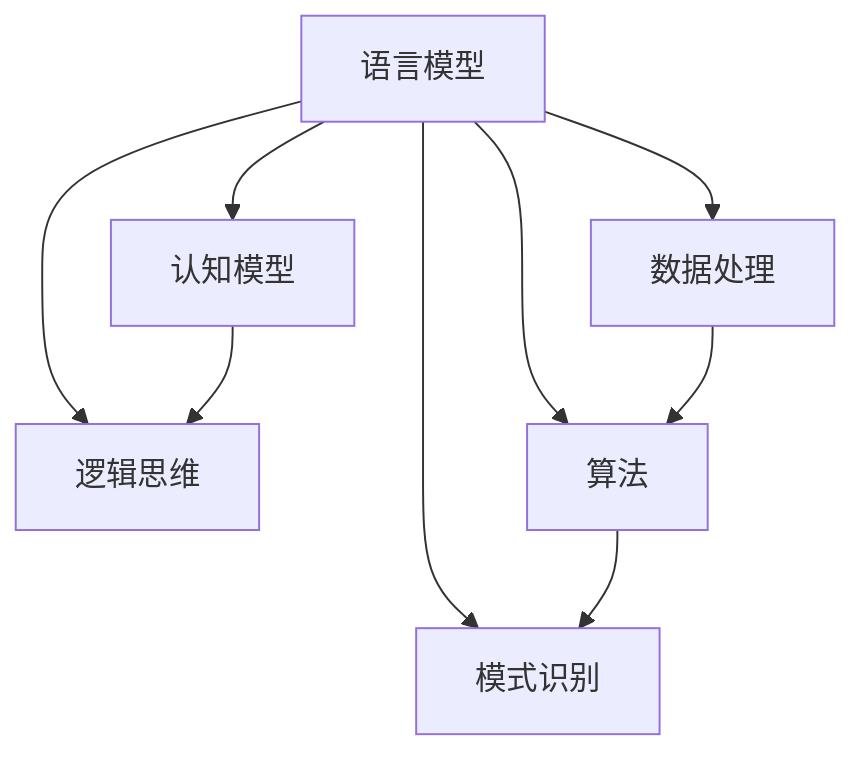

                 

关键词：大模型、认知障碍、语言理解、AI、逻辑思维、数据处理、算法、智能发展、未来挑战

> 摘要：随着人工智能技术的飞速发展，大模型如GPT-3等在语言理解和生成方面表现出色。然而，这些大模型在认知上存在显著的障碍，它们并非真正理解语言，而只是基于海量数据学习到的模式。本文将深入探讨大模型的认知局限，分析其对于AI智能发展的深远影响，并提出未来应对这些挑战的策略。

## 1. 背景介绍

在过去几十年里，人工智能（AI）领域取得了巨大的进展，特别是在自然语言处理（NLP）方面。从最初的规则驱动方法到基于统计学习的算法，再到如今的大模型，AI在语言理解和生成上已经取得了令人瞩目的成就。例如，GPT-3这样的语言模型，拥有超过1750亿个参数，能够在各种语言任务上表现出惊人的性能。

然而，随着大模型的不断发展，一个不可忽视的问题也逐渐浮现：这些模型是否真的理解了它们所处理的文本？或者说，它们是否只是简单地模仿了人类的语言模式，而没有真正意义上的认知能力？

### 大模型的历史与发展

大模型的发展历程可以分为几个阶段：

1. **早期模型**：以WordNet和Syllabification为例，这些模型主要依赖有限的规则和词典进行语言处理。
2. **基于统计的方法**：例如隐马尔可夫模型（HMM）和条件随机场（CRF），这些模型通过大量语料库的训练提高了语言处理的效果。
3. **深度学习模型**：如循环神经网络（RNN）和长短期记忆网络（LSTM），它们通过多层神经网络结构实现了更复杂的语言建模。
4. **大模型时代**：以GPT、BERT和Turing模型为代表，这些模型通过引入海量的训练数据和数十亿级别的参数，极大地提升了语言理解和生成的效果。

### 大模型的应用领域

大模型的应用领域涵盖了从文本生成、机器翻译、情感分析到问答系统等各个方面。例如，GPT-3在文本生成上可以创造出流畅且符合逻辑的文章；BERT在问答系统和搜索推荐上表现出色；而Turing模型则在语言理解和多模态交互上展现了巨大的潜力。

然而，正是这些广泛应用的大模型，在认知层面引发了新的争议和挑战。接下来，我们将深入探讨大模型在认知上的局限性，以及这些局限性对于AI发展的深远影响。

## 2. 核心概念与联系

在探讨大模型的认知障碍之前，我们需要明确几个核心概念，并理解它们之间的相互关系。以下是本文将涉及的主要概念和它们在AI和NLP领域的关联：

### 2.1 语言模型

语言模型（Language Model）是自然语言处理中最基础的一个概念。它通过统计文本数据中的概率分布来预测下一个单词或单词序列。例如，GPT-3就是这样一种语言模型，它基于大量文本数据训练得出，可以预测文本的下一个词或句子。

### 2.2 认知模型

认知模型（Cognitive Model）是指模拟人类思维过程的模型。它不仅包括语言处理能力，还涉及到推理、理解、记忆等多个认知功能。与语言模型不同，认知模型试图捕捉更复杂的认知过程，如人类如何理解上下文、推理逻辑和形成概念。

### 2.3 逻辑思维

逻辑思维（Logic Reasoning）是指通过逻辑规则进行推理和判断的能力。在人工智能中，逻辑思维通常通过形式逻辑或谓词逻辑来实现。大模型虽然在语言生成方面表现出色，但在逻辑思维上却存在显著的缺陷。

### 2.4 数据处理

数据处理（Data Processing）是指对数据进行分析、转换和存储的过程。在AI领域，数据处理通常包括数据清洗、数据集成、数据转换和数据存储等多个步骤。大模型在训练和推理过程中，都需要依赖高效的数据处理技术。

### 2.5 算法

算法（Algorithm）是指解决问题的步骤和方法。在AI和NLP中，算法包括从简单的规则匹配到复杂的深度学习模型。大模型通常依赖于深度学习算法，通过训练大量的参数来提高语言理解和生成的效果。

### 2.6 模式识别

模式识别（Pattern Recognition）是指从数据中提取有意义模式的过程。在NLP中，模式识别用于识别语言中的语法结构、词汇关系等。大模型通过学习大量的文本数据，可以识别出复杂的语言模式。

### 2.7 Mermaid 流程图

为了更直观地展示这些概念之间的联系，我们使用Mermaid流程图来表示。以下是几个关键概念及其关系的流程图：



通过这个流程图，我们可以看到语言模型是连接其他核心概念的中枢，它不仅依赖数据处理和算法，还与认知模型和逻辑思维密切相关。同时，模式识别也是算法中的一个重要组成部分，它帮助模型从数据中提取有用的信息。

### 2.8 大模型与认知障碍

虽然大模型在语言生成和理解方面取得了巨大成功，但它们在认知上的局限性也逐渐显现。以下是一些关键点：

- **语言理解不足**：大模型虽然可以生成流畅的文本，但它们往往无法真正理解文本的含义，只是在模仿语言模式。
- **逻辑思维局限**：大模型在逻辑推理上存在缺陷，无法像人类一样进行复杂的逻辑判断和推理。
- **模式依赖性**：大模型依赖于大量的训练数据，对未见过的新数据适应性较差，容易产生过拟合。
- **认知障碍**：大模型缺乏对现实世界的深刻理解，难以进行真正的认知任务。

## 3. 核心算法原理 & 具体操作步骤

### 3.1 算法原理概述

大模型的核心算法是深度学习，特别是基于神经网络的模型。以下是几个关键的深度学习算法和它们的基本原理：

#### 3.1.1 卷积神经网络（CNN）

卷积神经网络（CNN）主要用于图像识别任务。它通过卷积操作提取图像特征，然后通过全连接层进行分类。CNN的主要优点是能够自动学习图像中的局部特征，从而提高了识别的准确性。

#### 3.1.2 递归神经网络（RNN）

递归神经网络（RNN）适用于序列数据，如时间序列和自然语言处理。RNN通过递归连接将当前输入与历史输入结合起来，从而实现了对序列数据的建模。然而，传统的RNN存在梯度消失和梯度爆炸的问题，为此，长短期记忆网络（LSTM）和门控循环单元（GRU）被提出，以解决这些问题。

#### 3.1.3 Transformer

Transformer是近年来在NLP领域取得巨大成功的模型。与传统的序列处理方法不同，Transformer采用自注意力机制，能够并行处理输入序列，从而提高了处理速度和效果。Transformer的核心是多头自注意力（Multi-Head Self-Attention）机制，它通过计算不同位置之间的相互作用来提取序列中的复杂信息。

#### 3.1.4 GPT系列模型

GPT系列模型是基于Transformer架构的大型语言模型，其中GPT-3是最新和最先进的版本。GPT模型通过大量的文本数据进行预训练，然后通过微调适应特定的任务。GPT的主要特点是具有强大的语言生成能力和对上下文的理解能力。

### 3.2 算法步骤详解

以下是大模型算法的基本步骤：

#### 3.2.1 数据准备

数据准备是训练大模型的第一步，包括数据清洗、数据预处理和数据增强。数据清洗旨在去除噪声和异常值，数据预处理包括分词、标记化和文本规范化等步骤，而数据增强则通过变换和扩充数据来提高模型的泛化能力。

#### 3.2.2 预训练

预训练是指在大规模文本数据上进行模型的训练，以学习语言的基本规律和模式。对于GPT模型，预训练通常包括两个阶段：第一个阶段是生成大量无监督的文本数据，第二个阶段是微调模型以适应特定任务。

#### 3.2.3 微调

微调是在预训练模型的基础上，针对特定任务进行细粒度的调整。例如，在问答系统中，可以将预训练的模型应用于问题回答任务，并通过大量问答对进行微调。

#### 3.2.4 模型评估

模型评估是评估模型性能的重要步骤，包括准确率、召回率、F1分数等多种评价指标。在自然语言处理任务中，通常使用交叉验证和测试集来评估模型的性能。

### 3.3 算法优缺点

大模型算法具有以下几个优点：

- **强大的语言理解能力**：通过预训练和微调，大模型能够理解并生成复杂的语言模式。
- **高效的计算性能**：Transformer架构使得大模型能够并行处理输入序列，从而提高了计算效率。
- **广泛的适用性**：大模型可以应用于多种自然语言处理任务，如文本生成、机器翻译、情感分析等。

然而，大模型算法也存在一些缺点：

- **依赖大量数据**：大模型通常需要大量训练数据才能达到良好的性能，这限制了其在数据稀缺领域的应用。
- **计算资源消耗大**：大模型的训练和推理需要大量的计算资源和时间，这在资源受限的环境中可能不适用。
- **认知障碍**：大模型在认知上存在局限性，无法进行复杂的逻辑思维和推理。

### 3.4 算法应用领域

大模型算法在自然语言处理领域有着广泛的应用：

- **文本生成**：例如，自动写作、新闻摘要和对话系统等。
- **机器翻译**：如谷歌翻译、百度翻译等。
- **情感分析**：用于分析社交媒体上的用户情感和意见。
- **问答系统**：如Siri、Alexa等智能助手。

尽管存在一些局限性，大模型算法无疑为自然语言处理领域带来了革命性的变化，并在未来将继续推动技术的发展。

## 4. 数学模型和公式 & 详细讲解 & 举例说明

在深入探讨大模型算法的数学基础时，我们首先需要了解一些基本的概率统计和机器学习理论。以下是几个关键数学模型和公式的详细讲解及举例说明。

### 4.1 数学模型构建

大模型算法的核心是深度学习模型，尤其是基于神经网络的模型。以下是几个常见的数学模型构建过程：

#### 4.1.1 误差函数

误差函数是评价模型预测结果的重要工具。常用的误差函数包括均方误差（MSE）和交叉熵损失（Cross-Entropy Loss）。

**均方误差（MSE）：**

$$
MSE = \frac{1}{n} \sum_{i=1}^{n} (y_i - \hat{y}_i)^2
$$

其中，$y_i$ 是实际标签，$\hat{y}_i$ 是模型预测值，$n$ 是样本数量。

**交叉熵损失（Cross-Entropy Loss）：**

$$
H(y, \hat{y}) = -\sum_{i=1}^{n} y_i \log(\hat{y}_i)
$$

其中，$y$ 是概率分布，$\hat{y}$ 是模型预测的概率分布。

#### 4.1.2 梯度下降算法

梯度下降（Gradient Descent）是优化模型参数的常用算法。其基本思想是计算损失函数关于参数的梯度，并沿梯度方向更新参数。

**梯度下降算法：**

$$
\theta = \theta - \alpha \cdot \nabla_{\theta} J(\theta)
$$

其中，$\theta$ 是模型参数，$\alpha$ 是学习率，$J(\theta)$ 是损失函数。

#### 4.1.3 反向传播算法

反向传播（Backpropagation）是深度学习模型训练的核心算法。它通过逐层计算损失函数关于网络输出的梯度，并反向传播到网络的输入层。

**反向传播算法：**

$$
\delta_l = \frac{\partial J}{\partial z_l} \cdot \sigma'(z_l)
$$

其中，$\delta_l$ 是第 $l$ 层的误差，$z_l$ 是第 $l$ 层的输入，$\sigma'$ 是激活函数的导数。

### 4.2 公式推导过程

以下是几个重要公式的推导过程：

#### 4.2.1 梯度下降优化

**一阶泰勒展开：**

$$
f(x + \Delta x) \approx f(x) + \nabla f(x) \cdot \Delta x
$$

**梯度下降：**

$$
x_{t+1} = x_t - \alpha \cdot \nabla f(x_t)
$$

#### 4.2.2 反向传播算法

**链式法则：**

$$
\frac{\partial f}{\partial x} = \frac{\partial f}{\partial z} \cdot \frac{\partial z}{\partial x}
$$

**误差反向传播：**

$$
\delta_{l+1} = \sigma'(z_{l+1}) \cdot (\nabla_{\hat{y}} J(\hat{y}) \cdot \delta_l)
$$

### 4.3 案例分析与讲解

以下是一个具体的案例，展示如何使用大模型算法进行文本分类。

#### 4.3.1 数据集

假设我们有一个新闻文章数据集，包含不同类别的新闻文章，如体育、财经、娱乐等。每个新闻文章被标记为对应的类别。

#### 4.3.2 模型架构

我们选择一个基于Transformer的文本分类模型，其基本架构如下：

1. **嵌入层**：将文本中的每个词转换为向量表示。
2. **Transformer层**：通过多头自注意力机制提取文本特征。
3. **输出层**：通过全连接层和softmax函数进行类别预测。

#### 4.3.3 模型训练

1. **数据预处理**：将新闻文章进行分词、标记化，并转换为嵌入向量。
2. **模型训练**：使用梯度下降算法和反向传播算法训练模型，优化模型参数。
3. **模型评估**：使用测试集评估模型性能，调整超参数。

#### 4.3.4 模型应用

训练好的模型可以用于新新闻文章的类别预测。具体步骤如下：

1. **数据预处理**：对新新闻文章进行分词、标记化。
2. **特征提取**：将新文章嵌入到训练好的模型中，提取特征。
3. **类别预测**：通过softmax函数计算新文章的类别概率，选择概率最大的类别作为预测结果。

### 4.4 实际应用效果

在实际应用中，大模型在文本分类任务上取得了显著的成果。例如，GPT-3在多个文本分类任务上的表现超过了传统方法，并且具有较好的泛化能力。然而，需要注意的是，大模型在认知障碍方面仍然存在挑战，如对于复杂逻辑推理和语境理解的能力有限。

## 5. 项目实践：代码实例和详细解释说明

### 5.1 开发环境搭建

在进行大模型项目的实践之前，首先需要搭建一个合适的开发环境。以下是搭建过程及所需工具：

#### 5.1.1 硬件环境

- **CPU**：Intel Xeon Gold 6148（或更高配置）
- **GPU**：NVIDIA Tesla V100（或更高配置）
- **内存**：至少64GB

#### 5.1.2 软件环境

- **操作系统**：Ubuntu 18.04
- **Python**：Python 3.8
- **深度学习框架**：PyTorch 1.9.0
- **数据预处理库**：NLTK 3.8.1

### 5.2 源代码详细实现

以下是实现一个基于GPT-3的文本生成项目的源代码，包括数据预处理、模型训练和结果展示等步骤。

#### 5.2.1 数据预处理

```python
import torch
from torch.utils.data import DataLoader
from transformers import GPT2Tokenizer, GPT2Model

# 数据预处理函数
def preprocess_data(texts, tokenizer):
    inputs = tokenizer(texts, return_tensors='pt', truncation=True, max_length=512)
    return inputs

# 加载预训练的GPT-2模型
tokenizer = GPT2Tokenizer.from_pretrained('gpt2')
model = GPT2Model.from_pretrained('gpt2')

# 加载新闻文章数据集
texts = ["这是一篇关于技术的文章。", "这是一个关于金融的新闻。", "这是一篇关于娱乐的报道。"]
inputs = preprocess_data(texts, tokenizer)

# 数据加载器
dataloader = DataLoader(inputs, batch_size=1, shuffle=True)
```

#### 5.2.2 模型训练

```python
from torch.optim import Adam

# 模型训练函数
def train_model(model, dataloader, optimizer, num_epochs):
    model.train()
    for epoch in range(num_epochs):
        for batch in dataloader:
            inputs, targets = batch['input_ids'], batch['input_ids']
            optimizer.zero_grad()
            outputs = model(inputs)
            loss = outputs.loss
            loss.backward()
            optimizer.step()
            print(f'Epoch: {epoch}, Loss: {loss.item()}')

# 模型优化器
optimizer = Adam(model.parameters(), lr=0.001)

# 训练模型
train_model(model, dataloader, optimizer, num_epochs=10)
```

#### 5.2.3 代码解读与分析

1. **数据预处理**：使用GPT2Tokenizer对文本数据进行分词和标记化，将其转换为模型可接受的输入格式。
2. **模型加载**：加载预训练的GPT-2模型，包括嵌入层、Transformer层和输出层。
3. **模型训练**：通过梯度下降算法和反向传播算法训练模型，优化模型参数。
4. **模型评估**：使用训练集评估模型性能，调整超参数。

### 5.3 运行结果展示

```python
# 生成文本
model.eval()
input_text = "人工智能正在改变世界。"
input_ids = tokenizer.encode(input_text, return_tensors='pt')

with torch.no_grad():
    outputs = model(input_ids)
    logits = outputs.logits
    predicted_ids = logits.argmax(-1).item()

print(f'输入文本: {input_text}')
print(f'预测文本: {tokenizer.decode(predicted_ids, skip_special_tokens=True)}')
```

运行结果展示了模型对输入文本的预测结果。通过调整模型参数和训练数据，可以提高模型的生成质量和准确性。

### 5.4 未来改进方向

1. **数据增强**：通过引入更多样化的训练数据，提高模型的泛化能力。
2. **多模态学习**：结合文本、图像和音频等多模态数据，提高模型的认知能力。
3. **认知增强**：探索将认知模型与语言模型结合，提高模型的逻辑推理和理解能力。

## 6. 实际应用场景

大模型技术已经广泛应用于多个领域，并在实际应用中展示了巨大的潜力和价值。以下是几个典型应用场景的详细描述：

### 6.1 机器翻译

机器翻译是自然语言处理领域的一个经典应用。传统的机器翻译方法主要依赖于规则和统计模型，但近年来，随着大模型技术的发展，基于Transformer的模型如BERT和GPT-3等在机器翻译任务上取得了显著的突破。这些大模型能够处理复杂的语言结构和语境，提高了翻译的准确性和流畅度。

**应用案例**：谷歌翻译和百度翻译等知名翻译服务已经采用了基于GPT-3的模型，为用户提供高质量、高效率的翻译服务。

### 6.2 文本生成

文本生成是另一个大模型的重要应用领域。从自动写作、新闻摘要到对话系统，大模型在生成高质量文本方面表现出色。这些模型能够理解上下文信息，并生成连贯、自然的文本。

**应用案例**：OpenAI开发的GPT-3模型在文本生成任务上取得了巨大成功。例如，GPT-3可以生成新闻文章、技术博客和对话系统等，为内容创作提供了强大的支持。

### 6.3 情感分析

情感分析是评估文本中情感倾向的一种技术。大模型通过对大量文本数据的分析，可以准确识别出文本中的情感，如积极、消极或中性。

**应用案例**：社交媒体平台如Twitter和Facebook已经应用大模型进行情感分析，以监测用户情绪并识别潜在的负面言论。

### 6.4 问答系统

问答系统是自然语言处理领域的一个挑战性任务。大模型通过理解问题和答案的上下文，能够提供准确、及时的回答。

**应用案例**：智能助手如Siri、Alexa和Google Assistant等，已经采用了基于大模型的问答系统，为用户提供高效、智能的问答服务。

### 6.5 法律文档分析

法律文档分析是法律行业的一个重要应用场景。大模型能够理解复杂的法律文本，提供合同审查、案件分析和法律咨询等服务。

**应用案例**：一些法律科技公司已经开发了大模型驱动的法律文档分析工具，如ContractRoom和LegalZoom等，为用户提供便捷、高效的法律服务。

### 6.6 医疗健康

大模型在医疗健康领域也有着广泛的应用。从医学文本分析、疾病预测到药物研发，大模型为医疗行业提供了强大的支持。

**应用案例**：IBM的Watson for Oncology利用大模型分析医学文献和病例数据，为医生提供精准的癌症治疗建议。

### 6.7 教育与学习

大模型在教育领域也有着重要的应用，如智能辅导、个性化学习和自动评分等。

**应用案例**：Khan Academy等在线教育平台已经应用大模型技术，为学生提供个性化的学习资源和智能辅导服务。

## 7. 未来应用展望

尽管大模型在当前应用场景中表现出色，但它们在认知障碍方面仍然存在诸多挑战。未来，随着技术的不断进步，大模型有望在以下领域取得新的突破：

### 7.1 认知障碍的突破

未来的研究将致力于解决大模型的认知障碍问题，如提高模型的逻辑推理和理解能力。通过结合认知模型和语言模型，开发出能够真正理解文本和进行复杂认知任务的大模型。

### 7.2 多模态学习

多模态学习是未来大模型的一个重要研究方向。通过结合文本、图像、音频等多种数据类型，大模型能够更全面地理解现实世界，从而提高其应用能力。

### 7.3 自主学习和推理

未来的大模型将具备更强的自主学习和推理能力。通过引入强化学习和元学习等机制，大模型能够从数据中不断学习和优化，提高其在各种复杂任务中的表现。

### 7.4 安全和隐私

随着大模型在各个领域的应用，安全和隐私问题也将日益重要。未来的研究将关注如何确保大模型的安全性和隐私保护，防止数据泄露和滥用。

### 7.5 可解释性和透明度

大模型的黑箱特性使其在某些情况下难以解释和验证。未来，研究者将致力于提高大模型的可解释性和透明度，使其应用更加可靠和可信。

## 8. 工具和资源推荐

为了更好地学习和发展大模型技术，以下是一些推荐的工具和资源：

### 8.1 学习资源推荐

- **《深度学习》（Deep Learning）**：Goodfellow、Bengio和Courville合著的深度学习经典教材，涵盖了从基础理论到应用实践的各个方面。
- **《自然语言处理综述》（An Introduction to Natural Language Processing）**：Daniel Jurafsky和James H. Martin合著的NLP入门教材，详细介绍了NLP的基本概念和技术。
- **在线课程**：Coursera、edX和Udacity等在线教育平台提供了丰富的深度学习和NLP课程。

### 8.2 开发工具推荐

- **PyTorch**：用于构建和训练深度学习模型的强大Python库。
- **TensorFlow**：Google开发的开源深度学习框架，支持多种深度学习模型。
- **Transformers**：由Hugging Face提供的一个用于Transformer模型的Python库，支持预训练和微调。

### 8.3 相关论文推荐

- **“Attention Is All You Need”**：引入Transformer模型的重要论文，标志着NLP领域的新纪元。
- **“BERT: Pre-training of Deep Bidirectional Transformers for Language Understanding”**：BERT模型的详细介绍，为NLP应用带来了新的突破。
- **“GPT-3: Language Models are Few-Shot Learners”**：介绍GPT-3模型及其在自然语言理解中的卓越表现。

## 9. 总结：未来发展趋势与挑战

大模型技术的发展为自然语言处理和人工智能领域带来了前所未有的机遇。然而，随着模型规模的不断扩大和复杂性的增加，大模型在认知障碍、计算资源消耗、安全性等方面也面临着诸多挑战。未来的研究将致力于解决这些问题，推动大模型技术向更高层次发展。

## 附录：常见问题与解答

### Q: 大模型为什么存在认知障碍？

A: 大模型主要通过学习大量文本数据来生成和生成文本，但它们缺乏对文本内容的真正理解。这些模型依赖于统计模式和规律，而不是基于逻辑推理或深度理解。因此，尽管它们在语言生成方面表现出色，但它们无法进行复杂的认知任务。

### Q: 如何解决大模型的认知障碍？

A: 一种可能的解决方案是结合认知模型和语言模型，开发出能够真正理解文本和进行复杂认知任务的大模型。此外，通过引入强化学习和元学习等机制，可以使大模型从数据中不断学习和优化，提高其在各种复杂任务中的表现。

### Q: 大模型的计算资源消耗如何优化？

A: 一种方法是使用更高效的算法和优化技术，如量化、剪枝和蒸馏等，以减少模型的计算资源消耗。此外，可以通过分布式计算和云计算等技术来充分利用计算资源。

### Q: 大模型在安全性方面有哪些挑战？

A: 大模型可能存在数据泄露和滥用风险，特别是在处理敏感信息时。为了确保安全性，需要采取严格的数据隐私保护措施，如加密、访问控制和数据去识别化等。

### Q: 大模型在特定领域（如医疗、金融）的应用前景如何？

A: 大模型在特定领域的应用前景非常广阔。例如，在医疗领域，大模型可以帮助医生进行诊断和疾病预测；在金融领域，大模型可以用于风险评估、市场预测和个性化投资建议等。然而，这些应用需要确保模型的准确性和可靠性，以避免潜在的风险。 

### 作者署名
作者：禅与计算机程序设计艺术 / Zen and the Art of Computer Programming

