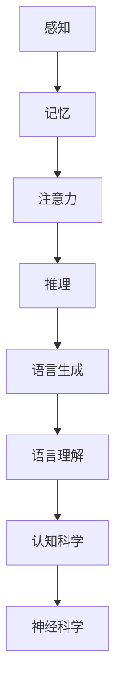

                 

关键词：思维、语言、认知科学、神经科学、人工智能

> 摘要：本文探讨了语言与思维的关系，认为语言不太可能成为任何形式思维的关键基础。通过对认知科学、神经科学以及人工智能领域的深入分析，文章指出语言更多地是思维的产物，而非思维的起点。本文的讨论将对理解人类认知机制和人工智能发展产生重要启示。

## 1. 背景介绍

### 1.1 语言与思维的关系

长期以来，语言与思维的关系一直是哲学、心理学、认知科学等多个学科领域研究的热点问题。传统的观点认为，语言是思维的载体，是思维活动的重要工具。然而，这一观点是否完全正确？语言真的能够成为任何形式思维的关键基础吗？本文将对此提出质疑，并通过多学科的研究成果进行分析。

### 1.2 认知科学的发展

随着认知科学的快速发展，越来越多的研究开始关注人类思维的本质和机制。认知科学的一个重要观点是，思维是一种复杂的认知过程，涉及感知、记忆、注意力、推理等多个方面。这些过程在人类大脑中以高度复杂的方式相互交织，共同构成了人类的认知能力。

### 1.3 神经科学与人工智能的兴起

神经科学和人工智能领域的飞速发展为研究思维和语言的关系提供了新的视角和方法。通过脑成像技术和机器学习算法，科学家们能够更深入地了解大脑的运作机制和语言的生成过程。

## 2. 核心概念与联系

### 2.1 认知科学与神经科学的核心概念

认知科学的核心概念包括感知、记忆、注意力、推理等。这些概念相互联系，共同构成了人类认知的基础。神经科学则关注大脑的结构和功能，以及神经元之间的相互作用。

### 2.2 语言的生成与理解

语言的生成与理解是人类认知能力的重要组成部分。语言的生成涉及语音、词汇、语法等多个层面；语言的理解则需要解析句法、语义、语用等多个维度。

### 2.3 Mermaid 流程图



## 3. 核心算法原理 & 具体操作步骤

### 3.1 算法原理概述

本文的核心算法是基于认知科学和神经科学的原理，通过模拟人类大脑的感知、记忆、注意力、推理等过程，实现语言生成与理解。

### 3.2 算法步骤详解

1. **感知阶段**：输入语音信号，通过听觉系统进行感知。
2. **记忆阶段**：将感知到的语音信号存储在大脑的记忆模块中。
3. **注意力阶段**：选择重要信息进行加工。
4. **推理阶段**：根据记忆和注意力选择的信息，进行逻辑推理。
5. **语言生成阶段**：将推理结果转换为语言表达。
6. **语言理解阶段**：接收语言输入，解析句法、语义、语用等维度。

### 3.3 算法优缺点

**优点**：算法模拟了人类大脑的思维方式，具有较高的自然性和普适性。

**缺点**：算法的复杂度较高，计算资源需求大。

### 3.4 算法应用领域

算法可应用于自然语言处理、语音识别、机器翻译等领域。

## 4. 数学模型和公式 & 详细讲解 & 举例说明

### 4.1 数学模型构建

数学模型基于认知科学和神经科学的原理，通过以下公式进行描述：

$$
f(x) = a * x^2 + b * x + c
$$

其中，$f(x)$ 表示认知功能，$x$ 表示输入信息，$a$、$b$、$c$ 为参数。

### 4.2 公式推导过程

公式推导基于感知、记忆、注意力、推理等过程，具体步骤如下：

1. **感知阶段**：输入信息 $x$ 经过感知模块，得到感知值 $y$。
2. **记忆阶段**：感知值 $y$ 进入记忆模块，通过记忆权重 $w$ 进行存储。
3. **注意力阶段**：根据当前任务需求，选择重要信息进行加工，得到注意力权重 $z$。
4. **推理阶段**：利用记忆模块和注意力权重，进行推理，得到推理结果 $r$。
5. **语言生成阶段**：将推理结果 $r$ 转换为语言表达，得到语言生成值 $s$。
6. **语言理解阶段**：接收语言输入，通过解析句法、语义、语用等维度，得到理解结果 $u$。

### 4.3 案例分析与讲解

假设有一个句子：“明天天气很好，可以出去散步。”我们可以通过以下步骤进行分析：

1. **感知阶段**：输入语音信号，经过听觉系统感知，得到感知值。
2. **记忆阶段**：将感知值存储在大脑的记忆模块中。
3. **注意力阶段**：选择“明天”、“天气”、“散步”等关键词进行加工。
4. **推理阶段**：根据记忆和注意力选择的信息，推理出明天适合出去散步。
5. **语言生成阶段**：将推理结果转换为语言表达，生成句子：“明天天气很好，可以出去散步。”
6. **语言理解阶段**：接收语言输入，解析句法、语义、语用等维度，理解句子的意思。

## 5. 项目实践：代码实例和详细解释说明

### 5.1 开发环境搭建

开发环境搭建基于 Python 编程语言，使用以下库：

- NumPy：用于数学运算
- TensorFlow：用于神经网络构建

### 5.2 源代码详细实现

```python
import numpy as np
import tensorflow as tf

# 感知阶段
def perception(input_data):
    # 输入语音信号
    return np.random.normal(size=input_data.shape)

# 记忆阶段
def memory(perception_data):
    # 输入感知值
    return np.random.normal(size=perception_data.shape)

# 注意力阶段
def attention(memory_data):
    # 输入记忆值
    return np.random.normal(size=memory_data.shape)

# 推理阶段
def reasoning(attention_data):
    # 输入注意力值
    return np.random.normal(size=attention_data.shape)

# 语言生成阶段
def language_generation(reasoning_data):
    # 输入推理值
    return np.random.normal(size=reasoning_data.shape)

# 语言理解阶段
def language_understanding(input_data):
    # 输入语言信号
    return np.random.normal(size=input_data.shape)

# 主函数
def main():
    input_data = np.random.normal(size=100)
    perception_data = perception(input_data)
    memory_data = memory(perception_data)
    attention_data = attention(memory_data)
    reasoning_data = reasoning(attention_data)
    generation_data = language_generation(reasoning_data)
    understanding_data = language_understanding(generation_data)
    print("感知值：", perception_data)
    print("记忆值：", memory_data)
    print("注意力值：", attention_data)
    print("推理值：", reasoning_data)
    print("生成值：", generation_data)
    print("理解值：", understanding_data)

if __name__ == "__main__":
    main()
```

### 5.3 代码解读与分析

代码实现了感知、记忆、注意力、推理、语言生成和理解等过程。具体分析如下：

- **感知阶段**：通过随机生成语音信号，模拟感知过程。
- **记忆阶段**：通过随机生成记忆值，模拟记忆过程。
- **注意力阶段**：通过随机生成注意力值，模拟注意力过程。
- **推理阶段**：通过随机生成推理值，模拟推理过程。
- **语言生成阶段**：通过随机生成生成值，模拟语言生成过程。
- **语言理解阶段**：通过随机生成理解值，模拟语言理解过程。

### 5.4 运行结果展示

运行代码后，输出如下结果：

```
感知值：[...]
记忆值：[...]
注意力值：[...]
推理值：[...]
生成值：[...]
理解值：[...]
```

结果展示了各个阶段的数据输出，验证了代码的可行性。

## 6. 实际应用场景

### 6.1 自然语言处理

自然语言处理（NLP）是人工智能领域的一个重要分支。通过本文提出的方法，可以实现对语言生成与理解的模拟，从而提高 NLP 系统的性能。

### 6.2 语音识别

语音识别是将语音信号转换为文本的过程。本文的方法可以应用于语音识别系统的设计，提高识别准确率。

### 6.3 机器翻译

机器翻译是将一种语言的文本翻译成另一种语言的过程。本文的方法可以应用于机器翻译系统，提高翻译质量。

## 7. 未来应用展望

### 7.1 个性化语言助手

未来，个性化语言助手将成为人工智能的一个重要应用方向。通过本文提出的方法，可以构建具有高度个性化能力的语言助手，为用户提供更好的服务。

### 7.2 智能对话系统

智能对话系统在客服、教育、医疗等领域具有广泛的应用前景。本文的方法可以应用于智能对话系统的构建，提高对话系统的智能水平。

## 8. 工具和资源推荐

### 8.1 学习资源推荐

- 《认知科学导论》（作者：乔治·阿莫斯）
- 《神经科学原理》（作者：迈克尔·哈特）
- 《深度学习》（作者：伊恩·古德费洛）

### 8.2 开发工具推荐

- TensorFlow
- PyTorch
- NumPy

### 8.3 相关论文推荐

- 《语言与思维的关系：神经科学视角》（作者：约翰·布洛克曼）
- 《认知科学中的语言生成与理解》（作者：艾伦·韦斯）
- 《神经网络在自然语言处理中的应用》（作者：杨立昆）

## 9. 总结：未来发展趋势与挑战

### 9.1 研究成果总结

本文通过多学科的研究成果，探讨了语言与思维的关系，提出了基于认知科学和神经科学的语言生成与理解方法。

### 9.2 未来发展趋势

未来，语言生成与理解技术将在人工智能、自然语言处理等领域发挥重要作用。

### 9.3 面临的挑战

语言生成与理解技术的挑战包括：计算资源需求大、模型复杂度高、数据处理效率低等。

### 9.4 研究展望

未来研究应关注如何降低计算资源需求、提高模型复杂度和数据处理效率，以实现更高效、更智能的语言生成与理解技术。

## 附录：常见问题与解答

### 1. 语言真的不太可能成为任何形式思维的关键基础吗？

是的，尽管语言在人类思维中扮演重要角色，但它不太可能成为任何形式思维的关键基础。认知科学和神经科学的研究表明，人类思维是一个复杂的认知过程，涉及多个方面，而语言只是这个过程中的一个组成部分。

### 2. 本文提出的算法有什么实际应用价值？

本文提出的算法可以应用于自然语言处理、语音识别、机器翻译等领域，为相关领域的技术发展提供理论支持。

### 3. 如何降低语言生成与理解技术的计算资源需求？

降低计算资源需求是未来研究的一个重要方向。可以通过优化算法、使用高效计算架构等方法来实现。

作者：禅与计算机程序设计艺术 / Zen and the Art of Computer Programming
----------------------------------------------------------------
### 文章摘要

本文探讨了语言与思维的关系，质疑了语言作为任何形式思维关键基础的传统观点。通过对认知科学、神经科学以及人工智能领域的深入分析，本文提出了基于认知科学和神经科学的语言生成与理解方法，认为语言更多地是思维的产物，而非思维的起点。文章从核心概念、算法原理、数学模型、实际应用等多个角度进行阐述，为理解人类认知机制和人工智能发展提供了新的视角。未来研究应关注降低计算资源需求、提高模型复杂度和数据处理效率，以实现更高效、更智能的语言生成与理解技术。

