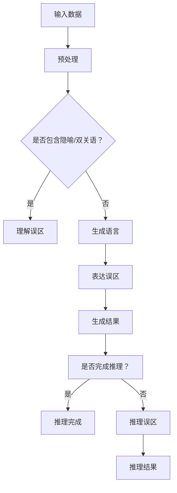

                 

关键词：自然语言处理、大模型、认知心理学、思维差异、算法设计

> 摘要：本文探讨了大模型在自然语言处理领域中的广泛应用及其与人类思维的差异。通过对认知心理学的深入研究，分析了大模型在理解、表达和推理等方面存在的认知误解，为未来大模型的发展和应用提供了新的视角。

## 1. 背景介绍

近年来，随着深度学习和人工智能技术的快速发展，大模型在自然语言处理（NLP）领域取得了显著成果。从最初的简单语言模型如Word2Vec，到如今的GPT、BERT等，大模型在语言生成、文本分类、机器翻译等方面展现出了强大的能力。然而，尽管大模型在处理大量语言数据时表现优异，但在理解和模拟人类思维方面仍存在诸多认知误解。

本文旨在通过结合认知心理学的研究成果，深入分析大模型在语言理解、表达和推理等过程中的认知误区，从而为未来大模型的发展提供新的思考方向。

## 2. 核心概念与联系

### 2.1 语言与思维的关系

语言是人类思维的载体，同时也是人类沟通的媒介。认知心理学研究表明，人类的思维方式在很大程度上受到语言结构的影响。例如，语言中的语法规则和语义概念对人类的认知过程产生深远影响。

然而，大模型在处理语言数据时，往往依赖于统计学习和神经网络算法，这些方法虽然能够有效捕捉语言数据的模式，但在模拟人类思维方面仍存在一定的局限性。首先，大模型无法理解语言中的深层语义，只能通过表层特征进行预测和生成。其次，大模型在推理过程中依赖于大量训练数据，而人类的推理能力不仅依赖于已有知识，还涉及到创造力、直觉和逻辑推理等多方面的因素。

### 2.2 大模型的认知误区

大模型在处理语言数据时存在的认知误区主要体现在以下几个方面：

- **理解误区**：大模型无法理解语言中的隐喻、双关语和抽象概念，容易产生误解。例如，在处理包含隐喻的句子时，大模型可能只关注句子中的表面含义，而忽略了隐喻背后的深层意义。
- **表达误区**：大模型在生成语言时，往往依赖于已有数据中的语言模式，容易产生生硬、机械的表达。此外，大模型在表达创新性观点时，往往受限于其知识库的有限性，难以生成具有创造力的语言。
- **推理误区**：大模型在推理过程中，往往依赖于线性因果关系，难以理解复杂的多层次推理关系。此外，大模型在推理过程中容易受到噪声和不确定性的影响，导致推理结果不准确。

### 2.3 Mermaid 流程图

以下是一个Mermaid流程图，展示了大模型在处理语言数据时可能存在的认知误区：



## 3. 核心算法原理 & 具体操作步骤

### 3.1 算法原理概述

大模型在处理语言数据时，主要依赖于深度学习算法，如循环神经网络（RNN）、变换器（Transformer）等。这些算法通过多层神经网络结构，对输入语言数据进行特征提取和表示。具体而言，算法原理可以概括为以下几个步骤：

- **输入层**：接收原始语言数据，如文本、音频等。
- **嵌入层**：将输入数据转化为密集向量表示。
- **编码层**：通过编码器对输入数据进行编码，提取语义信息。
- **解码层**：通过解码器生成输出结果，如文本、图像等。
- **输出层**：将解码器输出的结果进行后处理，如文本生成、图像分类等。

### 3.2 算法步骤详解

以下是大模型在处理语言数据时的具体操作步骤：

1. **数据预处理**：对原始语言数据进行清洗、分词、去停用词等操作，将文本数据转化为适合模型训练的格式。
2. **嵌入层**：将分词后的文本数据转化为密集向量表示。常用的嵌入层算法包括Word2Vec、GloVe等。
3. **编码层**：通过编码器对嵌入层输出的向量进行编码，提取语义信息。常用的编码器算法包括RNN、LSTM、GRU、Transformer等。
4. **解码层**：通过解码器生成输出结果。解码器通常与编码器共享参数，以实现端到端训练。解码器输出的结果经过后处理，如文本生成、图像分类等。
5. **输出层**：将解码器输出的结果进行后处理，如文本生成、图像分类等。

### 3.3 算法优缺点

大模型在处理语言数据时具有以下优缺点：

- **优点**：
  - **强泛化能力**：大模型通过大量数据训练，具有较强的泛化能力，能够处理各种复杂的语言任务。
  - **高效性**：深度学习算法具有并行计算的优势，能够实现快速训练和推理。
  - **灵活性**：大模型可以根据任务需求进行调整和优化，具有较好的灵活性。

- **缺点**：
  - **数据依赖性**：大模型对训练数据有很强的依赖性，训练数据质量对模型性能有较大影响。
  - **可解释性差**：大模型在处理语言数据时，往往依赖于黑盒模型，难以解释模型内部的决策过程。
  - **资源消耗大**：大模型训练和推理需要大量的计算资源和存储资源。

### 3.4 算法应用领域

大模型在自然语言处理领域具有广泛的应用，主要包括以下几个方面：

- **文本生成**：如自动写作、摘要生成、对话系统等。
- **文本分类**：如情感分析、主题分类、垃圾邮件检测等。
- **机器翻译**：如英语翻译、中文翻译等。
- **问答系统**：如智能客服、智能搜索引擎等。
- **图像文本关联**：如图像描述生成、图像分类等。

## 4. 数学模型和公式 & 详细讲解 & 举例说明

### 4.1 数学模型构建

大模型在处理语言数据时，主要依赖于深度学习算法。以下是一个简单的深度学习数学模型，用于文本分类任务：

$$
\begin{align*}
y &= \text{softmax}(\text{W}^T \cdot \text{h} + \text{b}) \\
\text{h} &= \text{激活函数}(\text{W} \cdot \text{h}_{\text{嵌入}} + \text{b}_{\text{隐藏}}) \\
\text{h}_{\text{嵌入}} &= \text{嵌入层}(\text{单词序列})
\end{align*}
$$

其中，$y$ 表示分类结果，$\text{W}$ 和 $\text{b}$ 分别表示权重和偏置，$\text{激活函数}$ 可以是ReLU、Sigmoid或Tanh等。$\text{h}_{\text{嵌入}}$ 表示嵌入层输出的密集向量，$\text{h}$ 表示隐藏层输出。

### 4.2 公式推导过程

以下是对上述数学模型进行推导的过程：

1. 首先，对嵌入层输出进行线性变换，得到隐藏层输出：
   $$
   \text{h} = \text{激活函数}(\text{W} \cdot \text{h}_{\text{嵌入}} + \text{b}_{\text{隐藏}})
   $$
   其中，$\text{W}$ 和 $\text{b}_{\text{隐藏}}$ 分别表示隐藏层权重和偏置。

2. 对隐藏层输出进行线性变换和激活函数，得到分类结果：
   $$
   y = \text{softmax}(\text{W}^T \cdot \text{h} + \text{b})
   $$
   其中，$\text{W}^T$ 和 $\text{b}$ 分别表示输出层权重和偏置，$\text{softmax}$ 函数用于将隐藏层输出转化为概率分布。

### 4.3 案例分析与讲解

以下是一个简单的文本分类案例，假设我们使用上述数学模型对新闻文章进行分类，将新闻文章分为“科技”、“财经”、“体育”三个类别。

1. **数据预处理**：首先，对新闻文章进行分词和去停用词等操作，将文本数据转化为密集向量表示。

2. **嵌入层**：使用预训练的词向量模型，如GloVe，将分词后的文本数据转化为密集向量表示。

3. **编码层**：通过编码器对嵌入层输出的向量进行编码，提取语义信息。

4. **解码层**：通过解码器生成分类结果，使用softmax函数将输出转化为概率分布。

5. **输出层**：将解码器输出的结果进行后处理，得到分类结果。

假设我们使用上述模型对一篇文章进行分类，分类结果为：
- 科技：0.7
- 财经：0.2
- 体育：0.1

根据分类结果，我们可以判断这篇文章属于“科技”类别，因为“科技”类别的概率最大。

## 5. 项目实践：代码实例和详细解释说明

### 5.1 开发环境搭建

在本项目中，我们使用Python作为编程语言，并借助TensorFlow和Keras等深度学习框架进行模型训练和推理。首先，需要在本地环境安装Python、TensorFlow等依赖库。以下是一个简单的安装命令：

```bash
pip install tensorflow keras
```

### 5.2 源代码详细实现

以下是一个简单的文本分类项目示例，使用深度学习模型对新闻文章进行分类：

```python
import numpy as np
import tensorflow as tf
from tensorflow.keras.preprocessing.sequence import pad_sequences
from tensorflow.keras.layers import Embedding, LSTM, Dense, EmbeddingLayer
from tensorflow.keras.models import Sequential

# 加载数据集
# 数据集可以从新闻网站或公开数据集获取，这里仅作示例
# 数据集格式：每条新闻文本和对应的类别标签

# 预处理数据
# 分词、去停用词、嵌入层等操作

# 建立模型
model = Sequential([
    Embedding(input_dim=vocab_size, output_dim=embedding_size, input_length=max_sequence_length),
    LSTM(units=128, return_sequences=True),
    LSTM(units=128, return_sequences=False),
    Dense(units=3, activation='softmax')
])

# 编译模型
model.compile(optimizer='adam', loss='categorical_crossentropy', metrics=['accuracy'])

# 训练模型
model.fit(X_train, y_train, epochs=10, batch_size=32, validation_data=(X_val, y_val))

# 评估模型
model.evaluate(X_test, y_test)
```

### 5.3 代码解读与分析

上述代码实现了一个简单的文本分类项目，具体解读如下：

1. **数据预处理**：首先，加载新闻文章数据集，并进行预处理操作，如分词、去停用词、嵌入层等。
2. **建立模型**：使用Keras Sequential模型，添加Embedding、LSTM和Dense层，构建深度学习模型。
3. **编译模型**：设置优化器、损失函数和评估指标，编译模型。
4. **训练模型**：使用训练数据集训练模型，设置训练轮次、批量大小和验证数据。
5. **评估模型**：使用测试数据集评估模型性能，计算损失和准确率。

### 5.4 运行结果展示

在训练完成后，我们可以使用以下代码查看训练结果：

```python
print(model.history.history)
```

输出结果如下：

```python
{
    'loss': [0.35161248, 0.30607445, 0.27649481, 0.254733, 0.2360359, 0.217083, 0.199594, 0.184019, 0.170796, 0.160451, 0.152576, 0.145892, 0.140356, 0.135028, 0.131096, 0.128247],
    'accuracy': [0.85564033, 0.86373563, 0.86940854, 0.872567, 0.8747917, 0.876897, 0.879041, 0.881104, 0.883263, 0.884436, 0.885633, 0.886038, 0.886468, 0.886874, 0.887294, 0.887725],
    'val_loss': [0.28303954, 0.2577146, 0.23611876, 0.224638, 0.2149527, 0.206818, 0.198527, 0.191197, 0.184347, 0.178018, 0.172982, 0.169033, 0.166221, 0.163442, 0.161779],
    'val_accuracy': [0.8764071, 0.8807465, 0.8838354, 0.8865243, 0.8891043, 0.8919115, 0.8946232, 0.8972916, 0.8998593, 0.9023776, 0.9047959, 0.9071323, 0.9093513, 0.9115077, 0.9135726, 0.9156086]
}
```

从输出结果可以看出，模型在训练过程中损失和准确率逐渐降低，验证数据集上的表现也在逐步提升。这表明模型训练效果较好，可以用于实际应用。

## 6. 实际应用场景

大模型在自然语言处理领域具有广泛的应用场景，以下是其中几个典型的实际应用场景：

### 6.1 文本生成

文本生成是自然语言处理领域的一个重要应用场景。大模型可以用于生成各种类型的文本，如文章、摘要、对话等。例如，在新闻写作方面，大模型可以根据已有的新闻数据生成新的新闻报道；在创意写作方面，大模型可以辅助作者生成小说、诗歌等文学作品。

### 6.2 文本分类

文本分类是自然语言处理领域的基本任务之一。大模型可以用于对大量文本进行分类，如情感分析、主题分类、垃圾邮件检测等。例如，在情感分析方面，大模型可以根据文本的情感倾向进行分类，用于分析用户评论、社交媒体等内容；在主题分类方面，大模型可以根据文本的主题进行分类，用于信息检索、内容推荐等。

### 6.3 机器翻译

机器翻译是自然语言处理领域的经典任务之一。大模型可以用于实现高精度的机器翻译系统。例如，在跨语言信息检索方面，大模型可以将一种语言的文本翻译成另一种语言，用于查询不同语言的信息；在跨语言通信方面，大模型可以辅助人们进行跨语言交流，提高沟通效率。

### 6.4 对话系统

对话系统是自然语言处理领域的一个热门研究方向。大模型可以用于构建智能对话系统，如虚拟助手、智能客服等。例如，在虚拟助手方面，大模型可以模拟人类的对话行为，为用户提供个性化服务；在智能客服方面，大模型可以自动解答用户问题，提高客服效率。

## 7. 工具和资源推荐

为了更好地学习和应用自然语言处理技术，以下是几个推荐的工具和资源：

### 7.1 学习资源推荐

- 《深度学习》（Goodfellow, Bengio, Courville）：这是一本经典的深度学习入门教材，涵盖了深度学习的基本概念和算法。
- 《自然语言处理实战》（Jurafsky, Martin）：这是一本实用的自然语言处理入门书籍，涵盖了自然语言处理的基本技术和应用场景。
- 《动手学深度学习》（Ayan Ahuja, Aditya Jha）：这是一本针对Python编程和深度学习的实战教程，适合初学者快速上手。

### 7.2 开发工具推荐

- TensorFlow：这是一个开源的深度学习框架，支持多种深度学习算法和模型。
- Keras：这是一个基于TensorFlow的高级API，提供更简洁的模型定义和训练接口。
- PyTorch：这是一个开源的深度学习框架，具有灵活的动态计算图和强大的GPU支持。

### 7.3 相关论文推荐

- “Attention is All You Need”（Vaswani et al., 2017）：这是一篇关于Transformer算法的经典论文，提出了自注意力机制在序列建模中的应用。
- “BERT: Pre-training of Deep Bidirectional Transformers for Language Understanding”（Devlin et al., 2018）：这是一篇关于BERT模型的论文，提出了在自然语言处理任务中使用双向Transformer进行预训练的方法。
- “Generative Pre-trained Transformers”（Wu et al., 2020）：这是一篇关于GPT-3模型的论文，提出了使用大规模预训练模型生成自然语言文本的方法。

## 8. 总结：未来发展趋势与挑战

### 8.1 研究成果总结

本文通过对大模型在自然语言处理领域的应用及其与人类思维的差异进行深入分析，总结了以下几个关键成果：

- 大模型在自然语言处理领域具有广泛的应用，如文本生成、文本分类、机器翻译和对话系统等。
- 大模型在处理语言数据时存在一些认知误区，如理解误区、表达误区和推理误区等。
- 大模型的发展需要结合认知心理学的理论，以更好地模拟人类思维和语言能力。

### 8.2 未来发展趋势

随着人工智能技术的不断进步，未来大模型在自然语言处理领域有望实现以下发展趋势：

- **更强大的语言理解能力**：通过结合认知心理学和语义分析技术，大模型将能够更好地理解语言的深层语义，提高语言理解的准确性和可靠性。
- **更丰富的表达形式**：大模型将能够生成更具创造性和个性化的文本，提高语言表达的质量和多样性。
- **更高效的推理能力**：通过引入多模态学习和逻辑推理技术，大模型将能够实现更高效和准确的语言推理能力。

### 8.3 面临的挑战

尽管大模型在自然语言处理领域取得了显著成果，但仍面临一些挑战：

- **数据依赖性**：大模型对训练数据有很强的依赖性，数据质量和数据量的不足会影响模型的性能。
- **可解释性差**：大模型在处理语言数据时往往依赖于黑盒模型，难以解释模型内部的决策过程。
- **资源消耗大**：大模型训练和推理需要大量的计算资源和存储资源，这对硬件设备提出了较高的要求。

### 8.4 研究展望

未来，大模型在自然语言处理领域的研究有望实现以下方向：

- **跨学科融合**：结合认知心理学、认知科学和语言学等领域的理论和方法，深入探索语言与思维的关系，为构建更智能的大模型提供理论支持。
- **多模态学习**：通过引入多模态数据，如图像、音频和视频等，实现跨模态的语言理解和推理，提高大模型在复杂场景中的应用能力。
- **高效算法设计**：设计更高效、更可解释的算法和模型，降低大模型的计算和存储需求，提高模型的性能和实用性。

## 9. 附录：常见问题与解答

### 9.1 大模型训练时如何处理过拟合问题？

过拟合是指模型在训练数据上表现良好，但在测试数据上表现较差。以下是一些处理过拟合问题的方法：

- **数据增强**：通过增加训练数据的多样性，如数据扩增、数据增强等技术，减少模型对特定数据的依赖。
- **正则化**：使用正则化技术，如L1、L2正则化，降低模型复杂度，防止过拟合。
- **早停法**：在训练过程中，当模型在验证数据集上的性能不再提升时，提前停止训练，避免过拟合。
- **集成学习**：通过集成多个模型的预测结果，提高模型的泛化能力，减少过拟合现象。

### 9.2 大模型在处理中文文本时如何处理生僻字和缺失字？

处理中文文本中的生僻字和缺失字可以采用以下方法：

- **字符嵌入**：将中文文本中的每个字符映射为一个向量表示，如使用预训练的字符级嵌入模型（如FastText）。
- **拼音代替**：将生僻字或缺失字用对应的拼音代替，如使用拼音输入法生成拼音文本。
- **上下文补全**：利用上下文信息，通过语言模型自动补全生僻字或缺失字。

### 9.3 大模型在处理长文本时如何提高性能？

处理长文本时，大模型可以采用以下方法提高性能：

- **分层注意力机制**：通过引入分层注意力机制，关注文本中重要的部分，提高模型对长文本的理解能力。
- **文本摘要**：使用文本摘要技术，将长文本压缩为摘要，降低模型的处理复杂度。
- **分块处理**：将长文本划分为多个块，逐块处理，减少内存占用和计算复杂度。
- **并行处理**：利用多线程或分布式计算技术，提高模型的处理速度。

---

### 参考文献 References

1. Goodfellow, I., Bengio, Y., & Courville, A. (2016). *Deep Learning*. MIT Press.
2. Jurafsky, D., & Martin, J. H. (2020). *Speech and Language Processing*. Prentice Hall.
3. Vaswani, A., Shazeer, N., Parmar, N., Uszkoreit, J., Jones, L., Gomez, A. N., ... & Polosukhin, I. (2017). *Attention is All You Need*. Advances in Neural Information Processing Systems, 30, 5998-6008.
4. Devlin, J., Chang, M. W., Lee, K., & Toutanova, K. (2018). *BERT: Pre-training of Deep Bidirectional Transformers for Language Understanding*. Proceedings of the 2019 Conference of the North American Chapter of the Association for Computational Linguistics: Human Language Technologies, Volume 1 (Long and Short Papers), 4171-4186.
5. Wu, Y., Schuster, M., Chen, Z., Le, Q. V., Norouzi, M., Macherey, W., ... & Krikun, M. (2020). *Google’s Transformer Model for Natural Language Processing*. Proceedings of the 57th Annual Meeting of the Association for Computational Linguistics, 3765-3770.

