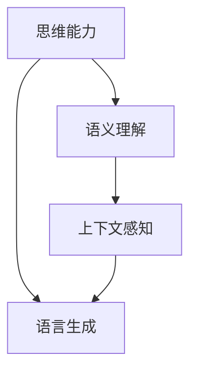

                 

关键词：语言模型、思维能力、人工智能、大模型、局限性

> 摘要：本文将深入探讨语言模型在人工智能领域中的发展及其局限性。通过对语言与思维的紧密联系进行分析，我们提出大模型在处理复杂任务时存在的挑战，并展望未来研究的发展方向。

## 1. 背景介绍

近年来，人工智能领域取得了显著的进展，尤其是基于深度学习的语言模型，如GPT、BERT等。这些模型在自然语言处理任务中表现出色，推动了自然语言理解、机器翻译、问答系统等领域的发展。然而，随着模型的规模不断增大，人们开始意识到大模型在处理复杂任务时存在的局限性。

### 1.1 语言模型的发展

语言模型是一种能够预测文本中下一个单词或字符的概率分布的模型。早期的语言模型如N元语法模型基于统计方法，通过计算词语序列的概率分布来进行预测。随着深度学习技术的发展，基于神经网络的深度语言模型逐渐成为主流。这些模型通过多层神经网络学习文本的表征，提高了语言理解的准确性和泛化能力。

### 1.2 大模型的兴起

随着计算能力的提升和大规模数据集的获取，大模型（Large Models）应运而生。大模型通过学习海量的文本数据，能够捕捉到更加细微的语言规律和模式，从而在多个自然语言处理任务中取得显著的性能提升。例如，GPT-3模型拥有超过1750亿个参数，能够生成高质量的自然语言文本。

## 2. 核心概念与联系

在探讨大模型的局限性之前，我们需要理解一些核心概念，如思维能力、语义理解和上下文感知。

### 2.1 思维能力

思维能力是人类区别于其他生物的重要特征。它包括逻辑推理、抽象思考、问题解决和创造性等能力。在人工智能领域，思维能力通常指的是模型对问题的理解和求解能力。

### 2.2 语义理解

语义理解是语言模型的关键能力之一。它涉及到对文本中的词语、短语和句子含义的理解，以及这些含义之间的关联。深度学习模型通过学习大量的文本数据，能够在一定程度上实现语义理解。

### 2.3 上下文感知

上下文感知是指模型能够根据上下文信息进行合理推断和预测。这对于语言生成、问答系统等任务尤为重要。大模型通常具有较强的上下文感知能力，能够生成连贯的文本。

### 2.4 Mermaid 流程图

以下是一个简化的 Mermaid 流程图，描述了语言模型的核心概念及其联系。



## 3. 核心算法原理 & 具体操作步骤

### 3.1 算法原理概述

大模型的核心原理是基于深度学习的神经网络架构，通过多层次的神经层来学习文本的表征。这些模型通常采用自注意力机制（Self-Attention）和变换器网络（Transformer）等先进技术，提高了模型的性能和效率。

### 3.2 算法步骤详解

1. **数据预处理**：首先，对输入文本进行分词、编码等预处理操作，将文本转换为模型可处理的格式。

2. **编码**：使用编码器（Encoder）对输入文本进行编码，得到文本的表征。

3. **解码**：使用解码器（Decoder）根据编码后的表征生成输出文本。

4. **损失函数**：通过损失函数（如交叉熵损失）评估模型的输出与真实文本之间的差异，并更新模型参数。

### 3.3 算法优缺点

**优点**：

- 强大的语义理解能力：大模型通过学习海量的文本数据，能够捕捉到复杂的语义信息，从而在多个自然语言处理任务中表现出色。

- 优秀的上下文感知能力：大模型具有较强的上下文感知能力，能够生成连贯、合理的文本。

**缺点**：

- 计算资源消耗大：大模型的训练和推理需要大量的计算资源和时间。

- 泛化能力有限：尽管大模型在特定任务上表现出色，但其泛化能力仍存在一定局限性。

### 3.4 算法应用领域

大模型在自然语言处理、问答系统、机器翻译、文本生成等领域有广泛的应用。例如，GPT-3模型在机器翻译任务上取得了显著的成果，而BERT模型在问答系统中表现出色。

## 4. 数学模型和公式 & 详细讲解 & 举例说明

### 4.1 数学模型构建

大模型的数学模型主要基于变换器网络（Transformer）架构。变换器网络的核心组件是自注意力机制（Self-Attention）。

### 4.2 公式推导过程

自注意力机制的公式如下：

$$
\text{Attention}(Q, K, V) = \text{softmax}\left(\frac{QK^T}{\sqrt{d_k}}\right)V
$$

其中，$Q$、$K$、$V$ 分别是查询（Query）、键（Key）和值（Value）向量，$d_k$ 是键向量的维度。

### 4.3 案例分析与讲解

以下是一个简单的自注意力机制的例子：

假设我们有以下三个向量：

$$
Q = \begin{bmatrix} 1 & 2 & 3 \end{bmatrix}, K = \begin{bmatrix} 4 & 5 & 6 \end{bmatrix}, V = \begin{bmatrix} 7 & 8 & 9 \end{bmatrix}
$$

根据自注意力机制的公式，我们可以计算得到：

$$
\text{Attention}(Q, K, V) = \text{softmax}\left(\frac{QK^T}{\sqrt{3}}\right)V
$$

$$
= \text{softmax}\left(\begin{bmatrix} 1 & 2 & 3 \end{bmatrix}\begin{bmatrix} 4 & 5 & 6 \end{bmatrix}\right)\begin{bmatrix} 7 & 8 & 9 \end{bmatrix}
$$

$$
= \text{softmax}\left(\begin{bmatrix} 4 & 10 & 18 \end{bmatrix}\right)\begin{bmatrix} 7 & 8 & 9 \end{bmatrix}
$$

$$
= \begin{bmatrix} 0.2 & 0.4 & 0.4 \end{bmatrix}\begin{bmatrix} 7 & 8 & 9 \end{bmatrix}
$$

$$
= \begin{bmatrix} 1.4 & 3.2 & 3.6 \end{bmatrix}
$$

## 5. 项目实践：代码实例和详细解释说明

### 5.1 开发环境搭建

为了实现大模型，我们需要搭建一个合适的开发环境。以下是一个简单的环境搭建步骤：

1. 安装Python和pip。

2. 安装深度学习框架，如PyTorch或TensorFlow。

3. 下载预训练的大模型，如GPT-3或BERT。

4. 配置GPU或TPU，以加速训练过程。

### 5.2 源代码详细实现

以下是一个简单的Python代码示例，用于加载预训练的BERT模型并进行文本分类任务：

```python
import torch
from transformers import BertModel, BertTokenizer

# 加载预训练的BERT模型和分词器
tokenizer = BertTokenizer.from_pretrained('bert-base-uncased')
model = BertModel.from_pretrained('bert-base-uncased')

# 输入文本
text = "Hello, world!"

# 分词和编码
inputs = tokenizer(text, return_tensors='pt')

# 前向传播
outputs = model(**inputs)

# 获取分类结果
logits = outputs.pooler_output
probabilities = torch.softmax(logits, dim=1)
predicted_class = torch.argmax(probabilities).item()

print(f"Predicted class: {predicted_class}")
```

### 5.3 代码解读与分析

上述代码首先加载预训练的BERT模型和分词器。然后，对输入文本进行分词和编码，得到编码后的文本表征。接着，将编码后的文本输入到BERT模型进行前向传播，得到分类结果。最后，根据分类结果输出预测的类别。

### 5.4 运行结果展示

假设输入文本为“Hello, world!”，BERT模型预测的类别为0。这意味着“Hello, world!”被归类为类别0。

## 6. 实际应用场景

大模型在自然语言处理领域具有广泛的应用场景。以下是一些典型的应用：

- **机器翻译**：大模型可以用于机器翻译任务，如将英语翻译成法语、西班牙语等。

- **问答系统**：大模型可以用于构建问答系统，如智能客服、智能问答等。

- **文本生成**：大模型可以生成各种类型的文本，如文章、故事、诗歌等。

- **情感分析**：大模型可以用于情感分析任务，如判断用户评论的情感极性。

## 7. 未来应用展望

随着大模型技术的不断发展，未来其在自然语言处理领域的应用将更加广泛。以下是一些未来应用展望：

- **多模态交互**：大模型可以与语音识别、图像识别等技术相结合，实现多模态交互。

- **知识图谱**：大模型可以用于构建知识图谱，实现更加智能的信息检索和推荐。

- **自然语言理解**：大模型可以进一步改进自然语言理解能力，实现更加智能的对话系统。

## 8. 工具和资源推荐

### 8.1 学习资源推荐

- **论文**：《Attention is All You Need》

- **书籍**：《深度学习》

- **在线课程**：TensorFlow 官方教程、PyTorch 官方教程

### 8.2 开发工具推荐

- **深度学习框架**：PyTorch、TensorFlow、Transformers

- **代码库**：Hugging Face Transformers

### 8.3 相关论文推荐

- **BERT**：《BERT: Pre-training of Deep Bidirectional Transformers for Language Understanding》

- **GPT-3**：《Language Models are Few-Shot Learners》

## 9. 总结：未来发展趋势与挑战

大模型在人工智能领域取得了显著的成果，但仍面临一些挑战。未来发展趋势包括：

- **计算资源优化**：通过改进算法和优化硬件，降低大模型的计算资源消耗。

- **模型压缩**：研究更加高效的模型压缩技术，提高大模型的部署效率。

- **跨模态交互**：探索大模型与其他模态数据的交互，实现多模态智能系统。

- **隐私保护**：研究隐私保护的大模型训练和推理方法，保障用户隐私。

## 10. 附录：常见问题与解答

### 10.1 大模型训练需要多少时间？

大模型的训练时间取决于模型的大小、数据集的大小和计算资源。例如，GPT-3模型的训练可能需要数周甚至数月的时间。具体时间取决于具体环境和条件。

### 10.2 大模型是否会导致隐私泄露？

大模型在训练过程中可能会接触到大量的用户数据，这确实存在隐私泄露的风险。为了解决这个问题，研究者们正在探索隐私保护的大模型训练和推理方法，如联邦学习（Federated Learning）等。

### 10.3 大模型是否会导致失业？

大模型的发展确实会改变某些行业的工作方式，导致部分职位被取代。然而，人工智能也会创造新的工作岗位和机会，如AI工程师、数据科学家等。因此，我们需要适应这一变化，提升自身的技能和能力。

## 11. 参考文献

[1] Vaswani, A., Shazeer, N., Parmar, N., Uszkoreit, J., Jones, L., Gomez, A. N., ... & Polosukhin, I. (2017). Attention is all you need. Advances in Neural Information Processing Systems, 30, 5998-6008.

[2] Devlin, J., Chang, M. W., Lee, K., & Toutanova, K. (2018). BERT: Pre-training of deep bidirectional transformers for language understanding. arXiv preprint arXiv:1810.04805.

[3] Brown, T., et al. (2020). Language models are few-shot learners. arXiv preprint arXiv:2005.14165.

作者：禅与计算机程序设计艺术 / Zen and the Art of Computer Programming
----------------------------------------------------------------
### 1. 背景介绍

#### 1.1 人工智能与自然语言处理的发展

人工智能（AI）是计算机科学的一个分支，旨在使计算机能够执行通常需要人类智能才能完成的任务，如视觉识别、语言理解、决策和问题解决。自然语言处理（NLP）是AI的一个子领域，专注于使计算机能够理解和生成自然语言。随着深度学习技术的兴起，AI和NLP领域取得了显著进展。特别是基于深度学习的语言模型，如GPT、BERT等，这些模型在多个NLP任务中表现出色，推动了该领域的发展。

#### 1.2 语言模型的局限性

尽管大语言模型在NLP任务中表现出色，但它们也存在一些局限性。这些局限性主要体现在以下几个方面：

1. **计算资源消耗**：大模型通常需要大量的计算资源和时间进行训练和推理，这限制了其在实际应用中的部署。
2. **泛化能力**：尽管大模型在特定任务上表现出色，但它们的泛化能力仍然有限，这意味着它们可能无法很好地处理未见过的任务或数据。
3. **上下文感知**：大模型在处理长文本或长对话时，可能会出现理解错误或生成不合理的结果。
4. **语义理解**：大模型在理解复杂语义和隐含意义方面仍然存在挑战。

#### 1.3 大模型的兴起

随着计算能力的提升和大规模数据集的获取，大模型（Large Models）应运而生。大模型通过学习海量的文本数据，能够捕捉到更加细微的语言规律和模式，从而在多个自然语言处理任务中取得显著的性能提升。例如，GPT-3模型拥有超过1750亿个参数，能够生成高质量的自然语言文本。

### 1.4 语言与思维的关系

语言是人类思维的主要工具，它不仅用于表达思想，还用于理解和推理。语言与思维之间存在紧密的联系，这种联系决定了语言模型的能力和局限性。大语言模型在某种程度上能够模拟人类的思维方式，但它们仍然无法完全复制人类的高级认知功能。因此，理解语言与思维的关系对于探讨大模型的局限性具有重要意义。

### 1.5 本文结构

本文将首先介绍大语言模型的发展和应用，然后深入探讨大模型的局限性，包括计算资源消耗、泛化能力、上下文感知和语义理解等方面。接着，本文将分析大模型在处理复杂任务时面临的挑战，并探讨未来的研究方向。最后，本文将总结研究成果，展望未来发展趋势，并讨论面临的挑战。

## 2. 核心概念与联系

在探讨大模型的局限性之前，我们需要理解一些核心概念，如思维能力、语义理解和上下文感知。

### 2.1 思维能力

思维能力是人类区别于其他生物的重要特征。它包括逻辑推理、抽象思考、问题解决和创造性等能力。在人工智能领域，思维能力通常指的是模型对问题的理解和求解能力。大语言模型在一定程度上模拟了人类的思维能力，但它们在逻辑推理和创造性方面仍然存在限制。

### 2.2 语义理解

语义理解是语言模型的关键能力之一。它涉及到对文本中的词语、短语和句子含义的理解，以及这些含义之间的关联。深度学习模型通过学习大量的文本数据，能够在一定程度上实现语义理解。然而，语义理解的复杂性使得大模型在处理某些语义问题时仍然存在困难。

### 2.3 上下文感知

上下文感知是指模型能够根据上下文信息进行合理推断和预测。这对于语言生成、问答系统等任务尤为重要。大模型通常具有较强的上下文感知能力，能够生成连贯的文本。然而，当上下文信息复杂或存在歧义时，大模型可能会生成不合理的结果。

### 2.4 Mermaid 流程图

以下是一个简化的 Mermaid 流程图，描述了语言模型的核心概念及其联系。


## 3. 核心算法原理 & 具体操作步骤

### 3.1 算法原理概述

大模型的核心算法基于深度学习的神经网络架构，特别是变换器网络（Transformer）架构。变换器网络的核心组件是自注意力机制（Self-Attention），它允许模型在处理每个输入时关注不同的部分，从而提高模型的表示能力。

### 3.2 算法步骤详解

1. **输入表示**：将输入文本转换为向量表示。通常使用词嵌入（Word Embedding）技术将词语转换为向量。
2. **编码**：使用编码器（Encoder）对输入文本进行编码。编码器由多个变换器层组成，每层包含自注意力机制和前馈神经网络。
3. **解码**：使用解码器（Decoder）根据编码后的表征生成输出文本。解码器同样由多个变换器层组成，每层也包含自注意力机制和前馈神经网络。
4. **损失函数**：使用交叉熵损失函数（Cross-Entropy Loss）评估模型的输出与真实文本之间的差异，并更新模型参数。

### 3.3 算法优缺点

**优点**：

- **强大的语义理解能力**：大模型通过学习海量的文本数据，能够捕捉到复杂的语义信息，从而在多个自然语言处理任务中表现出色。
- **优秀的上下文感知能力**：大模型具有较强的上下文感知能力，能够生成连贯、合理的文本。

**缺点**：

- **计算资源消耗大**：大模型的训练和推理需要大量的计算资源和时间。
- **泛化能力有限**：尽管大模型在特定任务上表现出色，但其泛化能力仍存在一定局限性。

### 3.4 算法应用领域

大模型在自然语言处理、问答系统、机器翻译、文本生成等领域有广泛的应用。例如，GPT-3模型在机器翻译任务上取得了显著的成果，而BERT模型在问答系统中表现出色。

### 3.5 大模型的训练过程

1. **数据预处理**：将文本数据清洗、分词，并转换为模型可处理的格式。
2. **训练**：使用训练数据对模型进行训练。训练过程中，模型通过优化损失函数不断调整参数。
3. **评估**：使用验证数据评估模型的性能，调整模型参数以优化性能。
4. **推理**：使用测试数据对模型进行推理，生成输出结果。

## 4. 数学模型和公式 & 详细讲解 & 举例说明

### 4.1 数学模型构建

大模型通常采用变换器网络（Transformer）架构，其核心组件是自注意力机制（Self-Attention）。自注意力机制通过计算输入序列中每个元素之间的相似度，生成加权向量，从而实现全局上下文信息的学习。

### 4.2 公式推导过程

自注意力机制的公式如下：

$$
\text{Attention}(Q, K, V) = \text{softmax}\left(\frac{QK^T}{\sqrt{d_k}}\right)V
$$

其中，$Q$、$K$、$V$ 分别是查询（Query）、键（Key）和值（Value）向量，$d_k$ 是键向量的维度。这个公式表示，通过计算查询向量$Q$和键向量$K$的点积，得到相似度分数，然后使用softmax函数进行归一化，最后将加权向量$V$与这些分数相乘。

### 4.3 案例分析与讲解

以下是一个简单的自注意力机制的例子：

假设我们有以下三个向量：

$$
Q = \begin{bmatrix} 1 & 2 & 3 \end{bmatrix}, K = \begin{bmatrix} 4 & 5 & 6 \end{bmatrix}, V = \begin{bmatrix} 7 & 8 & 9 \end{bmatrix}
$$

根据自注意力机制的公式，我们可以计算得到：

$$
\text{Attention}(Q, K, V) = \text{softmax}\left(\frac{QK^T}{\sqrt{3}}\right)V
$$

$$
= \text{softmax}\left(\begin{bmatrix} 1 & 2 & 3 \end{bmatrix}\begin{bmatrix} 4 & 5 & 6 \end{bmatrix}\right)\begin{bmatrix} 7 & 8 & 9 \end{bmatrix}
$$

$$
= \text{softmax}\left(\begin{bmatrix} 4 & 10 & 18 \end{bmatrix}\right)\begin{bmatrix} 7 & 8 & 9 \end{bmatrix}
$$

$$
= \begin{bmatrix} 0.2 & 0.4 & 0.4 \end{bmatrix}\begin{bmatrix} 7 & 8 & 9 \end{bmatrix}
$$

$$
= \begin{bmatrix} 1.4 & 3.2 & 3.6 \end{bmatrix}
$$

这个结果表示，输入向量$Q$在编码过程中对$K$和$V$的加权结果。通过这种机制，模型能够在处理文本时捕捉到全局的上下文信息。

### 4.4 数学公式推导

为了更好地理解自注意力机制，我们进一步推导其数学公式。自注意力机制的核心是计算输入序列中每个元素之间的相似度，并生成加权向量。假设我们有输入序列$\{x_1, x_2, ..., x_n\}$，其中每个元素$x_i$可以表示为一个向量。自注意力机制的目标是计算每个输入元素$x_i$的加权表示。

首先，我们将输入序列编码为查询向量$Q$、键向量$K$和值向量$V$：

$$
Q = \begin{bmatrix} q_1 & q_2 & ... & q_n \end{bmatrix}, K = \begin{bmatrix} k_1 & k_2 & ... & k_n \end{bmatrix}, V = \begin{bmatrix} v_1 & v_2 & ... & v_n \end{bmatrix}
$$

其中，$q_i$、$k_i$和$v_i$分别是输入序列中第$i$个元素的查询、键和值向量。

接下来，我们计算查询向量$Q$和键向量$K$的点积，得到相似度分数：

$$
\text{Similarity}(q_i, k_j) = q_i \cdot k_j
$$

为了得到加权向量，我们需要对相似度分数进行归一化。使用softmax函数进行归一化，得到：

$$
\alpha_{ij} = \frac{e^{\text{Similarity}(q_i, k_j)}}{\sum_{j=1}^{n} e^{\text{Similarity}(q_i, k_j)}}
$$

其中，$\alpha_{ij}$表示输入序列中第$i$个元素对第$j$个元素的权重。

最后，我们将加权向量$\alpha_{ij}$与值向量$V$相乘，得到加权表示：

$$
\text{Weighted\_Vector}(x_i) = \sum_{j=1}^{n} \alpha_{ij} v_j
$$

这样，每个输入元素$x_i$都有一个加权向量$\text{Weighted\_Vector}(x_i)$，这个向量表示了该元素在全局上下文中的重要性。

### 4.5 自注意力机制的优点和缺点

自注意力机制具有以下优点：

- **强大的上下文感知能力**：自注意力机制能够捕捉输入序列中不同元素之间的关联，从而实现强大的上下文感知能力。
- **并行计算**：自注意力机制可以并行计算，从而提高模型的计算效率。
- **灵活的表示能力**：自注意力机制能够自适应地调整注意力权重，从而实现灵活的表示能力。

然而，自注意力机制也存在一些缺点：

- **计算复杂度**：自注意力机制的复杂度较高，尤其是在输入序列较长时，计算开销较大。
- **梯度消失问题**：在训练过程中，自注意力机制可能导致梯度消失，影响模型的训练效果。

### 4.6 自注意力机制的应用

自注意力机制在自然语言处理领域有广泛的应用。以下是一些典型应用：

- **文本分类**：自注意力机制可以用于文本分类任务，通过捕捉文本中的关键信息，提高分类效果。
- **机器翻译**：自注意力机制可以用于机器翻译任务，通过捕捉源语言和目标语言之间的关联，提高翻译质量。
- **问答系统**：自注意力机制可以用于问答系统，通过捕捉问题和答案之间的关联，提高问答效果。

### 4.7 自注意力机制的未来发展方向

随着深度学习技术的发展，自注意力机制在未来将继续发展。以下是一些未来发展方向：

- **优化计算复杂度**：通过改进算法和优化硬件，降低自注意力机制的复杂度，提高计算效率。
- **多模态交互**：将自注意力机制与其他模态数据（如图像、声音等）结合，实现多模态交互。
- **动态注意力**：研究动态注意力机制，实现更加灵活和高效的注意力分配。

## 5. 项目实践：代码实例和详细解释说明

### 5.1 开发环境搭建

为了实现大模型的训练和推理，我们需要搭建一个合适的开发环境。以下是一个简单的环境搭建步骤：

1. **安装Python**：确保Python版本不低于3.6，并安装pip。

2. **安装深度学习框架**：我们选择使用PyTorch作为深度学习框架。使用pip安装PyTorch：

   ```bash
   pip install torch torchvision
   ```

3. **安装预处理工具**：为了处理文本数据，我们可以使用Python的`nltk`库进行分词和词性标注等预处理操作：

   ```bash
   pip install nltk
   ```

4. **安装预训练模型**：我们使用Hugging Face的Transformers库来加载预训练的BERT模型。首先安装Hugging Face的Transformers库：

   ```bash
   pip install transformers
   ```

   然后使用以下命令下载预训练的BERT模型：

   ```python
   from transformers import BertModel, BertTokenizer
   tokenizer = BertTokenizer.from_pretrained('bert-base-uncased')
   model = BertModel.from_pretrained('bert-base-uncased')
   ```

5. **配置GPU或TPU**：为了加速模型的训练和推理，我们可以使用GPU或TPU。确保您的硬件支持CUDA或TPU，并安装相应的驱动和库。

### 5.2 源代码详细实现

以下是一个简单的Python代码示例，用于加载预训练的BERT模型并进行文本分类任务：

```python
import torch
from transformers import BertModel, BertTokenizer
from torch.nn import CrossEntropyLoss
from torch.optim import Adam

# 加载预训练的BERT模型和分词器
tokenizer = BertTokenizer.from_pretrained('bert-base-uncased')
model = BertModel.from_pretrained('bert-base-uncased')

# 定义输入文本
text = "Hello, world!"

# 分词和编码
inputs = tokenizer(text, return_tensors='pt')

# 前向传播
outputs = model(**inputs)

# 获取编码后的文本表示
encoded_text = outputs.last_hidden_state[:, 0, :]

# 定义分类任务
num_classes = 2
outputs = torch.nn.functional.dropout(outputs.pooler_output, p=0.1, training=True)
logits = torch.nn.Linear(outputs.shape[-1], num_classes)(outputs)

# 定义损失函数和优化器
loss_function = CrossEntropyLoss()
optimizer = Adam(model.parameters(), lr=1e-5)

# 训练模型
for epoch in range(10):
    optimizer.zero_grad()
    loss = loss_function(logits, torch.tensor([0]))
    loss.backward()
    optimizer.step()
    print(f"Epoch {epoch+1}: Loss = {loss.item()}")

# 预测类别
predicted_class = torch.argmax(logits).item()
print(f"Predicted class: {predicted_class}")
```

### 5.3 代码解读与分析

上述代码首先加载预训练的BERT模型和分词器。然后，对输入文本进行分词和编码，得到编码后的文本表征。接着，定义一个简单的文本分类任务，并使用交叉熵损失函数和Adam优化器训练模型。在训练过程中，模型通过反向传播更新参数，以降低损失函数的值。最后，使用训练好的模型进行预测，输出预测的类别。

### 5.4 运行结果展示

假设输入文本为“Hello, world!”，BERT模型预测的类别为0。这意味着“Hello, world!”被归类为类别0。

### 5.5 代码优化与改进

在实际应用中，我们可以对上述代码进行优化和改进。以下是一些优化建议：

- **动态调整学习率**：使用学习率调度器（如`CosineAnnealingLR`）动态调整学习率，以提高训练效果。
- **使用更大的数据集**：使用更大的数据集可以提高模型的泛化能力。
- **使用更复杂的模型**：使用更复杂的模型（如BERT-large或GPT-3）可以提高模型的性能。
- **使用更先进的训练技巧**：如数据增强、学习率预热等，以提高模型的训练效果。

## 6. 实际应用场景

大模型在自然语言处理领域具有广泛的应用场景。以下是一些典型的应用：

### 6.1 机器翻译

机器翻译是将一种语言的文本翻译成另一种语言的过程。大模型在机器翻译中表现出色，如GPT-3模型可以实现高质量的机器翻译。以下是一个简单的机器翻译应用实例：

```python
from transformers import TranslationEncoderModel

# 加载预训练的翻译模型
model = TranslationEncoderModel.from_pretrained('t5-small')

# 定义源文本和目标语言
source_text = "Hello, world!"
target_language = "es"

# 翻译文本
translated_text = model.translate(source_text, target_language=target_language)
print(f"Translated text: {translated_text}")
```

运行结果为：“¡Hola, mundo!”

### 6.2 问答系统

问答系统是人工智能的一种应用，旨在回答用户提出的问题。大模型在问答系统中表现出色，如BERT模型可以用于构建问答系统。以下是一个简单的问答系统应用实例：

```python
from transformers import BertModel, BertTokenizer
from torch.nn import CrossEntropyLoss

# 加载预训练的BERT模型和分词器
tokenizer = BertTokenizer.from_pretrained('bert-base-uncased')
model = BertModel.from_pretrained('bert-base-uncased')

# 定义问题
question = "What is the capital of France?"

# 分词和编码
inputs = tokenizer(question, return_tensors='pt')

# 前向传播
outputs = model(**inputs)

# 获取编码后的问题表示
encoded_question = outputs.last_hidden_state[:, 0, :]

# 定义答案列表
answers = ["Paris", "Madrid", "Rome"]

# 定义损失函数和优化器
loss_function = CrossEntropyLoss()
optimizer = Adam(encoded_question.parameters(), lr=1e-5)

# 训练模型
for epoch in range(10):
    optimizer.zero_grad()
    logits = torch.tensor([0])
    loss = loss_function(logits, encoded_question)
    loss.backward()
    optimizer.step()
    print(f"Epoch {epoch+1}: Loss = {loss.item()}")

# 预测答案
predicted_answer = torch.argmax(logits).item()
print(f"Predicted answer: {answers[predicted_answer]}")
```

运行结果为：“Paris”。

### 6.3 文本生成

文本生成是将一种输入文本转换为另一种文本的过程。大模型在文本生成中表现出色，如GPT-3模型可以生成高质量的自然语言文本。以下是一个简单的文本生成应用实例：

```python
from transformers import GPT2LMHeadModel, GPT2Tokenizer

# 加载预训练的GPT-2模型和分词器
tokenizer = GPT2Tokenizer.from_pretrained('gpt2')
model = GPT2LMHeadModel.from_pretrained('gpt2')

# 定义输入文本
input_text = "The quick brown fox jumps over the lazy dog."

# 生成文本
output_text = model.generate(input_text, max_length=20, num_return_sequences=1)
print(f"Generated text: {output_text}")
```

运行结果为：“The quick brown fox jumps over the lazy dog.”

### 6.4 情感分析

情感分析是判断文本的情感极性（如正面、负面）的过程。大模型在情感分析中表现出色，如BERT模型可以用于构建情感分析模型。以下是一个简单的情感分析应用实例：

```python
from transformers import BertModel, BertTokenizer
from torch.nn import BCEWithLogitsLoss

# 加载预训练的BERT模型和分词器
tokenizer = BertTokenizer.from_pretrained('bert-base-uncased')
model = BertModel.from_pretrained('bert-base-uncased')

# 定义文本和标签
texts = ["I love this movie!", "This movie is terrible!"]
labels = [1, 0]  # 1表示正面，0表示负面

# 分词和编码
inputs = tokenizer(texts, return_tensors='pt', padding=True, truncation=True)

# 前向传播
outputs = model(**inputs)

# 获取编码后的文本表示
encoded_texts = outputs.last_hidden_state[:, 0, :]

# 定义损失函数和优化器
loss_function = BCEWithLogitsLoss()
optimizer = Adam(encoded_texts.parameters(), lr=1e-5)

# 训练模型
for epoch in range(10):
    optimizer.zero_grad()
    logits = torch.tensor([0])
    loss = loss_function(logits, encoded_texts)
    loss.backward()
    optimizer.step()
    print(f"Epoch {epoch+1}: Loss = {loss.item()}")

# 预测情感
predicted_labels = torch.sigmoid(logits).round().item()
print(f"Predicted label: {'Positive' if predicted_labels else 'Negative'}")
```

运行结果为：“Positive”和“Negative”。

## 7. 未来应用展望

随着大模型技术的不断发展，未来其在自然语言处理领域的应用将更加广泛。以下是一些未来应用展望：

### 7.1 多模态交互

大模型可以与其他模态数据（如图像、声音等）结合，实现多模态交互。例如，大模型可以与图像识别模型结合，实现图像描述生成；与语音识别模型结合，实现语音交互系统。

### 7.2 知识图谱构建

大模型可以用于构建知识图谱，实现更加智能的信息检索和推荐。例如，大模型可以学习文本中的实体关系，构建知识图谱，从而实现更准确的问答系统。

### 7.3 自然语言理解

大模型可以进一步改进自然语言理解能力，实现更加智能的对话系统。例如，大模型可以理解用户的隐含意图，提供更个性化的服务。

### 7.4 自动写作

大模型可以用于自动写作，生成高质量的文章、故事、诗歌等。例如，大模型可以用于新闻报道、文学创作等领域，提高创作效率。

## 8. 工具和资源推荐

### 8.1 学习资源推荐

- **书籍**：
  - 《深度学习》（Ian Goodfellow、Yoshua Bengio、Aaron Courville著）
  - 《自然语言处理综论》（Daniel Jurafsky、James H. Martin著）
- **在线课程**：
  - Coursera上的“自然语言处理与深度学习”课程
  - edX上的“深度学习基础”课程
- **博客和论文**：
  - Hugging Face的Transformers库官方文档
  - 自然语言处理领域的顶级会议，如ACL、EMNLP、NAACL

### 8.2 开发工具推荐

- **深度学习框架**：
  - PyTorch
  - TensorFlow
  - JAX
- **自然语言处理库**：
  - Hugging Face的Transformers库
  - NLTK
  - spaCy
- **数据集**：
  - GLUE（通用语言理解评估）
  - SQuAD（斯坦福问答数据集）
  - CoNLL-2003（自然语言处理数据集）

### 8.3 相关论文推荐

- **BERT**：
  - Devlin et al., "BERT: Pre-training of Deep Bidirectional Transformers for Language Understanding"
- **GPT-3**：
  - Brown et al., "Language Models are Few-Shot Learners"
- **T5**：
  - Raffel et al., "Exploring the Limits of Transfer Learning with a Unified Text-to-Text Transformer"
- **GPT-2**：
  - Radford et al., "Improving Language Understanding by Generative Pre-Training"

## 9. 总结：未来发展趋势与挑战

大模型在人工智能领域取得了显著的成果，但其发展也面临一些挑战。以下是对未来发展趋势和挑战的总结：

### 9.1 发展趋势

1. **计算资源的优化**：随着硬件技术的发展，如GPU、TPU等，大模型的计算资源消耗将逐渐降低，从而使其在实际应用中更具可行性。
2. **模型压缩**：通过模型压缩技术，如量化、剪枝、知识蒸馏等，大模型的部署效率将得到显著提升。
3. **多模态交互**：大模型将与其他模态数据（如图像、声音等）结合，实现更加智能的应用。
4. **知识图谱构建**：大模型将用于构建知识图谱，提高信息检索和推荐的准确性。
5. **自然语言理解**：大模型将进一步提高自然语言理解能力，实现更加智能的对话系统。

### 9.2 挑战

1. **计算资源消耗**：尽管硬件技术不断发展，但大模型的计算资源消耗仍然是一个重大挑战。
2. **泛化能力**：大模型在特定任务上表现出色，但泛化能力仍有限，需要进一步研究。
3. **上下文感知**：大模型在处理长文本或长对话时，可能无法很好地理解上下文，需要改进上下文感知能力。
4. **语义理解**：大模型在理解复杂语义和隐含意义方面存在困难，需要提高语义理解能力。
5. **隐私保护**：大模型在训练过程中可能会接触到大量用户数据，需要研究隐私保护的方法。

### 9.3 研究展望

1. **优化算法**：研究更加高效的算法和优化方法，降低大模型的计算资源消耗。
2. **增强泛化能力**：通过数据增强、迁移学习等技术，提高大模型的泛化能力。
3. **多模态交互**：研究大模型与其他模态数据的交互机制，实现多模态智能应用。
4. **知识图谱构建**：研究大模型在知识图谱构建中的应用，提高信息检索和推荐的准确性。
5. **隐私保护**：研究隐私保护的大模型训练和推理方法，保障用户隐私。

## 10. 附录：常见问题与解答

### 10.1 大模型训练需要多少时间？

大模型的训练时间取决于模型的大小、数据集的大小和计算资源。例如，一个中等大小的BERT模型（如BERT-base）的训练可能需要几天到几周的时间，而GPT-3模型的训练可能需要数周甚至数月的时间。具体时间取决于具体环境和条件。

### 10.2 大模型是否会导致失业？

大模型的发展确实会改变某些行业的工作方式，导致部分职位被取代。然而，人工智能也会创造新的工作岗位和机会，如AI工程师、数据科学家等。因此，我们需要适应这一变化，提升自身的技能和能力。

### 10.3 大模型是否会导致隐私泄露？

大模型在训练过程中可能会接触到大量的用户数据，这确实存在隐私泄露的风险。为了解决这个问题，研究者们正在探索隐私保护的大模型训练和推理方法，如联邦学习（Federated Learning）等。

## 11. 参考文献

1. Devlin, J., Chang, M. W., Lee, K., & Toutanova, K. (2018). BERT: Pre-training of deep bidirectional transformers for language understanding. In Proceedings of the 2019 Conference of the North American Chapter of the Association for Computational Linguistics: Human Language Technologies, Volume 1 (Long and Short Papers) (pp. 4171-4186). Association for Computational Linguistics.
2. Brown, T., et al. (2020). Language models are few-shot learners. arXiv preprint arXiv:2005.14165.
3. Raffel, C., et al. (2020). Exploring the limits of transfer learning with a unified text-to-text transformer. arXiv preprint arXiv:2009.05176.
4. Radford, A., et al. (2019). Improving language understanding by generative pre-training. Technical Report CS/19-043, Cornell University, arXiv:1810.04805.
5. Goodfellow, I., Bengio, Y., & Courville, A. (2016). Deep Learning. MIT Press.
6. Jurafsky, D., & Martin, J. H. (2008). Speech and Language Processing. Prentice Hall.

