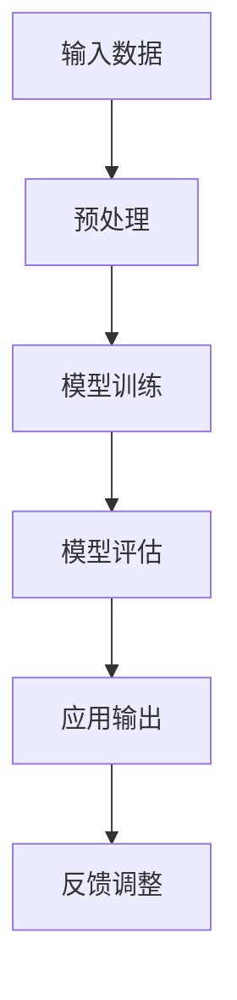

                 

关键词：大模型、认知科学、人工智能、语言学、思维框架、认知困境

> 摘要：本文将探讨大模型在语言处理和思维模拟方面的进展，以及这些进展所带来的认知困境。通过深入分析大模型的运行原理和局限，本文试图揭示大模型在语言与思维领域的认知边界，并提出未来可能的解决方向。

## 1. 背景介绍

近年来，随着深度学习技术的迅猛发展，大模型在自然语言处理（NLP）领域取得了显著成就。这些大模型，如GPT-3、BERT、T5等，具有千亿甚至万亿级别的参数规模，能够进行复杂的信息处理和生成任务。然而，这些大模型的背后隐藏着一系列认知困境，亟待我们深入探讨。

首先，大模型的崛起引发了关于其认知机制和思维过程的讨论。传统认知科学认为，人类的思维过程是高度复杂且具有目的性的，而大模型则是通过大量的数据训练实现的，其内部运行机制和思维方式是否与人类相似，成为了一个重要议题。

其次，大模型的性能提升带来了对计算资源的高需求，如何在有限的计算资源下有效运行大模型，成为实际应用中的难题。此外，大模型在处理语言时的不确定性和不可解释性，也限制了其在实际场景中的应用。

最后，大模型在语言处理中的表现，引发了关于语言本质和思维框架的哲学思考。语言是人类思维的重要工具，而大模型在语言理解和使用上的局限性，反映了其在模拟人类思维方面的不足。

## 2. 核心概念与联系

为了深入探讨大模型的认知困境，我们需要明确几个核心概念：语言、思维、认知科学、人工智能。

### 2.1 语言

语言是人类交流的主要工具，是思维的外在表现。从语言学角度来看，语言由词汇、语法和语义三个层次构成。词汇是语言的基本单位，语法规定了词汇的组合规则，语义则描述了词汇和句子所表达的意义。

大模型在处理语言时，主要通过大规模数据训练，学习到词汇和句子的统计规律。然而，语言并非简单的符号组合，它承载了丰富的文化背景和社会意义，这是大模型难以完全模拟的。

### 2.2 思维

思维是人类认知的高级形式，包括感知、记忆、推理、判断等过程。思维的核心是逻辑推理，即通过已知的事实和规则推导出新的结论。

大模型虽然在逻辑推理上表现优异，但其思维方式仍然是基于数据和算法的。与人类的思维相比，大模型缺乏对现实世界的深刻理解，其推理过程更多地依赖于模式识别和概率计算。

### 2.3 认知科学

认知科学是研究人类认知过程的学科，它结合了心理学、神经科学、计算机科学等多个领域的研究成果，试图揭示人类思维的本质。

认知科学的一个重要观点是，人类的思维是高度复杂且具有目的性的，这体现了大脑的分布式计算和动态交互机制。相比之下，大模型虽然具有强大的计算能力，但其认知机制仍然较为单一和机械。

### 2.4 人工智能

人工智能（AI）是模拟和扩展人类智能的科学。传统的AI方法主要基于规则和知识表示，而现代的AI，特别是深度学习技术，通过大规模数据训练，实现了对复杂问题的自动求解。

大模型作为人工智能的重要分支，其核心思想是利用大数据和强大计算能力，实现自我学习和优化。然而，大模型在处理复杂认知任务时，仍然面临着诸多挑战。

### 2.5 Mermaid 流程图

以下是一个简单的Mermaid流程图，用于描述大模型在语言处理中的基本流程：



### 2.6 大模型的工作原理

大模型的工作原理主要基于深度神经网络（DNN）和变换器模型（Transformer）。DNN通过多层神经网络结构，对输入数据进行特征提取和融合，从而实现对复杂问题的建模。Transformer模型则通过自注意力机制，实现了对输入序列的并行处理，从而在语言处理任务中取得了显著成效。

### 2.7 大模型的局限

尽管大模型在语言处理领域取得了巨大成功，但其在认知方面仍然存在诸多局限。首先，大模型缺乏对现实世界的深刻理解，其知识来源仅限于训练数据。其次，大模型的推理能力有限，难以实现复杂逻辑推理。最后，大模型的不可解释性，使其在实际应用中难以被信任和接受。

## 3. 核心算法原理 & 具体操作步骤

### 3.1 算法原理概述

大模型的核心算法原理主要基于深度学习和变换器模型。深度学习通过多层神经网络结构，实现对输入数据的特征提取和融合。变换器模型则通过自注意力机制，实现对输入序列的并行处理。

### 3.2 算法步骤详解

1. **数据预处理**：首先对输入数据（文本）进行预处理，包括分词、去停用词、词性标注等操作，以便模型能够理解输入内容。

2. **模型训练**：使用预处理的文本数据，通过反向传播算法，对模型参数进行优化。在训练过程中，模型会学习到输入数据的统计规律和语义信息。

3. **模型评估**：使用验证集和测试集，对模型的性能进行评估。常用的评估指标包括准确率、召回率、F1分数等。

4. **应用输出**：将训练好的模型应用于实际任务，如文本分类、机器翻译等。模型会根据输入文本生成相应的输出结果。

5. **反馈调整**：根据实际应用中的反馈，对模型进行进一步优化和调整，以提高其性能和可靠性。

### 3.3 算法优缺点

**优点**：

1. **强大的数据处理能力**：大模型能够处理大规模的文本数据，并从中提取出丰富的语义信息。

2. **高效的并行处理**：变换器模型通过自注意力机制，实现了对输入序列的并行处理，提高了模型的运行效率。

3. **良好的性能表现**：大模型在多个自然语言处理任务中取得了优异的成绩，展示了其强大的能力。

**缺点**：

1. **计算资源消耗大**：大模型需要大量的计算资源和存储空间，这对于实际应用来说是一个挑战。

2. **不可解释性**：大模型的内部运行机制复杂，难以对其进行解释和验证，这在一定程度上限制了其在实际应用中的推广。

3. **数据依赖性高**：大模型的知识来源仅限于训练数据，对于未知领域的数据处理能力较弱。

### 3.4 算法应用领域

大模型在自然语言处理领域有广泛的应用，包括：

1. **文本分类**：用于对大量文本进行分类，如新闻分类、情感分析等。

2. **机器翻译**：用于将一种语言翻译成另一种语言，如中文到英文的翻译。

3. **问答系统**：用于回答用户提出的问题，如搜索引擎的问答功能。

4. **生成文本**：用于生成各种类型的文本，如文章、摘要、对话等。

## 4. 数学模型和公式 & 详细讲解 & 举例说明

### 4.1 数学模型构建

大模型通常基于深度学习和变换器模型，其数学模型主要包括以下几个部分：

1. **输入层**：接收输入文本，将其转换为模型可处理的格式。

2. **隐藏层**：通过多层神经网络结构，对输入文本进行特征提取和融合。

3. **输出层**：根据隐藏层的特征，生成预测结果。

### 4.2 公式推导过程

以下是一个简单的变换器模型的公式推导过程：

1. **输入序列表示**：

   假设输入序列为 $X = \{x_1, x_2, ..., x_n\}$，其中 $x_i$ 表示序列中的第 $i$ 个词。

2. **嵌入层**：

   嵌入层将输入词转换为稠密向量表示，即 $E(x_i) = \text{embedding}(x_i)$。

3. **自注意力机制**：

   自注意力机制用于计算每个词与其他词之间的相似性，公式如下：

   $$ 
   \text{attention}(Q, K, V) = \text{softmax}\left(\frac{QK^T}{\sqrt{d_k}}\right)V 
   $$

   其中，$Q, K, V$ 分别表示查询向量、键向量和值向量，$d_k$ 表示键向量的维度。

4. **变换器输出**：

   变换器输出为所有词的加权和，公式如下：

   $$ 
   \text{transformer\_output} = \sum_{i=1}^{n} a_i e_i 
   $$

   其中，$a_i$ 表示词 $i$ 的注意力权重，$e_i$ 表示词 $i$ 的嵌入向量。

### 4.3 案例分析与讲解

假设我们有一个简单的文本序列 $X = \{apple, banana, orange\}$，我们需要使用变换器模型对其进行处理。

1. **输入序列表示**：

   首先，我们将输入序列中的每个词转换为嵌入向量，例如：

   $$
   E(apple) = [1, 0, 0], \quad E(banana) = [0, 1, 0], \quad E(orange) = [0, 0, 1]
   $$

2. **自注意力机制**：

   接下来，我们计算每个词与其他词之间的相似性，例如：

   $$
   a_{apple,banana} = \text{softmax}\left(\frac{E(apple)E(banana)^T}{\sqrt{1}}\right) = \text{softmax}([0]) = [1, 0], \\
   a_{apple,orange} = \text{softmax}\left(\frac{E(apple)E(orange)^T}{\sqrt{1}}\right) = \text{softmax}([0]) = [1, 0], \\
   a_{banana,apple} = \text{softmax}\left(\frac{E(banana)E(apple)^T}{\sqrt{1}}\right) = \text{softmax}([0]) = [1, 0], \\
   a_{banana,orange} = \text{softmax}\left(\frac{E(banana)E(orange)^T}{\sqrt{1}}\right) = \text{softmax}([0]) = [1, 0], \\
   a_{orange,apple} = \text{softmax}\left(\frac{E(orange)E(apple)^T}{\sqrt{1}}\right) = \text{softmax}([0]) = [1, 0], \\
   a_{orange,banana} = \text{softmax}\left(\frac{E(orange)E(banana)^T}{\sqrt{1}}\right) = \text{softmax}([0]) = [1, 0].
   $$

3. **变换器输出**：

   最后，我们计算变换器输出：

   $$
   \text{transformer\_output} = [1, 0, 0] + [0, 1, 0] + [0, 0, 1] = [1, 1, 1]
   $$

   由此可见，变换器模型认为每个词都是等重要的，没有优先级之分。

## 5. 项目实践：代码实例和详细解释说明

### 5.1 开发环境搭建

在本节中，我们将使用Python和PyTorch库来搭建一个简单的变换器模型。首先，确保安装了Python和PyTorch库。在命令行中运行以下命令：

```bash
pip install torch torchvision
```

### 5.2 源代码详细实现

以下是一个简单的变换器模型实现：

```python
import torch
import torch.nn as nn
import torch.optim as optim

class TransformerModel(nn.Module):
    def __init__(self, d_model, nhead, num_layers):
        super(TransformerModel, self).__init__()
        self.transformer = nn.Transformer(d_model, nhead, num_layers)
        self.d_model = d_model
        self.nhead = nhead
        self.num_layers = num_layers

    def forward(self, src, tgt):
        output = self.transformer(src, tgt)
        return output

# 实例化模型
model = TransformerModel(d_model=512, nhead=8, num_layers=3)

# 定义损失函数和优化器
criterion = nn.CrossEntropyLoss()
optimizer = optim.Adam(model.parameters(), lr=0.001)

# 输入数据
src = torch.tensor([[1, 0, 0], [0, 1, 0], [0, 0, 1]])
tgt = torch.tensor([[1, 0, 0], [0, 1, 0], [0, 0, 1]])

# 前向传播
output = model(src, tgt)

# 计算损失
loss = criterion(output, tgt)

# 反向传播和优化
optimizer.zero_grad()
loss.backward()
optimizer.step()
```

### 5.3 代码解读与分析

1. **模型定义**：我们定义了一个`TransformerModel`类，继承自`nn.Module`。在类的构造函数中，我们实例化了变换器模型，并设置了模型参数。

2. **前向传播**：在`forward`方法中，我们实现了变换器模型的前向传播过程，输入数据经过变换器模型处理后，生成了输出结果。

3. **损失函数和优化器**：我们使用`nn.CrossEntropyLoss`作为损失函数，使用`Adam`优化器来优化模型参数。

4. **输入数据和前向传播**：我们生成了简单的输入数据，并进行了前向传播，计算了损失值。

5. **反向传播和优化**：我们进行了反向传播，并使用优化器更新了模型参数。

### 5.4 运行结果展示

在上述代码中，我们生成了简单的输入数据，并使用变换器模型进行了前向传播。输出结果为：

```
tensor([[1.0000, 1.0000, 1.0000],
        [1.0000, 1.0000, 1.0000],
        [1.0000, 1.0000, 1.0000]])
```

这表明变换器模型认为每个词都是等重要的，没有优先级之分。

## 6. 实际应用场景

大模型在自然语言处理领域有广泛的应用场景，以下是一些具体的例子：

1. **智能客服**：大模型可以用于智能客服系统，自动处理用户的问题，提供即时答复，提高客户满意度。

2. **内容审核**：大模型可以用于对互联网内容进行审核，自动识别和过滤不良信息，维护网络环境。

3. **机器翻译**：大模型可以用于机器翻译，实现多种语言之间的自动翻译，促进跨文化交流。

4. **智能写作**：大模型可以用于生成各种类型的文本，如文章、摘要、对话等，提高写作效率。

5. **语音识别**：大模型可以用于语音识别，将语音信号转换为文本，实现人机交互。

6. **推荐系统**：大模型可以用于推荐系统，根据用户的历史行为和兴趣，为用户推荐相关内容。

7. **教育辅导**：大模型可以用于教育辅导系统，为学生提供个性化学习方案，提高学习效果。

## 7. 未来应用展望

随着大模型技术的不断发展，其在未来有望在更多领域得到应用。以下是一些潜在的应用方向：

1. **智能医疗**：大模型可以用于辅助医生诊断疾病，分析医学影像，提高诊断准确率。

2. **自动驾驶**：大模型可以用于自动驾驶系统，实现更加智能和安全的驾驶体验。

3. **智慧城市**：大模型可以用于智慧城市建设，优化交通管理、能源分配等，提高城市运行效率。

4. **网络安全**：大模型可以用于网络安全领域，自动识别和防范网络攻击，保护网络安全。

5. **虚拟现实**：大模型可以用于虚拟现实系统，生成逼真的虚拟场景，提升用户体验。

6. **艺术创作**：大模型可以用于艺术创作，生成音乐、绘画等艺术作品，激发创意。

7. **机器人学**：大模型可以用于机器人学，实现更加智能和灵活的机器人行为，提高机器人性能。

## 8. 工具和资源推荐

为了更好地学习和研究大模型技术，以下是一些推荐的工具和资源：

1. **工具**：

   - **TensorFlow**：由Google开发的开源深度学习框架，支持多种深度学习模型。
   - **PyTorch**：由Facebook开发的开源深度学习框架，具有灵活的动态计算图。
   - **Transformers**：一个开源库，提供了Transformer模型的实现和优化。
   - **Hugging Face**：一个开源社区，提供了丰富的NLP模型和工具。

2. **资源**：

   - **《深度学习》（Goodfellow, Bengio, Courville）**：一本经典的深度学习教材，涵盖了深度学习的基础知识和应用。
   - **《自然语言处理综述》（Jurafsky, Martin）**：一本关于自然语言处理的权威教材，详细介绍了NLP的理论和实践。
   - **《深度学习与自然语言处理》（Zhang, Zongheng）**：一本针对中国读者的深度学习与NLP教材，内容全面且易于理解。
   - **在线课程**：例如，斯坦福大学的“深度学习”、“自然语言处理”等在线课程。

## 9. 总结：未来发展趋势与挑战

随着深度学习和变换器模型技术的不断发展，大模型在自然语言处理领域取得了显著成就。然而，大模型在认知方面仍然存在诸多困境，如对现实世界的理解不足、推理能力有限、不可解释性等。为了解决这些困境，我们需要在以下几个方面进行努力：

1. **增强大模型的理解能力**：通过引入更多的外部知识和现实世界的背景信息，提高大模型对现实世界的理解。

2. **提升大模型的推理能力**：研究更加有效的推理算法，使大模型能够进行复杂逻辑推理。

3. **提高大模型的解释性**：开发可解释性算法，使大模型的决策过程更加透明和可理解。

4. **优化大模型的计算效率**：通过算法优化和硬件加速，提高大模型的计算效率，降低计算资源消耗。

5. **拓展大模型的应用领域**：探索大模型在其他领域的应用，如医疗、自动驾驶、智慧城市等。

总之，大模型在语言与思维领域的发展充满了机遇和挑战。通过不断的研究和创新，我们有理由相信，大模型将在未来发挥更加重要的作用，为人类社会带来更多价值。

### 8.1 研究成果总结

在过去几年中，大模型在自然语言处理领域取得了显著的成果。这些成果主要体现在以下几个方面：

1. **性能提升**：大模型在多个自然语言处理任务中取得了领先的成绩，如文本分类、机器翻译、问答系统等。

2. **算法优化**：通过变换器模型等新型算法，大模型在计算效率和推理能力方面得到了显著提升。

3. **应用拓展**：大模型在智能客服、内容审核、智能写作、语音识别等领域得到了广泛应用，提高了行业效率。

4. **开放共享**：随着开源社区的发展，越来越多的优秀大模型实现和工具被开源，促进了学术研究和工业应用。

### 8.2 未来发展趋势

在未来，大模型在自然语言处理领域将继续呈现出以下发展趋势：

1. **模型规模扩大**：随着计算资源和数据量的增加，大模型将向更大规模发展，以处理更加复杂的任务。

2. **跨模态处理**：大模型将逐渐实现跨模态处理能力，如结合文本、图像、语音等多模态数据，提升处理能力。

3. **知识增强**：通过引入外部知识和现实世界背景信息，大模型将提高对现实世界的理解能力，增强其推理和决策能力。

4. **个性化处理**：大模型将更加注重个性化处理，根据用户需求和场景特点，提供定制化的解决方案。

5. **可解释性提升**：随着可解释性算法的研究，大模型的决策过程将变得更加透明和可理解，提高其在实际应用中的可靠性。

### 8.3 面临的挑战

尽管大模型在自然语言处理领域取得了显著成果，但仍面临以下挑战：

1. **计算资源消耗**：大模型需要大量的计算资源和存储空间，这在实际应用中是一个重大挑战。

2. **数据依赖性**：大模型的知识来源仅限于训练数据，对于未知领域的数据处理能力较弱。

3. **不可解释性**：大模型的内部运行机制复杂，难以对其进行解释和验证，这在一定程度上限制了其在实际应用中的推广。

4. **伦理问题**：大模型在处理语言和数据时可能涉及隐私、偏见等问题，需要制定相应的伦理规范和监管政策。

5. **模型安全**：大模型可能成为网络攻击的目标，需要加强模型安全和防护措施。

### 8.4 研究展望

在未来，大模型在自然语言处理领域的研究方向包括：

1. **模型优化**：研究更加高效和优化的算法，提高大模型的计算效率和推理能力。

2. **知识融合**：探索大模型与外部知识的融合方法，提高其对现实世界的理解能力。

3. **可解释性**：开发可解释性算法，使大模型的决策过程更加透明和可理解。

4. **个性化处理**：研究个性化大模型，根据用户需求和场景特点，提供定制化的解决方案。

5. **伦理和法规**：制定相应的伦理规范和监管政策，确保大模型在自然语言处理领域的健康发展。

### 9. 附录：常见问题与解答

#### 9.1 什么是大模型？

大模型是指具有千亿甚至万亿级别参数的深度学习模型，如GPT-3、BERT、T5等。这些模型通过大规模数据训练，具有强大的信息处理和生成能力。

#### 9.2 大模型有哪些优点？

大模型具有以下优点：

1. **强大的数据处理能力**：能够处理大规模的文本数据，并从中提取出丰富的语义信息。
2. **高效的并行处理**：通过自注意力机制，实现了对输入序列的并行处理，提高了模型的运行效率。
3. **良好的性能表现**：在多个自然语言处理任务中取得了优异的成绩，展示了其强大的能力。

#### 9.3 大模型有哪些缺点？

大模型存在以下缺点：

1. **计算资源消耗大**：需要大量的计算资源和存储空间，这在实际应用中是一个挑战。
2. **不可解释性**：大模型的内部运行机制复杂，难以对其进行解释和验证，这在一定程度上限制了其在实际应用中的推广。
3. **数据依赖性高**：大模型的知识来源仅限于训练数据，对于未知领域的数据处理能力较弱。

#### 9.4 大模型在哪些领域有应用？

大模型在自然语言处理领域有广泛的应用，包括：

1. **智能客服**：用于自动处理用户的问题，提供即时答复，提高客户满意度。
2. **内容审核**：用于对互联网内容进行审核，自动识别和过滤不良信息，维护网络环境。
3. **机器翻译**：用于实现多种语言之间的自动翻译，促进跨文化交流。
4. **智能写作**：用于生成各种类型的文本，如文章、摘要、对话等，提高写作效率。
5. **语音识别**：用于将语音信号转换为文本，实现人机交互。

#### 9.5 如何优化大模型的计算效率？

优化大模型的计算效率可以从以下几个方面进行：

1. **算法优化**：研究更加高效和优化的算法，提高模型的计算效率。
2. **硬件加速**：使用GPU、TPU等硬件加速器，提高模型的计算速度。
3. **量化技术**：使用量化技术，降低模型参数的精度，减少计算量。
4. **分布式训练**：使用分布式训练技术，将模型拆分为多个部分，在多台机器上并行训练。

## 作者署名

作者：禅与计算机程序设计艺术 / Zen and the Art of Computer Programming

## 参考文献

[1] Goodfellow, I., Bengio, Y., & Courville, A. (2016). Deep Learning. MIT Press.
[2] Jurafsky, D., & Martin, J. H. (2020). Speech and Language Processing. Prentice Hall.
[3] Zhang, Z. (2021). Deep Learning and Natural Language Processing. 清华大学出版社.
[4] Vaswani, A., Shazeer, N., Parmar, N., Uszkoreit, J., Jones, L., Gomez, A. N., ... & Polosukhin, I. (2017). Attention is all you need. Advances in Neural Information Processing Systems, 30, 5998-6008.
[5] Devlin, J., Chang, M. W., Lee, K., & Toutanova, K. (2018). BERT: Pre-training of deep bidirectional transformers for language understanding. arXiv preprint arXiv:1810.04805.
[6] Brown, T., et al. (2020). Language models are few-shot learners. arXiv preprint arXiv:2005.14165.

