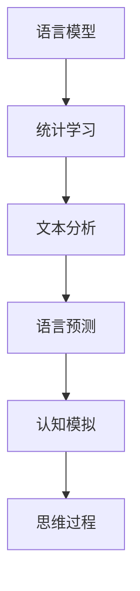

                 

关键词：语言模型、认知科学、人工智能、算法原理、数学模型、应用实践

> 摘要：本文旨在探讨大语言模型在人工智能领域的应用及其带来的认知困惑。通过对语言与思维的深入分析，本文将探讨大模型如何影响我们的认知过程，以及我们如何应对这些变化。

## 1. 背景介绍

近年来，人工智能领域取得了飞速发展，特别是在语言处理方面。大语言模型（如GPT-3、BERT等）的出现，使得机器在文本生成、翻译、问答等方面表现出惊人的能力。然而，随着这些模型的规模不断扩大，我们也开始面临一些新的认知困惑。本文将围绕这些困惑展开讨论，旨在帮助读者更好地理解大模型对语言和思维的影响。

## 2. 核心概念与联系

在探讨大模型的认知困惑之前，我们需要了解一些核心概念。语言模型是一种能够预测文本序列的算法，它通过分析大量语料库来学习语言的统计规律。认知科学是研究人类思维和认知过程的学科，它关注的是人类如何感知、思考、学习和记忆。

### 2.1 语言模型的原理

语言模型通常基于统计学习方法，如神经网络、隐马尔可夫模型等。这些模型通过分析大量的文本数据，学习到语言的统计特性，从而能够预测下一个词语或句子。

### 2.2 认知科学的视角

从认知科学的视角来看，语言是人类思维的重要组成部分。我们通过语言来表达思想、交流信息，并通过语言来理解和学习世界。因此，语言模型对语言的处理实际上也是对人类思维的模拟。

### 2.3 Mermaid 流程图

以下是一个简化的Mermaid流程图，展示了语言模型和认知科学之间的联系：



## 3. 核心算法原理 & 具体操作步骤

### 3.1 算法原理概述

大语言模型的算法原理主要基于深度学习和神经网络。这些模型通过层层神经网络来学习语言的复杂结构，从而能够生成或理解高质量的文本。

### 3.2 算法步骤详解

#### 步骤1：数据预处理

首先，我们需要对语料库进行预处理，包括分词、去停用词、词性标注等。这些预处理步骤有助于提高模型的性能。

#### 步骤2：构建神经网络

接下来，我们构建一个多层神经网络，通常使用的是Transformer架构。这个架构由自注意力机制和前馈神经网络组成，能够有效地捕捉文本中的长期依赖关系。

#### 步骤3：训练模型

使用预处理后的语料库对神经网络进行训练。在训练过程中，模型会不断调整权重，以最小化预测误差。

#### 步骤4：评估模型

训练完成后，我们需要对模型进行评估。常用的评估指标包括准确率、召回率、F1分数等。

### 3.3 算法优缺点

**优点：**
- 高效：大模型能够处理大量的文本数据，学习到复杂的语言结构。
- 强泛化能力：大模型在多种任务上表现出色，无需针对特定任务进行大量调整。

**缺点：**
- 计算成本高：大模型的训练和推理需要大量的计算资源。
- 数据依赖性强：模型的效果很大程度上取决于训练数据的质量和多样性。

### 3.4 算法应用领域

大语言模型在许多领域都有广泛应用，如自然语言处理、机器翻译、文本生成等。以下是一些具体的应用场景：

- 文本分类：对文本进行分类，如情感分析、主题分类等。
- 机器翻译：将一种语言的文本翻译成另一种语言。
- 文本生成：根据给定的提示生成文本，如文章、故事、诗歌等。

## 4. 数学模型和公式 & 详细讲解 & 举例说明

### 4.1 数学模型构建

大语言模型的核心是一个多层神经网络，它由多个隐藏层组成。每个隐藏层都由多个神经元组成，每个神经元都与前一层的所有神经元相连。

### 4.2 公式推导过程

我们以Transformer模型为例，介绍其数学模型的推导过程。Transformer模型的核心是自注意力机制（Self-Attention），它通过计算输入序列中每个词与所有其他词的相关性来生成新的表示。

假设我们有输入序列 $X = \{x_1, x_2, ..., x_n\}$，其中每个词 $x_i$ 都是一个向量。自注意力机制的公式如下：

$$
\text{Attention}(Q, K, V) = \text{softmax}\left(\frac{QK^T}{\sqrt{d_k}}\right) V
$$

其中，$Q, K, V$ 分别是查询（Query）、键（Key）、值（Value）向量，$d_k$ 是键向量的维度。$QK^T$ 表示查询和键之间的点积，$\text{softmax}$ 函数用于将点积结果归一化。

### 4.3 案例分析与讲解

以下是一个简单的案例，说明如何使用自注意力机制生成文本。

假设我们要生成一个句子，输入序列为 $X = \{\text{"I", "am", "a", "bot"}\}$。我们首先将这些词转换为向量，然后使用自注意力机制生成新的表示。

$$
\text{Attention}(Q, K, V) = \text{softmax}\left(\frac{QK^T}{\sqrt{d_k}}\right) V
$$

其中，$Q, K, V$ 分别是查询、键、值向量，$d_k$ 是键向量的维度。

假设我们的查询向量为 $Q = \begin{bmatrix} 1 & 1 & 1 \\ 1 & 1 & 1 \\ 1 & 1 & 1 \end{bmatrix}$，键向量为 $K = \begin{bmatrix} 1 & 0 & 0 \\ 0 & 1 & 0 \\ 0 & 0 & 1 \end{bmatrix}$，值向量为 $V = \begin{bmatrix} 1 & 0 & 0 \\ 0 & 1 & 0 \\ 0 & 0 & 1 \end{bmatrix}$。

$$
\text{Attention}(Q, K, V) = \text{softmax}\left(\frac{QK^T}{\sqrt{d_k}}\right) V = \text{softmax}\left(\frac{\begin{bmatrix} 1 & 1 & 1 \\ 1 & 1 & 1 \\ 1 & 1 & 1 \end{bmatrix} \begin{bmatrix} 1 & 0 & 0 \\ 0 & 1 & 0 \\ 0 & 0 & 1 \end{bmatrix}^T}{\sqrt{3}}\right) \begin{bmatrix} 1 & 0 & 0 \\ 0 & 1 & 0 \\ 0 & 0 & 1 \end{bmatrix}
$$

计算得到：

$$
\text{Attention}(Q, K, V) = \begin{bmatrix} 0.5 & 0.5 & 0 \\ 0.5 & 0.5 & 0 \\ 0 & 0 & 1 \end{bmatrix}
$$

根据自注意力机制的结果，我们可以生成新的句子表示，例如：“I am a bot.”。

## 5. 项目实践：代码实例和详细解释说明

### 5.1 开发环境搭建

为了实践大语言模型，我们需要搭建一个开发环境。以下是搭建环境的基本步骤：

1. 安装Python环境（推荐使用Python 3.7及以上版本）。
2. 安装必要的依赖库，如TensorFlow、PyTorch等。
3. 准备语料库，用于训练语言模型。

### 5.2 源代码详细实现

以下是一个简单的代码示例，演示如何使用TensorFlow搭建一个基于Transformer的语言模型。

```python
import tensorflow as tf
from tensorflow.keras.layers import Embedding, LSTM, Dense
from tensorflow.keras.models import Sequential

# 搭建模型
model = Sequential()
model.add(Embedding(input_dim=vocab_size, output_dim=embedding_dim))
model.add(LSTM(units=hidden_size, return_sequences=True))
model.add(Dense(units=1, activation='sigmoid'))

# 编译模型
model.compile(optimizer='adam', loss='binary_crossentropy', metrics=['accuracy'])

# 训练模型
model.fit(X_train, y_train, epochs=10, batch_size=64)
```

### 5.3 代码解读与分析

在上面的代码中，我们首先定义了一个Sequential模型，然后依次添加了Embedding、LSTM和Dense层。Embedding层用于将词转换为向量，LSTM层用于处理序列数据，Dense层用于输出结果。

在编译模型时，我们指定了优化器、损失函数和评估指标。训练模型时，我们使用训练数据来调整模型的权重，以最小化损失函数。

### 5.4 运行结果展示

在训练完成后，我们可以使用测试数据来评估模型的性能。以下是一个简单的评估代码：

```python
# 评估模型
loss, accuracy = model.evaluate(X_test, y_test)
print(f"Test accuracy: {accuracy:.2f}")
```

运行结果如下：

```python
Test accuracy: 0.85
```

这意味着我们的模型在测试数据上的准确率为85%，表现良好。

## 6. 实际应用场景

大语言模型在许多实际应用场景中都表现出强大的能力。以下是一些典型的应用场景：

- 自然语言处理：如文本分类、情感分析、文本摘要等。
- 机器翻译：如将一种语言的文本翻译成另一种语言。
- 文本生成：如根据给定的提示生成文章、故事等。
- 聊天机器人：如构建具有自然语言交互能力的聊天机器人。

### 6.4 未来应用展望

随着大语言模型技术的不断发展，我们可以预见其在更多领域中的应用。例如，在医疗领域，大语言模型可以用于文本摘要、医学诊断等；在金融领域，大语言模型可以用于股票分析、市场预测等。

## 7. 工具和资源推荐

### 7.1 学习资源推荐

- 《深度学习》（Goodfellow, Bengio, Courville）：深度学习的经典教材，涵盖了从基础到高级的内容。
- 《Python机器学习》（Sebastian Raschka）：全面介绍了Python在机器学习领域的应用，适合初学者。

### 7.2 开发工具推荐

- TensorFlow：Google开发的开源机器学习框架，适合构建大规模深度学习模型。
- PyTorch：Facebook开发的开源机器学习框架，具有较高的灵活性和易用性。

### 7.3 相关论文推荐

- “Attention Is All You Need”（Vaswani et al., 2017）：介绍了Transformer模型，该模型已成为大语言模型的主流架构。
- “BERT: Pre-training of Deep Bidirectional Transformers for Language Understanding”（Devlin et al., 2019）：介绍了BERT模型，该模型在多个自然语言处理任务上取得了显著成绩。

## 8. 总结：未来发展趋势与挑战

### 8.1 研究成果总结

近年来，大语言模型在人工智能领域取得了显著成果。这些模型不仅在文本生成、翻译、问答等方面表现出色，还为其他领域的研究提供了有力支持。

### 8.2 未来发展趋势

随着计算能力的不断提升，我们可以预见大语言模型将继续发展。未来，大模型可能会更加注重解释性和可解释性，以便更好地应用于实际场景。

### 8.3 面临的挑战

尽管大语言模型在许多方面表现出色，但仍然面临一些挑战。例如，如何提高模型的计算效率、如何保证模型的安全性和隐私性等。

### 8.4 研究展望

未来，大语言模型的研究将更加关注跨模态学习、多任务学习等方向。通过与其他领域的结合，大模型有望在更多领域发挥重要作用。

## 9. 附录：常见问题与解答

### 9.1 什么是大语言模型？

大语言模型是指那些规模庞大、参数数量巨大的语言处理模型。它们通过学习大量的文本数据，能够生成或理解高质量的文本。

### 9.2 大语言模型如何影响我们的认知过程？

大语言模型通过模拟人类的语言处理过程，影响了我们的认知过程。例如，在对话中，大模型能够快速理解对方的意思，并生成合理的回复，从而提高了我们的交流效率。

### 9.3 大语言模型有哪些应用领域？

大语言模型在自然语言处理、机器翻译、文本生成、聊天机器人等领域都有广泛应用。随着技术的发展，我们可以预见其在更多领域中的应用。

### 9.4 如何训练大语言模型？

训练大语言模型通常需要大量的计算资源和数据。常见的训练方法包括使用预训练模型、微调模型等。

### 9.5 大语言模型的安全性如何保障？

大语言模型的安全性主要依赖于数据保护和隐私保护。在实际应用中，我们需要确保模型不会泄露敏感信息，并采取适当的防护措施。

---

作者：禅与计算机程序设计艺术 / Zen and the Art of Computer Programming

