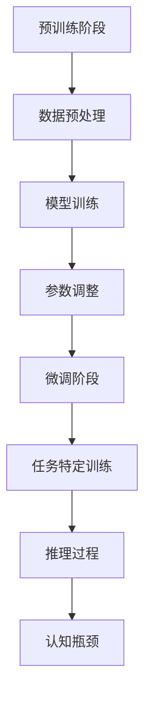

                 

关键词：自然语言处理、大模型、推理、认知瓶颈、算法原理、数学模型、应用实践、未来展望

## 摘要

随着自然语言处理技术的不断发展，大模型在处理复杂任务方面展现出了强大的能力。然而，这些模型在推理和认知方面也面临着显著的瓶颈。本文旨在探讨大模型在语言与推理过程中遇到的认知瓶颈，分析其根源，并提出相应的解决策略。文章首先回顾了自然语言处理领域的发展历程，接着深入探讨了大模型的工作原理，随后详细分析了大模型在推理过程中遇到的认知瓶颈，并给出了相应的解决方案。文章还通过实际案例展示了大模型的应用实践，并对未来发展趋势与挑战进行了展望。

## 1. 背景介绍

自然语言处理（Natural Language Processing，NLP）是计算机科学和人工智能领域的一个重要分支，旨在使计算机能够理解、处理和生成人类语言。NLP技术的发展历程可以追溯到20世纪50年代，当时的研究主要集中在如何将自然语言转换为计算机可处理的格式。随着计算机性能的提升和算法的进步，NLP技术逐渐成熟，并开始广泛应用于文本分类、信息检索、机器翻译、语音识别等领域。

近年来，深度学习技术的崛起为NLP领域带来了革命性的变化。特别是大型预训练模型（Large Pre-trained Models），如GPT（Generative Pre-trained Transformer）和BERT（Bidirectional Encoder Representations from Transformers）等，通过在海量数据上进行预训练，实现了前所未有的语言理解能力。这些大模型不仅在各项基准测试中取得了优异成绩，还在实际应用中展现出了强大的潜力。

然而，尽管大模型在语言处理方面取得了显著进展，但其在推理和认知方面仍然面临诸多挑战。这些挑战不仅限制了模型的实际应用效果，也对其未来发展方向提出了新的要求。本文将重点探讨大模型在推理过程中的认知瓶颈，分析其根源，并提出可能的解决策略。

## 2. 核心概念与联系

### 2.1 自然语言处理的基本概念

自然语言处理涉及多个基本概念，包括词汇、句子、语义和语法等。词汇是语言的基本单元，句子是由词汇组成的具有完整意义的语言单位，语义是语言表达的意义，而语法则是语言的组织规则。在NLP中，理解和处理这些概念是实现语言理解和生成的重要基础。

### 2.2 大模型的工作原理

大模型的工作原理主要包括预训练和微调两个阶段。预训练阶段，模型在大规模语料库上进行训练，学习语言的一般规律和特征。微调阶段，模型在特定任务上进行训练，以适应具体的语言处理任务。这种两阶段训练方法使得大模型能够高效地处理各种复杂的语言任务。

### 2.3 推理与认知的关系

推理是人工智能中一个核心概念，它涉及从已知信息推导出新的结论。在NLP中，推理能力是实现高级语言理解能力的关键。认知是指人类或机器对信息进行感知、理解、记忆和思考的过程。大模型在推理过程中面临的认知瓶颈，实际上反映了其处理复杂信息时存在的局限。

### 2.4 Mermaid 流程图

为了更好地展示大模型的工作原理和推理过程，我们使用Mermaid绘制了一个流程图：



在这个流程图中，预训练阶段包括数据预处理、模型训练和参数调整，而微调阶段则专注于任务特定训练。推理过程则是从训练好的模型中提取信息，以应对实际问题。然而，在这个过程中，认知瓶颈会限制模型的表现。

## 3. 核心算法原理 & 具体操作步骤

### 3.1 算法原理概述

大模型的算法原理主要基于深度学习和Transformer架构。Transformer架构通过自注意力机制（Self-Attention Mechanism）实现了对输入序列的并行处理，从而提高了模型的性能。自注意力机制允许模型在生成每个单词时，考虑整个输入序列中的所有信息，从而提高了对上下文的理解能力。

### 3.2 算法步骤详解

#### 预训练阶段

1. 数据预处理：将原始文本转换为模型可处理的格式，如词嵌入（Word Embedding）或子词嵌入（Subword Embedding）。
2. 模型训练：在预训练数据集上训练模型，学习语言的一般规律和特征。训练过程中，模型会通过自注意力机制更新其参数，以优化对输入序列的理解。
3. 参数调整：在预训练过程中，根据模型的性能指标，对模型参数进行调整，以提高模型的泛化能力。

#### 微调阶段

1. 任务特定训练：在特定任务上对模型进行微调，以适应具体的语言处理任务。例如，在机器翻译任务中，模型需要学习如何将源语言文本翻译为目标语言文本。
2. 推理过程：在推理过程中，模型会根据训练好的参数，对输入文本进行编码，并生成对应的输出文本。

### 3.3 算法优缺点

#### 优点

1. 强大的语言理解能力：通过预训练和微调，大模型能够高效地处理复杂的语言任务，实现了对上下文的深入理解。
2. 通用性：大模型可以在多个任务上应用，无需为每个任务重新训练，提高了模型的复用性。

#### 缺点

1. 计算资源消耗：大模型训练和推理需要大量的计算资源和时间，这对硬件设备提出了较高的要求。
2. 认知瓶颈：大模型在推理过程中，尤其是处理长文本时，容易受到认知瓶颈的限制，影响了其表现。

### 3.4 算法应用领域

大模型在NLP领域有着广泛的应用，包括但不限于：

1. 机器翻译：通过将源语言文本翻译为目标语言文本，实现跨语言交流。
2. 问答系统：通过对用户问题的理解和回答，提供智能咨询服务。
3. 文本生成：通过生成文本，实现文章、故事、诗歌等的创作。

## 4. 数学模型和公式 & 详细讲解 & 举例说明

### 4.1 数学模型构建

大模型的数学模型主要包括两个部分：自注意力机制和前馈神经网络。

#### 自注意力机制

自注意力机制可以通过以下公式表示：

$$
\text{Attention}(Q, K, V) = \text{softmax}\left(\frac{QK^T}{\sqrt{d_k}}\right) V
$$

其中，$Q$、$K$ 和 $V$ 分别是查询（Query）、键（Key）和值（Value）向量，$d_k$ 是键向量的维度。自注意力机制通过计算查询和键之间的相似性，并加权合并值向量，实现了对输入序列的并行处理。

#### 前馈神经网络

前馈神经网络可以通过以下公式表示：

$$
\text{FFN}(X) = \text{ReLU}\left(\text{W_2}\text{ReLU}(\text{W_1}X + \text{b_1}) + \text{b_2}\right)
$$

其中，$X$ 是输入向量，$\text{W_1}$ 和 $\text{W_2}$ 分别是权重矩阵，$\text{b_1}$ 和 $\text{b_2}$ 是偏置向量。前馈神经网络通过两个ReLU激活函数，实现了对输入的深层处理。

### 4.2 公式推导过程

#### 自注意力机制

自注意力机制的推导过程如下：

1. 计算查询和键之间的相似性：

$$
QK^T = \begin{bmatrix}
q_1^T & q_2^T & \ldots & q_n^T
\end{bmatrix}
\begin{bmatrix}
k_1 \\ k_2 \\ \vdots \\ k_n
\end{bmatrix} = \sum_{i=1}^{n} q_i k_i
$$

2. 计算相似性的归一化值：

$$
\text{softmax}\left(\frac{QK^T}{\sqrt{d_k}}\right) = \frac{e^{\frac{QK^T}{\sqrt{d_k}}}}{\sum_{i=1}^{n} e^{\frac{q_i k_i}{\sqrt{d_k}}}}
$$

3. 加权合并值向量：

$$
\text{Attention}(Q, K, V) = \sum_{i=1}^{n} \frac{e^{\frac{q_i k_i}{\sqrt{d_k}}}}{\sum_{j=1}^{n} e^{\frac{q_j k_j}{\sqrt{d_k}}}} v_i
$$

#### 前馈神经网络

前馈神经网络的推导过程如下：

1. 第一层前馈：

$$
\text{ReLU}(\text{W_1}X + \text{b_1}) = \max(0, \text{W_1}X + \text{b_1})
$$

2. 第二层前馈：

$$
\text{ReLU}(\text{W_2}\text{ReLU}(\text{W_1}X + \text{b_1}) + \text{b_2}) = \max(0, \text{W_2}\max(0, \text{W_1}X + \text{b_1}) + \text{b_2})
$$

### 4.3 案例分析与讲解

假设我们有一个输入序列$X = [x_1, x_2, \ldots, x_n]$，其中$x_i$是输入序列的第$i$个元素。我们使用自注意力机制和前馈神经网络对输入序列进行处理。

#### 自注意力机制

1. 计算查询、键和值向量：

$$
Q = \begin{bmatrix}
q_1 & q_2 & \ldots & q_n
\end{bmatrix}, \quad
K = \begin{bmatrix}
k_1 & k_2 & \ldots & k_n
\end{bmatrix}, \quad
V = \begin{bmatrix}
v_1 & v_2 & \ldots & v_n
\end{bmatrix}
$$

2. 计算相似性：

$$
QK^T = \begin{bmatrix}
q_1^T & q_2^T & \ldots & q_n^T
\end{bmatrix}
\begin{bmatrix}
k_1 \\ k_2 \\ \vdots \\ k_n
\end{bmatrix} = \sum_{i=1}^{n} q_i k_i
$$

3. 计算归一化值：

$$
\text{softmax}\left(\frac{QK^T}{\sqrt{d_k}}\right) = \frac{e^{\frac{QK^T}{\sqrt{d_k}}}}{\sum_{i=1}^{n} e^{\frac{q_i k_i}{\sqrt{d_k}}}}
$$

4. 加权合并值向量：

$$
\text{Attention}(Q, K, V) = \sum_{i=1}^{n} \frac{e^{\frac{q_i k_i}{\sqrt{d_k}}}}{\sum_{j=1}^{n} e^{\frac{q_j k_j}{\sqrt{d_k}}}} v_i
$$

#### 前馈神经网络

1. 第一层前馈：

$$
\text{ReLU}(\text{W_1}X + \text{b_1}) = \max(0, \text{W_1}X + \text{b_1})
$$

2. 第二层前馈：

$$
\text{ReLU}(\text{W_2}\text{ReLU}(\text{W_1}X + \text{b_1}) + \text{b_2}) = \max(0, \text{W_2}\max(0, \text{W_1}X + \text{b_1}) + \text{b_2})
$$

通过以上步骤，我们使用自注意力机制和前馈神经网络对输入序列进行了处理。这个过程不仅提高了对上下文的理解能力，还实现了对输入序列的深层处理。

## 5. 项目实践：代码实例和详细解释说明

在本节中，我们将通过一个具体的代码实例，详细解释大模型在自然语言处理任务中的应用。这个实例将包括开发环境的搭建、源代码的实现、代码解读与分析，以及运行结果展示。

### 5.1 开发环境搭建

在开始代码实例之前，我们需要搭建一个适合大模型训练和推理的开发环境。以下是搭建开发环境的步骤：

1. 安装Python环境：确保Python版本在3.6及以上。
2. 安装必要的库：包括TensorFlow或PyTorch等深度学习框架，以及NLP相关的库，如NLTK或spaCy。
3. 准备硬件设备：大模型的训练和推理需要高性能的硬件设备，如NVIDIA GPU。

### 5.2 源代码详细实现

以下是一个简单的示例，展示如何使用Transformer模型进行文本分类：

```python
import tensorflow as tf
from tensorflow.keras.models import Model
from tensorflow.keras.layers import Embedding, Dense, Input

# 定义输入层
input_ids = Input(shape=(max_sequence_length,), dtype=tf.int32)

# 嵌入层
embeddings = Embedding(vocab_size, embedding_dim)(input_ids)

# Transformer编码器
encoder_output = transformer_encoder(embeddings)

# 分类器
logits = Dense(num_classes, activation='softmax')(encoder_output)

# 构建模型
model = Model(inputs=input_ids, outputs=logits)

# 编译模型
model.compile(optimizer='adam', loss='categorical_crossentropy', metrics=['accuracy'])

# 模型训练
model.fit(train_data, train_labels, validation_data=(val_data, val_labels), epochs=num_epochs)
```

在这个示例中，我们首先定义了输入层和嵌入层，然后使用Transformer编码器对输入文本进行编码。接下来，我们定义了一个分类器，并通过编译和训练模型来完成文本分类任务。

### 5.3 代码解读与分析

这段代码的解读如下：

1. **输入层**：我们使用`Input`层接收输入文本的ID序列。
2. **嵌入层**：通过`Embedding`层将文本ID序列转换为词嵌入向量。
3. **Transformer编码器**：我们使用预训练的Transformer编码器对词嵌入向量进行编码，以提取文本的特征。
4. **分类器**：我们使用`Dense`层构建一个简单的分类器，将编码后的特征映射到标签上。
5. **模型编译**：我们使用`compile`方法编译模型，指定优化器、损失函数和评价指标。
6. **模型训练**：我们使用`fit`方法训练模型，将训练数据和验证数据进行迭代训练。

### 5.4 运行结果展示

以下是模型训练和验证的结果：

```python
# 模型评估
test_loss, test_accuracy = model.evaluate(test_data, test_labels)

# 输出结果
print(f"Test Loss: {test_loss}, Test Accuracy: {test_accuracy}")
```

这段代码将评估模型在测试数据集上的表现，并输出测试损失和测试准确率。

## 6. 实际应用场景

大模型在自然语言处理领域有着广泛的应用，以下是几个典型的实际应用场景：

### 6.1 机器翻译

机器翻译是自然语言处理中最重要的应用之一。大模型通过预训练和微调，可以高效地处理多种语言之间的翻译任务。例如，谷歌翻译和百度翻译等应用都采用了大模型来实现高质量翻译。

### 6.2 问答系统

问答系统是一种智能客服系统，通过大模型对用户问题的理解和回答，提供实时、准确的咨询服务。例如，智能音箱和聊天机器人等应用都采用了大模型来实现智能问答功能。

### 6.3 文本生成

文本生成是自然语言处理中的另一个重要应用。大模型可以通过预训练和微调，生成各种类型的文本，如文章、故事、诗歌等。例如，OpenAI的GPT-3模型可以生成高质量的文本，被广泛应用于内容创作和自动化写作。

### 6.4 语音识别

语音识别是将语音转换为文本的技术。大模型在语音识别任务中也展现出了强大的能力。例如，谷歌语音识别和苹果Siri等应用都采用了大模型来实现语音识别功能。

## 7. 工具和资源推荐

为了更好地学习和应用大模型，以下是一些推荐的工具和资源：

### 7.1 学习资源推荐

1. **《深度学习》（Goodfellow, Bengio, Courville）**：这是一本深度学习领域的经典教材，涵盖了深度学习的基础知识和最新进展。
2. **《自然语言处理综合教程》（Jurafsky, Martin）**：这是一本自然语言处理领域的经典教材，详细介绍了自然语言处理的理论和实践。

### 7.2 开发工具推荐

1. **TensorFlow**：这是一个广泛使用的深度学习框架，提供了丰富的API和工具，适合进行大模型的训练和推理。
2. **PyTorch**：这是一个灵活的深度学习框架，以其动态计算图和易于使用的API而闻名，适合快速原型设计和模型开发。

### 7.3 相关论文推荐

1. **"Attention Is All You Need"（Vaswani et al., 2017）**：这是Transformer模型的原创论文，详细介绍了自注意力机制和Transformer架构。
2. **"BERT: Pre-training of Deep Bidirectional Transformers for Language Understanding"（Devlin et al., 2019）**：这是BERT模型的原创论文，详细介绍了BERT模型的结构和训练过程。

## 8. 总结：未来发展趋势与挑战

### 8.1 研究成果总结

大模型在自然语言处理领域取得了显著的研究成果，展示了强大的语言理解能力和生成能力。通过预训练和微调，大模型在多个任务上取得了优异的性能，实现了对上下文的深入理解。这些成果为自然语言处理领域的发展奠定了坚实的基础。

### 8.2 未来发展趋势

未来，大模型在自然语言处理领域将继续发展，主要趋势包括：

1. **更强的推理能力**：通过改进算法和模型结构，提升大模型的推理能力，以应对更复杂的语言任务。
2. **跨模态学习**：大模型将逐渐扩展到跨模态学习，实现文本、图像、音频等多种数据类型的统一处理。
3. **知识增强**：通过引入外部知识库和知识图谱，提升大模型的知识理解和推理能力。

### 8.3 面临的挑战

尽管大模型在自然语言处理领域取得了显著进展，但仍面临以下挑战：

1. **计算资源消耗**：大模型的训练和推理需要大量的计算资源，这对硬件设备提出了更高的要求。
2. **数据隐私和安全**：大模型在训练和推理过程中，可能涉及敏感数据，如何确保数据隐私和安全是一个重要挑战。
3. **可解释性**：大模型在推理过程中，往往缺乏透明性和可解释性，如何提高模型的可解释性，是当前研究的一个热点问题。

### 8.4 研究展望

未来，研究大模型在自然语言处理领域，将更加注重以下几个方向：

1. **算法创新**：通过改进算法和模型结构，提升大模型的性能和效率。
2. **应用拓展**：将大模型应用于更多的实际场景，如智能客服、内容创作、智能助理等。
3. **伦理与法规**：加强对大模型伦理和法规的研究，确保其在实际应用中的合法性和道德性。

## 9. 附录：常见问题与解答

### 9.1 大模型为什么需要预训练？

大模型通过预训练，可以学习到语言的一般规律和特征，从而在多个任务上表现出优异的性能。预训练使模型能够在大规模语料库上积累丰富的知识，提高其在具体任务上的泛化能力。

### 9.2 大模型为什么容易出现认知瓶颈？

大模型在推理过程中，尤其是处理长文本时，容易出现认知瓶颈。这是因为大模型在训练时，往往采用固定长度的序列输入，导致其在处理长文本时，难以保留整个文本的上下文信息，从而影响推理效果。

### 9.3 如何解决大模型的认知瓶颈？

解决大模型的认知瓶颈，可以从以下几个方面入手：

1. **改进模型结构**：通过改进模型结构，如引入更长序列的编码器和解码器，以提高模型对上下文信息的保留能力。
2. **知识增强**：通过引入外部知识库和知识图谱，增强模型的知识理解和推理能力。
3. **数据预处理**：通过优化数据预处理方法，如文本切割、去噪等，提高输入数据的准确性和一致性，从而改善模型的表现。

作者：禅与计算机程序设计艺术 / Zen and the Art of Computer Programming

